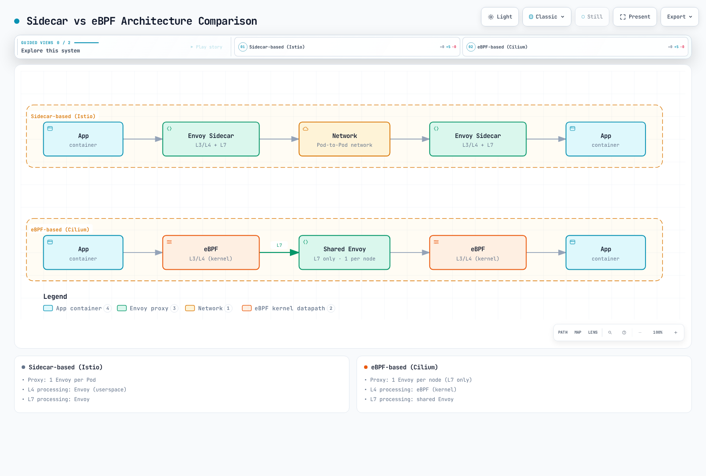
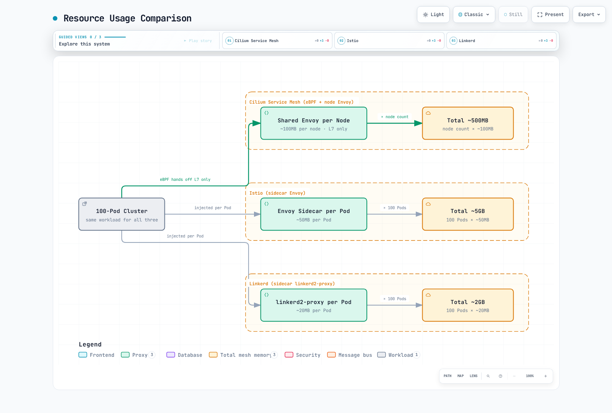

# Cilium Service Mesh Overview

> **Supported Versions**: Cilium 1.16+, Kubernetes 1.28+
> **Last Updated**: February 22, 2026

## Introduction

Cilium Service Mesh is an eBPF-based sidecar-free service mesh solution. Unlike traditional sidecar proxy approaches, Cilium Service Mesh leverages Linux kernel's eBPF technology to process network traffic and uses a single shared Envoy proxy per node to provide L7 functionality.

### Key Value Proposition

The core value of Cilium Service Mesh is a **unified networking and service mesh platform**:

1. **Resource Efficiency**: Service mesh features without sidecar proxy overhead
2. **Low Latency**: Kernel-level packet processing through eBPF
3. **Simple Operations**: CNI and service mesh integrated into a single component
4. **Gradual Adoption**: Existing Cilium CNI users can easily extend to service mesh
5. **Strong Security**: SPIFFE-based identity and transparent mTLS support

## Sidecar vs Sidecarless Architecture


[🔍 View interactive diagram](https://www.atomai.click/kubernetes-docs/archmaps/en-service-mesh-cilium-service-mesh-readme-0.html)

### Architecture Comparison Diagram



[🔍 View interactive diagram](https://www.atomai.click/kubernetes-docs/archmaps/en-service-mesh-cilium-service-mesh-readme-1.html)

## Service Mesh Comparison

| Feature | Cilium Service Mesh | Istio | Linkerd |
|---------|---------------------|-------|---------|
| **Architecture** | eBPF + Node Envoy | Sidecar Envoy | Sidecar linkerd2-proxy |
| **Proxy** | 1 per node (L7 only) | 1 per Pod | 1 per Pod |
| **Memory Overhead** | Low (~50-100MB/node) | High (~50MB/Pod) | Medium (~20MB/Pod) |
| **CPU Overhead** | Very Low | High | Medium |
| **Latency** | ~0.1-0.5ms | ~1-3ms | ~0.5-1ms |
| **L4 Processing** | eBPF (kernel) | Envoy (userspace) | linkerd2-proxy |
| **L7 Processing** | Envoy | Envoy | linkerd2-proxy |
| **mTLS** | Transparent (eBPF/WireGuard) | Sidecar Envoy | linkerd2-proxy |
| **CNI Integration** | Native | Requires separate CNI | Requires separate CNI |
| **Installation Complexity** | Low | High | Medium |
| **Gateway API** | Full support | Full support | Partial support |
| **Network Policy** | CiliumNetworkPolicy (L3-L7) | AuthorizationPolicy | Server (L4) |
| **Observability** | Hubble (native) | Kiali, Jaeger | Linkerd Viz |

### Resource Usage Comparison



[🔍 View interactive diagram](https://www.atomai.click/kubernetes-docs/archmaps/en-service-mesh-cilium-service-mesh-readme-2.html)

## When to Choose Cilium Service Mesh

### Suitable Use Cases

1. **Already Using Cilium CNI**
   - Leverage existing Cilium investment
   - Enable service mesh features without additional components
   - Unified operations and monitoring

2. **Resource Efficiency is Critical**
   - Eliminate sidecar overhead in large clusters
   - Node resource optimization required
   - Cost reduction is important

3. **Low Latency is Essential**
   - High-performance workloads
   - Real-time applications
   - Financial/trading systems

4. **Simple Operations Desired**
   - Single component for CNI + service mesh
   - No sidecar injection management needed
   - Simplified upgrades and troubleshooting

### Unsuitable Use Cases

1. **Large Existing Istio Investment**
   - Complex Istio policies already implemented
   - Dependency on Istio-specific features

2. **Extensive Envoy Extensions Required**
   - Per-sidecar custom filters
   - Fine-grained per-Pod proxy settings

3. **Complex Multi-cluster Mesh**
   - Need for Istio's mature multi-cluster features

## Prerequisites

### Verify Cilium CNI Installation

Cilium Service Mesh requires Cilium CNI to be installed first:

```bash
# Check Cilium status
cilium status

# Expected output
    /¯¯\
 /¯¯\__/¯¯\    Cilium:             OK
 \__/¯¯\__/    Operator:           OK
 /¯¯\__/¯¯\    Envoy DaemonSet:    OK
 \__/¯¯\__/    Hubble Relay:       OK
    \__/       ClusterMesh:        disabled

# Check Cilium version
cilium version
```

### Installing Cilium on EKS

```bash
# Add Helm repository
helm repo add cilium https://helm.cilium.io/
helm repo update

# Install Cilium on EKS (with service mesh features)
helm install cilium cilium/cilium --version 1.16.0 \
  --namespace kube-system \
  --set eni.enabled=true \
  --set ipam.mode=eni \
  --set egressMasqueradeInterfaces=eth0 \
  --set routingMode=native \
  --set kubeProxyReplacement=true \
  --set loadBalancer.algorithm=maglev \
  --set envoy.enabled=true \
  --set hubble.enabled=true \
  --set hubble.relay.enabled=true \
  --set hubble.ui.enabled=true
```

### Required Components

| Component | Role | Required |
|-----------|------|----------|
| Cilium Agent | eBPF program management, policy enforcement | Required |
| Cilium Operator | CRD management, IPAM | Required |
| Envoy (cilium-envoy) | L7 proxy processing | Required for service mesh |
| Hubble | Observability | Recommended |
| Hubble Relay | UI/CLI connectivity | Recommended |
| Hubble UI | Visualization | Optional |

## Enabling Service Mesh Features

### Basic Enablement

```yaml
# values.yaml
envoy:
  enabled: true

# Default configuration for L7 proxy policy enforcement
proxy:
  enabled: true
```

### Full Service Mesh Configuration

```yaml
# values.yaml - Full service mesh features
envoy:
  enabled: true
  resources:
    limits:
      cpu: 2000m
      memory: 2Gi
    requests:
      cpu: 100m
      memory: 256Mi

# Hubble observability
hubble:
  enabled: true
  relay:
    enabled: true
  ui:
    enabled: true
  metrics:
    enabled:
      - dns
      - drop
      - tcp
      - flow
      - icmp
      - http

# Mutual authentication (mTLS)
authentication:
  mutual:
    spire:
      enabled: true
      install:
        enabled: true

# Ingress Controller
ingressController:
  enabled: true
  loadbalancerMode: shared

# Gateway API
gatewayAPI:
  enabled: true
```

## Document Structure

This section is organized as follows:

| Document | Description |
|----------|-------------|
| [Architecture](./01-architecture.md) | eBPF datapath, Node Envoy, CRD model |
| [Traffic Management](./02-traffic-management.md) | L7 routing, load balancing, traffic splitting |
| [Security](./03-security.md) | mTLS, network policies, encryption |
| [Observability](./04-observability.md) | Hubble, metrics, service maps |
| [Ingress & Gateway](./05-ingress-gateway.md) | Ingress Controller, Gateway API |
| [Best Practices](./06-best-practices.md) | Production deployment, migration, tuning |

## Quick Start

### 1. Verify Service Mesh Features

```bash
# Check Envoy DaemonSet
kubectl get daemonset -n kube-system cilium-envoy

# Check Cilium service mesh status
cilium status | grep -E "Envoy|Hubble"
```

### 2. Deploy Sample Application

```yaml
# bookinfo.yaml
apiVersion: v1
kind: Namespace
metadata:
  name: bookinfo
---
apiVersion: apps/v1
kind: Deployment
metadata:
  name: productpage
  namespace: bookinfo
spec:
  replicas: 1
  selector:
    matchLabels:
      app: productpage
  template:
    metadata:
      labels:
        app: productpage
    spec:
      containers:
      - name: productpage
        image: docker.io/istio/examples-bookinfo-productpage-v1:1.18.0
        ports:
        - containerPort: 9080
---
apiVersion: v1
kind: Service
metadata:
  name: productpage
  namespace: bookinfo
spec:
  selector:
    app: productpage
  ports:
  - port: 9080
    targetPort: 9080
```

### 3. Apply L7 Policy

```yaml
# l7-policy.yaml
apiVersion: cilium.io/v2
kind: CiliumNetworkPolicy
metadata:
  name: productpage-l7
  namespace: bookinfo
spec:
  endpointSelector:
    matchLabels:
      app: productpage
  ingress:
  - fromEndpoints:
    - matchLabels:
        app: frontend
    toPorts:
    - ports:
      - port: "9080"
        protocol: TCP
      rules:
        http:
        - method: GET
          path: "/productpage"
        - method: GET
          path: "/health"
```

### 4. Observe Traffic

```bash
# Observe L7 traffic with Hubble CLI
hubble observe --namespace bookinfo -f

# Filter HTTP requests
hubble observe --namespace bookinfo --protocol http

# Check inter-service flows
hubble observe --namespace bookinfo --to-service productpage
```

## Next Steps

1. **[Architecture](./01-architecture.md)**: Understand the internal workings of Cilium Service Mesh.
2. **[Traffic Management](./02-traffic-management.md)**: Configure L7 routing and traffic control.
3. **[Security](./03-security.md)**: Set up mTLS and L7 network policies.

## References

- [Cilium Official Documentation](https://docs.cilium.io/)
- [Cilium Service Mesh Guide](https://docs.cilium.io/en/stable/network/servicemesh/)
- [eBPF Introduction](https://ebpf.io/)
- [Gateway API Documentation](https://gateway-api.sigs.k8s.io/)
