# Basic Concepts

This document explains Istio's core concepts and architecture. Understanding these basic concepts is important for effectively using Istio.

## Table of Contents

1. [Background and History](02-basic-concepts.md#background-and-history)
2. [Why Istio?](02-basic-concepts.md#why-istio)
3. [Istio Architecture](02-basic-concepts.md#istio-architecture)
4. [Deployment Modes: Sidecar vs Ambient](02-basic-concepts.md#deployment-modes-sidecar-vs-ambient)
5. [Core Resources](02-basic-concepts.md#core-resources)
6. [Traffic Management Concepts](02-basic-concepts.md#traffic-management-concepts)
7. [Security Concepts](02-basic-concepts.md#security-concepts)
8. [Observability Concepts](02-basic-concepts.md#observability-concepts)
9. [Namespaces and Service Mesh](02-basic-concepts.md#namespaces-and-service-mesh)
10. [Next Steps](02-basic-concepts.md#next-steps)

## Background and History

### The Birth of Service Mesh

#### Microservices Challenges

In the early 2010s, companies began breaking down monolithic applications into microservices.

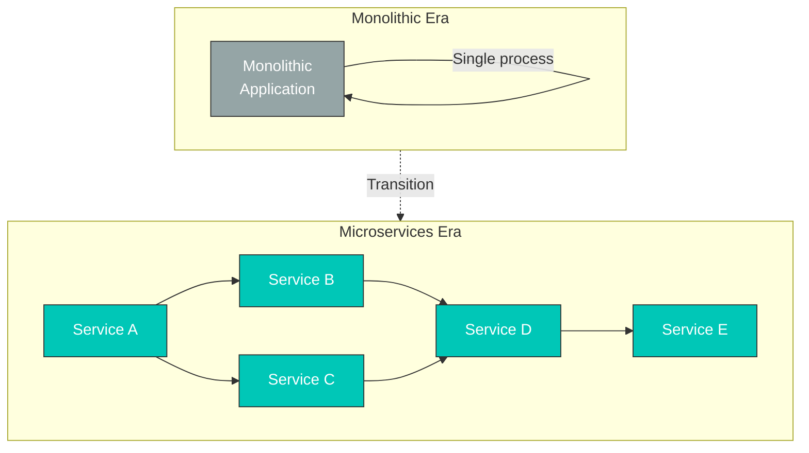

**New Problems**:

| Problem                         | Description                                  | Impact                         |
| ------------------------------- | -------------------------------------------- | ------------------------------ |
| **Inter-service Communication** | Increased network calls                      | Latency, failure propagation   |
| **Observability**               | Need for distributed tracing                 | Difficult debugging            |
| **Security**                    | Service-to-service authentication/encryption | mTLS implementation complexity |
| **Traffic Control**             | Canary deployments, A/B testing              | Application code modifications |
| **Failure Handling**            | Circuit Breaker, Retry                       | Implementation per service     |

#### Early Solution: Libraries

**Problems**:

* Need to develop libraries for each language (Hystrix for Java, separate library for Go...)
* Tightly coupled to application code
* Requires redeployment of all services for updates
* Complex version management

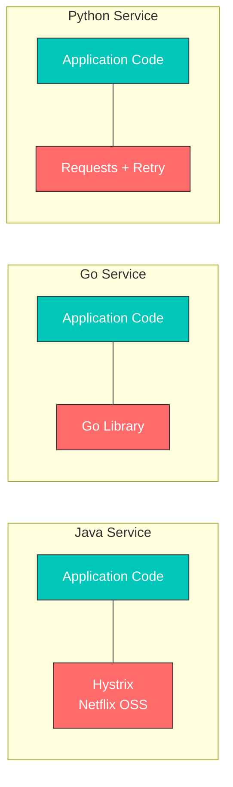

**Service Mesh Idea**: Move networking logic out of the application to an infrastructure layer

### The Birth of Envoy Proxy

#### Lyft's Problem

**In 2015, Lyft** was experiencing the following problems:

* Operating 200+ microservices
* Various languages and frameworks (Python, Go, Java, etc.)
* Existing proxies (HAProxy, NGINX) were insufficient
  * Difficult dynamic configuration changes
  * Lack of observability
  * Limited advanced routing features

#### Matt Klein and Envoy

**Matt Klein** (Lyft engineer) open-sourced Envoy in 2016.

**Problems Envoy Solved**:

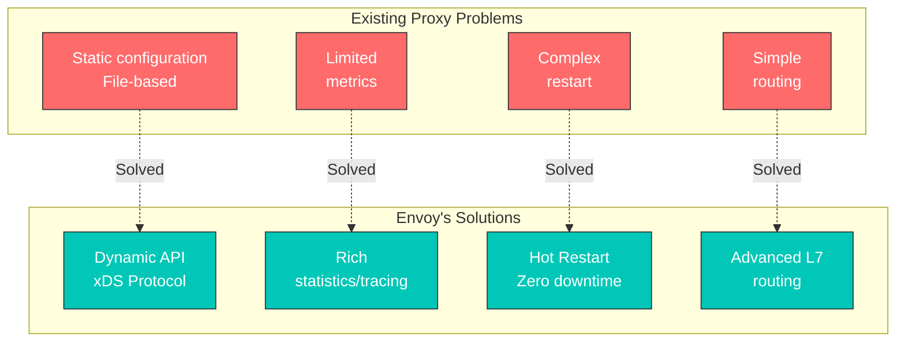

**Key Features of Envoy**:

1. **Out-of-process Architecture**: Separate process from application
2. **xDS APIs**: Dynamic configuration updates
3. **L7 Proxy**: HTTP/2, gRPC, WebSocket support
4. **Observability**: Detailed metrics, tracing, logging
5. **Performance**: Written in C++, high performance

#### CNCF Adoption

**Timeline**:

* **September 2016**: Envoy open-sourced
* **September 2017**: Accepted as CNCF project (Incubating)
* **November 2018**: Promoted to CNCF Graduated project

### The Birth and History of Istio

#### Google, IBM, Lyft Collaboration

**In May 2017**, Google, IBM, and Lyft collaborated to announce Istio.

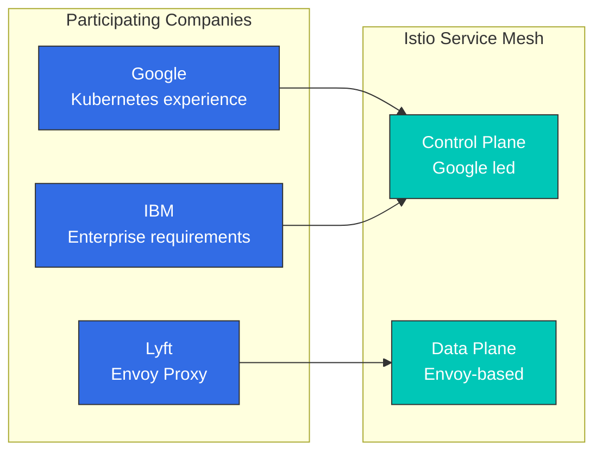

**Contributions from Each Company**:

| Company    | Main Contribution    | Reason                           |
| ---------- | -------------------- | -------------------------------- |
| **Google** | Control Plane design | Borg, Kubernetes experience      |
| **IBM**    | Enterprise features  | Enterprise customer requirements |
| **Lyft**   | Envoy Proxy          | Production-proven proxy          |

#### Istio Version History

**Major Milestones**:

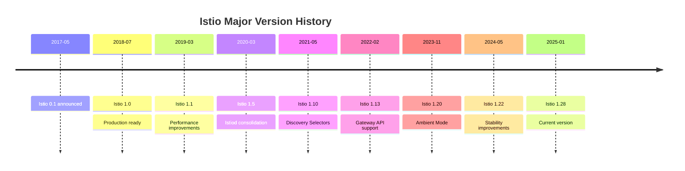

**Version 1.5 (March 2020) - Important Turning Point**:

Previous architecture (Istio 1.4 and earlier):

```
Separated into individual components:
- Mixer (policy/telemetry)
- Pilot (traffic management)
- Citadel (certificate management)
- Galley (configuration validation)
```

New architecture (Istio 1.5+, current 1.28):

```
Istiod (consolidated into single binary)
├── Pilot functionality (Service Discovery, Traffic Management)
├── Citadel functionality (Certificate Authority, Identity)
└── Galley functionality (Configuration Validation)

Mixer completely removed (functionality moved to Envoy)
```

**Reasons for Change**:

* Reduced complexity (4 components → 1)
* Improved performance (50% latency reduction with Mixer removal)
* Simplified operations (single process management)
* Resource efficiency (reduced memory, CPU usage)

## Why Istio?

Kubernetes provides container orchestration, but has limitations in managing complex communication between microservices. Istio is a service mesh solution to address these problems.

### Microservices Challenges

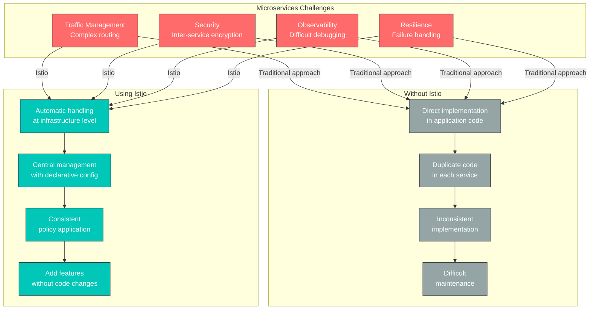

### Core Values Provided by Istio

#### 1. Traffic Management

**Problem**: Want to safely transition traffic when deploying new versions.

**Istio Solution**:

```yaml
# Canary deployment without code changes
apiVersion: networking.istio.io/v1
kind: VirtualService
metadata:
  name: reviews
spec:
  hosts:
  - reviews
  http:
  - route:
    - destination:
        host: reviews
        subset: v1
      weight: 90  # Existing version 90%
    - destination:
        host: reviews
        subset: v2
      weight: 10  # New version 10%
```

**Benefits**:

* No application code modification required
* Real-time traffic split adjustment
* Automatic rollback possible
* A/B testing, Blue/Green deployment support

#### 2. Security

**Problem**: Want to encrypt and authenticate inter-service communication.

**Istio Solution**:

```yaml
# Automatic mTLS enablement
apiVersion: security.istio.io/v1
kind: PeerAuthentication
metadata:
  name: default
  namespace: istio-system
spec:
  mtls:
    mode: STRICT  # Automatic encryption for all inter-service communication
```

**Benefits**:

* Automatic certificate issuance and renewal
* Automatic service identity verification
* Fine-grained permission control
* Zero Trust network implementation

#### 3. Observability

**Problem**: Difficult to trace request flow across dozens of microservices.

**Istio Solution**:

* Automatic metric generation (Latency, Traffic, Errors, Saturation)
* Distributed Tracing
* Service topology visualization

**Benefits**:

* Automatic identification of bottlenecks
* Quick error root cause identification
* Real-time service status monitoring

#### 4. Resilience

**Problem**: Failure of one service propagates to the entire system.

**Istio Solution**:

```yaml
# Automatic Circuit Breaker configuration
apiVersion: networking.istio.io/v1
kind: DestinationRule
metadata:
  name: reviews
spec:
  host: reviews
  trafficPolicy:
    outlierDetection:
      consecutiveErrors: 5
      interval: 30s
      baseEjectionTime: 30s
```

**Benefits**:

* Failure isolation (Circuit Breaker)
* Automatic retry and timeout
* Automatic removal of unhealthy instances
* Traffic limiting (Rate Limiting)

### When to Use Istio

**✅ When Istio is Suitable:**

1. **Microservices Architecture**
   * 10 or more services
   * Complex dependencies between services
   * Frequent deployments
2. **Advanced Traffic Management Needed**
   * Canary deployments, A/B testing
   * Fine-grained routing control
   * Traffic Mirroring
3. **Strong Security Requirements**
   * Inter-service encryption mandatory
   * Fine-grained access control
   * Regulatory compliance
4. **Observability and Debugging**
   * Complex inter-service problem tracking
   * Performance bottleneck identification
   * SLO/SLA monitoring

**❌ When Istio May Be Overkill:**

1. **Simple Applications**
   * Few services (less than 5)
   * Simple requirements
   * Kubernetes Ingress is sufficient
2. **Resource Constraints**
   * Small cluster
   * Cannot handle resource overhead
   * Sidecar memory cost burden
3. **Lack of Operations Capability**
   * Insufficient learning time
   * No dedicated platform team
   * Prefer simpler solutions

### Alternatives Comparison

#### Kubernetes Ingress vs Istio

| Feature           | Kubernetes Ingress | Istio                             |
| ----------------- | ------------------ | --------------------------------- |
| **Scope**         | External → Cluster | External + Internal inter-service |
| **Routing**       | Basic (Path, Host) | Advanced (Header, Cookie, etc.)   |
| **mTLS**          | Manual setup       | Automatic                         |
| **Observability** | Limited            | Rich                              |
| **Complexity**    | Low                | High                              |
| **Use Case**      | Simple apps        | Microservices                     |

#### AWS VPC Lattice vs Istio

For detailed comparison, refer to the [AWS Integration](04-aws-integration.md#istio-vs-other-solutions-comparison) document.

**Quick Summary:**

* **VPC Lattice**: AWS managed, simple, cross-VPC/account communication
* **Istio**: Open source, powerful features, Kubernetes-only, fine-grained control

#### Linkerd vs Istio

| Property           | Istio     | Linkerd            |
| ------------------ | --------- | ------------------ |
| **Complexity**     | High      | Low                |
| **Features**       | Very rich | Core features only |
| **Resources**      | High      | Low                |
| **Learning Curve** | Steep     | Gentle             |
| **Community**      | Large     | Small              |

**Selection Guide:**

* Need advanced features and flexibility → **Istio**
* Need simple and lightweight mesh → **Linkerd**

## Deployment Modes: Sidecar vs Ambient

Istio supports two deployment modes: **Sidecar Mode** and **Ambient Mode**.

### Sidecar Mode (Default)

Injects an Envoy proxy as a sidecar container into each application pod.

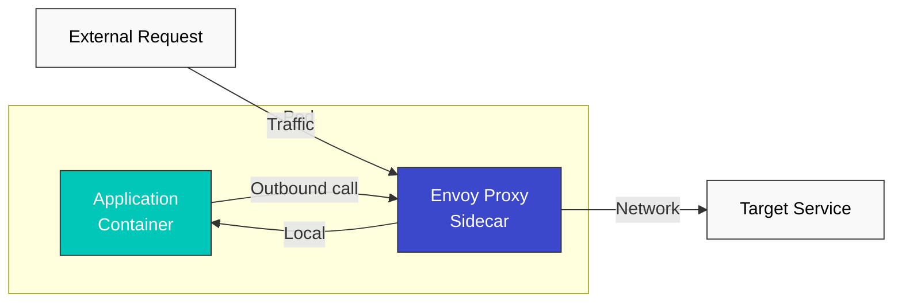

**Advantages:**

* Mature and stable
* All Istio features supported
* Fine-grained control per pod

**Disadvantages:**

* Resource overhead (Envoy per pod)
* Increased startup time (Init Container)
* Complex permission setup (iptables)

### Ambient Mode (New Approach)

Handles traffic at the node level without sidecars.

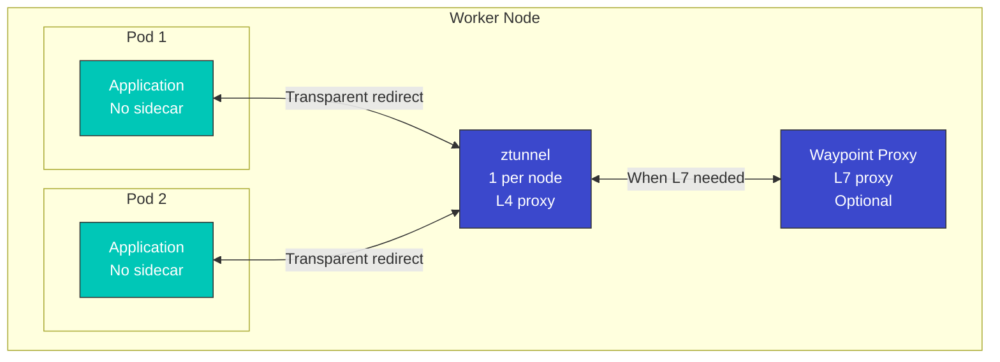

**Advantages:**

* Low resource usage (1 per node)
* Fast pod startup
* Simple operations
* Gradual L7 feature application possible

**Disadvantages:**

* Relatively new technology (less mature)
* Some advanced features limited
* Difficult fine-grained control per pod

### Comparison Table

| Property                   | Sidecar Mode                | Ambient Mode                   |
| -------------------------- | --------------------------- | ------------------------------ |
| **Resource Usage**         | High (per pod)              | Low (per node)                 |
| **Startup Time**           | Slow (Init Container)       | Fast                           |
| **Operational Complexity** | High                        | Low                            |
| **L4 Features**            | Supported                   | Supported                      |
| **L7 Features**            | Full support                | Optional (Waypoint)            |
| **Maturity**               | High                        | Medium                         |
| **Migration**              | -                           | Possible from existing sidecar |
| **Recommended Use**        | Advanced L7 features needed | Resource efficiency priority   |

### Selection Guide

**Choose Sidecar Mode:**

* Need to utilize all Istio features
* Need fine-grained policy control per pod
* Need production-proven stability

**Choose Ambient Mode:**

* Resource efficiency is important
* Only simple L4 features needed
* Planning to gradually add L7 features

**For details**, refer to the [Advanced: Ambient Mode](advanced/01-ambient-mode.md) document.

## Istio Architecture

Istio consists of two main components: **Control Plane** and **Data Plane**.

| Component                    | Description                                                                                                  |
| ---------------------------- | ------------------------------------------------------------------------------------------------------------ |
| **Control Plane (istiod)**   | Central control system responsible for service discovery, configuration distribution, certificate management |
| **Data Plane (Envoy Proxy)** | Deployed as sidecar in each pod, handles actual traffic (routing, mTLS, metrics)                             |

**For detailed architecture structure, internal operation principles, and traffic interception mechanisms**, refer to the [Architecture document](03-architecture.md).

## Core Resources

Istio uses Kubernetes Custom Resource Definitions (CRDs) to manage configuration.

### 1. VirtualService

VirtualService defines how requests are routed to services.

```yaml
apiVersion: networking.istio.io/v1
kind: VirtualService
metadata:
  name: reviews-route
spec:
  hosts:
  - reviews  # Target service
  http:
  - match:
    - headers:
        end-user:
          exact: jason
    route:
    - destination:
        host: reviews
        subset: v2  # Route specific user to v2
  - route:
    - destination:
        host: reviews
        subset: v1  # Route to v1 by default
```

**Key Features**:

* Path-based routing (Path, Header, Query Parameter)
* Traffic splitting (Canary, A/B testing)
* Retry, Timeout, Fault Injection
* URL Rewrite, Header manipulation

### 2. DestinationRule

DestinationRule defines service subsets (versions) and applies traffic policies.

```yaml
apiVersion: networking.istio.io/v1
kind: DestinationRule
metadata:
  name: reviews-destination
spec:
  host: reviews
  trafficPolicy:
    loadBalancer:
      simple: LEAST_REQUEST  # Load balancing algorithm
    connectionPool:
      tcp:
        maxConnections: 100
      http:
        http1MaxPendingRequests: 50
        maxRequestsPerConnection: 2
    outlierDetection:
      consecutiveErrors: 5
      interval: 30s
      baseEjectionTime: 30s
  subsets:
  - name: v1
    labels:
      version: v1
  - name: v2
    labels:
      version: v2
  - name: v3
    labels:
      version: v3
```

**Key Features**:

* Service version (subset) definition
* Load balancing algorithm
* Connection Pool settings
* Circuit Breaker (Outlier Detection)
* TLS settings

### 3. Gateway

Gateway manages external traffic entering the mesh.

```yaml
apiVersion: networking.istio.io/v1
kind: Gateway
metadata:
  name: bookinfo-gateway
spec:
  selector:
    istio: ingressgateway  # Select Ingress Gateway pod
  servers:
  - port:
      number: 80
      name: http
      protocol: HTTP
    hosts:
    - "bookinfo.example.com"
  - port:
      number: 443
      name: https
      protocol: HTTPS
    tls:
      mode: SIMPLE
      credentialName: bookinfo-credential  # TLS certificate
    hosts:
    - "bookinfo.example.com"
```

**Key Features**:

* Define external traffic entry point
* Host, port, protocol settings
* TLS termination
* SNI routing

### 4. ServiceEntry

ServiceEntry allows external services outside the mesh to be used like internal services.

```yaml
apiVersion: networking.istio.io/v1
kind: ServiceEntry
metadata:
  name: external-api
spec:
  hosts:
  - api.external.com
  ports:
  - number: 443
    name: https
    protocol: HTTPS
  location: MESH_EXTERNAL
  resolution: DNS
```

**Key Features**:

* External service registration
* Traffic control for external services
* Egress traffic management

### 5. PeerAuthentication

PeerAuthentication defines authentication policies between services.

```yaml
apiVersion: security.istio.io/v1
kind: PeerAuthentication
metadata:
  name: default
  namespace: default
spec:
  mtls:
    mode: STRICT  # STRICT, PERMISSIVE, DISABLE
```

### 6. AuthorizationPolicy

AuthorizationPolicy defines service access permissions.

```yaml
apiVersion: security.istio.io/v1
kind: AuthorizationPolicy
metadata:
  name: allow-ratings
  namespace: default
spec:
  selector:
    matchLabels:
      app: ratings
  action: ALLOW
  rules:
  - from:
    - source:
        principals: ["cluster.local/ns/default/sa/reviews"]
    to:
    - operation:
        methods: ["GET"]
```

## Traffic Management Concepts

### Traffic Routing Flow

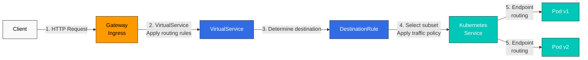

### Traffic Splitting (Canary Deployment)

```yaml
apiVersion: networking.istio.io/v1
kind: VirtualService
metadata:
  name: reviews-canary
spec:
  hosts:
  - reviews
  http:
  - route:
    - destination:
        host: reviews
        subset: v1
      weight: 90  # 90% of traffic
    - destination:
        host: reviews
        subset: v2
      weight: 10  # 10% of traffic (canary)
```

### Circuit Breaker

```yaml
apiVersion: networking.istio.io/v1
kind: DestinationRule
metadata:
  name: reviews-circuit-breaker
spec:
  host: reviews
  trafficPolicy:
    connectionPool:
      tcp:
        maxConnections: 100
      http:
        http1MaxPendingRequests: 10
        maxRequestsPerConnection: 2
    outlierDetection:
      consecutiveErrors: 5
      interval: 30s
      baseEjectionTime: 30s
      maxEjectionPercent: 50
```

## Security Concepts

### mTLS (Mutual TLS)

Istio automatically encrypts inter-service communication.

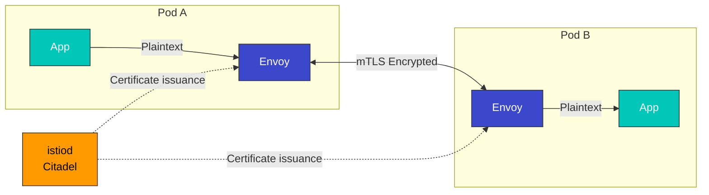

**mTLS Modes**:

* **STRICT**: mTLS only allowed
* **PERMISSIVE**: Both mTLS and plaintext allowed (for migration)
* **DISABLE**: mTLS disabled

### Authentication and Authorization

```yaml
# JWT Authentication
apiVersion: security.istio.io/v1
kind: RequestAuthentication
metadata:
  name: jwt-auth
spec:
  jwtRules:
  - issuer: "https://accounts.google.com"
    jwksUri: "https://www.googleapis.com/oauth2/v3/certs"
---
# Authorization Policy
apiVersion: security.istio.io/v1
kind: AuthorizationPolicy
metadata:
  name: require-jwt
spec:
  action: DENY
  rules:
  - from:
    - source:
        notRequestPrincipals: ["*"]
```

## Observability Concepts

Istio automatically generates metrics, logs, and traces.

### Automatically Generated Metrics

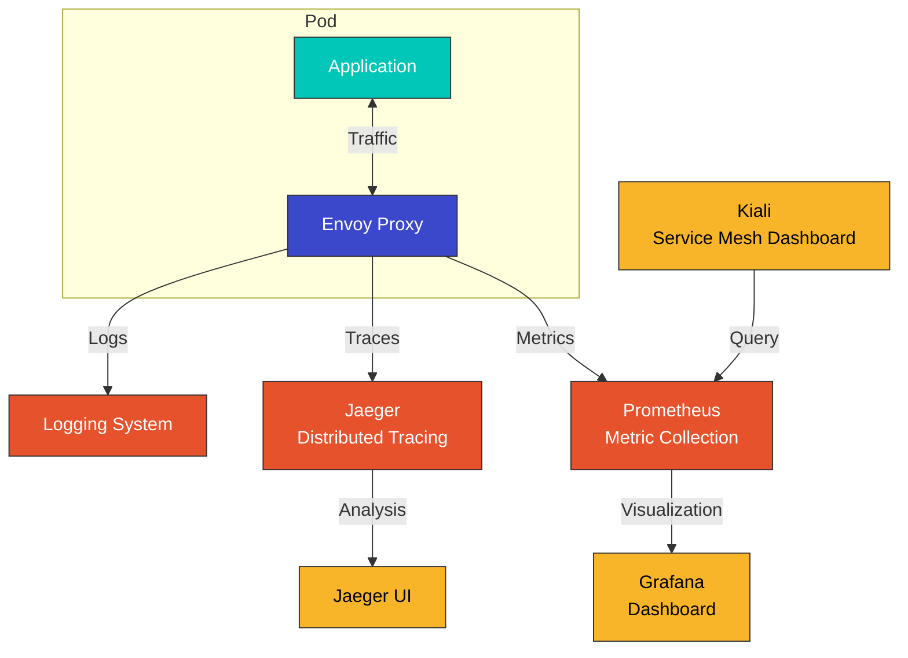

### Key Metrics

| Metric                                | Description          |
| ------------------------------------- | -------------------- |
| `istio_requests_total`                | Total request count  |
| `istio_request_duration_milliseconds` | Request latency      |
| `istio_request_bytes`                 | Request size         |
| `istio_response_bytes`                | Response size        |
| `istio_tcp_connections_opened_total`  | TCP connection count |

### Distributed Tracing

```yaml
# Enable tracing in Envoy
apiVersion: install.istio.io/v1alpha1
kind: IstioOperator
spec:
  meshConfig:
    enableTracing: true
    defaultConfig:
      tracing:
        sampling: 100.0  # 100% sampling
        zipkin:
          address: jaeger-collector.istio-system:9411
```

## Namespaces and Service Mesh

### Namespace Isolation

```yaml
# Per-namespace mTLS policy
apiVersion: security.istio.io/v1
kind: PeerAuthentication
metadata:
  name: default
  namespace: production
spec:
  mtls:
    mode: STRICT
---
# Per-namespace authorization policy
apiVersion: security.istio.io/v1
kind: AuthorizationPolicy
metadata:
  name: deny-all
  namespace: production
spec:
  action: DENY
  rules:
  - {}
```

### Service Mesh Scope

```bash
# Include only specific namespaces in the mesh
kubectl label namespace default istio-injection=enabled
kubectl label namespace staging istio-injection=enabled

# Exclude specific namespace
kubectl label namespace kube-system istio-injection=disabled
```

### Multi-tenancy

```yaml
# Restrict mesh scope with Sidecar resource
apiVersion: networking.istio.io/v1
kind: Sidecar
metadata:
  name: default
  namespace: production
spec:
  egress:
  - hosts:
    - "production/*"  # Only production namespace accessible
    - "istio-system/*"
```

## VM Workload Registration

Istio can register not only Kubernetes pods but also **Virtual Machine (VM) workloads** in the service mesh. This allows legacy applications or services outside the cluster to utilize Istio's traffic management, security, and observability features.

### Why VM Workloads Are Needed

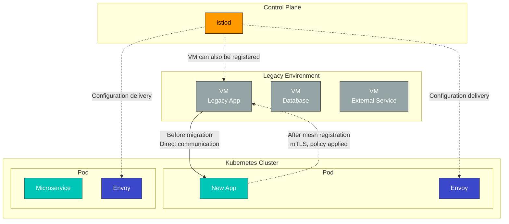

**Usage Scenarios**:

* Gradual migration of legacy applications
* Including database servers in the mesh
* Integration of services outside the cluster
* Hybrid cloud environment configuration

### VM Registration Architecture

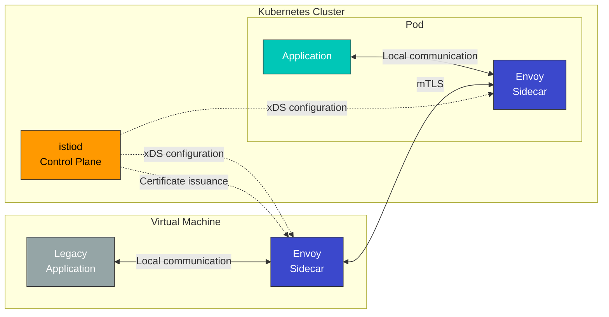

### WorkloadEntry Resource

VM workloads are registered with the **WorkloadEntry** resource.

```yaml
apiVersion: networking.istio.io/v1
kind: WorkloadEntry
metadata:
  name: legacy-database
  namespace: default
spec:
  address: 192.168.1.100  # VM IP address
  labels:
    app: mysql
    version: v5.7
  serviceAccount: database-sa
  ports:
    mysql: 3306
```

**WorkloadEntry Key Fields**:

* `address`: VM IP address
* `labels`: Matches with service selector
* `serviceAccount`: Service account for mTLS authentication
* `ports`: Exposed port definition

### Integration with ServiceEntry

WorkloadEntry is used with ServiceEntry to register VM services in the mesh.

```yaml
# Define service with ServiceEntry
apiVersion: networking.istio.io/v1
kind: ServiceEntry
metadata:
  name: legacy-database
spec:
  hosts:
  - database.legacy.com
  ports:
  - number: 3306
    name: mysql
    protocol: TCP
  location: MESH_INTERNAL  # Register as internal mesh service
  resolution: STATIC
  workloadSelector:
    labels:
      app: mysql
---
# Register VM instance with WorkloadEntry
apiVersion: networking.istio.io/v1
kind: WorkloadEntry
metadata:
  name: mysql-vm-1
  namespace: default
spec:
  address: 192.168.1.100
  labels:
    app: mysql
    version: v5.7
  serviceAccount: mysql-sa
```

### VM Registration vs Multi-Cluster Comparison

| Feature                    | VM Workload Registration | Multi-Cluster                  | Kubernetes Pod      |
| -------------------------- | ------------------------ | ------------------------------ | ------------------- |
| **Workload Location**      | VM outside cluster       | Different Kubernetes cluster   | Inside cluster      |
| **Envoy Installation**     | Manual installation      | Automatic (sidecar)            | Automatic (sidecar) |
| **Registration Method**    | WorkloadEntry            | ServiceEntry + EndpointSlice   | Service + Pod       |
| **mTLS**                   | Supported                | Supported                      | Supported           |
| **Service Discovery**      | Manual (IP specified)    | Automatic                      | Automatic           |
| **Usage Scenario**         | Legacy apps, DB          | Multi-cloud, disaster recovery | Cloud-native apps   |
| **Operational Complexity** | High                     | Medium                         | Low                 |

### Benefits of VM Registration

#### 1. Gradual Migration

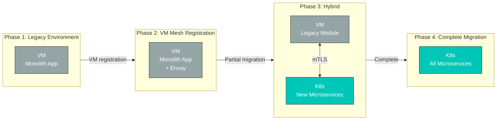

**Benefits**:

* Integrate existing VM applications into mesh without modification
* Migrate to Kubernetes in stages
* Maintain consistent security and observability during migration

#### 2. Unified Security Policy

```yaml
# mTLS policy applied to both VMs and pods
apiVersion: security.istio.io/v1
kind: PeerAuthentication
metadata:
  name: default
  namespace: default
spec:
  mtls:
    mode: STRICT  # Enforce mTLS for both VMs and pods
---
# VM database access control
apiVersion: security.istio.io/v1
kind: AuthorizationPolicy
metadata:
  name: database-access
  namespace: default
spec:
  selector:
    matchLabels:
      app: mysql  # WorkloadEntry label
  action: ALLOW
  rules:
  - from:
    - source:
        principals: ["cluster.local/ns/default/sa/app-sa"]
    to:
    - operation:
        methods: ["*"]
```

#### 3. Consistent Observability

VM workloads provide the same metrics, logs, and distributed tracing as Kubernetes pods.

```promql
# Unified metric query for VMs and pods
sum(rate(istio_requests_total{destination_workload="mysql-vm-1"}[5m]))

# Error rate from VM
sum(rate(istio_requests_total{destination_workload="mysql-vm-1",response_code="500"}[5m]))
/
sum(rate(istio_requests_total{destination_workload="mysql-vm-1"}[5m]))
```

### VM Registration Limitations

1. **Manual Envoy Installation**: Must manually install and configure Envoy proxy on VM
2. **Network Connectivity**: Network connection between VM and Kubernetes cluster required
3. **Certificate Management**: Service account certificates must be deployed to VM
4. **Operational Burden**: VM Envoy version management and updates required
5. **Auto-scaling Limitation**: No auto-scaling like Kubernetes HPA

### Practical Usage Example

#### Scenario: Legacy Database Integration

```yaml
# 1. Define database service with ServiceEntry
apiVersion: networking.istio.io/v1
kind: ServiceEntry
metadata:
  name: legacy-postgres
  namespace: production
spec:
  hosts:
  - postgres.production.svc.cluster.local
  addresses:
  - 240.240.1.10  # Virtual IP
  ports:
  - number: 5432
    name: postgresql
    protocol: TCP
  location: MESH_INTERNAL
  resolution: STATIC
  workloadSelector:
    labels:
      app: postgres
      tier: database
---
# 2. Register VM instance with WorkloadEntry
apiVersion: networking.istio.io/v1
kind: WorkloadEntry
metadata:
  name: postgres-vm-1
  namespace: production
spec:
  address: 10.0.1.100  # Actual VM IP
  labels:
    app: postgres
    tier: database
    version: v13
  serviceAccount: postgres-sa
  ports:
    postgresql: 5432
---
# 3. Access control policy
apiVersion: security.istio.io/v1
kind: AuthorizationPolicy
metadata:
  name: postgres-access-control
  namespace: production
spec:
  selector:
    matchLabels:
      app: postgres
  action: ALLOW
  rules:
  - from:
    - source:
        namespaces: ["production"]
        principals: ["cluster.local/ns/production/sa/api-service"]
    to:
    - operation:
        ports: ["5432"]
```

**Result**:

* Kubernetes pods access database via `postgres.production.svc.cluster.local`
* Automatic mTLS encryption between VM and pods
* Access control policy applied
* Metrics and distributed tracing automatically collected

### Workload Registration Comparison Summary

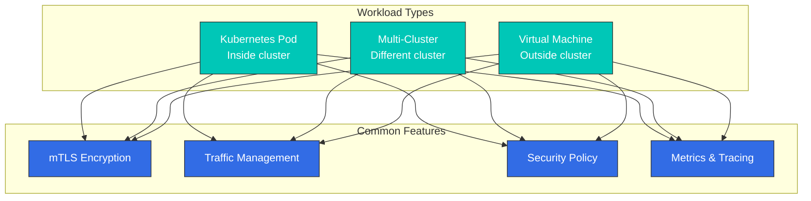

Through Istio's flexible workload registration capabilities:

* **Kubernetes Pod**: Cloud-native applications
* **Multi-Cluster**: Multi-cloud, regional distribution, disaster recovery
* **Virtual Machine**: Legacy apps, databases, hybrid environments

All workloads receive consistent security, traffic management, and observability features.

## Next Steps

You now understand Istio's basic concepts. Learn how to use them in practice through the following documents:

### Core Features

1. [**Traffic Management**](traffic-management/)
   * Gateway and VirtualService usage
   * DestinationRule and subset definition
   * ServiceEntry and WorkloadEntry (VM registration)
   * Advanced routing patterns (Canary, A/B testing)
   * Traffic Mirroring and Shadowing
2. [**Security**](security/)
   * mTLS configuration and PeerAuthentication
   * Authentication (RequestAuthentication, JWT)
   * Authorization (AuthorizationPolicy)
   * Security policy management
   * External authentication integration
3. [**Observability**](/broken/pages/HT0uW6gT7EfVN0LF8wU5)
   * Metric collection (Prometheus)
   * Distributed tracing (Jaeger, Zipkin)
   * Logging configuration
   * Kiali service mesh visualization
   * Grafana dashboards
4. [**Resilience**](resilience/)
   * Circuit Breaker pattern
   * Retry and Timeout settings
   * Rate Limiting
   * Outlier Detection
   * Fault Injection testing

### Advanced Topics

5. [**Advanced Topics**](advanced/)
   * Ambient Mode (sidecar-less mesh)
   * Multi-Cluster configuration
   * EnvoyFilter customization
   * DNS Proxy and Caching
   * VM workload detailed configuration
   * WASM plugin development

## References

* [Istio Official Documentation - Concepts](https://istio.io/latest/docs/concepts/)
* [Istio Official Documentation - Traffic Management](https://istio.io/latest/docs/concepts/traffic-management/)
* [Istio Official Documentation - Security](https://istio.io/latest/docs/concepts/security/)
* [Istio Official Documentation - Observability](https://istio.io/latest/docs/concepts/observability/)
* [Envoy Proxy Official Documentation](https://www.envoyproxy.io/docs/envoy/latest/)
