# Architecture

> **Supported Version**: Istio 1.28+ **API Version**: `networking.istio.io/v1`, `security.istio.io/v1` **Last Updated**: February 19, 2026

This document provides an in-depth look at Istio's internal architecture and networking mechanisms.

**For background and history**, refer to the [Basic Concepts](02-basic-concepts.md#background-and-history) document.

**Important Changes (Istio 1.5+)**:

* Pilot, Citadel, Galley are **no longer separate components**
* They are consolidated into a **single binary** called Istiod (`pilot-discovery`)
* Pilot/Citadel/Galley terminology refers to **historical names describing functionality**

## Table of Contents

1. [Istio Architecture Overview](03-architecture.md#istio-architecture-overview)
2. [Control Plane: Istiod](03-architecture.md#control-plane-istiod)
3. [Data Plane: Envoy Proxy](03-architecture.md#data-plane-envoy-proxy)
4. [Sidecar Injection Mechanism](03-architecture.md#sidecar-injection-mechanism)
5. [iptables and Traffic Interception](03-architecture.md#iptables-and-traffic-interception)
6. [DNS Processing Mechanism](03-architecture.md#dns-processing-mechanism)
7. [xDS API Communication](03-architecture.md#xds-api-communication)
8. [Optimization with Sidecar Resource](03-architecture.md#optimization-with-sidecar-resource)

## Istio Architecture Overview

### Overall Structure

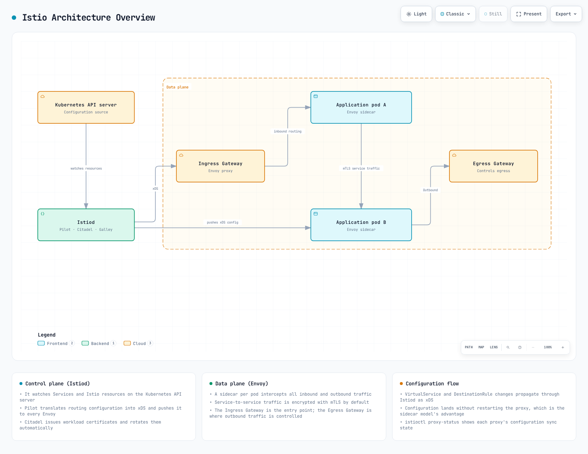

[🔍 View interactive diagram](https://www.atomai.click/kubernetes-docs/archmaps/en-service-mesh-istio-03-architecture-0.html)

### Control Plane vs Data Plane

| Category        | Control Plane (Istiod)                        | Data Plane (Envoy)        |
| --------------- | --------------------------------------------- | ------------------------- |
| **Role**        | Policy management, configuration distribution | Actual traffic processing |
| **Location**    | Separate pods (typically 1-3)                 | All application pods      |
| **Language**    | Go                                            | C++                       |
| **Load**        | Low                                           | High (all traffic)        |
| **Scalability** | Horizontal scaling (HA)                       | Automatic (1 per pod)     |

## Control Plane: Istiod

### Istiod Internal Structure

**Important**: Since Istio 1.5, Pilot, Citadel, and Galley are **internal functions of Istiod, not separate components**.

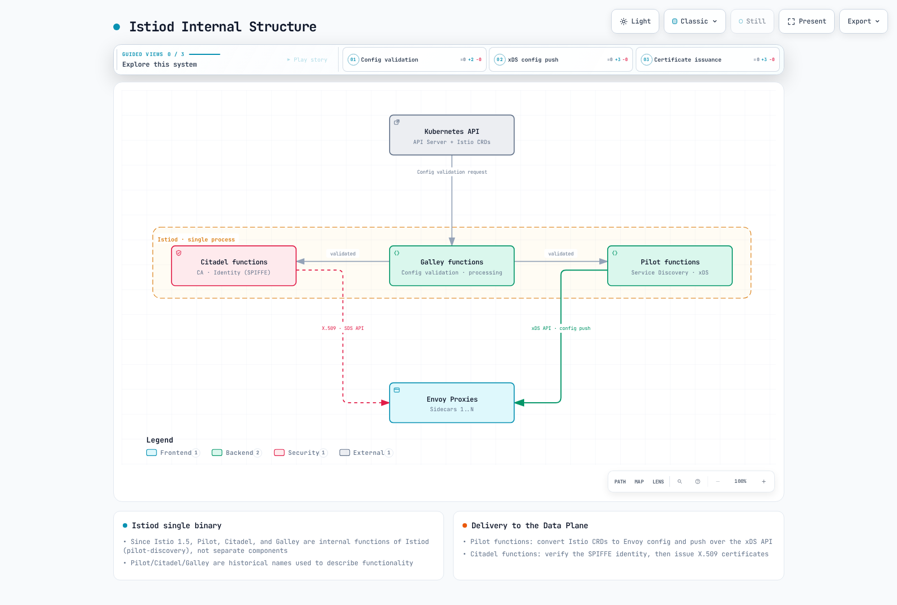

[🔍 View interactive diagram](https://www.atomai.click/kubernetes-docs/archmaps/en-service-mesh-istio-03-architecture-10.html)

### Istiod Main Functions

**Note**: The functions below are integrated within Istiod in Istio 1.28. Historical names (Pilot, Citadel, Galley) are used to describe functionality.

#### 1. Service Discovery (Pilot Functionality)

```yaml
# Kubernetes Service detection
apiVersion: v1
kind: Service
metadata:
  name: reviews
spec:
  selector:
    app: reviews
  ports:
  - port: 9080
```

Istiod tracks:

* Kubernetes Services
* Endpoints (pod IPs)
* Pod state changes
* External services (ServiceEntry)

#### 2. Traffic Management (Pilot Functionality)

Converts Istio CRDs to Envoy configuration:

```yaml
# VirtualService (user-defined)
apiVersion: networking.istio.io/v1
kind: VirtualService
metadata:
  name: reviews
spec:
  hosts:
  - reviews
  http:
  - route:
    - destination:
        host: reviews
        subset: v1
      weight: 90
    - destination:
        host: reviews
        subset: v2
      weight: 10
```

↓ Istiod converts to Envoy configuration ↓

```json
{
  "route_config": {
    "weighted_clusters": {
      "clusters": [
        {"name": "outbound|9080|v1|reviews", "weight": 90},
        {"name": "outbound|9080|v2|reviews", "weight": 10}
      ]
    }
  }
}
```

#### 3. Certificate Management (Citadel Functionality)


[🔍 View interactive diagram](https://www.atomai.click/kubernetes-docs/archmaps/en-service-mesh-istio-03-architecture-1.html)

**SPIFFE ID Format**:

```
spiffe://cluster.local/ns/default/sa/reviews
```

#### 4. Configuration Validation (Galley Functionality)

```yaml
# Invalid configuration
apiVersion: networking.istio.io/v1
kind: VirtualService
metadata:
  name: invalid
spec:
  hosts:
  - reviews
  http:
  - route:
    - destination:
        host: non-existent-service  # ❌ Non-existent service
```

Istiod validates before applying:

```bash
$ kubectl apply -f invalid-vs.yaml
Error from server: admission webhook "validation.istio.io" denied the request:
configuration is invalid: host "non-existent-service" not found
```

### Istiod Process Structure

**Actual Implementation in Istio 1.28**:

```bash
# Processes inside Istiod pod
$ kubectl exec -n istio-system deploy/istiod -- ps aux
USER       PID  COMMAND
istio-p+     1  /usr/local/bin/pilot-discovery discovery

# Single binary 'pilot-discovery' performs all functions
```

**Key Points**:

* Istiod runs as a **single Go binary** called `pilot-discovery`
* Pilot, Citadel, Galley exist as **code-level packages/modules** but are not separate processes
* All functions run as goroutines within a single process

**Main Ports Provided by Istiod**:

| Port      | Protocol | Purpose                  | Functionality             |
| --------- | -------- | ------------------------ | ------------------------- |
| **15010** | gRPC     | xDS (legacy)             | Backward compatibility    |
| **15012** | gRPC     | xDS over TLS             | Primary xDS API endpoint  |
| **15014** | HTTP     | Control plane monitoring | Metrics and health checks |
| **15017** | HTTPS    | Webhook                  | Sidecar injection         |
| **8080**  | HTTP     | Debug                    | Debugging interface       |

### Istiod Deployment

**High Availability Configuration**:

```yaml
apiVersion: apps/v1
kind: Deployment
metadata:
  name: istiod
  namespace: istio-system
spec:
  replicas: 3  # 3 replicas for HA
  selector:
    matchLabels:
      app: istiod
  template:
    metadata:
      labels:
        app: istiod
    spec:
      containers:
      - name: discovery
        image: istio/pilot:1.28.0
        resources:
          requests:
            cpu: 500m
            memory: 2Gi
```

**Typical Resource Usage**:

* CPU: 0.5 - 2 cores
* Memory: 2 - 4 GB
* Can handle thousands of services and pods

## Data Plane: Envoy Proxy

### Envoy Architecture

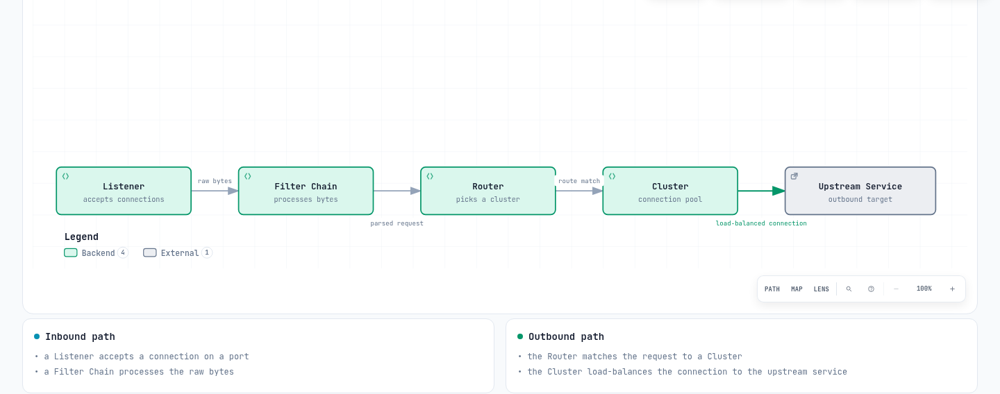

[🔍 View interactive diagram](https://www.atomai.click/kubernetes-docs/archmaps/en-service-mesh-istio-03-architecture-2.html)

### Envoy Main Components

#### 1. Listeners

**Receives connections on ports**:

```json
{
  "name": "0.0.0.0_15001",
  "address": {
    "socket_address": {
      "address": "0.0.0.0",
      "port_value": 15001
    }
  },
  "filter_chains": [...]
}
```

**Default Istio Listeners**:

* `0.0.0.0:15001`: All outbound TCP traffic
* `0.0.0.0:15006`: All inbound TCP traffic
* `0.0.0.0:15021`: Health check
* `0.0.0.0:15090`: Prometheus metrics

#### 2. Filters

**Plugins that process requests/responses**:

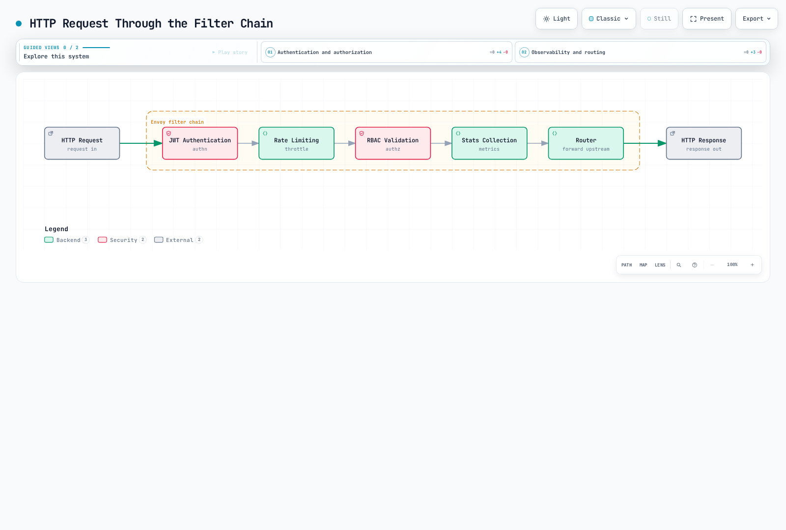

[🔍 View interactive diagram](https://www.atomai.click/kubernetes-docs/archmaps/en-service-mesh-istio-03-architecture-3.html)

#### 3. Clusters

**Logical groups of upstream services**:

```json
{
  "name": "outbound|9080|v1|reviews.default.svc.cluster.local",
  "type": "EDS",
  "eds_cluster_config": {
    "service_name": "outbound|9080|v1|reviews.default.svc.cluster.local"
  },
  "circuit_breakers": {...},
  "outlier_detection": {...}
}
```

#### 4. Endpoints

**Actual pod IP list**:

```json
{
  "cluster_name": "outbound|9080|v1|reviews",
  "endpoints": [
    {
      "lb_endpoints": [
        {"endpoint": {"address": {"socket_address": {"address": "10.244.1.5", "port_value": 9080}}}},
        {"endpoint": {"address": {"socket_address": {"address": "10.244.2.8", "port_value": 9080}}}}
      ]
    }
  ]
}
```

### Envoy Performance

**Benchmarks** (typical environment):

* Throughput: 10,000+ RPS per core
* Added latency: < 1ms (P99)
* Memory: 50-100 MB (default configuration)
* CPU: 0.1-0.5 cores (typical load)

## Sidecar Injection Mechanism

### Injection Process

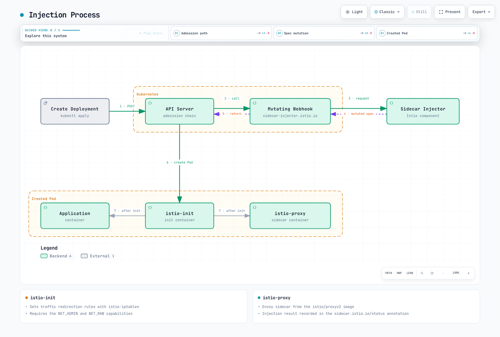

[🔍 View interactive diagram](https://www.atomai.click/kubernetes-docs/archmaps/en-service-mesh-istio-03-architecture-4.html)

### Original vs After Injection

**Original Deployment**:

```yaml
apiVersion: apps/v1
kind: Deployment
metadata:
  name: reviews
spec:
  template:
    spec:
      containers:
      - name: reviews
        image: reviews:v1
        ports:
        - containerPort: 9080
```

**After Injection**:

```yaml
apiVersion: v1
kind: Pod
metadata:
  annotations:
    sidecar.istio.io/status: '{"initContainers":["istio-init"],"containers":["istio-proxy"]}'
spec:
  initContainers:
  - name: istio-init
    image: istio/proxyv2:1.28.0
    command: ['istio-iptables', ...]
    securityContext:
      capabilities:
        add: [NET_ADMIN, NET_RAW]
  containers:
  - name: reviews
    image: reviews:v1
    ports:
    - containerPort: 9080
  - name: istio-proxy
    image: istio/proxyv2:1.28.0
    args: ['proxy', 'sidecar', ...]
```

### Enabling Sidecar Injection

#### Automatic Injection (Recommended)

**Namespace Level**:

```bash
# Add label to namespace
kubectl label namespace default istio-injection=enabled

# All pods deployed to this namespace will automatically have sidecar injected
kubectl apply -f deployment.yaml
```

**Pod Level** (Annotation):

```yaml
apiVersion: v1
kind: Pod
metadata:
  annotations:
    sidecar.istio.io/inject: "true"  # Enable injection per pod
spec:
  containers:
  - name: app
    image: myapp:v1
```

#### Manual Injection

Use `istioctl kube-inject` command to inject sidecar directly into YAML files.

```bash
# Inject sidecar into YAML file and deploy
istioctl kube-inject -f deployment.yaml | kubectl apply -f -

# Or save to file
istioctl kube-inject -f deployment.yaml -o deployment-injected.yaml
kubectl apply -f deployment-injected.yaml
```

**Manual Injection Scenarios**:

* Environments where automatic injection cannot be used
* When explicit control is needed in CI/CD pipelines
* When you want to inspect injected YAML for debugging

## iptables and Traffic Interception

### istio-init Container

**Role**: Sets up iptables rules to redirect pod network traffic to Envoy Proxy

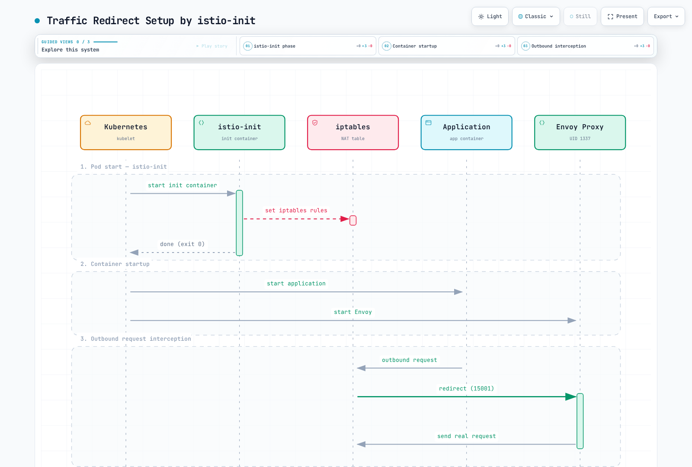

[🔍 View interactive diagram](https://www.atomai.click/kubernetes-docs/archmaps/en-service-mesh-istio-03-architecture-5.html)

### iptables Rules Detail

**Commands executed by istio-init**:

```bash
#!/bin/bash
# istio-iptables script (simplified)

# 1. OUTPUT chain: Application outbound traffic
iptables -t nat -A OUTPUT -p tcp \
  -m owner ! --uid-owner 1337 \  # Exclude Envoy UID
  -j REDIRECT --to-port 15001     # Envoy outbound port

# 2. PREROUTING chain: Inbound traffic to pod
iptables -t nat -A PREROUTING -p tcp \
  -j REDIRECT --to-port 15006     # Envoy inbound port

# 3. Exclusion rules
# - localhost traffic
iptables -t nat -I OUTPUT -d 127.0.0.1/32 -j RETURN

# - Istiod communication (15012)
iptables -t nat -I OUTPUT -p tcp --dport 15012 -j RETURN

# - DNS (53)
iptables -t nat -I OUTPUT -p udp --dport 53 -j RETURN
```

### Traffic Flow (After iptables Applied)

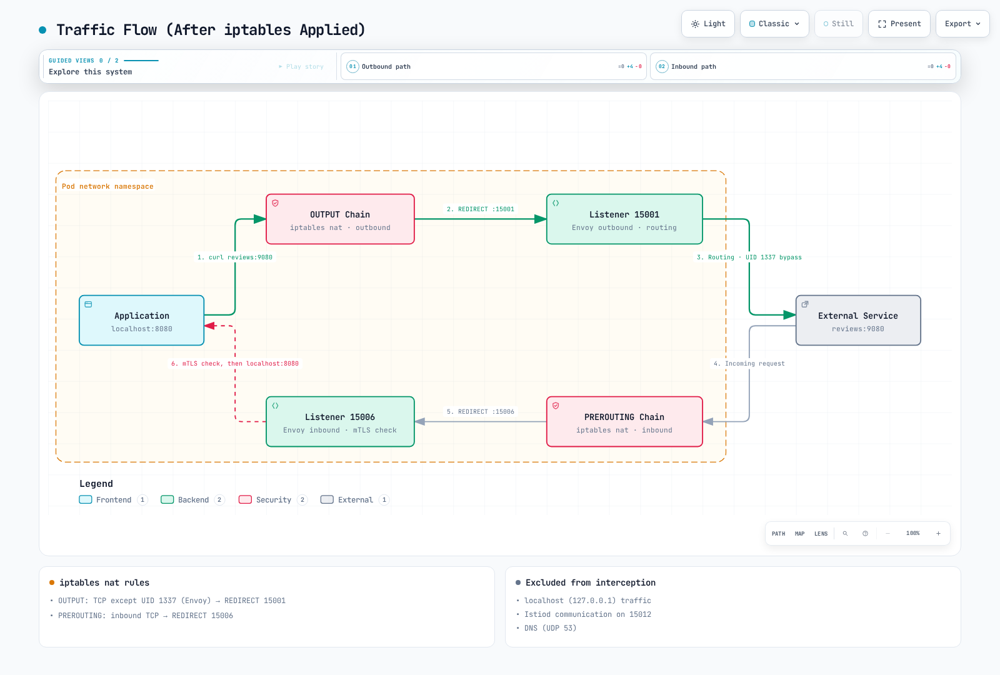

[🔍 View interactive diagram](https://www.atomai.click/kubernetes-docs/archmaps/en-service-mesh-istio-03-architecture-6.html)

### Checking iptables Rules

**Check from inside the pod**:

```bash
# Enter pod
kubectl exec -it <pod-name> -c istio-proxy -- /bin/bash

# Check iptables rules
iptables -t nat -L -n -v

# OUTPUT chain
Chain OUTPUT (policy ACCEPT)
target     prot opt source     destination
ISTIO_OUTPUT  tcp  --  0.0.0.0/0  0.0.0.0/0

# ISTIO_OUTPUT detail
Chain ISTIO_OUTPUT (1 references)
RETURN     all  --  0.0.0.0/0  127.0.0.1           # Exclude localhost
RETURN     all  --  0.0.0.0/0  0.0.0.0/0           owner UID match 1337  # Exclude Envoy
REDIRECT   tcp  --  0.0.0.0/0  0.0.0.0/0           redir ports 15001  # Redirect rest

# PREROUTING chain
Chain PREROUTING (policy ACCEPT)
ISTIO_INBOUND  tcp  --  0.0.0.0/0  0.0.0.0/0

# ISTIO_INBOUND detail
Chain ISTIO_INBOUND (1 references)
REDIRECT   tcp  --  0.0.0.0/0  0.0.0.0/0           redir ports 15006
```

### iptables vs eBPF (CNI Plugin)

Istio supports two traffic interception methods:

| Method         | Advantages           | Disadvantages           | Use Scenario                   |
| -------------- | -------------------- | ----------------------- | ------------------------------ |
| **iptables**   | Simple, universal    | Init Container required | Default setup                  |
| **eBPF (CNI)** | No Init needed, fast | Requires modern kernel  | High performance, Ambient Mode |

## DNS Processing Mechanism

### Kubernetes DNS Basic Operation

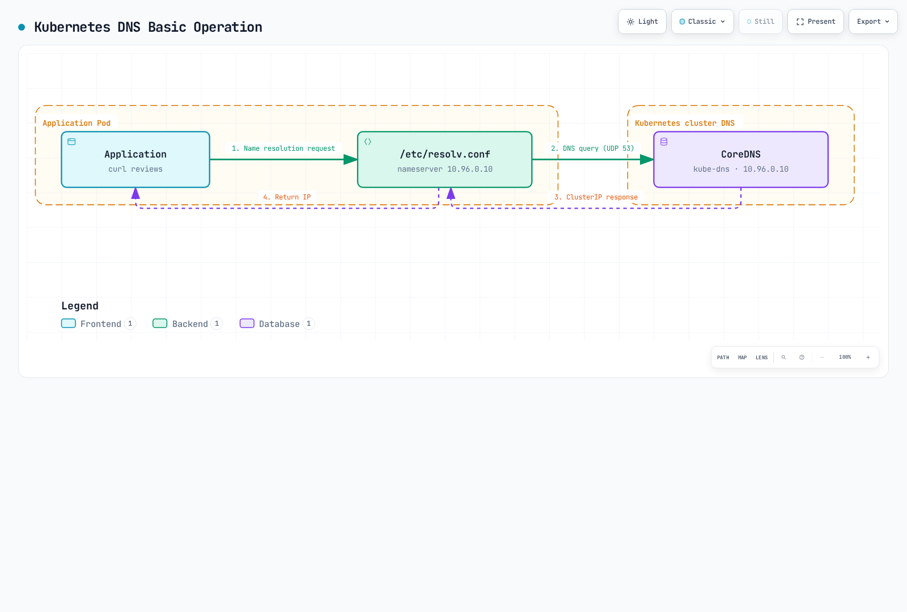

[🔍 View interactive diagram](https://www.atomai.click/kubernetes-docs/archmaps/en-service-mesh-istio-03-architecture-7.html)

**/etc/resolv.conf** (inside pod):

```bash
nameserver 10.96.0.10  # kube-dns ClusterIP
search default.svc.cluster.local svc.cluster.local cluster.local
options ndots:5
```

### Envoy's DNS Processing

**In Istio, Envoy handles DNS**:

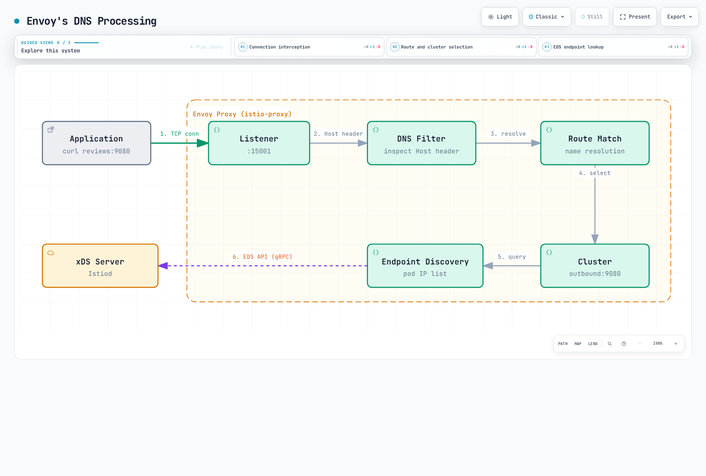

[🔍 View interactive diagram](https://www.atomai.click/kubernetes-docs/archmaps/en-service-mesh-istio-03-architecture-8.html)

**Advantages**:

* No CoreDNS calls needed (performance improvement)
* Dynamic Endpoint updates
* Advanced routing (versions, weights, etc.)

### DNS Proxy (Optional)

**DNS Proxy feature added in Istio 1.8+**:

```yaml
apiVersion: install.istio.io/v1alpha1
kind: IstioOperator
spec:
  meshConfig:
    defaultConfig:
      proxyMetadata:
        ISTIO_META_DNS_CAPTURE: "true"  # Enable DNS Proxy
```

**Operation**:

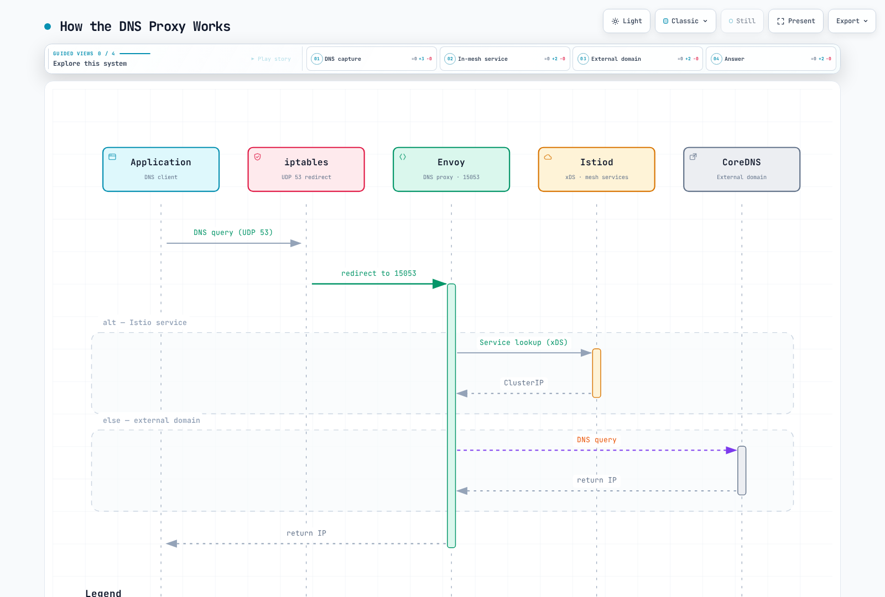

[🔍 View interactive diagram](https://www.atomai.click/kubernetes-docs/archmaps/en-service-mesh-istio-03-architecture-9.html)

**DNS Proxy iptables rules**:

```bash
# Redirect UDP port 53 to Envoy DNS Proxy
iptables -t nat -A OUTPUT -p udp --dport 53 \
  -m owner ! --uid-owner 1337 \
  -j REDIRECT --to-port 15053
```

## xDS API Communication

### xDS Protocol Overview

**xDS**: Stands for Discovery Service, Envoy's dynamic configuration protocol.

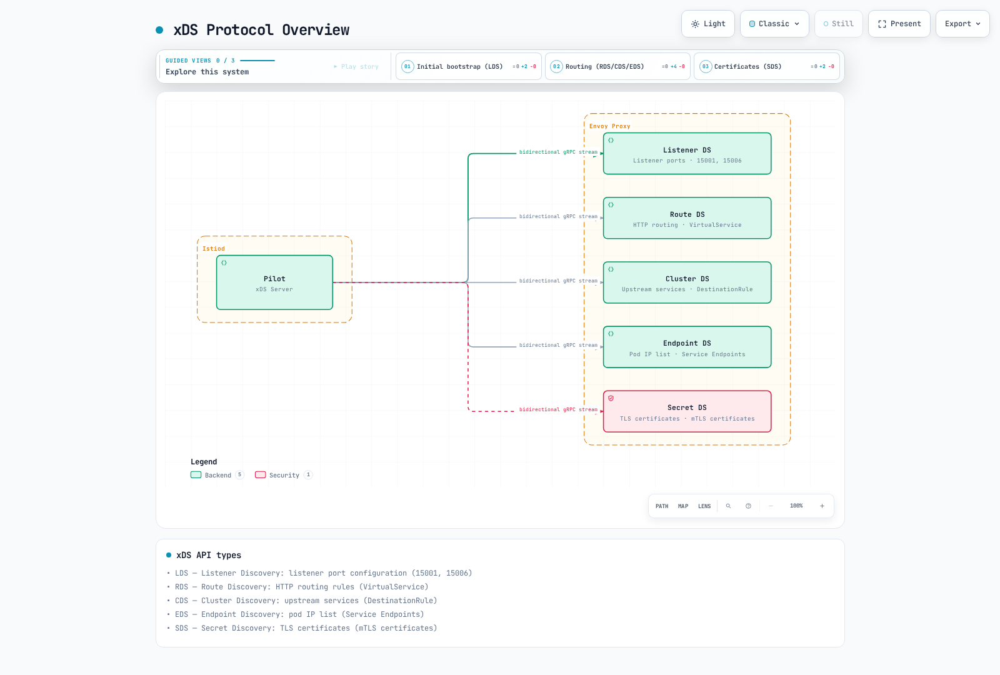

[🔍 View interactive diagram](https://www.atomai.click/kubernetes-docs/archmaps/en-service-mesh-istio-03-architecture-11.html)

### xDS API Types

| API     | Name               | Role                       | Example           |
| ------- | ------------------ | -------------------------- | ----------------- |
| **LDS** | Listener Discovery | Receive port configuration | 15001, 15006      |
| **RDS** | Route Discovery    | HTTP routing rules         | VirtualService    |
| **CDS** | Cluster Discovery  | Upstream services          | DestinationRule   |
| **EDS** | Endpoint Discovery | Pod IP list                | Service Endpoints |
| **SDS** | Secret Discovery   | TLS certificates           | mTLS certificates |

### xDS Communication Flow

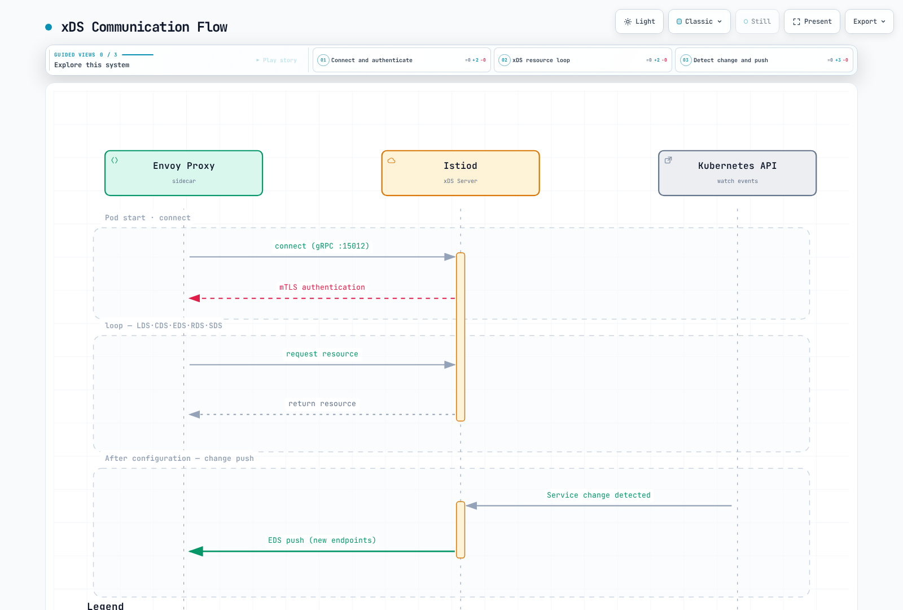

[🔍 View interactive diagram](https://www.atomai.click/kubernetes-docs/archmaps/en-service-mesh-istio-03-architecture-12.html)

### Verifying xDS Communication

**Check with Envoy Admin API**:

```bash
# From inside pod
kubectl exec -it <pod-name> -c istio-proxy -- curl localhost:15000/config_dump

# LDS (Listeners)
kubectl exec -it <pod-name> -c istio-proxy -- \
  curl -s localhost:15000/config_dump | jq '.configs[0].dynamic_listeners'

# CDS (Clusters)
kubectl exec -it <pod-name> -c istio-proxy -- \
  curl -s localhost:15000/config_dump | jq '.configs[1].dynamic_active_clusters'

# EDS (Endpoints)
kubectl exec -it <pod-name> -c istio-proxy -- \
  curl -s localhost:15000/clusters | grep -A 5 "reviews"

# RDS (Routes)
kubectl exec -it <pod-name> -c istio-proxy -- \
  curl -s localhost:15000/config_dump | jq '.configs[2].dynamic_route_configs'
```

**Check with istioctl**:

```bash
# Listener configuration
istioctl proxy-config listeners <pod-name> -n default

# Cluster configuration
istioctl proxy-config clusters <pod-name> -n default

# Endpoint configuration
istioctl proxy-config endpoints <pod-name> -n default

# Route configuration
istioctl proxy-config routes <pod-name> -n default
```

## Optimization with Sidecar Resource

### Problem: Receiving All Service Information

By default, each Envoy receives **information about all services in the entire mesh**:

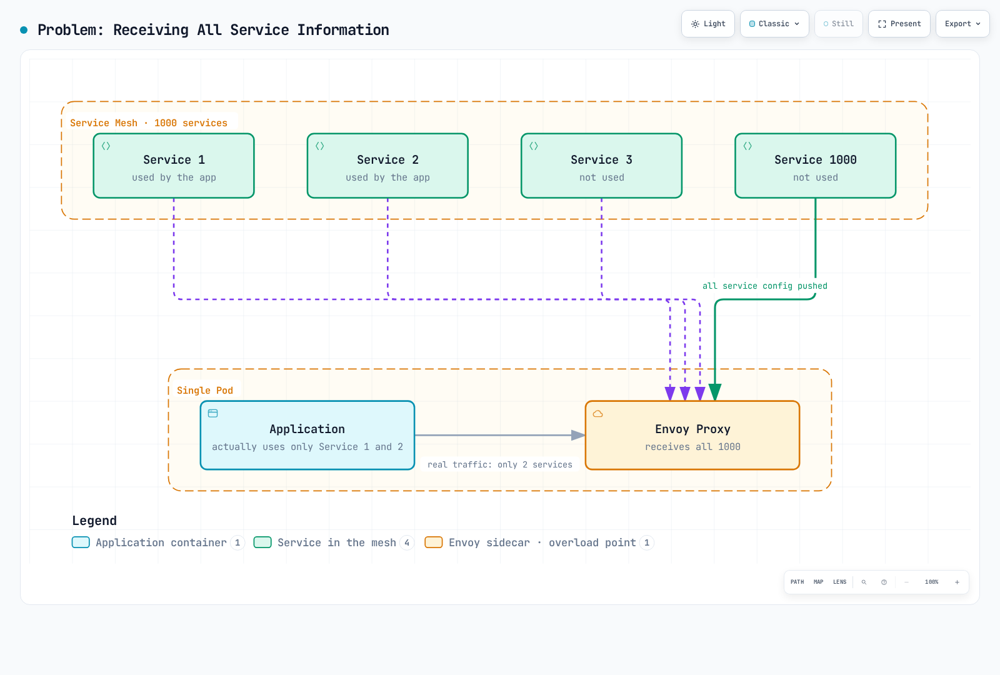

[🔍 View interactive diagram](https://www.atomai.click/kubernetes-docs/archmaps/en-service-mesh-istio-03-architecture-13.html)

**Problems**:

* Increased memory usage
* Increased CPU usage (configuration processing)
* Network bandwidth waste
* Increased Istiod load

### Solution: Sidecar Resource

Use **Sidecar resource** to restrict receiving only necessary services:

```yaml
apiVersion: networking.istio.io/v1
kind: Sidecar
metadata:
  name: default
  namespace: default
spec:
  egress:
  - hosts:
    - "./*"  # All services in same namespace
    - "istio-system/*"  # All services in istio-system
    - "production/reviews"  # Only reviews in production namespace
```

### Sidecar Resource Examples

#### 1. Namespace Isolation

```yaml
apiVersion: networking.istio.io/v1
kind: Sidecar
metadata:
  name: default
  namespace: team-a
spec:
  egress:
  - hosts:
    - "team-a/*"  # Own namespace only
    - "istio-system/*"  # System services
    - "shared/*"  # Shared services
```

#### 2. Access Only Specific Services

```yaml
apiVersion: networking.istio.io/v1
kind: Sidecar
metadata:
  name: frontend
  namespace: default
spec:
  workloadSelector:
    labels:
      app: frontend
  egress:
  - hosts:
    - "default/reviews"
    - "default/ratings"
    - "default/details"
  - port:
      number: 443
      protocol: HTTPS
    hosts:
    - "external/*"
```

#### 3. Access Only External Services

```yaml
apiVersion: networking.istio.io/v1
kind: Sidecar
metadata:
  name: external-only
  namespace: default
spec:
  workloadSelector:
    labels:
      app: batch-job
  egress:
  - hosts:
    - "./*"  # Same namespace
  outboundTrafficPolicy:
    mode: REGISTRY_ONLY  # Only those registered in ServiceEntry
```

### Sidecar Resource Effects

**Before (No Sidecar)**:

* 1000 services → 1000 Cluster configurations
* Envoy memory: \~500 MB
* Configuration push time: 5-10 seconds

**After (Sidecar Applied)**:

* 10 services → 10 Cluster configurations
* Envoy memory: \~80 MB
* Configuration push time: < 1 second

### DNS and Sidecar Integration

```yaml
apiVersion: networking.istio.io/v1
kind: Sidecar
metadata:
  name: dns-optimized
  namespace: default
spec:
  egress:
  - hosts:
    - "default/reviews"
    - "default/ratings"
  # Envoy only handles DNS for reviews, ratings
  # Rest forwarded to CoreDNS
```

**Result**:

* Envoy only resolves `reviews`, `ratings`
* External domains like `google.com` forwarded to CoreDNS
* Memory and CPU savings

## References

### Official Documentation

* [Istio Architecture](https://istio.io/latest/docs/ops/deployment/architecture/)
* [Envoy Proxy](https://www.envoyproxy.io/docs/envoy/latest/intro/intro)
* [xDS Protocol](https://www.envoyproxy.io/docs/envoy/latest/api-docs/xds_protocol)
* [SPIFFE](https://spiffe.io/)

### History and Background

* [Envoy Origin Story - Matt Klein](https://blog.envoyproxy.io/the-universal-data-plane-api-d15cec7a)
* [Istio Announcement - Google Cloud Blog](https://cloud.google.com/blog/products/gcp/istio-service-mesh-for-microservices)
* [Service Mesh History](https://www.nginx.com/blog/what-is-a-service-mesh/)

### Advanced Learning

* [Envoy Architecture Overview](https://www.envoyproxy.io/docs/envoy/latest/intro/arch_overview/arch_overview)
* [Istio Performance and Scalability](https://istio.io/latest/docs/ops/deployment/performance-and-scalability/)
* [iptables Tutorial](https://www.frozentux.net/iptables-tutorial/iptables-tutorial.html)
