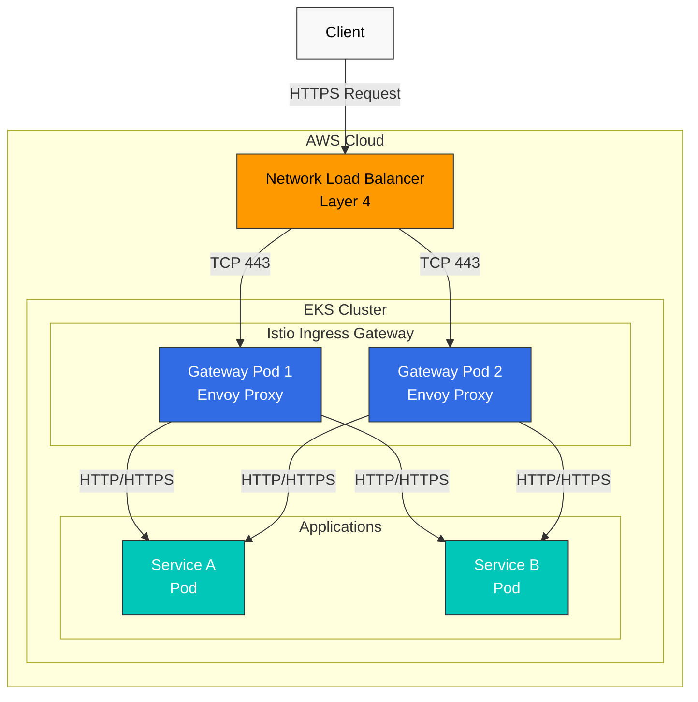
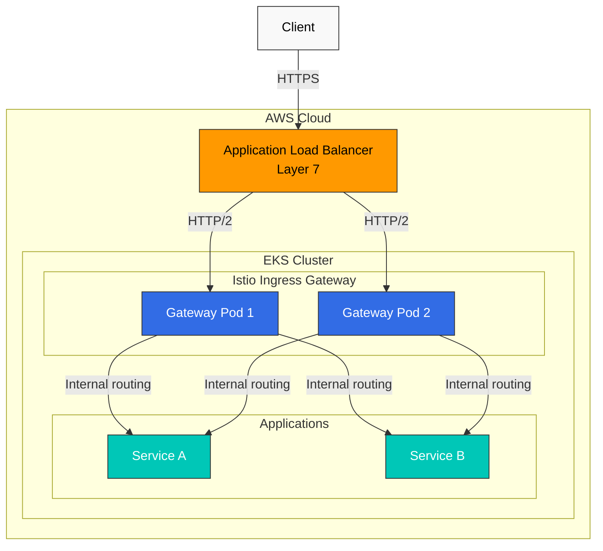
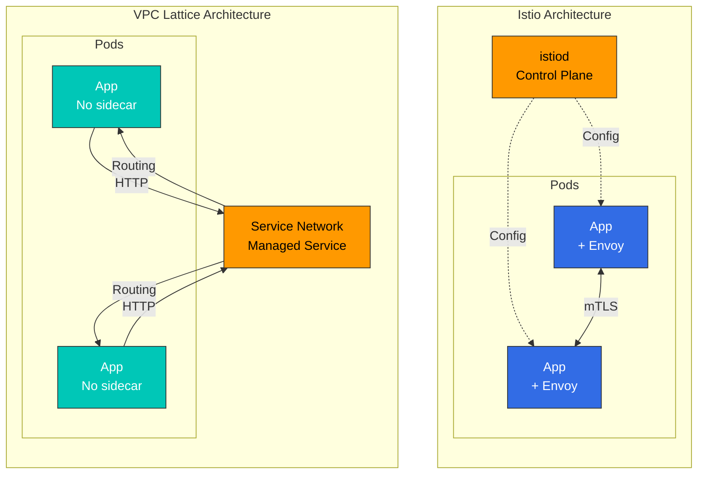
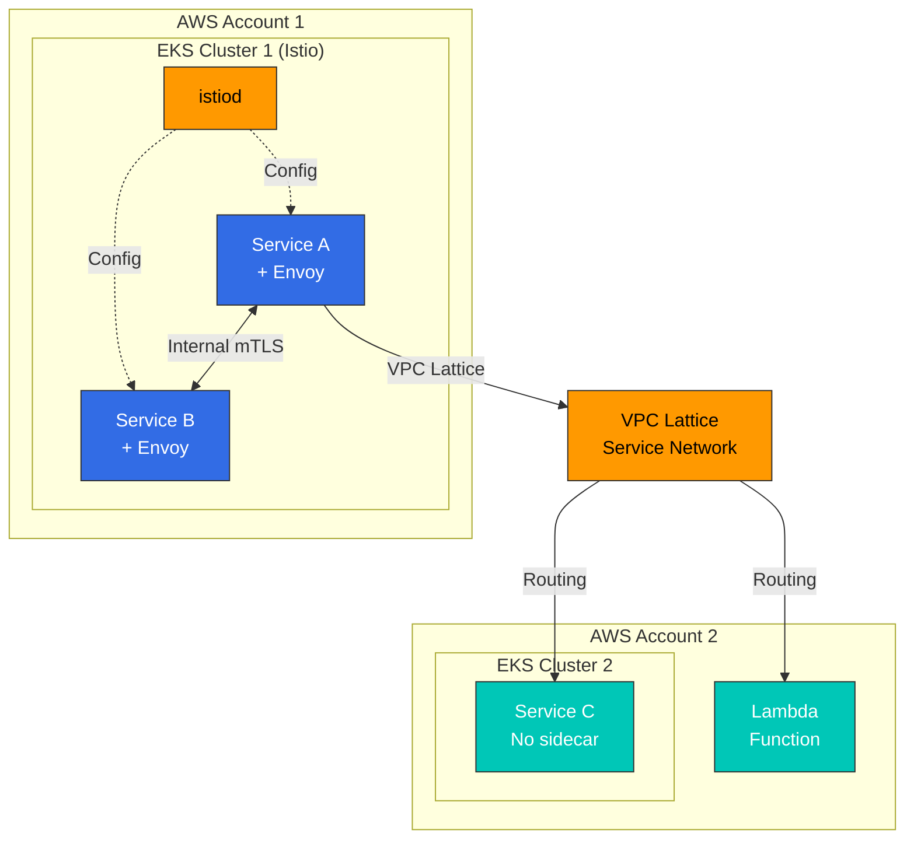

# AWS Integration

This document covers how to integrate Istio with AWS services in an Amazon EKS environment.

## Table of Contents

1. [AWS Load Balancer Integration](04-aws-integration.md#aws-load-balancer-integration)
2. [Istio vs Other Solutions Comparison](04-aws-integration.md#istio-vs-other-solutions-comparison)
3. [EKS-Specific Optimization](04-aws-integration.md#eks-specific-optimization)
4. [Best Practices](04-aws-integration.md#best-practices)

## AWS Load Balancer Integration

Istio Ingress Gateway can be integrated with AWS Load Balancer to handle external traffic.

### Network Load Balancer (NLB) Integration

NLB is a Layer 4 (TCP/UDP) load balancer, suitable when high performance and low latency are required.

#### NLB Architecture



#### NLB Configuration

**1. Install AWS Load Balancer Controller**

```bash
# Create IAM policy
curl -o iam_policy.json https://raw.githubusercontent.com/kubernetes-sigs/aws-load-balancer-controller/main/docs/install/iam_policy.json

aws iam create-policy \
    --policy-name AWSLoadBalancerControllerIAMPolicy \
    --policy-document file://iam_policy.json

# IRSA setup
eksctl create iamserviceaccount \
  --cluster=my-cluster \
  --namespace=kube-system \
  --name=aws-load-balancer-controller \
  --attach-policy-arn=arn:aws:iam::<AWS_ACCOUNT_ID>:policy/AWSLoadBalancerControllerIAMPolicy \
  --override-existing-serviceaccounts \
  --approve

# Install controller with Helm
helm repo add eks https://aws.github.io/eks-charts
helm repo update

helm install aws-load-balancer-controller eks/aws-load-balancer-controller \
  -n kube-system \
  --set clusterName=my-cluster \
  --set serviceAccount.create=false \
  --set serviceAccount.name=aws-load-balancer-controller
```

**2. Istio Ingress Gateway Configuration with NLB**

```yaml
# istio-ingress-nlb.yaml
apiVersion: v1
kind: Service
metadata:
  name: istio-ingressgateway
  namespace: istio-system
  annotations:
    # NLB configuration
    service.beta.kubernetes.io/aws-load-balancer-type: "external"
    service.beta.kubernetes.io/aws-load-balancer-nlb-target-type: "ip"
    service.beta.kubernetes.io/aws-load-balancer-scheme: "internet-facing"

    # TLS configuration
    service.beta.kubernetes.io/aws-load-balancer-ssl-cert: "arn:aws:acm:region:account:certificate/cert-id"
    service.beta.kubernetes.io/aws-load-balancer-ssl-ports: "443"
    service.beta.kubernetes.io/aws-load-balancer-backend-protocol: "tcp"

    # Health check configuration
    service.beta.kubernetes.io/aws-load-balancer-healthcheck-protocol: "http"
    service.beta.kubernetes.io/aws-load-balancer-healthcheck-port: "15021"
    service.beta.kubernetes.io/aws-load-balancer-healthcheck-path: "/healthz/ready"

    # Additional configuration
    service.beta.kubernetes.io/aws-load-balancer-cross-zone-load-balancing-enabled: "true"
    service.beta.kubernetes.io/aws-load-balancer-proxy-protocol: "*"
spec:
  type: LoadBalancer
  selector:
    app: istio-ingressgateway
    istio: ingressgateway
  ports:
  - name: status-port
    port: 15021
    protocol: TCP
    targetPort: 15021
  - name: http2
    port: 80
    protocol: TCP
    targetPort: 8080
  - name: https
    port: 443
    protocol: TCP
    targetPort: 8443
```

**3. Gateway Resource Configuration**

```yaml
apiVersion: networking.istio.io/v1
kind: Gateway
metadata:
  name: my-gateway
  namespace: istio-system
spec:
  selector:
    istio: ingressgateway
  servers:
  - port:
      number: 443
      name: https
      protocol: HTTPS
    tls:
      mode: SIMPLE
      credentialName: my-tls-secret
    hosts:
    - "myapp.example.com"
  - port:
      number: 80
      name: http
      protocol: HTTP
    hosts:
    - "myapp.example.com"
    tls:
      httpsRedirect: true
```

#### NLB Advantages

* **High Performance**: Handle millions of requests per second
* **Low Latency**: Operates at Layer 4 for fast responses
* **Static IP**: Elastic IP allocation possible
* **Protocol Support**: TCP, UDP, TLS
* **Cost Effective**: Cheaper than ALB

#### NLB Use Cases

* WebSocket, gRPC, and other long-lived connections
* Handling millions of requests per second
* When static IP is required
* When TLS termination should be done at Istio

### Application Load Balancer (ALB) Integration

ALB is a Layer 7 (HTTP/HTTPS) load balancer, suitable when advanced routing features are needed.

#### ALB Architecture



#### ALB Configuration

**1. Create ALB with Ingress Resource**

```yaml
# istio-ingress-alb.yaml
apiVersion: networking.k8s.io/v1
kind: Ingress
metadata:
  name: istio-ingress
  namespace: istio-system
  annotations:
    # ALB configuration
    alb.ingress.kubernetes.io/scheme: internet-facing
    alb.ingress.kubernetes.io/target-type: ip
    alb.ingress.kubernetes.io/listen-ports: '[{"HTTP": 80}, {"HTTPS": 443}]'
    alb.ingress.kubernetes.io/ssl-redirect: '443'

    # ACM certificate
    alb.ingress.kubernetes.io/certificate-arn: arn:aws:acm:region:account:certificate/cert-id

    # Health check
    alb.ingress.kubernetes.io/healthcheck-protocol: HTTP
    alb.ingress.kubernetes.io/healthcheck-port: '15021'
    alb.ingress.kubernetes.io/healthcheck-path: /healthz/ready
    alb.ingress.kubernetes.io/healthcheck-interval-seconds: '15'
    alb.ingress.kubernetes.io/healthcheck-timeout-seconds: '5'
    alb.ingress.kubernetes.io/success-codes: '200'
    alb.ingress.kubernetes.io/healthy-threshold-count: '2'
    alb.ingress.kubernetes.io/unhealthy-threshold-count: '2'

    # Additional configuration
    alb.ingress.kubernetes.io/load-balancer-attributes: idle_timeout.timeout_seconds=60
    alb.ingress.kubernetes.io/target-group-attributes: deregistration_delay.timeout_seconds=30
spec:
  ingressClassName: alb
  rules:
  - host: "myapp.example.com"
    http:
      paths:
      - path: /
        pathType: Prefix
        backend:
          service:
            name: istio-ingressgateway
            port:
              number: 80
```

**2. Path-Based Routing**

```yaml
apiVersion: networking.k8s.io/v1
kind: Ingress
metadata:
  name: istio-ingress-path-based
  namespace: istio-system
  annotations:
    alb.ingress.kubernetes.io/scheme: internet-facing
    alb.ingress.kubernetes.io/target-type: ip
spec:
  ingressClassName: alb
  rules:
  - host: "api.example.com"
    http:
      paths:
      - path: /v1
        pathType: Prefix
        backend:
          service:
            name: istio-ingressgateway
            port:
              number: 80
  - host: "admin.example.com"
    http:
      paths:
      - path: /
        pathType: Prefix
        backend:
          service:
            name: istio-ingressgateway
            port:
              number: 80
```

#### ALB Advantages

* **Advanced Routing**: Path, Header, Query String-based routing
* **WAF Integration**: Enhanced security with AWS WAF
* **Authentication Integration**: Cognito, OIDC integration
* **ACM Integration**: Automatic certificate management
* **Container Optimized**: Optimized for ECS, EKS

#### ALB Use Cases

* HTTP/HTTPS only traffic
* When path-based routing is needed
* When WAF security is required
* When handling multiple domains with a single load balancer

### NLB vs ALB Comparison

| Property            | NLB                                    | ALB                                      |
| ------------------- | -------------------------------------- | ---------------------------------------- |
| **OSI Layer**       | Layer 4 (TCP/UDP)                      | Layer 7 (HTTP/HTTPS)                     |
| **Performance**     | Millions of requests per second        | Tens of thousands of requests per second |
| **Latency**         | Very low                               | Low                                      |
| **Static IP**       | Supported (Elastic IP)                 | Not supported                            |
| **TLS Termination** | Pass through as TCP (handled at Istio) | Can be handled at ALB                    |
| **Routing**         | IP/Port-based                          | Path, Host, Header-based                 |
| **WAF Integration** | Not available                          | Available                                |
| **Cost**            | Lower                                  | Relatively higher                        |
| **WebSocket**       | Native support                         | Supported                                |
| **gRPC**            | Native support                         | Requires HTTP/2                          |
| **Recommended Use** | High performance, WebSocket, gRPC      | HTTP routing, WAF, authentication        |

## Istio vs Other Solutions Comparison

### Istio vs VPC Lattice

VPC Lattice is AWS's managed application networking service.

#### Architecture Comparison



#### Feature Comparison

| Property               | Istio                                | VPC Lattice                 |
| ---------------------- | ------------------------------------ | --------------------------- |
| **Management**         | Self-managed                         | AWS-managed (Fully-managed) |
| **Sidecar**            | Required (Sidecar or Ambient)        | Not required                |
| **Resource Overhead**  | High (Envoy per pod)                 | Low (no sidecar)            |
| **Complexity**         | High                                 | Low                         |
| **Learning Curve**     | Steep                                | Gentle                      |
| **Traffic Management** | Very advanced (fine-grained control) | Basic (sufficient features) |
| **mTLS**               | Automatic, fine-grained control      | Supported                   |
| **Observability**      | Rich metrics, traces                 | Basic metrics               |
| **Fault Injection**    | Supported                            | Not supported               |
| **Circuit Breaker**    | Fine-grained control                 | Basic functionality         |
| **Rate Limiting**      | Local + Global                       | Basic functionality         |
| **Multi-cluster**      | Strong support                       | Cross-VPC connectivity      |
| **Cross-account**      | Complex                              | Simple (native support)     |
| **Cost**               | Compute cost (EC2)                   | Service usage cost          |
| **Vendor Lock-in**     | None (open source)                   | AWS lock-in                 |
| **Kubernetes Only**    | Yes                                  | No (EC2, Lambda, etc.)      |

#### When to Choose Istio

**Istio is suitable when:**

1. **Fine-grained Traffic Control Needed**
   * Canary deployment, A/B testing, Traffic Mirroring
   * Complex routing rules (Header, Cookie-based, etc.)
   * Fault Injection for Chaos Engineering
2. **Strong Security Requirements**
   * Automatic mTLS encryption between services
   * Fine-grained authorization policies
   * JWT validation, RBAC
3. **Advanced Observability Needed**
   * Detailed metrics (Latency P50/P95/P99)
   * Distributed tracing (Jaeger, Zipkin)
   * Service topology visualization (Kiali)
4. **Multi-cluster Mesh**
   * Communication between multiple EKS clusters
   * Cross-cluster failover
   * Global load balancing
5. **Vendor Independence**
   * Possibility of moving to other clouds or on-premises
   * Using Kubernetes standards

**Example: Istio's Advanced Traffic Management**

```yaml
apiVersion: networking.istio.io/v1
kind: VirtualService
metadata:
  name: reviews
spec:
  hosts:
  - reviews
  http:
  # Header-based routing
  - match:
    - headers:
        user-agent:
          regex: ".*Mobile.*"
    route:
    - destination:
        host: reviews
        subset: mobile-v2
  # Canary deployment (10%)
  - match:
    - headers:
        x-canary:
          exact: "true"
    route:
    - destination:
        host: reviews
        subset: v3
      weight: 10
    - destination:
        host: reviews
        subset: v2
      weight: 90
  # Traffic Mirroring
  - route:
    - destination:
        host: reviews
        subset: v2
    mirror:
      host: reviews
      subset: v3
    mirrorPercentage:
      value: 100
```

#### When to Choose VPC Lattice

**VPC Lattice is suitable when:**

1. **Simple Service Connectivity**
   * Only basic load balancing and routing needed
   * Fast implementation is important
2. **Low Operational Overhead**
   * Prefer AWS-managed services
   * No sidecar management burden
3. **Cross-VPC/Account Communication**
   * Connecting services across multiple AWS accounts
   * Communication without VPC peering
4. **Mixed Environments**
   * EKS + EC2 + Lambda mixed environments
   * Using various compute types beyond just Kubernetes
5. **Cost Optimization**
   * Reducing sidecar resource costs
   * Small-scale services

#### Using Istio + VPC Lattice Together

The two solutions are not mutually exclusive and can be used together:



**Use Cases:**

* **Inside cluster**: Istio for fine-grained traffic management and security
* **Cross-cluster/Cross-account**: VPC Lattice for simple connectivity
* **Mixed environments**: Use VPC Lattice for connecting Istio clusters with Lambda/EC2

### Istio vs Cilium (eBPF-based)

Cilium is a Kubernetes networking and security solution using eBPF.

#### Architecture Comparison

| Property             | Istio                             | Cilium                         |
| -------------------- | --------------------------------- | ------------------------------ |
| **Technology Stack** | Envoy Proxy (sidecar)             | eBPF (kernel level)            |
| **Primary Purpose**  | Service Mesh                      | CNI + Service Mesh             |
| **Networking**       | Operates on top of Kubernetes CNI | Provides CNI itself            |
| **Performance**      | Good                              | Excellent (kernel level)       |
| **Resource Usage**   | High (sidecar)                    | Low (kernel level)             |
| **L7 Features**      | Very powerful                     | Basic                          |
| **Observability**    | Rich                              | Hubble (basic)                 |
| **Learning Curve**   | Steep                             | Steep                          |
| **Maturity**         | High                              | Medium (Service Mesh features) |

#### Feature Comparison

| Feature                | Istio                           | Cilium                              |
| ---------------------- | ------------------------------- | ----------------------------------- |
| **Network Policy**     | Kubernetes + Istio              | Kubernetes + Cilium (more powerful) |
| **L7 Load Balancing**  | Very fine-grained               | Basic                               |
| **mTLS**               | Automatic, fine-grained control | Supported                           |
| **Traffic Management** | Very advanced                   | Basic                               |
| **Observability**      | Prometheus, Jaeger, Kiali       | Hubble                              |
| **Performance**        | Good                            | Excellent                           |
| **Multi-cluster**      | Strong                          | Cluster Mesh                        |

#### When to Choose What

**Choose Istio:**

* L7 traffic management is core requirement
* Need powerful service mesh features
* Need rich observability and debugging tools

**Choose Cilium:**

* Considering CNI replacement
* Network security is main concern
* Performance optimization is important
* Want to leverage eBPF technology

**Using Together:**

* Can use Cilium as CNI and Istio as Service Mesh
* However, consider feature overlap and increased complexity

## EKS-Specific Optimization

### IAM Roles for Service Accounts (IRSA) Integration

Set up IRSA to allow Istio workloads secure access to AWS services.

#### IRSA Configuration

```bash
# 1. Create OIDC provider
eksctl utils associate-iam-oidc-provider \
    --cluster my-cluster \
    --approve

# 2. Create IAM policy
cat <<EOF > app-policy.json
{
    "Version": "2012-10-17",
    "Statement": [
        {
            "Effect": "Allow",
            "Action": [
                "s3:GetObject",
                "s3:ListBucket"
            ],
            "Resource": [
                "arn:aws:s3:::my-bucket",
                "arn:aws:s3:::my-bucket/*"
            ]
        }
    ]
}
EOF

aws iam create-policy \
    --policy-name MyAppS3Policy \
    --policy-document file://app-policy.json

# 3. Link IAM Role to Service Account
eksctl create iamserviceaccount \
    --cluster my-cluster \
    --namespace default \
    --name my-app-sa \
    --attach-policy-arn arn:aws:iam::<ACCOUNT_ID>:policy/MyAppS3Policy \
    --approve
```

#### Using Istio with IRSA

```yaml
apiVersion: v1
kind: ServiceAccount
metadata:
  name: my-app-sa
  namespace: default
  annotations:
    eks.amazonaws.com/role-arn: arn:aws:iam::<ACCOUNT_ID>:role/my-app-role
---
apiVersion: apps/v1
kind: Deployment
metadata:
  name: my-app
  namespace: default
spec:
  selector:
    matchLabels:
      app: my-app
  template:
    metadata:
      labels:
        app: my-app
    spec:
      serviceAccountName: my-app-sa  # Using IRSA
      containers:
      - name: app
        image: my-app:latest
        env:
        - name: AWS_REGION
          value: us-west-2
```

### AWS Certificate Manager (ACM) Integration

How to use ACM certificates with Istio Gateway.

#### TLS Termination at NLB

```yaml
apiVersion: v1
kind: Service
metadata:
  name: istio-ingressgateway
  namespace: istio-system
  annotations:
    service.beta.kubernetes.io/aws-load-balancer-type: "external"
    service.beta.kubernetes.io/aws-load-balancer-nlb-target-type: "ip"
    service.beta.kubernetes.io/aws-load-balancer-ssl-cert: "arn:aws:acm:region:account:certificate/cert-id"
    service.beta.kubernetes.io/aws-load-balancer-ssl-ports: "443"
    service.beta.kubernetes.io/aws-load-balancer-backend-protocol: "tcp"
spec:
  type: LoadBalancer
  selector:
    istio: ingressgateway
  ports:
  - name: https
    port: 443
    targetPort: 8443
```

#### TLS Termination at Istio (ACM Private CA)

```bash
# 1. Issue certificate from ACM Private CA
aws acm-pca issue-certificate \
    --certificate-authority-arn arn:aws:acm-pca:region:account:certificate-authority/ca-id \
    --csr file://csr.pem \
    --signing-algorithm "SHA256WITHRSA" \
    --validity Value=365,Type="DAYS"

# 2. Create Kubernetes Secret
kubectl create secret tls my-tls-secret \
    --cert=certificate.pem \
    --key=private-key.pem \
    -n istio-system

# 3. Use in Gateway
```

```yaml
apiVersion: networking.istio.io/v1
kind: Gateway
metadata:
  name: my-gateway
  namespace: istio-system
spec:
  selector:
    istio: ingressgateway
  servers:
  - port:
      number: 443
      name: https
      protocol: HTTPS
    tls:
      mode: SIMPLE
      credentialName: my-tls-secret  # ACM certificate
    hosts:
    - "myapp.example.com"
```

### CloudWatch Container Insights Integration

Implement unified monitoring by sending Istio metrics to CloudWatch.

#### CloudWatch Agent Configuration

```bash
# 1. Attach IAM policy
eksctl create iamserviceaccount \
    --cluster my-cluster \
    --namespace amazon-cloudwatch \
    --name cloudwatch-agent \
    --attach-policy-arn arn:aws:iam::aws:policy/CloudWatchAgentServerPolicy \
    --approve

# 2. Install CloudWatch Agent
kubectl apply -f https://raw.githubusercontent.com/aws-samples/amazon-cloudwatch-container-insights/latest/k8s-deployment-manifest-templates/deployment-mode/daemonset/container-insights-monitoring/cloudwatch-namespace.yaml

kubectl apply -f https://raw.githubusercontent.com/aws-samples/amazon-cloudwatch-container-insights/latest/k8s-deployment-manifest-templates/deployment-mode/daemonset/container-insights-monitoring/cwagent/cwagent-serviceaccount.yaml
```

#### Prometheus Metric Scraping

```yaml
# prometheus-config.yaml
apiVersion: v1
kind: ConfigMap
metadata:
  name: prometheus-config
  namespace: amazon-cloudwatch
data:
  prometheus.yaml: |
    global:
      scrape_interval: 1m
      scrape_timeout: 10s

    scrape_configs:
    # Istio Control Plane metrics
    - job_name: 'istiod'
      kubernetes_sd_configs:
      - role: endpoints
        namespaces:
          names:
          - istio-system
      relabel_configs:
      - source_labels: [__meta_kubernetes_service_name, __meta_kubernetes_endpoint_port_name]
        action: keep
        regex: istiod;http-monitoring

    # Envoy sidecar metrics
    - job_name: 'envoy-stats'
      metrics_path: /stats/prometheus
      kubernetes_sd_configs:
      - role: pod
      relabel_configs:
      - source_labels: [__meta_kubernetes_pod_container_port_name]
        action: keep
        regex: '.*-envoy-prom'
      - source_labels: [__address__, __meta_kubernetes_pod_annotation_prometheus_io_port]
        action: replace
        regex: ([^:]+)(?::\d+)?;(\d+)
        replacement: $1:15090
        target_label: __address__
```

#### CloudWatch Logs Insights Query

```sql
-- Istio error log analysis
fields @timestamp, @message
| filter @logStream like /istio-proxy/
| filter @message like /error/
| sort @timestamp desc
| limit 100

-- Request latency analysis
fields @timestamp, request_duration_ms
| filter @logStream like /istio-proxy/
| stats avg(request_duration_ms), max(request_duration_ms), pct(request_duration_ms, 95) by bin(5m)
```

### EKS Optimization Settings

#### 1. Pod Resources Optimization

```yaml
# Envoy sidecar resource optimization
apiVersion: install.istio.io/v1alpha1
kind: IstioOperator
spec:
  meshConfig:
    defaultConfig:
      proxyMetadata:
        # EKS optimization
        ISTIO_META_DNS_CAPTURE: "true"
        ISTIO_META_DNS_AUTO_ALLOCATE: "true"
  values:
    global:
      proxy:
        resources:
          requests:
            cpu: 100m
            memory: 128Mi
          limits:
            cpu: 2000m
            memory: 1024Mi
        # Connection pool settings
        concurrency: 2
```

#### 2. Cluster Autoscaler Considerations

```yaml
# Istio Gateway Autoscaling
apiVersion: autoscaling/v2
kind: HorizontalPodAutoscaler
metadata:
  name: istio-ingressgateway
  namespace: istio-system
spec:
  scaleTargetRef:
    apiVersion: apps/v1
    kind: Deployment
    name: istio-ingressgateway
  minReplicas: 2
  maxReplicas: 10
  metrics:
  - type: Resource
    resource:
      name: cpu
      target:
        type: Utilization
        averageUtilization: 80
  - type: Resource
    resource:
      name: memory
      target:
        type: Utilization
        averageUtilization: 80
```

#### 3. Pod Disruption Budget

```yaml
apiVersion: policy/v1
kind: PodDisruptionBudget
metadata:
  name: istio-ingressgateway
  namespace: istio-system
spec:
  minAvailable: 1
  selector:
    matchLabels:
      app: istio-ingressgateway
```

## Best Practices

### 1. Load Balancer Selection Guide

**Use NLB:**

* gRPC, WebSocket, and other long-lived connections
* Handling millions of requests per second
* Static IP required
* TLS termination at Istio

**Use ALB:**

* HTTP/HTTPS only
* Path-based routing
* WAF security required
* Cognito authentication integration

### 2. TLS Termination Location

**Terminate at Load Balancer (Recommended):**

* ACM certificate auto-renewal
* Easy management
* Reduced Istio load

**Terminate at Istio:**

* End-to-end encryption required
* Fine-grained TLS policy control
* Using mTLS

### 3. Cost Optimization

* **Spot Instances**: Use for Istio Gateway workloads
* **Graviton Instances**: Cost savings with ARM-based instances
* **Resource Limits**: Set appropriate sidecar resource limits
* **Ambient Mode**: Consider for eliminating sidecar overhead

### 4. Security

* **IRSA**: Access AWS services with IAM roles
* **Security Groups**: Principle of least privilege
* **mTLS**: Enable encryption between services
* **Network Policy**: Use with Cilium or Calico

### 5. Monitoring

* **CloudWatch**: Unified logs and metrics
* **X-Ray**: Distributed tracing
* **Prometheus + Grafana**: Detailed metrics
* **Kiali**: Service mesh visualization

## Next Steps

If you've completed AWS integration, refer to the following documents:

1. [**Traffic Management**](traffic-management/README.md): Advanced traffic management features
2. [**Security**](security/README.md): mTLS and authentication/authorization
3. [**Observability**](observability/README.md): Metrics, logs, trace collection

## References

* [AWS Load Balancer Controller](https://kubernetes-sigs.github.io/aws-load-balancer-controller/)
* [EKS Best Practices - Networking](https://aws.github.io/aws-eks-best-practices/networking/)
* [VPC Lattice Documentation](https://docs.aws.amazon.com/vpc-lattice/)
* [Cilium Documentation](https://docs.cilium.io/)
* [AWS Container Insights](https://docs.aws.amazon.com/AmazonCloudWatch/latest/monitoring/ContainerInsights.html)
