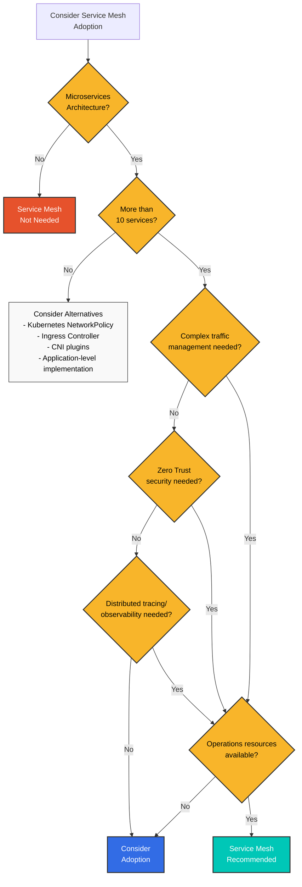
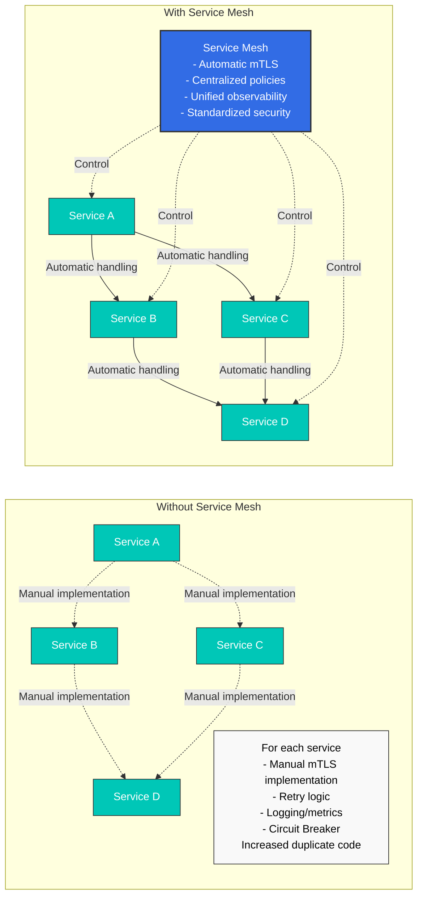
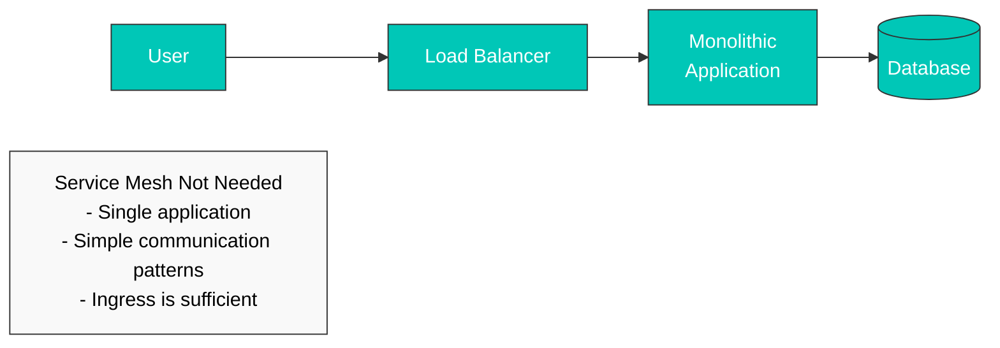
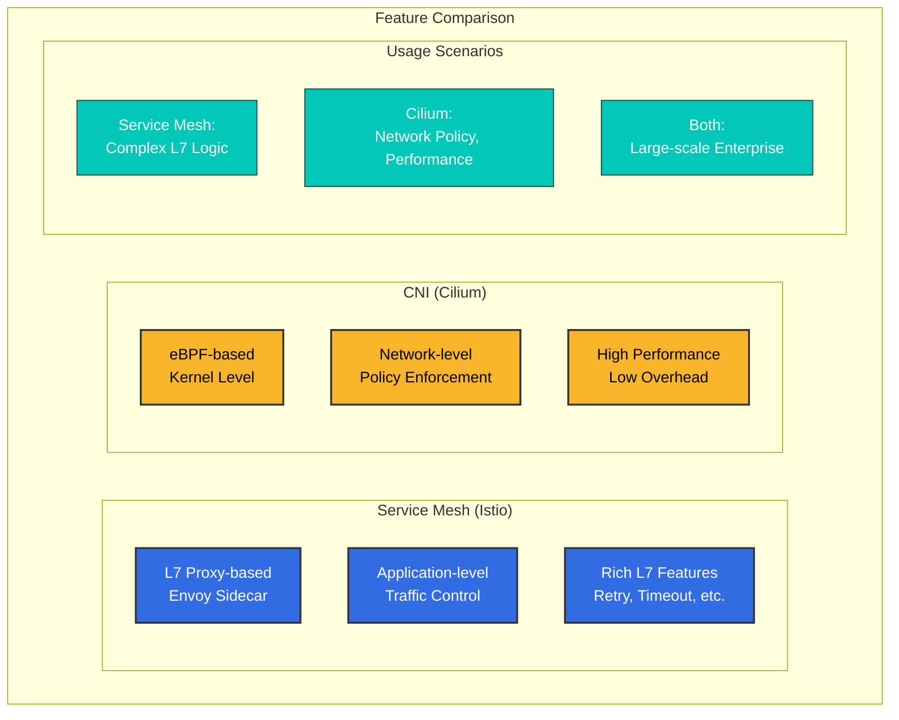
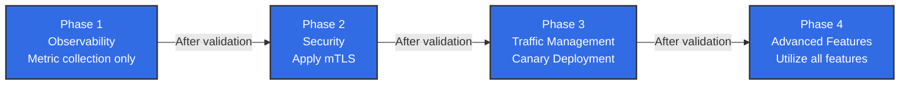
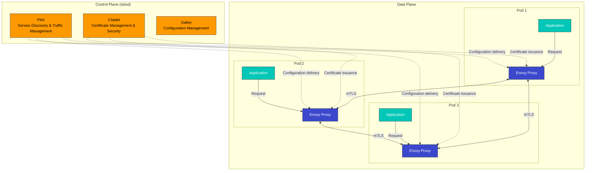

# Istio

> **Last Updated**: August 17, 2026

A practical guide for utilizing Istio Service Mesh on Amazon EKS.

### August 2026 Update: Istio 1.31 Enters Beta

The release process for the next minor version, Istio 1.31, is underway: 1.31.0-alpha.2 was published on August 11, 2026, followed by 1.31.0-beta.0 on August 13 and 1.31.0-beta.1 on August 14. Alpha/beta builds are pre-releases for early validation, not production use — only pick them up if you want to test new features ahead of the GA release. See the [Istio releases page](https://github.com/istio/istio/releases) for details.

### July 2026 Update: Istio 1.30.3 / 1.29.6 Patch Releases

On July 16, 2026, the Istio 1.30.3 and 1.29.6 patch releases were published. Highlights of 1.30.3:

- Improved istiod scalability in ambient mode by scoping XDS pushes from workload/service address changes to only the affected waypoints
- Fixed a bug where istiod did not pick up updated remote cluster secrets (e.g. during credential/token rotation) until restarted
- The pilot node untaint controller's taint name is now customizable via the `PILOT_NODE_UNTAINT_CONTROLLERS_TAINT_NAME` environment variable

See the [official announcement](https://istio.io/latest/news/releases/1.30.x/announcing-1.30.3/) for details.

## Table of Contents

1. [Do You Really Need a Service Mesh?](#do-you-really-need-a-service-mesh)
2. [Installation and Initial Setup](01-installation.md)
3. [Basic Concepts](02-basic-concepts.md)
4. [Architecture](03-architecture.md)
5. [AWS Integration](04-aws-integration.md)
6. [Glossary](glossary.md)
7. [Traffic Management](traffic-management/README.md)
8. [Security](security/README.md)
9. [Observability](observability/README.md)
10. [Resilience](resilience/README.md)
11. [Advanced](advanced/README.md)
12. [Troubleshooting](troubleshooting/common-errors.md)
13. [Best Practices](best-practices.md)
14. [Alternative Comparison](comparison/README.md)

## What is Istio?

Istio is an open-source service mesh platform for connecting, securing, controlling, and observing microservices. It manages communication between services in complex microservice architectures and provides traffic control, security, and observability.

### Service Mesh Concept

<div align="center"></div>

A service mesh is an infrastructure layer that manages communication between microservices. Istio deploys a Sidecar Proxy (Envoy) alongside each service to intercept and control all network traffic. This provides the following capabilities without modifying application code:

* **Traffic Routing**: Intelligent routing, load balancing, Canary deployments
* **Security**: Automatic mTLS, authentication, authorization
* **Observability**: Metrics, logs, distributed tracing
* **Resilience**: Circuit Breaking, Retry, Timeout

### Practical Usage Examples

<p align="center"><br><em>Application without Istio</em></p>

<p align="center"><br><em>Application with Istio - Envoy Proxy deployed as Sidecar to each service</em></p>

When Istio is applied, an Envoy Proxy is automatically deployed as a sidecar container to each microservice, transparently intercepting and controlling all network traffic.

## Do You Really Need a Service Mesh?

A service mesh is a powerful tool, but it's not suitable for every situation. Careful consideration is needed before adoption.

### Decision Flow



### When Service Mesh is Needed ✅

#### 1. Complex Microservices Environment



**Recommended Criteria**:

* ✅ 10 or more microservices
* ✅ Frequent inter-service communication (East-West traffic)
* ✅ Multiple programming languages used (Polyglot)
* ✅ Multiple teams developing services independently

#### 2. Zero Trust Security Requirements

**Service Mesh Provides**:

* Automatic mTLS encryption between services
* SPIFFE-based Identity management
* Fine-grained authentication/authorization policies
* Guaranteed encrypted communication

**Difficult to Achieve Without Alternatives**:

* Duplicate security logic implementation in each service
* Complexity of manual certificate management
* Inconsistent security policies

#### 3. Advanced Traffic Management

```yaml
# Canary Deployment (Traffic Distribution)
apiVersion: networking.istio.io/v1
kind: VirtualService
metadata:
  name: reviews
spec:
  hosts:
  - reviews
  http:
  - route:
    - destination:
        host: reviews
        subset: v1
      weight: 90
    - destination:
        host: reviews
        subset: v2
      weight: 10  # Only 10% to new version
```

**When Needed**:

* Canary deployments, A/B testing
* Header/path-based routing
* Traffic Mirroring (Shadow Testing)
* Fault Injection (Chaos Engineering)
* Circuit Breaking, Retry, Timeout

#### 4. Unified Observability

**Service Mesh Advantages**:

* Automatic metric collection without application code modification
* Automatic Distributed Tracing implementation
* Unified logging format
* Service topology visualization (Kiali)

### When Service Mesh is Not Needed ❌

#### 1. Simple Architecture



**Use Instead**:

* Kubernetes Ingress Controller (NGINX, Traefik)
* Simple load balancer
* Application-level implementation

#### 2. Few Microservices (<10)

**Overhead is Greater**:

* Service Mesh operational complexity > benefits gained
* 5-10 services can be managed manually
* NetworkPolicy provides sufficient security

**Alternative**:

```yaml
# Kubernetes NetworkPolicy is sufficient
apiVersion: networking.k8s.io/v1
kind: NetworkPolicy
metadata:
  name: allow-frontend-to-backend
spec:
  podSelector:
    matchLabels:
      app: backend
  ingress:
  - from:
    - podSelector:
        matchLabels:
          app: frontend
```

#### 3. Insufficient Operations Resources

**Service Mesh Operations Requirements**:

* Istio/Envoy expertise
* Control Plane monitoring and management
* Upgrade and patch management
* Troubleshooting capability (increased debugging complexity)

**Team Preparation Needed**:

* At least 1-2 Service Mesh experts
* Continuous learning and update tracking
* Sufficient test environment

#### 4. When Performance is Extremely Critical

**Service Mesh Overhead**:

* Latency: +1-3ms (P50), +5-10ms (P99)
* CPU: +10-20% per pod
* Memory: +50-100MB per pod (Sidecar mode)

**Consider Alternatives**:

* Ambient Mode (90% reduction in resource usage)
* CNI-based solutions (Cilium)
* Application-level optimization

### Alternative Solutions Comparison

| Feature                    | Service Mesh                                 | CNI (Cilium)    | Ingress Controller | App-level                |
| -------------------------- | -------------------------------------------- | --------------- | ------------------ | ------------------------ |
| **L7 Traffic Management**  | ✅ Full support                               | ⚠️ Limited      | ⚠️ Ingress only    | ✅ Possible               |
| **mTLS Automation**        | ✅ Full support                               | ✅ Possible      | ❌ Not supported    | ❌ Manual implementation  |
| **Distributed Tracing**    | ✅ Automatic                                  | ❌ Not supported | ❌ Not supported    | ⚠️ Manual implementation |
| **L3/L4 Policies**         | ✅ Supported                                  | ✅ Full support  | ❌ Not supported    | ❌ Not supported          |
| **Operational Complexity** | 🔴 High                                      | 🟡 Medium       | 🟢 Low             | 🟡 Medium                |
| **Resource Overhead**      | <p>🔴 High (Sidecar)<br>🟢 Low (Ambient)</p> | 🟢 Low          | 🟢 Low             | 🟢 None                  |
| **Suitable Scale**         | 10+ services                                 | All scales      | Small scale        | Small scale              |

### CNI-Based Solution (Cilium)

Cilium provides many features at the **network level** based on eBPF:



**When Cilium is More Suitable**:

* L3/L4 network policies are the main purpose
* High performance is a core requirement
* Avoiding Service Mesh operational burden
* Only simple mTLS and observability needed

**Reference**: [Cilium Documentation](../../networking/cilium/README.md)

### Decision Checklist

Answer the following questions before adoption:

**Architecture**:

* [ ] Do you have 10 or more microservices?
* [ ] Is inter-service communication complex?
* [ ] Are multiple programming languages used?

**Security**:

* [ ] Is a Zero Trust security model needed?
* [ ] Is mTLS encryption between services mandatory?
* [ ] Is fine-grained access control needed?

**Traffic Management**:

* [ ] Are Canary deployments, A/B testing needed?
* [ ] Are advanced routing rules needed?
* [ ] Are Circuit Breaking, Retry needed for many services?

**Observability**:

* [ ] Is distributed tracing mandatory?
* [ ] Is unified metric collection needed?
* [ ] Is service topology visualization needed?

**Operations**:

* [ ] Do you have Service Mesh experts?
* [ ] Can you handle the operational complexity?
* [ ] Can you accept the resource overhead?

**Results**:

* ✅ 10 or more checked: Service Mesh strongly recommended
* 🟡 5-9 checked: Careful evaluation needed, start small (Ambient Mode recommended)
* ❌ 4 or fewer checked: Consider alternative solutions (CNI, Ingress, App-level)

### Gradual Adoption Strategy

If you determine that a Service Mesh is needed, adopt it gradually:



**Recommended Order**:

1. **Pilot Project** (1-2 namespaces)
2. **Observability First** (metrics, logs, traces)
3. **Apply Security** (mTLS PERMISSIVE → STRICT)
4. **Traffic Management** (VirtualService, DestinationRule)
5. **Company-wide Expansion**

### Key Features

1.  **Traffic Management**

    <div align="center"></div>

    * Intelligent routing and load balancing
    * A/B testing, Canary deployment, Blue/Green deployment
    * Circuit Breaking, Retry, Timeout control
    * Traffic Mirroring and Fault Injection
2.  **Security**

    <div align="center"></div>

    * Automatic mTLS encryption between services
    * Strong authentication and authorization
    * Fine-grained access control policies
    * Network isolation and security policies
3.  **Observability**

    <div align="center"></div>

    * Automatic metrics, logs, and trace generation
    * Prometheus, Grafana, Jaeger, Kiali integration
    * Service topology visualization
    * Real-time traffic monitoring
4. **Resilience**
   * Circuit Breaker pattern
   * Rate Limiting
   * Outlier Detection
   * Zone Aware Routing

### Istio Architecture

<div align="center"></div>

Istio consists of a Control Plane and a Data Plane:



**Control Plane (istiod)**:

* **Pilot**: Service discovery, traffic routing rule management
* **Citadel**: Certificate generation and management, mTLS enablement
* **Galley**: Configuration validation and deployment

**Data Plane**:

* **Envoy Proxy**: Deployed as a sidecar to each pod, intercepting and controlling all network traffic

### Benefits of Using Istio on Amazon EKS

1. **Easy Microservices Management**
   * Traffic management without application code modification
   * Consistent policy application with declarative configuration
   * Uses Kubernetes Native API
2. **Enhanced Security**
   * Automatic encryption between services
   * Authentication integrated with AWS IAM
   * Fine-grained permission control
3. **Improved Observability**
   * Integration with Amazon CloudWatch
   * Distributed tracing through AWS X-Ray
   * Detailed metrics and logs
4. **Integration with AWS Services**
   * Application Load Balancer (ALB) integration
   * AWS Certificate Manager (ACM) integration
   * Compatible with Amazon EBS CSI Driver

### Getting Started

<div align="center"></div>

If you're new to Istio, read the documents in the following order:

1. [**Installation and Initial Setup**](01-installation.md): Install Istio on EKS cluster
2. [**Basic Concepts**](02-basic-concepts.md): Understand Istio core concepts
3. [**Traffic Management**](traffic-management/README.md): Learn Gateway, VirtualService, DestinationRule
4. [**Security**](security/README.md): Configure mTLS, authentication, authorization
5. [**Observability**](observability/README.md): Collect metrics, logs, traces
6. [**Best Practices**](best-practices.md): Recommendations for production environments

### Hands-on Examples

Each section includes working YAML examples. All examples are structured to be click-to-copy:

```yaml
# Example VirtualService
apiVersion: networking.istio.io/v1
kind: VirtualService
metadata:
  name: reviews
spec:
  hosts:
  - reviews
  http:
  - route:
    - destination:
        host: reviews
        subset: v1
```

### References

* [Istio Official Documentation](https://istio.io/latest/docs/)
* [Istio GitHub](https://github.com/istio/istio)
* [AWS EKS Workshop - Istio](https://www.eksworkshop.com/intermediate/330_servicemesh_using_istio/)
* [Istio Community](https://discuss.istio.io/)

### Quizzes

To test what you've learned in this chapter, try the following quizzes:

* [Traffic Management Quiz](../../quizzes/service-mesh/istio/traffic-management.md)
* [Security Quiz](../../quizzes/service-mesh/istio/security.md)
* [Observability Quiz](../../quizzes/service-mesh/istio/observability.md)
* [Resilience Quiz](../../quizzes/service-mesh/istio/resilience.md)
* [Advanced Quiz](../../quizzes/service-mesh/istio/advanced.md)
