# Ambient Mode

Ambient Mode is an innovative data plane architecture introduced in Istio 1.28. It reduces the complexity and resource overhead of the traditional Sidecar approach while still providing core Service Mesh functionality.

## Table of Contents

1. [Overview](#overview)
2. [Sidecar Mode vs Ambient Mode](#sidecar-mode-vs-ambient-mode)
3. [Architecture](#architecture)
4. [Installation and Configuration](#installation-and-configuration)
5. [Migration](#migration)
6. [Performance Comparison](#performance-comparison)
7. [Use Cases](#use-cases)
8. [Troubleshooting](#troubleshooting)

## Overview

<p align="center">
  
</p>

Ambient Mode is a new approach that provides Service Mesh functionality without injecting Sidecar proxies into application pods. As shown in the diagram above, Ambient Mode consists of a **Layered Architecture**:

1. **Secure Overlay Layer (L4)**: mTLS and basic telemetry through ztunnel
2. **L7 Processing Layer**: Advanced traffic management through Waypoint Proxy

### Why is Ambient Mode Needed?

Limitations of the traditional Sidecar model:
- **High resource overhead**: Each pod requires an Envoy proxy (50-100MB memory)
- **Operational complexity**: Pod restarts, version management, rolling updates are complex
- **Initial latency**: Pod startup time increases due to Sidecar initialization
- **Excessive functionality**: Most workloads don't use L7 features

Ambient Mode solutions:
- One proxy per node: Over 90% reduction in resource usage
- No pod restart required: Zero-downtime Service Mesh adoption
- Gradual adoption: Expand from L4 to L7 as needed
- Transparent integration: No application code changes

### Core Concepts

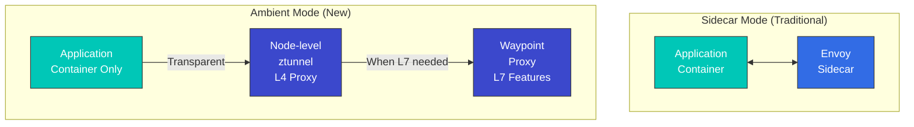

### Advantages of Ambient Mode

1. **Low resource usage**: Proxy per node instead of per pod
2. **Simple deployment**: No pod restart required
3. **Transparent adoption**: No application changes
4. **Flexible L7 features**: Use waypoint only when needed

## Sidecar Mode vs Ambient Mode

### Architecture Comparison

#### Sidecar Mode

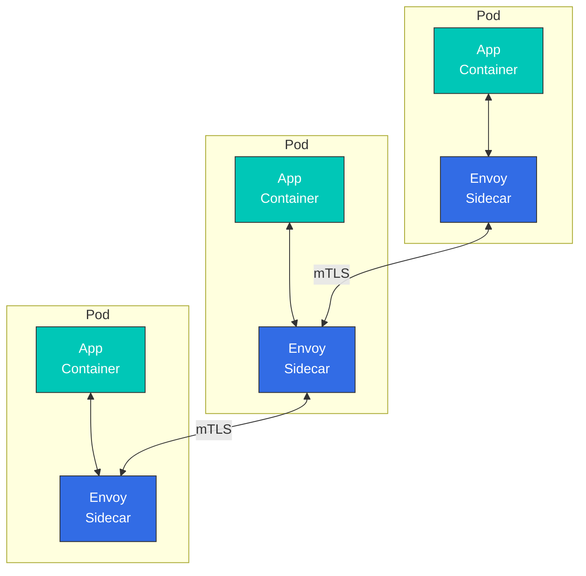

**Characteristics**:
- Envoy proxy injected into each pod
- All L4/L7 features supported
- High resource usage
- Pod restart required

#### Ambient Mode

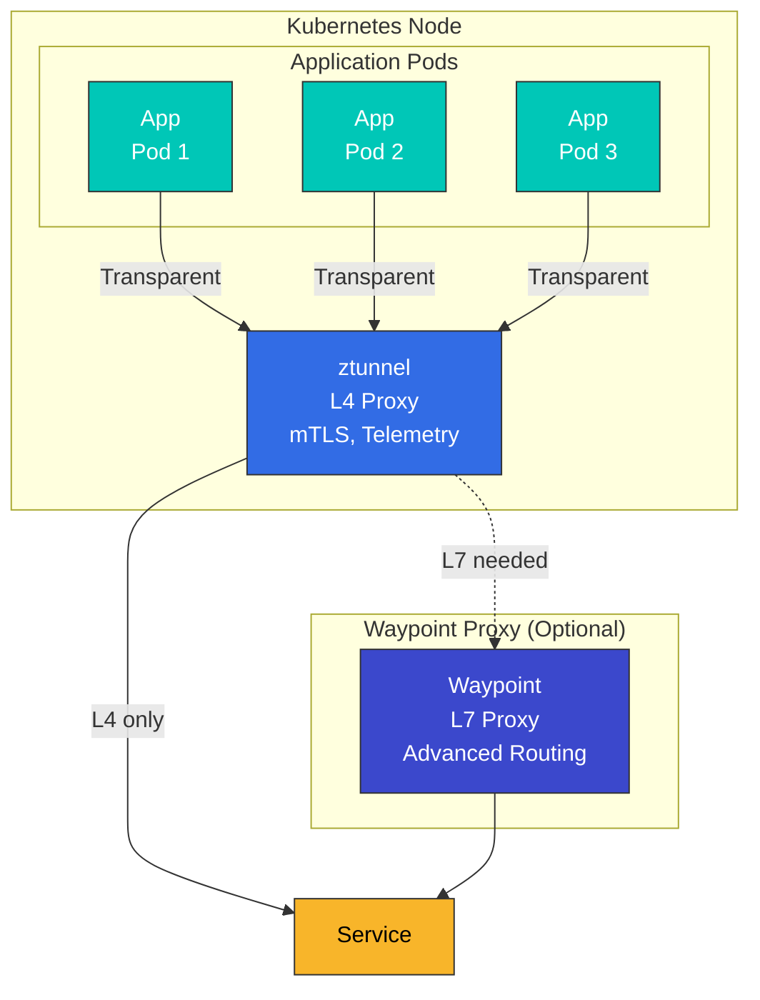

**Characteristics**:
- One ztunnel per node
- L4 features provided by default
- L7 features require waypoint
- No pod restart required

### Detailed Comparison Table

| Item | Sidecar Mode | Ambient Mode |
|------|-------------|--------------|
| **Deployment method** | Sidecar injection into pod | Node-level ztunnel + optional waypoint |
| **Resource usage** | High (~50-100MB per pod) | Low (~50MB per node) |
| **Pod restart** | Required | Not required |
| **Initial latency** | Present (Sidecar initialization) | Minimal |
| **L4 features** | Supported | Supported |
| **L7 features** | Fully supported | Requires Waypoint |
| **mTLS** | Automatic | Automatic |
| **Telemetry** | Detailed | Basic (L4), Detailed (L7 with waypoint) |
| **Circuit Breaker** | Supported | Requires Waypoint |
| **Retry/Timeout** | Supported | Requires Waypoint |
| **Header manipulation** | Supported | Requires Waypoint |
| **Performance overhead** | Medium (~5-10%) | Low (~1-3%) |
| **Operational complexity** | High | Low |
| **Production readiness** | Mature | Beta (Istio 1.28+) |

### Resource Usage Comparison

```yaml
# Sidecar Mode
# 100 pods x 50MB = 5GB memory
# 100 pods x 0.1 CPU = 10 vCPU

# Ambient Mode
# 10 nodes x 50MB = 500MB memory (ztunnel)
# + Waypoint (when needed): 200MB memory
# Total: ~700MB memory
```

## Architecture

<p align="center">
  
</p>

The Ambient Mode data plane consists of two core components: **ztunnel** and **Waypoint Proxy**.

### ztunnel (Zero Trust Tunnel)

<p align="center">
  
</p>

ztunnel is the core component of Ambient Mode, a **lightweight L4 proxy running at the node level**. It is deployed as a DaemonSet on each Kubernetes node and transparently handles all pod traffic on that node.

#### How ztunnel Works

1. **Traffic capture**: Transparently intercepts pod network traffic through CNI plugin and eBPF
2. **mTLS application**: Automatically applies mTLS encryption using SPIFFE-based Identity
3. **Load balancing**: Performs L4 load balancing between endpoints
4. **Telemetry collection**: Collects connection metrics and logs
5. **Forwarding**: Forwards traffic to destination ztunnel or Waypoint

**ztunnel Technology Stack**:
- **Language**: Rust (high performance, low memory usage)
- **Protocol**: HBONE (HTTP-Based Overlay Network Environment)
- **Identity**: SPIFFE/SPIRE standard compliant
- **CNI**: Tight integration with Istio CNI plugin

#### ztunnel Role

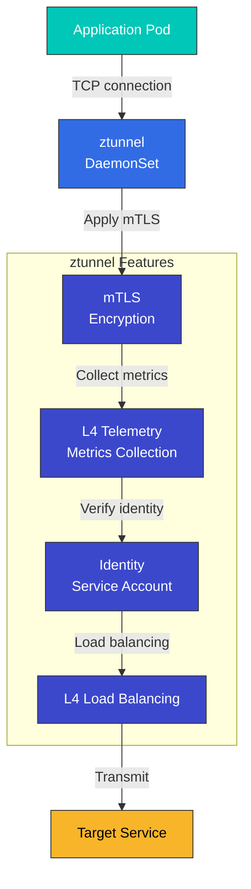

**ztunnel Characteristics**:
- Written in Rust (performance optimized)
- Deployed as DaemonSet
- Integrated with CNI plugin
- eBPF-based traffic redirection

#### ztunnel Deployment

```yaml
apiVersion: apps/v1
kind: DaemonSet
metadata:
  name: ztunnel
  namespace: istio-system
spec:
  selector:
    matchLabels:
      app: ztunnel
  template:
    metadata:
      labels:
        app: ztunnel
    spec:
      hostNetwork: true
      containers:
      - name: istio-proxy
        image: istio/ztunnel:1.28.0
        securityContext:
          privileged: true
          capabilities:
            add:
            - NET_ADMIN
            - SYS_ADMIN
        resources:
          requests:
            cpu: 100m
            memory: 50Mi
          limits:
            cpu: 200m
            memory: 100Mi
```

### Waypoint Proxy

<p align="center">
  
</p>

Waypoint is an **optional proxy used when L7 features are needed**. As shown in the diagram above, Waypoint is placed in front of services to provide advanced traffic management features.

#### Key Characteristics of Waypoint

1. **Selective deployment**: Used only for services that need L7 features, not all services
2. **Shared proxy**: Multiple workloads share a single Waypoint (per Namespace or ServiceAccount)
3. **Envoy-based**: Uses the same Envoy proxy as traditional Sidecar, supporting all Istio L7 features
4. **On-demand**: Can be dynamically added/removed at runtime

#### Waypoint Deployment Units

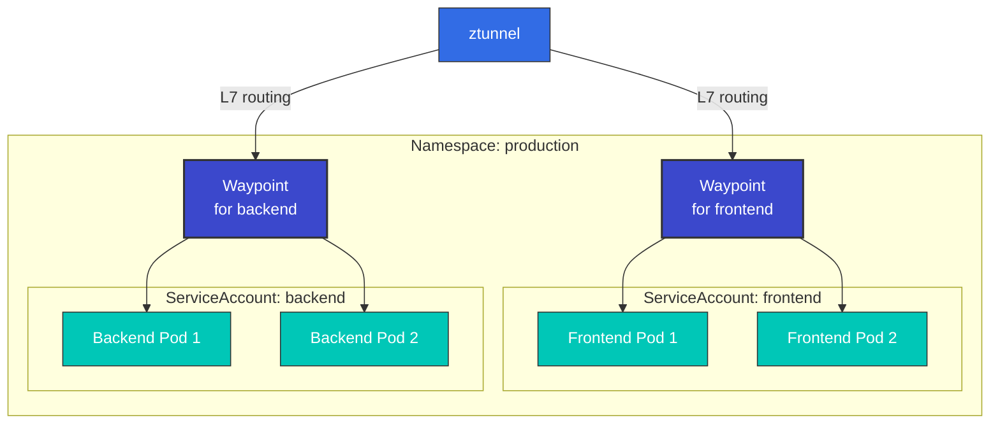

**Deployment Options**:
- **ServiceAccount-based**: Only pods with specific SA use the corresponding Waypoint
- **Namespace-based**: All pods in the entire Namespace use a single Waypoint
- **Workload-based**: Applied only to specific workloads (Deployment, StatefulSet, etc.)

#### Waypoint Role

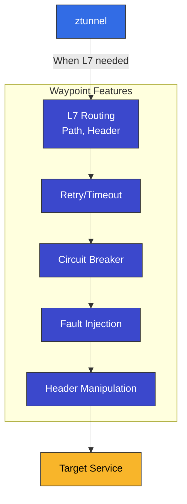

**Waypoint Characteristics**:
- Deployed per Service Account or per Namespace
- Based on Envoy proxy
- Supports all L7 Istio features
- Selective use for required services only

#### Waypoint Deployment

```yaml
apiVersion: gateway.networking.k8s.io/v1
kind: Gateway
metadata:
  name: reviews-waypoint
  namespace: default
spec:
  gatewayClassName: istio-waypoint
  listeners:
  - name: mesh
    port: 15008
    protocol: HBONE
```

### Complete Traffic Flow

The following is a comprehensive diagram showing how traffic flows in Ambient Mode **without Sidecars**:

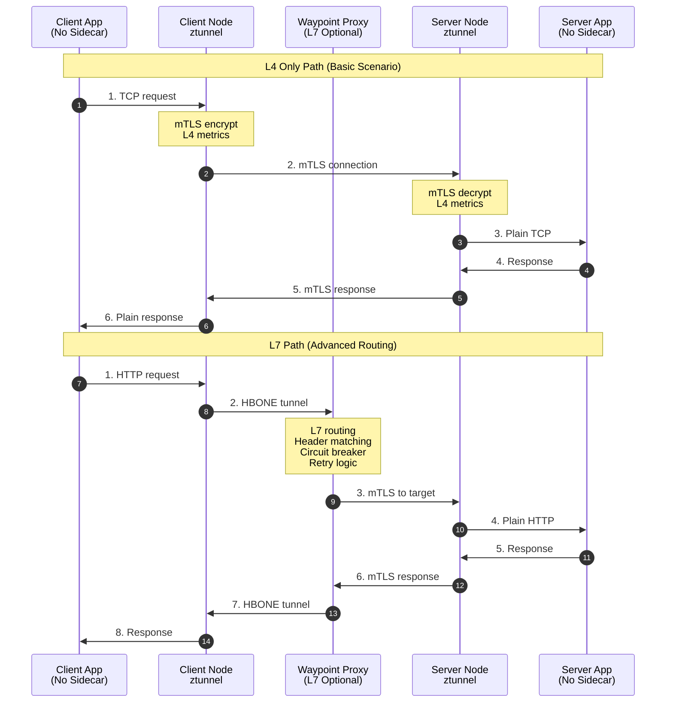

**Traffic Flow Analysis**:

1. **L4 Only Path** (using ztunnel only):
   - Minimal latency (~1ms)
   - mTLS automatically applied
   - Basic telemetry
   - Sufficient for 80-90% of workloads

2. **L7 Path** (ztunnel + Waypoint):
   - Header-based routing
   - Circuit Breaking
   - Retry/Timeout
   - When complex traffic policies are needed

### HBONE Protocol

<p align="center">
  
</p>

**HBONE (HTTP-Based Overlay Network Environment)** is the tunneling protocol used in Ambient Mode:

- **HTTP/2 based**: Compatibility with existing infrastructure
- **Built-in mTLS**: Secure communication
- **Efficient**: Minimal overhead
- **Firewall friendly**: Uses standard HTTP/2 ports

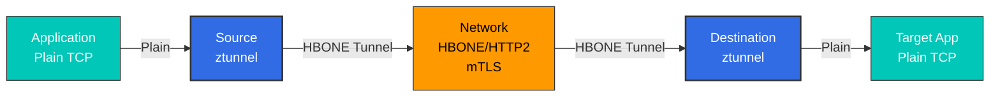

## Installation and Configuration

### 1. Istio Installation (Ambient Mode)

```bash
# Download Istio
curl -L https://istio.io/downloadIstio | ISTIO_VERSION=1.28.0 sh -
cd istio-1.28.0
export PATH=$PWD/bin:$PATH

# Install with Ambient profile
istioctl install --set profile=ambient -y

# Verify installation
kubectl get pods -n istio-system
# Output:
# NAME                                   READY   STATUS
# istio-cni-node-xxxxx                   1/1     Running
# istiod-xxxxx                           1/1     Running
# ztunnel-xxxxx                          1/1     Running
```

### 2. Enable Ambient Mode for Namespace

```bash
# Enable Ambient Mode with Label
kubectl label namespace default istio.io/dataplane-mode=ambient

# Verify
kubectl get namespace default -o yaml | grep istio.io/dataplane-mode
```

### 3. Deploy Application

```yaml
# Normal Deployment (No Sidecar needed)
apiVersion: apps/v1
kind: Deployment
metadata:
  name: reviews
  namespace: default
spec:
  replicas: 3
  selector:
    matchLabels:
      app: reviews
  template:
    metadata:
      labels:
        app: reviews
    spec:
      containers:
      - name: reviews
        image: istio/examples-bookinfo-reviews-v1:1.17.0
        ports:
        - containerPort: 9080
```

### 4. Deploy Waypoint Proxy (Optional)

```bash
# Create Waypoint per Service Account
istioctl x waypoint apply --service-account reviews

# Or per Namespace Waypoint
istioctl x waypoint apply --namespace default

# Verify Waypoint
kubectl get gateway -n default
```

### 5. Use L7 Features

```yaml
# VirtualService (using Waypoint)
apiVersion: networking.istio.io/v1
kind: VirtualService
metadata:
  name: reviews
  namespace: default
spec:
  hosts:
  - reviews
  http:
  - match:
    - headers:
        end-user:
          exact: jason
    route:
    - destination:
        host: reviews
        subset: v2
  - route:
    - destination:
        host: reviews
        subset: v1
---
# DestinationRule
apiVersion: networking.istio.io/v1
kind: DestinationRule
metadata:
  name: reviews
spec:
  host: reviews
  subsets:
  - name: v1
    labels:
      version: v1
  - name: v2
    labels:
      version: v2
```

## Migration

### From Sidecar Mode to Ambient Mode

#### Step-by-step Migration

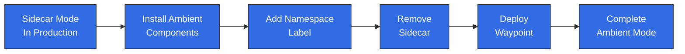

#### Step 1: Install Ambient Components

```bash
# If existing Istio is installed
istioctl install --set profile=ambient --skip-confirmation

# Verify ztunnel and CNI
kubectl get daemonset -n istio-system
```

#### Step 2: Apply to Test Namespace

```bash
# Create test namespace
kubectl create namespace test-ambient

# Enable Ambient Mode
kubectl label namespace test-ambient istio.io/dataplane-mode=ambient

# Deploy test application
kubectl apply -f samples/sleep/sleep.yaml -n test-ambient
```

#### Step 3: Verification

```bash
# Verify mTLS is working
kubectl exec -n test-ambient deploy/sleep -- curl -s http://httpbin:8000/headers

# Check Telemetry
kubectl logs -n istio-system -l app=ztunnel | grep test-ambient
```

#### Step 4: Switch Production Namespace

```bash
# Add Label to existing Namespace
kubectl label namespace default istio.io/dataplane-mode=ambient

# Restart pods (remove Sidecar)
kubectl rollout restart deployment -n default

# Verify Sidecar removal
kubectl get pods -n default -o jsonpath='{.items[*].spec.containers[*].name}' | grep -v istio-proxy
```

#### Step 5: Deploy Waypoint (when L7 features are needed)

```bash
# Waypoint per Service Account
for sa in $(kubectl get sa -n default -o name); do
  istioctl x waypoint apply --service-account ${sa#serviceaccount/} -n default
done
```

### Rollback Strategy

```bash
# Rollback from Ambient to Sidecar

# 1. Remove Namespace Label
kubectl label namespace default istio.io/dataplane-mode-

# 2. Enable Sidecar Injection
kubectl label namespace default istio-injection=enabled

# 3. Restart pods
kubectl rollout restart deployment -n default

# 4. Remove Waypoint
kubectl delete gateway -n default --all
```

## Performance Comparison

<p align="center">
  
</p>

### Benchmark Results

The graph above shows official Istio performance test results, demonstrating that Ambient Mode has **significantly lower resource usage** compared to Sidecar Mode.

| Metric | Sidecar Mode | Ambient Mode (ztunnel only) | Ambient Mode (with waypoint) |
|--------|-------------|---------------------------|---------------------------|
| **Memory/Pod** | ~50-100MB | ~1-2MB | ~1-2MB (app) + shared waypoint |
| **CPU/Pod** | ~0.1 vCPU | ~0.01 vCPU | ~0.01 vCPU (app) + shared waypoint |
| **Latency (P50)** | +2-3ms | +0.5-1ms | +2-3ms |
| **Latency (P99)** | +5-10ms | +1-2ms | +5-10ms |
| **Throughput** | -5-10% | -1-3% | -5-10% |

### Resource Usage Visualization

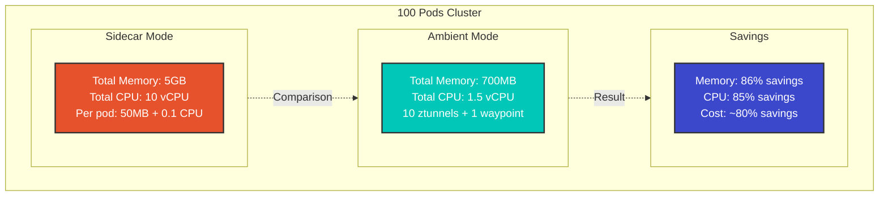

### Resource Savings Calculation

```python
# Example with 100 pod cluster

# Sidecar Mode
sidecar_memory = 100 * 50  # 5000MB = 5GB
sidecar_cpu = 100 * 0.1    # 10 vCPU

# Ambient Mode (10 nodes)
ambient_memory = 10 * 50 + 200  # 700MB (ztunnel + 1 waypoint)
ambient_cpu = 10 * 0.1 + 0.5    # 1.5 vCPU

# Savings
memory_saved = sidecar_memory - ambient_memory  # 4300MB (~86%)
cpu_saved = sidecar_cpu - ambient_cpu          # 8.5 vCPU (~85%)
```

## Use Cases

### When Should You Choose Ambient Mode?

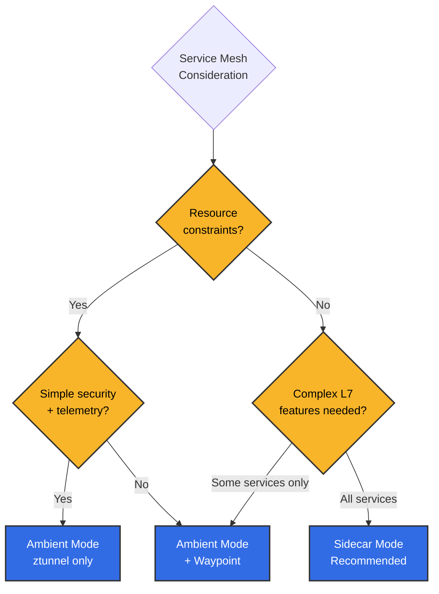

**Recommended scenarios for Ambient Mode**:
- Hundreds or more microservices
- Resource cost optimization is important
- Most services need only simple communication
- Only some services need advanced routing
- Minimize operational complexity

**Recommended scenarios for Sidecar Mode**:
- All services need L7 features
- Need a proven mature solution
- Need fine-grained control per service
- Independent proxy version management per pod

### 1. When Only L4 Features Are Needed

```yaml
# Using ztunnel only (Waypoint not needed)
apiVersion: v1
kind: Namespace
metadata:
  name: backend
  labels:
    istio.io/dataplane-mode: ambient
---
apiVersion: apps/v1
kind: Deployment
metadata:
  name: database
  namespace: backend
spec:
  replicas: 3
  # ... (normal Deployment)
```

**Benefits**:
- mTLS automatically applied
- Basic Telemetry
- Minimal resource usage

### 2. Selective L7 Feature Usage

```yaml
# Only specific Service uses Waypoint
apiVersion: gateway.networking.k8s.io/v1
kind: Gateway
metadata:
  name: frontend-waypoint
  namespace: frontend
spec:
  gatewayClassName: istio-waypoint
  listeners:
  - name: mesh
    port: 15008
    protocol: HBONE
---
apiVersion: v1
kind: ServiceAccount
metadata:
  name: frontend
  namespace: frontend
  labels:
    istio.io/use-waypoint: frontend-waypoint
```

### 3. Gradual Migration

```bash
# Step-by-step migration
# 1. Non-critical services
kubectl label namespace dev istio.io/dataplane-mode=ambient

# 2. Testing
kubectl label namespace staging istio.io/dataplane-mode=ambient

# 3. Production (one by one)
kubectl label namespace prod-backend istio.io/dataplane-mode=ambient
kubectl label namespace prod-frontend istio.io/dataplane-mode=ambient
```

## Troubleshooting

### ztunnel Not Working

```bash
# Check ztunnel status
kubectl get daemonset -n istio-system ztunnel
kubectl logs -n istio-system -l app=ztunnel

# Check CNI
kubectl get daemonset -n istio-system istio-cni-node
kubectl logs -n istio-system -l k8s-app=istio-cni-node
```

### Traffic Not Going to Waypoint

```bash
# Check Waypoint status
kubectl get gateway -n <namespace>

# Verify Waypoint connection to Service Account
kubectl get sa <sa-name> -n <namespace> -o yaml | grep use-waypoint

# Check Envoy configuration
istioctl proxy-config clusters <waypoint-pod> -n <namespace>
```

## References

### Official Documentation
- [Istio Ambient Mode Official Documentation](https://istio.io/latest/docs/ops/ambient/)
- [Ambient Mode Introduction Blog](https://istio.io/latest/blog/2022/introducing-ambient-mesh/)
- [Ambient Mode Getting Started](https://istio.io/latest/docs/ops/ambient/getting-started/)
- [ztunnel GitHub Repository](https://github.com/istio/ztunnel)

### Technical Resources
- [Ambient Mesh Architecture Detailed Explanation](https://istio.io/latest/blog/2022/ambient-security/)
- [HBONE Protocol Explanation](https://istio.io/latest/blog/2022/get-started-ambient/)
- [Performance Benchmarks](https://istio.io/latest/blog/2022/ambient-performance/)

### Community
- [Istio Discuss - Ambient Mode](https://discuss.istio.io/c/ambient/47)
- [Istio Slack #ambient-mesh](https://istio.slack.com/)

### Comparison Resources

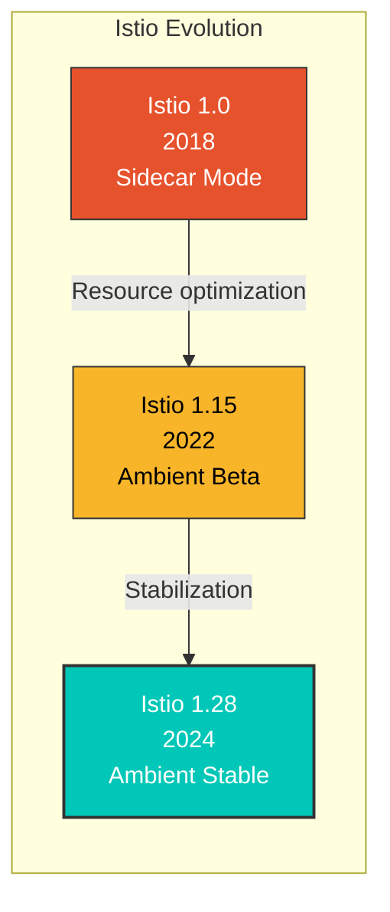

**Production Usage Status** (as of 2024):
- Solo.io: Migrated entire internal clusters to Ambient Mode
- Financial Enterprises: Applied Ambient Mode to thousands of microservices (80% cost reduction)
- E-commerce: Hybrid operation with L4 ztunnel + selective Waypoint

**Key Feature Roadmap**:
- 1.28 (2024 Q1): Ambient Mode GA (General Availability)
- 1.29 (2024 Q2): Multi-cluster Ambient support
- 1.30+ (2024 Q3+): Complete Gateway API integration, performance optimization

## Summary

Ambient Mode is an innovative architecture that shows the future direction of Istio:

| Feature | Description | Benefit |
|---------|-------------|---------|
| **Sidecar removal** | No proxy per pod needed | 90% resource savings |
| **2-layer architecture** | L4 (ztunnel) + L7 (Waypoint) | Flexible feature selection |
| **Transparent adoption** | No pod restart required | Zero-downtime adoption |
| **Gradual migration** | Per-namespace transition | Safe transition |
| **HBONE protocol** | HTTP/2 based tunneling | Firewall friendly |

Ambient Mode provides resource efficiency and operational simplification especially in **large-scale microservice environments**, and enables **cost-effective Service Mesh** implementation by selectively deploying Waypoint only to services that need L7 features.
