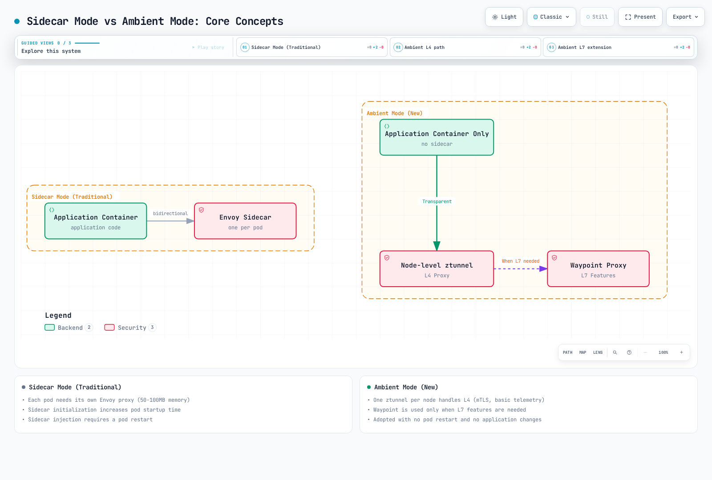
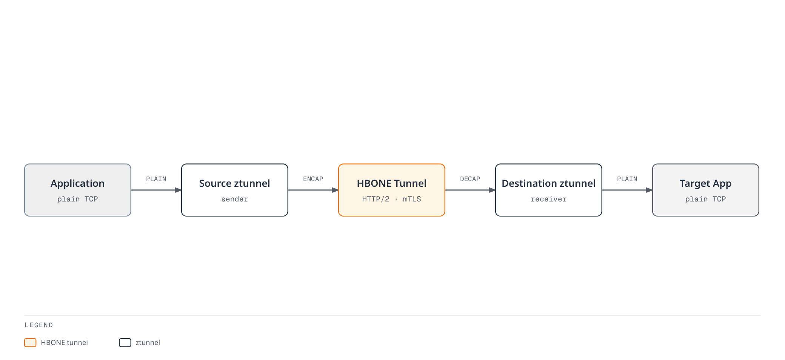

# Ambient Mode

> **Last Updated**: September 11, 2026 · Istio 1.31. This lab assumes compatible Linux nodes, node-agent/CNI permissions and a fresh demo namespace. No deployment commands were run by this audit.

Ambient was introduced as a 2022 experimental preview, first shipped in Istio 1.18 as Alpha, reached Beta in 1.22 and core GA in 1.24. The preview was not a generally available feature of the main 1.15 release. Resource savings and migration safety depend on actual topology, policies and traffic.

## Table of Contents

1. [Overview](#overview)
2. [Sidecar Mode vs Ambient Mode](#sidecar-mode-vs-ambient-mode)
3. [Architecture](#architecture)
4. [Installation and Configuration](#installation-and-configuration)
5. [Migration](#migration)
6. [Performance Comparison](#performance-comparison)
7. [Use Cases](#use-cases)
8. [Troubleshooting](#troubleshooting)

## Overview


Ambient Mode is a new approach that provides Service Mesh functionality without injecting Sidecar proxies into application pods. Ambient Mode consists of a **Layered Architecture**:

1. **Secure Overlay Layer (L4)**: mTLS and basic telemetry through ztunnel
2. **L7 Processing Layer**: Advanced traffic management through Waypoint Proxy

### Why is Ambient Mode Needed?

Limitations of the traditional Sidecar model:
- **High resource overhead**: Each pod requires an Envoy proxy (measure the actual proxy footprint)
- **Operational complexity**: Pod restarts, version management, rolling updates are complex
- **Startup coordination**: Proxy and application readiness must be coordinated
- **Excessive functionality**: Some workloads need only L4 mesh features

Ambient Mode solutions:
- Shared node proxies plus required waypoints: measure total resource use
- Enrollment can avoid restarting unmeshed Pods; sidecar removal and policy changes need a controlled rollout
- Gradual adoption: Expand from L4 to L7 as needed
- L4 transport can be transparent; tracing context and application timeout/idempotency contracts still matter

### Core Concepts

The optional waypoint in these figures is selected by configuration/enrollment. Ztunnel does not parse each HTTP request and decide whether to take an L7 detour. Existing connections, readiness and policy transitions still need validation.




[🔍 View interactive diagram](https://www.atomai.click/kubernetes-docs/archmaps/en-service-mesh-istio-advanced-01-ambient-mode-0.html)

### Advantages of Ambient Mode

1. **Shared resource model**: Node proxies plus required waypoint replicas
2. **Simple deployment**: Unmeshed-Pod enrollment need not restart Pods; removing a sidecar does
3. **Transparent L4 transport**: Application tracing/deadline/idempotency requirements remain
4. **Flexible L7 features**: Use waypoint only when needed

## Sidecar Mode vs Ambient Mode

### Architecture Comparison

#### Sidecar Mode


[🔍 View interactive diagram](https://www.atomai.click/kubernetes-docs/archmaps/en-service-mesh-istio-advanced-01-ambient-mode-1.html)

**Characteristics**:
- Envoy proxy injected into each pod
- Mature L4/L7 features; verify the selected release
- High resource usage
- Pod restart required

#### Ambient Mode


[🔍 View interactive diagram](https://www.atomai.click/kubernetes-docs/archmaps/en-service-mesh-istio-advanced-01-ambient-mode-2.html)

**Characteristics**:
- One ztunnel per node
- L4 features provided by default
- L7 features require waypoint
- Unmeshed-Pod enrollment need not restart Pods; removing a sidecar does

### Detailed Comparison Table

| Item | Sidecar Mode | Ambient Mode |
|------|-------------|--------------|
| **Deployment method** | Sidecar injection into pod | Node-level ztunnel + optional waypoint |
| **Resource accounting** | Per-Pod Envoy + control plane | Node ztunnels + all waypoint replicas + control plane; measure under load |
| **Pod recreation** | Needed to add/remove an injected proxy | Not normally needed for unmeshed enrollment; needed to remove a sidecar |
| **Startup coordination** | Proxy/application lifecycle and readiness | CNI capture and ztunnel readiness |
| **L4 features** | Supported | Supported |
| **L7 features** | Release-specific support | Waypoint and supported API required; not every extension is GA |
| **mTLS** | Automatic | Automatic |
| **Telemetry** | Detailed | Basic (L4), Detailed (L7 with waypoint) |
| **Circuit Breaker** | Supported | Requires Waypoint |
| **Retry/Timeout** | Supported | Requires Waypoint |
| **Header manipulation** | Supported | Requires Waypoint |
| **Performance overhead** | Workload/configuration dependent | Path/identity/waypoint/load dependent; compare equivalent policies |
| **Operational scope** | Per-workload proxy lifecycle | Node/CNI and shared waypoint lifecycle |
| **Production readiness** | Mature | GA (Istio 1.24+) |

### Resource Usage Comparison

The 100-Pod calculation below is a hypothetical planning example, not an official benchmark. Count all node/waypoint replicas and compare equivalent security, telemetry and routing requirements before estimating resource or bill savings.

## Architecture


The Ambient Mode data plane consists of two core components: **ztunnel** and **Waypoint Proxy**.

### ztunnel (Zero Trust Tunnel)


ztunnel is the core component of Ambient Mode, a **lightweight L4 proxy running at the node level**. It runs as a DaemonSet on eligible Linux nodes and handles supported traffic for enrolled workloads. This is not all traffic from every Pod; host-network/excluded workloads and non-TCP application protocols require checking current support.

#### How ztunnel Works

1. **Traffic capture**: Transparently intercepts pod network traffic through Istio CNI in-pod netfilter/iptables rules and network-namespace handoff
2. **mTLS application**: Automatically applies mTLS encryption using SPIFFE-based Identity
3. **Load balancing**: Performs L4 load balancing between endpoints
4. **Telemetry collection**: Collects connection metrics and logs
5. **Forwarding**: Forwards traffic to destination ztunnel or Waypoint

**ztunnel Technology Stack**:
- **Language**: Rust (high performance, low memory usage)
- **Protocol**: HBONE (HTTP-Based Overlay Network Environment)
- **Identity**: SPIFFE workload identities; Istiod CA by default, separate integration for SPIRE
- **CNI**: Tight integration with Istio CNI plugin

#### ztunnel Role


[🔍 View interactive diagram](https://www.atomai.click/kubernetes-docs/archmaps/en-service-mesh-istio-advanced-01-ambient-mode-3.html)

**ztunnel Characteristics**:
- Written in Rust (performance optimized)
- Deployed as DaemonSet
- Integrated with CNI plugin
- In-pod netfilter/iptables redirection coordinated with Istio CNI

#### ztunnel Deployment

Use the released ambient installation/charts. The original minimal DaemonSet omitted token/CA/socket mounts and used incorrect hostNetwork/privileged settings. The 1.31 chart supplies specific capabilities and in-pod namespace access; it does not set `hostNetwork: true` or `privileged: true`. Do not copy or reduce privileges without the full chart/platform context.

```bash
# Offline inspection; use the same reviewed values as the actual installation
istioctl manifest generate --set profile=ambient > ambient-rendered.yaml
# Inspect a deployed resource if a mesh already exists
kubectl get daemonset ztunnel -n istio-system -o yaml
```

### Waypoint Proxy


Waypoint is an **optional proxy used when L7 features are needed**. A configured waypoint is placed in the traffic path of enrolled resources to provide advanced traffic management features.

#### Key Characteristics of Waypoint

1. **Selective deployment**: Used only for services that need L7 features, not all services
2. **Shared proxy**: Multiple workloads share a single Waypoint (according to namespace/Service/Pod enrollment)
3. **Envoy-based**: Uses the same Envoy proxy as traditional Sidecar, with release-specific L7 API support
4. **On-demand**: Can be dynamically added/removed at runtime

#### Waypoint Deployment Units

A ServiceAccount supplies workload identity; labeling it does **not** select a waypoint. Use `istio.io/use-waypoint` on a Namespace, Service or Pod, with a Gateway whose `istio.io/waypoint-for` traffic type matches the intended traffic.

| Enrollment | Scope |
|---|---|
|Namespace|Default waypoint selection for eligible resources in that namespace|
|Service|Traffic to that Service; default waypoint type is `service`|
|Pod|Direct workload/Pod-IP traffic with a `workload` or `all` waypoint|

Deployment labels alone do not label existing Pods; use Pod-template labels for workload enrollment. A `service` waypoint does not automatically cover direct Pod-IP traffic.

#### Waypoint Role


**Waypoint Characteristics**:
- Deployed as a Gateway, then selected by supported resource enrollment
- Based on Envoy proxy
- Verify per-API support; arbitrary EnvoyFilter patches are not a supported waypoint API
- Selective use for required services only

#### Waypoint Deployment

```yaml
apiVersion: gateway.networking.k8s.io/v1
kind: Gateway
metadata:
  name: reviews-waypoint
  namespace: ambient-demo
  labels:
    istio.io/waypoint-for: service
spec:
  gatewayClassName: istio-waypoint
  listeners:
  - name: mesh
    port: 15008
    protocol: HBONE
```

The default `istio-waypoint` class uses Envoy. Core ambient GA does not make every API GA: current docs describe ambient VirtualService as Alpha and prohibit mixing it with Gateway API routes. Use HTTPRoute here. EnvoyFilter is not a supported waypoint extension. L7 policies protect traffic that reaches the waypoint; mandatory traversal also needs the documented ztunnel authorization guard and correct enrollment/readiness.

### Complete Traffic Flow

The following is a comprehensive diagram showing how traffic flows in Ambient Mode **without Sidecars**:


[🔍 View interactive diagram](https://www.atomai.click/kubernetes-docs/archmaps/en-service-mesh-istio-advanced-01-ambient-mode-6.html)

**Traffic Flow Analysis**:

1. **L4 Only Path** (using ztunnel only):
   - Measure path latency under representative load
   - mTLS automatically applied
   - Basic telemetry
   - Suitable when actual requirements are L4-only

2. **L7 Path** (ztunnel + Waypoint):
   - Header-based routing
   - Circuit Breaking
   - Retry/Timeout
   - When complex traffic policies are needed

### HBONE Protocol


**HBONE (HTTP-Based Overlay Network Environment)** is the tunneling protocol used in Ambient Mode:

- **HTTP/2 based**: Compatibility with existing infrastructure
- **Built-in mTLS**: Secure communication
- **Multiplexing**: TCP streams share tunnels for the same source/destination identity pair
- **Network policy**: HBONE conventionally uses TCP15008; allow the required mesh path explicitly



[🔍 View interactive diagram](https://www.atomai.click/kubernetes-docs/archmaps/en-service-mesh-istio-advanced-01-ambient-mode-7.html)

HBONE in this guide transports TCP streams. Application UDP is not carried by that tunnel; DNS capture/proxying is a separate function. The local application stream can remain plaintext while the mesh transport between proxies is encrypted.

## Installation and Configuration

The lab needs compatible Linux nodes and the required Istio CNI/ztunnel DaemonSets. EKS Fargate cannot run these node DaemonSets; use supported EC2-backed placement and review the actual node/CNI platform. [Platform prerequisites](https://istio.io/latest/docs/ambient/install/platform-prerequisites/) cover CNI paths, permissions and health probes. VPC CNI Pod ENI trunking with SecurityGroupPolicy can require standard enforcing mode or appropriate exec probes; assess the policy implications. GKE, OpenShift, k3s and other platforms may need different settings.

Istio1.31 supports Kubernetes1.32–1.36; see the [installation guide](../01-installation.md) for EKS compatibility. Gateway API1.6.0 below matches Istio1.31’s dependency and official ambient tutorial. Check an existing bundle's compatibility; do not downgrade a newer compatible bundle merely to copy the example.

### 1. Istio Installation (Ambient Mode)

Use this installation command only for a fresh lab mesh after reviewing the installer and platform settings. Preserve an existing mesh's installation method/values using the migration procedure.

```bash
curl -fsSL https://istio.io/downloadIstio -o download-istio.sh
ISTIO_VERSION=1.31.0 sh download-istio.sh
cd istio-1.31.0
export PATH="$PWD/bin:$PATH"

# Fresh cluster without Gateway API; review an existing bundle separately
if ! kubectl get crd gateways.gateway.networking.k8s.io >/dev/null 2>&1; then
  kubectl apply --server-side -f https://github.com/kubernetes-sigs/gateway-api/releases/download/v1.6.0/experimental-install.yaml
fi
kubectl wait --for=condition=Established crd/gateways.gateway.networking.k8s.io --timeout=60s
kubectl get crd httproutes.gateway.networking.k8s.io

# Fresh lab mesh only; include required platform-specific values
istioctl install --set profile=ambient -y
kubectl get pods,daemonsets -n istio-system
```

### 2. Enable Ambient Mode and Deploy the Application

Use a fresh disposable namespace with no sidecar-injection/revision override. Existing sidecar Pods are not converted by adding the ambient label. The complete Bookinfo manifest from the1.31 distribution supplies the reviews Service, version labels, ServiceAccounts and ratings dependency missing from the old single-Deployment example; it uses Bookinfo1.20.3 images.

```bash
kubectl create namespace ambient-demo
kubectl label namespace ambient-demo istio.io/dataplane-mode=ambient
kubectl get namespace ambient-demo -L istio-injection,istio.io/rev,istio.io/dataplane-mode
kubectl apply -n ambient-demo -f samples/bookinfo/platform/kube/bookinfo.yaml
kubectl apply -n ambient-demo -f samples/curl/curl.yaml
for deployment in reviews-v1 reviews-v2 ratings-v1 curl; do
  kubectl rollout status "deployment/$deployment" -n ambient-demo --timeout=120s
done
istioctl ztunnel-config workloads --workload-namespace ambient-demo
```

### 3. Deploy and Select a Waypoint

The current CLI takes a waypoint name and traffic type, not a ServiceAccount enrollment flag. Wait for readiness and explicitly enroll the Service.

```bash
istioctl waypoint apply --name reviews-waypoint --for service -n ambient-demo --wait
kubectl label service reviews -n ambient-demo istio.io/use-waypoint=reviews-waypoint --overwrite
kubectl get gateways.gateway.networking.k8s.io reviews-waypoint -n ambient-demo
kubectl get service reviews -n ambient-demo --show-labels
```

### 4. Use L7 Features

Create version-specific backend Services and attach an HTTPRoute to the enrolled reviews Service. This demonstrates GET/header routing; the header is not authenticated identity. Do not combine the old VirtualService with this Gateway API route. Direct calls to another Service/Pod IP are a separate path.

```yaml
apiVersion: v1
kind: Service
metadata:
  name: reviews-v1
  namespace: ambient-demo
spec:
  selector:
    app: reviews
    version: v1
  ports:
  - name: http
    port: 9080
    targetPort: 9080
---
apiVersion: v1
kind: Service
metadata:
  name: reviews-v2
  namespace: ambient-demo
spec:
  selector:
    app: reviews
    version: v2
  ports:
  - name: http
    port: 9080
    targetPort: 9080
---
apiVersion: gateway.networking.k8s.io/v1
kind: HTTPRoute
metadata:
  name: reviews
  namespace: ambient-demo
spec:
  parentRefs:
  - group: ''
    kind: Service
    name: reviews
    port: 9080
  rules:
  - matches:
    - method: GET
      headers:
      - name: end-user
        type: Exact
        value: jason
    backendRefs:
    - name: reviews-v2
      port: 9080
  - matches:
    - method: GET
    backendRefs:
    - name: reviews-v1
      port: 9080
```

```bash
kubectl describe httproutes.gateway.networking.k8s.io reviews -n ambient-demo
kubectl exec -n ambient-demo deploy/curl -c curl -- \
  curl -sS --max-time 5 -H "end-user: jason" http://reviews:9080/reviews/0
```

Check Accepted/ResolvedRefs conditions and the selected backend through logs/telemetry. HTTP success alone proves neither mTLS nor mandatory waypoint traversal. L7 authorization needs the appropriate `targetRefs`; mandatory traversal also needs the documented ztunnel authorization guard. See [waypoint policy attachment](https://istio.io/latest/docs/ambient/usage/l7-features/).

## Migration

### From Sidecar Mode to Ambient Mode

Migration is a policy/workload rollout, not a label-only change. Preserve the installed revision, CA/trust, gateways, CNI options and declarative workload configuration. Existing sidecars take precedence over ambient enrollment. Prepare compatible L7 routing/authorization and ready waypoints before removing sidecars from workloads that require those policies.

#### Step 1: Install Ambient Components

Use the existing installation method and reviewed values to add ambient support at a compatible version. Do not overwrite a Helm-managed mesh with an unrelated bare `istioctl install --set profile=ambient` command. Render/diff the intended configuration and verify the CNI/ztunnel node agents.

#### Step 2: Apply to Test Namespace

This independent ambient test deploys both client and server from the1.31 distribution. The httpbin Service exposes8000 and targets8080.

```bash
kubectl create namespace test-ambient
kubectl label namespace test-ambient istio.io/dataplane-mode=ambient
kubectl apply -n test-ambient -f samples/curl/curl.yaml
kubectl apply -n test-ambient -f samples/httpbin/httpbin.yaml
kubectl rollout status deployment/curl -n test-ambient --timeout=120s
kubectl rollout status deployment/httpbin -n test-ambient --timeout=120s
kubectl exec -n test-ambient deploy/curl -c curl -- \
  curl -sS --max-time 5 http://httpbin:8000/headers
```

#### Step 3: Verification

The HBONE workload column shows intended transport. For actual traffic, inspect expected source/destination identities in the correct node's ztunnel logs, or TCP metrics with `connection_security_policy="mutual_tls"`. HTTP success alone is not mTLS proof. HBONE enrollment does not reject every plaintext caller; use PeerAuthentication STRICT if required. See [mTLS verification](https://istio.io/latest/docs/ambient/usage/verify-mtls-enabled/).

```bash
istioctl ztunnel-config workloads --workload-namespace test-ambient
source_pod=$(kubectl get pod -n test-ambient -l app=curl -o jsonpath='{.items[0].metadata.name}')
source_node=$(kubectl get pod "$source_pod" -n test-ambient -o jsonpath='{.spec.nodeName}')
ztunnel_pod=$(kubectl get pod -n istio-system -l app=ztunnel \
  --field-selector "spec.nodeName=$source_node" -o jsonpath='{.items[0].metadata.name}')
kubectl logs "$ztunnel_pod" -n istio-system --since=5m
```

#### Step 4: Switch Selected Workloads

The next example assumes a separate existing `migration-demo` namespace containing only reviewed, namespace-injected curl/httpbin Deployments with L4-only requirements. Check for Pod-template injection overrides or manually injected proxies; these commands do not remove those. For L7 workloads, first validate waypoint enrollment and policy translation, including `targetRefs` and any mandatory-traversal guard. Plan policy coexistence during migration; a selector-based L7 policy enforced by ztunnel can fail closed.

```bash
# Reference snapshots, not manifests to blindly reapply with stale server metadata
kubectl get namespace migration-demo -o json > migration-namespace-before.json
kubectl get deployment curl httpbin -n migration-demo -o yaml > migration-workloads-before.yaml

kubectl label namespace migration-demo istio.io/dataplane-mode=ambient --overwrite
kubectl label namespace migration-demo istio-injection- istio.io/rev-
kubectl get namespace migration-demo -L istio-injection,istio.io/rev,istio.io/dataplane-mode
for deployment in curl httpbin; do
  kubectl rollout restart "deployment/$deployment" -n migration-demo
  kubectl rollout status "deployment/$deployment" -n migration-demo --timeout=120s
done

# Check both classic containers and native-sidecar initContainers
kubectl get pods -n migration-demo -o json | jq -r '
  .items[] | [.metadata.name,
    any((.spec.containers + (.spec.initContainers // []))[]; .name == "istio-proxy")] | @tsv'
istioctl ztunnel-config workloads --workload-namespace migration-demo
```

#### Step 5: Validate the Chosen Data Path

Repeat readiness, connectivity, identity and policy tests for the named workloads. For an L7 cohort, inspect the actual Namespace/Service/Pod enrollment, Gateway traffic type/readiness and route/policy attachment; do not create one waypoint per ServiceAccount. Use workload-specific stop/rollback criteria. This lab sequence is not a zero-downtime production guarantee.

### Rollback Strategy

Restore the recorded injection mode and original Pod-template/policy configuration. The code below only handles the namespace-injection case above; the old revision must still exist and be healthy. A cohort with waypoints needs its enrollment/routing policies restored as part of the reviewed rollback. Delete only a specifically identified, unreferenced waypoint created for that cohort—never every Gateway in a namespace.

```bash
original_revision=$(jq -r '.metadata.labels["istio.io/rev"] // ""' migration-namespace-before.json)
original_injection=$(jq -r '.metadata.labels["istio-injection"] // ""' migration-namespace-before.json)

# Restore the recorded namespace-injection mode; do not invent a revision
if [ "$original_injection" = "enabled" ]; then
  kubectl label namespace migration-demo istio-injection=enabled --overwrite
elif [ -n "$original_revision" ]; then
  kubectl label namespace migration-demo "istio.io/rev=$original_revision" --overwrite
else
  echo "No supported namespace-injection mode recorded; restore the original workload configuration." >&2
  exit 1
fi
kubectl label namespace migration-demo istio.io/dataplane-mode-
for deployment in curl httpbin; do
  kubectl rollout restart "deployment/$deployment" -n migration-demo
  kubectl rollout status "deployment/$deployment" -n migration-demo --timeout=120s
done
```

## Performance Comparison

### Benchmark Results

The removed `perf.png` URL returned404 and did not substantiate the old “official benchmark” table. No source established its per-Pod CPU/memory, latency or throughput percentages. Use [published performance results](https://istio.io/latest/docs/ops/deployment/performance-and-scalability/) with their original release, load, payload, hardware and policy conditions; do not relabel historical measurements as a current-release test.

| Measure | Keep comparable |
|---|---|
|Memory/CPU|Application count, identities/connections, node count, all waypoint replicas and equivalent policies|
|P50/P99 latency|Request size/rate, connection reuse, mTLS, L7 policy, telemetry and overload conditions|
|Throughput|The same application/backend capacity and error definition|
|Cost|Actual provisioned capacity, utilization and billing; lower requests/usage alone is not a bill reduction|

### Resource Savings Calculation

The original100-Pod arithmetic is preserved below only as a **what-if budget model**. Its50MB/0.1CPU and waypoint values are assumed inputs, not recommended requests/limits or measured costs. Include every waypoint/ztunnel replica, HA placement and control-plane resources in a real comparison. Additional waypoint replicas change the result.

```python
# Hypothetical planning inputs, not measured resource consumption or billing
sidecar_memory = 100 * 50       # MB, decimal
sidecar_cpu = 100 * 0.1        # vCPU
ambient_memory = 10 * 50 + 200  # 10 ztunnels + one assumed waypoint budget
ambient_cpu = 10 * 0.1 + 0.5

memory_saved = sidecar_memory - ambient_memory  # 4300 MB, 86% of assumed baseline
cpu_saved = sidecar_cpu - ambient_cpu           # 8.5 vCPU, 85% of assumed baseline
```

## Use Cases

### When Should You Choose Ambient Mode?


**Recommended scenarios for Ambient Mode**:
- Hundreds or more microservices
- Resource cost optimization is important
- Most services need only simple communication
- Only some services need advanced routing
- Minimize operational complexity

**Recommended scenarios for Sidecar Mode**:
- Required APIs/extensions or platform behavior are supported only by the chosen sidecar setup
- Need a proven mature solution
- Need fine-grained control per service
- Independent proxy version management per pod

### 1. When Only L4 Features Are Needed

For compatible existing TCP workloads, enroll a namespace after verifying platform, policy and capture prerequisites. This Namespace is not a complete database deployment; database replication/storage/HA must be designed separately.

```yaml
apiVersion: v1
kind: Namespace
metadata:
  name: backend
  labels:
    istio.io/dataplane-mode: ambient
```

### 2. Selective L7 Feature Usage

The demo selects the ready reviews waypoint at the Service level. Namespace and direct-workload enrollment are separate supported scopes; a ServiceAccount label is not a selector.

```bash
kubectl label service reviews -n ambient-demo istio.io/use-waypoint=reviews-waypoint --overwrite
```

L7 requirements do not automatically require sidecars: compare the supported waypoint APIs and extensions with the application's actual needs. Conversely, core GA does not imply feature parity for every advanced API.

### 3. Gradual Migration

Inventory injection and enrollment first, then migrate a reviewed cohort with explicit readiness/security/rollback criteria. Do not blindly label every dev/staging/production namespace or assume the change converts existing sidecars.

```bash
kubectl get namespaces -L istio-injection,istio.io/rev,istio.io/dataplane-mode,istio.io/use-waypoint
```

## Troubleshooting

### ztunnel Not Working

```bash
# Check ztunnel status
kubectl get daemonset -n istio-system ztunnel
kubectl logs -n istio-system -l app=ztunnel

# Check CNI
kubectl get daemonset -n istio-system istio-cni-node
kubectl logs -n istio-system -l k8s-app=istio-cni-node
```

### Traffic Not Going to Waypoint

```bash
# Check Waypoint status
kubectl get gateways.gateway.networking.k8s.io -n <namespace>

# Check supported enrollment scopes and Gateway readiness
kubectl get namespace <namespace> -L istio.io/use-waypoint
kubectl get services -n <namespace> -L istio.io/use-waypoint
istioctl waypoint list -n <namespace>
istioctl ztunnel-config services

# Check Envoy configuration
istioctl proxy-config clusters <waypoint-pod> -n <namespace>
```

## References

### Current Official Documentation

- [Ambient overview](https://istio.io/latest/docs/ambient/overview/)
- [Getting started](https://istio.io/latest/docs/ambient/getting-started/)
- [In-pod traffic redirection](https://istio.io/latest/docs/ambient/architecture/traffic-redirection/)
- [HBONE](https://istio.io/latest/docs/ambient/architecture/hbone/)
- [Waypoint enrollment](https://istio.io/latest/docs/ambient/usage/waypoint/)
- [L7 API support and policy attachment](https://istio.io/latest/docs/ambient/usage/l7-features/)
- [Performance methodology/results](https://istio.io/latest/docs/ops/deployment/performance-and-scalability/)
- [ztunnel source](https://github.com/istio/ztunnel)
- [Istio community and Slack access](https://istio.io/latest/get-involved/)

### Historical Introductions

These2022 pages describe the experimental preview, not current installation or ServiceAccount-waypoint commands.

- [Introducing ambient mesh (2022)](https://istio.io/latest/blog/2022/introducing-ambient-mesh/)
- [Experimental security architecture (2022)](https://istio.io/latest/blog/2022/ambient-security/)
- [Experimental getting started (2022)](https://istio.io/latest/blog/2022/get-started-ambient/)

### Verified Milestones and Current Limits

| Milestone | Evidence |
|---|---|
|2022 preview|Experimental implementation announced; not the main1.15 feature release|
|1.18 Alpha (2023)|First Istio release shipping ambient|
|1.22 Beta (2024)|Beta milestone|
|1.24 core GA (2024)|Core ztunnel/waypoint/API milestone; individual features retain their own status|

Current [ambient multicluster documentation](https://istio.io/latest/docs/ambient/install/multicluster/) describes **Beta multi-primary, multi-network** support. Primary/remote is unsupported and single-network deployments are untested; waypoint naming/configuration and service scope must be coordinated across clusters. The old1.26/1.27 roadmap and unattributed enterprise savings are not evidence of supported behavior or guaranteed cost reduction.

## Summary

Ambient separates shared L4 transport from selected L7 waypoint processing. It can simplify unmeshed-workload enrollment and proxy lifecycle management, but resource savings, policy preservation and availability require equivalent-policy measurements and a validated migration plan. Account for Linux/CNI/platform constraints, TCP15008 connectivity and the feature status of each API.
