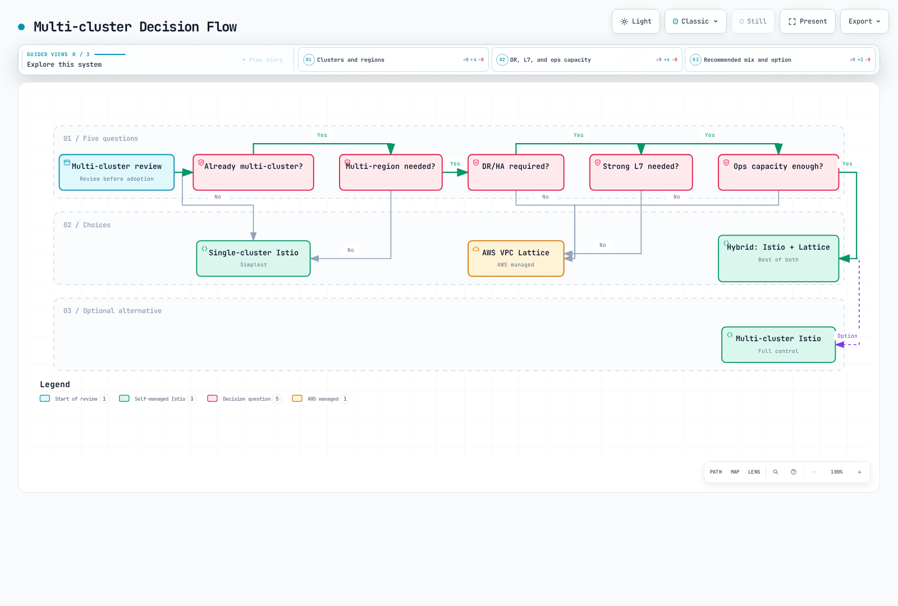
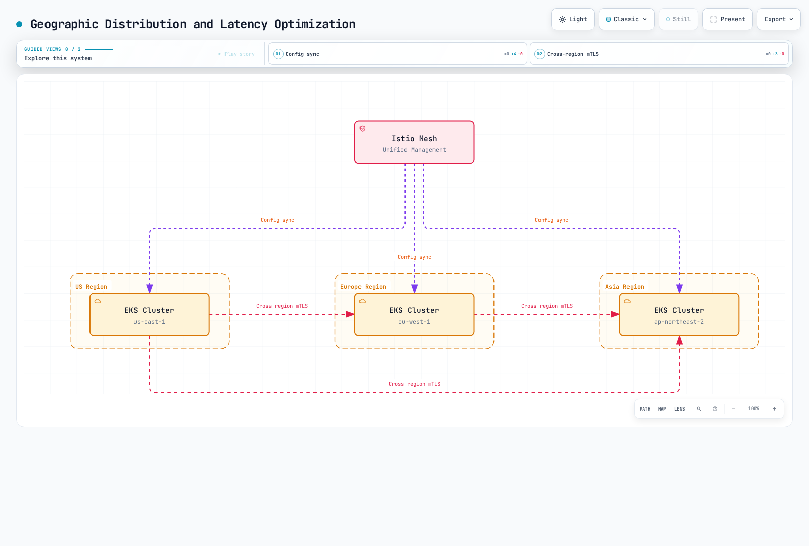
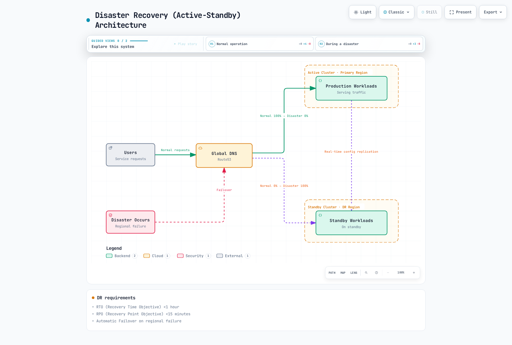
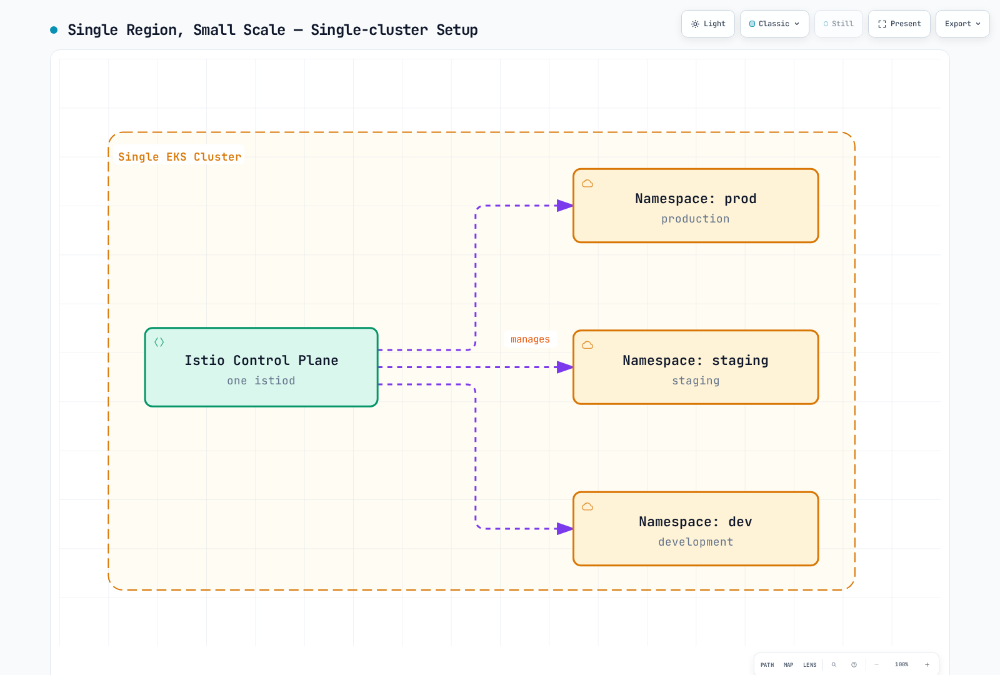
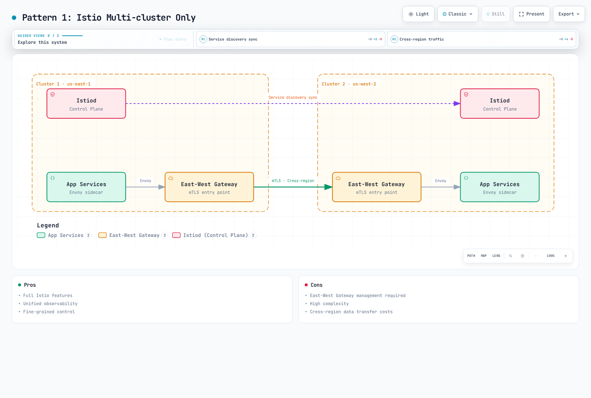
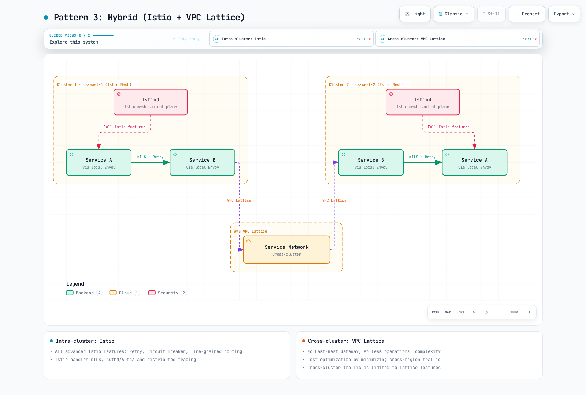
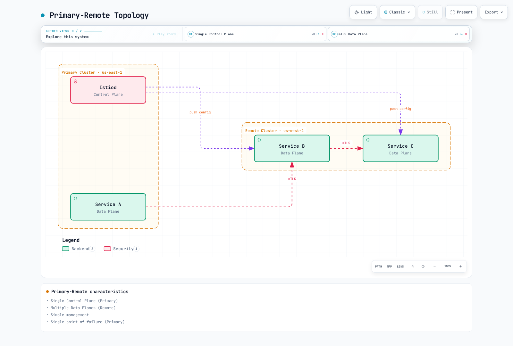
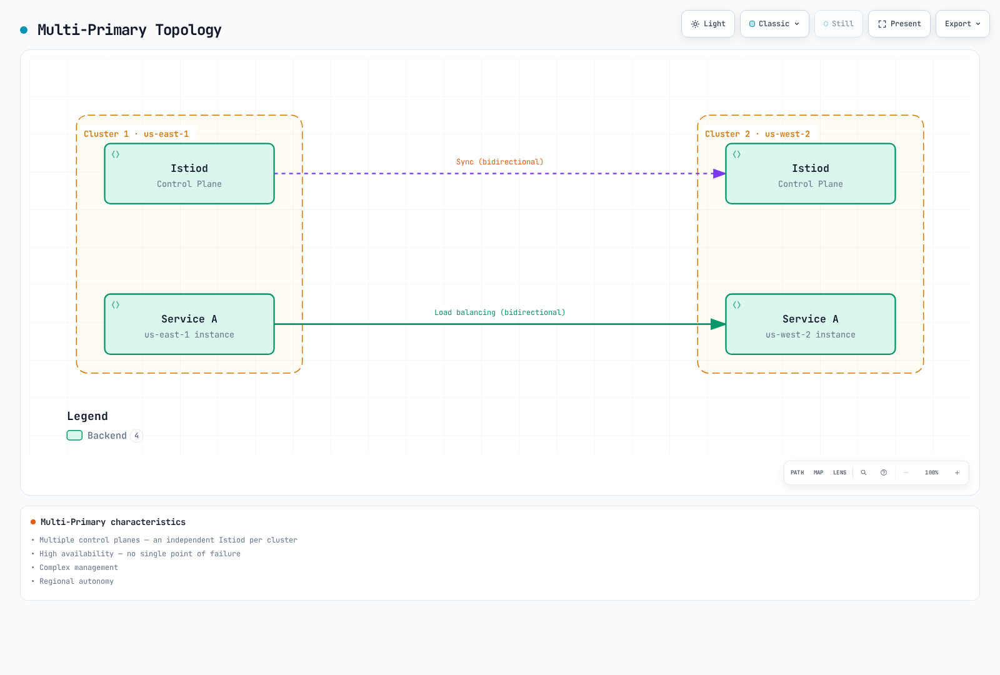
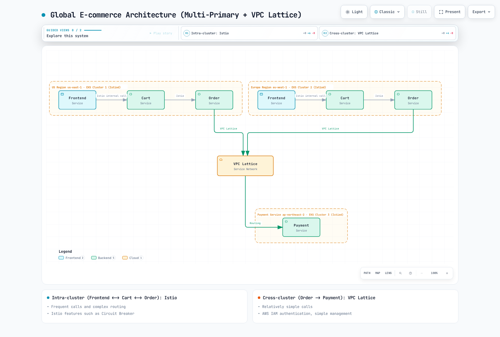

# Multi-cluster

> **Supported Versions**: Istio 1.18+ **Last Updated**: February 23, 2026 **Kubernetes Compatibility**: 1.32+

Multi-cluster Service Mesh connects multiple Kubernetes clusters into a unified service mesh.

## Table of Contents

1. [Do You Really Need Multi-cluster?](02-multi-cluster.md#do-you-really-need-multi-cluster)
2. [Architecture Selection Guide](02-multi-cluster.md#architecture-selection-guide)
3. [Istio vs AWS VPC Lattice](02-multi-cluster.md#istio-vs-aws-vpc-lattice)
4. [Topology](02-multi-cluster.md#topology)
5. [Primary-Remote Setup](02-multi-cluster.md#primary-remote-setup)
6. [Multi-Primary Setup](02-multi-cluster.md#multi-primary-setup)
7. [Cross-cluster Communication](02-multi-cluster.md#cross-cluster-communication)
8. [Using with VPC Lattice](02-multi-cluster.md#using-with-vpc-lattice)
9. [Practical Examples](02-multi-cluster.md#practical-examples)
10. [Performance and Cost Comparison](02-multi-cluster.md#performance-and-cost-comparison)
11. [Troubleshooting](02-multi-cluster.md#troubleshooting)

## Do You Really Need Multi-cluster?

Multi-cluster Service Mesh is powerful but increases complexity and cost. Careful consideration is needed before adoption.

### Decision Flow



[🔍 View interactive diagram](https://www.atomai.click/kubernetes-docs/archmaps/en-service-mesh-istio-advanced-02-multi-cluster-0.html)

### When Multi-cluster is Needed

#### 1. Geographic Distribution and Latency Optimization



[🔍 View interactive diagram](https://www.atomai.click/kubernetes-docs/archmaps/en-service-mesh-istio-advanced-02-multi-cluster-1.html)

**When needed**:

* Global user-facing services (latency goal <100ms)
* Data sovereignty compliance (GDPR, financial data localization)
* Regional traffic routing and failure isolation

#### 2. Disaster Recovery (DR)



[🔍 View interactive diagram](https://www.atomai.click/kubernetes-docs/archmaps/en-service-mesh-istio-advanced-02-multi-cluster-2.html)

**When needed**:

* RTO (Recovery Time Objective) <1 hour
* RPO (Recovery Point Objective) <15 minutes
* Automatic Failover on regional failure

#### 3. Environment Separation and Staged Deployment

**When needed**:

* Dev/Staging/Prod cluster separation with unified management
* Blue/Green deployments at cluster level
* Canary deployments with gradual regional expansion

#### 4. Organizational Boundaries and Security Isolation

**When needed**:

* Independent cluster operation per team/department
* Enhanced Multi-tenancy
* Physical isolation for regulatory compliance

### When Multi-cluster is NOT Needed

#### 1. Single Region, Small Scale Services



[🔍 View interactive diagram](https://www.atomai.click/kubernetes-docs/archmaps/en-service-mesh-istio-advanced-02-multi-cluster-3.html)

**Use instead**:

* Kubernetes Namespace separation
* NetworkPolicy for network isolation
* RBAC for access control

#### 2. When Operational Complexity Cannot Be Handled

**Multi-cluster operational requirements**:

* Minimum 2-3 Istio experts
* East-West Gateway management and monitoring
* Cross-cluster certificate management
* Cross-cluster debugging capability

**If your team is small**:

* Single-cluster Istio or
* AWS VPC Lattice (managed service)

#### 3. When Cost is a Key Consideration

**Multi-cluster additional costs**:

* LoadBalancer for East-West Gateway ($20-50/month per region)
* Cross-region data transfer ($0.02/GB)
* Control Plane redundancy (2-3x resources)

### Checklist

Answer these questions before adoption:

**Architecture**:

* [ ] Are 2 or more clusters already in operation?
* [ ] Is multi-region deployment needed?
* [ ] Are cross-cluster service calls frequent?

**Business Requirements**:

* [ ] Targeting global users?
* [ ] Is Disaster Recovery (DR) essential?
* [ ] Are RTO/RPO requirements strict?

**Security and Compliance**:

* [ ] Is data localization needed?
* [ ] Is strong cross-cluster isolation needed?

**Operational Capability**:

* [ ] Do you have Istio experts?
* [ ] Can you debug complex networking issues?
* [ ] Can you afford additional costs?

**Results**:

* 9+ checks: Multi-cluster Istio recommended
* 5-8 checks: Consider VPC Lattice or Hybrid
* 4 or fewer checks: Start with Single-cluster Istio

## Architecture Selection Guide

### Optimal Solution by Scenario

| Scenario                             | Single-cluster | Multi-cluster Istio | VPC Lattice | Hybrid      |
| ------------------------------------ | -------------- | ------------------- | ----------- | ----------- |
| **Single region, small scale**       | Optimal        | Overkill            | Unnecessary | Unnecessary |
| **Multi-region, strong L7 needed**   | Not possible   | Optimal             | Limited     | Recommended |
| **AWS-centric, simple connectivity** | Limited        | Overkill            | Optimal     | Unnecessary |
| **DR, automatic Failover**           | Not possible   | Optimal             | Manual      | Recommended |
| **Cost optimization priority**       | Optimal        | Expensive           | Recommended | Medium      |
| **Operational simplification**       | Optimal        | Complex             | Optimal     | Medium      |
| **Fine-grained traffic control**     | Possible       | Optimal             | Limited     | Recommended |

### Comparison of Each Solution

#### Single-cluster Istio

**Pros**:

* Simplest management
* Low cost
* Fast debugging
* All Istio features available

**Cons**:

* Single point of failure
* Complete service outage on regional failure
* No geographic distribution possible

**Suitable when**:

* Single region service
* Small team (<50 people)
* High availability not essential

#### Multi-cluster Istio

**Pros**:

* Complete geographic distribution
* Automatic DR and Failover
* All L7 features (Retry, Timeout, Circuit Breaker)
* Fine-grained traffic control
* Unified observability

**Cons**:

* High operational complexity
* East-West Gateway management required
* Cross-region data transfer costs
* Difficult debugging

**Suitable when**:

* Global services
* Strong DR needed
* Fine-grained L7 control essential

#### AWS VPC Lattice

**Pros**:

* AWS fully managed
* Simple setup
* Low operational burden
* Safe cross-VPC connectivity
* Cost effective

**Cons**:

* Limited L7 features (no Retry, Circuit Breaker)
* AWS lock-in
* No fine-grained traffic control
* Lacks Istio observability

**Suitable when**:

* AWS-centric architecture
* Only simple service connectivity needed
* Operational simplification priority

## Istio vs AWS VPC Lattice

### Feature Comparison

| Feature               | Istio Multi-cluster   | AWS VPC Lattice | Hybrid        |
| --------------------- | --------------------- | --------------- | ------------- |
| **Traffic Routing**   |                       |                 |               |
| Header-based routing  | Fully supported       | Limited         | Istio handles |
| Weighted routing      | Supported             | Supported       | Both possible |
| Path-based routing    | Supported             | Supported       | Both possible |
| **Resilience**        |                       |                 |               |
| Retry                 | Fine-grained control  | Not supported   | Istio handles |
| Timeout               | Fine-grained control  | Basic only      | Istio handles |
| Circuit Breaker       | Supported             | Not supported   | Istio handles |
| **Security**          |                       |                 |               |
| mTLS                  | Automatic             | Supported       | Both          |
| AuthN/AuthZ           | Fine-grained policies | IAM only        | Istio handles |
| **Observability**     |                       |                 |               |
| Distributed tracing   | Jaeger/Zipkin         | Limited         | Istio handles |
| Metrics               | Detailed              | Basic only      | Istio handles |
| **Operations**        |                       |                 |               |
| Management complexity | High                  | Low             | Medium        |
| Cost                  | High                  | Low             | Medium        |
| AWS integration       | Manual                | Native          | Good          |

### Architecture Pattern Comparison

#### Pattern 1: Istio Multi-cluster Only



[🔍 View interactive diagram](https://www.atomai.click/kubernetes-docs/archmaps/en-service-mesh-istio-advanced-02-multi-cluster-4.html)

**Pros**:

* Full Istio features
* Unified observability
* Fine-grained control

**Cons**:

* East-West Gateway management required
* High complexity
* Cross-region data transfer costs

#### Pattern 2: VPC Lattice Only


[🔍 View interactive diagram](https://www.atomai.click/kubernetes-docs/archmaps/en-service-mesh-istio-advanced-02-multi-cluster-5.html)

**Pros**:

* AWS fully managed
* Simple setup
* Low operational burden

**Cons**:

* Cannot use Istio features
* Limited traffic control
* Not Kubernetes native

#### Pattern 3: Hybrid (Recommended)



[🔍 View interactive diagram](https://www.atomai.click/kubernetes-docs/archmaps/en-service-mesh-istio-advanced-02-multi-cluster-6.html)

**Pros**:

* Intra-cluster: All advanced Istio features (Retry, Circuit Breaker, fine-grained routing)
* Cross-cluster: Simple VPC Lattice management and stability
* Reduced operational complexity (no East-West Gateway)
* Cost optimization (minimize cross-region traffic)

**Cons**:

* Need to understand two technology stacks
* Cross-cluster limited to Lattice features

**Suitable when**:

* AWS environment
* Complex traffic control needed intra-cluster
* Only simple connectivity needed cross-cluster

## Multi-cluster Overview

With Multi-cluster Service Mesh you can:

* Multi-region deployment
* Disaster Recovery (DR)
* Environment separation (dev/staging/prod)
* Cross-cluster service discovery and communication

## Topology

### Primary-Remote



[🔍 View interactive diagram](https://www.atomai.click/kubernetes-docs/archmaps/en-service-mesh-istio-advanced-02-multi-cluster-7.html)

**Characteristics**:

* Single Control Plane (Primary)
* Multiple Data Planes (Remote)
* Simple management
* Single point of failure (Primary)

### Multi-Primary



[🔍 View interactive diagram](https://www.atomai.click/kubernetes-docs/archmaps/en-service-mesh-istio-advanced-02-multi-cluster-8.html)

**Characteristics**:

* Multiple Control Planes
* High availability
* Complex management
* Regional autonomy

## Primary-Remote Setup

### 1. Primary Cluster Setup

```bash
# Context setup
export CTX_CLUSTER1=cluster1

# Install Istio
istioctl install --context="${CTX_CLUSTER1}" -f - <<EOF
apiVersion: install.istio.io/v1alpha1
kind: IstioOperator
spec:
  values:
    global:
      meshID: mesh1
      multiCluster:
        clusterName: cluster1
      network: network1
EOF

# Install East-West Gateway
samples/multicluster/gen-eastwest-gateway.sh \
  --mesh mesh1 --cluster cluster1 --network network1 | \
  istioctl install --context="${CTX_CLUSTER1}" -y -f -

# Expose Gateway
kubectl apply --context="${CTX_CLUSTER1}" -f \
  samples/multicluster/expose-services.yaml
```

### 2. Remote Cluster Setup

```bash
# Context setup
export CTX_CLUSTER2=cluster2

# Create Remote Secret
istioctl create-remote-secret \
  --context="${CTX_CLUSTER1}" \
  --name=cluster1 | \
  kubectl apply -f - --context="${CTX_CLUSTER2}"

# Install Istio with Remote configuration
istioctl install --context="${CTX_CLUSTER2}" -f - <<EOF
apiVersion: install.istio.io/v1alpha1
kind: IstioOperator
spec:
  values:
    global:
      meshID: mesh1
      multiCluster:
        clusterName: cluster2
      network: network1
      remotePilotAddress: ${DISCOVERY_ADDRESS}
EOF
```

## Multi-Primary Setup

### 1. Set Both Clusters as Primary

```bash
# Cluster 1
istioctl install --context="${CTX_CLUSTER1}" -f - <<EOF
apiVersion: install.istio.io/v1alpha1
kind: IstioOperator
spec:
  values:
    global:
      meshID: mesh1
      multiCluster:
        clusterName: cluster1
      network: network1
EOF

# Cluster 2
istioctl install --context="${CTX_CLUSTER2}" -f - <<EOF
apiVersion: install.istio.io/v1alpha1
kind: IstioOperator
spec:
  values:
    global:
      meshID: mesh1
      multiCluster:
        clusterName: cluster2
      network: network2
EOF
```

### 2. Cross-register Remote Secrets

```bash
# Cluster 1's Secret to Cluster 2
istioctl create-remote-secret \
  --context="${CTX_CLUSTER1}" \
  --name=cluster1 | \
  kubectl apply -f - --context="${CTX_CLUSTER2}"

# Cluster 2's Secret to Cluster 1
istioctl create-remote-secret \
  --context="${CTX_CLUSTER2}" \
  --name=cluster2 | \
  kubectl apply -f - --context="${CTX_CLUSTER1}"
```

## Cross-cluster Communication

### Service Entry

```yaml
apiVersion: networking.istio.io/v1
kind: ServiceEntry
metadata:
  name: httpbin-cluster2
spec:
  hosts:
  - httpbin.default.svc.cluster.local
  location: MESH_INTERNAL
  ports:
  - number: 8000
    name: http
    protocol: HTTP
  resolution: DNS
  addresses:
  - 240.0.0.1
  endpoints:
  - address: ${CLUSTER2_INGRESS_HOST}
    ports:
      http: 15443
```

## Using with VPC Lattice

### Hybrid Architecture Implementation

You can combine Istio and VPC Lattice to create the best of both.

#### Step 1: Install Istio Independently in Each Cluster

```bash
# Cluster 1 (single cluster mode)
export CTX_CLUSTER1=cluster1
istioctl install --context="${CTX_CLUSTER1}" -f - <<EOF
apiVersion: install.istio.io/v1alpha1
kind: IstioOperator
spec:
  values:
    global:
      meshID: mesh1-cluster1
      multiCluster:
        enabled: false  # Disable Multi-cluster
      network: network1
EOF

# Cluster 2 (independent installation)
export CTX_CLUSTER2=cluster2
istioctl install --context="${CTX_CLUSTER2}" -f - <<EOF
apiVersion: install.istio.io/v1alpha1
kind: IstioOperator
spec:
  values:
    global:
      meshID: mesh1-cluster2
      multiCluster:
        enabled: false  # Disable Multi-cluster
      network: network2
EOF
```

#### Step 2: Create VPC Lattice Service Network

```bash
# Create Service Network
aws vpc-lattice create-service-network \
  --name my-service-network \
  --auth-type AWS_IAM

# Save Service Network ID
SERVICE_NETWORK_ID=$(aws vpc-lattice list-service-networks \
  --query 'items[?name==`my-service-network`].id' \
  --output text)

# Connect VPC (Cluster 1 VPC)
aws vpc-lattice create-service-network-vpc-association \
  --service-network-identifier $SERVICE_NETWORK_ID \
  --vpc-identifier $VPC1_ID

# Connect VPC (Cluster 2 VPC)
aws vpc-lattice create-service-network-vpc-association \
  --service-network-identifier $SERVICE_NETWORK_ID \
  --vpc-identifier $VPC2_ID
```

#### Step 3: Register Kubernetes Service to VPC Lattice

```yaml
# Register Cluster 1's service to VPC Lattice
apiVersion: application-networking.k8s.aws/v1alpha1
kind: ServiceExport
metadata:
  name: my-service
  namespace: default
  annotations:
    application-networking.k8s.aws/lattice-service-network: my-service-network
spec: {}
---
# Routing from Cluster 1 to VPC Lattice
apiVersion: networking.istio.io/v1
kind: ServiceEntry
metadata:
  name: remote-service-via-lattice
  namespace: default
spec:
  hosts:
  - remote-service.lattice.svc.cluster.local
  location: MESH_EXTERNAL
  ports:
  - number: 80
    name: http
    protocol: HTTP
  resolution: DNS
  endpoints:
  - address: ${LATTICE_SERVICE_DNS}  # VPC Lattice DNS
    ports:
      http: 80
---
# Don't apply mTLS for VPC Lattice traffic
apiVersion: networking.istio.io/v1beta1
kind: DestinationRule
metadata:
  name: remote-service-via-lattice
  namespace: default
spec:
  host: remote-service.lattice.svc.cluster.local
  trafficPolicy:
    tls:
      mode: SIMPLE  # VPC Lattice handles TLS
```

#### Step 4: IAM Policy Setup

```json
{
  "Version": "2012-10-17",
  "Statement": [
    {
      "Effect": "Allow",
      "Principal": {
        "AWS": "*"
      },
      "Action": "vpc-lattice-svcs:Invoke",
      "Resource": "*",
      "Condition": {
        "StringEquals": {
          "vpc-lattice-svcs:SourceVpc": [
            "${VPC1_ID}",
            "${VPC2_ID}"
          ]
        }
      }
    }
  ]
}
```

### Traffic Flow


[🔍 View interactive diagram](https://www.atomai.click/kubernetes-docs/archmaps/en-service-mesh-istio-advanced-02-multi-cluster-9.html)

### Pros and Considerations

**Pros**:

* Intra-cluster: All Istio features (Retry, Circuit Breaker, fine-grained routing)
* Cross-cluster: Simple VPC Lattice management
* No East-West Gateway needed -> Reduced operational burden
* AWS native integration

**Considerations**:

* Cross-cluster traffic limited to VPC Lattice features
* VPC Lattice cannot finely control Retry, Timeout
* Istio distributed tracing breaks at cluster boundaries (traced independently in each cluster)

## Practical Examples

### Example 1: Global E-commerce (Multi-Primary + VPC Lattice)

#### Architecture



[🔍 View interactive diagram](https://www.atomai.click/kubernetes-docs/archmaps/en-service-mesh-istio-advanced-02-multi-cluster-10.html)

**Decision**:

* **Intra-cluster (Frontend <-> Cart <-> Order)**: Use Istio
  * Reason: Frequent calls, complex routing, Circuit Breaker needed
* **Cross-cluster (Order -> Payment)**: Use VPC Lattice
  * Reason: Relatively simple calls, leverage AWS IAM authentication, simple management

#### Configuration Example

**Cluster 1/2: Frontend -> Cart (Istio)**

```yaml
apiVersion: networking.istio.io/v1
kind: VirtualService
metadata:
  name: cart-service
  namespace: default
spec:
  hosts:
  - cart.default.svc.cluster.local
  http:
  - match:
    - headers:
        user-type:
          exact: premium
    route:
    - destination:
        host: cart.default.svc.cluster.local
        subset: v2
      weight: 100
  - route:
    - destination:
        host: cart.default.svc.cluster.local
        subset: v1
      weight: 100
---
apiVersion: networking.istio.io/v1beta1
kind: DestinationRule
metadata:
  name: cart-service
spec:
  host: cart.default.svc.cluster.local
  trafficPolicy:
    connectionPool:
      tcp:
        maxConnections: 100
      http:
        http1MaxPendingRequests: 1024
        maxRequestsPerConnection: 10
    outlierDetection:
      consecutiveErrors: 5
      interval: 10s
      baseEjectionTime: 30s
  subsets:
  - name: v1
    labels:
      version: v1
  - name: v2
    labels:
      version: v2
```

**Cluster 1/2: Order -> Payment (VPC Lattice)**

```yaml
# ServiceEntry for VPC Lattice
apiVersion: networking.istio.io/v1
kind: ServiceEntry
metadata:
  name: payment-service-lattice
  namespace: default
spec:
  hosts:
  - payment.lattice.svc.cluster.local
  location: MESH_EXTERNAL
  ports:
  - number: 443
    name: https
    protocol: HTTPS
  resolution: DNS
  endpoints:
  - address: payment-service-abc123.vpc-lattice.amazonaws.com
---
# DestinationRule: VPC Lattice TLS
apiVersion: networking.istio.io/v1beta1
kind: DestinationRule
metadata:
  name: payment-service-lattice
spec:
  host: payment.lattice.svc.cluster.local
  trafficPolicy:
    tls:
      mode: SIMPLE  # VPC Lattice handles TLS
```

### Example 2: Disaster Recovery (DR) Scenario

#### Active-Standby with Route53 Failover

```yaml
# Cluster 1 (Active): Health Check Endpoint
apiVersion: v1
kind: Service
metadata:
  name: health-check
  namespace: istio-system
  annotations:
    service.beta.kubernetes.io/aws-load-balancer-type: "nlb"
    external-dns.alpha.kubernetes.io/hostname: api.example.com
    external-dns.alpha.kubernetes.io/set-identifier: "us-east-1-primary"
    external-dns.alpha.kubernetes.io/aws-health-check-id: "health-check-primary"
spec:
  type: LoadBalancer
  selector:
    app: health-check
  ports:
  - port: 80
    targetPort: 8080
---
# Cluster 2 (Standby): Health Check Endpoint
apiVersion: v1
kind: Service
metadata:
  name: health-check
  namespace: istio-system
  annotations:
    service.beta.kubernetes.io/aws-load-balancer-type: "nlb"
    external-dns.alpha.kubernetes.io/hostname: api.example.com
    external-dns.alpha.kubernetes.io/set-identifier: "us-west-2-standby"
    external-dns.alpha.kubernetes.io/aws-health-check-id: "health-check-standby"
spec:
  type: LoadBalancer
  selector:
    app: health-check
  ports:
  - port: 80
    targetPort: 8080
```

**Route53 Health Check and Failover Policy**:

```bash
# Create Primary Health Check
aws route53 create-health-check \
  --caller-reference "$(date +%s)" \
  --health-check-config \
    Type=HTTPS,ResourcePath=/healthz,FullyQualifiedDomainName=${PRIMARY_LB_DNS},Port=443

# Failover Routing Policy
aws route53 change-resource-record-sets \
  --hosted-zone-id ${ZONE_ID} \
  --change-batch file://failover-config.json
```

**failover-config.json**:

```json
{
  "Changes": [
    {
      "Action": "CREATE",
      "ResourceRecordSet": {
        "Name": "api.example.com",
        "Type": "A",
        "SetIdentifier": "Primary",
        "Failover": "PRIMARY",
        "AliasTarget": {
          "HostedZoneId": "${NLB_ZONE_ID}",
          "DNSName": "${PRIMARY_LB_DNS}",
          "EvaluateTargetHealth": true
        },
        "HealthCheckId": "${PRIMARY_HEALTH_CHECK_ID}"
      }
    },
    {
      "Action": "CREATE",
      "ResourceRecordSet": {
        "Name": "api.example.com",
        "Type": "A",
        "SetIdentifier": "Secondary",
        "Failover": "SECONDARY",
        "AliasTarget": {
          "HostedZoneId": "${NLB_ZONE_ID}",
          "DNSName": "${STANDBY_LB_DNS}",
          "EvaluateTargetHealth": true
        }
      }
    }
  ]
}
```

## Performance and Cost Comparison

### Performance Comparison

| Metric                    | Single-cluster | Multi-cluster Istio    | Hybrid (Istio + Lattice) |
| ------------------------- | -------------- | ---------------------- | ------------------------ |
| **Intra-cluster latency** | \~2ms          | \~2ms                  | \~2ms                    |
| **Cross-cluster latency** | N/A            | +5-10ms (East-West GW) | +3-5ms (VPC Lattice)     |
| **Throughput (RPS)**      | 10,000         | 8,500                  | 9,200                    |
| **CPU overhead**          | +10%           | +15%                   | +12%                     |
| **Memory usage**          | +50MB/pod      | +70MB/pod              | +55MB/pod                |

### Cost Comparison (Monthly, 2 clusters)

| Item                      | Single-cluster | Multi-cluster Istio | Hybrid     | VPC Lattice only |
| ------------------------- | -------------- | ------------------- | ---------- | ---------------- |
| **Control Plane**         | $50            | $100 (x2)           | $100 (x2)  | $0               |
| **East-West Gateway**     | $0             | $100 (NLB x2)       | $0         | $0               |
| **Cross-region transfer** | $0             | $200 (10TB)         | $100 (5TB) | $100 (5TB)       |
| **VPC Lattice**           | $0             | $0                  | $30        | $50              |
| **Operations personnel**  | $10,000        | $15,000             | $12,000    | $8,000           |
| **Total estimated cost**  | \~$10,050      | \~$15,400           | \~$12,230  | \~$8,150         |

**Cost saving tips**:

* Cross-region transfer costs can be reduced with VPC Peering
* VPC Lattice is throughput-based billing -> traffic optimization essential
* 90% resource overhead reduction with Ambient Mode

### ROI Analysis

**Multi-cluster Istio investment value**:

* Strongly recommended when downtime cost > $1,000/hour
* Recommended when global customer experience is important
* Excessive investment for small startups

**Hybrid approach sweet spot**:

* AWS-centric architecture
* Complex logic intra-cluster
* Simple connectivity cross-cluster

## Troubleshooting

```bash
# Verify cross-cluster connectivity
istioctl ps --context="${CTX_CLUSTER1}"
istioctl ps --context="${CTX_CLUSTER2}"

# Check Remote Secret
kubectl get secrets -n istio-system --context="${CTX_CLUSTER1}"

# Verify cross-cluster traffic
kubectl logs -n istio-system -l app=istiod --context="${CTX_CLUSTER1}"
```

## References

### Official Documentation

* [Istio Multi-cluster](https://istio.io/latest/docs/setup/install/multicluster/)
* [Multi-Primary](https://istio.io/latest/docs/setup/install/multicluster/multi-primary/)
* [Primary-Remote](https://istio.io/latest/docs/setup/install/multicluster/primary-remote/)
* [AWS VPC Lattice](https://docs.aws.amazon.com/vpc-lattice/latest/ug/what-is-vpc-lattice.html)
* [AWS Gateway API Controller](https://www.gateway-api-controller.eks.aws.dev/)

### Blogs and Case Studies

* [Tetrate - Multi-cluster Istio](https://tetrate.io/blog/multicluster-istio/)
* [Solo.io - Istio Multi-cluster Best Practices](https://www.solo.io/blog/istio-multicluster/)

### Related Documents

* [Ambient Mode](01-ambient-mode.md) - Resource optimization
* [mTLS](../security/01-mtls.md) - Secure cross-cluster communication
* [VPC Lattice](https://github.com/Atom-oh/kubernetes-docs/blob/main/en/service-mesh/networking/02-vpc-lattice.md) - AWS managed service networking

## Summary

Multi-cluster Service Mesh is powerful but increases complexity and cost. Decision guide:

| Choice                  | Suitable when                                       | Key pros                            | Key cons                                            |
| ----------------------- | --------------------------------------------------- | ----------------------------------- | --------------------------------------------------- |
| **Single-cluster**      | Single region, small scale                          | Simple management, low cost         | Single point of failure, no geographic distribution |
| **Multi-cluster Istio** | Global services, strong L7 needed                   | Full control, all Istio features    | High complexity, high cost                          |
| **VPC Lattice**         | AWS-centric, simple connectivity                    | AWS managed, low operational burden | Limited Istio features, AWS lock-in                 |
| **Hybrid**              | AWS environment, complex internal + simple external | Balanced complexity and features    | Need to understand two technology stacks            |

**Recommended approach**:

1. Start with Single-cluster
2. When multi-region needed -> Consider Hybrid (Istio + VPC Lattice)
3. When strong L7 control essential -> Multi-cluster Istio
4. When operational simplification priority -> VPC Lattice only
