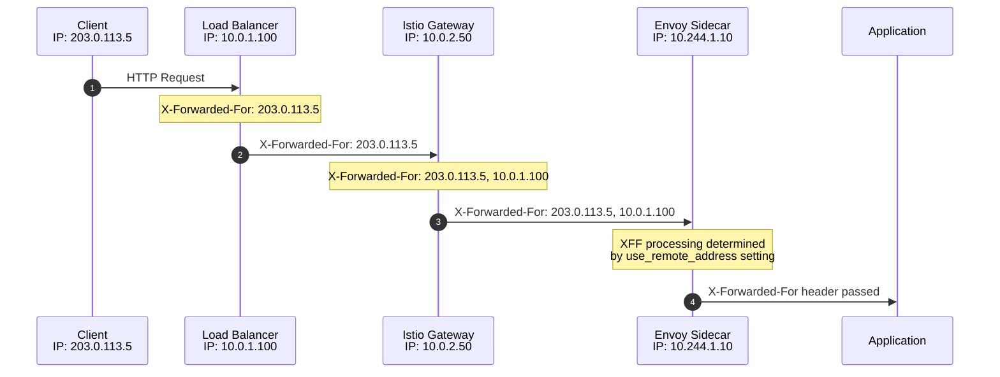
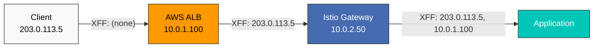
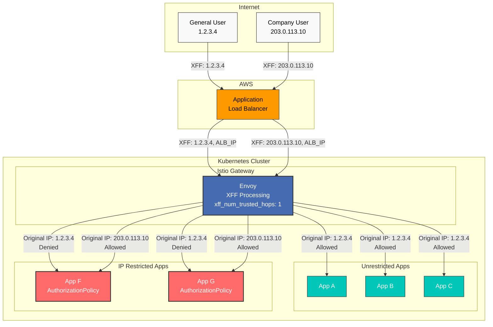
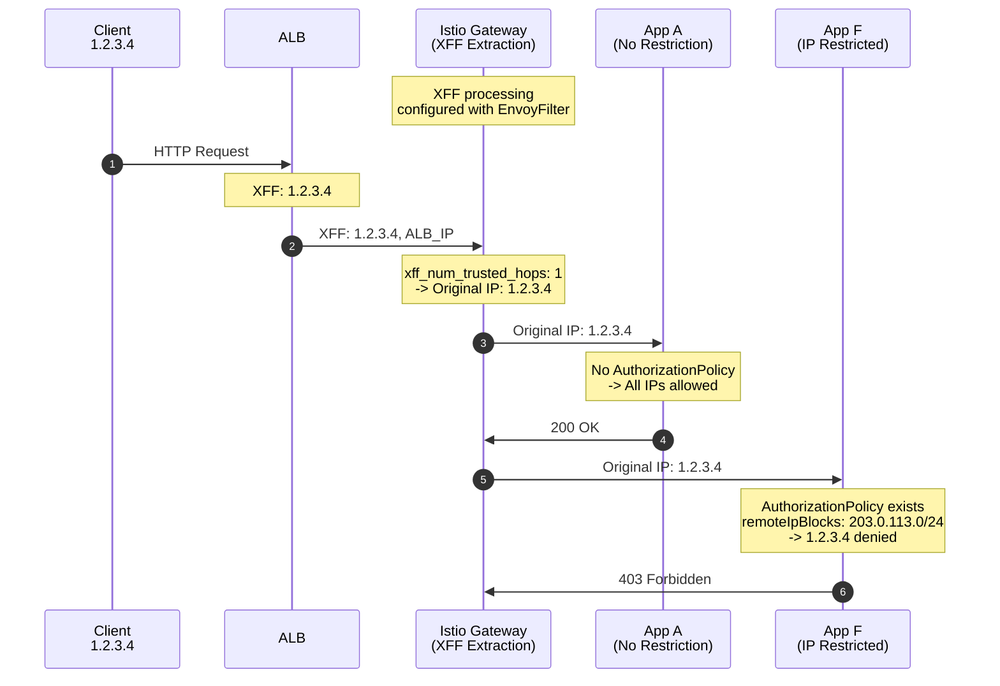
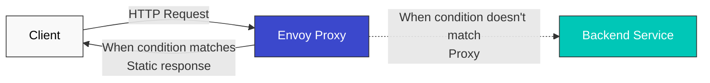

# EnvoyFilter

> **Supported Versions**: Istio 1.28+
> **Last Updated**: February 19, 2026

EnvoyFilter is an advanced feature that allows you to directly customize Envoy proxy configurations.

## Table of Contents

1. [Overview](#overview)
2. [Structure](#structure)
3. [Main Use Cases](#main-use-cases)
4. [X-Forwarded-For and Hop Settings](#x-forwarded-for-and-hop-settings)
5. [Static Response Configuration](#static-response-configuration)
6. [Practical Examples](#practical-examples)
7. [Best Practices](#best-practices)
8. [Troubleshooting](#troubleshooting)

## Overview

With EnvoyFilter you can:
- Add/modify/delete custom headers
- Rate Limiting
- External Authorization
- WASM plugin integration

## Structure

```yaml
apiVersion: networking.istio.io/v1alpha3
kind: EnvoyFilter
metadata:
  name: custom-filter
  namespace: default
spec:
  workloadSelector:
    labels:
      app: myapp
  configPatches:
  - applyTo: HTTP_FILTER
    match:
      context: SIDECAR_OUTBOUND
      listener:
        filterChain:
          filter:
            name: "envoy.filters.network.http_connection_manager"
    patch:
      operation: INSERT_BEFORE
      value:
        name: envoy.filters.http.lua
        typed_config:
          "@type": type.googleapis.com/envoy.extensions.filters.http.lua.v3.Lua
          inline_code: |
            function envoy_on_request(request_handle)
              request_handle:headers():add("x-custom-header", "value")
            end
```

## Main Use Cases

### 1. Adding Custom Headers

```yaml
apiVersion: networking.istio.io/v1alpha3
kind: EnvoyFilter
metadata:
  name: add-header
spec:
  workloadSelector:
    labels:
      app: myapp
  configPatches:
  - applyTo: HTTP_FILTER
    match:
      context: SIDECAR_OUTBOUND
    patch:
      operation: INSERT_BEFORE
      value:
        name: envoy.filters.http.lua
        typed_config:
          "@type": type.googleapis.com/envoy.extensions.filters.http.lua.v3.Lua
          inline_code: |
            function envoy_on_request(request_handle)
              request_handle:headers():add("x-request-id", request_handle:headers():get(":authority"))
              request_handle:headers():add("x-forwarded-proto", "https")
            end
```

### 2. Rate Limiting

```yaml
apiVersion: networking.istio.io/v1alpha3
kind: EnvoyFilter
metadata:
  name: ratelimit
spec:
  workloadSelector:
    labels:
      app: api-service
  configPatches:
  - applyTo: HTTP_FILTER
    match:
      context: SIDECAR_INBOUND
    patch:
      operation: INSERT_BEFORE
      value:
        name: envoy.filters.http.local_ratelimit
        typed_config:
          "@type": type.googleapis.com/envoy.extensions.filters.http.local_ratelimit.v3.LocalRateLimit
          stat_prefix: http_local_rate_limiter
          token_bucket:
            max_tokens: 100
            tokens_per_fill: 10
            fill_interval: 1s
```

### 3. WASM Plugin

```yaml
apiVersion: networking.istio.io/v1alpha3
kind: EnvoyFilter
metadata:
  name: wasm-filter
spec:
  workloadSelector:
    labels:
      app: myapp
  configPatches:
  - applyTo: HTTP_FILTER
    match:
      context: SIDECAR_INBOUND
    patch:
      operation: INSERT_BEFORE
      value:
        name: envoy.filters.http.wasm
        typed_config:
          "@type": type.googleapis.com/envoy.extensions.filters.http.wasm.v3.Wasm
          config:
            vm_config:
              runtime: "envoy.wasm.runtime.v8"
              code:
                local:
                  filename: "/var/local/lib/wasm-filters/my_plugin.wasm"
```

## X-Forwarded-For and Hop Settings

Controlling the X-Forwarded-For (XFF) header and hop count is crucial for tracking the actual client IP in proxy chain environments.

### X-Forwarded-For Overview



### XFF Configuration Options

#### 1. use_remote_address Setting

**use_remote_address** determines how Envoy processes the XFF header.

```yaml
apiVersion: networking.istio.io/v1alpha3
kind: EnvoyFilter
metadata:
  name: xff-config
  namespace: istio-system
spec:
  workloadSelector:
    labels:
      istio: ingressgateway
  configPatches:
  - applyTo: NETWORK_FILTER
    match:
      context: GATEWAY
      listener:
        filterChain:
          filter:
            name: "envoy.filters.network.http_connection_manager"
    patch:
      operation: MERGE
      value:
        typed_config:
          "@type": type.googleapis.com/envoy.extensions.filters.network.http_connection_manager.v3.HttpConnectionManager
          use_remote_address: true
          xff_num_trusted_hops: 1
```

**use_remote_address options**:

| Setting | Behavior | Use Scenario |
|---------|------|--------------|
| `true` | Add downstream address to XFF and trust it | Edge Proxy (direct internet access) |
| `false` | Don't trust downstream address, pass XFF as-is | Internal Proxy (behind trusted proxy) |

#### 2. xff_num_trusted_hops Setting

**xff_num_trusted_hops** defines the number of trusted hops in the XFF header.

```yaml
apiVersion: networking.istio.io/v1alpha3
kind: EnvoyFilter
metadata:
  name: xff-trusted-hops
  namespace: istio-system
spec:
  workloadSelector:
    labels:
      istio: ingressgateway
  configPatches:
  - applyTo: NETWORK_FILTER
    match:
      context: GATEWAY
      listener:
        filterChain:
          filter:
            name: "envoy.filters.network.http_connection_manager"
    patch:
      operation: MERGE
      value:
        typed_config:
          "@type": type.googleapis.com/envoy.extensions.filters.network.http_connection_manager.v3.HttpConnectionManager
          use_remote_address: true
          xff_num_trusted_hops: 2  # Trust last 2 hops
          skip_xff_append: false
```

**xff_num_trusted_hops calculation example**:

```
X-Forwarded-For: 203.0.113.5, 10.0.1.100, 10.0.2.50, 10.244.1.10
                 [Client IP] [Proxy 1]   [Proxy 2]   [Proxy 3]

xff_num_trusted_hops: 0 -> Don't trust
  -> Client IP: 10.244.1.10 (last hop)

xff_num_trusted_hops: 1 -> Trust last 1
  -> Client IP: 10.0.2.50

xff_num_trusted_hops: 2 -> Trust last 2
  -> Client IP: 10.0.1.100

xff_num_trusted_hops: 3 -> Trust last 3
  -> Client IP: 203.0.113.5 (actual client)
```

### Scenario-specific Settings

#### Scenario 1: AWS ALB + Istio Gateway



**Configuration**:

```yaml
apiVersion: networking.istio.io/v1alpha3
kind: EnvoyFilter
metadata:
  name: gateway-xff-config
  namespace: istio-system
spec:
  workloadSelector:
    labels:
      istio: ingressgateway
  configPatches:
  - applyTo: NETWORK_FILTER
    match:
      context: GATEWAY
      listener:
        filterChain:
          filter:
            name: "envoy.filters.network.http_connection_manager"
    patch:
      operation: MERGE
      value:
        typed_config:
          "@type": type.googleapis.com/envoy.extensions.filters.network.http_connection_manager.v3.HttpConnectionManager
          use_remote_address: true
          xff_num_trusted_hops: 1  # Trust only ALB
          skip_xff_append: false
```

**Explanation**:
- `use_remote_address: true`: Gateway acts as edge proxy
- `xff_num_trusted_hops: 1`: Trust ALB (last hop)
- Result: Actual client IP (`203.0.113.5`) is correctly extracted

#### Scenario 2: Client -> CloudFront -> ALB -> Gateway

```mermaid
flowchart LR
    Client[Client<br/>203.0.113.5]
    CF[CloudFront<br/>172.64.0.1]
    ALB[AWS ALB<br/>10.0.1.100]
    Gateway[Istio Gateway<br/>10.0.2.50]
    App[Application]

    Client -->|"XFF: (none)"| CF
    CF -->|"XFF: 203.0.113.5"| ALB
    ALB -->|"XFF: 203.0.113.5, 172.64.0.1"| Gateway
    Gateway -->|"XFF: 203.0.113.5, 172.64.0.1, 10.0.1.100"| App

    %% Style definitions
    classDef client fill:#f9f9f9,stroke:#333,stroke-width:1px,color:black;
    classDef aws fill:#FF9900,stroke:#333,stroke-width:1px,color:black;
    classDef istio fill:#466BB0,stroke:#333,stroke-width:1px,color:white;
    classDef app fill:#00C7B7,stroke:#333,stroke-width:1px,color:white;

    %% Apply classes
    class Client client;
    class CF,ALB aws;
    class Gateway istio;
    class App app;
```



**Configuration**:

```yaml
apiVersion: networking.istio.io/v1alpha3
kind: EnvoyFilter
metadata:
  name: gateway-xff-cf-alb
  namespace: istio-system
spec:
  workloadSelector:
    labels:
      istio: ingressgateway
  configPatches:
  - applyTo: NETWORK_FILTER
    match:
      context: GATEWAY
      listener:
        filterChain:
          filter:
            name: "envoy.filters.network.http_connection_manager"
    patch:
      operation: MERGE
      value:
        typed_config:
          "@type": type.googleapis.com/envoy.extensions.filters.network.http_connection_manager.v3.HttpConnectionManager
          use_remote_address: true
          xff_num_trusted_hops: 2  # Trust CloudFront + ALB
          skip_xff_append: false
```

**XFF Calculation**:
```
X-Forwarded-For: 203.0.113.5, 172.64.0.1, 10.0.1.100
                 [Actual IP]  [CloudFront IP] [ALB IP]

xff_num_trusted_hops: 2 -> Trust last 2 (CloudFront, ALB)
-> Actual client IP: 203.0.113.5
```

#### Scenario 3: Client -> CloudFront -> NLB -> ALB -> Gateway

```mermaid
flowchart LR
    Client[Client<br/>203.0.113.5]
    CF[CloudFront<br/>172.64.0.1]
    NLB[AWS NLB<br/>10.0.1.50]
    ALB[AWS ALB<br/>10.0.1.100]
    Gateway[Istio Gateway<br/>10.0.2.50]
    App[Application]

    Client -->|"XFF: (none)"| CF
    CF -->|"XFF: 203.0.113.5"| NLB
    NLB -->|"XFF: 203.0.113.5<br/>(L4, no modification)"| ALB
    ALB -->|"XFF: 203.0.113.5, 172.64.0.1"| Gateway
    Gateway -->|"XFF: 203.0.113.5, 172.64.0.1, 10.0.1.100"| App

    %% Style definitions
    classDef client fill:#f9f9f9,stroke:#333,stroke-width:1px,color:black;
    classDef aws fill:#FF9900,stroke:#333,stroke-width:1px,color:black;
    classDef istio fill:#466BB0,stroke:#333,stroke-width:1px,color:white;
    classDef app fill:#00C7B7,stroke:#333,stroke-width:1px,color:white;

    %% Apply classes
    class Client client;
    class CF,NLB,ALB aws;
    class Gateway istio;
    class App app;
```



**Configuration**:

```yaml
apiVersion: networking.istio.io/v1alpha3
kind: EnvoyFilter
metadata:
  name: gateway-xff-cf-nlb-alb
  namespace: istio-system
spec:
  workloadSelector:
    labels:
      istio: ingressgateway
  configPatches:
  - applyTo: NETWORK_FILTER
    match:
      context: GATEWAY
      listener:
        filterChain:
          filter:
            name: "envoy.filters.network.http_connection_manager"
    patch:
      operation: MERGE
      value:
        typed_config:
          "@type": type.googleapis.com/envoy.extensions.filters.network.http_connection_manager.v3.HttpConnectionManager
          use_remote_address: true
          xff_num_trusted_hops: 2  # Trust CloudFront + ALB (NLB is L4 so not counted)
          skip_xff_append: false
```

**Important**: NLB is an L4 load balancer so it doesn't read or modify XFF headers. Therefore, it doesn't affect the XFF chain.

**XFF Calculation**:
```
X-Forwarded-For: 203.0.113.5, 172.64.0.1, 10.0.1.100
                 [Actual IP]  [CloudFront IP] [ALB IP]

NLB has no effect on XFF (L4 LB)
xff_num_trusted_hops: 2 -> Trust last 2 (CloudFront, ALB)
-> Actual client IP: 203.0.113.5
```

#### Scenario 4: Client -> ALB -> Gateway (Direct Connection)


**Configuration**:

```yaml
apiVersion: networking.istio.io/v1alpha3
kind: EnvoyFilter
metadata:
  name: gateway-xff-alb-only
  namespace: istio-system
spec:
  workloadSelector:
    labels:
      istio: ingressgateway
  configPatches:
  - applyTo: NETWORK_FILTER
    match:
      context: GATEWAY
      listener:
        filterChain:
          filter:
            name: "envoy.filters.network.http_connection_manager"
    patch:
      operation: MERGE
      value:
        typed_config:
          "@type": type.googleapis.com/envoy.extensions.filters.network.http_connection_manager.v3.HttpConnectionManager
          use_remote_address: true
          xff_num_trusted_hops: 1  # Trust only ALB
          skip_xff_append: false
```

**XFF Calculation**:
```
X-Forwarded-For: 203.0.113.5, 10.0.1.100
                 [Actual IP]  [ALB IP]

xff_num_trusted_hops: 1 -> Trust last 1 (ALB)
-> Actual client IP: 203.0.113.5
```

#### Scenario 5: Internal Service Communication (Sidecar)

```yaml
apiVersion: networking.istio.io/v1alpha3
kind: EnvoyFilter
metadata:
  name: sidecar-xff-config
  namespace: default
spec:
  workloadSelector:
    labels:
      app: backend-service
  configPatches:
  - applyTo: NETWORK_FILTER
    match:
      context: SIDECAR_INBOUND
      listener:
        filterChain:
          filter:
            name: "envoy.filters.network.http_connection_manager"
    patch:
      operation: MERGE
      value:
        typed_config:
          "@type": type.googleapis.com/envoy.extensions.filters.network.http_connection_manager.v3.HttpConnectionManager
          use_remote_address: false  # Internal proxy, trusted environment
          xff_num_trusted_hops: 0
          skip_xff_append: false
```

### Additional XFF Options

#### skip_xff_append

Don't add the current hop to the XFF header.

```yaml
apiVersion: networking.istio.io/v1alpha3
kind: EnvoyFilter
metadata:
  name: xff-skip-append
  namespace: istio-system
spec:
  workloadSelector:
    labels:
      istio: ingressgateway
  configPatches:
  - applyTo: NETWORK_FILTER
    match:
      context: GATEWAY
    patch:
      operation: MERGE
      value:
        typed_config:
          "@type": type.googleapis.com/envoy.extensions.filters.network.http_connection_manager.v3.HttpConnectionManager
          skip_xff_append: true  # Don't modify XFF header
```

**Use scenario**: When debugging or maintaining a specific XFF chain is needed

#### via Header Setting

Track proxy chain with Via header:

```yaml
apiVersion: networking.istio.io/v1alpha3
kind: EnvoyFilter
metadata:
  name: via-header
  namespace: istio-system
spec:
  workloadSelector:
    labels:
      istio: ingressgateway
  configPatches:
  - applyTo: NETWORK_FILTER
    match:
      context: GATEWAY
    patch:
      operation: MERGE
      value:
        typed_config:
          "@type": type.googleapis.com/envoy.extensions.filters.network.http_connection_manager.v3.HttpConnectionManager
          via: "istio-gateway"
```

### Real Client IP Extraction Example

Extract actual client IP with Lua script:

```yaml
apiVersion: networking.istio.io/v1alpha3
kind: EnvoyFilter
metadata:
  name: extract-real-ip
  namespace: default
spec:
  workloadSelector:
    labels:
      app: api-service
  configPatches:
  - applyTo: HTTP_FILTER
    match:
      context: SIDECAR_INBOUND
      listener:
        filterChain:
          filter:
            name: "envoy.filters.network.http_connection_manager"
            subFilter:
              name: "envoy.filters.http.router"
    patch:
      operation: INSERT_BEFORE
      value:
        name: envoy.filters.http.lua
        typed_config:
          "@type": type.googleapis.com/envoy.extensions.filters.http.lua.v3.Lua
          inline_code: |
            function envoy_on_request(request_handle)
              -- Get X-Forwarded-For header
              local xff = request_handle:headers():get("x-forwarded-for")

              if xff then
                -- First IP is the actual client IP
                local client_ip = xff:match("^([^,]+)")

                -- Set as custom header
                request_handle:headers():add("x-real-ip", client_ip)

                request_handle:logInfo("Real Client IP: " .. client_ip)
              end
            end
```

### XFF Verification and Debugging

#### 1. Header Verification

```bash
# Verify headers inside pod
kubectl exec -it <pod-name> -c istio-proxy -- curl -v localhost:15000/config_dump | \
  jq '.configs[] | select(.["@type"] == "type.googleapis.com/envoy.admin.v3.ListenersConfigDump") |
      .dynamic_listeners[].active_state.listener.filter_chains[].filters[] |
      select(.name == "envoy.filters.network.http_connection_manager") |
      .typed_config | {use_remote_address, xff_num_trusted_hops}'
```

#### 2. Test with Actual Request

```bash
# Test request with XFF header
curl -H "X-Forwarded-For: 203.0.113.5, 10.0.1.100" \
     http://your-gateway.example.com/api/test

# Check received headers in application logs
kubectl logs -n default <pod-name> -c app | grep -i "x-forwarded-for"
```

#### 3. Enable Envoy Access Logs

```yaml
apiVersion: networking.istio.io/v1alpha3
kind: EnvoyFilter
metadata:
  name: access-log-xff
  namespace: istio-system
spec:
  workloadSelector:
    labels:
      istio: ingressgateway
  configPatches:
  - applyTo: NETWORK_FILTER
    match:
      context: GATEWAY
    patch:
      operation: MERGE
      value:
        typed_config:
          "@type": type.googleapis.com/envoy.extensions.filters.network.http_connection_manager.v3.HttpConnectionManager
          access_log:
          - name: envoy.access_loggers.file
            typed_config:
              "@type": type.googleapis.com/envoy.extensions.access_loggers.file.v3.FileAccessLog
              path: /dev/stdout
              log_format:
                text_format: |
                  [%START_TIME%] "%REQ(:METHOD)% %REQ(X-ENVOY-ORIGINAL-PATH?:PATH)% %PROTOCOL%"
                  XFF: "%REQ(X-FORWARDED-FOR)%"
                  Real IP: "%DOWNSTREAM_REMOTE_ADDRESS%"
                  Status: %RESPONSE_CODE% Duration: %DURATION%ms
```

### Security Considerations

#### 1. XFF Spoofing Prevention

```yaml
apiVersion: networking.istio.io/v1alpha3
kind: EnvoyFilter
metadata:
  name: xff-security
  namespace: istio-system
spec:
  workloadSelector:
    labels:
      istio: ingressgateway
  configPatches:
  - applyTo: NETWORK_FILTER
    match:
      context: GATEWAY
    patch:
      operation: MERGE
      value:
        typed_config:
          "@type": type.googleapis.com/envoy.extensions.filters.network.http_connection_manager.v3.HttpConnectionManager
          use_remote_address: true
          xff_num_trusted_hops: 1
          # XFF from untrusted hops is ignored
```

**Important**: At Edge Gateway, you **must** set `use_remote_address: true` to prevent clients from manipulating XFF.

#### 2. Protect Internal Services

```yaml
apiVersion: networking.istio.io/v1alpha3
kind: EnvoyFilter
metadata:
  name: internal-xff-strip
  namespace: default
spec:
  workloadSelector:
    labels:
      tier: backend
  configPatches:
  - applyTo: HTTP_FILTER
    match:
      context: SIDECAR_INBOUND
    patch:
      operation: INSERT_BEFORE
      value:
        name: envoy.filters.http.lua
        typed_config:
          "@type": type.googleapis.com/envoy.extensions.filters.http.lua.v3.Lua
          inline_code: |
            function envoy_on_request(request_handle)
              -- Remove XFF from requests not coming from internal network
              local remote_addr = request_handle:streamInfo():downstreamRemoteAddress():ip()

              -- Remove XFF if not from 10.0.0.0/8 internal network
              if not remote_addr:match("^10%.") then
                request_handle:headers():remove("x-forwarded-for")
                request_handle:logWarn("Removed potentially spoofed XFF from: " .. remote_addr)
              end
            end
```

### Selective Per-App IP Restriction (Gateway + AuthorizationPolicy)

**Scenario**: Some apps (A-E) allow all clients, specific apps (F-G) allow only company NAT IP

#### Architecture Overview



#### Core Principle

**Gateway's Role** (common to all apps):
- Extract original client IP from XFF header
- Exclude trusted hops (`xff_num_trusted_hops`)
- **Does NOT perform access control** - only identifies IP accurately

**AuthorizationPolicy's Role** (selectively applied to specific apps):
- Access control based on original IP extracted by Gateway
- Target specific apps with `selector`
- **Apps without policies allow all clients**

#### Implementation Example

**Step 1: XFF Processing at Gateway (common to all apps)**

```yaml
# Apply once to istio-system namespace
apiVersion: networking.istio.io/v1alpha3
kind: EnvoyFilter
metadata:
  name: gateway-xff-config
  namespace: istio-system
spec:
  workloadSelector:
    labels:
      istio: ingressgateway
  configPatches:
  - applyTo: NETWORK_FILTER
    match:
      context: GATEWAY  # Gateway context
      listener:
        filterChain:
          filter:
            name: "envoy.filters.network.http_connection_manager"
    patch:
      operation: MERGE
      value:
        typed_config:
          "@type": type.googleapis.com/envoy.extensions.filters.network.http_connection_manager.v3.HttpConnectionManager
          use_remote_address: true
          xff_num_trusted_hops: 1  # Trust only ALB (2 if CloudFlare present)
          skip_xff_append: false
```

**Step 2: Apply IP Restriction to App F (selective)**

```yaml
# Allow only company NAT IP for App F
apiVersion: security.istio.io/v1
kind: AuthorizationPolicy
metadata:
  name: app-f-ip-restriction
  namespace: default
spec:
  selector:
    matchLabels:
      app: app-f  # Applied only to App F
  action: DENY
  rules:
  - from:
    - source:
        notRemoteIpBlocks:  # Deny if not following IPs
        - "203.0.113.0/24"  # Company NAT IP range
```

**Step 3: Apply IP Restriction to App G (selective)**

```yaml
# Allow same company NAT IP for App G
apiVersion: security.istio.io/v1
kind: AuthorizationPolicy
metadata:
  name: app-g-ip-restriction
  namespace: default
spec:
  selector:
    matchLabels:
      app: app-g  # Applied only to App G
  action: DENY
  rules:
  - from:
    - source:
        notRemoteIpBlocks:
        - "203.0.113.0/24"  # Company NAT IP range
```

**Step 4: Apps A-E have no AuthorizationPolicy (all clients allowed)**

```yaml
# No AuthorizationPolicy created for Apps A-E
# = All client IPs allowed
```

#### Operation Flow



#### Why Gateway Configuration is Needed?

**Without Gateway XFF configuration**:
- `remoteIpBlocks` reads ALB's IP (not original IP)
- All requests appear from same ALB IP, can't filter properly

**With Gateway XFF configuration**:
- Gateway accurately extracts original IP from XFF header
- AuthorizationPolicy's `remoteIpBlocks` uses original IP
- Each app's AuthorizationPolicy works correctly

#### Testing

```bash
# General user (1.2.3.4) - App A access
curl -H "Host: app-a.example.com" http://<gateway-ip>/
# Expected: 200 OK

# General user (1.2.3.4) - App F access
curl -H "Host: app-f.example.com" http://<gateway-ip>/
# Expected: 403 Forbidden (RBAC: access denied)

# Company user (203.0.113.10) - App F access
curl -H "Host: app-f.example.com" -H "X-Forwarded-For: 203.0.113.10" http://<gateway-ip>/
# Expected: 200 OK

# Check AuthorizationPolicy
kubectl get authorizationpolicy -n default
# Output:
# NAME                    AGE
# app-f-ip-restriction    5m
# app-g-ip-restriction    5m
# (app-a, app-b, app-c, app-d, app-e are absent)
```

#### Summary

| Component | Scope | Purpose | Required? |
|----------|----------|------|----------|
| Gateway EnvoyFilter | All apps | Extract original IP from XFF | Required (once) |
| App F AuthorizationPolicy | App F only | Allow only company NAT IP | Selective |
| App G AuthorizationPolicy | App G only | Allow only company NAT IP | Selective |
| App A-E AuthorizationPolicy | None | No restriction (all IPs allowed) | Not needed |

**Key Points**:
- Gateway XFF configuration only extracts IP, no access control
- AuthorizationPolicy is selectively applied to specific apps only
- Apps without policies automatically allow all clients

---

### XFF-based IP Access Control

Implement access control based on original client IP in X-Forwarded-For header.

**Recommended method**: Use AuthorizationPolicy's `remoteIpBlocks` (more declarative and safer than EnvoyFilter)

#### 1. IP Whitelist with AuthorizationPolicy (Recommended)

```yaml
apiVersion: security.istio.io/v1
kind: AuthorizationPolicy
metadata:
  name: ip-whitelist
  namespace: default
spec:
  selector:
    matchLabels:
      app: api-service
  action: ALLOW
  rules:
  - from:
    - source:
        remoteIpBlocks:  # Original IP from X-Forwarded-For
        - "203.0.113.10/32"
        - "203.0.113.11/32"
        - "198.51.100.0/24"
```

**Pros**:
- Declarative and easy to understand
- Istio automatically parses XFF header
- CIDR range support
- Safe during Istio upgrades
- No separate code needed

#### 2. IP Blacklist with AuthorizationPolicy (Recommended)

```yaml
apiVersion: security.istio.io/v1
kind: AuthorizationPolicy
metadata:
  name: ip-blacklist
  namespace: default
spec:
  selector:
    matchLabels:
      app: api-service
  action: DENY
  rules:
  - from:
    - source:
        remoteIpBlocks:  # IPs to block
        - "192.0.2.100/32"
        - "192.0.2.101/32"
        - "198.51.100.0/24"
```

#### 3. Per-path IP Restriction (AuthorizationPolicy)

```yaml
apiVersion: security.istio.io/v1
kind: AuthorizationPolicy
metadata:
  name: admin-path-ip-restriction
  namespace: default
spec:
  selector:
    matchLabels:
      app: api-service
  action: ALLOW
  rules:
  # Admin paths only specific IPs
  - to:
    - operation:
        paths: ["/admin/*"]
    from:
    - source:
        remoteIpBlocks:
        - "203.0.113.10/32"
        - "203.0.113.11/32"

  # General paths all IPs
  - to:
    - operation:
        notPaths: ["/admin/*"]
    from:
    - source:
        remoteIpBlocks:
        - "0.0.0.0/0"
```

#### 4. Complex Policy: IP + Path + Method

```yaml
apiVersion: security.istio.io/v1
kind: AuthorizationPolicy
metadata:
  name: complex-access-control
  namespace: default
spec:
  selector:
    matchLabels:
      app: api-service
  action: ALLOW
  rules:
  # Admin: All paths accessible
  - from:
    - source:
        remoteIpBlocks:
        - "203.0.113.10/32"  # Admin IP

  # Internal network: API read only
  - to:
    - operation:
        paths: ["/api/v1/*"]
        methods: ["GET"]
    from:
    - source:
        remoteIpBlocks:
        - "10.0.0.0/8"  # Internal network

  # Public network: Public API only
  - to:
    - operation:
        paths: ["/api/v1/public/*"]
        methods: ["GET", "POST"]
    from:
    - source:
        remoteIpBlocks:
        - "0.0.0.0/0"
```

#### 5. Whitelist + Blacklist Combination

```yaml
# Blacklist applied first (higher priority)
apiVersion: security.istio.io/v1
kind: AuthorizationPolicy
metadata:
  name: ip-blacklist
  namespace: default
spec:
  selector:
    matchLabels:
      app: api-service
  action: DENY
  rules:
  - from:
    - source:
        remoteIpBlocks:
        - "192.0.2.100/32"
        - "192.0.2.101/32"
        - "198.51.100.0/24"
---
# Whitelist applied
apiVersion: security.istio.io/v1
kind: AuthorizationPolicy
metadata:
  name: ip-whitelist
  namespace: default
spec:
  selector:
    matchLabels:
      app: api-service
  action: ALLOW
  rules:
  - from:
    - source:
        remoteIpBlocks:
        - "203.0.113.0/24"
        - "198.51.100.0/22"  # Larger range
```

**Processing order**: DENY policies are evaluated first, so Blacklist takes priority.

#### 6. Testing

```bash
# 1. Test from allowed IP
curl -H "X-Forwarded-For: 203.0.113.10" http://api-service:8080/api

# 2. Test from blocked IP
curl -H "X-Forwarded-For: 192.0.2.100" http://api-service:8080/api

# 3. IP not in Whitelist
curl -H "X-Forwarded-For: 1.2.3.4" http://api-service:8080/api

# 4. Admin path access test
curl -H "X-Forwarded-For: 203.0.113.10" http://api-service:8080/admin/users
curl -H "X-Forwarded-For: 10.0.1.100" http://api-service:8080/admin/users

# 5. Check policies
kubectl get authorizationpolicy -n default

# 6. Check logs (Envoy access logs)
kubectl logs -n default <pod-name> -c istio-proxy | grep "403"
```

#### 7. Advanced: Custom Deny Message with EnvoyFilter (Optional)

AuthorizationPolicy returns `RBAC: access denied` message by default. Add EnvoyFilter only if custom message is needed:

```yaml
apiVersion: networking.istio.io/v1alpha3
kind: EnvoyFilter
metadata:
  name: custom-deny-message
  namespace: default
spec:
  workloadSelector:
    matchLabels:
      app: api-service
  configPatches:
  - applyTo: HTTP_FILTER
    match:
      context: SIDECAR_INBOUND
      listener:
        filterChain:
          filter:
            name: "envoy.filters.network.http_connection_manager"
            subFilter:
              name: "envoy.filters.http.router"
    patch:
      operation: INSERT_BEFORE
      value:
        name: envoy.filters.http.lua
        typed_config:
          "@type": type.googleapis.com/envoy.extensions.filters.http.lua.v3.Lua
          inline_code: |
            function envoy_on_response(response_handle)
              local status = response_handle:headers():get(":status")
              local body = response_handle:body():getBytes(0, 1000)

              -- Detect AuthorizationPolicy's 403 response
              if status == "403" and body and body:match("RBAC: access denied") then
                response_handle:body():setBytes('{"error": "Access denied", "code": "IP_NOT_ALLOWED"}')
                response_handle:headers():replace("content-type", "application/json")
              end
            end
```

### Best Practices

1. **Edge Gateway settings**:
   - `use_remote_address: true`
   - `xff_num_trusted_hops`: Set to the number of trusted proxies

2. **Internal Sidecar settings**:
   - `use_remote_address: false`
   - `skip_xff_append: false`

3. **Verification and testing**:
   - Thoroughly test XFF behavior before production deployment
   - Verify actual client IP extraction with access logs

4. **Security**:
   - Prevent XFF spoofing at Edge
   - Ignore XFF from untrusted sources

## Static Response Configuration

You can return static responses directly without going through backend services for specific requests. This is useful for maintenance mode, error pages, health check responses, etc.

### Static Response Overview



### Use Cases

1. **Maintenance mode**: Return 503 Service Unavailable
2. **Health check endpoint**: Return 200 OK
3. **Custom error pages**: JSON or HTML error responses
4. **Test/mock responses**: Predefined responses for specific paths
5. **Quick rejection**: Return 401 Unauthorized immediately on auth failure

### Implementation Method Selection Guide

Istio provides several ways to implement static responses:

| Method | When to use | Pros | Cons |
|------|----------|------|------|
| **VirtualService** | Simple static responses, integrate with routing rules | Declarative, easy to understand | Limited customization |
| **ProxyConfig** | Per-workload Envoy configuration | Fine-grained control, performance tuning | Complex configuration |
| **AuthorizationPolicy** | IP/header based access control | Integrates with security policies | Not just for static responses |
| **EnvoyFilter** | Only when above methods are insufficient | Maximum flexibility | Complex, upgrade risk |

**Recommendation**: Use **VirtualService** and **AuthorizationPolicy** first when possible, use EnvoyFilter only when necessary

### Implementing Static Responses with VirtualService

#### 1. Basic Static Response (directResponse)

```yaml
apiVersion: networking.istio.io/v1
kind: VirtualService
metadata:
  name: api-service
  namespace: default
spec:
  hosts:
  - api-service
  http:
  # Maintenance mode
  - match:
    - uri:
        prefix: "/api/v1"
    directResponse:
      status: 503
      body:
        string: |
          {
            "error": {
              "code": "SERVICE_UNAVAILABLE",
              "message": "The service is currently under maintenance",
              "timestamp": "2025-11-26T10:00:00Z",
              "retry_after": 3600
            }
          }
    headers:
      response:
        set:
          content-type: "application/json"
          retry-after: "3600"
```

**Result**:
```bash
$ curl -i http://api-service/api/v1/users
HTTP/1.1 503 Service Unavailable
content-type: application/json
retry-after: 3600

{
  "error": {
    "code": "SERVICE_UNAVAILABLE",
    "message": "The service is currently under maintenance",
    "timestamp": "2025-11-26T10:00:00Z",
    "retry_after": 3600
  }
}
```

#### 2. Health Check Endpoint

```yaml
apiVersion: networking.istio.io/v1
kind: VirtualService
metadata:
  name: api-service-health
spec:
  hosts:
  - api-service
  http:
  # Health check path
  - match:
    - uri:
        exact: "/health"
    directResponse:
      status: 200
      body:
        string: "OK"

  # Normal traffic
  - route:
    - destination:
        host: api-service
```

#### 3. Block Specific Paths

```yaml
apiVersion: networking.istio.io/v1
kind: VirtualService
metadata:
  name: block-admin
spec:
  hosts:
  - api-service
  http:
  # Block Admin paths
  - match:
    - uri:
        prefix: "/admin"
    directResponse:
      status: 403
      body:
        string: |
          {
            "error": "Access to admin endpoints is forbidden"
          }
    headers:
      response:
        set:
          content-type: "application/json"

  # Normal traffic
  - route:
    - destination:
        host: api-service
```

#### 4. Error Simulation with Fault Injection

```yaml
apiVersion: networking.istio.io/v1
kind: VirtualService
metadata:
  name: fault-injection
spec:
  hosts:
  - api-service
  http:
  - fault:
      abort:
        httpStatus: 503
        percentage:
          value: 100  # Apply to 100% traffic
    route:
    - destination:
        host: api-service
```

### Access Control with AuthorizationPolicy

#### 1. Source IP Based Access Control

```yaml
apiVersion: security.istio.io/v1
kind: AuthorizationPolicy
metadata:
  name: ip-whitelist
  namespace: default
spec:
  selector:
    matchLabels:
      app: api-service
  action: ALLOW
  rules:
  - from:
    - source:
        ipBlocks:
        - "203.0.113.10/32"
        - "203.0.113.11/32"
        - "198.51.100.0/24"
---
# Default DENY policy
apiVersion: security.istio.io/v1
kind: AuthorizationPolicy
metadata:
  name: deny-all
  namespace: default
spec:
  selector:
    matchLabels:
      app: api-service
  action: DENY
  rules:
  - from:
    - source:
        notIpBlocks:
        - "203.0.113.10/32"
        - "203.0.113.11/32"
        - "198.51.100.0/24"
```

#### 2. Per-path IP Restriction

```yaml
apiVersion: security.istio.io/v1
kind: AuthorizationPolicy
metadata:
  name: admin-ip-whitelist
  namespace: default
spec:
  selector:
    matchLabels:
      app: api-service
  action: ALLOW
  rules:
  # Admin paths only specific IPs
  - to:
    - operation:
        paths: ["/admin/*"]
    from:
    - source:
        ipBlocks:
        - "203.0.113.10/32"
        - "203.0.113.11/32"

  # General paths all IPs
  - to:
    - operation:
        notPaths: ["/admin/*"]
```

#### 3. X-Forwarded-For Header Based Control

AuthorizationPolicy can use `remoteIpBlocks` to check the original IP from X-Forwarded-For header:

```yaml
apiVersion: security.istio.io/v1
kind: AuthorizationPolicy
metadata:
  name: xff-based-access
  namespace: default
spec:
  selector:
    matchLabels:
      app: api-service
  action: ALLOW
  rules:
  - from:
    - source:
        remoteIpBlocks:  # Original IP from X-Forwarded-For header
        - "203.0.113.0/24"
        - "198.51.100.0/24"
```

**Important**: For `remoteIpBlocks` to work, `xff_num_trusted_hops` must be correctly configured at Gateway (see [XFF Settings](#xff-configuration-options) above).

#### 4. Custom Deny Response

Requests blocked by AuthorizationPolicy return 403 response by default, but can be combined with EnvoyFilter to provide custom responses:

```yaml
apiVersion: security.istio.io/v1
kind: AuthorizationPolicy
metadata:
  name: block-untrusted-ips
  namespace: default
spec:
  selector:
    matchLabels:
      app: api-service
  action: DENY
  rules:
  - from:
    - source:
        notRemoteIpBlocks:
        - "203.0.113.0/24"
---
# Add custom body to 403 response
apiVersion: networking.istio.io/v1alpha3
kind: EnvoyFilter
metadata:
  name: custom-deny-response
  namespace: default
spec:
  workloadSelector:
    matchLabels:
      app: api-service
  configPatches:
  - applyTo: HTTP_FILTER
    match:
      context: SIDECAR_INBOUND
      listener:
        filterChain:
          filter:
            name: "envoy.filters.network.http_connection_manager"
            subFilter:
              name: "envoy.filters.http.router"
    patch:
      operation: INSERT_BEFORE
      value:
        name: envoy.filters.http.lua
        typed_config:
          "@type": type.googleapis.com/envoy.extensions.filters.http.lua.v3.Lua
          inline_code: |
            function envoy_on_response(response_handle)
              local status = response_handle:headers():get(":status")

              if status == "403" then
                response_handle:body():setBytes('{"error": "Access denied", "code": "FORBIDDEN"}')
                response_handle:headers():replace("content-type", "application/json")
              end
            end
```

### Envoy Configuration with ProxyConfig

ProxyConfig allows fine-grained per-workload Envoy proxy configuration.

#### 1. Per-workload Proxy Settings

```yaml
apiVersion: networking.istio.io/v1beta1
kind: ProxyConfig
metadata:
  name: api-service-config
  namespace: default
spec:
  selector:
    matchLabels:
      app: api-service
  concurrency: 4  # Worker thread count

  # Access log settings
  accessLogging:
  - providers:
    - name: envoy
      file:
        path: /dev/stdout
        format: |
          [%START_TIME%] "%REQ(:METHOD)% %REQ(X-ENVOY-ORIGINAL-PATH?:PATH)% %PROTOCOL%"
          Status: %RESPONSE_CODE% Duration: %DURATION%ms
          Client IP: %REQ(X-FORWARDED-FOR)%

  # Timeout settings
  connectionTimeout: 10s
  drainDuration: 5s

  # Resource limits
  resourceLimits:
    maxConnections: 10000
```

#### 2. Statistics and Metrics Settings

```yaml
apiVersion: networking.istio.io/v1beta1
kind: ProxyConfig
metadata:
  name: monitoring-config
  namespace: default
spec:
  selector:
    matchLabels:
      app: api-service

  # Statistics settings
  stats:
    inclusionPrefixes:
    - "cluster.outbound"
    - "http.inbound"
    inclusionSuffixes:
    - "upstream_rq_time"

  # Tracing settings
  tracing:
    sampling: 100.0  # 100% sampling
    maxPathTagLength: 256
```

### Integrated Example: VirtualService + AuthorizationPolicy

Integrated example for real production scenarios.

#### Scenario: Protect API Service

```yaml
# 1. IP based access control
apiVersion: security.istio.io/v1
kind: AuthorizationPolicy
metadata:
  name: api-access-control
  namespace: default
spec:
  selector:
    matchLabels:
      app: api-service
  action: ALLOW
  rules:
  # Admin API only specific IPs
  - to:
    - operation:
        paths: ["/api/v1/admin/*"]
    from:
    - source:
        remoteIpBlocks:
        - "203.0.113.10/32"  # Admin IP

  # Public API all trusted networks
  - to:
    - operation:
        paths: ["/api/v1/public/*"]
    from:
    - source:
        remoteIpBlocks:
        - "0.0.0.0/0"  # All IPs (in practice only trusted ranges)
---
# 2. Routing and static responses
apiVersion: networking.istio.io/v1
kind: VirtualService
metadata:
  name: api-service-routes
spec:
  hosts:
  - api-service
  http:
  # Health check
  - match:
    - uri:
        exact: "/health"
    directResponse:
      status: 200
      body:
        string: '{"status": "healthy"}'
    headers:
      response:
        set:
          content-type: "application/json"

  # Block legacy API version
  - match:
    - uri:
        prefix: "/api/v0/"
    directResponse:
      status: 410
      body:
        string: |
          {
            "error": "API v0 is deprecated",
            "supported_versions": ["v1", "v2"],
            "migration_guide": "https://docs.example.com/migration"
          }
    headers:
      response:
        set:
          content-type: "application/json"

  # Normal routing
  - route:
    - destination:
        host: api-service
        port:
          number: 8080
    timeout: 30s
    retries:
      attempts: 3
      perTryTimeout: 10s
---
# 3. Proxy settings
apiVersion: networking.istio.io/v1beta1
kind: ProxyConfig
metadata:
  name: api-service-proxy
  namespace: default
spec:
  selector:
    matchLabels:
      app: api-service
  concurrency: 4
  accessLogging:
  - providers:
    - name: envoy
      file:
        path: /dev/stdout
```

### Dynamic Static Responses with Lua

Lua scripts can dynamically generate static responses based on conditions.

#### Automatic Maintenance Window Detection

```yaml
apiVersion: networking.istio.io/v1alpha3
kind: EnvoyFilter
metadata:
  name: maintenance-window
  namespace: default
spec:
  workloadSelector:
    labels:
      app: api-service
  configPatches:
  - applyTo: HTTP_FILTER
    match:
      context: SIDECAR_INBOUND
      listener:
        filterChain:
          filter:
            name: "envoy.filters.network.http_connection_manager"
            subFilter:
              name: "envoy.filters.http.router"
    patch:
      operation: INSERT_BEFORE
      value:
        name: envoy.filters.http.lua
        typed_config:
          "@type": type.googleapis.com/envoy.extensions.filters.http.lua.v3.Lua
          inline_code: |
            function envoy_on_request(request_handle)
              -- Current time (UTC)
              local current_hour = tonumber(os.date("!%H"))

              -- Daily maintenance window 2-4 AM
              if current_hour >= 2 and current_hour < 4 then
                request_handle:respond(
                  {[":status"] = "503",
                   ["content-type"] = "application/json",
                   ["retry-after"] = "3600"},
                  '{"error": "Maintenance in progress", "window": "02:00-04:00 UTC"}'
                )
              end
            end
```

#### Request Header Based Response

```yaml
apiVersion: networking.istio.io/v1alpha3
kind: EnvoyFilter
metadata:
  name: header-based-response
  namespace: default
spec:
  workloadSelector:
    labels:
      app: api-service
  configPatches:
  - applyTo: HTTP_FILTER
    match:
      context: SIDECAR_INBOUND
      listener:
        filterChain:
          filter:
            name: "envoy.filters.network.http_connection_manager"
            subFilter:
              name: "envoy.filters.http.router"
    patch:
      operation: INSERT_BEFORE
      value:
        name: envoy.filters.http.lua
        typed_config:
          "@type": type.googleapis.com/envoy.extensions.filters.http.lua.v3.Lua
          inline_code: |
            function envoy_on_request(request_handle)
              local api_version = request_handle:headers():get("x-api-version")

              -- Unsupported API version
              if api_version and api_version == "v1" then
                request_handle:respond(
                  {[":status"] = "410",
                   ["content-type"] = "application/json"},
                  '{"error": "API v1 is deprecated", "supported_versions": ["v2", "v3"]}'
                )
              end
            end
```

### Integration with VirtualService

VirtualService and EnvoyFilter can be used together to implement more complex routing scenarios.

```yaml
apiVersion: networking.istio.io/v1
kind: VirtualService
metadata:
  name: api-service
spec:
  hosts:
  - api-service
  http:
  - match:
    - uri:
        prefix: "/maintenance"
    fault:
      abort:
        httpStatus: 503
        percentage:
          value: 100
    route:
    - destination:
        host: api-service
  - route:
    - destination:
        host: api-service
---
apiVersion: networking.istio.io/v1alpha3
kind: EnvoyFilter
metadata:
  name: maintenance-response-body
  namespace: default
spec:
  workloadSelector:
    labels:
      app: api-service
  configPatches:
  - applyTo: HTTP_FILTER
    match:
      context: SIDECAR_INBOUND
    patch:
      operation: INSERT_BEFORE
      value:
        name: envoy.filters.http.lua
        typed_config:
          "@type": type.googleapis.com/envoy.extensions.filters.http.lua.v3.Lua
          inline_code: |
            function envoy_on_response(response_handle)
              local status = response_handle:headers():get(":status")
              local path = response_handle:headers():get(":path")

              -- Add custom body when VirtualService returns 503
              if status == "503" and path and path:match("^/maintenance") then
                response_handle:body():setBytes('{"message": "Service under maintenance"}')
                response_handle:headers():replace("content-type", "application/json")
              end
            end
```

### Practical Scenarios

#### Scenario 1: Block Traffic During Blue/Green Deployment

```yaml
apiVersion: networking.istio.io/v1alpha3
kind: EnvoyFilter
metadata:
  name: deployment-block
  namespace: production
spec:
  workloadSelector:
    labels:
      app: api-service
      version: v1  # Block only old version
  configPatches:
  - applyTo: HTTP_ROUTE
    match:
      context: SIDECAR_INBOUND
    patch:
      operation: MERGE
      value:
        direct_response:
          status: 503
          body:
            inline_string: |
              {
                "message": "This version is being deprecated",
                "migration": {
                  "new_endpoint": "https://api-v2.example.com",
                  "cutoff_date": "2025-12-31"
                }
              }
        response_headers_to_add:
        - header:
            key: "Content-Type"
            value: "application/json"
        - header:
            key: "X-Migration-Required"
            value: "true"
```

#### Scenario 2: 429 Response on Rate Limit Exceeded

```yaml
apiVersion: networking.istio.io/v1alpha3
kind: EnvoyFilter
metadata:
  name: ratelimit-response
  namespace: default
spec:
  workloadSelector:
    labels:
      app: api-service
  configPatches:
  # Rate Limit filter
  - applyTo: HTTP_FILTER
    match:
      context: SIDECAR_INBOUND
      listener:
        filterChain:
          filter:
            name: "envoy.filters.network.http_connection_manager"
            subFilter:
              name: "envoy.filters.http.router"
    patch:
      operation: INSERT_BEFORE
      value:
        name: envoy.filters.http.local_ratelimit
        typed_config:
          "@type": type.googleapis.com/envoy.extensions.filters.http.local_ratelimit.v3.LocalRateLimit
          stat_prefix: http_local_rate_limiter
          token_bucket:
            max_tokens: 100
            tokens_per_fill: 10
            fill_interval: 1s
          filter_enabled:
            runtime_key: local_rate_limit_enabled
            default_value:
              numerator: 100
              denominator: HUNDRED
          filter_enforced:
            runtime_key: local_rate_limit_enforced
            default_value:
              numerator: 100
              denominator: HUNDRED
          response_headers_to_add:
          - append: false
            header:
              key: x-local-rate-limit
              value: 'true'
          local_rate_limit_per_downstream_connection: false
          # Custom 429 response
          status:
            code: 429
          response_headers_to_add:
          - header:
              key: "Content-Type"
              value: "application/json"

  # Lua filter to add 429 response body
  - applyTo: HTTP_FILTER
    match:
      context: SIDECAR_INBOUND
      listener:
        filterChain:
          filter:
            name: "envoy.filters.network.http_connection_manager"
            subFilter:
              name: "envoy.filters.http.router"
    patch:
      operation: INSERT_BEFORE
      value:
        name: envoy.filters.http.lua
        typed_config:
          "@type": type.googleapis.com/envoy.extensions.filters.http.lua.v3.Lua
          inline_code: |
            function envoy_on_response(response_handle)
              local status = response_handle:headers():get(":status")
              local rate_limited = response_handle:headers():get("x-local-rate-limit")

              if status == "429" and rate_limited == "true" then
                local body = [[
                {
                  "error": {
                    "code": "RATE_LIMIT_EXCEEDED",
                    "message": "Too many requests",
                    "retry_after": 60
                  }
                }
                ]]
                response_handle:body():setBytes(body)
                response_handle:headers():add("Retry-After", "60")
              end
            end
```

#### Scenario 3: Canary Deployment Test Response

```yaml
apiVersion: networking.istio.io/v1alpha3
kind: EnvoyFilter
metadata:
  name: canary-test-response
  namespace: default
spec:
  workloadSelector:
    labels:
      app: api-service
      version: canary
  configPatches:
  - applyTo: HTTP_FILTER
    match:
      context: SIDECAR_INBOUND
      listener:
        filterChain:
          filter:
            name: "envoy.filters.network.http_connection_manager"
            subFilter:
              name: "envoy.filters.http.router"
    patch:
      operation: INSERT_BEFORE
      value:
        name: envoy.filters.http.lua
        typed_config:
          "@type": type.googleapis.com/envoy.extensions.filters.http.lua.v3.Lua
          inline_code: |
            function envoy_on_request(request_handle)
              local test_header = request_handle:headers():get("x-canary-test")

              -- Return predefined response if canary test header present
              if test_header == "dry-run" then
                request_handle:respond(
                  {[":status"] = "200",
                   ["content-type"] = "application/json",
                   ["x-canary-version"] = "v2.0.0"},
                  '{"message": "Canary version response", "version": "v2.0.0"}'
                )
              end
            end
```

### Testing and Verification

#### Static Response Testing

```bash
# 1. Test basic 503 response
curl -i http://api-service:8080/api/v1

# 2. Test health check endpoint
curl -i http://api-service:8080/health

# 3. Test JSON error response
curl -i -H "Content-Type: application/json" http://api-service:8080/api/v1/users

# 4. Test maintenance window (time manipulation)
kubectl exec -it <pod-name> -c istio-proxy -- date -s "02:30:00"
curl -i http://api-service:8080/api/v1

# 5. Rate Limit test
for i in {1..150}; do
  curl -i http://api-service:8080/api/v1
done
```

#### Verify Envoy Configuration

```bash
# 1. Verify static response route
istioctl proxy-config routes <pod-name> -n default -o json | \
  jq '.[] | select(.virtualHosts[].routes[].directResponse != null)'

# 2. Check full route configuration
istioctl proxy-config routes <pod-name> -n default

# 3. Verify EnvoyFilter applied
kubectl get envoyfilter -n default maintenance-mode -o yaml

# 4. Verify via Envoy Admin API
kubectl port-forward <pod-name> 15000:15000
curl http://localhost:15000/config_dump | jq '.configs[] | select(.["@type"] == "type.googleapis.com/envoy.admin.v3.RoutesConfigDump")'
```

### Best Practices

1. **Clear error messages**:
   - Provide users with cause and solution
   - Specify retry time with `Retry-After` header

2. **Consistent error format**:
   - Use same JSON schema for all error responses
   - Maintain consistency between HTTP status codes and error codes

3. **Logging and monitoring**:
   - Log when returning static responses
   - Track static response frequency with metrics

4. **Gradual application**:
   - Apply gradually when switching to maintenance mode
   - Test with canary deployment before full application

5. **Rollback plan**:
   - Immediately restore normal traffic by removing EnvoyFilter
   - Automated rollback scripts for emergencies

### Cautions

1. **Priority**: EnvoyFilter static responses may take priority over VirtualService
2. **Performance**: Lua scripts execute on every request, consider performance impact
3. **Security**: Be careful not to expose sensitive information in error messages
4. **Caching**: Static responses also need `Cache-Control` header settings
5. **Metrics**: Static responses generate different metrics than normal responses

## Practical Examples

### Example 1: Request/Response Logging

```yaml
apiVersion: networking.istio.io/v1alpha3
kind: EnvoyFilter
metadata:
  name: request-response-logging
spec:
  workloadSelector:
    labels:
      app: api-service
  configPatches:
  - applyTo: HTTP_FILTER
    match:
      context: SIDECAR_INBOUND
    patch:
      operation: INSERT_BEFORE
      value:
        name: envoy.filters.http.lua
        typed_config:
          "@type": type.googleapis.com/envoy.extensions.filters.http.lua.v3.Lua
          inline_code: |
            function envoy_on_request(request_handle)
              request_handle:logInfo("Request: " .. request_handle:headers():get(":path"))
            end

            function envoy_on_response(response_handle)
              response_handle:logInfo("Response: " .. response_handle:headers():get(":status"))
            end
```

### Example 2: JWT Validation

```yaml
apiVersion: networking.istio.io/v1alpha3
kind: EnvoyFilter
metadata:
  name: jwt-auth
spec:
  workloadSelector:
    labels:
      app: api-service
  configPatches:
  - applyTo: HTTP_FILTER
    match:
      context: SIDECAR_INBOUND
    patch:
      operation: INSERT_BEFORE
      value:
        name: envoy.filters.http.jwt_authn
        typed_config:
          "@type": type.googleapis.com/envoy.extensions.filters.http.jwt_authn.v3.JwtAuthentication
          providers:
            auth0:
              issuer: "https://example.auth0.com/"
              audiences:
              - "api.example.com"
              remote_jwks:
                http_uri:
                  uri: "https://example.auth0.com/.well-known/jwks.json"
                  cluster: "auth0_jwks"
                  timeout: 5s
```

## Best Practices

1. **Use workloadSelector**: Apply only to specific workloads
2. **Test environment first**: Sufficient testing before production
3. **Istio version compatibility**: Check API per version
4. **Performance monitoring**: Monitor performance after adding EnvoyFilter

## Troubleshooting

```bash
# Check EnvoyFilter
kubectl get envoyfilter -A

# Verify Envoy configuration
istioctl proxy-config listeners <pod-name> -n <namespace> -o json

# Check logs
kubectl logs -n <namespace> <pod-name> -c istio-proxy
```

## References

- [EnvoyFilter Reference](https://istio.io/latest/docs/reference/config/networking/envoy-filter/)
- [Envoy Documentation](https://www.envoyproxy.io/docs/envoy/latest/)
- [WASM Plugins](https://istio.io/latest/docs/concepts/wasm/)
