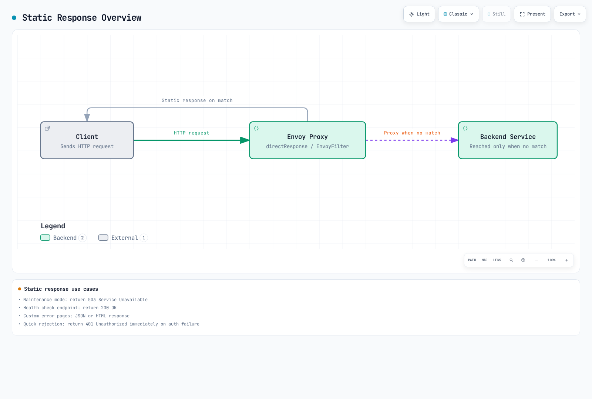

# EnvoyFilter

> **Verification baseline**: Istio 1.31.0, Kubernetes 1.32–1.36; sidecars and Istio Envoy gateways
> **Last reviewed**: September 11, 2026

EnvoyFilter is an advanced feature that allows you to directly customize Envoy proxy configurations.

## Table of Contents

1. [Overview](#overview)
2. [Structure](#structure)
3. [Main Use Cases](#main-use-cases)
4. [X-Forwarded-For and Hop Settings](#x-forwarded-for-and-hop-settings)
5. [Static Response Configuration](#static-response-configuration)
6. [Practical Examples](#practical-examples)
7. [Best Practices](#best-practices)
8. [Troubleshooting](#troubleshooting)

## Overview

These are independent alternatives. Applying all examples to the same workload stacks filters, routes and policies. Confirm the actual namespaces, labels and listeners, merge with existing configuration, and verify generated Envoy configuration and request behavior in a test environment. EnvoyFilter depends on internal Envoy APIs and needs revalidation for each Istio upgrade; it is not supported on ambient waypoints.

With EnvoyFilter you can:
- Add/modify/delete custom headers
- Rate Limiting
- External Authorization
- WASM plugin integration

## Structure

```yaml
apiVersion: networking.istio.io/v1alpha3
kind: EnvoyFilter
metadata:
  name: custom-filter
  namespace: default
spec:
  workloadSelector:
    labels:
      app: myapp
  configPatches:
  - applyTo: HTTP_FILTER
    match:
      context: SIDECAR_OUTBOUND
      listener:
        filterChain:
          filter:
            name: "envoy.filters.network.http_connection_manager"
            subFilter:
              name: envoy.filters.http.router
    patch:
      operation: INSERT_BEFORE
      value:
        name: envoy.filters.http.lua
        typed_config:
          "@type": type.googleapis.com/envoy.extensions.filters.http.lua.v3.Lua
          default_source_code:
            inline_string: |
              function envoy_on_request(request_handle)
                request_handle:headers():replace("x-custom-header", "value")
              end
```

## Main Use Cases

### 1. Adding Custom Headers

```yaml
apiVersion: networking.istio.io/v1alpha3
kind: EnvoyFilter
metadata:
  name: add-header
  namespace: default
spec:
  workloadSelector:
    labels:
      app: myapp
  configPatches:
  - applyTo: HTTP_FILTER
    match:
      context: SIDECAR_OUTBOUND
      listener:
        filterChain:
          filter:
            name: envoy.filters.network.http_connection_manager
            subFilter:
              name: envoy.filters.http.router
    patch:
      operation: INSERT_BEFORE
      value:
        name: envoy.filters.http.lua
        typed_config:
          "@type": type.googleapis.com/envoy.extensions.filters.http.lua.v3.Lua
          default_source_code:
            inline_string: |
              function envoy_on_request(request_handle)
                request_handle:headers():replace("x-client-service", "myapp")
              end
```

### 2. Rate Limiting

```yaml
apiVersion: networking.istio.io/v1alpha3
kind: EnvoyFilter
metadata:
  name: ratelimit
  namespace: default
spec:
  workloadSelector:
    labels:
      app: api-service
  configPatches:
  - applyTo: HTTP_FILTER
    match:
      context: SIDECAR_INBOUND
      listener:
        filterChain:
          filter:
            name: envoy.filters.network.http_connection_manager
            subFilter:
              name: envoy.filters.http.router
    patch:
      operation: INSERT_BEFORE
      value:
        name: envoy.filters.http.local_ratelimit
        typed_config:
          "@type": type.googleapis.com/envoy.extensions.filters.http.local_ratelimit.v3.LocalRateLimit
          stat_prefix: http_local_rate_limiter
          token_bucket:
            max_tokens: 100
            tokens_per_fill: 10
            fill_interval: 1s
          filter_enabled:
            default_value: {numerator: 100, denominator: HUNDRED}
          filter_enforced:
            default_value: {numerator: 100, denominator: HUNDRED}
```

This is a **per-proxy-process** bucket with an initial burst of 100 and refill of 10 tokens/second, not a global limit across replicas. Explicit enable/enforce fractions activate rejection.

### 3. WASM Plugin

```yaml
apiVersion: networking.istio.io/v1alpha3
kind: EnvoyFilter
metadata:
  name: wasm-filter
  namespace: default
spec:
  workloadSelector:
    labels:
      app: myapp
  configPatches:
  - applyTo: HTTP_FILTER
    match:
      context: SIDECAR_INBOUND
      listener:
        filterChain:
          filter:
            name: envoy.filters.network.http_connection_manager
            subFilter:
              name: envoy.filters.http.router
    patch:
      operation: INSERT_BEFORE
      value:
        name: envoy.filters.http.wasm
        typed_config:
          "@type": type.googleapis.com/envoy.extensions.filters.http.wasm.v3.Wasm
          config:
            vm_config:
              runtime: "envoy.wasm.runtime.v8"
              code:
                local:
                  filename: "/var/local/lib/wasm-filters/my_plugin.wasm"
```

The local Wasm example assumes a compatible module already mounted at that path in the proxy container through a read-only volume. An application-container file is not automatically visible and this YAML does not download the module. Validate module/ABI/runtime and failure behavior; prefer the [WasmPlugin API](https://istio.io/latest/docs/reference/config/proxy_extensions/wasm-plugin/) for distribution.

## X-Forwarded-For and Hop Settings

### X-Forwarded-For Overview

An HTTP proxy normally appends the address of **the client connected to it**, not its own address. With ALB's default `append` mode, the Gateway receives `203.0.113.5` for a direct client, or `203.0.113.5, 192.0.2.20` through CloudFront. The Gateway's direct peer is the ALB. These documentation addresses are not actual CloudFront IP ranges.

### XFF Configuration Options

Prefer the official [gateway topology configuration](https://istio.io/latest/docs/ops/configuration/traffic-management/network-topologies/) with `gatewayTopology.numTrustedProxies`. Merge this **Pod-template fragment** into the existing ingress Deployment, restart the affected Gateway Pods and inspect the effective configuration.

```yaml
# Existing ingress Deployment: spec.template fragment, not a complete Deployment
metadata:
  annotations:
    proxy.istio.io/config: |
      gatewayTopology:
        numTrustedProxies: 1
```

The lower-level alternative is this EnvoyFilter. Do not configure conflicting values through both mechanisms. Verify the actual ingress namespace and `istio: ingressgateway` Pod label.

```yaml
apiVersion: networking.istio.io/v1alpha3
kind: EnvoyFilter
metadata:
  name: gateway-xff-config
  namespace: istio-system
spec:
  workloadSelector:
    labels:
      istio: ingressgateway
  configPatches:
  - applyTo: NETWORK_FILTER
    match:
      context: GATEWAY
      listener:
        filterChain:
          filter:
            name: envoy.filters.network.http_connection_manager
    patch:
      operation: MERGE
      value:
        name: envoy.filters.network.http_connection_manager
        typed_config:
          "@type": type.googleapis.com/envoy.extensions.filters.network.http_connection_manager.v3.HttpConnectionManager
          use_remote_address: true
          xff_num_trusted_hops: 1
          skip_xff_append: false
          via: istio-gateway
```

| Option | Meaning |
|---|---|
| `use_remote_address: true`, hops 0 | Use the direct connection peer |
| `true`, hops N>0 | Use the **Nth address from the right in the received XFF** |
| `false`, hops N | Use the N+1th address from the right |
| Too few XFF addresses | Fall back to the direct peer; this does not imply access is allowed |
| `skip_xff_append: true` | Skip appending to XFF here; separate from address selection |
| `via` | Add a Via identifier to requests/responses; not authentication |

Do not set `use_remote_address: false` merely because a service is internal: this can trust caller-supplied XFF. Inspect actual connections and header transformations first. The Gateway's decision is **a property of its own request stream**; it does not automatically become the backend Envoy's trusted `remote.ip`.

### Scenario-specific Settings

These values assume `use_remote_address: true`, every HTTP proxy appends its connection peer, and bypass paths are blocked.

| Path | XFF received by Gateway | Direct peer | Trusted hops |
|---|---|---|---|
| Client → ALB → Gateway | `203.0.113.5` | ALB | 1 |
| Client → CloudFront → ALB → Gateway | `203.0.113.5, 192.0.2.20` | ALB | 2 |
| Client → CloudFront → NLB → ALB → Gateway | Same, when the NLB ALB-target setup preserves the client address | ALB | 2 |
| Client → Gateway directly | Arbitrary caller-supplied value | Client | 0 |

NLB operates at L4 and does not edit XFF. This does not mean every NLB configuration preserves the original socket address. Verify target type, supported listener/target ports, address preservation and the actual headers received. ALB `preserve`/`remove` modes, additional CDNs, PROXY protocol or alternate paths require separate analysis.

### Real Client IP Extraction Example

Do not parse the leftmost XFF value as trusted. At the Gateway with the trust boundary configured above, use Envoy's computed address for diagnostics. The Lua API returns a **string**, possibly including IPv6/port notation, not an address object.

```yaml
apiVersion: networking.istio.io/v1alpha3
kind: EnvoyFilter
metadata:
  name: gateway-client-address
  namespace: istio-system
spec:
  workloadSelector:
    labels:
      istio: ingressgateway
  configPatches:
  - applyTo: HTTP_FILTER
    match:
      context: GATEWAY
      listener:
        filterChain:
          filter:
            name: envoy.filters.network.http_connection_manager
            subFilter:
              name: envoy.filters.http.router
    patch:
      operation: INSERT_BEFORE
      value:
        name: envoy.filters.http.lua
        typed_config:
          "@type": type.googleapis.com/envoy.extensions.filters.http.lua.v3.Lua
          default_source_code:
            inline_string: |
              function envoy_on_request(handle)
                local address = handle:streamInfo():downstreamRemoteAddress()
                handle:headers():replace("x-client-address", address)
              end
```

`x-client-address` is not application authentication. Use it for diagnostics only when the trusted gateway overwrites it and direct backend access is prevented. Define privacy and retention limits for address/header logs.

### Selective Per-App IP Restriction (Gateway + AuthorizationPolicy)

Enforce external IP restrictions **at the Gateway that determines the original IP**, scoped by HTTP Host for Apps F/G. Apps A–E do not match this DENY rule. Existing mesh/namespace/Gateway policies and application authentication still apply; the absence of an app-specific policy file does not guarantee access.

```yaml
apiVersion: security.istio.io/v1
kind: AuthorizationPolicy
metadata:
  name: restricted-app-ingress
  namespace: istio-system
spec:
  selector:
    matchLabels:
      istio: ingressgateway
  action: DENY
  rules:
  - from:
    - source:
        notRemoteIpBlocks: ["203.0.113.0/24"]
    to:
    - operation:
        hosts:
        - "app-f.example.com"
        - "app-f.example.com:*"
        - "app-g.example.com"
        - "app-g.example.com:*"
```

The Gateway must terminate HTTP and route each Host to the intended app.Use a dedicated HTTP-terminating Gateway. For mixed TCP-passthrough listeners, constrain the policy to verified workload ports; missing HTTP attributes can match a DENY rule. Review aliases, wildcard hosts and other routes that could expose F/G. Protect backends separately against bypass, for example with mTLS and an AuthorizationPolicy permitting the actual Gateway service account. IP restrictions do not replace user authentication.

### XFF-based IP Access Control

The following examples are independent alternatives for a **dedicated API Gateway**. Once any ALLOW policy selects a workload, a request needs a matching ALLOW rule. Multiple ALLOW policies are additive; do not stack these on a shared Gateway without accounting for its other apps.

#### 1. IP Allow List and Deny List

```yaml
apiVersion: security.istio.io/v1
kind: AuthorizationPolicy
metadata:
  name: api-ip-allowlist
  namespace: istio-system
spec:
  selector:
    matchLabels:
      istio: ingressgateway
  action: ALLOW
  rules:
  - from:
    - source:
        remoteIpBlocks: ["203.0.113.10/32", "203.0.113.11/32", "2001:db8:1234::/48"]
    to:
    - operation:
        hosts: ["api.example.com", "api.example.com:*"]
---
apiVersion: security.istio.io/v1
kind: AuthorizationPolicy
metadata:
  name: api-ip-denylist
  namespace: istio-system
spec:
  selector:
    matchLabels:
      istio: ingressgateway
  action: DENY
  rules:
  - from:
    - source:
        remoteIpBlocks: ["203.0.113.11/32"]
    to:
    - operation:
        hosts: ["api.example.com", "api.example.com:*"]
```

The allowed address `203.0.113.11` is still rejected by DENY. Istio evaluates CUSTOM, DENY, then ALLOW; AUDIT does not change the decision. Choose `remoteIpBlocks` for original addresses derived from trusted XFF/PROXY protocol, and `ipBlocks` for the received packet source, according to the real connection.

#### 2. IP + Path + Method

```yaml
apiVersion: security.istio.io/v1
kind: AuthorizationPolicy
metadata:
  name: api-path-ip-policy
  namespace: istio-system
spec:
  selector:
    matchLabels:
      istio: ingressgateway
  action: ALLOW
  rules:
  - from:
    - source:
        remoteIpBlocks: ["203.0.113.10/32"]
    to:
    - operation:
        hosts: ["api.example.com", "api.example.com:*"]
        paths: ["/admin", "/admin/*"]
  - from:
    - source:
        remoteIpBlocks: ["10.0.0.0/8"]
    to:
    - operation:
        hosts: ["api.example.com", "api.example.com:*"]
        paths: ["/api/v1/*"]
        methods: ["GET"]
  - to:
    - operation:
        hosts: ["api.example.com", "api.example.com:*"]
        paths: ["/api/v1/public/*"]
        methods: ["GET", "POST"]
```

Protect both `/admin` and `/admin/*`. Omitting the source condition on the public route covers IPv6 as well as IPv4. The `10.0.0.0/8` rule is meaningful only on a private-client path where that address is actually observed; it cannot recover an address hidden behind internet NAT.

### XFF Verification and Debugging

```bash
# Local CLI reads the effective gateway configuration; no curl binary in proxy required.
istioctl proxy-config listeners <gateway-pod> -n istio-system -o json |
  jq '.. | objects |
      select(.["@type"]? == "type.googleapis.com/envoy.extensions.filters.network.http_connection_manager.v3.HttpConnectionManager") |
      {useRemoteAddress, xffNumTrustedHops, skipXffAppend}'

# Through the real ALB/CDN path, from a source outside the allowed NAT range:
curl -i https://app-f.example.com/
curl -i -H "X-Forwarded-For: 203.0.113.10" https://app-f.example.com/
# Both must be denied. A user-supplied header must not grant access.

# Run this separately from the real approved NAT egress:
curl -i https://app-f.example.com/

kubectl get authorizationpolicy -n istio-system
kubectl logs -n istio-system <gateway-pod> -c istio-proxy
```

Prepending an allowed IP to XFF from a disallowed source must still fail. Test allowed access from the actual approved NAT egress. A direct-Gateway request that succeeds with a forged header demonstrates bypass, not successful validation. Also test IPv6, missing/short XFF, direct Gateway access, Host aliases and alternate routes.

Distinguish `%DOWNSTREAM_DIRECT_REMOTE_ADDRESS%` (socket peer), `%DOWNSTREAM_REMOTE_ADDRESS%` (computed address), `%REQ(X-FORWARDED-FOR)%` and `%RESPONSE_CODE_DETAILS%` in access logs. Enable logs with Telemetry and configure format in the selected mesh access-log provider; see [ProxyConfig and observability settings](#envoy-configuration-with-proxyconfig).

### Security Considerations

Restrict each downstream hop to **the actual trusted proxy**, such as ALB → Gateway and CloudFront → ALB, with security groups/network and origin-access controls. A hop count does not authenticate the sender; `use_remote_address: true` alone does not prevent spoofing. Removing a header later in Lua does not undo a previously computed address or an earlier authorization decision.

## Static Response Configuration

You can return static responses directly without going through backend services for specific requests. This is useful for maintenance mode, error pages, health check responses, etc.

### Static Response Overview



[🔍 View interactive diagram](https://www.atomai.click/kubernetes-docs/archmaps/en-service-mesh-istio-advanced-03-envoy-filter-7.html)

### Use Cases

1. **Maintenance mode**: Return 503 Service Unavailable
2. **Health check endpoint**: Return 200 OK
3. **Custom error pages**: JSON or HTML error responses
4. **Test/mock responses**: Predefined responses for specific paths
5. **Quick rejection**: Return 401 Unauthorized immediately on auth failure

### Implementation Method Selection Guide

Istio provides several ways to implement static responses:

| Method | When to use | Pros | Cons |
|------|----------|------|------|
| **VirtualService** | Simple static responses, integrate with routing rules | Declarative, easy to understand | Limited customization |
| **AuthorizationPolicy** | IP/header based access control | Integrates with security policies | Not just for static responses |
| **EnvoyFilter** | Only when above methods are insufficient | Maximum flexibility | Complex, upgrade risk |

**Recommendation**: Use **VirtualService** and **AuthorizationPolicy** first when possible, use EnvoyFilter only when necessary

### Implementing Static Responses with VirtualService

#### 1. Basic Static Response (directResponse)

The timestamp is a fixed example string, not the current clock. Check the response-body limit in the generated route configuration. Istio 1.31 sets a 1 MiB limit for these outbound VirtualService routes; unmodified Envoy defaults to 4 KiB. Large static bodies consume proxy memory. These mesh-outbound VirtualServices are independent alternatives; do not stack them for the same host.

```yaml
apiVersion: networking.istio.io/v1
kind: VirtualService
metadata:
  name: api-service
  namespace: default
spec:
  hosts:
  - api-service
  http:
  # Maintenance mode
  - match:
    - uri:
        exact: "/api/v1"
    - uri:
        prefix: "/api/v1/"
    directResponse:
      status: 503
      body:
        string: |
          {
            "error": {
              "code": "SERVICE_UNAVAILABLE",
              "message": "The service is currently under maintenance",
              "timestamp": "2025-11-26T10:00:00Z",
              "retry_after": 3600
            }
          }
    headers:
      response:
        set:
          content-type: "application/json"
          retry-after: "3600"
```

**Result**:
```text
$ curl -i http://api-service/api/v1/users
HTTP/1.1 503 Service Unavailable
content-type: application/json
retry-after: 3600

{
  "error": {
    "code": "SERVICE_UNAVAILABLE",
    "message": "The service is currently under maintenance",
    "timestamp": "2025-11-26T10:00:00Z",
    "retry_after": 3600
  }
}
```

#### 2. Health Check Endpoint

A static 200 checks only proxy routing. Use a real backend probe when Kubernetes readiness or ALB target health must reflect application health.

```yaml
apiVersion: networking.istio.io/v1
kind: VirtualService
metadata:
  name: api-service-health
  namespace: default
spec:
  hosts:
  - api-service
  http:
  # Health check path
  - match:
    - uri:
        exact: "/health"
    directResponse:
      status: 200
      body:
        string: "OK"

  # Normal traffic
  - route:
    - destination:
        host: api-service
    retries:
      attempts: 0
```

#### 3. Block Specific Paths

```yaml
apiVersion: networking.istio.io/v1
kind: VirtualService
metadata:
  name: block-admin
  namespace: default
spec:
  hosts:
  - api-service
  http:
  # Block Admin paths
  - match:
    - uri:
        exact: "/admin"
    - uri:
        prefix: "/admin/"
    directResponse:
      status: 403
      body:
        string: |
          {
            "error": "Access to admin endpoints is forbidden"
          }
    headers:
      response:
        set:
          content-type: "application/json"

  # Normal traffic
  - route:
    - destination:
        host: api-service
    retries:
      attempts: 0
```

#### 4. Error Simulation with Fault Injection

```yaml
apiVersion: networking.istio.io/v1
kind: VirtualService
metadata:
  name: fault-injection
  namespace: default
spec:
  hosts:
  - api-service
  http:
  - fault:
      abort:
        httpStatus: 503
        percentage:
          value: 100  # Apply to 100% traffic
    route:
    - destination:
        host: api-service
    retries:
      attempts: 0
```

### Access Control with AuthorizationPolicy

`ipBlocks` evaluates the received packet source. This may be the original client with a source-preserving L4 ingress, or a proxy/NAT behind ALB or another intermediary. For XFF-derived addresses, use the Gateway `remoteIpBlocks` examples above. A selected ALLOW policy already rejects requests that do not match; a duplicate complementary DENY is unnecessary.

#### Custom Deny Response

This standardizes **all HTTP 403 responses generated locally by this Gateway**. It does not rewrite backend 403 responses or every TCP rejection. Use a generic `FORBIDDEN` code instead of inferring IP denial from body text. A later Lua filter may never run when an earlier RBAC filter rejects a request; use HCM `local_reply_config` and review the order/scope when merging existing mappers.

```yaml
apiVersion: networking.istio.io/v1alpha3
kind: EnvoyFilter
metadata:
  name: custom-local-forbidden
  namespace: istio-system
spec:
  workloadSelector:
    labels:
      istio: ingressgateway
  configPatches:
  - applyTo: NETWORK_FILTER
    match:
      context: GATEWAY
      listener:
        filterChain:
          filter:
            name: envoy.filters.network.http_connection_manager
    patch:
      operation: MERGE
      value:
        name: envoy.filters.network.http_connection_manager
        typed_config:
          "@type": type.googleapis.com/envoy.extensions.filters.network.http_connection_manager.v3.HttpConnectionManager
          local_reply_config:
            mappers:
            - filter:
                status_code_filter:
                  comparison:
                    op: EQ
                    value:
                      default_value: 403
                      runtime_key: local_reply_403
              body_format_override:
                json_format:
                  error: "Access denied"
                  code: "FORBIDDEN"
```

### Envoy Configuration with ProxyConfig

The `networking.istio.io` ProxyConfig resource has different fields from the mesh `ProxyConfig` message. It exposes options such as `concurrency`, `environmentVariables` and `image`; arbitrary logging, tracing and connection-pool fields are invalid. Changes require restarting affected Pods.

#### Workload Threads and Observability

```yaml
apiVersion: networking.istio.io/v1beta1
kind: ProxyConfig
metadata:
  name: api-service-config
  namespace: default
spec:
  selector:
    matchLabels:
      app: api-service
  concurrency: 4
---
apiVersion: telemetry.istio.io/v1
kind: Telemetry
metadata:
  name: api-observability
  namespace: default
spec:
  selector:
    matchLabels:
      app: api-service
  accessLogging:
  - providers:
    - name: envoy
  tracing:
  - providers:
    - name: otel-tracing
    randomSamplingPercentage: 1
```

The `envoy` access-log and `otel-tracing` trace providers must already exist in mesh extensionProviders. Configure log format/output and OTLP endpoint/TLS there. `concurrency: 4` requests four worker threads; check CPU capacity and load. A 1% head-sampling setting does not guarantee complete trace retention.

#### Statistics and Shutdown Grace

```yaml
# Existing application Deployment: spec.template fragment
metadata:
  annotations:
    proxy.istio.io/config: |
      terminationDrainDuration: 5s
      proxyStatsMatcher:
        inclusionRegexps:
        - ".*outlier_detection.*"
        - ".*upstream_rq_retry.*"
        inclusionSuffixes:
        - upstream_rq_timeout
```

Merge into the existing application Deployment Pod template and restart affected Pods. The Kubernetes termination grace period must accommodate application shutdown and proxy draining. Additional Envoy statistics increase series count and memory costs.

#### Destination Connection Pool

```yaml
apiVersion: networking.istio.io/v1
kind: DestinationRule
metadata:
  name: api-outbound-pool
  namespace: default
spec:
  host: api-service.default.svc.cluster.local
  trafficPolicy:
    connectionPool:
      tcp:
        connectTimeout: 10s
        maxConnections: 10000
```

These are per-proxy outbound connection settings for this destination, not a Gateway-wide concurrent-request limit or application timeout. Validate the example limits under load.

### Integrated Example: VirtualService + AuthorizationPolicy

An independent **HTTP lab fragment**. It requires an existing ingress Gateway Deployment/Service exposing port 80, `default/api-service` on Service port 8080 with healthy endpoints, working DNS/ALB routing and the validated XFF trust configuration above. External use also needs a reviewed TLS boundary and backend bypass protection. Deployment and production-load testing have not been performed for this fragment.

Authorization and routing are evaluated at the same Gateway. Public, health and retired paths are explicitly allowed; other unmatched paths are denied. `/health` proves only proxy-route reachability, not application/database health. Mesh retries are 0 on the general route, which may carry writes.

```yaml
apiVersion: networking.istio.io/v1
kind: Gateway
metadata:
  name: api-lab
  namespace: istio-system
spec:
  selector:
    istio: ingressgateway
  servers:
  - port:
      number: 80
      name: http
      protocol: HTTP
    hosts: ["api.example.com"]
---
apiVersion: security.istio.io/v1
kind: AuthorizationPolicy
metadata:
  name: api-access-control
  namespace: istio-system
spec:
  selector:
    matchLabels:
      istio: ingressgateway
  action: ALLOW
  rules:
  - from:
    - source:
        remoteIpBlocks: ["203.0.113.10/32"]
    to:
    - operation:
        hosts: ["api.example.com", "api.example.com:*"]
        paths: ["/api/v1/admin", "/api/v1/admin/*"]
  - to:
    - operation:
        hosts: ["api.example.com", "api.example.com:*"]
        paths: ["/health", "/api/v0/*", "/api/v1/public/*"]
---
apiVersion: networking.istio.io/v1
kind: VirtualService
metadata:
  name: api-service-routes
  namespace: default
spec:
  hosts: ["api.example.com"]
  gateways: ["istio-system/api-lab"]
  http:
  - match:
    - uri:
        exact: /health
    directResponse:
      status: 200
      body:
        string: '{"status":"proxy-route-reachable"}'
    headers:
      response:
        set:
          content-type: application/json
          cache-control: no-store
  - match:
    - uri:
        prefix: /api/v0/
    directResponse:
      status: 410
      body:
        string: '{"error":"API v0 is retired","supported_versions":["v1","v2"]}'
    headers:
      response:
        set:
          content-type: application/json
          cache-control: no-store
  - route:
    - destination:
        host: api-service.default.svc.cluster.local
        port:
          number: 8080
    timeout: 30s
    retries:
      attempts: 0
```

### Dynamic Static Responses with Lua

Lua scripts can dynamically generate static responses based on conditions.

#### Automatic Maintenance Window Detection

```yaml
apiVersion: networking.istio.io/v1alpha3
kind: EnvoyFilter
metadata:
  name: maintenance-window
  namespace: default
spec:
  workloadSelector:
    labels:
      app: api-service
  configPatches:
  - applyTo: HTTP_FILTER
    match:
      context: SIDECAR_INBOUND
      listener:
        filterChain:
          filter:
            name: "envoy.filters.network.http_connection_manager"
            subFilter:
              name: "envoy.filters.http.router"
    patch:
      operation: INSERT_BEFORE
      value:
        name: envoy.filters.http.lua
        typed_config:
          "@type": type.googleapis.com/envoy.extensions.filters.http.lua.v3.Lua
          default_source_code:
            inline_string: |
              local function is_maintenance(hour)
                return hour >= 2 and hour < 4
              end

              function envoy_on_request(request_handle)
                -- Current time (UTC)
                local current_hour = tonumber(os.date("!%H"))

                -- Daily maintenance window 2-4 AM
                if is_maintenance(current_hour) then
                  request_handle:respond(
                    {[":status"] = "503",
                     ["content-type"] = "application/json",
                     ["retry-after"] = "60",
                     ["cache-control"] = "no-store"},
                    '{"error": "Maintenance in progress", "window": "02:00-04:00 UTC"}'
                  )
                end
              end
```

#### Request Header Based Response

```yaml
apiVersion: networking.istio.io/v1alpha3
kind: EnvoyFilter
metadata:
  name: header-based-response
  namespace: default
spec:
  workloadSelector:
    labels:
      app: api-service
  configPatches:
  - applyTo: HTTP_FILTER
    match:
      context: SIDECAR_INBOUND
      listener:
        filterChain:
          filter:
            name: "envoy.filters.network.http_connection_manager"
            subFilter:
              name: "envoy.filters.http.router"
    patch:
      operation: INSERT_BEFORE
      value:
        name: envoy.filters.http.lua
        typed_config:
          "@type": type.googleapis.com/envoy.extensions.filters.http.lua.v3.Lua
          default_source_code:
            inline_string: |
              function envoy_on_request(request_handle)
                local api_version = request_handle:headers():get("x-api-version")

                -- Unsupported API version
                if api_version and api_version == "v1" then
                  request_handle:respond(
                    {[":status"] = "410",
                     ["content-type"] = "application/json"},
                    '{"error": "API v1 is deprecated", "supported_versions": ["v2", "v3"]}'
                  )
                end
              end
```

### Integration with VirtualService

A single `directResponse` can set the maintenance status and body. A destination-side Lua filter cannot rewrite a fault already generated by the source-side VirtualService, and response headers do not contain the request `:path`. This is an independent mesh-outbound example, not authorization. For ingress, explicitly bind the gateway and external host as in the previous example.

```yaml
apiVersion: networking.istio.io/v1
kind: VirtualService
metadata:
  name: maintenance-response
  namespace: default
spec:
  hosts: ["api-service"]
  http:
  - match:
    - uri:
        exact: /maintenance
    - uri:
        prefix: /maintenance/
    directResponse:
      status: 503
      body:
        string: '{"message":"Service under maintenance"}'
    headers:
      response:
        set:
          content-type: application/json
          cache-control: no-store
          retry-after: "60"
  - route:
    - destination:
        host: api-service
    retries:
      attempts: 0
```

### Practical Scenarios

#### Scenario 1: Block Traffic During Blue/Green Deployment

This intentionally changes every inbound HTTP route on the selected v1 workload to 503. It does not implement a zero-downtime cutover or connection drain. Protobuf `MERGE` changes the Route action oneof to direct_response; it does not control earlier filter rejections or TCP paths. The cutoff_date is a fixed example value to replace with the actual deployment schedule.

```yaml
apiVersion: networking.istio.io/v1alpha3
kind: EnvoyFilter
metadata:
  name: deployment-block
  namespace: production
spec:
  workloadSelector:
    labels:
      app: api-service
      version: v1  # Block only old version
  configPatches:
  - applyTo: HTTP_ROUTE
    match:
      context: SIDECAR_INBOUND
    patch:
      operation: MERGE
      value:
        direct_response:
          status: 503
          body:
            inline_string: |
              {
                "message": "This version is being deprecated",
                "migration": {
                  "new_endpoint": "https://api-v2.example.com",
                  "cutoff_date": "2025-12-31"
                }
              }
        response_headers_to_add:
        - header:
            key: "Content-Type"
            value: "application/json"
        - header:
            key: "X-Migration-Required"
            value: "true"
```

#### Scenario 2: 429 Response on Rate Limit Exceeded

```yaml
apiVersion: networking.istio.io/v1alpha3
kind: EnvoyFilter
metadata:
  name: ratelimit-response
  namespace: default
spec:
  workloadSelector:
    labels:
      app: api-service
  configPatches:
  # Rate Limit filter
  - applyTo: HTTP_FILTER
    match:
      context: SIDECAR_INBOUND
      listener:
        filterChain:
          filter:
            name: "envoy.filters.network.http_connection_manager"
            subFilter:
              name: "envoy.filters.http.router"
    patch:
      operation: INSERT_BEFORE
      value:
        name: envoy.filters.http.local_ratelimit
        typed_config:
          "@type": type.googleapis.com/envoy.extensions.filters.http.local_ratelimit.v3.LocalRateLimit
          stat_prefix: http_local_rate_limiter
          token_bucket:
            max_tokens: 100
            tokens_per_fill: 10
            fill_interval: 1s
          filter_enabled:
            runtime_key: local_rate_limit_enabled
            default_value:
              numerator: 100
              denominator: HUNDRED
          filter_enforced:
            runtime_key: local_rate_limit_enforced
            default_value:
              numerator: 100
              denominator: HUNDRED
          local_rate_limit_per_downstream_connection: false
          # Custom 429 response
          status:
            code: 429
          response_headers_to_add:
          - header:
              key: x-local-rate-limit
              value: "true"
            append_action: OVERWRITE_IF_EXISTS_OR_ADD
```

```yaml
apiVersion: networking.istio.io/v1alpha3
kind: EnvoyFilter
metadata:
  name: local-rate-limit-json
  namespace: default
spec:
  workloadSelector:
    labels:
      app: api-service
  configPatches:
  - applyTo: NETWORK_FILTER
    match:
      context: SIDECAR_INBOUND
      listener:
        filterChain:
          filter:
            name: envoy.filters.network.http_connection_manager
    patch:
      operation: MERGE
      value:
        name: envoy.filters.network.http_connection_manager
        typed_config:
          "@type": type.googleapis.com/envoy.extensions.filters.network.http_connection_manager.v3.HttpConnectionManager
          local_reply_config:
            mappers:
            - filter:
                status_code_filter:
                  comparison:
                    op: EQ
                    value:
                      default_value: 429
                      runtime_key: local_reply_429
              body_format_override:
                json_format:
                  error: "Too many requests"
                  code: "RATE_LIMIT_EXCEEDED"
```

Both resources select the same workload. The mapper formats locally generated 429 responses as JSON; upstream 429 responses are unchanged. Token refill does not guarantee when every caller's retry will succeed, so no arbitrary `Retry-After: 60` is emitted.

#### Scenario 3: Canary Deployment Test Response

Use only on an isolated test workload. A caller can supply this header; the resulting200 proves neither authentication, backend execution nor version health. Any operational exposure needs separately validated authorization and header trust.

```yaml
apiVersion: networking.istio.io/v1alpha3
kind: EnvoyFilter
metadata:
  name: canary-test-response
  namespace: default
spec:
  workloadSelector:
    labels:
      app: api-service
      version: canary
  configPatches:
  - applyTo: HTTP_FILTER
    match:
      context: SIDECAR_INBOUND
      listener:
        filterChain:
          filter:
            name: "envoy.filters.network.http_connection_manager"
            subFilter:
              name: "envoy.filters.http.router"
    patch:
      operation: INSERT_BEFORE
      value:
        name: envoy.filters.http.lua
        typed_config:
          "@type": type.googleapis.com/envoy.extensions.filters.http.lua.v3.Lua
          default_source_code:
            inline_string: |
              function envoy_on_request(request_handle)
                local test_header = request_handle:headers():get("x-canary-test")

                -- Return predefined response if canary test header present
                if test_header == "dry-run" then
                  request_handle:respond(
                    {[":status"] = "200",
                     ["content-type"] = "application/json",
                     ["x-canary-version"] = "v2.0.0"},
                    '{"message": "Canary version response", "version": "v2.0.0"}'
                  )
                end
              end
```

### Testing and Verification

#### Static Response Testing

Use a test client whose traffic actually crosses the proxy implementing the selected example. `/health` or informational headers alone do not validate authentication/authorization.

```bash
curl -i http://api-service:8080/api/v1
curl -i http://api-service:8080/health
curl -i http://api-service:8080/admin
curl -i http://api-service:8080/admin/users
```

Test the maintenance predicate in an isolated Lua harness with UTC hours 1,2,3,4 and expect false,true,true,false. Do not change Pod/node clocks. For a real filter integration test, use a controlled test-time input or reviewed temporary function in an isolated environment, then restore the normal function.

For rate limiting, target one known proxy and measure the initial 100 tokens, refill of 10/second, elapsed time and actual 429 count together. A sequential 150-request curl loop does not guarantee 429. Replica count and load distribution require separate tests.

#### Verify Envoy Configuration

```bash
# 1. Verify static response route
istioctl proxy-config routes <pod-name> -n default -o json | \
  jq '.[] | .virtualHosts[]? | .routes[]? | select(.directResponse != null)'

# 2. Check full route configuration
istioctl proxy-config routes <pod-name> -n default

# 3. Verify EnvoyFilter applied
kubectl get envoyfilter -n default maintenance-window -o yaml

# 4. Verify via Envoy Admin API
kubectl port-forward -n default <pod-name> 15000:15000
# Run in a second local terminal while port-forward is active:
curl http://127.0.0.1:15000/config_dump | jq '.configs[] | select(.["@type"] == "type.googleapis.com/envoy.admin.v3.RoutesConfigDump")'
```

### Best Practices

1. **Clear error messages**:
   - Provide users with cause and solution
   - Specify retry time with `Retry-After` header

2. **Consistent error format**:
   - Use same JSON schema for all error responses
   - Maintain consistency between HTTP status codes and error codes

3. **Logging and monitoring**:
   - Log when returning static responses
   - Track static response frequency with metrics

4. **Gradual application**:
   - Apply gradually when switching to maintenance mode
   - Test with canary deployment before full application

5. **Rollback plan**:
   - Restore the reviewed configuration, then verify xDS acceptance, routes and requests
   - Automated rollback scripts for emergencies

### Cautions

1. **Priority**: Response behavior depends on the processing proxy, filter order and generated route
2. **Performance**: Lua scripts execute on every request, consider performance impact
3. **Security**: Be careful not to expose sensitive information in error messages
4. **Caching**: Static responses also need `Cache-Control` header settings
5. **Metrics**: Inspect response_code/details/flags and reporter; static replies need not create a separate metric family

## Practical Examples

### Example 1: Request/Response Logging

```yaml
apiVersion: networking.istio.io/v1alpha3
kind: EnvoyFilter
metadata:
  name: request-response-logging
  namespace: default
spec:
  workloadSelector:
    labels:
      app: api-service
  configPatches:
  - applyTo: HTTP_FILTER
    match:
      context: SIDECAR_INBOUND
      listener:
        filterChain:
          filter:
            name: envoy.filters.network.http_connection_manager
            subFilter:
              name: envoy.filters.http.router
    patch:
      operation: INSERT_BEFORE
      value:
        name: envoy.filters.http.lua
        typed_config:
          "@type": type.googleapis.com/envoy.extensions.filters.http.lua.v3.Lua
          default_source_code:
            inline_string: |
              function envoy_on_request(request_handle)
                request_handle:logInfo("Request method: " .. (request_handle:headers():get(":method") or "unknown"))
              end

              function envoy_on_response(response_handle)
                response_handle:logInfo("Response: " .. (response_handle:headers():get(":status") or "unknown"))
              end
```

### Example 2: JWT Validation

Use Istio RequestAuthentication with AuthorizationPolicy. Replace the example issuer/audience/JWKS URL with actual provider values and verify DNS/TLS/JWKS reachability from the verifier. RequestAuthentication alone accepts a missing token; the ALLOW policy requires a verified principal. Check that another ALLOW policy on this workload does not grant broader access.

```yaml
apiVersion: security.istio.io/v1
kind: RequestAuthentication
metadata:
  name: api-jwt
  namespace: default
spec:
  selector:
    matchLabels:
      app: api-service
  jwtRules:
  - issuer: https://issuer.example.com/
    audiences: ["api.example.com"]
    jwksUri: https://issuer.example.com/.well-known/jwks.json
---
apiVersion: security.istio.io/v1
kind: AuthorizationPolicy
metadata:
  name: api-require-jwt
  namespace: default
spec:
  selector:
    matchLabels:
      app: api-service
  action: ALLOW
  rules:
  - from:
    - source:
        requestPrincipals: ["*"]
```


## Best Practices

1. **Use workloadSelector**: Apply only to specific workloads
2. **Test environment first**: Sufficient testing before production
3. **Istio version compatibility**: Check API per version
4. **Performance monitoring**: Monitor performance after adding EnvoyFilter

## Troubleshooting

```bash
# Check EnvoyFilter
kubectl get envoyfilter -A

# Verify Envoy configuration
istioctl proxy-config listeners <pod-name> -n <namespace> -o json

# Check logs
kubectl logs -n <namespace> <pod-name> -c istio-proxy
```

## References

- [EnvoyFilter Reference](https://istio.io/latest/docs/reference/config/networking/envoy-filter/)
- [Envoy Documentation](https://www.envoyproxy.io/docs/envoy/latest/)
- [WASM Plugins](https://istio.io/latest/docs/concepts/wasm/)
- [XFF / trusted addresses](https://www.envoyproxy.io/docs/envoy/latest/configuration/http/http_conn_man/headers)
- [Istio ingress authorization](https://istio.io/latest/docs/tasks/security/authorization/authz-ingress/)
- [ALB X-Forwarded headers](https://docs.aws.amazon.com/elasticloadbalancing/latest/application/x-forwarded-headers.html)
- [CloudFront request behavior](https://docs.aws.amazon.com/AmazonCloudFront/latest/DeveloperGuide/RequestAndResponseBehaviorCustomOrigin.html)
- [NLB application-load-balancer targets](https://docs.aws.amazon.com/elasticloadbalancing/latest/network/application-load-balancer-target.html)
- [Lua filter API](https://www.envoyproxy.io/docs/envoy/latest/configuration/http/http_filters/lua_filter)
- [Local reply configuration](https://www.envoyproxy.io/docs/envoy/latest/configuration/http/http_conn_man/local_reply)
- [ProxyConfig resource](https://istio.io/latest/docs/reference/config/networking/proxy-config/)
- [Telemetry API](https://istio.io/latest/docs/reference/config/telemetry/)
- [Mesh ProxyConfig and statistics](https://istio.io/latest/docs/reference/config/istio.mesh.v1alpha1/)
- [RequestAuthentication](https://istio.io/latest/docs/reference/config/security/request_authentication/)
- [Istio 1.31 direct-response limit](https://raw.githubusercontent.com/istio/istio/1.31.0/pilot/pkg/networking/core/route/route.go)
