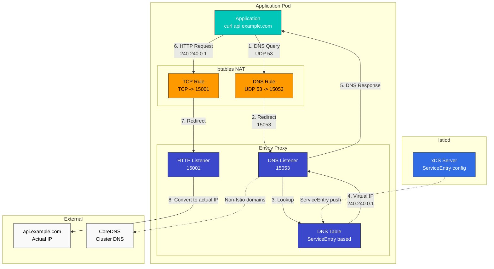
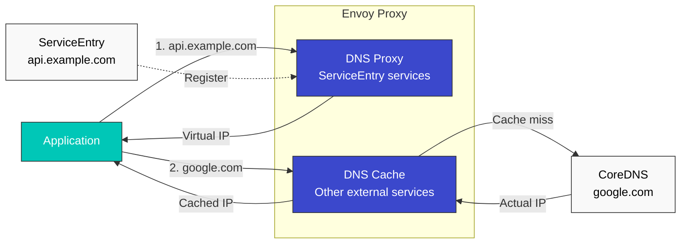
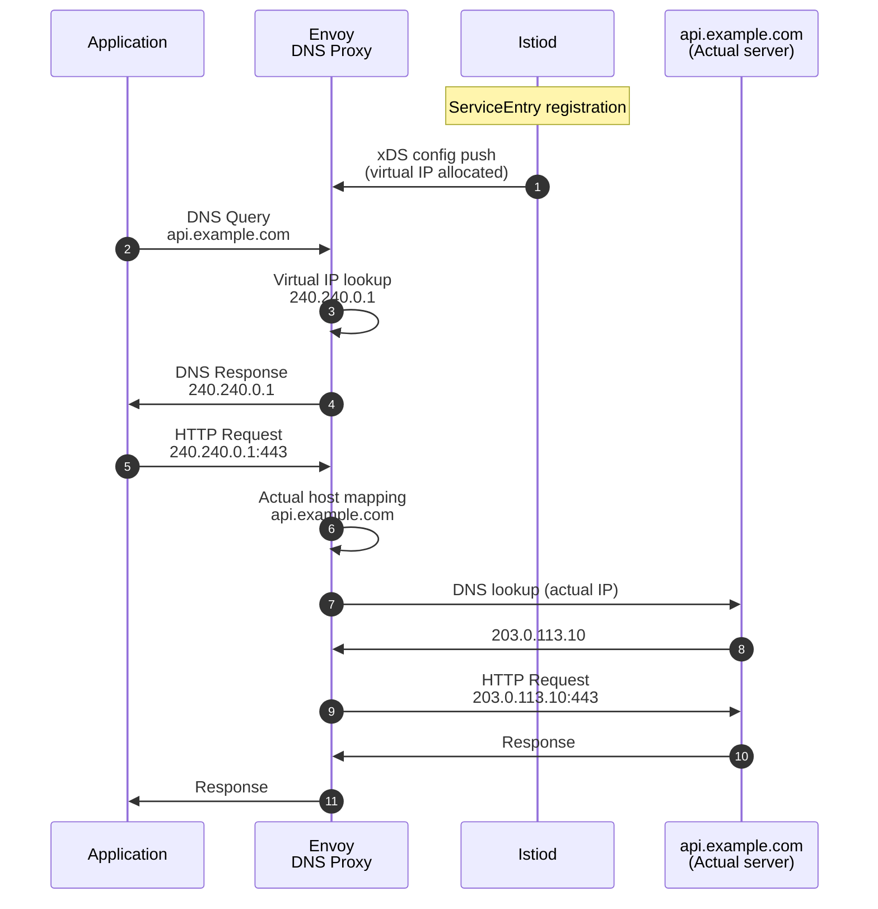
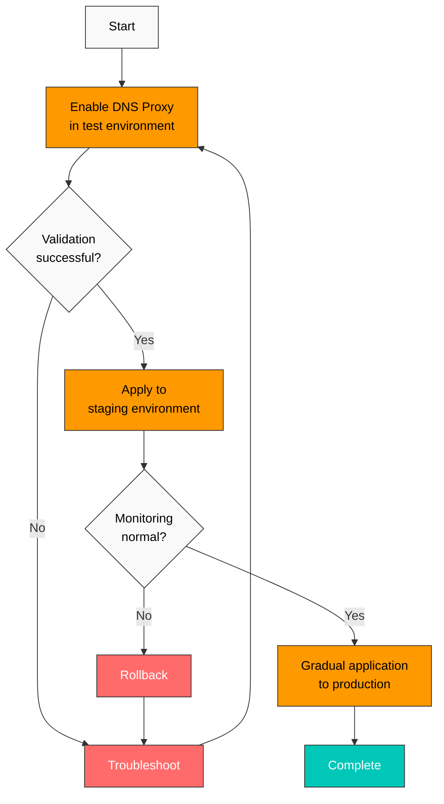

# DNS Proxy and DNS Caching

> **Supported Versions**: Istio 1.28+
> **Last Updated**: November 26, 2025

Optimize external service access performance and control DNS lookups through Istio's DNS management features.

## Table of Contents

1. [DNS Proxy Overview](#dns-proxy-overview)
2. [DNS Proxy vs DNS Caching](#dns-proxy-vs-dns-caching)
3. [DNS Proxy Configuration](#dns-proxy-configuration)
4. [ServiceEntry Integration](#serviceentry-integration)
5. [DNS Caching Configuration](#dns-caching-configuration)
6. [Automatic Address Allocation](#automatic-address-allocation)
7. [Troubleshooting](#troubleshooting)
8. [Best Practices](#best-practices)

## DNS Proxy Overview

Istio DNS Proxy is a feature where Envoy acts as a DNS server to intercept and process application DNS requests.

### Key Features

1. **DNS query interception**: Envoy processes DNS requests on UDP port 53
2. **ServiceEntry-based resolution**: Automatically generates DNS responses when external services are registered as ServiceEntry
3. **Automatic IP allocation**: Automatically allocates virtual IPs to external services
4. **CoreDNS bypass**: Reduces Kubernetes DNS server load

### Architecture



## DNS Proxy vs DNS Caching

These two features have different purposes and behaviors:

| Characteristic | DNS Proxy | DNS Caching |
|------|-----------|-------------|
| **Role** | Acts as DNS server | Caches DNS lookup results |
| **Behavior** | Intercepts DNS queries and responds directly | Stores results after external DNS lookup |
| **Configuration** | `ISTIO_META_DNS_CAPTURE` | `dns_refresh_rate` |
| **Target** | Services registered in ServiceEntry | All external DNS lookups |
| **IP allocation** | Automatic virtual IP allocation | Uses actual DNS response |
| **CoreDNS** | Can bypass | Still used |
| **Istio version** | 1.8+ | All versions |

### Combined Usage

Using both features together provides optimal performance:



## DNS Proxy Configuration

### 1. Global Enablement

Apply DNS Proxy to all namespaces:

```yaml
apiVersion: install.istio.io/v1alpha1
kind: IstioOperator
metadata:
  name: istio
  namespace: istio-system
spec:
  meshConfig:
    defaultConfig:
      proxyMetadata:
        # Enable DNS Proxy
        ISTIO_META_DNS_CAPTURE: "true"
        # Enable automatic IP allocation
        ISTIO_META_DNS_AUTO_ALLOCATE: "true"
```

### 2. Per-namespace Enablement

Enable only for specific namespace:

```yaml
apiVersion: v1
kind: Namespace
metadata:
  name: production
  labels:
    istio-injection: enabled
---
apiVersion: v1
kind: ConfigMap
metadata:
  name: istio-sidecar-injector
  namespace: istio-system
data:
  values: |
    global:
      proxy:
        holdApplicationUntilProxyStarts: true
    sidecarInjectorWebhook:
      templates:
        custom: |
          spec:
            containers:
            - name: istio-proxy
              env:
              - name: ISTIO_META_DNS_CAPTURE
                value: "true"
              - name: ISTIO_META_DNS_AUTO_ALLOCATE
                value: "true"
```

### 3. Per-pod Enablement

Enable only for specific pods:

```yaml
apiVersion: v1
kind: Pod
metadata:
  name: myapp
  annotations:
    proxy.istio.io/config: |
      proxyMetadata:
        ISTIO_META_DNS_CAPTURE: "true"
        ISTIO_META_DNS_AUTO_ALLOCATE: "true"
spec:
  containers:
  - name: app
    image: myapp:v1
```

### 4. iptables Rules Verification

When DNS Proxy is enabled, the following iptables rules are added:

```bash
# Enter pod
kubectl exec -it <pod-name> -c istio-proxy -- /bin/bash

# Check DNS redirect rules
iptables -t nat -L ISTIO_OUTPUT -n -v

# Expected output
Chain ISTIO_OUTPUT (1 references)
pkts bytes target     prot opt in     out     source               destination
   0     0 RETURN     udp  --  *      *       0.0.0.0/0            127.0.0.53           udp dpt:53
   0     0 REDIRECT   udp  --  *      *       0.0.0.0/0            0.0.0.0/0            udp dpt:53 redir ports 15053
```

## ServiceEntry Integration

DNS Proxy works closely integrated with ServiceEntry.

### Basic ServiceEntry

```yaml
apiVersion: networking.istio.io/v1
kind: ServiceEntry
metadata:
  name: external-api
  namespace: default
spec:
  hosts:
  - api.example.com
  ports:
  - number: 443
    name: https
    protocol: HTTPS
  location: MESH_EXTERNAL
  resolution: DNS
```

**DNS Proxy behavior**:
1. Application performs `api.example.com` DNS lookup
2. Envoy DNS Proxy returns virtual IP (e.g., `240.240.0.1`)
3. Application sends request to virtual IP
4. Envoy converts to actual IP and transmits

### Multiple Host Registration

```yaml
apiVersion: networking.istio.io/v1
kind: ServiceEntry
metadata:
  name: external-services
spec:
  hosts:
  - "*.example.com"  # Wildcard supported
  - api.partner.com
  - cdn.assets.com
  ports:
  - number: 443
    name: https
    protocol: HTTPS
  - number: 80
    name: http
    protocol: HTTP
  location: MESH_EXTERNAL
  resolution: DNS
```

### Explicit Endpoints

```yaml
apiVersion: networking.istio.io/v1
kind: ServiceEntry
metadata:
  name: external-database
spec:
  hosts:
  - database.external.com
  addresses:
  - 203.0.113.0/24  # External network range
  ports:
  - number: 3306
    name: mysql
    protocol: TCP
  location: MESH_EXTERNAL
  resolution: STATIC
  endpoints:
  - address: 203.0.113.10
  - address: 203.0.113.11
  - address: 203.0.113.12
```

## DNS Caching Configuration

DNS Caching improves external DNS lookup performance.

### Enable Envoy DNS Cache

```yaml
apiVersion: networking.istio.io/v1alpha3
kind: EnvoyFilter
metadata:
  name: dns-cache-filter
  namespace: istio-system
spec:
  configPatches:
  - applyTo: CLUSTER
    match:
      context: SIDECAR_OUTBOUND
      cluster:
        service: "*.example.com"
    patch:
      operation: MERGE
      value:
        dns_refresh_rate: 30s  # DNS cache refresh interval
        dns_lookup_family: V4_ONLY  # Use IPv4 only
        dns_failure_refresh_rate:
          base_interval: 5s  # Retry interval on failure
          max_interval: 30s
```

### Advanced DNS Cache Configuration

```yaml
apiVersion: networking.istio.io/v1alpha3
kind: EnvoyFilter
metadata:
  name: advanced-dns-cache
  namespace: istio-system
spec:
  configPatches:
  - applyTo: CLUSTER
    match:
      context: SIDECAR_OUTBOUND
    patch:
      operation: MERGE
      value:
        # DNS cache TTL settings
        dns_refresh_rate: 60s

        # DNS lookup timeout
        dns_query_timeout: 5s

        # IP version priority
        dns_lookup_family: AUTO  # Auto select IPv4/IPv6

        # Cache policy on failure
        dns_failure_refresh_rate:
          base_interval: 2s
          max_interval: 10s

        # Respect DNS TTL
        respect_dns_ttl: true
```

### Apply to Specific Services Only

```yaml
apiVersion: networking.istio.io/v1alpha3
kind: EnvoyFilter
metadata:
  name: api-dns-cache
  namespace: default
spec:
  workloadSelector:
    labels:
      app: frontend
  configPatches:
  - applyTo: CLUSTER
    match:
      cluster:
        service: api.external.com
    patch:
      operation: MERGE
      value:
        dns_refresh_rate: 30s
        dns_lookup_family: V4_ONLY
```

## Automatic Address Allocation

DNS Proxy automatically allocates virtual IPs to services registered in ServiceEntry.

### Automatic Allocation Behavior



### Address Range Configuration

By default, the `240.240.0.0/16` range is used. If changes are needed:

```yaml
apiVersion: install.istio.io/v1alpha1
kind: IstioOperator
spec:
  meshConfig:
    defaultConfig:
      proxyMetadata:
        ISTIO_META_DNS_CAPTURE: "true"
        ISTIO_META_DNS_AUTO_ALLOCATE: "true"
    # Change automatic allocation address range
    defaultServiceExportTo:
    - "*"
    # Address range (example, actually managed internally by Envoy)
    outboundTrafficPolicy:
      mode: ALLOW_ANY
```

### Verify Allocated IPs

```bash
# Check allocated virtual IP in Envoy config
istioctl proxy-config clusters <pod-name> -n <namespace> --fqdn api.example.com -o json

# Example output
{
  "name": "outbound|443||api.example.com",
  "type": "STRICT_DNS",
  "connectTimeout": "10s",
  "loadAssignment": {
    "clusterName": "outbound|443||api.example.com",
    "endpoints": [{
      "lbEndpoints": [{
        "endpoint": {
          "address": {
            "socketAddress": {
              "address": "240.240.0.1",  # Virtual IP
              "portValue": 443
            }
          }
        }
      }]
    }]
  }
}
```

## Troubleshooting

### Verify DNS Proxy Operation

```bash
# 1. Check DNS Proxy environment variable
kubectl get pod <pod-name> -o jsonpath='{.spec.containers[?(@.name=="istio-proxy")].env[?(@.name=="ISTIO_META_DNS_CAPTURE")].value}'

# 2. Check iptables rules
kubectl exec -it <pod-name> -c istio-proxy -- iptables -t nat -L ISTIO_OUTPUT -n | grep 15053

# 3. Verify Envoy DNS Listener
istioctl proxy-config listeners <pod-name> --port 15053

# 4. DNS query test
kubectl exec -it <pod-name> -c app -- nslookup api.example.com

# 5. Check Envoy logs
kubectl logs <pod-name> -c istio-proxy | grep -i dns
```

### Common Issues

#### Issue 1: DNS queries still go to CoreDNS

**Cause**: DNS Proxy not enabled

**Solution**:
```bash
# Check environment variable
kubectl get pod <pod-name> -o yaml | grep ISTIO_META_DNS_CAPTURE

# If not present, add annotation
kubectl patch deployment <deployment-name> -p '
spec:
  template:
    metadata:
      annotations:
        proxy.istio.io/config: |
          proxyMetadata:
            ISTIO_META_DNS_CAPTURE: "true"
'

# Restart pods
kubectl rollout restart deployment <deployment-name>
```

#### Issue 2: ServiceEntry not reflected in DNS Proxy

**Cause**: ServiceEntry configuration error or xDS sync delay

**Solution**:
```bash
# Validate ServiceEntry
istioctl analyze serviceentry <name> -n <namespace>

# Check xDS sync
istioctl proxy-status

# Verify Envoy config
istioctl proxy-config clusters <pod-name> | grep <service-name>

# Force xDS resync
kubectl delete pod -n <namespace> <pod-name>
```

#### Issue 3: Connection fails with virtual IP

**Cause**: Address conflict or routing issue

**Solution**:
```bash
# Verify virtual IP allocation
istioctl proxy-config clusters <pod-name> --fqdn <service-host> -o json

# Check Listener config
istioctl proxy-config listeners <pod-name> --address 240.240.0.1

# Check Envoy logs
kubectl logs <pod-name> -c istio-proxy --tail=100 | grep -i "240.240"

# Test request
kubectl exec -it <pod-name> -c app -- curl -v http://240.240.0.1
```

### Debugging Tools

#### Using Envoy Admin API

```bash
# Port forward to pod
kubectl port-forward <pod-name> 15000:15000

# DNS Cache statistics
curl http://localhost:15000/stats | grep dns

# Cluster status
curl http://localhost:15000/clusters

# Full config dump
curl http://localhost:15000/config_dump > config.json
```

#### Packet Capture

```bash
# Capture DNS traffic
kubectl exec -it <pod-name> -c istio-proxy -- tcpdump -i any -n port 53 -w /tmp/dns.pcap

# Download file
kubectl cp <pod-name>:/tmp/dns.pcap ./dns.pcap -c istio-proxy

# Analyze with Wireshark
wireshark dns.pcap
```

## Best Practices

### 1. DNS Proxy Enablement Strategy

**Recommended approach**: Gradual rollout



### 2. ServiceEntry Management

```yaml
# Create separate ServiceEntry per external service
apiVersion: networking.istio.io/v1
kind: ServiceEntry
metadata:
  name: payment-api
  namespace: default
  labels:
    app: payment
    team: platform
spec:
  hosts:
  - api.payment-provider.com
  ports:
  - number: 443
    name: https
    protocol: HTTPS
  location: MESH_EXTERNAL
  resolution: DNS
---
apiVersion: networking.istio.io/v1
kind: ServiceEntry
metadata:
  name: analytics-api
  namespace: default
  labels:
    app: analytics
    team: data
spec:
  hosts:
  - api.analytics-provider.com
  ports:
  - number: 443
    name: https
    protocol: HTTPS
  location: MESH_EXTERNAL
  resolution: DNS
```

### 3. DNS Cache TTL Configuration

```yaml
# Adjust TTL based on service characteristics
apiVersion: networking.istio.io/v1alpha3
kind: EnvoyFilter
metadata:
  name: dns-cache-ttl
  namespace: istio-system
spec:
  configPatches:
  # Static content (long TTL)
  - applyTo: CLUSTER
    match:
      cluster:
        service: cdn.static-assets.com
    patch:
      operation: MERGE
      value:
        dns_refresh_rate: 300s  # 5 minutes

  # Dynamic API (short TTL)
  - applyTo: CLUSTER
    match:
      cluster:
        service: api.dynamic-service.com
    patch:
      operation: MERGE
      value:
        dns_refresh_rate: 10s  # 10 seconds
```

### 4. Monitoring Metrics

```promql
# DNS Proxy activity
sum(rate(envoy_dns_cache_dns_query_attempt[5m])) by (pod)

# DNS Cache hit rate
sum(rate(envoy_dns_cache_hit[5m]))
/
sum(rate(envoy_dns_cache_dns_query_attempt[5m]))
* 100

# DNS lookup latency
histogram_quantile(0.99,
  sum(rate(envoy_dns_cache_dns_query_duration_bucket[5m])) by (le)
)

# DNS lookup failure rate
sum(rate(envoy_dns_cache_dns_query_failure[5m]))
/
sum(rate(envoy_dns_cache_dns_query_attempt[5m]))
* 100
```

### 5. Security Considerations

```yaml
# Integrate DNS Proxy with AuthorizationPolicy
apiVersion: security.istio.io/v1
kind: AuthorizationPolicy
metadata:
  name: external-api-access
  namespace: default
spec:
  selector:
    matchLabels:
      app: frontend
  action: ALLOW
  rules:
  - to:
    - operation:
        hosts:
        - api.approved-partner.com  # Only approved external services
        - cdn.trusted-cdn.com
        ports:
        - "443"
---
apiVersion: security.istio.io/v1
kind: AuthorizationPolicy
metadata:
  name: deny-all-external
  namespace: default
spec:
  action: DENY
  rules:
  - to:
    - operation:
        notHosts:
        - "*.svc.cluster.local"  # Deny all requests not to cluster internal
```

### 6. Performance Tuning

```yaml
# Optimization for high performance environments
apiVersion: install.istio.io/v1alpha1
kind: IstioOperator
spec:
  meshConfig:
    defaultConfig:
      proxyMetadata:
        ISTIO_META_DNS_CAPTURE: "true"
        ISTIO_META_DNS_AUTO_ALLOCATE: "true"
      concurrency: 4  # Envoy worker thread count
  components:
    pilot:
      k8s:
        resources:
          requests:
            cpu: 500m
            memory: 2Gi
          limits:
            cpu: 2000m
            memory: 4Gi
        hpaSpec:
          minReplicas: 2
          maxReplicas: 5
```

## References

### Official Documentation
- [Istio DNS Proxy](https://istio.io/latest/docs/ops/configuration/traffic-management/dns-proxy/)
- [Envoy DNS Cache](https://www.envoyproxy.io/docs/envoy/latest/intro/arch_overview/upstream/service_discovery#dns-cache)
- [ServiceEntry](https://istio.io/latest/docs/reference/config/networking/service-entry/)

### Related Documents
- [Istio Architecture - DNS Processing Mechanism](../03-architecture.md#dns-processing-mechanism)
- [ServiceEntry](../traffic-management/12-service-entry.md)
- [Egress Control](../traffic-management/11-egress-control.md)
