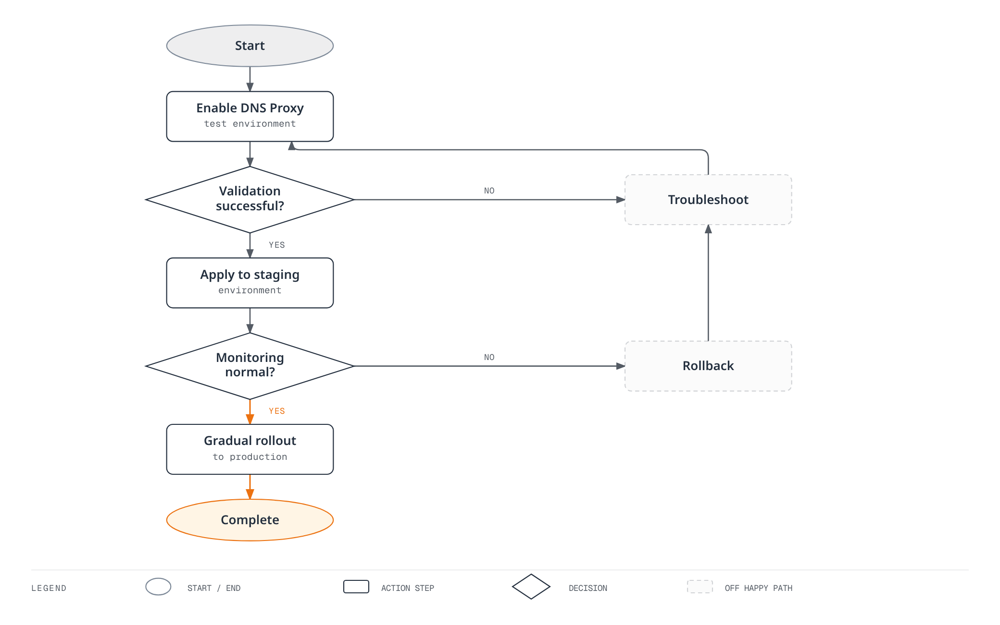

# DNS Proxy and DNS Caching

> **Verification baseline**: Istio 1.31.0, Kubernetes 1.32–1.36
> **Last reviewed**: September 11, 2026

Optimize external service access performance and control DNS lookups through Istio's DNS management features.

## Table of Contents

1. [DNS Proxy Overview](#dns-proxy-overview)
2. [DNS Proxy vs DNS Caching](#dns-proxy-vs-dns-caching)
3. [DNS Proxy Configuration](#dns-proxy-configuration)
4. [ServiceEntry Integration](#serviceentry-integration)
5. [DNS Caching Configuration](#dns-caching-configuration)
6. [Automatic Address Allocation](#automatic-address-allocation)
7. [Troubleshooting](#troubleshooting)
8. [Best Practices](#best-practices)

## DNS Proxy Overview

In sidecar mode, application DNS requests are redirected to **istio-agent's Go DNS server**, not an Envoy HTTP/DNS listener. The agent answers from the name/IP table supplied by Istiod and forwards unknown names to the upstream resolvers in `/etc/resolv.conf`. It supports UDP and TCP DNS; the usual sidecar DNS port is 15053.

In ambient mode, ztunnel handles DNS and capture is enabled by default from Istio 1.25. Sidecar mode still requires explicit enablement. DNS-over-HTTPS/TLS and application-managed caches are separate from ordinary port 53 capture. The EnvoyFilter and agent diagnostics below target **sidecar mode**.

## DNS Proxy vs DNS Caching

| Layer | Responsibility | Configuration |
|---|---|---|
| Application/OS resolver cache | Application names, TTL and negative caching | Application runtime, OS and resolver |
| Istio DNS proxy | Local mesh name/IP table, upstream forwarding for other names | Sidecar `ISTIO_META_DNS_CAPTURE`, ambient CNI/ztunnel |
| Envoy DNS service discovery | Refresh endpoints of DNS-based upstream clusters | ServiceEntry and generated DNS-cluster configuration |
| Envoy dynamic forward proxy DNS cache | Resolve dynamic destinations from request Host/SNI | Separate DYNAMIC_DNS/DFP configuration |

`dns_refresh_rate` does not enable caching of every application DNS response. The sidecar agent does not retain unknown-name upstream responses as a general response cache either. Known names can avoid a CoreDNS roundtrip, while upstream endpoint refresh still occurs independently; enabling both mechanisms does not guarantee optimal performance.

## DNS Proxy Configuration

### 1. Global Enablement

Merge this `istioctl` input into the existing installation configuration. It is not a resource to `kubectl apply` to the removed in-cluster Operator. For Helm installations, merge equivalent meshConfig values into the existing chart configuration. Existing sidecar capture rules take effect through newly injected/started Pods, so roll out only the reviewed workloads gradually.

```yaml
apiVersion: install.istio.io/v1alpha1
kind: IstioOperator
metadata:
  name: istio
  namespace: istio-system
spec:
  meshConfig:
    defaultConfig:
      proxyMetadata:
        ISTIO_META_DNS_CAPTURE: "true"
```

Current address allocation belongs to the Istiod controller, enabled by default. Do not add legacy `ISTIO_META_DNS_AUTO_ALLOCATE` metadata as a prerequisite for new installations.

### 2. Per-namespace Enablement

A namespace injection label alone does not enable DNS capture. Use GitOps/Kustomize/Helm to merge the following fragment into the Deployment Pod templates in the selected namespace. Replacing the central `istio-sidecar-injector` ConfigMap with partial values is not namespace-scoped configuration. Preserve other fields in existing `proxy.istio.io/config` annotations.

### 3. Per-pod Enablement

```yaml
# Existing Deployment: merge into spec.template, not a complete workload
metadata:
  annotations:
    proxy.istio.io/config: |
      proxyMetadata:
        ISTIO_META_DNS_CAPTURE: "true"
```

Preserve the existing legacy/revision injection mode and recreate the selected Pods. This is a template fragment, not a complete Pod with an assumed `myapp:v1` image. For ambient Pods, inspect the default capture behavior and the `ambient.istio.io/dns-capture: "false"` opt-out instead.

### 4. Verify Redirection and Responses

Pod-network-namespace DNS redirection varies by installation mode and CNI. Do not assume the proxy image contains bash/iptables/tcpdump or net-admin privileges. Begin with the agent name-table, DNS-query and upstream-endpoint checks below instead of elevating production Pod privileges. If needed, inspect both UDP/TCP 53 and 15053 paths in an approved diagnostic environment.

## ServiceEntry Integration

DNS Proxy works closely integrated with ServiceEntry.

### Basic ServiceEntry

```yaml
apiVersion: networking.istio.io/v1
kind: ServiceEntry
metadata:
  name: external-api
  namespace: default
spec:
  hosts:
  - api.example.com
  ports:
  - number: 443
    name: https
    protocol: HTTPS
  location: MESH_EXTERNAL
  resolution: DNS
```

**DNS Proxy behavior**:

1. Application performs `api.example.com` DNS lookup
2. The agent DNS proxy returns an allocated VIP (e.g., `240.240.0.1`)
3. Application sends request to virtual IP
4. Envoy routes this destination to the independently resolved real upstream endpoint

### Multiple Host Registration

Register independent upstreams with separate concrete names. These example.com names are configuration examples; replace them with real DNS/TLS/reachable backends.

```yaml
apiVersion: networking.istio.io/v1
kind: ServiceEntry
metadata:
  name: partner-api
  namespace: default
spec:
  hosts: ["api.partner.example.com"]
  ports:
  - number: 443
    name: https
    protocol: HTTPS
  location: MESH_EXTERNAL
  resolution: DNS
---
apiVersion: networking.istio.io/v1
kind: ServiceEntry
metadata:
  name: assets-cdn
  namespace: default
spec:
  hosts: ["cdn.example.com"]
  ports:
  - number: 443
    name: https
    protocol: HTTPS
  location: MESH_EXTERNAL
  resolution: DNS
```

A wildcard such as `*.example.com` with `resolution: DNS` and no concrete endpoints cannot resolve every subdomain. Sidecar wildcard forwarding to the application's original destination uses a separate `resolution: NONE` pattern and does not supply DNS answers. Istio 1.31 `DYNAMIC_DNS` is a distinct Host/SNI-based mode; ambient requires a waypoint and raw TCP is unsupported. Choose against the current API and generated configuration.

### Explicit Endpoints

`addresses` identifies the client-facing VIP; `endpoints` identifies real backends. A CIDR prefix can match traffic but is not a single DNS A/AAAA answer. These TEST-NET addresses do not deploy a database; use real nonconflicting VIP/backend/TLS configuration.

```yaml
apiVersion: networking.istio.io/v1
kind: ServiceEntry
metadata:
  name: external-database
  namespace: default
spec:
  hosts:
  - database.external.com
  addresses:
  - 198.51.100.10  # Explicit example VIP
  ports:
  - number: 3306
    name: mysql
    protocol: TCP
  location: MESH_EXTERNAL
  resolution: STATIC
  endpoints:
  - address: 203.0.113.10
  - address: 203.0.113.11
  - address: 203.0.113.12
```

## DNS Caching Configuration

### DNS-based Upstream Refresh

Istio 1.31 sets `respect_dns_ttl: true` on ordinary DNS clusters and its default mesh `dnsRefreshRate` is 60 seconds. Successful responses use DNS TTL; failures/zero TTL follow the generated resolver/cluster settings. The conceptual DNS page's “fixed 30 seconds, cannot be changed” statement does not match this release's source; inspect the effective configuration.

This low-level alternative modifies **one api.example.com:443 DNS cluster** for `app: frontend` in `default`. `cluster.service` matches an actual service name, not a glob selector. Do not broadly patch every cluster from the root namespace.

```yaml
apiVersion: networking.istio.io/v1alpha3
kind: EnvoyFilter
metadata:
  name: external-api-dns-refresh
  namespace: default
spec:
  workloadSelector:
    labels:
      app: frontend
  configPatches:
  - applyTo: CLUSTER
    match:
      context: SIDECAR_OUTBOUND
      cluster:
        service: api.example.com
        portNumber: 443
    patch:
      operation: MERGE
      value:
        dns_refresh_rate: 30s
        respect_dns_ttl: true
        dns_failure_refresh_rate:
          base_interval: 5s
          max_interval: 30s
```

### TTL, Failure Refresh and Resolver

With `respect_dns_ttl: true`, this does not force every successful lookup to refresh every 30 seconds. `dns_failure_refresh_rate` controls retry timing after failures, not record TTL or stale-response retention. `dns_query_timeout` is not a Cluster field; validate resolver-specific typed configuration. Preserve Istio's selected IP family instead of unconditionally forcing IPv4-only/AUTO.

Do not assume protobuf `MERGE` can clear existing `respect_dns_ttl: true` by setting the default scalar value `false`. Some cluster DNS fields are deprecated in Envoy, but Istio 1.31 still generates this form. Recheck DNS-cluster extensions and resolver configuration on upgrades.

### Inspect the Applied Configuration

```bash
istioctl proxy-config clusters <client-pod> -n default --fqdn api.example.com -o json |
  jq '.[] | {name,type,dnsRefreshRate,respectDnsTtl,dnsFailureRefreshRate,dnsLookupFamily,typedDnsResolverConfig,loadAssignment}'
```

## Automatic Address Allocation

### Allocation Owner and Status

The Istiod IP allocation controller, enabled by default, allocates VIPs per eligible ServiceEntry host and records `host`/`value` in `status.addresses`. Ordinary `resolution: DNS` wildcards are ineligible; `DYNAMIC_DNS` wildcards have a separate supported path. Entries with explicit `spec.addresses` or `networking.istio.io/enable-autoallocate-ip: "false"` do not follow the same allocation path.

### Address Ranges

Released default prefixes are IPv4 `240.240.0.0/16` and IPv6 `2001:2::/48`. This shows the **actual control-plane settings with their defaults**; avoid conflicts with user networks, VPNs and service CIDRs.

```yaml
# Advanced istioctl input: these are the released defaults, not new ranges.
apiVersion: install.istio.io/v1alpha1
kind: IstioOperator
spec:
  values:
    pilot:
      env:
        PILOT_ENABLE_IP_AUTOALLOCATE: "true"
        PILOT_IP_AUTOALLOCATE_IPV4_PREFIX: "240.240.0.0/16"
        PILOT_IP_AUTOALLOCATE_IPV6_PREFIX: "2001:2::/48"
```

`defaultServiceExportTo` controls visibility and `outboundTrafficPolicy` concerns unregistered outbound traffic; neither changes allocation prefixes. Changing existing VIPs can affect DNS caches, connections and routing, so a prefix change is not a demonstrated zero-downtime migration. Do not manually edit controller-owned status.

### Verify Allocated Addresses

```bash
kubectl get serviceentry external-api -n default -o json |
  jq '{hosts:.spec.hosts, explicitAddresses:.spec.addresses, allocatedAddresses:.status.addresses}'

# Inspect the client's mapping and the actual upstream separately.
istioctl proxy-config listeners <client-pod> -n default
istioctl proxy-config clusters <client-pod> -n default --fqdn api.example.com -o json
istioctl proxy-config endpoints <client-pod> -n default --cluster 'outbound|443||api.example.com'
```

The allocated VIP belongs to application DNS responses and destination matching. A DNS cluster's `loadAssignment` contains the real backend hostname to resolve; runtime endpoints contain resolved addresses. Do not present the VIP as the real external upstream IP.

## Troubleshooting

### Verify DNS Proxy Operation

```bash
# Inspect classic or native sidecar metadata without assuming a shell in the image.
kubectl get pod <client-pod> -n default -o json |
  jq '[.spec.containers[], .spec.initContainers[]?] |
      .[] | select(.name == "istio-proxy") |
      {name,env:[.env[]? | select(.name == "ISTIO_META_DNS_CAPTURE")]}'

istioctl analyze -n default
istioctl proxy-status
kubectl get serviceentry external-api -n default -o yaml
kubectl logs -n default <client-pod> -c istio-proxy --tail=100

# Requires a reviewed diagnostic container with nslookup in this Pod's network namespace.
kubectl exec -n default <client-pod> -c <diagnostic-container> -- nslookup api.example.com
```

```bash
# Terminal 1: sidecar agent's local status server (not Envoy admin 15000)
kubectl port-forward -n default <client-pod> 15020:15020
```

```bash
# Terminal 2 while the forward remains active
curl --fail --silent http://127.0.0.1:15020/debug/ndsz |
  jq '.table["api.example.com"]'
curl --fail --silent http://127.0.0.1:15020/stats/prometheus |
  grep '^istio_agent_dns_'
```

The agent's `/debug/ndsz` accepts localhost requests only and can return 404 when DNS/name-table state is unavailable. Looking for agent port 15053 in Envoy's port 15000 listener dump is not a valid check. If the application lacks nslookup, use the established diagnostic process rather than modifying the base image or escalating its privileges.

### Common Issues

1. **Queries still reach CoreDNS**: Forwarding unknown names is normal. Distinguish names present/absent in the local table and inspect capture, search/ndots, TCP fallback and application DoH/TLS.
2. **ServiceEntry is missing**: Check `exportTo`, namespace discovery/Sidecar scope, resolution, status allocation, injection/revision and NDS/xDS synchronization. Use `istioctl analyze -n default`; resource kind/name are not its positional arguments. Do not begin by deleting a Pod to “force synchronization”.
3. **VIP connections fail**: Inspect VIP matching separately from upstream DNS/endpoints, network paths, TLS Host/SNI and certificates. Calling `http://VIP` is not a valid test for a port 443 HTTPS service.

```bash
# Run inside an approved diagnostic container sharing the captured Pod network namespace.
# Replace VIP4 with the actual IPv4 status.addresses value, and keep the real Host/SNI.
VIP4=240.240.0.1
curl --fail --show-error --resolve "api.example.com:443:${VIP4}" https://api.example.com/
```

Replace the example VIP with the actual allocation and run inside the captured Pod network namespace. Do not assume this non-routable address is reachable from another host. Keep certificate verification enabled and check the application's DNS path separately from the direct-VIP test.

### Envoy Admin API and Packet Inspection

```bash
# Terminal 1
kubectl port-forward -n default <client-pod> 15000:15000
```

```bash
# Terminal 2: Envoy endpoint discovery, distinct from agent name-table metrics
curl --fail --silent http://127.0.0.1:15000/clusters
curl --fail --silent http://127.0.0.1:15000/config_dump > envoy-config.json
```

If packet capture is needed, follow the approved diagnostic-container/node process to inspect UDP/TCP 53 and 15053 in the Pod network namespace. Do not assume istio-proxy includes tcpdump, tar or capture privileges. DNS names can be sensitive; limit capture duration/scope/retention and follow the disposal process after analysis.

## Best Practices

### 1. DNS Proxy Enablement Strategy

**Recommended approach**: Gradual rollout



[🔍 View interactive diagram](https://www.atomai.click/kubernetes-docs/archmaps/en-service-mesh-istio-advanced-04-dns-cache-3.html)

### 2. ServiceEntry Management

```yaml
# Create separate ServiceEntry per external service
apiVersion: networking.istio.io/v1
kind: ServiceEntry
metadata:
  name: payment-api
  namespace: default
  labels:
    app: payment
    team: platform
spec:
  hosts:
  - payments.example.com
  ports:
  - number: 443
    name: https
    protocol: HTTPS
  location: MESH_EXTERNAL
  resolution: DNS
---
apiVersion: networking.istio.io/v1
kind: ServiceEntry
metadata:
  name: analytics-api
  namespace: default
  labels:
    app: analytics
    team: data
spec:
  hosts:
  - analytics.example.com
  ports:
  - number: 443
    name: https
    protocol: HTTPS
  location: MESH_EXTERNAL
  resolution: DNS
```

### 3. DNS Cache TTL Configuration

Observe record TTL, application cache, the agent name table and Envoy endpoint refresh separately. Do not assign 300 seconds to every CDN or 10 seconds to every API cluster merely by category. For DNS zones you control, choose TTL against failover objectives and query load. ServiceEntry `exportTo`/Sidecar scope can reduce unnecessary per-proxy discovery; neither is a network security boundary.

For a specific DNS cluster's failure refresh, use the workload/host/port-scoped example above and verify its effective configuration and failure behavior.

### 4. Monitoring Metrics

These are actual Istio 1.31 **sidecar agent** metrics. They assume Prometheus scrapes port 15020 `/stats/prometheus` and attaches `namespace`/`pod` target labels. Do not mix them with ztunnel or Envoy DFP-cache metrics.

```promql
# Application queries handled by the sidecar agent
sum by (namespace, pod) (
  rate(istio_agent_dns_requests_total{namespace="default"}[5m])
)

# Fraction forwarded upstream; not a DNS response-cache hit/miss ratio
100 *
sum by (namespace, pod) (
  rate(istio_agent_dns_upstream_requests_total{namespace="default"}[5m])
) /
sum by (namespace, pod) (
  rate(istio_agent_dns_requests_total{namespace="default"}[5m])
)

# Requests for which the agent synthesized SERVFAIL after upstream exchange failures
100 *
sum by (namespace, pod) (
  rate(istio_agent_dns_upstream_failures_total{namespace="default"}[5m])
) /
sum by (namespace, pod) (
  rate(istio_agent_dns_upstream_requests_total{namespace="default"}[5m])
)

# Upstream request duration p99, in seconds
histogram_quantile(0.99,
  sum by (le, namespace, pod) (
    rate(istio_agent_dns_upstream_request_duration_seconds_bucket{namespace="default"}[5m])
  )
)
```

`dns_upstream_failures_total` counts SERVFAIL synthesized by the agent after upstream exchange failures. It does not count every NXDOMAIN/SERVFAIL returned in a valid upstream response packet. With no requests, ratios/quantiles can be NaN or absent; check traffic and scrape health together. Do not invent a “cache hit rate” from these values.

### 5. Security Considerations

DNS capture, ServiceEntry registration and VIP allocation do not enforce an external allow list. An AuthorizationPolicy selecting a sidecar workload evaluates that workload's **inbound** traffic, not its outbound DNS/HTTPS requests. Namespace-wide `DENY/notHosts` can block internal traffic or TCP with missing HTTP attributes.

Enforce egress through appropriate CNI/NetworkPolicy, firewall/security-group boundaries and, when needed, a non-bypassable egress gateway with authorization at that gateway. TLS-passthrough paths cannot inspect HTTP Host; SNI/destination constraints and certificate verification need separate handling. Follow the complete prerequisites in [Egress Control](../traffic-management/11-egress-control.md).

### 6. Performance Tuning

Measure DNS load, failures and lookup duration together with Istiod push latency and sidecar agent/Envoy CPU/memory before changing the bottleneck. Envoy worker concurrency does not size the agent's Go DNS server; adding Istiod replicas/HPA alone cannot accelerate every DNS path.

Test application cache/ndots, DNS TTL, ServiceEntry count/visibility, periodic query load across proxy replicas and stale-endpoint/connection behavior during failure recovery. Fixed CPU/memory/HPA values without measurements are not a production optimization.

## References

### Official Documentation
- [Istio DNS Proxy](https://istio.io/latest/docs/ops/configuration/traffic-management/dns-proxy/)
- [Envoy DNS Cache](https://www.envoyproxy.io/docs/envoy/latest/intro/arch_overview/upstream/service_discovery)
- [ServiceEntry](https://istio.io/latest/docs/reference/config/networking/service-entry/)

- [Istio 1.31 DNS server](https://raw.githubusercontent.com/istio/istio/1.31.0/pkg/dns/client/dns.go)
- [Istio 1.31 IP allocation and prefixes](https://raw.githubusercontent.com/istio/istio/1.31.0/pilot/pkg/features/pilot.go)
- [Istio 1.31 allocation status](https://raw.githubusercontent.com/istio/istio/1.31.0/pilot/pkg/controllers/ipallocate/ipallocate.go)
- [Istio 1.31 DNS cluster generation](https://raw.githubusercontent.com/istio/istio/1.31.0/pilot/pkg/networking/core/cluster_builder.go)
- [Istio 1.31 mesh defaults](https://raw.githubusercontent.com/istio/istio/1.31.0/pkg/config/mesh/mesh.go)
- [Istio 1.31 agent DNS metrics](https://raw.githubusercontent.com/istio/istio/1.31.0/pkg/dns/client/monitoring.go)
- [Istio 1.31 agent status endpoint](https://raw.githubusercontent.com/istio/istio/1.31.0/pilot/cmd/pilot-agent/status/server.go)
- [Envoy Cluster API](https://www.envoyproxy.io/docs/envoy/latest/api-v3/config/cluster/v3/cluster.proto)

### Related Documents
- [Istio Architecture - DNS Processing Mechanism](../03-architecture.md)
- [ServiceEntry](../traffic-management/12-service-entry.md)
- [Egress Control](../traffic-management/11-egress-control.md)
