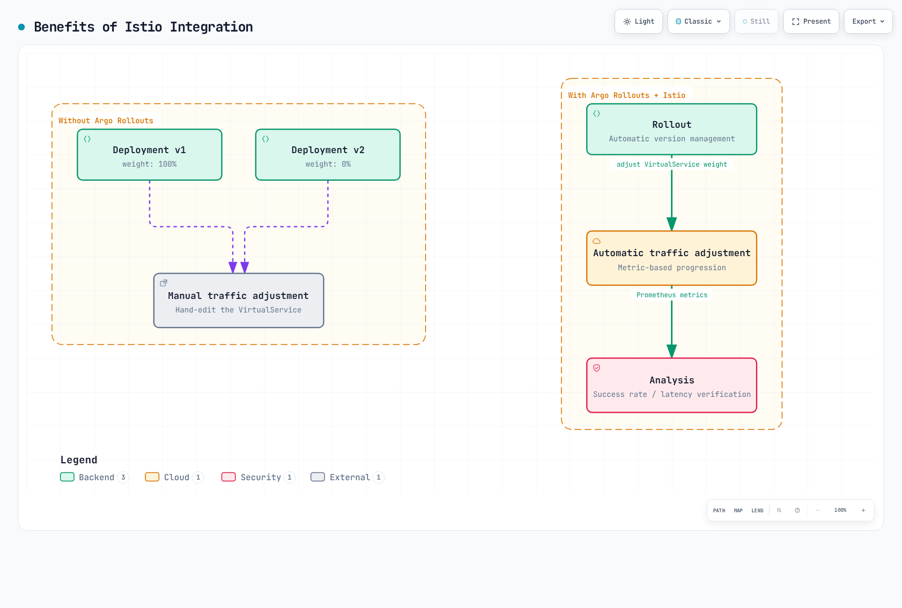
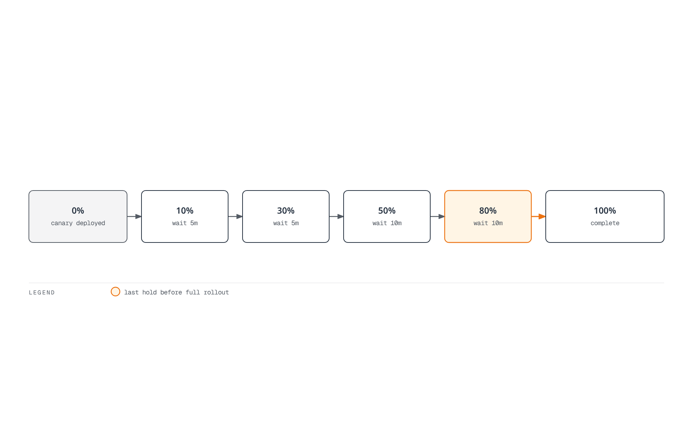
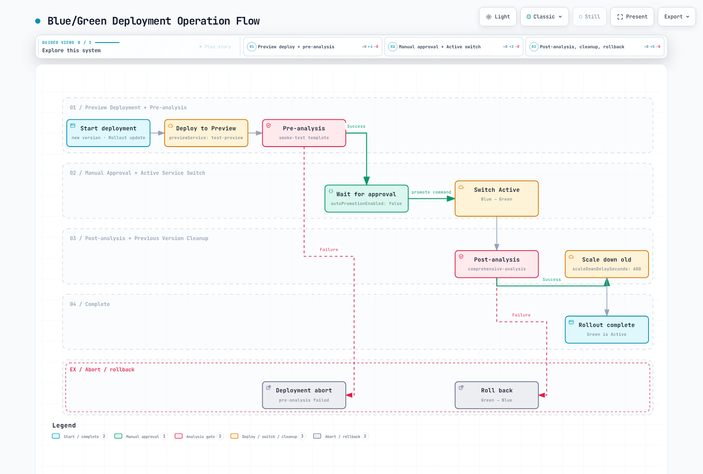

# Argo Rollouts and Istio Integration

> **Verification baseline**: Argo Rollouts 1.10.0, Istio 1.31.0, Kubernetes 1.32–1.36
> **Last reviewed**: September 11, 2026
> **Difficulty**: Advanced

Argo Rollouts reconciles replica selection and Istio traffic weights during progressive delivery. Analysis must be configured and supplied with trustworthy observations; installing both controllers alone does not provide an automatic quality gate or guarantee availability.

## Table of Contents

1. [Overview](#overview)
2. [Architecture](#architecture)
3. [Core Concepts](#core-concepts)
4. [Setup and Configuration](#setup-and-configuration)
5. [Traffic Routing Strategies](#traffic-routing-strategies)
6. [Analysis and Metrics](#analysis-and-metrics)
7. [Advanced Deployment Patterns](#advanced-deployment-patterns)
8. [Troubleshooting](#troubleshooting)
9. [Best Practices](#best-practices)

## Overview

Canary shifts eligible traffic gradually; blue/green changes the active Service selector. Configured analysis can continue, abort or pause an update. Traffic propagation, readiness, surge capacity, long-lived connections and application/data compatibility still determine the user-visible result.



[View interactive diagram](https://www.atomai.click/kubernetes-docs/archmaps/en-service-mesh-istio-advanced-08-argo-rollouts-0.html)

The diagram assumes analysis is configured. An abort can return managed traffic to the stable revision during an update, but it does not revert the desired image in Git. Argo Rollouts also supports other traffic-router integrations; each has its own implementation and maintenance status.

## Architecture

Argo CD/GitOps is optional. The Rollouts controller reads Rollout/Analysis resources and updates the configured Services or DestinationRule subset labels and VirtualService weights. Istiod translates these resources into proxy configuration. Requests pass through Envoy and then application endpoints; VirtualService and DestinationRule objects are configuration, not network hops.

Prometheus scrapes the relevant proxies; the analysis provider queries Prometheus. The controller acts on the resulting AnalysisRun phase. Only traffic that traverses the configured mesh proxy/gateway follows the Istio split. A client outside the mesh or a direct Pod/port-forward connection can bypass it.

## Core Concepts

### 1. Rollout Resource

A Rollout manages ReplicaSets with canary or blue/green strategies. It is a separate API from Deployment, not a Deployment with `strategy: RollingUpdate` renamed. Migration of an existing Deployment requires a reviewed migration/workloadRef plan; do not let two controllers manage the same Pods.

### 2. VirtualService Ownership

Rollouts reconciles the configured named routes' weights and may add/remove its managed experiment destinations. It preserves supported routing fields rather than blindly overwriting the entire destination array. Additional subset destinations require `additionalSubsetNames` and valid total weights; unmanaged destinations can be removed. Assign each managed route to one Rollout and coordinate GitOps ownership.

### 3. Host-level and Subset-level Splitting

| Approach | User-created resources | Fields reconciled by Rollouts |
|---|---|---|
| Host-level, used in the main lab | Rollout, stable/canary Services, VirtualService | Service hash selectors and named-route weights |
| Subset-level alternative | Rollout, one Service, VirtualService, DestinationRule | Stable/canary subset hash labels and named-route weights |

Do not manually fill in placeholder ReplicaSet hashes. In host-level splitting, the controller adds `rollouts-pod-template-hash` to the two Service selectors. In subset-level splitting, it adds the hash to the configured DestinationRule subset labels; the single Service keeps selecting the workload as a whole.

The following is a **separate subset-level alternative**, not an addition to the host-level lab. Its Service and VirtualService both use `test`:

```yaml
apiVersion: v1
kind: Service
metadata:
  name: test
  namespace: rollouts-demo
spec:
  selector:
    app: test
  ports:
  - name: http
    port: 8080
    targetPort: http
---
apiVersion: networking.istio.io/v1
kind: VirtualService
metadata:
  name: test-subsets
  namespace: rollouts-demo
spec:
  hosts:
  - test
  - test.rollouts-demo.svc.cluster.local
  http:
  - name: primary
    route:
    - destination:
        host: test
        port:
          number: 8080
        subset: stable
      weight: 100
    - destination:
        host: test
        port:
          number: 8080
        subset: canary
      weight: 0
    retries:
      attempts: 0
---
apiVersion: networking.istio.io/v1
kind: DestinationRule
metadata:
  name: test-subsets
  namespace: rollouts-demo
spec:
  host: test
  subsets:
  - name: stable
    labels:
      app: test
  - name: canary
    labels:
      app: test
```

Replace the main Rollout's canary strategy with this fragment, retaining its real workload/template. Omit the host-level `stableService`/`canaryService` fields for this alternative:

```yaml
spec:
  strategy:
    canary:
      trafficRouting:
        istio:
          virtualService:
            name: test-subsets
            routes:
            - primary
          destinationRule:
            name: test-subsets
            canarySubsetName: canary
            stableSubsetName: stable
      steps:
      - setWeight: 10
      - pause: {}
```

Until the controller writes distinct hashes, two identical/empty subset selectors do not isolate revisions. Verify the reconciled labels and readiness before sending test traffic. A subset does not automatically become a separate `destination_service_name`; analysis for this alternative needs verified revision/workload telemetry. `destination_workload_label_rollouts_pod_template_hash` is **not a default Istio metric label**.

### 4. Analysis Results

Prometheus returns a vector. Check its length and finite value before accessing `result[0]`. With only `successCondition`, a false result is a failed measurement; provider/expression errors are separate errors. If both success/failure conditions are supplied and neither matches, the measurement is inconclusive.

`failureLimit: 2` tolerates two failed measurements and fails on the third (`failed > failureLimit`). Therefore `count: 5` with that limit does not require five successes. The main example uses `failureLimit: 0`, including on missing/non-finite data, and also requires a minimum observed traffic volume. Thresholds and sample counts below are illustrative, not statistical confidence or production SLO guarantees.

## Setup and Configuration

### Prerequisites and Scope

Install the matching Rollouts controller/CRDs and CLI plugin, a compatible Istio sidecar data plane, and a Prometheus scrape setup with working DNS/RBAC/network access from the analysis provider. See the [observability guide](../observability/README.md) and [injection guide](07-sidecar-injection.md). Validate the actual metrics before enabling analysis.

This isolated HTTP demo uses the official blue/green demo images pinned by digest. The verified images are **Linux amd64 only**, so the Pod template selects that architecture. For Arm64/Graviton, supply an independently tested Arm64 or multi-platform application image. No cluster, image runtime, production load or live rollout was tested by this audit.

The example creates a fresh `rollouts-demo` namespace using default/legacy sidecar injection. On a revisioned installation, select its installed revision/tag instead, preserving the injection rules described in the linked guide.

### 1. Namespace and Rollout

```yaml
apiVersion: v1
kind: Namespace
metadata:
  name: rollouts-demo
  labels:
    istio-injection: enabled
---
apiVersion: argoproj.io/v1alpha1
kind: Rollout
metadata:
  name: test
  namespace: rollouts-demo
spec:
  replicas: 3
  revisionHistoryLimit: 2
  selector:
    matchLabels:
      app: test
  template:
    metadata:
      labels:
        app: test
    spec:
      nodeSelector:
        kubernetes.io/os: linux
        kubernetes.io/arch: amd64
      terminationGracePeriodSeconds: 45
      containers:
      - name: app
        image: argoproj/rollouts-demo@sha256:3225193a6415b14b3fcdd160c40248b2bfd62f8c77326480559b91a41ced6e20
        ports:
        - name: http
          containerPort: 8080
        readinessProbe:
          httpGet:
            path: /
            port: http
          initialDelaySeconds: 3
          periodSeconds: 5
          timeoutSeconds: 1
        resources:
          requests:
            cpu: 100m
            memory: 128Mi
          limits:
            cpu: 200m
            memory: 256Mi
  strategy:
    canary:
      stableService: test-stable
      canaryService: test-canary
      maxSurge: 1
      maxUnavailable: 0
      trafficRouting:
        istio:
          virtualService:
            name: test
            routes:
            - primary
      steps:
      - setWeight: 10
      - pause:
          duration: 5m
      - analysis:
          templates:
          - templateName: success-rate
          args:
          - name: service-name
            value: test-canary
          - name: namespace
            value: rollouts-demo
      - setWeight: 50
      - pause:
          duration: 5m
      - analysis:
          templates:
          - templateName: success-rate
          args:
          - name: service-name
            value: test-canary
          - name: namespace
            value: rollouts-demo
      - setWeight: 80
      - pause:
          duration: 5m
      - analysis:
          templates:
          - templateName: success-rate
          args:
          - name: service-name
            value: test-canary
          - name: namespace
            value: rollouts-demo
```

The image, CPU/memory settings and replica count are demo inputs. The 45-second termination grace accommodates the demo's documented shutdown delays; validate the application's own lifecycle in a real rollout. This strategy deliberately disables mesh retries on the primary VirtualService route and performs inline analysis after warm-up pauses.

### 2. Stable/Canary Services

```yaml
apiVersion: v1
kind: Service
metadata:
  name: test-stable
  namespace: rollouts-demo
spec:
  selector:
    app: test
  ports:
  - name: http
    port: 8080
    targetPort: http
---
apiVersion: v1
kind: Service
metadata:
  name: test-canary
  namespace: rollouts-demo
spec:
  selector:
    app: test
  ports:
  - name: http
    port: 8080
    targetPort: http
```

Rollouts owns the hash selector it adds to each Service. Avoid an additional fixed `version: v1` selector that would prevent the stable Service from selecting the newly promoted revision.

### 3. VirtualService

```yaml
apiVersion: networking.istio.io/v1
kind: VirtualService
metadata:
  name: test
  namespace: rollouts-demo
spec:
  hosts:
  - test-stable
  - test-stable.rollouts-demo.svc.cluster.local
  http:
  - name: primary
    route:
    - destination:
        host: test-stable
        port:
          number: 8080
      weight: 100
    - destination:
        host: test-canary
        port:
          number: 8080
      weight: 0
    retries:
      attempts: 0
```

This is **in-mesh HTTP routing**, with no ingress Gateway assumed. Send sustained test traffic from an injected client to `http://test-stable.rollouts-demo.svc.cluster.local:8080/color`. Directly calling the canary Service, forwarding a Pod port or using a non-meshed client does not verify the weighted route.

### 4. AnalysisTemplate and Data Contract

The example queries standard Service-level metrics with `reporter="source"` and the destination Service namespace. It assumes source proxies are scraped exactly once for this dataset and that their actual label values match the selectors.

Keep real test traffic flowing throughout the rollout. The five-minute warm-up exceeds the two-minute lookback to avoid mixing the previous selector's data into the first gate. The minimum-volume check is an estimate from counter increase; it is not proof of statistical significance. Low traffic or missing telemetry must not silently promote a revision.

```yaml
apiVersion: argoproj.io/v1alpha1
kind: AnalysisTemplate
metadata:
  name: success-rate
  namespace: rollouts-demo
spec:
  args:
  - name: service-name
  - name: namespace
  metrics:
  - name: request-volume
    interval: 30s
    successCondition: len(result) == 1 && !isNaN(result[0]) && !isInf(result[0]) && result[0] >= 20
    failureLimit: 0
    provider:
      prometheus:
        address: http://prometheus.istio-system.svc.cluster.local:9090
        query: sum(increase(istio_requests_total{reporter="source",destination_service_name="{{args.service-name}}",destination_service_namespace="{{args.namespace}}"}[2m]))
    count: 5
  - name: http-availability
    interval: 30s
    successCondition: len(result) == 1 && !isNaN(result[0]) && !isInf(result[0]) && result[0] >= 0.95
    failureLimit: 0
    provider:
      prometheus:
        address: http://prometheus.istio-system.svc.cluster.local:9090
        query: |-
          (sum(rate(istio_requests_total{reporter="source",destination_service_name="{{args.service-name}}",destination_service_namespace="{{args.namespace}}",response_code!~"5..|0"}[2m])) or vector(0))
          /
          sum(rate(istio_requests_total{reporter="source",destination_service_name="{{args.service-name}}",destination_service_namespace="{{args.namespace}}"}[2m]))
    count: 5
```

The availability calculation counts non-5xx/non-zero HTTP responses, including 4xx; it does not prove business success. This is an HTTP demo, not a gRPC-status SLO. Scrape duplication, delays, resets and overlapping windows must be considered when interpreting the results.

### Deployment Workflow

Save the reviewed resources into separate files and create dependencies before the Rollout:

```bash
kubectl argo rollouts lint -f rollout.yaml
kubectl apply -f namespace.yaml
kubectl apply -f analysis-templates.yaml -f services.yaml -f virtualservice.yaml
kubectl apply -f rollout.yaml

kubectl argo rollouts get rollout test -n rollouts-demo --watch
```

Initial creation establishes a stable revision; exercise the canary strategy with a subsequent image change while test traffic is running. In a GitOps-managed environment, change the desired image in Git. The following direct CLI commands are lab alternatives:

```bash
kubectl argo rollouts set image test app=argoproj/rollouts-demo@sha256:e32df3d15f759d36c323b3dccb7003d38df1a4274d37217715151f085c24c58f -n rollouts-demo
kubectl argo rollouts get rollout test -n rollouts-demo --watch

# Choose the action appropriate to the observed state; do not run these as a sequence.
kubectl argo rollouts promote test -n rollouts-demo
kubectl argo rollouts abort test -n rollouts-demo
kubectl argo rollouts retry rollout test -n rollouts-demo
```

Promote resumes an intended pause; it is not a substitute for investigating failed analysis. Abort leaves the desired Pod template unchanged. Reconcile the desired version before retry/undo, especially when another GitOps controller can restore it.

## Traffic Routing Strategies

All fragments in this section are **alternatives to the main canary strategy**. Merge them with its existing Services, traffic-routing references and workload template; do not apply fragments as standalone resources.

### 1. Weight-based Canary

Keep `setWeight` and `pause` in separate step objects. Percentage is a routing target, not an exact ratio in a small sample. Session affinity and long-lived requests can also change the observed distribution.



[View interactive diagram](https://www.atomai.click/kubernetes-docs/archmaps/en-service-mesh-istio-advanced-08-argo-rollouts-4.html)

### 2. Managed Header Routing

Use `managedRoutes`/`setHeaderRoute` so Rollouts can order and remove its generated route. Provision a canary replica for the header-only phase before returning replica scaling to traffic-weight control:

```yaml
spec:
  strategy:
    canary:
      trafficRouting:
        managedRoutes:
        - name: beta-header
        istio:
          virtualService:
            name: test
            routes:
            - primary
      steps:
      - setCanaryScale:
          replicas: 1
      - setWeight: 0
      - setHeaderRoute:
          name: beta-header
          match:
          - headerName: x-beta-user
            headerValue:
              exact: 'true'
      - pause:
          duration: 5m
      - setHeaderRoute:
          name: beta-header
      - setCanaryScale:
          matchTrafficWeight: true
      - setWeight: 10
      - pause: {}
```

Released 1.10 generates this header route without copying the primary route’s retry policy. Use this fragment only for idempotent demo requests and inspect the generated route; it does not enforce read-only methods or guarantee that writes cannot retry. A write-serving deployment needs a separately controlled and validated retry/authorization design.

An `x-beta-user` header is not authenticated tester identity. Use a trusted authentication boundary if exposure must be restricted. A manually written header route outside Rollouts' managed-route list will not automatically disappear on abort/completion and can keep reaching canary endpoints.

### 3. Managed Mirror Traffic

The example mirrors GET requests only, keeps user responses on the stable route during the shadow phase, and removes the mirror before ordinary canary traffic:

```yaml
spec:
  strategy:
    canary:
      trafficRouting:
        managedRoutes:
        - name: shadow-read
        istio:
          virtualService:
            name: test
            routes:
            - primary
      steps:
      - setCanaryScale:
          replicas: 1
      - setWeight: 0
      - setMirrorRoute:
          name: shadow-read
          percentage: 10
          match:
          - method:
              exact: GET
      - pause:
          duration: 5m
      - setMirrorRoute:
          name: shadow-read
      - setCanaryScale:
          matchTrafficWeight: true
      - setWeight: 10
      - pause: {}
```

The generated mirror route also does not inherit the primary retry policy; inspect its effective mesh defaults. Mirrored responses are discarded, but requests still execute. Even GET can trigger side effects in an application; validate semantics and isolate data/dependencies as necessary. Mirroring adds resource/network load and does not guarantee zero user impact. Confirm actual mirrored Host behavior and application acceptance.

### 4. Multiple Named Routes

```yaml
apiVersion: networking.istio.io/v1
kind: VirtualService
metadata:
  name: test
  namespace: rollouts-demo
spec:
  hosts:
  - test-stable
  - test-stable.rollouts-demo.svc.cluster.local
  http:
  - name: api-route
    match:
    - uri:
        exact: /api
    - uri:
        prefix: /api/
    route:
    - destination:
        host: test-stable
        port:
          number: 8080
      weight: 100
    - destination:
        host: test-canary
        port:
          number: 8080
      weight: 0
    retries:
      attempts: 0
  - name: web-route
    match:
    - uri:
        exact: /web
    - uri:
        prefix: /web/
    route:
    - destination:
        host: test-stable
        port:
          number: 8080
      weight: 100
    - destination:
        host: test-canary
        port:
          number: 8080
      weight: 0
    retries:
      attempts: 0
---
spec:
  strategy:
    canary:
      trafficRouting:
        istio:
          virtualService:
            name: test
            routes:
            - api-route
            - web-route
      steps:
      - setWeight: 10
      - pause: {}
```

Both named routes use the same canary target weight. Match boundaries protect `/api` and `/api/…` separately from unrelated prefixes. Requests outside these paths need an explicitly designed route.

## Analysis and Metrics

The upstream historical screenshot illustrates Service-level separation, not an integration architecture or a current benchmark:


### 1. Inline Analysis

The main Rollout runs `success-rate` as an inline step and waits for completion. It passes both required arguments at every invocation. A failed run aborts; an inconclusive run can pause. An analysis provider cannot create missing application traffic or correct a wrong metric selector.

### 2. Continuous Background Analysis

A background template with `count: 5` stops after its finite measurements. Omit count for a continuous background gate:

```yaml
apiVersion: argoproj.io/v1alpha1
kind: AnalysisTemplate
metadata:
  name: success-rate-continuous
  namespace: rollouts-demo
spec:
  args:
  - name: service-name
  - name: namespace
  metrics:
  - name: request-volume
    interval: 30s
    successCondition: len(result) == 1 && !isNaN(result[0]) && !isInf(result[0]) && result[0] >= 20
    failureLimit: 0
    provider:
      prometheus:
        address: http://prometheus.istio-system.svc.cluster.local:9090
        query: sum(increase(istio_requests_total{reporter="source",destination_service_name="{{args.service-name}}",destination_service_namespace="{{args.namespace}}"}[2m]))
  - name: http-availability
    interval: 30s
    successCondition: len(result) == 1 && !isNaN(result[0]) && !isInf(result[0]) && result[0] >= 0.95
    failureLimit: 0
    provider:
      prometheus:
        address: http://prometheus.istio-system.svc.cluster.local:9090
        query: |-
          (sum(rate(istio_requests_total{reporter="source",destination_service_name="{{args.service-name}}",destination_service_namespace="{{args.namespace}}",response_code!~"5..|0"}[2m])) or vector(0))
          /
          sum(rate(istio_requests_total{reporter="source",destination_service_name="{{args.service-name}}",destination_service_namespace="{{args.namespace}}"}[2m]))
---
spec:
  strategy:
    canary:
      analysis:
        templates:
        - templateName: success-rate-continuous
        startingStep: 2
        args:
        - name: service-name
          value: test-canary
        - name: namespace
          value: rollouts-demo
      steps:
      - setWeight: 10
      - pause:
          duration: 5m
      - setWeight: 30
      - pause:
          duration: 5m
      - setWeight: 50
      - pause: {}
```

`startingStep: 2` is zero-based: the third step (`setWeight: 30`) in this fragment. The preceding pause warms the two-minute data window. Analysis continues alongside subsequent steps until terminated/completed by the rollout or a failure condition. It is not an instantaneous end-to-end rollback guarantee.

### 3. Composite Metrics

This stricter alternative requires request volume, 99% non-5xx/non-zero availability, p95 at most 0.5 seconds and error rate at most 1%. Availability and error-rate checks are complementary here; the sample values still need workload-specific justification.

```yaml
apiVersion: argoproj.io/v1alpha1
kind: AnalysisTemplate
metadata:
  name: comprehensive-analysis
  namespace: rollouts-demo
spec:
  args:
  - name: service-name
  - name: namespace
  metrics:
  - name: request-volume
    interval: 30s
    successCondition: len(result) == 1 && !isNaN(result[0]) && !isInf(result[0]) && result[0] >= 20
    failureLimit: 0
    provider:
      prometheus:
        address: http://prometheus.istio-system.svc.cluster.local:9090
        query: sum(increase(istio_requests_total{reporter="source",destination_service_name="{{args.service-name}}",destination_service_namespace="{{args.namespace}}"}[2m]))
    count: 5
  - name: http-availability
    interval: 30s
    successCondition: len(result) == 1 && !isNaN(result[0]) && !isInf(result[0]) && result[0] >= 0.99
    failureLimit: 0
    provider:
      prometheus:
        address: http://prometheus.istio-system.svc.cluster.local:9090
        query: |-
          (sum(rate(istio_requests_total{reporter="source",destination_service_name="{{args.service-name}}",destination_service_namespace="{{args.namespace}}",response_code!~"5..|0"}[2m])) or vector(0))
          /
          sum(rate(istio_requests_total{reporter="source",destination_service_name="{{args.service-name}}",destination_service_namespace="{{args.namespace}}"}[2m]))
    count: 5
  - name: latency-p95
    interval: 30s
    successCondition: len(result) == 1 && !isNaN(result[0]) && !isInf(result[0]) && result[0] <= 0.5
    failureLimit: 0
    provider:
      prometheus:
        address: http://prometheus.istio-system.svc.cluster.local:9090
        query: |-
          histogram_quantile(0.95,
            sum by (le) (rate(istio_request_duration_milliseconds_bucket{reporter="source",destination_service_name="{{args.service-name}}",destination_service_namespace="{{args.namespace}}"}[2m]))
          ) / 1000
    count: 5
  - name: http-error-rate
    interval: 30s
    successCondition: len(result) == 1 && !isNaN(result[0]) && !isInf(result[0]) && result[0] <= 0.01
    failureLimit: 0
    provider:
      prometheus:
        address: http://prometheus.istio-system.svc.cluster.local:9090
        query: |-
          (sum(rate(istio_requests_total{reporter="source",destination_service_name="{{args.service-name}}",destination_service_namespace="{{args.namespace}}",response_code=~"5..|0"}[2m])) or vector(0))
          /
          sum(rate(istio_requests_total{reporter="source",destination_service_name="{{args.service-name}}",destination_service_namespace="{{args.namespace}}"}[2m]))
    count: 5
```

Istio's duration histogram is in milliseconds, so the query divides by 1000 before comparing with seconds. Instant-vector results are guarded against empty/multiple/NaN/Inf values. Overlapping lookbacks do not create independent statistical samples.

### 4. Pre/Post Checks

Canary has one background `analysis` field. Two `analysis` keys in the same YAML object do not implement pre/post checks. Use explicit inline analysis steps at the intended points, with appropriate traffic/preconditions, or blue/green's `prePromotionAnalysis` and `postPromotionAnalysis` hooks below.

## Advanced Deployment Patterns

### 1. Blue/Green

This is an **independent strategy blueprint**. Reuse a reviewed workload template but replace the canary strategy and client-facing Service references. Create both active/preview Services before it runs:

```yaml
apiVersion: v1
kind: Service
metadata:
  name: test-active
  namespace: rollouts-demo
spec:
  selector:
    app: test
  ports:
  - name: http
    port: 8080
    targetPort: http
---
apiVersion: v1
kind: Service
metadata:
  name: test-preview
  namespace: rollouts-demo
spec:
  selector:
    app: test
  ports:
  - name: http
    port: 8080
    targetPort: http
---
spec:
  strategy:
    blueGreen:
      activeService: test-active
      previewService: test-preview
      autoPromotionEnabled: false
      prePromotionAnalysis:
        templates:
        - templateName: smoke-test
        args:
        - name: service-name
          value: test-preview
        - name: namespace
          value: rollouts-demo
      postPromotionAnalysis:
        templates:
        - templateName: post-promotion-analysis
        args:
        - name: service-name
          value: test-active
        - name: namespace
          value: rollouts-demo
      scaleDownDelaySeconds: 600
---
apiVersion: networking.istio.io/v1
kind: VirtualService
metadata:
  name: test-bluegreen
  namespace: rollouts-demo
spec:
  hosts:
  - test-active
  - test-active.rollouts-demo.svc.cluster.local
  http:
  - name: active
    route:
    - destination:
        host: test-active
        port:
          number: 8080
      weight: 100
    retries:
      attempts: 0
---
apiVersion: argoproj.io/v1alpha1
kind: AnalysisTemplate
metadata:
  name: post-promotion-analysis
  namespace: rollouts-demo
spec:
  args:
  - name: service-name
  - name: namespace
  metrics:
  - name: request-volume
    interval: 30s
    successCondition: len(result) == 1 && !isNaN(result[0]) && !isInf(result[0]) && result[0] >= 20
    failureLimit: 0
    provider:
      prometheus:
        address: http://prometheus.istio-system.svc.cluster.local:9090
        query: sum(increase(istio_requests_total{reporter="source",destination_service_name="{{args.service-name}}",destination_service_namespace="{{args.namespace}}"}[2m]))
    count: 5
    initialDelay: 5m
  - name: http-availability
    interval: 30s
    successCondition: len(result) == 1 && !isNaN(result[0]) && !isInf(result[0]) && result[0] >= 0.99
    failureLimit: 0
    provider:
      prometheus:
        address: http://prometheus.istio-system.svc.cluster.local:9090
        query: |-
          (sum(rate(istio_requests_total{reporter="source",destination_service_name="{{args.service-name}}",destination_service_namespace="{{args.namespace}}",response_code!~"5..|0"}[2m])) or vector(0))
          /
          sum(rate(istio_requests_total{reporter="source",destination_service_name="{{args.service-name}}",destination_service_namespace="{{args.namespace}}"}[2m]))
    count: 5
    initialDelay: 5m
  - name: latency-p95
    interval: 30s
    successCondition: len(result) == 1 && !isNaN(result[0]) && !isInf(result[0]) && result[0] <= 0.5
    failureLimit: 0
    provider:
      prometheus:
        address: http://prometheus.istio-system.svc.cluster.local:9090
        query: |-
          histogram_quantile(0.95,
            sum by (le) (rate(istio_request_duration_milliseconds_bucket{reporter="source",destination_service_name="{{args.service-name}}",destination_service_namespace="{{args.namespace}}"}[2m]))
          ) / 1000
    count: 5
    initialDelay: 5m
  - name: http-error-rate
    interval: 30s
    successCondition: len(result) == 1 && !isNaN(result[0]) && !isInf(result[0]) && result[0] <= 0.01
    failureLimit: 0
    provider:
      prometheus:
        address: http://prometheus.istio-system.svc.cluster.local:9090
        query: |-
          (sum(rate(istio_requests_total{reporter="source",destination_service_name="{{args.service-name}}",destination_service_namespace="{{args.namespace}}",response_code=~"5..|0"}[2m])) or vector(0))
          /
          sum(rate(istio_requests_total{reporter="source",destination_service_name="{{args.service-name}}",destination_service_namespace="{{args.namespace}}"}[2m]))
    count: 5
    initialDelay: 5m
```

The application-owned `smoke-test` AnalysisTemplate is a prerequisite to implement and validate; it is not supplied by this guide. It must declare the `service-name`/`namespace` arguments and test the preview revision using suitable identity, network access and functional assertions. The post-promotion template waits five minutes before querying its two-minute window; verify propagation and continued traffic to `test-active` rather than assuming old connections/data disappear immediately. Do not copy the fragment as a complete working smoke-test deployment.

`autoPromotionEnabled` defaults to true; this example explicitly disables it. `scaleDownDelaySeconds` delays scaling down the old ReplicaSet, not deleting all revision history or migrating existing connections. Service/endpoint propagation and upstream load-balancer behavior can still cause disruption.



[View interactive diagram](https://www.atomai.click/kubernetes-docs/archmaps/en-service-mesh-istio-advanced-08-argo-rollouts-6.html)

### 2. Weighted Experiment

Istio supports traffic-routed experiments. The valid `specRef` values here are `stable` and `canary`; there is no `experimental` source revision:

```yaml
spec:
  strategy:
    canary:
      steps:
      - experiment:
          duration: 10m
          templates:
          - name: baseline
            specRef: stable
            weight: 5
          - name: candidate
            specRef: canary
            weight: 5
      - setWeight: 10
      - pause: {}
```

At this first experiment step, the controller creates experiment ReplicaSets/Services and directs 5% to each, leaving 90% on the stable target. Experiment Pod hashes differ from the parent Rollout's hashes. This fragment schedules exposure for ten minutes; it does not perform a statistically valid comparison by itself. Add a real comparison AnalysisTemplate and use the experiment's own generated identities/services in its arguments.

### 3. Slow Progressive Rollout

```yaml
spec:
  strategy:
    canary:
      steps:
      - setWeight: 1
      - pause:
          duration: 1h
      - setWeight: 5
      - pause:
          duration: 1h
      - setWeight: 10
      - pause:
          duration: 2h
      - setWeight: 25
      - pause:
          duration: 4h
      - setWeight: 50
      - pause:
          duration: 8h
      - setWeight: 75
      - pause:
          duration: 8h
      analysis:
        templates:
        - templateName: success-rate-continuous
        startingStep: 2
        args:
        - name: service-name
          value: test-canary
        - name: namespace
          value: rollouts-demo
```

The listed pauses total 24 hours, plus readiness/analysis/propagation time. A long wall-clock schedule is not a substitute for representative traffic, failure detection, capacity and a reviewed recovery procedure.

## Troubleshooting

Check namespace-scoped resources and actual proxy routing:

```bash
kubectl argo rollouts get rollout test -n rollouts-demo
kubectl describe rollout test -n rollouts-demo
kubectl get virtualservice test -n rollouts-demo -o yaml
kubectl get services test-stable test-canary -n rollouts-demo -o yaml
kubectl get pods -n rollouts-demo -l app=test --show-labels
kubectl get endpointslices -n rollouts-demo -l kubernetes.io/service-name=test-canary
istioctl proxy-config routes <client-pod> -n rollouts-demo
istioctl proxy-config clusters <client-pod> -n rollouts-demo
kubectl get analysisruns -n rollouts-demo
kubectl logs -n argo-rollouts deployment/argo-rollouts
```

If weights do not update, inspect RBAC, referenced route names, controller events and competing GitOps writes. If canary receives no traffic, confirm Service/subset hash selectors, ready EndpointSlices, the actual mesh client/gateway path and the sample size.

For failed analysis, inspect the AnalysisRun's measurement values/messages and run the exact query against the same Prometheus datasource. Verify source reporter, namespace/Service labels, traffic volume, lookback and provider authentication/network access. Distinguish failed thresholds, inconclusive results and provider errors.

After a rollout has completed, abort is not a general history rollback command. Inspect the history and restore the intended template/version:

```bash
kubectl argo rollouts get rollout test -n rollouts-demo
kubectl argo rollouts undo test --to-revision=<reviewed-revision> -n rollouts-demo
```

For GitOps, change/reconcile the desired version in Git as well. Retained ReplicaSets and database/API compatibility limit what an undo can safely restore.

## Best Practices

### GitOps Field Ownership

An Argo CD Application can ignore only the runtime fields Rollouts owns while respecting those exclusions during sync:

```yaml
spec:
  ignoreDifferences:
  - group: networking.istio.io
    kind: VirtualService
    name: test
    namespace: rollouts-demo
    jqPathExpressions:
    - .spec.http[] | select(.name == "primary") | .route[].weight
  - group: ''
    kind: Service
    name: test-stable
    namespace: rollouts-demo
    jqPathExpressions:
    - .spec.selector["rollouts-pod-template-hash"]
  - group: ''
    kind: Service
    name: test-canary
    namespace: rollouts-demo
    jqPathExpressions:
    - .spec.selector["rollouts-pod-template-hash"]
  syncPolicy:
    syncOptions:
    - RespectIgnoreDifferences=true
```

This is an Application `spec` fragment, not a standalone Application. Initial resource creation still needs correct weights/selectors. For subset routing, also scope the ignored hash label to the managed DestinationRule subsets. For managed header/mirror routes, account for those specifically named runtime entries. Do not ignore the entire VirtualService spec: hosts, destinations and security-relevant routing must remain reviewable.

### Steps, Measurements and Capacity

Choose percentages and pause lengths from request volume, risk and recovery time. There is no universal minimum 30-second interval, five-sample confidence level, or rule that the last portion must promote quickly. Keep one action per CanaryStep; coordinate retries and schema/data compatibility.

```yaml
spec:
  revisionHistoryLimit: 2
  progressDeadlineSeconds: 600
  progressDeadlineAbort: false
  template:
    spec:
      containers:
      - name: app
        resources:
          requests:
            cpu: 100m
            memory: 128Mi
          limits:
            cpu: 200m
            memory: 256Mi
```

`revisionHistoryLimit` is a retention setting, not a universal minimum of two. `progressDeadlineSeconds` concerns lack of progress; pauses and analysis lifecycle need separate understanding. The explicitly false `progressDeadlineAbort` does not automatically abort on a progress deadline. The 2× request/limit ratio is just the original example input.

Three replicas do not imply one replica per AZ. Use reviewed topology constraints and capacity if zone distribution is required; see [Zone-Aware Argo Rollouts](09-zone-aware-argo-rollouts.md). Traffic routing can require stable/canary capacity beyond a naive surge estimate. A PDB affects voluntary evictions, not all failures or controller-driven scaling:

```yaml
apiVersion: policy/v1
kind: PodDisruptionBudget
metadata:
  name: test-pdb
  namespace: rollouts-demo
spec:
  minAvailable: 2
  selector:
    matchLabels:
      app: test
```

Before an update, verify controllers/CRDs, injection, DNS, image platform, Services/routes, provider access, metric labels and sustained test traffic. During it, inspect actual endpoint selection and AnalysisRun results. After promotion, verify the desired image, managed weights, endpoint readiness and old ReplicaSet scale/retention behavior rather than expecting every old ReplicaSet to be deleted.

## References

- [Argo Rollouts Istio integration](https://argoproj.github.io/argo-rollouts/features/traffic-management/istio/)
- [Analysis lifecycle](https://argoproj.github.io/argo-rollouts/features/analysis/)
- [Prometheus provider](https://argoproj.github.io/argo-rollouts/analysis/prometheus/)
- [Traffic routing and managed routes](https://argoproj.github.io/argo-rollouts/features/traffic-management/)
- [Blue/green](https://argoproj.github.io/argo-rollouts/features/bluegreen/)
- [Experiments](https://argoproj.github.io/argo-rollouts/features/experiment/)
- [Rollout specification](https://argoproj.github.io/argo-rollouts/features/specification/)
- [Rollouts FAQ](https://argoproj.github.io/argo-rollouts/FAQ/)
- [Released 1.10 Istio reconciler](https://raw.githubusercontent.com/argoproj/argo-rollouts/v1.10.0/rollout/trafficrouting/istio/istio.go)
- [Released 1.10 analysis failure evaluation](https://raw.githubusercontent.com/argoproj/argo-rollouts/v1.10.0/analysis/analysis.go)
- [Argo CD sync options source](https://raw.githubusercontent.com/argoproj/argo-cd/master/docs/user-guide/sync-options.md)
- [Traffic Splitting](../traffic-management/04-traffic-splitting.md)
- [VirtualService](../traffic-management/01-gateway-virtualservice.md)
- [DestinationRule](../traffic-management/03-destination-rule.md)
