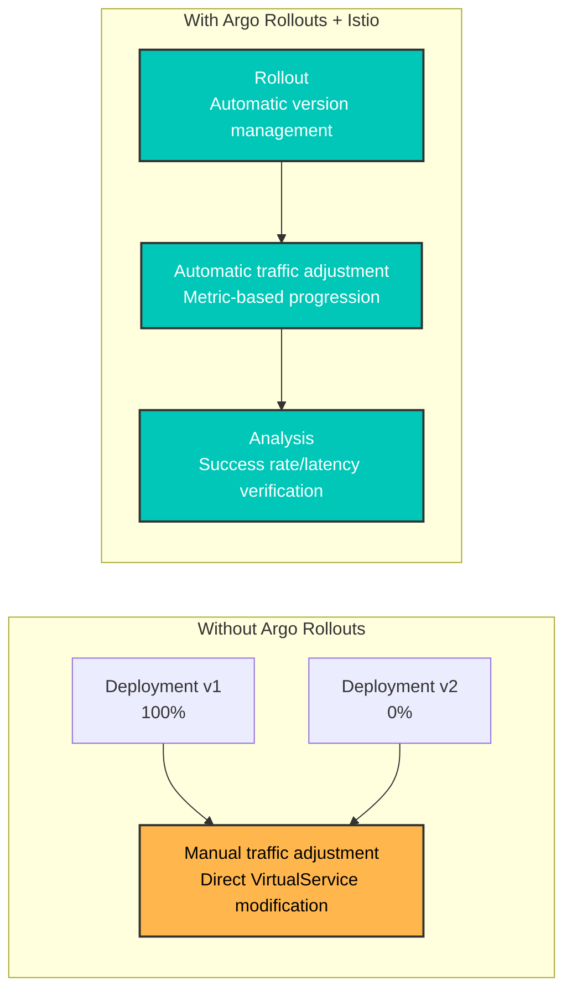
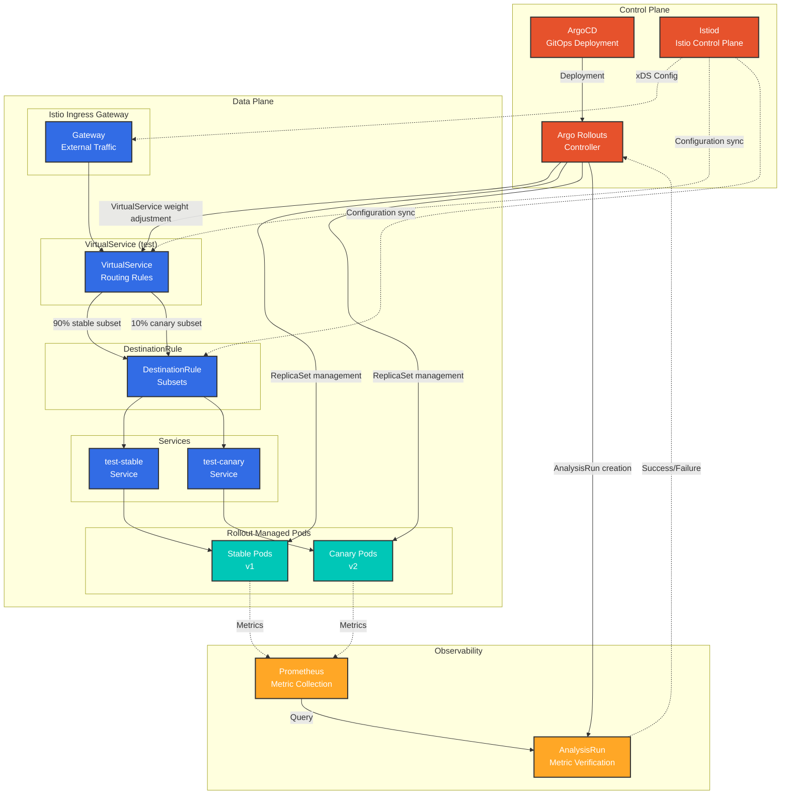
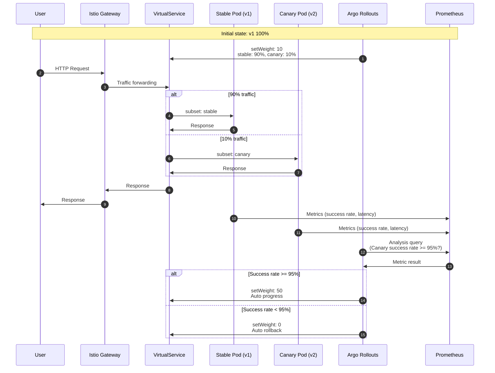
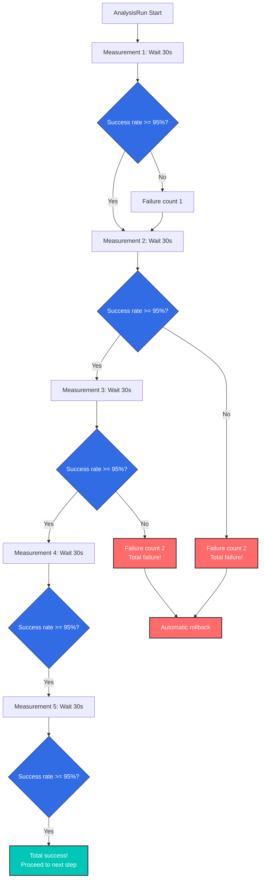
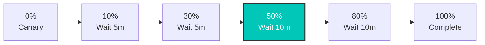
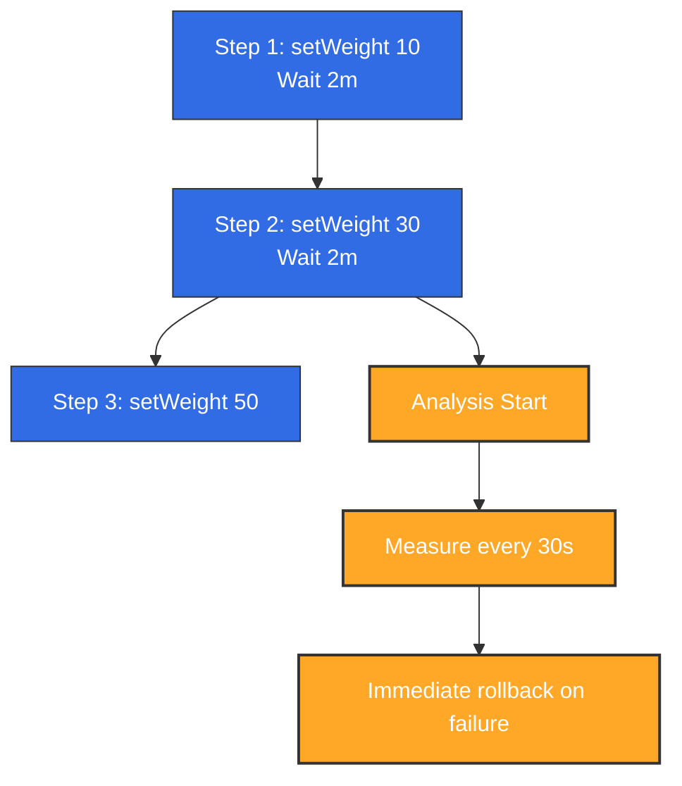
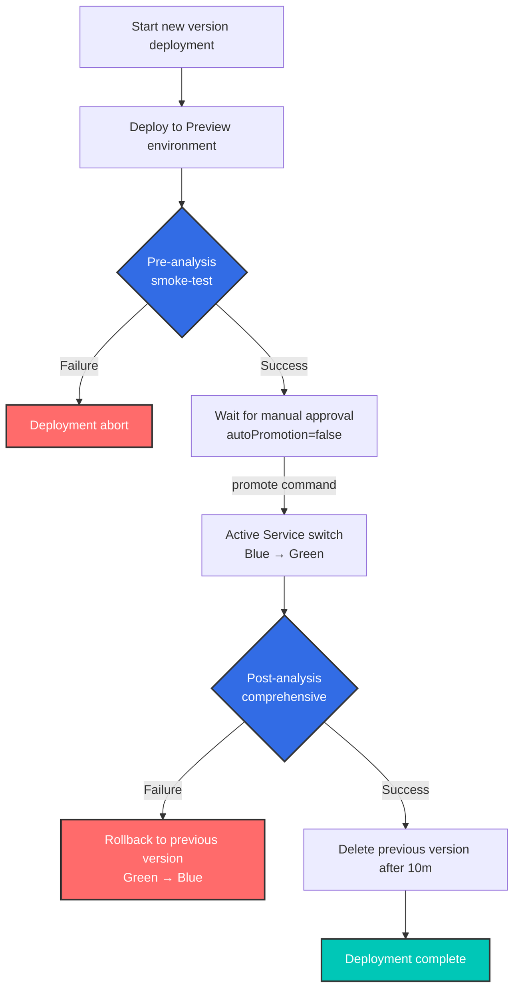

# Argo Rollouts and Istio Integration

> **Supported Versions**: Argo Rollouts 1.6+, Istio 1.18+
> **Last Updated**: February 19, 2026
> **Difficulty**: ⭐⭐⭐⭐ (Advanced)

This document explains in detail how to implement Progressive Delivery by integrating Argo Rollouts with Istio Service Mesh.

## Table of Contents

1. [Overview](#overview)
2. [Architecture](#architecture)
3. [Core Concepts](#core-concepts)
4. [Setup and Configuration](#setup-and-configuration)
5. [Traffic Routing Strategies](#traffic-routing-strategies)
6. [Analysis and Metrics](#analysis-and-metrics)
7. [Advanced Deployment Patterns](#advanced-deployment-patterns)
8. [Troubleshooting](#troubleshooting)
9. [Best Practices](#best-practices)

## Overview

### What is Argo Rollouts?

Argo Rollouts is a Progressive Delivery controller for Kubernetes that provides advanced deployment strategies:

- **Canary deployment**: Gradual traffic shifting
- **Blue/Green deployment**: Instant switching and rollback
- **Analysis-based automation**: Metric-based automatic progression/rollback
- **Traffic management integration**: Support for Istio, Nginx, ALB, etc.

### Benefits of Istio Integration



**Key Benefits**:
- ✅ **Automated Canary deployment**: Automatic VirtualService weight adjustment
- ✅ **Metric-based verification**: Automatic progression/rollback with Prometheus metrics
- ✅ **Fine-grained traffic control**: Leveraging Istio's L7 routing
- ✅ **Zero-downtime deployment**: No downtime during traffic switching
- ✅ **Automatic rollback**: Automatic rollback on error rate increase

### Supported Istio Resources

| Resource | Purpose | Argo Rollouts Management |
|----------|------|-------------------|
| **VirtualService** | Traffic routing rules | ✅ Automatic weight adjustment of routes |
| **DestinationRule** | Subset definition | ⚠️ Manual creation required |
| **Service** | Stable/Canary endpoints | ⚠️ Manual creation required |

## Architecture

### Overall Architecture



### Traffic Flow



## Core Concepts

### 1. Rollout Resource

Rollout is a custom resource that replaces Deployment and supports advanced deployment strategies.

**Comparison with Deployment**:

| Feature | Deployment | Rollout |
|------|-----------|---------|
| **Basic rollout** | ✅ RollingUpdate | ✅ RollingUpdate |
| **Canary deployment** | ❌ | ✅ Traffic weight control |
| **Blue/Green** | ❌ | ✅ Instant switching |
| **Analysis-based automation** | ❌ | ✅ AnalysisTemplate |
| **Traffic management integration** | ❌ | ✅ Istio, Nginx, ALB |
| **Automatic rollback** | ❌ | ✅ Metric-based |

### 2. VirtualService Management Method

**Important**: Argo Rollouts **overwrites the entire destinations array** of the specified route name.

```yaml
# VirtualService initial state
apiVersion: networking.istio.io/v1
kind: VirtualService
metadata:
  name: test
spec:
  http:
  - name: primary  # Route managed by Rollout
    route:
    - destination: {host: test, subset: stable}
      weight: 100
    - destination: {host: test, subset: canary}
      weight: 0
```

**Rollout configuration**:
```yaml
apiVersion: argoproj.io/v1alpha1
kind: Rollout
spec:
  strategy:
    canary:
      trafficRouting:
        istio:
          virtualService:
            name: test          # VirtualService name
            routes:
            - primary           # Route name to manage
          destinationRule:
            name: test          # DestinationRule name
            canarySubsetName: canary
            stableSubsetName: stable
      steps:
      - setWeight: 10  # → Modifies primary route of VirtualService
```

**When setWeight: 10 executes**:
```yaml
# Automatically modified by Argo Rollouts
http:
- name: primary
  route:
  - destination: {host: test, subset: stable}
    weight: 90   # ← Auto adjusted
  - destination: {host: test, subset: canary}
    weight: 10   # ← Auto adjusted
```

**Cautions**:
- ⚠️ Conflict occurs if multiple Rollouts reference the same route name
- ⚠️ Rollout manages **all destinations** of the route
- ⚠️ Same route cannot be shared even with different subset names

### 3. Subset and Service

**DestinationRule Subset**:
```yaml
apiVersion: networking.istio.io/v1
kind: DestinationRule
metadata:
  name: test
spec:
  host: test  # Matches Service name
  subsets:
  - name: stable
    labels: {}  # ← Empty labels (uses Service selector)
  - name: canary
    labels: {}  # ← Empty labels (uses Service selector)
```

**Stable/Canary Service**:
```yaml
# Stable Service
apiVersion: v1
kind: Service
metadata:
  name: test-stable
spec:
  selector:
    app: test
    # Label automatically added by Rollout
    rollouts-pod-template-hash: <stable-hash>
  ports:
  - port: 8080

---
# Canary Service
apiVersion: v1
kind: Service
metadata:
  name: test-canary
spec:
  selector:
    app: test
    # Label automatically added by Rollout
    rollouts-pod-template-hash: <canary-hash>
  ports:
  - port: 8080
```

**Operation method**:
1. When Rollout deploys new version, creates new `rollouts-pod-template-hash` label
2. Automatically adds that hash label to Canary pods
3. Canary Service selects only those pods
4. When Rollout completes, Stable Service updates with new hash

### 4. Analysis and Metrics

**AnalysisTemplate**:
```yaml
apiVersion: argoproj.io/v1alpha1
kind: AnalysisTemplate
metadata:
  name: success-rate
spec:
  args:
  - name: service-name
  - name: canary-hash
  metrics:
  - name: success-rate
    interval: 30s              # Measure every 30 seconds
    count: 5                   # 5 measurements
    successCondition: result >= 0.95  # Must be 95% or above for success
    failureLimit: 2            # Entire failure after 2 failures
    provider:
      prometheus:
        address: http://prometheus.istio-system:9090
        query: |
          sum(rate(
            istio_requests_total{
              destination_service_name="{{args.service-name}}",
              destination_workload_label_rollouts_pod_template_hash="{{args.canary-hash}}",
              response_code!~"5.*"
            }[2m]
          ))
          /
          sum(rate(
            istio_requests_total{
              destination_service_name="{{args.service-name}}",
              destination_workload_label_rollouts_pod_template_hash="{{args.canary-hash}}"
            }[2m]
          ))
```

**AnalysisRun**:


## Setup and Configuration

### Required Resource Creation

#### 1. Rollout Resource

```yaml
apiVersion: argoproj.io/v1alpha1
kind: Rollout
metadata:
  name: test
  namespace: default
spec:
  replicas: 3
  revisionHistoryLimit: 2  # Number of ReplicaSets to keep
  selector:
    matchLabels:
      app: test
  template:
    metadata:
      labels:
        app: test
    spec:
      containers:
      - name: app
        image: myapp:v1
        ports:
        - containerPort: 8080
        resources:
          requests:
            cpu: 100m
            memory: 128Mi
          limits:
            cpu: 200m
            memory: 256Mi
  strategy:
    canary:
      # Stable/Canary Service specification
      canaryService: test-canary
      stableService: test-stable

      # Istio traffic routing
      trafficRouting:
        istio:
          virtualService:
            name: test              # VirtualService name
            routes:
            - primary               # Route name to manage
          destinationRule:
            name: test              # DestinationRule name
            canarySubsetName: canary
            stableSubsetName: stable

      # Deployment steps
      steps:
      - setWeight: 10
      - pause: {duration: 5m}
      - setWeight: 20
      - pause: {duration: 5m}
      - setWeight: 50
      - pause: {duration: 5m}
      - setWeight: 80
      - pause: {duration: 5m}
```

#### 2. Stable/Canary Service

```yaml
# Stable Service
apiVersion: v1
kind: Service
metadata:
  name: test-stable
  namespace: default
spec:
  selector:
    app: test
    # rollouts-pod-template-hash is auto-added by Rollout
  ports:
  - name: http
    port: 8080
    targetPort: 8080

---
# Canary Service
apiVersion: v1
kind: Service
metadata:
  name: test-canary
  namespace: default
spec:
  selector:
    app: test
    # rollouts-pod-template-hash is auto-added by Rollout
  ports:
  - name: http
    port: 8080
    targetPort: 8080

---
# Unified Service (referenced by VirtualService)
apiVersion: v1
kind: Service
metadata:
  name: test
  namespace: default
spec:
  selector:
    app: test
  ports:
  - name: http
    port: 8080
    targetPort: 8080
```

#### 3. VirtualService

```yaml
apiVersion: networking.istio.io/v1
kind: VirtualService
metadata:
  name: test
  namespace: default
spec:
  hosts:
  - test
  - test.default.svc.cluster.local
  http:
  - name: primary  # Route managed by Rollout
    route:
    - destination:
        host: test
        subset: stable
      weight: 100  # ← Auto adjusted by Rollout
    - destination:
        host: test
        subset: canary
      weight: 0    # ← Auto adjusted by Rollout
```

#### 4. DestinationRule

```yaml
apiVersion: networking.istio.io/v1
kind: DestinationRule
metadata:
  name: test
  namespace: default
spec:
  host: test
  trafficPolicy:
    loadBalancer:
      simple: LEAST_REQUEST
  subsets:
  - name: stable
    labels: {}  # Empty labels (uses Service selector)
  - name: canary
    labels: {}  # Empty labels (uses Service selector)
```

### Deployment Workflow

```bash
# 1. Deploy new version
kubectl argo rollouts set image test app=myapp:v2

# 2. Check status (real-time monitoring)
kubectl argo rollouts get rollout test --watch

# Output example:
# Name:            test
# Namespace:       default
# Status:          ॥ Paused
# Strategy:        Canary
#   Step:          1/8
#   SetWeight:     10
#   ActualWeight:  10
# Images:          myapp:v1 (stable)
#                  myapp:v2 (canary)
# Replicas:
#   Desired:       3
#   Current:       4
#   Updated:       1
#   Ready:         4
#   Available:     4

# 3. Manually proceed to next step (after pause)
kubectl argo rollouts promote test

# 4. Immediate rollback (if issues occur)
kubectl argo rollouts abort test

# 5. Retry after rollback
kubectl argo rollouts retry rollout test
```

## Traffic Routing Strategies

### 1. Basic Canary (Weight-based)

```yaml
spec:
  strategy:
    canary:
      steps:
      - setWeight: 10   # 10% traffic
      - pause: {duration: 5m}
      - setWeight: 30
      - pause: {duration: 5m}
      - setWeight: 50
      - pause: {duration: 10m}
      - setWeight: 80
      - pause: {duration: 10m}
      # 100% auto transition
```

**Traffic transition graph**:


### 2. Header-based Routing

**Use case**: Expose Canary version only to specific user groups (internal testers)

```yaml
# VirtualService configuration
apiVersion: networking.istio.io/v1
kind: VirtualService
metadata:
  name: test
spec:
  http:
  # Priority 1: Header matching (Beta users → Canary)
  - name: header-route
    match:
    - headers:
        x-beta-user:
          exact: "true"
    route:
    - destination:
        host: test
        subset: canary
      weight: 100

  # Priority 2: Normal traffic (weight-based)
  - name: primary
    route:
    - destination:
        host: test
        subset: stable
      weight: 90
    - destination:
        host: test
        subset: canary
      weight: 10
```

```yaml
# Rollout configuration
spec:
  strategy:
    canary:
      trafficRouting:
        istio:
          virtualService:
            name: test
            routes:
            - primary  # Manages only primary route
      steps:
      - setWeight: 10
      - pause: {duration: 5m}
      - setWeight: 50
      - pause: {duration: 10m}
```

**Behavior**:
- Requests with `x-beta-user: true` header → 100% Canary
- Normal requests → Weight managed by Rollout (10% → 50% → 100%)

### 3. Mirror Traffic (Shadow Testing)

**Use case**: Copy production traffic to Canary (ignore response)

```yaml
apiVersion: networking.istio.io/v1
kind: VirtualService
metadata:
  name: test
spec:
  http:
  - name: primary
    route:
    - destination:
        host: test
        subset: stable
      weight: 100  # Actual traffic 100% Stable
    mirror:
      host: test
      subset: canary
    mirrorPercentage:
      value: 10.0  # Copy 10% to Canary (ignore response)
```

**Characteristics**:
- ✅ No impact on actual users (response only from Stable)
- ✅ Verify Canary performance/errors with production traffic
- ⚠️ Be careful with Canary write operations (potential data duplication)

### 4. Managing Multiple Routes

**Use case**: Adjust traffic for multiple paths simultaneously

```yaml
# VirtualService configuration
apiVersion: networking.istio.io/v1
kind: VirtualService
metadata:
  name: test
spec:
  http:
  - name: api-route  # API path
    match:
    - uri:
        prefix: /api
    route:
    - destination: {host: test, subset: stable}
      weight: 100
    - destination: {host: test, subset: canary}
      weight: 0

  - name: web-route  # Web path
    match:
    - uri:
        prefix: /web
    route:
    - destination: {host: test, subset: stable}
      weight: 100
    - destination: {host: test, subset: canary}
      weight: 0
```

```yaml
# Rollout configuration
spec:
  strategy:
    canary:
      trafficRouting:
        istio:
          virtualService:
            name: test
            routes:
            - api-route  # Manage both routes
            - web-route
      steps:
      - setWeight: 10  # Adjusts both routes to 10%
```

## Analysis and Metrics

Argo Rollouts uses Prometheus metrics collected by Istio to automatically determine the success of Canary deployments. Here is the integration architecture of Argo Rollouts and Istio metrics:


*Source: [Argo Rollouts Official Documentation](https://argo-rollouts.readthedocs.io/en/stable/features/traffic-management/istio/)*

### 1. Basic Analysis Integration

```yaml
apiVersion: argoproj.io/v1alpha1
kind: Rollout
spec:
  strategy:
    canary:
      analysis:
        templates:
        - templateName: success-rate
        args:
        - name: service-name
          value: test
      steps:
      - setWeight: 10
      - pause: {duration: 5m}
      - analysis:  # ← Analysis runs at this step
          templates:
          - templateName: success-rate
          args:
          - name: service-name
            value: test
      - setWeight: 50
```

### 2. Background Analysis

```yaml
spec:
  strategy:
    canary:
      analysis:
        templates:
        - templateName: success-rate
        startingStep: 2  # Runs continuously in background from step 2
        args:
        - name: service-name
          value: test
      steps:
      - setWeight: 10
      - pause: {duration: 2m}
      - setWeight: 30
      - pause: {duration: 2m}
      - setWeight: 50
```

**Behavior**:


### 3. Composite Metric Analysis

```yaml
apiVersion: argoproj.io/v1alpha1
kind: AnalysisTemplate
metadata:
  name: comprehensive-analysis
spec:
  args:
  - name: service-name
  - name: canary-hash
  metrics:
  # Metric 1: Success rate
  - name: success-rate
    interval: 30s
    count: 5
    successCondition: result >= 0.95
    failureLimit: 2
    provider:
      prometheus:
        address: http://prometheus.istio-system:9090
        query: |
          sum(rate(
            istio_requests_total{
              destination_service_name="{{args.service-name}}",
              destination_workload_label_rollouts_pod_template_hash="{{args.canary-hash}}",
              response_code!~"5.*"
            }[2m]
          ))
          /
          sum(rate(
            istio_requests_total{
              destination_service_name="{{args.service-name}}",
              destination_workload_label_rollouts_pod_template_hash="{{args.canary-hash}}"
            }[2m]
          ))

  # Metric 2: P95 Latency
  - name: latency-p95
    interval: 30s
    count: 5
    successCondition: result <= 0.5  # 500ms or less
    failureLimit: 2
    provider:
      prometheus:
        address: http://prometheus.istio-system:9090
        query: |
          histogram_quantile(0.95,
            sum(rate(
              istio_request_duration_milliseconds_bucket{
                destination_service_name="{{args.service-name}}",
                destination_workload_label_rollouts_pod_template_hash="{{args.canary-hash}}"
              }[2m]
            )) by (le)
          ) / 1000

  # Metric 3: Error rate
  - name: error-rate
    interval: 30s
    count: 5
    successCondition: result <= 0.01  # 1% or less
    failureLimit: 2
    provider:
      prometheus:
        address: http://prometheus.istio-system:9090
        query: |
          sum(rate(
            istio_requests_total{
              destination_service_name="{{args.service-name}}",
              destination_workload_label_rollouts_pod_template_hash="{{args.canary-hash}}",
              response_code=~"5.*"
            }[2m]
          ))
          /
          sum(rate(
            istio_requests_total{
              destination_service_name="{{args.service-name}}",
              destination_workload_label_rollouts_pod_template_hash="{{args.canary-hash}}"
            }[2m]
          ))
```

### 4. Pre/Post Analysis

```yaml
spec:
  strategy:
    canary:
      # Pre-analysis (before deployment)
      analysis:
        templates:
        - templateName: pre-deployment-check
        args:
        - name: service-name
          value: test

      steps:
      - setWeight: 10
      - pause: {duration: 5m}
      - setWeight: 50

      # Post-analysis (after deployment)
      analysis:
        templates:
        - templateName: post-deployment-check
        args:
        - name: service-name
          value: test
```

## Advanced Deployment Patterns

### 1. Blue/Green Deployment

```yaml
apiVersion: argoproj.io/v1alpha1
kind: Rollout
metadata:
  name: test
spec:
  replicas: 3
  strategy:
    blueGreen:
      # Preview/Active Service specification
      previewService: test-preview
      activeService: test-active

      # Auto promotion (default: manual)
      autoPromotionEnabled: false

      # Pre-analysis
      prePromotionAnalysis:
        templates:
        - templateName: smoke-test

      # Post-analysis
      postPromotionAnalysis:
        templates:
        - templateName: comprehensive-analysis
        args:
        - name: service-name
          value: test

      # Previous version retention time
      scaleDownDelaySeconds: 600  # Delete previous version after 10 minutes
```

**VirtualService (Blue/Green)**:
```yaml
apiVersion: networking.istio.io/v1
kind: VirtualService
metadata:
  name: test
spec:
  http:
  - route:
    - destination:
        host: test-active  # ← Auto switched by Rollout
      weight: 100
```

**Operation flow**:


### 2. Canary with Experiment

**Use case**: Test multiple versions simultaneously during Canary deployment

```yaml
apiVersion: argoproj.io/v1alpha1
kind: Rollout
spec:
  strategy:
    canary:
      steps:
      - setWeight: 10
      - pause: {duration: 2m}

      # Experiment execution
      - experiment:
          duration: 10m
          templates:
          - name: canary-v2
            specRef: canary
            weight: 10
          - name: experimental-v3
            specRef: experimental
            weight: 5
          analyses:
          - name: compare-versions
            templateName: version-comparison

      - setWeight: 50
      - pause: {duration: 5m}
```

### 3. Progressive Rollout

```yaml
spec:
  strategy:
    canary:
      # Very slow rollout
      steps:
      - setWeight: 1    # Start from 1%
      - pause: {duration: 1h}
      - setWeight: 5
      - pause: {duration: 1h}
      - setWeight: 10
      - pause: {duration: 2h}
      - setWeight: 25
      - pause: {duration: 4h}
      - setWeight: 50
      - pause: {duration: 8h}
      - setWeight: 75
      - pause: {duration: 8h}
      # 100% (total 24+ hours)

      # Background Analysis
      analysis:
        templates:
        - templateName: comprehensive-analysis
        startingStep: 1
```

## Troubleshooting

### 1. VirtualService Not Updating

**Symptom**:
```bash
kubectl argo rollouts get rollout test
# Status: ॥ Paused
# Message: CannotUpdateVirtualService: ...
```

**Cause**:
- VirtualService doesn't exist
- Route name is incorrect
- Istio is not installed

**Solution**:
```bash
# 1. Check VirtualService
kubectl get virtualservice test -o yaml

# 2. Check route name
kubectl get virtualservice test -o jsonpath='{.spec.http[*].name}'

# 3. Check Rollout configuration
kubectl get rollout test -o jsonpath='{.spec.strategy.canary.trafficRouting.istio}'
```

### 2. Canary Pod Not Receiving Traffic

**Symptom**: No traffic to Canary pod even though setWeight: 10

**Cause**:
- DestinationRule subset incorrectly configured
- Service selector not finding pods

**Verification**:
```bash
# 1. Check pod labels
kubectl get pods -l app=test --show-labels

# Output:
# NAME                    LABELS
# test-abc123-xyz         app=test,rollouts-pod-template-hash=abc123
# test-def456-xyz         app=test,rollouts-pod-template-hash=def456

# 2. Check if Canary Service selects correct pods
kubectl get endpoints test-canary

# 3. Check VirtualService → DestinationRule → Service path
istioctl proxy-config clusters <pod-name> | grep test
```

### 3. Analysis Failure

**Symptom**:
```bash
kubectl get analysisrun
# NAME                       STATUS   AGE
# test-abc123-1              Failed   5m
```

**Verification**:
```bash
# Check Analysis logs
kubectl describe analysisrun test-abc123-1

# Test Prometheus query
kubectl port-forward -n istio-system svc/prometheus 9090:9090

# Run query in browser
# http://localhost:9090/graph
```

**Common issues**:
- Prometheus address is incorrect
- Metric doesn't exist (insufficient traffic)
- Query syntax error

### 4. Rollback Not Working

**Symptom**: `kubectl argo rollouts abort` not working

**Cause**: All steps already completed (100%)

**Solution**:
```bash
# 1. Check current status
kubectl argo rollouts status test

# 2. Revert to previous version
kubectl argo rollouts undo test

# Or to specific revision
kubectl argo rollouts undo test --to-revision=2
```

### 5. Debugging Commands

```bash
# 1. Rollout status (detailed)
kubectl argo rollouts get rollout test

# 2. Rollout events
kubectl describe rollout test

# 3. Check ReplicaSet
kubectl get replicaset -l app=test

# 4. Check VirtualService weight
kubectl get virtualservice test -o yaml | grep -A 10 "name: primary"

# 5. Check Istio proxy configuration
istioctl proxy-config route <pod-name> --name 8080

# 6. Check AnalysisRun
kubectl get analysisrun -l rollout=test

# 7. Rollout Controller logs
kubectl logs -n argo-rollouts deployment/argo-rollouts
```

## Best Practices

### 1. Deployment Step Design

**Recommended steps**:
```yaml
steps:
- setWeight: 5      # Very small start
  pause: {duration: 5m}
- setWeight: 10     # Small-scale verification
  pause: {duration: 10m}
- setWeight: 25     # Meaningful traffic
  pause: {duration: 15m}
- setWeight: 50     # Half transition
  pause: {duration: 30m}
- setWeight: 75     # Most transition
  pause: {duration: 30m}
# 100% auto complete
```

**Principles**:
- ✅ Start with small steps (5-10%)
- ✅ Sufficient verification time at each step
- ✅ Longer wait time after 50% (most of traffic)
- ✅ Transition last 20-30% quickly

### 2. Analysis Configuration

```yaml
metrics:
- name: success-rate
  interval: 30s        # Not too short (minimum 30s)
  count: 5             # Sufficient samples (minimum 5)
  successCondition: result >= 0.95  # Reasonable threshold
  failureLimit: 2      # Don't fail immediately
```

**Principles**:
- ✅ Multiple metric combinations (success rate + latency + error rate)
- ✅ Sufficient measurement time (minimum 2-3 minutes)
- ✅ Allow temporary errors with `failureLimit`
- ✅ Monitor entire deployment with background Analysis

### 3. Service Configuration

```yaml
# ❌ Wrong example: version label in selector
apiVersion: v1
kind: Service
metadata:
  name: test-stable
spec:
  selector:
    app: test
    version: v1  # ← Wrong! Should use hash managed by Rollout

---
# ✅ Correct example: Rollout manages hash
apiVersion: v1
kind: Service
metadata:
  name: test-stable
spec:
  selector:
    app: test
    # rollouts-pod-template-hash is auto-added
```

### 4. Resource Management

```yaml
spec:
  revisionHistoryLimit: 2  # Minimum 2 (for rollback)
  progressDeadlineSeconds: 600  # 10 minute timeout

  template:
    spec:
      containers:
      - name: app
        resources:
          requests:
            cpu: 100m
            memory: 128Mi
          limits:
            cpu: 200m      # 2x of request
            memory: 256Mi  # 2x of request
```

### 5. HA Configuration

```yaml
spec:
  replicas: 3  # Minimum 3 (1 per AZ)

  strategy:
    canary:
      maxSurge: 1         # Maximum 1 extra pod
      maxUnavailable: 0   # Maintain minimum replicas
```

**PodDisruptionBudget**:
```yaml
apiVersion: policy/v1
kind: PodDisruptionBudget
metadata:
  name: test-pdb
spec:
  minAvailable: 2  # Maintain minimum 2
  selector:
    matchLabels:
      app: test
```

### 6. Deployment Checklist

Before deployment:
- [ ] Stable/Canary Service created
- [ ] VirtualService and DestinationRule created
- [ ] AnalysisTemplate defined
- [ ] Prometheus metric collection verified
- [ ] Rollout steps reviewed

During deployment:
- [ ] Monitor with `kubectl argo rollouts get rollout --watch`
- [ ] Verify Canary pod traffic reception
- [ ] Confirm Analysis metrics are normal
- [ ] Monitor error logs

After deployment:
- [ ] Confirm 100% transition
- [ ] Verify previous ReplicaSet deletion
- [ ] Final metric verification

### 7. Gradual Adoption

**Step 1**: Basic Canary
```yaml
steps:
- setWeight: 10
- pause: {}  # Manual approval
```

**Step 2**: Add automatic Analysis
```yaml
steps:
- setWeight: 10
- pause: {duration: 5m}
- analysis:
    templates:
    - templateName: success-rate
```

**Step 3**: Background Analysis
```yaml
analysis:
  templates:
  - templateName: success-rate
  startingStep: 1
```

**Step 4**: Composite metrics
```yaml
analysis:
  templates:
  - templateName: comprehensive-analysis  # Success rate + latency + error rate
```

## References

### Related Documents
- [Traffic Splitting - Canary Deployment](../traffic-management/04-traffic-splitting.md)
- [Zone-Aware Argo Rollouts](09-zone-aware-argo-rollouts.md)
- [VirtualService](../traffic-management/01-gateway-virtualservice.md)
- [DestinationRule](../traffic-management/03-destination-rule.md)

### External Links
- [Argo Rollouts Official Documentation](https://argo-rollouts.readthedocs.io/)
- [Istio Traffic Management](https://argo-rollouts.readthedocs.io/en/stable/features/traffic-management/istio/)
- [AnalysisTemplate Examples](https://github.com/argoproj/argo-rollouts/tree/master/examples)

## Next Steps

1. [Zone-Aware Rollout Implementation](09-zone-aware-argo-rollouts.md)
