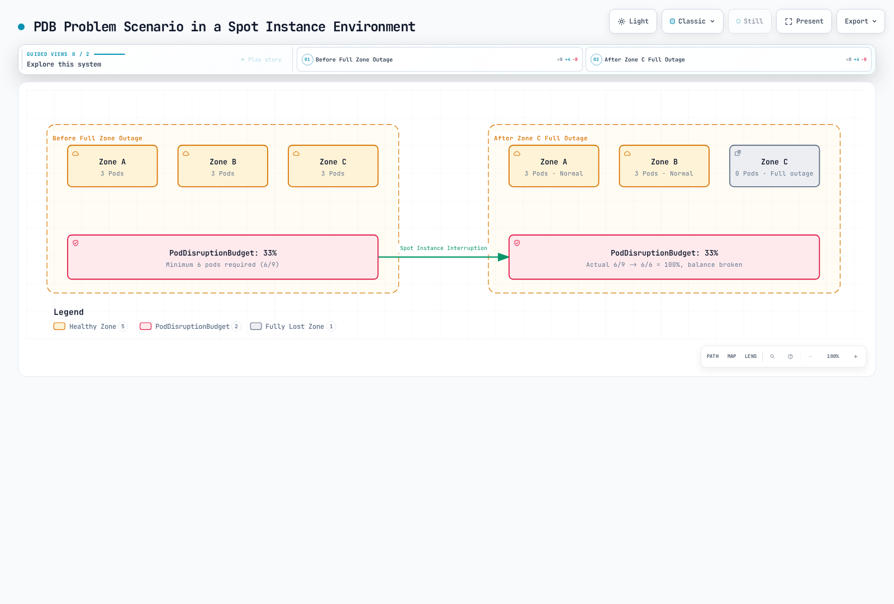
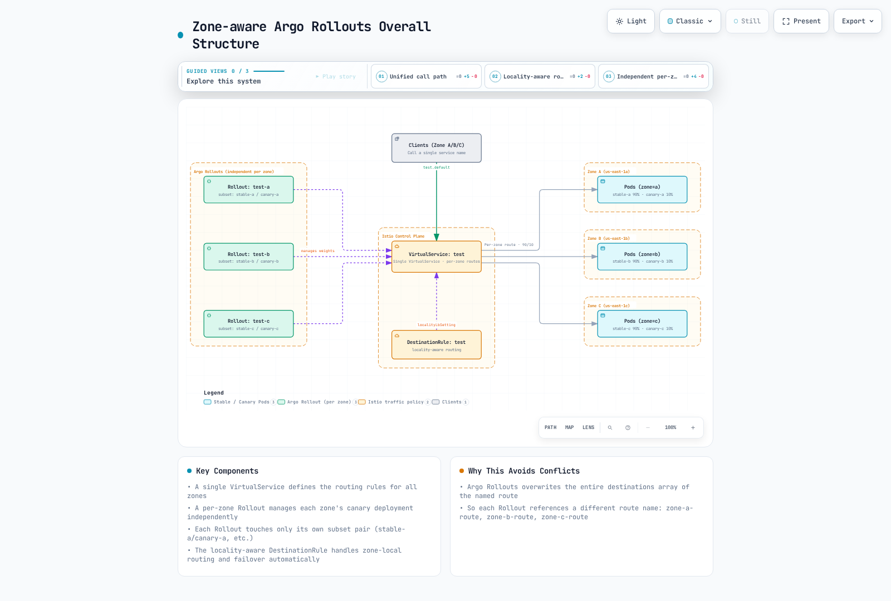
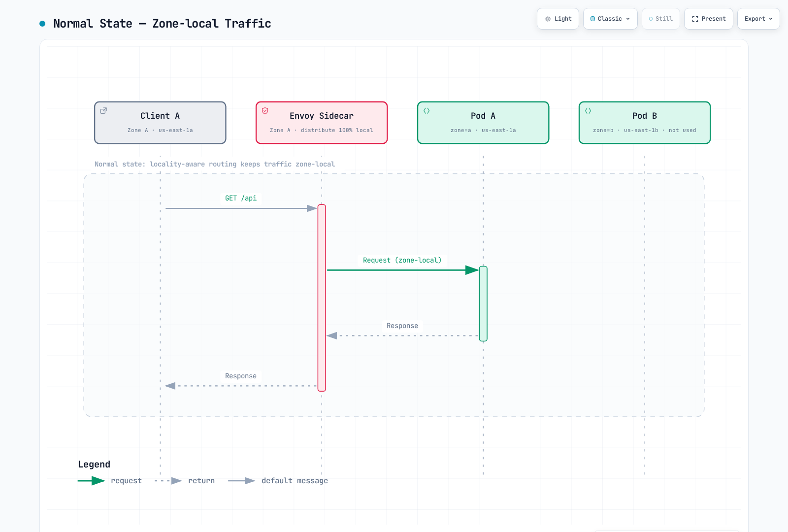
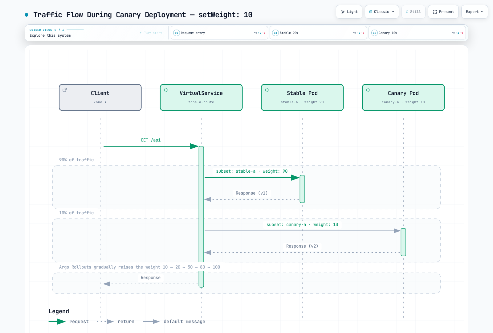

# Zone-Aware Argo Rollouts

> **Supported Versions**: Istio 1.18+, Argo Rollouts 1.6+ **Last Updated**: February 19, 2026 **Difficulty**: Expert

This document explains how to set up independent Argo Rollouts Canary deployments per AWS Availability Zone while leveraging Istio's locality-aware routing for automatic failover.

## Table of Contents

1. [Problem Definition](09-zone-aware-argo-rollouts.md#problem-definition)
2. [Architecture Overview](09-zone-aware-argo-rollouts.md#architecture-overview)
3. [Key Design Decisions](09-zone-aware-argo-rollouts.md#key-design-decisions)
4. [Implementation Guide](09-zone-aware-argo-rollouts.md#implementation-guide)
5. [Traffic Flow](09-zone-aware-argo-rollouts.md#traffic-flow)
6. [Troubleshooting](09-zone-aware-argo-rollouts.md#troubleshooting)
7. [Best Practices](09-zone-aware-argo-rollouts.md#best-practices)

## Problem Definition

### Real-World Use Case: PDB Management in Spot Instance Environments

**Background**: In environments using AWS Spot Instances, all nodes in a specific Availability Zone (Zone) can suddenly be terminated.

**Problem Scenario**:



[🔍 View interactive diagram](https://www.atomai.click/kubernetes-docs/archmaps/en-service-mesh-istio-advanced-09-zone-aware-argo-rollouts-0.html)

**Why Zone-specific Rollouts are Needed?**

1. **Independent PDB Management per Rollout**
   * Each Zone's Rollout manages its own PDB
   * Zone A and B's PDBs are unaffected even if Zone C completely disappears
2. **Zone-level Recovery**
   * Only the affected Rollout restarts when Zone C recovers
   * No impact on deployment state of other Zones
3. **Spot Instance Interruption Response**
   * Service continues in other Zones even when all Spot Instances in a specific Zone are terminated
   * Automatic traffic switching via Istio locality failover

**PDB Configuration Example** (per Zone):

```yaml
# Zone A - PDB (Independent per Rollout)
apiVersion: policy/v1
kind: PodDisruptionBudget
metadata:
  name: test-a-pdb
  namespace: default
spec:
  minAvailable: 1  # Minimum 1 in Zone A
  selector:
    matchLabels:
      app: test
      zone: a
---
# Zone B - PDB
apiVersion: policy/v1
kind: PodDisruptionBudget
metadata:
  name: test-b-pdb
  namespace: default
spec:
  minAvailable: 1  # Minimum 1 in Zone B
  selector:
    matchLabels:
      app: test
      zone: b
---
# Zone C - PDB
apiVersion: policy/v1
kind: PodDisruptionBudget
metadata:
  name: test-c-pdb
  namespace: default
spec:
  minAvailable: 1  # Minimum 1 in Zone C
  selector:
    matchLabels:
      app: test
      zone: c
```

**Benefits**:

* Zone A and B's PDBs work normally even during complete Zone C outage
* Each Zone can recover independently
* Canary deployments also proceed independently per Zone

### Requirements

1. **Independent Zone Deployment**: Independent Canary deployments for each of 3 Availability Zones (a, b, c)
2. **Zone Isolation**: Each zone's traffic is processed only within that zone by default
3. **Failover Only**: Traffic switches to other zones only on failure (a->b, b->c, c->a)
4. **Unified Calling**: Clients call using a single service name
5. **Spot Instance Response**: Service continuity guaranteed even during Zone-level outages

### Common Problems

**Problem**: Conflicts occur when multiple Argo Rollouts reference the same VirtualService

```yaml
# Wrong approach: All Rollouts try to modify the same route
apiVersion: argoproj.io/v1alpha1
kind: Rollout
metadata:
  name: test-a
spec:
  strategy:
    canary:
      trafficRouting:
        istio:
          virtualService:
            name: test  # All zone Rollouts reference same VirtualService
            routes:
            - primary  # Trying to modify same route simultaneously -> Conflict!
```

**Solution**: Separation using Zone-specific routes

**Important**: Argo Rollouts **manages the entire destinations array** of the specified route name. Therefore, if multiple Rollouts reference the same route name, each Rollout will overwrite each other's settings. Conflicts occur even with different subset configurations.

## Architecture Overview

### Overall Structure



[🔍 View interactive diagram](https://www.atomai.click/kubernetes-docs/archmaps/en-service-mesh-istio-advanced-09-zone-aware-argo-rollouts-1.html)

### Key Components

1. **Single VirtualService**: Defines traffic routing rules for all zones
2. **Zone-specific Rollout**: Manages independent Canary deployment in each zone
3. **Subset-based Separation**: Each Rollout manages unique subset pairs (stable-a/canary-a, etc.)
4. **Locality-aware DestinationRule**: Automatic zone-local routing and failover

## Key Design Decisions

### 1. Single VirtualService + Zone-specific Route Separation

**Why is this approach needed?**

Argo Rollouts operates by overwriting the entire destinations array of the specified route name. Therefore, **each Zone's Rollout must manage independent route names** to avoid conflicts:

```yaml
# VirtualService: Zone-specific routes defined in single VirtualService
http:
- name: zone-a-route  # Rollout A manages stable-a/canary-a for this route
  match:
  - sourceLabels:
      topology.istio.io/zone: us-east-1a
  route:
  - destination: {host: test, subset: stable-a}
    weight: 90
  - destination: {host: test, subset: canary-a}
    weight: 10

- name: zone-b-route  # Rollout B manages stable-b/canary-b for this route
  match:
  - sourceLabels:
      topology.istio.io/zone: us-east-1b
  route:
  - destination: {host: test, subset: stable-b}
    weight: 90
  - destination: {host: test, subset: canary-b}
    weight: 10
```

**Core Principle**:

* Each Rollout references **different route names** (`zone-a-route`, `zone-b-route`, `zone-c-route`)
* Each route processes only traffic from that Zone via **sourceLabels match**
* Locality-aware routing automatically prioritizes zone-local endpoints

### 2. Locality-aware Routing

**Default Behavior**:

* Zone A client -> Zone A Pod (100%)
* Zone B client -> Zone B Pod (100%)
* Zone C client -> Zone C Pod (100%)

**On Failover**:

* Zone A failure -> Automatic switch to Zone B
* Zone B failure -> Automatic switch to Zone C
* Zone C failure -> Automatic switch to Zone A

### 3. Unified Service Calling

Clients use a single DNS name:

```bash
# Call like this
curl http://test.default.svc.cluster.local:8080

# Istio automatically routes to zone-local endpoint
```

## Implementation Guide

### 1. Create Common Service

**Important**: Do not include zone label in `selector` (selects Pods from all zones)

```yaml
apiVersion: v1
kind: Service
metadata:
  name: test
  namespace: default
spec:
  selector:
    app: test  # No zone label - selects Pods from all zones
  ports:
  - name: http
    port: 8080
    targetPort: 8080
```

### 2. Zone-specific Rollout Services

Stable/canary Services managed by each Rollout:

```yaml
# Zone A - Stable Service
apiVersion: v1
kind: Service
metadata:
  name: test-stable-a
  namespace: default
spec:
  selector:
    app: test
    zone: a  # Selects only Zone A stable Pods
  ports:
  - name: http
    port: 8080
    targetPort: 8080
---
# Zone A - Canary Service
apiVersion: v1
kind: Service
metadata:
  name: test-canary-a
  namespace: default
spec:
  selector:
    app: test
    zone: a  # Selects only Zone A canary Pods
  ports:
  - name: http
    port: 8080
    targetPort: 8080
---
# Zone B - Stable Service
apiVersion: v1
kind: Service
metadata:
  name: test-stable-b
  namespace: default
spec:
  selector:
    app: test
    zone: b
  ports:
  - name: http
    port: 8080
    targetPort: 8080
---
# Zone B - Canary Service
apiVersion: v1
kind: Service
metadata:
  name: test-canary-b
  namespace: default
spec:
  selector:
    app: test
    zone: b
  ports:
  - name: http
    port: 8080
    targetPort: 8080
---
# Zone C - Stable Service
apiVersion: v1
kind: Service
metadata:
  name: test-stable-c
  namespace: default
spec:
  selector:
    app: test
    zone: c
  ports:
  - name: http
    port: 8080
    targetPort: 8080
---
# Zone C - Canary Service
apiVersion: v1
kind: Service
metadata:
  name: test-canary-c
  namespace: default
spec:
  selector:
    app: test
    zone: c
  ports:
  - name: http
    port: 8080
    targetPort: 8080
```

### 3. Single VirtualService with Zone-specific Routes

Single VirtualService handling traffic for all zones (Zone-specific route separation):

```yaml
apiVersion: networking.istio.io/v1
kind: VirtualService
metadata:
  name: test
  namespace: default
spec:
  hosts:
  - test
  - test.default.svc.cluster.local
  http:
  # Zone A route (Managed by Rollout A)
  - name: zone-a-route
    match:
    - sourceLabels:
        topology.kubernetes.io/zone: us-east-1a
    route:
    - destination:
        host: test
        subset: stable-a
      weight: 90
    - destination:
        host: test
        subset: canary-a
      weight: 10
  # Zone B route (Managed by Rollout B)
  - name: zone-b-route
    match:
    - sourceLabels:
        topology.kubernetes.io/zone: us-east-1b
    route:
    - destination:
        host: test
        subset: stable-b
      weight: 90
    - destination:
        host: test
        subset: canary-b
      weight: 10
  # Zone C route (Managed by Rollout C)
  - name: zone-c-route
    match:
    - sourceLabels:
        topology.kubernetes.io/zone: us-east-1c
    route:
    - destination:
        host: test
        subset: stable-c
      weight: 90
    - destination:
        host: test
        subset: canary-c
      weight: 10
```

**Important Changes**:

* Previous: All Zones sharing same `primary` route -> **Conflict occurred**
* Fixed: Each Zone uses independent route names (`zone-a-route`, `zone-b-route`, `zone-c-route`)
* Added: Zone-specific traffic separation via `sourceLabels.topology.kubernetes.io/zone` match

**How it Works**:

1. Requests from Zone A pods -> `zone-a-route` matched
2. Rollout A modifies only `zone-a-route` weights (no impact on other Zones)
3. Locality-aware routing automatically prioritizes zone-local endpoints

### 4. DestinationRule with Locality Settings

```yaml
apiVersion: networking.istio.io/v1
kind: DestinationRule
metadata:
  name: test
  namespace: default
spec:
  host: test
  trafficPolicy:
    loadBalancer:
      localityLbSetting:
        enabled: true
        # Each zone processes only local traffic by default
        distribute:
        - from: us-east-1/us-east-1a/*
          to:
            "us-east-1/us-east-1a/*": 100  # Zone A -> Zone A (100%)
        - from: us-east-1/us-east-1b/*
          to:
            "us-east-1/us-east-1b/*": 100  # Zone B -> Zone B (100%)
        - from: us-east-1/us-east-1c/*
          to:
            "us-east-1/us-east-1c/*": 100  # Zone C -> Zone C (100%)
        # Failover settings: a->b, b->c, c->a
        failover:
        - from: us-east-1/us-east-1a
          to: us-east-1/us-east-1b  # Zone A failure -> Zone B
        - from: us-east-1/us-east-1b
          to: us-east-1/us-east-1c  # Zone B failure -> Zone C
        - from: us-east-1/us-east-1c
          to: us-east-1/us-east-1a  # Zone C failure -> Zone A
    # Outlier Detection for fast failure detection
    outlierDetection:
      consecutiveErrors: 3        # 3 consecutive failures
      interval: 10s               # Check every 10 seconds
      baseEjectionTime: 30s       # Exclude for 30 seconds
      maxEjectionPercent: 100     # Up to 100% can be excluded
  # Define stable/canary subsets per zone
  subsets:
  # Zone A subsets
  - name: stable-a
    labels:
      app: test
      zone: a
  - name: canary-a
    labels:
      app: test
      zone: a
  # Zone B subsets
  - name: stable-b
    labels:
      app: test
      zone: b
  - name: canary-b
    labels:
      app: test
      zone: b
  # Zone C subsets
  - name: stable-c
    labels:
      app: test
      zone: c
  - name: canary-c
    labels:
      app: test
      zone: c
```

### 5. Zone-specific Rollout Configuration

#### Zone A Rollout

```yaml
apiVersion: argoproj.io/v1alpha1
kind: Rollout
metadata:
  name: test-a
  namespace: default
spec:
  replicas: 3
  selector:
    matchLabels:
      app: test
      zone: a
  template:
    metadata:
      labels:
        app: test
        zone: a
    spec:
      # Deploy Pods only to Zone A
      affinity:
        nodeAffinity:
          requiredDuringSchedulingIgnoredDuringExecution:
            nodeSelectorTerms:
            - matchExpressions:
              - key: topology.kubernetes.io/zone
                operator: In
                values:
                - us-east-1a
      containers:
      - name: app
        image: myapp:v1
        ports:
        - containerPort: 8080
        env:
        - name: ZONE
          value: "a"
  strategy:
    canary:
      # Zone A specific Services
      canaryService: test-canary-a
      stableService: test-stable-a
      trafficRouting:
        istio:
          virtualService:
            name: test              # Common VirtualService
            routes:
            - zone-a-route          # Zone A specific route
          destinationRule:
            name: test              # Common DestinationRule
            canarySubsetName: canary-a  # Zone A specific subset
            stableSubsetName: stable-a  # Zone A specific subset
      steps:
      - setWeight: 10
      - pause: {duration: 5m}
      - setWeight: 20
      - pause: {duration: 5m}
      - setWeight: 50
      - pause: {duration: 5m}
      - setWeight: 80
      - pause: {duration: 5m}
```

#### Zone B Rollout

```yaml
apiVersion: argoproj.io/v1alpha1
kind: Rollout
metadata:
  name: test-b
  namespace: default
spec:
  replicas: 3
  selector:
    matchLabels:
      app: test
      zone: b
  template:
    metadata:
      labels:
        app: test
        zone: b
    spec:
      # Deploy Pods only to Zone B
      affinity:
        nodeAffinity:
          requiredDuringSchedulingIgnoredDuringExecution:
            nodeSelectorTerms:
            - matchExpressions:
              - key: topology.kubernetes.io/zone
                operator: In
                values:
                - us-east-1b
      containers:
      - name: app
        image: myapp:v1
        ports:
        - containerPort: 8080
        env:
        - name: ZONE
          value: "b"
  strategy:
    canary:
      # Zone B specific Services
      canaryService: test-canary-b
      stableService: test-stable-b
      trafficRouting:
        istio:
          virtualService:
            name: test              # Common VirtualService
            routes:
            - zone-b-route          # Zone B specific route
          destinationRule:
            name: test              # Common DestinationRule
            canarySubsetName: canary-b  # Zone B specific subset
            stableSubsetName: stable-b  # Zone B specific subset
      steps:
      - setWeight: 10
      - pause: {duration: 5m}
      - setWeight: 20
      - pause: {duration: 5m}
      - setWeight: 50
      - pause: {duration: 5m}
      - setWeight: 80
      - pause: {duration: 5m}
```

#### Zone C Rollout

```yaml
apiVersion: argoproj.io/v1alpha1
kind: Rollout
metadata:
  name: test-c
  namespace: default
spec:
  replicas: 3
  selector:
    matchLabels:
      app: test
      zone: c
  template:
    metadata:
      labels:
        app: test
        zone: c
    spec:
      # Deploy Pods only to Zone C
      affinity:
        nodeAffinity:
          requiredDuringSchedulingIgnoredDuringExecution:
            nodeSelectorTerms:
            - matchExpressions:
              - key: topology.kubernetes.io/zone
                operator: In
                values:
                - us-east-1c
      containers:
      - name: app
        image: myapp:v1
        ports:
        - containerPort: 8080
        env:
        - name: ZONE
          value: "c"
  strategy:
    canary:
      # Zone C specific Services
      canaryService: test-canary-c
      stableService: test-stable-c
      trafficRouting:
        istio:
          virtualService:
            name: test              # Common VirtualService
            routes:
            - zone-c-route          # Zone C specific route
          destinationRule:
            name: test              # Common DestinationRule
            canarySubsetName: canary-c  # Zone C specific subset
            stableSubsetName: stable-c  # Zone C specific subset
      steps:
      - setWeight: 10
      - pause: {duration: 5m}
      - setWeight: 20
      - pause: {duration: 5m}
      - setWeight: 50
      - pause: {duration: 5m}
      - setWeight: 80
      - pause: {duration: 5m}
```

## Traffic Flow

### Normal State (Zone-local Traffic)



[🔍 View interactive diagram](https://www.atomai.click/kubernetes-docs/archmaps/en-service-mesh-istio-advanced-09-zone-aware-argo-rollouts-2.html)

### Failover Scenario


[🔍 View interactive diagram](https://www.atomai.click/kubernetes-docs/archmaps/en-service-mesh-istio-advanced-09-zone-aware-argo-rollouts-3.html)

### Traffic Flow During Canary Deployment



[🔍 View interactive diagram](https://www.atomai.click/kubernetes-docs/archmaps/en-service-mesh-istio-advanced-09-zone-aware-argo-rollouts-4.html)

## Troubleshooting

### 1. VirtualService Conflict Error

**Symptoms**:

```bash
Error: VirtualService update conflict
```

**Cause**: Multiple Rollouts trying to modify the same route simultaneously

**Resolution**:

```yaml
# Configure each Rollout to manage unique subsets
spec:
  strategy:
    canary:
      trafficRouting:
        istio:
          destinationRule:
            canarySubsetName: canary-a  # Different subset per Zone
            stableSubsetName: stable-a
```

### 2. Cross-zone Traffic Occurring

**Symptoms**: Traffic sent to other zones without failover

**Cause**: Incorrect `distribute` settings

**Resolution**:

```yaml
# Correct distribute settings
distribute:
- from: us-east-1/us-east-1a/*
  to:
    "us-east-1/us-east-1a/*": 100  # 100% local only
```

### 3. Failover Not Working

**Symptoms**: No failover to other zones even during Zone failure

**Cause**: Outlier detection disabled or settings too slow

**Resolution**:

```yaml
# Fast failure detection
outlierDetection:
  consecutiveErrors: 3      # Detect even after just 3 failures
  interval: 10s             # Check every 10 seconds
  baseEjectionTime: 30s     # Exclude for 30 seconds
```

### 4. Rollout Stuck

**Symptoms**: Canary deployment not progressing

**Verification**:

```bash
# Check Rollout status
kubectl argo rollouts get rollout test-a -n default

# Check VirtualService weights
kubectl get virtualservice test -n default -o yaml | grep weight

# Check DestinationRule subsets
kubectl get destinationrule test -n default -o yaml
```

### 5. Debugging Commands

```bash
# 1. Verify Pods deployed to correct zones
kubectl get pods -l app=test -o wide
kubectl get nodes --show-labels | grep topology.kubernetes.io/zone

# 2. Verify locality routing configuration
istioctl proxy-config endpoint <pod-name> --cluster "outbound|8080||test.default.svc.cluster.local"

# 3. Verify VirtualService synchronization
istioctl proxy-config route <pod-name> --name 8080

# 4. Check outlier detection status
kubectl exec <pod-name> -c istio-proxy -- curl localhost:15000/clusters | grep outlier

# 5. Check Argo Rollouts logs
kubectl logs -n argo-rollouts deployment/argo-rollouts
```

## Best Practices

### 1. Rollout Synchronization

**Problem**: Increased complexity when deploying multiple zone Rollouts simultaneously

**Recommendation**:

```bash
# Sequential deployment per Zone
kubectl argo rollouts promote test-a -n default
# Wait 5 minutes and monitor
kubectl argo rollouts promote test-b -n default
# Wait 5 minutes and monitor
kubectl argo rollouts promote test-c -n default
```

### 2. Canary Analysis

Perform independent analysis per zone:

```yaml
apiVersion: argoproj.io/v1alpha1
kind: AnalysisTemplate
metadata:
  name: success-rate-zone-a
spec:
  metrics:
  - name: success-rate
    interval: 1m
    successCondition: result[0] >= 0.95
    provider:
      prometheus:
        address: http://prometheus:9090
        query: |
          sum(rate(
            istio_requests_total{
              destination_service="test.default.svc.cluster.local",
              destination_workload_namespace="default",
              response_code=~"2..",
              destination_pod_label_zone="a"
            }[5m]
          )) /
          sum(rate(
            istio_requests_total{
              destination_service="test.default.svc.cluster.local",
              destination_workload_namespace="default",
              destination_pod_label_zone="a"
            }[5m]
          ))
```

### 3. Progressive Rollout Steps

```yaml
steps:
- setWeight: 5      # Start with very small traffic
- pause: {duration: 5m}
- analysis:
    templates:
    - templateName: success-rate-zone-a
- setWeight: 10
- pause: {duration: 5m}
- setWeight: 25
- pause: {duration: 10m}
- setWeight: 50
- pause: {duration: 10m}
- setWeight: 75
- pause: {duration: 10m}
```

### 4. Automatic Rollback

```yaml
spec:
  strategy:
    canary:
      analysis:
        templates:
        - templateName: success-rate-zone-a
        startingStep: 2  # Start analysis from second step
      trafficRouting:
        istio:
          virtualService:
            name: test
          destinationRule:
            name: test
            canarySubsetName: canary-a
            stableSubsetName: stable-a
```

### 5. Monitoring and Alerting

**Prometheus Alerts**:

```yaml
apiVersion: monitoring.coreos.com/v1
kind: PrometheusRule
metadata:
  name: zone-aware-rollout-alerts
spec:
  groups:
  - name: rollout
    rules:
    # Zone A Canary high failure rate
    - alert: HighErrorRateZoneA
      expr: |
        sum(rate(istio_requests_total{
          destination_service="test.default.svc.cluster.local",
          response_code=~"5..",
          destination_pod_label_zone="a"
        }[5m])) /
        sum(rate(istio_requests_total{
          destination_service="test.default.svc.cluster.local",
          destination_pod_label_zone="a"
        }[5m])) > 0.05
      for: 2m
      annotations:
        summary: "Zone A Canary has high error rate"

    # Cross-zone traffic occurring (unexpected)
    - alert: UnexpectedCrossZoneTraffic
      expr: |
        sum(rate(istio_requests_total{
          destination_service="test.default.svc.cluster.local",
          source_workload_zone="a",
          destination_pod_label_zone!="a"
        }[5m])) > 0
      for: 5m
      annotations:
        summary: "Unexpected cross-zone traffic from Zone A"
```

### 6. Deployment Checklist

* [ ] All zone Nodes are ready
* [ ] VirtualService includes all subsets
* [ ] DestinationRule locality settings verified
* [ ] Outlier detection enabled
* [ ] Each Rollout manages unique subsets
* [ ] Zone-specific Services defined
* [ ] Prometheus metrics collection verified
* [ ] Alert rules configured

## Performance Considerations

### Resource Requirements

**Control Plane**:

* Istiod: CPU 500m, Memory 2GB (load from additional VirtualService/DestinationRule)

**Data Plane**:

* Envoy Sidecar: CPU 100-500m, Memory 50-150MB (zone information and locality routing overhead)

**Argo Rollouts Controller**:

* CPU 100m, Memory 128MB (managing 3 Rollouts)

### Network Overhead

* **Zone-local traffic**: Additional latency 1-2ms (Envoy overhead)
* **Cross-zone traffic** (on failover): Additional latency 5-10ms (inter-zone network)

## References

### Related Documents

* [Argo Rollouts Integration](08-argo-rollouts.md)
* [Zone Aware Routing](../resilience/03-zone-aware-routing.md)
* [Outlier Detection](../resilience/01-outlier-detection.md)
* [DestinationRule](../traffic-management/03-destination-rule.md)

### External Links

* [Istio Locality Load Balancing](https://istio.io/latest/docs/tasks/traffic-management/locality-load-balancing/)
* [Argo Rollouts Istio Integration](https://argoproj.github.io/argo-rollouts/features/traffic-management/istio/)
* [AWS Availability Zones](https://docs.aws.amazon.com/AWSEC2/latest/UserGuide/using-regions-availability-zones.html)

## Next Steps

1. [Lab: Zone-aware Rollout Practice](https://github.com/Atom-oh/kubernetes-docs/blob/main/en/service-mesh/labs/zone-aware-rollout/README.md)
2. Extend to [Multi-cluster](02-multi-cluster.md) for inter-region failover implementation
3. [Progressive Delivery](https://github.com/Atom-oh/kubernetes-docs/blob/main/en/service-mesh/advanced/progressive-delivery.md) for automated analysis and rollback
