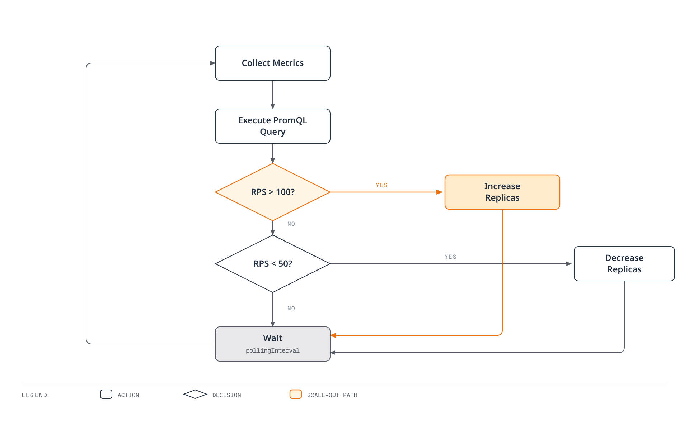

# KEDA-based Autoscaling with Istio Metrics

> **Supported Versions**: KEDA 2.18, Istio 1.28
> **Last Updated**: February 19, 2026
> **Kubernetes Compatibility**: 1.34

This document covers **practical autoscaling strategies using Istio metrics**. It provides various patterns and real-world examples for scaling workloads based on Prometheus and CloudWatch metrics using KEDA.

**Learning Objectives**:
- Writing sophisticated scaling policies using Prometheus PromQL
- CloudWatch metrics integration and AWS service combinations
- Strategies based on various metrics including RPS, Latency, and error rates
- Circuit Breaker and time-based predictive scaling
- Stabilization and monitoring for production environments

## Table of Contents

1. [Overview](#overview)
2. [Architecture](#architecture)
3. [Prometheus Metrics-based Scaling](#prometheus-metrics-based-scaling)
4. [CloudWatch Metrics-based Scaling](#cloudwatch-metrics-based-scaling)
5. [Practical Scaling Strategies](#practical-scaling-strategies)
6. [Best Practices](#best-practices)
7. [Troubleshooting](#troubleshooting)
8. [Reference: KEDA Installation](#reference-keda-installation)

## Overview

This document focuses on **practical autoscaling strategies using Istio metrics**. KEDA extends Kubernetes HPA to enable scaling based on complex metric queries from Prometheus and CloudWatch.

### Core Istio Metrics

Metrics provided by Istio Envoy proxy used for scaling:

| Metric | Description | Scaling Use |
|--------|------|---------------|
| **istio_requests_total** | Total request count | RPS-based scaling |
| **istio_request_duration_milliseconds** | Request latency | Latency-based scaling |
| **istio_tcp_connections_opened_total** | TCP connection count | Connection-based scaling |
| **istio_request_bytes_sum** | Request bytes | Throughput-based scaling |
| **envoy_cluster_upstream_rq_pending_overflow** | Circuit Breaker overflow | Overload detection |

### Why Use KEDA?

Advantages of KEDA compared to standard Kubernetes HPA:

| Feature | Kubernetes HPA | KEDA |
|------|---------------|------|
| **Metric Sources** | CPU/Memory + Custom Metrics API | 60+ Scalers with direct support |
| **PromQL Queries** | Custom Metrics Adapter required | Native support |
| **CloudWatch Integration** | Not possible | Direct query |
| **Scale to Zero** | Minimum 1 | 0 possible |
| **Multiple Metrics** | Limited | Multiple trigger combinations |
| **Cron Schedule** | Not supported | Time-based scaling |

**Focus of this document**: Rather than KEDA installation, this focuses on **practical scaling patterns and strategies using Prometheus and CloudWatch metrics**.

### Key Scaling Strategies

Practical scaling patterns covered in this document:

| Strategy | Primary Metric | Suitable Scenarios | Key Benefits |
|------|----------|----------------|----------|
| **RPS-based** | `istio_requests_total` | API servers, web services | Intuitive, simple implementation |
| **Latency-based** | P50/P95/P99 latency | Payment, orders - latency-sensitive services | User experience guarantee |
| **Error rate-based** | 5xx response ratio | High-availability essential services | Fast failure response |
| **Composite Metrics** | RPS + Latency + Error | Production services | Stable, accurate scaling |
| **Circuit Breaker-based** | overflow, connection pool | Services with many external dependencies | Cascading failure prevention |
| **Time-based Prediction** | Cron + metrics | Predictable traffic patterns | Cost optimization, proactive response |

## Architecture

### Metrics-based Scaling Flow


### ScaledObject Basic Structure

The core of KEDA is the **ScaledObject** CRD. It automatically creates/manages HPA based on Prometheus or CloudWatch metrics:

```yaml
apiVersion: keda.sh/v1alpha1
kind: ScaledObject
metadata:
  name: my-app-scaler
  namespace: default
spec:
  # Scale target
  scaleTargetRef:
    name: my-app           # Deployment name
    kind: Deployment

  # Scaling policy
  pollingInterval: 30      # Check metrics every 30 seconds
  cooldownPeriod: 300      # Wait 5 minutes after scale down
  minReplicaCount: 2       # Minimum Pod count
  maxReplicaCount: 20      # Maximum Pod count

  # Metric triggers
  triggers:
  - type: prometheus       # or aws-cloudwatch
    metadata:
      serverAddress: http://prometheus.istio-system.svc:9090
      query: |             # PromQL query
        sum(rate(istio_requests_total{
          destination_workload="my-app"
        }[1m]))
      threshold: '1000'    # Threshold: 1000 RPS
```

## Prometheus Metrics-based Scaling

### 1. RPS (Requests Per Second) Based Scaling

#### ScaledObject Definition

```yaml
apiVersion: keda.sh/v1alpha1
kind: ScaledObject
metadata:
  name: reviews-rps-scaler
  namespace: default
spec:
  scaleTargetRef:
    name: reviews
    kind: Deployment

  # Scaling policy
  pollingInterval: 30  # Check metrics every 30 seconds
  cooldownPeriod: 300  # Wait 5 minutes after scale down
  minReplicaCount: 2   # Minimum replicas
  maxReplicaCount: 20  # Maximum replicas

  triggers:
  - type: prometheus
    metadata:
      serverAddress: http://prometheus.istio-system.svc:9090
      query: |
        sum(rate(istio_requests_total{
          destination_workload="reviews",
          destination_workload_namespace="default",
          response_code=~"2.*"
        }[1m]))
      threshold: '100'  # Scale out above 100 RPS
      activationThreshold: '50'  # Activate above 50 RPS
```

#### How It Works



### 2. Latency Based Scaling

#### Scaling by P95 Latency

```yaml
apiVersion: keda.sh/v1alpha1
kind: ScaledObject
metadata:
  name: reviews-latency-scaler
  namespace: default
spec:
  scaleTargetRef:
    name: reviews
    kind: Deployment

  pollingInterval: 30
  cooldownPeriod: 300
  minReplicaCount: 2
  maxReplicaCount: 20

  triggers:
  - type: prometheus
    metadata:
      serverAddress: http://prometheus.istio-system.svc:9090
      # P95 latency (95th percentile)
      query: |
        histogram_quantile(0.95,
          sum(rate(istio_request_duration_milliseconds_bucket{
            destination_workload="reviews",
            destination_workload_namespace="default"
          }[2m])) by (le)
        )
      threshold: '200'  # Scale out above 200ms
      activationThreshold: '100'
```

#### Combined P50 and P99 Scaling

```yaml
apiVersion: keda.sh/v1alpha1
kind: ScaledObject
metadata:
  name: reviews-multi-latency-scaler
  namespace: default
spec:
  scaleTargetRef:
    name: reviews
    kind: Deployment

  pollingInterval: 30
  cooldownPeriod: 300
  minReplicaCount: 2
  maxReplicaCount: 20

  # Scale when any trigger exceeds threshold
  triggers:
  # P50 latency
  - type: prometheus
    metadata:
      serverAddress: http://prometheus.istio-system.svc:9090
      query: |
        histogram_quantile(0.50,
          sum(rate(istio_request_duration_milliseconds_bucket{
            destination_workload="reviews",
            destination_workload_namespace="default"
          }[2m])) by (le)
        )
      threshold: '50'  # P50 > 50ms

  # P95 latency
  - type: prometheus
    metadata:
      serverAddress: http://prometheus.istio-system.svc:9090
      query: |
        histogram_quantile(0.95,
          sum(rate(istio_request_duration_milliseconds_bucket{
            destination_workload="reviews",
            destination_workload_namespace="default"
          }[2m])) by (le)
        )
      threshold: '200'  # P95 > 200ms

  # P99 latency (extreme cases)
  - type: prometheus
    metadata:
      serverAddress: http://prometheus.istio-system.svc:9090
      query: |
        histogram_quantile(0.99,
          sum(rate(istio_request_duration_milliseconds_bucket{
            destination_workload="reviews",
            destination_workload_namespace="default"
          }[2m])) by (le)
        )
      threshold: '500'  # P99 > 500ms
```

### 3. Success Rate Based Scaling

Scale out when error rate is high to distribute load:

```yaml
apiVersion: keda.sh/v1alpha1
kind: ScaledObject
metadata:
  name: reviews-error-rate-scaler
  namespace: default
spec:
  scaleTargetRef:
    name: reviews
    kind: Deployment

  pollingInterval: 30
  cooldownPeriod: 300
  minReplicaCount: 2
  maxReplicaCount: 20

  triggers:
  # Scale out when error rate exceeds 5%
  - type: prometheus
    metadata:
      serverAddress: http://prometheus.istio-system.svc:9090
      query: |
        (
          sum(rate(istio_requests_total{
            destination_workload="reviews",
            response_code=~"5.*"
          }[2m]))
          /
          sum(rate(istio_requests_total{
            destination_workload="reviews"
          }[2m]))
        ) * 100
      threshold: '5'  # 5% error rate
      activationThreshold: '2'
```

### 4. Composite Metrics Scaling

Considering both RPS and Latency:

```yaml
apiVersion: keda.sh/v1alpha1
kind: ScaledObject
metadata:
  name: reviews-composite-scaler
  namespace: default
spec:
  scaleTargetRef:
    name: reviews
    kind: Deployment

  pollingInterval: 30
  cooldownPeriod: 300
  minReplicaCount: 2
  maxReplicaCount: 20

  # Advanced scaling behavior
  advanced:
    horizontalPodAutoscalerConfig:
      behavior:
        scaleDown:
          stabilizationWindowSeconds: 300  # 5 minute stabilization
          policies:
          - type: Percent
            value: 10  # Maximum 10% decrease
            periodSeconds: 60
        scaleUp:
          stabilizationWindowSeconds: 0  # Immediate scale out
          policies:
          - type: Percent
            value: 50  # Maximum 50% increase
            periodSeconds: 60
          - type: Pods
            value: 5  # Maximum 5 pods at once
            periodSeconds: 60
          selectPolicy: Max  # Select larger value

  triggers:
  # RPS-based
  - type: prometheus
    metricType: AverageValue
    metadata:
      serverAddress: http://prometheus.istio-system.svc:9090
      query: |
        sum(rate(istio_requests_total{
          destination_workload="reviews",
          destination_workload_namespace="default"
        }[1m])) / count(kube_pod_info{pod=~"reviews-.*"})
      threshold: '50'  # 50 RPS per Pod

  # P95 Latency-based
  - type: prometheus
    metricType: Value
    metadata:
      serverAddress: http://prometheus.istio-system.svc:9090
      query: |
        histogram_quantile(0.95,
          sum(rate(istio_request_duration_milliseconds_bucket{
            destination_workload="reviews"
          }[2m])) by (le)
        )
      threshold: '200'  # P95 > 200ms
```

## CloudWatch Metrics-based Scaling

### Overview

CloudWatch has **slower response time** than Prometheus (1-3 minute delay), but is advantageous for integration with AWS native services and **long-term retention**.

**Use Scenarios**:
- Combination with AWS service metrics (ALB, RDS, SQS, etc.)
- Long-term trend analysis and cost optimization
- Centralized monitoring in multi-region environments
- Not recommended for real-time scaling (use Prometheus)

> **Prerequisite**: Istio metrics must be sent to CloudWatch. See [Reference: KEDA Installation](#reference-keda-installation) section for ADOT Collector setup.

### Scaling with CloudWatch Metrics

#### RPS-based Scaling

```yaml
apiVersion: keda.sh/v1alpha1
kind: ScaledObject
metadata:
  name: reviews-cloudwatch-rps
  namespace: default
spec:
  scaleTargetRef:
    name: reviews
    kind: Deployment

  pollingInterval: 60  # 1 minute interval recommended for CloudWatch
  cooldownPeriod: 300
  minReplicaCount: 2
  maxReplicaCount: 20

  triggers:
  - type: aws-cloudwatch
    metadata:
      namespace: IstioMetrics
      metricName: IstioRequestsTotal
      dimensionName: destination_workload
      dimensionValue: reviews
      targetMetricValue: '1000'  # 1000 requests/minute
      minMetricValue: '100'

      # Statistics type
      metricStatPeriod: '60'  # 1 minute
      metricStat: Sum

      # AWS region
      awsRegion: us-west-2

      # Use IRSA
      identityOwner: operator
```

#### Latency-based Scaling

```yaml
apiVersion: keda.sh/v1alpha1
kind: ScaledObject
metadata:
  name: reviews-cloudwatch-latency
  namespace: default
spec:
  scaleTargetRef:
    name: reviews
    kind: Deployment

  pollingInterval: 60
  cooldownPeriod: 300
  minReplicaCount: 2
  maxReplicaCount: 20

  triggers:
  - type: aws-cloudwatch
    metadata:
      namespace: IstioMetrics
      metricName: IstioRequestDuration
      dimensionName: destination_workload
      dimensionValue: reviews

      # P95 latency (calculated in CloudWatch)
      targetMetricValue: '200'  # 200ms
      minMetricValue: '50'

      metricStatPeriod: '60'
      metricStat: 'p95'  # 95th percentile

      awsRegion: us-west-2
      identityOwner: operator
```

## Practical Scaling Strategies

### Strategy 1: Traffic Pattern-based Predictive Scaling

Pre-scaling considering time-based traffic patterns:

```yaml
apiVersion: keda.sh/v1alpha1
kind: ScaledObject
metadata:
  name: frontend-predictive-scaler
  namespace: default
spec:
  scaleTargetRef:
    name: frontend
    kind: Deployment

  pollingInterval: 30
  cooldownPeriod: 300
  minReplicaCount: 2
  maxReplicaCount: 50

  # Advanced HPA behavior settings
  advanced:
    horizontalPodAutoscalerConfig:
      behavior:
        scaleDown:
          stabilizationWindowSeconds: 600  # 10 minute stabilization
          policies:
          - type: Percent
            value: 10
            periodSeconds: 120  # 10% decrease every 2 minutes
        scaleUp:
          stabilizationWindowSeconds: 0
          policies:
          - type: Percent
            value: 100  # Can double at once
            periodSeconds: 30
          - type: Pods
            value: 10  # Maximum 10 pods at once
            periodSeconds: 30
          selectPolicy: Max

  triggers:
  # RPS-based
  - type: prometheus
    metadata:
      serverAddress: http://prometheus.istio-system.svc:9090
      query: |
        sum(rate(istio_requests_total{
          destination_workload="frontend"
        }[1m])) / scalar(count(up{job="frontend"}))
      threshold: '100'  # 100 RPS per Pod

  # P95 latency
  - type: prometheus
    metadata:
      serverAddress: http://prometheus.istio-system.svc:9090
      query: |
        histogram_quantile(0.95,
          sum(rate(istio_request_duration_milliseconds_bucket{
            destination_workload="frontend"
          }[2m])) by (le)
        )
      threshold: '300'

  # Cron-based pre-scaling (peak hours)
  - type: cron
    metadata:
      timezone: Asia/Seoul
      start: 0 9 * * 1-5  # Weekdays 9 AM
      end: 0 18 * * 1-5   # Weekdays 6 PM
      desiredReplicas: '20'  # Minimum 20 during peak hours
```

### Strategy 2: Circuit Breaker State-based Scaling

Automatic scale out when Circuit opens:

```yaml
apiVersion: keda.sh/v1alpha1
kind: ScaledObject
metadata:
  name: backend-circuit-breaker-scaler
  namespace: default
spec:
  scaleTargetRef:
    name: backend
    kind: Deployment

  pollingInterval: 15  # Circuit Breaker needs fast response
  cooldownPeriod: 180
  minReplicaCount: 3
  maxReplicaCount: 30

  triggers:
  # Circuit Breaker Overflow detection
  - type: prometheus
    metadata:
      serverAddress: http://prometheus.istio-system.svc:9090
      query: |
        sum(increase(envoy_cluster_upstream_rq_pending_overflow{
          cluster_name=~"outbound.*backend.*"
        }[1m]))
      threshold: '10'  # 10+ overflows per minute
      activationThreshold: '5'

  # Upstream connection pool saturation
  - type: prometheus
    metadata:
      serverAddress: http://prometheus.istio-system.svc:9090
      query: |
        sum(envoy_cluster_upstream_cx_active{
          cluster_name=~"outbound.*backend.*"
        })
        /
        sum(envoy_cluster_circuit_breakers_default_cx_open{
          cluster_name=~"outbound.*backend.*"
        }) * 100
      threshold: '80'  # Connection pool 80%+ usage
```

### Strategy 3: Tiered Scaling

Apply different scaling speeds based on load level:

```yaml
apiVersion: keda.sh/v1alpha1
kind: ScaledObject
metadata:
  name: payment-tiered-scaler
  namespace: default
spec:
  scaleTargetRef:
    name: payment-service
    kind: Deployment

  pollingInterval: 30
  cooldownPeriod: 300
  minReplicaCount: 3
  maxReplicaCount: 50

  advanced:
    horizontalPodAutoscalerConfig:
      behavior:
        scaleUp:
          policies:
          # Low load (< 150% threshold): slow increase
          - type: Percent
            value: 20
            periodSeconds: 120
          # Medium load (150-200%): fast increase
          - type: Percent
            value: 50
            periodSeconds: 60
          # High load (> 200%): very fast increase
          - type: Pods
            value: 10
            periodSeconds: 30
          selectPolicy: Max

        scaleDown:
          policies:
          - type: Percent
            value: 5  # Slow decrease (5% at a time)
            periodSeconds: 180  # Every 3 minutes

  triggers:
  - type: prometheus
    metadata:
      serverAddress: http://prometheus.istio-system.svc:9090
      query: |
        sum(rate(istio_requests_total{
          destination_workload="payment-service",
          response_code=~"2.*"
        }[1m]))
      threshold: '500'  # 500 RPS
```

### Strategy 4: Cost-optimized Scaling

Distinguish between business hours and off-hours:

```yaml
apiVersion: keda.sh/v1alpha1
kind: ScaledObject
metadata:
  name: analytics-cost-optimized-scaler
  namespace: default
spec:
  scaleTargetRef:
    name: analytics-service
    kind: Deployment

  pollingInterval: 60
  cooldownPeriod: 600  # Longer wait for cost optimization
  minReplicaCount: 1
  maxReplicaCount: 30

  triggers:
  # Business hours (09:00-18:00): aggressive scaling
  - type: prometheus
    metadata:
      serverAddress: http://prometheus.istio-system.svc:9090
      query: |
        (
          sum(rate(istio_requests_total{
            destination_workload="analytics-service"
          }[2m]))
          and
          (hour() >= 9 and hour() < 18)
        )
      threshold: '50'
      activationThreshold: '20'

  # Off-hours: Allow Scale to Zero
  - type: cron
    metadata:
      timezone: Asia/Seoul
      start: 0 18 * * *  # 6 PM
      end: 0 9 * * *     # 9 AM
      desiredReplicas: '0'  # Scale to Zero
```

### Strategy 5: Gateway Metrics-based Scaling

Monitor Istio Gateway load to scale backend:

```yaml
apiVersion: keda.sh/v1alpha1
kind: ScaledObject
metadata:
  name: backend-gateway-based-scaler
  namespace: default
spec:
  scaleTargetRef:
    name: backend
    kind: Deployment

  pollingInterval: 30
  cooldownPeriod: 300
  minReplicaCount: 2
  maxReplicaCount: 40

  triggers:
  # Monitor incoming traffic through Gateway
  - type: prometheus
    metadata:
      serverAddress: http://prometheus.istio-system.svc:9090
      query: |
        sum(rate(istio_requests_total{
          source_workload="istio-ingressgateway",
          destination_service="backend.default.svc.cluster.local"
        }[1m]))
      threshold: '1000'

  # Gateway pending connection count
  - type: prometheus
    metadata:
      serverAddress: http://prometheus.istio-system.svc:9090
      query: |
        sum(envoy_http_downstream_rq_active{
          app="istio-ingressgateway"
        })
      threshold: '500'  # 500+ concurrent requests
```

## Best Practices

### 1. Metric Selection Guide


**Recommended Metrics**:

| Workload Type | Primary Metric | Secondary Metric | Reason |
|-------------|----------|-----------|------|
| **API Server** | RPS | P95 Latency | Request count is direct load indicator |
| **Web Server** | RPS | Error rate | Request count more important than concurrent connections |
| **Data Processing** | P95 Latency | CPU/Memory | Processing time is load indicator |
| **Streaming** | TCP connections | Throughput | Connection count is key to resource consumption |
| **Batch Jobs** | Queue length | Processing time | Pending work count is scaling criteria |

### 2. Threshold Setting Guide

```yaml
# Process for finding appropriate thresholds

# Step 1: Measure current workload
# Normal RPS
kubectl exec -it prometheus-xxx -n istio-system -- promtool query instant \
  'sum(rate(istio_requests_total{destination_workload="reviews"}[5m]))'

# Peak time RPS
# Normal: ~500 RPS
# Peak: ~2000 RPS

# Step 2: Measure per-Pod processing capacity
# Run load test
kubectl run load-test --image=fortio/fortio -- load -c 50 -qps 0 -t 60s http://reviews:9080

# Result: Maintains P95 < 100ms up to about 200 RPS per Pod

# Step 3: Calculate threshold
# Target P95: 100ms
# Per-Pod capacity: 200 RPS
# Safety margin: 70% (140 RPS/pod)
# -> threshold: '140'

# Step 4: Write ScaledObject
apiVersion: keda.sh/v1alpha1
kind: ScaledObject
metadata:
  name: reviews-optimized-scaler
spec:
  scaleTargetRef:
    name: reviews
  minReplicaCount: 3  # Normal 500 RPS / 140 = 3.5 -> 4
  maxReplicaCount: 20  # Peak 2000 RPS / 140 = 14.2 -> 20 (with margin)
  triggers:
  - type: prometheus
    metadata:
      query: |
        sum(rate(istio_requests_total{destination_workload="reviews"}[1m]))
        / count(kube_pod_info{pod=~"reviews-.*"})
      threshold: '140'  # 140 RPS per Pod
```

### 3. Scaling Speed Adjustment

```yaml
apiVersion: keda.sh/v1alpha1
kind: ScaledObject
metadata:
  name: balanced-scaler
  namespace: default
spec:
  scaleTargetRef:
    name: myapp
    kind: Deployment

  pollingInterval: 30
  cooldownPeriod: 300
  minReplicaCount: 2
  maxReplicaCount: 50

  advanced:
    horizontalPodAutoscalerConfig:
      behavior:
        # Scale down: conservative (service stability first)
        scaleDown:
          stabilizationWindowSeconds: 600  # 10 minute observation
          policies:
          - type: Percent
            value: 10  # 10% decrease
            periodSeconds: 180  # Every 3 minutes
          - type: Pods
            value: 2  # Or maximum 2 at a time
            periodSeconds: 180
          selectPolicy: Min  # Select more conservative value

        # Scale up: aggressive (fast response)
        scaleUp:
          stabilizationWindowSeconds: 0  # Immediate
          policies:
          - type: Percent
            value: 100  # Up to 2x increase
            periodSeconds: 30
          - type: Pods
            value: 10  # Or 10 at a time
            periodSeconds: 30
          selectPolicy: Max  # Select more aggressive value

  triggers:
  - type: prometheus
    metadata:
      serverAddress: http://prometheus.istio-system.svc:9090
      query: sum(rate(istio_requests_total{destination_workload="myapp"}[1m]))
      threshold: '1000'
```

### 4. Multi-cluster Environment Scaling

```yaml
# Cluster 1: Primary traffic handling
apiVersion: keda.sh/v1alpha1
kind: ScaledObject
metadata:
  name: frontend-cluster1-scaler
  namespace: default
spec:
  scaleTargetRef:
    name: frontend
  minReplicaCount: 5
  maxReplicaCount: 30

  triggers:
  - type: prometheus
    metadata:
      serverAddress: http://prometheus.istio-system.svc:9090
      # 60% of global traffic handled by this cluster
      query: |
        sum(rate(istio_requests_total{
          destination_workload="frontend",
          source_cluster="cluster1"
        }[1m])) * 0.6
      threshold: '600'
---
# Cluster 2: Secondary traffic handling
apiVersion: keda.sh/v1alpha1
kind: ScaledObject
metadata:
  name: frontend-cluster2-scaler
  namespace: default
spec:
  scaleTargetRef:
    name: frontend
  minReplicaCount: 3
  maxReplicaCount: 20

  triggers:
  - type: prometheus
    metadata:
      serverAddress: http://prometheus.istio-system.svc:9090
      # 40% of global traffic
      query: |
        sum(rate(istio_requests_total{
          destination_workload="frontend",
          source_cluster="cluster2"
        }[1m])) * 0.4
      threshold: '400'
```

## Best Practices

### 1. Metric Collection Optimization

```yaml
# Adjust Prometheus scrape interval
apiVersion: v1
kind: ConfigMap
metadata:
  name: prometheus
  namespace: istio-system
data:
  prometheus.yml: |
    global:
      scrape_interval: 15s  # Default 15 seconds
      evaluation_interval: 15s

    scrape_configs:
    # Collect Istio metrics more frequently
    - job_name: 'istio-mesh'
      scrape_interval: 10s  # 10 seconds
      kubernetes_sd_configs:
      - role: endpoints
        namespaces:
          names:
          - default
          - production
      relabel_configs:
      - source_labels: [__meta_kubernetes_pod_annotation_prometheus_io_scrape]
        action: keep
        regex: true
```

### 2. Ensure Scaling Stability

```yaml
apiVersion: keda.sh/v1alpha1
kind: ScaledObject
metadata:
  name: stable-scaler
  namespace: default
spec:
  scaleTargetRef:
    name: myapp

  # 1. Appropriate polling interval
  pollingInterval: 30  # Too short is unstable, too long is slow

  # 2. Sufficient cooldown
  cooldownPeriod: 300  # 5 minutes is generally appropriate

  # 3. Safe min/max values
  minReplicaCount: 2  # 0 is risky, recommend minimum 2
  maxReplicaCount: 20  # 70% or less of cluster capacity

  advanced:
    horizontalPodAutoscalerConfig:
      behavior:
        scaleDown:
          # 4. Long stabilization window
          stabilizationWindowSeconds: 600
          policies:
          - type: Percent
            value: 10
            periodSeconds: 120
```

### 3. Monitoring and Alerting

```yaml
apiVersion: monitoring.coreos.com/v1
kind: PrometheusRule
metadata:
  name: keda-scaling-alerts
  namespace: keda
spec:
  groups:
  - name: keda-scaling
    interval: 30s
    rules:
    # Reached maximum replicas
    - alert: KEDAMaxReplicasReached
      expr: |
        kube_horizontalpodautoscaler_status_current_replicas
        >= kube_horizontalpodautoscaler_spec_max_replicas
      for: 5m
      labels:
        severity: warning
      annotations:
        summary: "KEDA scaled to maximum replicas"
        description: "{{ $labels.horizontalpodautoscaler }} has reached max replicas ({{ $value }})"

    # Scaling failed
    - alert: KEDAScalingFailed
      expr: |
        increase(keda_scaler_errors_total[5m]) > 0
      labels:
        severity: critical
      annotations:
        summary: "KEDA scaling failed"
        description: "KEDA scaler {{ $labels.scaledObject }} has errors"

    # Frequent scaling (Flapping)
    - alert: KEDAFlapping
      expr: |
        rate(keda_scaler_active[10m]) > 0.1
      for: 10m
      labels:
        severity: warning
      annotations:
        summary: "KEDA is flapping"
        description: "ScaledObject {{ $labels.scaledObject }} is scaling too frequently"
```

### 4. Resource Limit Settings

```yaml
apiVersion: apps/v1
kind: Deployment
metadata:
  name: reviews
  namespace: default
spec:
  replicas: 3
  template:
    spec:
      containers:
      - name: reviews
        image: istio/examples-bookinfo-reviews-v1:1.17.0

        # Resource requests/limits (important for scaling calculation)
        resources:
          requests:
            cpu: 100m
            memory: 128Mi
          limits:
            cpu: 200m
            memory: 256Mi

        # Readiness Probe (safety during scale out)
        readinessProbe:
          httpGet:
            path: /health
            port: 9080
          initialDelaySeconds: 10
          periodSeconds: 5
          timeoutSeconds: 3
          successThreshold: 1
          failureThreshold: 3

        # Liveness Probe
        livenessProbe:
          httpGet:
            path: /health
            port: 9080
          initialDelaySeconds: 30
          periodSeconds: 10
```

## Troubleshooting

### 1. KEDA Not Fetching Metrics

**Symptoms**:
```bash
kubectl get scaledobject -n default
# STATUS: Unknown
```

**Root Cause Analysis**:

```bash
# 1. Check KEDA Operator logs
kubectl logs -n keda -l app=keda-operator

# 2. Check ScaledObject status
kubectl describe scaledobject reviews-rps-scaler -n default

# 3. Test Prometheus connectivity
kubectl run curl-test --image=curlimages/curl -it --rm -- \
  curl -s http://prometheus.istio-system.svc:9090/api/v1/query \
  --data-urlencode 'query=up'
```

**Resolution**:

1. **Verify Prometheus address**:
```bash
# Check Prometheus Service
kubectl get svc -n istio-system | grep prometheus

# Use correct address in ScaledObject
serverAddress: http://prometheus.istio-system.svc:9090
```

2. **Test PromQL query**:
```bash
# Test query directly in Prometheus UI
kubectl port-forward -n istio-system svc/prometheus 9090:9090

# Browser: http://localhost:9090
# Enter query and verify results
```

### 2. Scaling Too Slow

**Symptoms**: Scale out delayed during traffic spikes

**Resolution**:

```yaml
apiVersion: keda.sh/v1alpha1
kind: ScaledObject
metadata:
  name: fast-scaler
spec:
  # 1. Reduce polling interval
  pollingInterval: 15  # 30s -> 15s

  # 2. Remove scale up stabilization window
  advanced:
    horizontalPodAutoscalerConfig:
      behavior:
        scaleUp:
          stabilizationWindowSeconds: 0  # React immediately
          policies:
          - type: Pods
            value: 5  # 5 at a time
            periodSeconds: 30

  # 3. Lower activation threshold
  triggers:
  - type: prometheus
    metadata:
      query: sum(rate(istio_requests_total{...}[1m]))
      threshold: '100'
      activationThreshold: '30'  # Low threshold for early activation
```

### 3. Flapping (Unstable Scaling)

**Symptoms**: Pod count keeps increasing/decreasing repeatedly

**Cause**: Threshold too sensitive or insufficient stabilization period

**Resolution**:

```yaml
apiVersion: keda.sh/v1alpha1
kind: ScaledObject
metadata:
  name: stable-scaler
spec:
  # 1. Longer cooldown
  cooldownPeriod: 600  # 10 minutes

  # 2. Longer PromQL evaluation period
  triggers:
  - type: prometheus
    metadata:
      query: |
        sum(rate(istio_requests_total{...}[5m]))  # 1m -> 5m
      threshold: '100'

  # 3. Conservative scale down
  advanced:
    horizontalPodAutoscalerConfig:
      behavior:
        scaleDown:
          stabilizationWindowSeconds: 600
          policies:
          - type: Percent
            value: 5  # Only 5% decrease
            periodSeconds: 180
```

### 4. CloudWatch Latency

**Symptoms**: CloudWatch metrics not real-time (1-3 minute delay)

**Resolution**:

```yaml
# Use Prometheus primarily, CloudWatch as secondary
apiVersion: keda.sh/v1alpha1
kind: ScaledObject
metadata:
  name: hybrid-metrics-scaler
spec:
  triggers:
  # Primary metric: Prometheus (real-time)
  - type: prometheus
    metadata:
      serverAddress: http://prometheus.istio-system.svc:9090
      query: sum(rate(istio_requests_total{...}[1m]))
      threshold: '1000'

  # Secondary metric: CloudWatch (trend analysis)
  - type: aws-cloudwatch
    metadata:
      namespace: IstioMetrics
      metricName: IstioRequestsTotal
      targetMetricValue: '5000'  # Higher threshold
      metricStatPeriod: '300'  # 5 minute aggregation
```

## Practical Examples

### Example 1: E-commerce Payment Service

Service where latency is critical:

```yaml
apiVersion: keda.sh/v1alpha1
kind: ScaledObject
metadata:
  name: payment-service-scaler
  namespace: production
spec:
  scaleTargetRef:
    name: payment-service
    kind: Deployment

  pollingInterval: 15  # Fast response
  cooldownPeriod: 180  # 3 minute cooldown
  minReplicaCount: 5   # Always maintain 5+
  maxReplicaCount: 50

  advanced:
    horizontalPodAutoscalerConfig:
      behavior:
        scaleUp:
          stabilizationWindowSeconds: 0
          policies:
          - type: Percent
            value: 100  # Fast 2x
            periodSeconds: 30
        scaleDown:
          stabilizationWindowSeconds: 900  # 15 minute stabilization
          policies:
          - type: Percent
            value: 5
            periodSeconds: 300  # 5% every 5 minutes

  triggers:
  # P50 latency (normal case)
  - type: prometheus
    metadata:
      serverAddress: http://prometheus.istio-system.svc:9090
      query: |
        histogram_quantile(0.50,
          sum(rate(istio_request_duration_milliseconds_bucket{
            destination_workload="payment-service",
            destination_workload_namespace="production"
          }[1m])) by (le)
        )
      threshold: '50'  # P50 > 50ms
      activationThreshold: '30'

  # P95 latency (quality guarantee)
  - type: prometheus
    metadata:
      serverAddress: http://prometheus.istio-system.svc:9090
      query: |
        histogram_quantile(0.95,
          sum(rate(istio_request_duration_milliseconds_bucket{
            destination_workload="payment-service",
            destination_workload_namespace="production"
          }[1m])) by (le)
        )
      threshold: '200'  # P95 > 200ms

  # Error rate (emergency scale out above 5%)
  - type: prometheus
    metadata:
      serverAddress: http://prometheus.istio-system.svc:9090
      query: |
        (
          sum(rate(istio_requests_total{
            destination_workload="payment-service",
            response_code=~"5.*"
          }[1m]))
          /
          sum(rate(istio_requests_total{
            destination_workload="payment-service"
          }[1m]))
        ) * 100
      threshold: '5'
```

### Example 2: Data Processing Service

Batch processing and queue-based scaling:

```yaml
apiVersion: keda.sh/v1alpha1
kind: ScaledObject
metadata:
  name: data-processor-scaler
  namespace: default
spec:
  scaleTargetRef:
    name: data-processor
    kind: Deployment

  pollingInterval: 60  # Batch allows slow response
  cooldownPeriod: 600  # 10 minute cooldown
  minReplicaCount: 0   # Allow Scale to Zero
  maxReplicaCount: 30

  triggers:
  # SQS queue length (primary metric)
  - type: aws-sqs-queue
    metadata:
      queueURL: https://sqs.us-west-2.amazonaws.com/123456789/data-processing-queue
      queueLength: '10'  # Activate when 10+ in queue
      awsRegion: us-west-2
      identityOwner: operator

  # Istio processing time (secondary metric)
  - type: prometheus
    metadata:
      serverAddress: http://prometheus.istio-system.svc:9090
      query: |
        histogram_quantile(0.95,
          sum(rate(istio_request_duration_milliseconds_bucket{
            destination_workload="data-processor"
          }[5m])) by (le)
        )
      threshold: '5000'  # Scale out when taking 5+ seconds
```

### Example 3: Multi-region Global Service

Region-specific scaling based on latency:

```yaml
# US Region
apiVersion: keda.sh/v1alpha1
kind: ScaledObject
metadata:
  name: api-us-scaler
  namespace: default
  labels:
    region: us-east-1
spec:
  scaleTargetRef:
    name: api-service
  minReplicaCount: 3
  maxReplicaCount: 30

  triggers:
  - type: prometheus
    metadata:
      serverAddress: http://prometheus.istio-system.svc:9090
      # Aggregate only US user traffic
      query: |
        sum(rate(istio_requests_total{
          destination_workload="api-service",
          source_canonical_service=~".*-us-.*"
        }[1m]))
      threshold: '500'

  - type: prometheus
    metadata:
      serverAddress: http://prometheus.istio-system.svc:9090
      # US region P95 latency
      query: |
        histogram_quantile(0.95,
          sum(rate(istio_request_duration_milliseconds_bucket{
            destination_workload="api-service",
            destination_region="us-east-1"
          }[2m])) by (le)
        )
      threshold: '100'  # US users target 100ms
---
# EU Region
apiVersion: keda.sh/v1alpha1
kind: ScaledObject
metadata:
  name: api-eu-scaler
  namespace: default
  labels:
    region: eu-west-1
spec:
  scaleTargetRef:
    name: api-service
  minReplicaCount: 2
  maxReplicaCount: 20

  triggers:
  - type: prometheus
    metadata:
      serverAddress: http://prometheus.istio-system.svc:9090
      query: |
        sum(rate(istio_requests_total{
          destination_workload="api-service",
          source_canonical_service=~".*-eu-.*"
        }[1m]))
      threshold: '300'

  - type: prometheus
    metadata:
      serverAddress: http://prometheus.istio-system.svc:9090
      query: |
        histogram_quantile(0.95,
          sum(rate(istio_request_duration_milliseconds_bucket{
            destination_workload="api-service",
            destination_region="eu-west-1"
          }[2m])) by (le)
        )
      threshold: '150'  # EU allows 150ms
```

## Reference: KEDA Installation

> **Note**: This section is only needed if installing KEDA for the first time. If already installed, start from [Prometheus Metrics-based Scaling](#prometheus-metrics-based-scaling).

### Install with Helm

```bash
# Add KEDA Helm repository
helm repo add kedacore https://kedacore.github.io/charts
helm repo update

# Install KEDA
helm install keda kedacore/keda \
  --namespace keda \
  --create-namespace \
  --set prometheus.metricServer.enabled=true \
  --set prometheus.metricServer.port=9022 \
  --set operator.replicaCount=2

# Verify installation
kubectl get pods -n keda
# Output:
# NAME                                      READY   STATUS
# keda-operator-xxxxx                       1/1     Running
# keda-operator-metrics-apiserver-xxxxx     1/1     Running
```

### AWS IRSA Setup (for CloudWatch)

IAM permissions required for KEDA Operator when using CloudWatch metrics:

```bash
# IRSA setup
eksctl create iamserviceaccount \
  --name keda-operator \
  --namespace keda \
  --cluster my-cluster \
  --attach-policy-arn arn:aws:iam::aws:policy/CloudWatchReadOnlyAccess \
  --approve \
  --override-existing-serviceaccounts

# Verify ServiceAccount
kubectl get sa keda-operator -n keda -o yaml | grep eks.amazonaws.com/role-arn
```

### CloudWatch Metrics Sending Setup (Optional)

To use CloudWatch metrics-based scaling, you need to send Istio metrics via ADOT Collector:

#### Step 1: Install ADOT Collector

```yaml
apiVersion: opentelemetry.io/v1alpha1
kind: OpenTelemetryCollector
metadata:
  name: istio-metrics-collector
  namespace: istio-system
spec:
  mode: deployment
  serviceAccount: adot-collector
  config: |
    receivers:
      prometheus:
        config:
          scrape_configs:
          - job_name: 'istio-mesh'
            scrape_interval: 60s  # 1 minute recommended for CloudWatch
            kubernetes_sd_configs:
            - role: endpoints
              namespaces:
                names:
                - default
            relabel_configs:
            - source_labels: [__meta_kubernetes_pod_annotation_prometheus_io_scrape]
              action: keep
              regex: true

    processors:
      batch:
        timeout: 60s
      metricstransform:
        transforms:
        - include: istio_requests_total
          action: update
          new_name: IstioRequestsTotal
        - include: istio_request_duration_milliseconds
          action: update
          new_name: IstioRequestDuration

    exporters:
      awsemf:
        namespace: IstioMetrics
        region: us-west-2
        dimension_rollup_option: NoDimensionRollup
        metric_declarations:
        - dimensions: [[destination_workload, destination_workload_namespace]]
          metric_name_selectors:
          - IstioRequestsTotal
          - IstioRequestDuration

    service:
      pipelines:
        metrics:
          receivers: [prometheus]
          processors: [batch, metricstransform]
          exporters: [awsemf]
```

#### Step 2: IRSA Setup

```bash
# Create IRSA policy
cat > adot-cloudwatch-policy.json <<EOF
{
  "Version": "2012-10-17",
  "Statement": [
    {
      "Effect": "Allow",
      "Action": ["cloudwatch:PutMetricData"],
      "Resource": "*",
      "Condition": {
        "StringEquals": {
          "cloudwatch:namespace": "IstioMetrics"
        }
      }
    }
  ]
}
EOF

aws iam create-policy \
  --policy-name ADOTCollectorCloudWatchPolicy \
  --policy-document file://adot-cloudwatch-policy.json

eksctl create iamserviceaccount \
  --name adot-collector \
  --namespace istio-system \
  --cluster my-cluster \
  --attach-policy-arn arn:aws:iam::${ACCOUNT_ID}:policy/ADOTCollectorCloudWatchPolicy \
  --approve
```

**After installation**, return to [Prometheus Metrics-based Scaling](#prometheus-metrics-based-scaling) or [CloudWatch Metrics-based Scaling](#cloudwatch-metrics-based-scaling) section.

---

## References

### Official Documentation

- [KEDA Official Documentation](https://keda.sh/docs/)
- [KEDA Prometheus Scaler](https://keda.sh/docs/scalers/prometheus/)
- [KEDA AWS CloudWatch Scaler](https://keda.sh/docs/scalers/aws-cloudwatch/)
- [Istio Metrics](https://istio.io/latest/docs/reference/config/metrics/)

### Related Documents

- [Observability](../observability/README.md) - Prometheus and metrics collection
- [Resilience](../resilience/README.md) - Circuit Breaker and resilience
- [Traffic Management](../traffic-management/README.md) - Istio traffic management

## Summary

### Metric Source Selection Guide

| Metric Source | Advantages | Disadvantages | Recommended Use |
|------------|------|------|----------|
| **Prometheus** | - Real-time response (15-30s)<br>- Powerful PromQL queries<br>- In-cluster communication | - Long-term retention cost<br>- Cluster dependency | Real-time scaling, most workloads |
| **CloudWatch** | - AWS service integration<br>- Long-term retention<br>- Multi-region support | - 1-3 minute delay<br>- Cost (proportional to metric count) | Trend analysis, AWS service combinations |

### Scaling Strategy Selection Guide

| Workload Type | Primary Metric | Secondary Metric | Recommended Settings |
|-------------|----------|-----------|----------|
| **API Server** | RPS (per Pod) | P95 Latency | `pollingInterval: 30`, `cooldownPeriod: 300` |
| **Payment/Orders** | P50/P95 Latency | Error rate | `pollingInterval: 15`, fast scale out |
| **Data Processing** | Queue length, P95 Latency | CPU/Memory | `pollingInterval: 60`, Allow Scale to Zero |
| **Web Frontend** | RPS, P95 Latency | Gateway metrics | Cron-based pre-scaling |
| **Microservices** | RPS, Circuit Breaker | Error rate | Tiered scaling policy |

### Production Checklist

Items to verify before applying scaling policies to production:

- [ ] **Threshold verification**: Verify appropriate threshold values through load testing
- [ ] **Stabilization settings**: Set sufficient `stabilizationWindowSeconds` (minimum 300 seconds for scale down)
- [ ] **Resource limits**: Clearly define Pod `requests` and `limits`
- [ ] **Health Check**: Configure Readiness/Liveness Probe
- [ ] **Monitoring**: Set up `KEDAMaxReplicasReached`, `KEDAScalingFailed` alerts
- [ ] **Flapping prevention**: Long PromQL evaluation period (`[5m]`) and conservative scale down
- [ ] **Min/Max values**: Set `maxReplicaCount` to 70% or less of cluster capacity
- [ ] **Fallback**: CPU/Memory-based HPA backup in case of Prometheus failure

### Recommended Starting Path

```
Step 1: Implement RPS-based scaling
   └─> Start with single metric, adjust thresholds

Step 2: Add Latency metrics
   └─> Monitor and scale on P95 latency

Step 3: Composite metrics strategy
   └─> Ensure stability with RPS + Latency combination

Step 4: Apply advanced strategies
   └─> Add Circuit Breaker, Cron, error rate, etc.
```

**Core Principles**:
- Real-time response with Prometheus
- Ensure stability with composite metrics
- Conservative scale down, aggressive scale out
- Continuous monitoring and threshold adjustment
