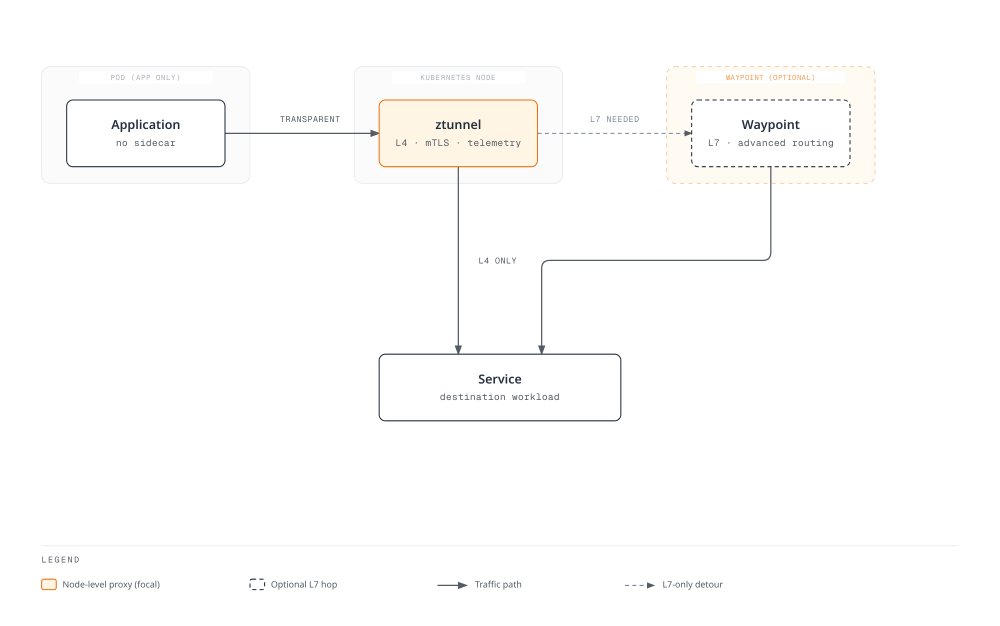
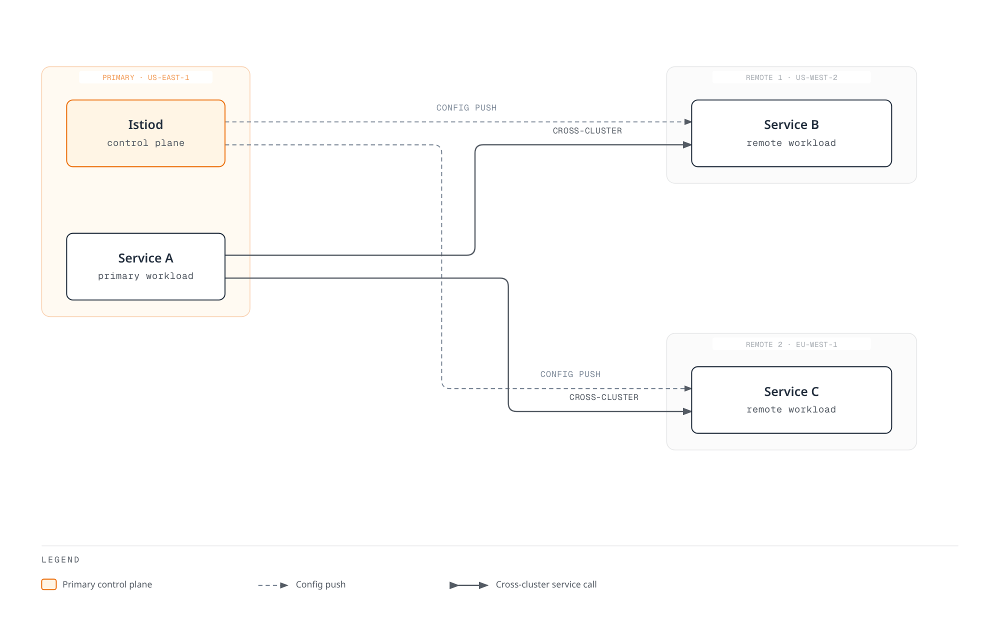
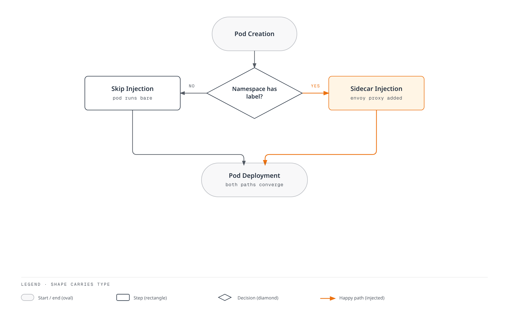
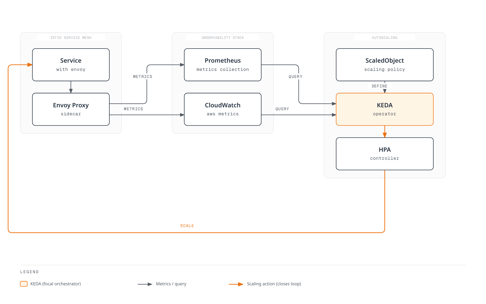

# Advanced

This section covers advanced Istio features including Ambient Mode, Multi-cluster, EnvoyFilter, gRPC/WebSocket support, and more.

## Table of Contents

1. [Ambient Mode](01-ambient-mode.md)
2. [Multi-cluster](02-multi-cluster.md)
3. [EnvoyFilter](03-envoy-filter.md)
4. [DNS Caching](04-dns-cache.md)
5. [gRPC](05-grpc.md)
6. [WebSocket](06-websocket.md)
7. [Sidecar Injection](07-sidecar-injection.md)
8. [Argo Rollouts Integration](08-argo-rollouts.md)
9. [Zone-Aware Argo Rollouts](09-zone-aware-argo-rollouts.md)
10. [KEDA Autoscaling](10-keda-autoscaling.md)

## Overview

This section covers advanced Istio features and in-depth topics needed for production environments.

### Key Topics


## 1. Ambient Mode

A new data plane architecture introduced in Istio 1.28+.

### Sidecar Mode vs Ambient Mode

| Characteristic | Sidecar Mode | Ambient Mode |
|----------------|-------------|--------------|
| **Architecture** | Envoy proxy injected in each pod | ztunnel (node-level) + waypoint (optional) |
| **Resource Usage** | High (proxy per pod) | Low (proxy per node) |
| **Deployment Complexity** | High (redeployment required) | Low (transparently applied) |
| **Performance** | Slightly slower (additional hop) | Faster (L4 only when needed) |
| **Features** | All features supported | L4 by default, L7 requires waypoint |

### Ambient Mode Architecture



**More details**: [Ambient Mode Detailed Guide](01-ambient-mode.md)

## 2. Multi-cluster

Connect multiple Kubernetes clusters as a single service mesh.

### Multi-cluster Topology



**Use Cases**:
- Multi-region deployment
- Disaster Recovery (DR)
- Blue/Green cluster deployment
- Environment isolation (dev/staging/prod)

**More details**: [Multi-cluster Setup Guide](02-multi-cluster.md)

## 3. EnvoyFilter

Directly customize Envoy proxy configuration.

### EnvoyFilter Use Cases

```yaml
# Add custom header
apiVersion: networking.istio.io/v1alpha3
kind: EnvoyFilter
metadata:
  name: custom-header
spec:
  workloadSelector:
    labels:
      app: myapp
  configPatches:
  - applyTo: HTTP_FILTER
    match:
      context: SIDECAR_OUTBOUND
    patch:
      operation: INSERT_BEFORE
      value:
        name: envoy.filters.http.lua
        typed_config:
          "@type": type.googleapis.com/envoy.extensions.filters.http.lua.v3.Lua
          inline_code: |
            function envoy_on_request(request_handle)
              request_handle:headers():add("x-custom-header", "value")
            end
```

**Key Use Cases**:
- Rate Limiting
- Custom Authentication/Authorization
- Header Manipulation
- Request/Response Transformation
- WASM Plugins

**More details**: [EnvoyFilter Guide](03-envoy-filter.md)

## 4. DNS Caching

Optimize performance by caching DNS lookups.

```yaml
apiVersion: networking.istio.io/v1
kind: DestinationRule
metadata:
  name: dns-cache
spec:
  host: external-api.example.com
  trafficPolicy:
    connectionPool:
      tcp:
        maxConnections: 100
      http:
        http1MaxPendingRequests: 100
```

**Benefits**:
- Reduced DNS lookup latency
- Reduced load on external DNS servers
- Consistent DNS responses

**More details**: [DNS Caching Guide](04-dns-cache.md)

## 5. gRPC Support

Provides optimized routing and load balancing for the gRPC protocol.

```yaml
apiVersion: networking.istio.io/v1
kind: VirtualService
metadata:
  name: grpc-service
spec:
  hosts:
  - grpc-service
  http:
  - match:
    - uri:
        prefix: /mypackage.MyService/
    route:
    - destination:
        host: grpc-service
        subset: v2
```

**Key Features**:
- HTTP/2-based load balancing
- gRPC health checks
- Deadlines and Retries
- Metadata-based routing

**More details**: [gRPC Guide](05-grpc.md)

## 6. WebSocket Support

Provides special handling for WebSocket connections.

```yaml
apiVersion: networking.istio.io/v1
kind: VirtualService
metadata:
  name: websocket-service
spec:
  hosts:
  - ws.example.com
  http:
  - match:
    - headers:
        upgrade:
          exact: websocket
    route:
    - destination:
        host: websocket-service
```

**Key Features**:
- Long-lived connection maintenance
- Connection Pool configuration
- Idle Timeout management

**More details**: [WebSocket Guide](06-websocket.md)

## 7. Sidecar Injection

Covers sidecar proxy injection mechanisms and customization.

### Injection Methods



**More details**: [Sidecar Injection Guide](07-sidecar-injection.md)

## 8. Argo Rollouts Integration

Implement advanced deployment strategies by integrating Argo Rollouts with Istio.

```yaml
apiVersion: argoproj.io/v1alpha1
kind: Rollout
metadata:
  name: myapp
spec:
  strategy:
    canary:
      trafficRouting:
        istio:
          virtualService:
            name: myapp-vsvc
            routes:
            - primary
      steps:
      - setWeight: 10
      - pause: {duration: 2m}
      - setWeight: 50
      - pause: {duration: 2m}
```

**Key Features**:
- Metrics-based automatic Canary deployment
- Analysis and automatic rollback
- Blue/Green deployment
- Progressive Delivery

**More details**: [Argo Rollouts Integration Guide](08-argo-rollouts.md)

## 9. Zone-Aware Argo Rollouts

Perform zone-aware Canary deployments by availability zone.

**More details**: [Zone-Aware Argo Rollouts Guide](09-zone-aware-argo-rollouts.md)

## 10. KEDA Autoscaling

Implement Istio metrics-based autoscaling using KEDA.

### KEDA vs HPA

| Feature | Kubernetes HPA | KEDA |
|---------|---------------|------|
| **Metric Sources** | CPU/Memory + Custom Metrics | 60+ Scalers (Prometheus, CloudWatch, Kafka, etc.) |
| **Scale to Zero** | Not supported (minimum 1) | Supported (0 pods possible) |
| **External Metrics** | Requires Metrics Server | Native support |
| **Complex Queries** | Limited | PromQL, CloudWatch Insights |

### KEDA Architecture



### Key Scaling Strategies

```yaml
# RPS-based scaling
apiVersion: keda.sh/v1alpha1
kind: ScaledObject
metadata:
  name: reviews-rps-scaler
spec:
  scaleTargetRef:
    name: reviews
  triggers:
  - type: prometheus
    metadata:
      query: |
        sum(rate(istio_requests_total{
          destination_workload="reviews"
        }[1m]))
      threshold: '100'
```

**Scaling Metrics**:
- **RPS (Requests Per Second)**: Based on requests per second
- **Latency (P50/P95/P99)**: Based on latency percentiles
- **Error Rate**: Based on 5xx error rate
- **Circuit Breaker**: Based on Circuit Breaker state
- **Composite Metrics**: Combination of multiple metrics

**Metric Sources**:
- **Prometheus**: Real-time Istio/Envoy metrics
- **AWS CloudWatch**: CloudWatch metrics via ADOT Collector

**More details**: [KEDA Autoscaling Guide](10-keda-autoscaling.md)

## Learning Path

1. **[Ambient Mode](01-ambient-mode.md)** - Understanding the new architecture
2. **[Multi-cluster](02-multi-cluster.md)** - Multi-cluster configuration
3. **[EnvoyFilter](03-envoy-filter.md)** - Advanced customization
4. **[Sidecar Injection](07-sidecar-injection.md)** - Injection mechanisms
5. **[gRPC](05-grpc.md)** - gRPC protocol support
6. **[WebSocket](06-websocket.md)** - WebSocket support
7. **[DNS Caching](04-dns-cache.md)** - Performance optimization
8. **[Argo Rollouts](08-argo-rollouts.md)** - Progressive Delivery
9. **[Zone-Aware Argo Rollouts](09-zone-aware-argo-rollouts.md)** - Zone-based deployment
10. **[KEDA Autoscaling](10-keda-autoscaling.md)** - Metrics-based autoscaling

## References

- [Istio Advanced Features](https://istio.io/latest/docs/ops/)
- [Ambient Mode Documentation](https://istio.io/latest/docs/ops/ambient/)
- [Multi-cluster Documentation](https://istio.io/latest/docs/setup/install/multicluster/)
- [EnvoyFilter Reference](https://istio.io/latest/docs/reference/config/networking/envoy-filter/)

## Quiz

To test what you've learned in this chapter, take the [Istio Advanced Quiz](../../../quizzes/service-mesh/istio/advanced.md).
