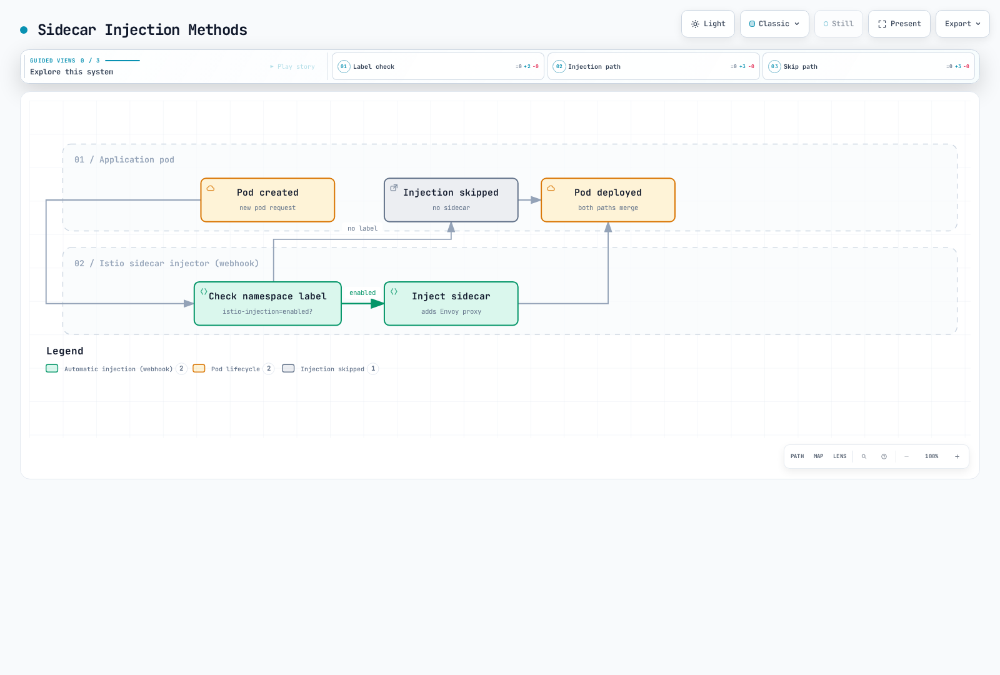
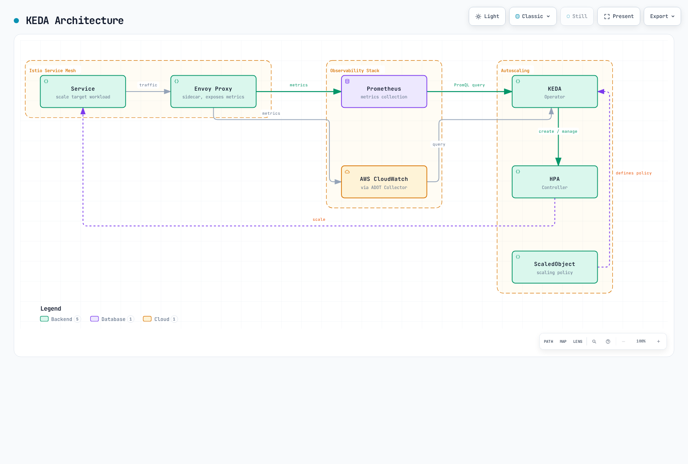

# Advanced

> **Last Updated**: September 11, 2026 · Istio1.31. These independent examples assume the named workloads, Services and controllers exist. Follow each detailed chapter for installation/compatibility and validation; snippets are not a production-tested stack.

This section covers advanced Istio features including Ambient Mode, Multi-cluster, EnvoyFilter, gRPC/WebSocket support, and more.

## Table of Contents

1. [Ambient Mode](01-ambient-mode.md)
2. [Multi-cluster](02-multi-cluster.md)
3. [EnvoyFilter](03-envoy-filter.md)
4. [DNS Caching](04-dns-cache.md)
5. [gRPC](05-grpc.md)
6. [WebSocket](06-websocket.md)
7. [Sidecar Injection](07-sidecar-injection.md)
8. [Argo Rollouts Integration](08-argo-rollouts.md)
9. [Zone-Aware Argo Rollouts](09-zone-aware-argo-rollouts.md)
10. [KEDA Autoscaling](10-keda-autoscaling.md)

## Overview

This section covers advanced Istio features and in-depth topics needed for production environments.

### Key Topics

Deployment mode, protocol routing, customization, rollout control and autoscaling are related but distinct choices. EnvoyFilter does not configure Rust-based ztunnel, and Istio traffic routing for Argo Rollouts is not inherently dependent on application sidecar injection.

## 1. Ambient Mode

Ambient first shipped as alpha in Istio1.18 and reached GA in1.24. It separates the node-level L4 secure overlay from optional waypoint-based L7 processing.

### Sidecar Mode vs Ambient Mode

| Characteristic | Sidecar Mode | Ambient Mode |
|----------------|-------------|--------------|
| **Architecture** | Envoy proxy injected in each pod | ztunnel (node-level) + waypoint (optional) |
| **Resource model** | Per-Pod Envoy allocation | Shared ztunnel plus any waypoint allocation; measure total usage |
| **Enrollment** | Injection generally requires creating new Pods | Label-based enrollment with required CNI/ztunnel; waypoint enrollment is separate |
| **Performance** | Depends on proxy/workload configuration | Depends on path, waypoint use and capacity; not universally faster |
| **Features** | Mature L4/L7 feature set | L4 by default; L7 requires waypoint; verify release-specific feature support |

### Ambient Mode Architecture


[🔍 View interactive diagram](https://www.atomai.click/kubernetes-docs/archmaps/en-service-mesh-istio-advanced-readme-1.html)

The architecture figure is conceptual: a resource must be enrolled to use a waypoint. The configured traffic scope then traverses that waypoint; ztunnel does not inspect HTTP requests and decide per request whether L7 is needed.

**More details**: [Ambient Mode Detailed Guide](01-ambient-mode.md)

## 2. Multi-cluster

Connect multiple Kubernetes clusters as a single service mesh.

### Multi-cluster Topology


[🔍 View interactive diagram](https://www.atomai.click/kubernetes-docs/archmaps/en-service-mesh-istio-advanced-readme-2.html)

**Use Cases**:
- Multi-region deployment
- Disaster Recovery (DR)
- Blue/Green cluster deployment
- Deliberately connect selected environments; isolation still needs identity/network/authorization boundaries

The figure illustrates a primary/remote topology with assumed connectivity. Multi-primary is another topology; different networks require suitable east-west gateway/routing and trust configuration. Merely connecting clusters does not provide DR or isolate environments.

**More details**: [Multi-cluster Setup Guide](02-multi-cluster.md)

## 3. EnvoyFilter

Directly customize Envoy proxy configuration.

### EnvoyFilter Use Cases

Prefer supported APIs such as VirtualService headers, AuthorizationPolicy or WasmPlugin when they express the requirement. This Lua example illustrates a version-sensitive sidecar extension, not a universal ambient configuration or authentication system.


```yaml
apiVersion: networking.istio.io/v1alpha3
kind: EnvoyFilter
metadata:
  name: custom-header
  namespace: default
spec:
  workloadSelector:
    labels:
      app: myapp
  configPatches:
  - applyTo: HTTP_FILTER
    match:
      context: SIDECAR_OUTBOUND
      listener:
        filterChain:
          filter:
            name: envoy.filters.network.http_connection_manager
            subFilter:
              name: envoy.filters.http.router
    patch:
      operation: INSERT_BEFORE
      value:
        name: envoy.filters.http.lua
        typed_config:
          '@type': type.googleapis.com/envoy.extensions.filters.http.lua.v3.Lua
          default_source_code:
            inline_string: "function envoy_on_request(request_handle)\n  request_handle:headers():replace(\"x-custom-header\", \"value\")\nend\n"
```

**Key Use Cases**:
- Rate Limiting
- Custom Authentication/Authorization
- Header Manipulation
- Request/Response Transformation
- WASM Plugins

**More details**: [EnvoyFilter Guide](03-envoy-filter.md)

## 4. DNS Caching

Istio DNS proxying captures application DNS queries and can answer mesh/service entries locally. A DestinationRule connection pool does not enable DNS caching. Merge this Pod-template fragment and create new sidecar Pods:

```yaml
spec:
  template:
    metadata:
      annotations:
        proxy.istio.io/config: "proxyMetadata:\n  ISTIO_META_DNS_CAPTURE: \"true\"\n"
```

**Benefits**:
- Reduced DNS lookup latency
- Reduced load on external DNS servers
- Registry-aware answers, subject to discovery/TTL/refresh behavior

Sidecar DNS capture is opt-in; ambient enables DNS proxying by default from1.25. Capture, registry address allocation and upstream DNS refresh are separate behaviors; caching does not promise permanently identical DNS answers or eliminate every external lookup.

**More details**: [DNS Caching Guide](04-dns-cache.md)

## 5. gRPC Support

gRPC uses HTTP/2 routing. This example assumes a `grpc-service` Service with a named gRPC port9090 and ready Pods labeled `version: v2`. RPCs are not inherently idempotent, so mesh retries are explicitly disabled here; clients still need deadlines/context propagation.

```yaml
apiVersion: networking.istio.io/v1
kind: VirtualService
metadata:
  name: grpc-service
  namespace: default
spec:
  hosts:
  - grpc-service
  http:
  - match:
    - uri:
        prefix: /mypackage.MyService/
    route:
    - destination:
        host: grpc-service
        subset: v2
        port:
          number: 9090
    retries:
      attempts: 0
  - route:
    - destination:
        host: grpc-service
        port:
          number: 9090
    retries:
      attempts: 0
---
apiVersion: networking.istio.io/v1
kind: DestinationRule
metadata:
  name: grpc-service
  namespace: default
spec:
  host: grpc-service
  subsets:
  - name: v2
    labels:
      version: v2
```

**Key Features**:
- HTTP/2-based load balancing
- Application health protocol/Kubernetes probes when explicitly configured
- Deadlines and Retries
- Metadata-based routing

**More details**: [gRPC Guide](05-grpc.md)

## 6. WebSocket Support

Istio supports HTTP WebSocket upgrades. This assumes an existing `my-gateway` in `default` for `ws.example.com`, and an HTTP8080 backend Service serving `/ws`. An exact case-sensitive Upgrade-header match is unnecessary.

```yaml
apiVersion: networking.istio.io/v1
kind: VirtualService
metadata:
  name: websocket-service
  namespace: default
spec:
  hosts:
  - ws.example.com
  http:
  - match:
    - uri:
        prefix: /ws
    route:
    - destination:
        host: websocket-service
        port:
          number: 8080
    retries:
      attempts: 0
  gateways:
  - my-gateway
```

**Key Features**:
- Long-lived connection maintenance
- Connection Pool configuration
- Idle Timeout management

This example omits the HTTP route timeout, which is disabled by default in Istio; that does not disable all load-balancer/proxy/application idle or maximum-duration limits. Plan connection draining and reconnect behavior during rollout.

**More details**: [WebSocket Guide](06-websocket.md)

## 7. Sidecar Injection

Covers sidecar proxy injection mechanisms and customization.

### Injection Methods



[🔍 View interactive diagram](https://www.atomai.click/kubernetes-docs/archmaps/en-service-mesh-istio-advanced-readme-3.html)

The diagram shows only the simple namespace-label branch. Actual injection also depends on Pod labels, revision/webhook selectors, exclusions and the chosen sidecar lifecycle; changing a namespace label does not inject already-running Pods.

**More details**: [Sidecar Injection Guide](07-sidecar-injection.md)

## 8. Argo Rollouts Integration

The following is a **strategy fragment** for a complete Rollout with selector, Pod template and containers. It also requires the controller, stable/canary Services and a VirtualService `primary` route with matching destinations. Analysis/automatic rollback requires its own AnalysisTemplate and policy; the steps alone do not configure metric analysis. Only traffic handled by the intended Istio routing path follows these weights.

```yaml
spec:
  strategy:
    canary:
      trafficRouting:
        istio:
          virtualService:
            name: myapp-vsvc
            routes:
            - primary
      steps:
      - setWeight: 10
      - pause:
          duration: 2m
      - setWeight: 50
      - pause:
          duration: 2m
      stableService: myapp-stable
      canaryService: myapp-canary
```

**Key Features**:
- Metrics-based automatic Canary deployment
- Analysis and automatic rollback
- Blue/Green deployment
- Progressive Delivery

**More details**: [Argo Rollouts Integration Guide](08-argo-rollouts.md)

## 9. Zone-Aware Argo Rollouts

Perform zone-aware Canary deployments by availability zone.

**More details**: [Zone-Aware Argo Rollouts Guide](09-zone-aware-argo-rollouts.md)

## 10. KEDA Autoscaling

Implement Istio metrics-based autoscaling using KEDA.

### KEDA vs HPA

| Topic | Kubernetes HPA | KEDA |
|---|---|---|
|Metric inputs|Resource/custom/external metrics APIs|Scalers expose backend metrics to HPA|
|Scaling roles|Replica adjustment, normally with minReplicas1|Activation/deactivation plus a managed HPA for1→N|
|External metrics|Requires an external-metrics adapter|Provides its metrics API adapter|
|Query logic|Consumes numeric metric values|PromQL or CloudWatch metric/math/Metrics Insights queries, depending on scaler|

Metrics Server supplies resource metrics; it is not the generic external-metrics adapter. KEDA2.20 requires Kubernetes≥1.30; verify the selected release, APIs and platform support independently of Istio. Scale-to-zero also requires a signal that stays observable at zero and a viable activation path. CloudWatch Metrics Insights is distinct from CloudWatch Logs Insights.

### KEDA Architecture



[🔍 View interactive diagram](https://www.atomai.click/kubernetes-docs/archmaps/en-service-mesh-istio-advanced-readme-4.html)

### Key Scaling Strategies

This KEDA2.20 API example assumes an existing `reviews` Deployment in `default`, collected destination-workload metrics and an accessible private Prometheus endpoint. Configure supported authentication/TLS for your backend. It returns one aggregate value and uses an AverageValue target of100 requests/s per replica.


```yaml
apiVersion: keda.sh/v1alpha1
kind: ScaledObject
metadata:
  name: reviews-rps-scaler
  namespace: default
spec:
  scaleTargetRef:
    name: reviews
  triggers:
  - type: prometheus
    metadata:
      query: sum(rate(istio_requests_total{reporter="destination",destination_workload="reviews",destination_workload_namespace="default"}[1m]))
      threshold: '100'
      serverAddress: http://prometheus.istio-system.svc.cluster.local:9090
      ignoreNullValues: 'false'
    metricType: AverageValue
  minReplicaCount: 1
  maxReplicaCount: 10
```

The minimum remains1 because destination traffic metrics disappear when the target has no running Pods; this example cannot wake itself from zero. `ignoreNullValues: false` treats an empty result as an error instead of silently treating lost telemetry as zero. Do not attach a competing HPA to the same workload. Latency/error ratios and breaker gauges are not inherently proportional to replica capacity; validate their control behavior rather than adding them as arbitrary scaling signals.

**Scaling Metrics**:
- **RPS (Requests Per Second)**: Based on requests per second
- **Latency (P50/P95/P99)**: Based on latency percentiles
- **Error Rate**: Based on 5xx error rate
- **Circuit Breaker**: Based on Circuit Breaker state
- **Composite Metrics**: Combination of multiple metrics

**Metric Sources**:
- **Prometheus**: Real-time Istio/Envoy metrics
- **AWS CloudWatch**: CloudWatch metrics via ADOT Collector

**More details**: [KEDA Autoscaling Guide](10-keda-autoscaling.md)

## Learning Path

1. **[Ambient Mode](01-ambient-mode.md)** - Understanding the new architecture
2. **[Multi-cluster](02-multi-cluster.md)** - Multi-cluster configuration
3. **[EnvoyFilter](03-envoy-filter.md)** - Advanced customization
4. **[Sidecar Injection](07-sidecar-injection.md)** - Injection mechanisms
5. **[gRPC](05-grpc.md)** - gRPC protocol support
6. **[WebSocket](06-websocket.md)** - WebSocket support
7. **[DNS Caching](04-dns-cache.md)** - Performance optimization
8. **[Argo Rollouts](08-argo-rollouts.md)** - Progressive Delivery
9. **[Zone-Aware Argo Rollouts](09-zone-aware-argo-rollouts.md)** - Zone-based deployment
10. **[KEDA Autoscaling](10-keda-autoscaling.md)** - Metrics-based autoscaling

## References

- [Istio Advanced Features](https://istio.io/latest/docs/ops/)
- [Ambient Mode Documentation](https://istio.io/latest/docs/ambient/overview/)
- [Multi-cluster Documentation](https://istio.io/latest/docs/setup/install/multicluster/)
- [EnvoyFilter Reference](https://istio.io/latest/docs/reference/config/networking/envoy-filter/)

## Quiz

To test what you've learned in this chapter, take the [Istio Advanced Quiz](../../../quizzes/service-mesh/istio/advanced.md).
