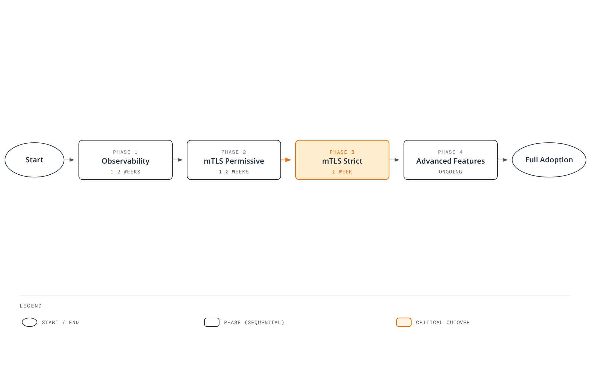

# Istio Best Practices

This document covers best practices and recommendations for successfully operating Istio in production environments.

## Table of Contents

1. [Performance Optimization](#performance-optimization)
2. [Security Hardening](#security-hardening)
3. [Operations Guide](#operations-guide)
4. [Monitoring and Observability](#monitoring-and-observability)
5. [Production Checklist](#production-checklist)

Reviewed for Istio 1.31 on September 11, 2026. `IstioOperator` excerpts are input to `istioctl install -f`, not Kubernetes resources to apply with kubectl. Merge them into the existing installation configuration; use equivalent chart values for Helm. Most examples describe sidecars; use waypoint/Gateway API policies for ambient. Resource settings and rollout durations are starting points to validate under load.

## Performance Optimization

### 1. Control Plane Resource Optimization

```yaml
apiVersion: install.istio.io/v1alpha1
kind: IstioOperator
spec:
  components:
    pilot:
      k8s:
        resources:
          requests:
            cpu: 500m
            memory: 2Gi
          limits:
            cpu: 1000m
            memory: 4Gi
        hpaSpec:
          minReplicas: 2
          maxReplicas: 5
          metrics:
          - type: Resource
            resource:
              name: cpu
              target:
                type: Utilization
                averageUtilization: 80
```

**Recommendations**:
- Istiod should have at least 2 replicas
- CPU: Adjust based on cluster size
- Memory: Measure service/proxy count, configuration size, and update rate; no fixed per-service formula

### 2. Data Plane Resource Optimization

```yaml
apiVersion: v1
kind: Pod
metadata:
  name: myapp
  labels:
    sidecar.istio.io/inject: "true"
  annotations:
    # Sidecar resource optimization
    sidecar.istio.io/proxyCPU: "100m"
    sidecar.istio.io/proxyMemory: "128Mi"
    sidecar.istio.io/proxyCPULimit: "200m"
    sidecar.istio.io/proxyMemoryLimit: "256Mi"
spec:
  containers:
  - name: myapp
    image: myapp:latest
```

**Recommendations**:
- Normal workloads: CPU 100m, Memory 128Mi
- High-traffic workloads: CPU 500m, Memory 512Mi
- Sidecar concurrency: normally leave unset so Istio derives worker threads from CPU requests/limits

### 3. Connection Pool Optimization

```yaml
apiVersion: networking.istio.io/v1
kind: DestinationRule
metadata:
  name: optimized-pool
spec:
  host: myapp
  trafficPolicy:
    connectionPool:
      tcp:
        maxConnections: 100
        connectTimeout: 30ms
      http:
        http1MaxPendingRequests: 50
        http2MaxRequests: 100
        maxRequestsPerConnection: 0
        idleTimeout: 300s
```

**Recommendations**:
- `maxConnections`: Consider workload concurrent connections
- `maxRequestsPerConnection`: 0 means unlimited; small values increase connection churn and TLS handshakes
- `idleTimeout`: Increase if long-lived connections are needed

### 4. Locality Load Balancing

```yaml
apiVersion: networking.istio.io/v1
kind: DestinationRule
metadata:
  name: locality-lb
spec:
  host: myapp
  trafficPolicy:
    loadBalancer:
      localityLbSetting:
        enabled: true
        distribute:
        - from: us-east-1/us-east-1a/*
          to:
            "us-east-1/us-east-1a/*": 80  # Same AZ priority
            "us-east-1/us-east-1b/*": 20
    outlierDetection:
      consecutive5xxErrors: 5
      interval: 5s
      baseEjectionTime: 30s
```

**Benefits**:
- Potential cross-AZ traffic reduction; savings depend on traffic distribution and billing
- Reduced network latency
- Validate failover with outlier detection and healthy capacity in other zones

### 5. Sidecar Scope Limitation

```yaml
apiVersion: networking.istio.io/v1
kind: Sidecar
metadata:
  name: default
  namespace: default
spec:
  egress:
  - hosts:
    - "default/*"
    - "istio-system/*"
```

**Benefits**:
- Reduced Envoy configuration size
- Reduced memory usage
- Faster configuration push

## Security Hardening

### 1. Apply Strict mTLS

```yaml
apiVersion: security.istio.io/v1
kind: PeerAuthentication
metadata:
  name: default
  namespace: istio-system
spec:
  mtls:
    mode: STRICT  # STRICT recommended for production
```

**Checklist**:
- Apply STRICT mTLS to all services
- Use PERMISSIVE only during migration periods
- PeerAuthentication controls inbound workload mTLS. Configure external HTTPS/TLS in ServiceEntry and, when needed, DestinationRule; do not disable mesh mTLS globally.

### 2. Authorization Policy

```yaml
# Deny by default
apiVersion: security.istio.io/v1
kind: AuthorizationPolicy
metadata:
  name: deny-all
  namespace: default
spec: {}  # Deny all requests
---
# Allow specific
apiVersion: security.istio.io/v1
kind: AuthorizationPolicy
metadata:
  name: allow-frontend
  namespace: default
spec:
  selector:
    matchLabels:
      app: backend
  action: ALLOW
  rules:
  - from:
    - source:
        principals: ["cluster.local/ns/default/sa/frontend"]
```

**Best Practices**:
- Use deny-by-default policy
- Apply principle of least privilege
- Service Account-based authentication
- Namespace isolation

### 3. Egress Traffic Control

```yaml
# Detect unregistered destinations; not an egress firewall
apiVersion: install.istio.io/v1alpha1
kind: IstioOperator
spec:
  meshConfig:
    outboundTrafficPolicy:
      mode: REGISTRY_ONLY  # Known Kubernetes services and ServiceEntries
```

Apply this separate ServiceEntry with kubectl. Enforce egress isolation with network controls; REGISTRY_ONLY is not a security boundary.

```yaml
# Allowed external services
apiVersion: networking.istio.io/v1
kind: ServiceEntry
metadata:
  name: external-api
spec:
  hosts:
  - api.external.com
  ports:
  - number: 443
    name: https
    protocol: HTTPS
  location: MESH_EXTERNAL
  resolution: DNS
```

### 4. JWT Authentication

```yaml
apiVersion: security.istio.io/v1
kind: RequestAuthentication
metadata:
  name: jwt-auth
spec:
  selector:
    matchLabels:
      app: api-service
  jwtRules:
  - issuer: "https://auth.example.com"
    jwksUri: "https://auth.example.com/.well-known/jwks.json"
---
apiVersion: security.istio.io/v1
kind: AuthorizationPolicy
metadata:
  name: require-jwt
spec:
  selector:
    matchLabels:
      app: api-service
  action: ALLOW
  rules:
  - when:
    - key: request.auth.claims[iss]
      values: ["https://auth.example.com"]
```

## Operations Guide

### 1. Deployment Strategy

#### Gradual Istio Adoption



[🔍 View interactive diagram](https://www.atomai.click/kubernetes-docs/archmaps/en-service-mesh-istio-best-practices-0.html)

**Phase 1: Observability (1-2 weeks)**
```bash
# Enable sidecar injection only
kubectl label namespace default istio-injection=enabled --overwrite
kubectl rollout restart deployment -n default

# Verify metrics, logs, traces
# Evaluate performance impact
```

**Phase 2: mTLS PERMISSIVE (1-2 weeks)**
```yaml
# Enable PERMISSIVE mode
apiVersion: security.istio.io/v1
kind: PeerAuthentication
metadata:
  name: default
spec:
  mtls:
    mode: PERMISSIVE
```

**Phase 3: mTLS STRICT (1 week)**
```yaml
# Switch to STRICT mode
apiVersion: security.istio.io/v1
kind: PeerAuthentication
metadata:
  name: default
spec:
  mtls:
    mode: STRICT
```

**Phase 4: Advanced Features (Ongoing)**
- Traffic Management (Canary, Circuit Breaker)
- Authorization Policy
- Rate Limiting

### 2. Upgrade Strategy

#### Canary Upgrade

Use the target 1.31.0 istioctl binary from the installation guide; setting a revision name does not select an image version. This example upgrades from 1.30.4, preserves the existing installation settings, and requires validating every stage. Gateways can be upgraded in place by the default profile; plan their rollout explicitly. A Helm-managed installation must use the Helm upgrade workflow.

```bash
# 1. Install new version Control Plane
istioctl install --set revision=1-31-0 -f existing-install.yaml

# 2. Move test namespace
kubectl label namespace test istio-injection- istio.io/rev=1-31-0 --overwrite
kubectl rollout restart deployment -n test

# 3. Move production after verification
kubectl label namespace prod istio-injection- istio.io/rev=1-31-0 --overwrite
kubectl rollout restart deployment -n prod

# 4. Remove previous version
istioctl proxy-status
# Only after every proxy/gateway has migrated; substitute the actual old revision
istioctl uninstall --revision=1-30-4
```

### 3. High Availability

```yaml
# Control Plane HA
apiVersion: install.istio.io/v1alpha1
kind: IstioOperator
spec:
  components:
    pilot:
      k8s:
        hpaSpec:
          minReplicas: 3
          maxReplicas: 5
        affinity:
          podAntiAffinity:
            preferredDuringSchedulingIgnoredDuringExecution:
            - weight: 100
              podAffinityTerm:
                labelSelector:
                  matchLabels:
                    app: istiod
                topologyKey: topology.kubernetes.io/zone
```

**Recommendations**:
- Istiod: Minimum 3 replicas
- Distribute evenly across AZs
- Set up PodDisruptionBudget

### 4. Backup and Recovery

```bash
# Preserve the versioned installation input in source control
cp existing-install.yaml istio-install-backup.yaml
# Snapshot mesh configuration; this does not include Secrets or Gateway API resources
kubectl get virtualservices.networking.istio.io,destinationrules.networking.istio.io,gateways.networking.istio.io,serviceentries.networking.istio.io,sidecars.networking.istio.io,workloadentries.networking.istio.io,workloadgroups.networking.istio.io,peerauthentications.security.istio.io,requestauthentications.security.istio.io,authorizationpolicies.security.istio.io,telemetries.telemetry.istio.io -A -o yaml > istio-config-backup.yaml

# Restore the matching Istio version and CRDs first, then declarative resources
istioctl install -f istio-install-backup.yaml
kubectl apply -f istio-config-backup.yaml
```

For Helm installations, preserve chart versions and `helm get values <release> -n <namespace> -o yaml` instead. Back up CA/TLS Secrets securely and include any Gateway API, EnvoyFilter, or WasmPlugin resources in use. Recreate required namespaces and review generated snapshots before restoration.

## Monitoring and Observability

### 1. Golden Signals

```promql
# 1. Latency (P50, P95, P99)
histogram_quantile(0.95,
  sum(rate(istio_request_duration_milliseconds_bucket{reporter="destination"}[5m])) by (le)
)

# 2. Traffic (Request count)
sum(rate(istio_requests_total{reporter="destination"}[5m]))

# 3. Errors (Error rate)
sum(rate(istio_requests_total{reporter="destination",response_code=~"5.."}[5m]))
/
sum(rate(istio_requests_total{reporter="destination"}[5m]))

# 4. Saturation (Resource utilization)
sum(rate(container_cpu_usage_seconds_total{container="istio-proxy"}[5m]))
```

### 2. Control Plane Monitoring

```promql
# Pilot configuration push time
histogram_quantile(0.95, sum(rate(pilot_proxy_convergence_time_bucket[5m])) by (le))

# xDS connection count
pilot_xds

# Memory usage
process_resident_memory_bytes{job="istiod"}
```

### 3. Data Plane Monitoring

Confirm these Envoy statistics are enabled in the proxy stats matcher. Scrape job labels are configuration-dependent; the examples assume `job="istiod"`. An `up` alert detects scrape availability, not all readiness failures.

```promql
# Envoy connection count
envoy_cluster_upstream_cx_active

# Circuit Breaker open
envoy_cluster_circuit_breakers_default_rq_open

# Outlier Detection
envoy_cluster_outlier_detection_ejections_active
```

### 4. Alerting Rules

```yaml
groups:
- name: istio
  rules:
  # High error rate
  - alert: HighErrorRate
    expr: |
      (sum(rate(istio_requests_total{reporter="destination",response_code=~"5.."}[5m]))
      /
      sum(rate(istio_requests_total{reporter="destination"}[5m]))) > 0.05
    for: 5m
    labels:
      severity: warning
    annotations:
      summary: "High error rate detected"

  # High latency
  - alert: HighLatency
    expr: |
      histogram_quantile(0.95,
        sum(rate(istio_request_duration_milliseconds_bucket{reporter="destination"}[5m])) by (le)
      ) > 1000
    for: 5m
    labels:
      severity: warning
    annotations:
      summary: "High latency detected (P95 > 1s)"

  # Pilot not ready
  - alert: IstiodScrapeUnavailable
    expr: up{job="istiod"} == 0 or absent(up{job="istiod"})
    for: 5m
    labels:
      severity: critical
    annotations:
      summary: "Istiod scrape target is unavailable"
```

## Production Checklist

### Pre-Installation

- [ ] Verify Istio/Kubernetes/EKS support overlap (1.31 example: EKS 1.34–1.36)
- [ ] Select Istio version (stable version recommended)
- [ ] Calculate resource requirements
- [ ] Review network policies
- [ ] Establish backup and recovery plan

### Installation

- [ ] Use production profile
- [ ] Configure Control Plane HA (replica >= 3)
- [ ] Set resource limits
- [ ] Set up PodDisruptionBudget
- [ ] Prepare monitoring stack

### Security

- [ ] Enable mTLS STRICT mode
- [ ] Apply Authorization Policy
- [ ] Control egress traffic
- [ ] Configure JWT authentication (if needed)
- [ ] Integrate Network Policy

### Traffic Management

- [ ] Configure VirtualService
- [ ] Configure DestinationRule
- [ ] Set up Circuit Breaker
- [ ] Set up Retry/Timeout
- [ ] Configure Rate Limiting

### Observability

- [ ] Integrate Prometheus
- [ ] Set up Grafana dashboards
- [ ] Set up Jaeger/Zipkin tracing
- [ ] Install Kiali
- [ ] Set up alerting rules

### Operations

- [ ] Establish upgrade plan
- [ ] Automate backups
- [ ] Documentation
- [ ] Write on-call guide
- [ ] Prepare runbook

### Performance

- [ ] Optimize Sidecar resources
- [ ] Tune Connection Pool
- [ ] Configure Locality Load Balancing
- [ ] Limit Sidecar Scope
- [ ] Perform performance testing

### Testing

- [ ] Functional testing
- [ ] Performance testing
- [ ] Disaster recovery testing
- [ ] Chaos engineering
- [ ] Upgrade scenario testing

## Common Anti-patterns

### Things to Avoid

1. **Adopting everything at once**
   ```
   Don't enable all Istio features on Day 1
   Do add features gradually (Observability -> Security -> Traffic Management)
   ```

2. **No resource limits**
   ```yaml
   Don't leave Sidecar without resource limits
   Do set appropriate requests/limits
   ```

3. **Long-term use of PERMISSIVE mode**
   ```
   Don't keep using PERMISSIVE
   Do transition to STRICT quickly
   ```

4. **Wildcard match abuse**
   ```yaml
   Don't: hosts: ["*"]  # All services
   Do: hosts: ["myapp.default.svc.cluster.local"]  # Explicit
   ```

5. **Deploying without monitoring**
   ```
   Don't deploy to production without checking metrics
   Do require Golden Signals monitoring
   ```

## Cost Optimization

- Compare measured sidecar resource requests with ztunnel plus any required waypoint capacity. Pod count alone does not establish a fixed savings percentage.
- Measure cross-AZ bytes and use current AWS regional pricing for the actual path; locality weights do not translate directly into a universal billing reduction.
- Scope unnecessary proxy configuration and measure memory/push-time changes under representative load.

## References

### Official Documentation
- [Istio Best Practices](https://istio.io/latest/docs/ops/best-practices/)
- [Performance and Scalability](https://istio.io/latest/docs/ops/deployment/performance-and-scalability/)
- [Security Best Practices](https://istio.io/latest/docs/ops/best-practices/security/)

### Community
- [Istio community](https://istio.io/latest/get-involved/)
- [Istio Slack](https://slack.istio.io/)
- [GitHub Issues](https://github.com/istio/istio/issues)

### Additional Resources
- [Istio deployment best practices](https://istio.io/latest/docs/ops/best-practices/deployment/)
- [Istio traffic management best practices](https://istio.io/latest/docs/ops/best-practices/traffic-management/)

- [Canary Upgrades](https://istio.io/latest/docs/setup/upgrade/canary/)
- [IstioOperator Options](https://istio.io/latest/docs/reference/config/istio.operator.v1alpha1/)
- [Global Mesh Options](https://istio.io/latest/docs/reference/config/istio.mesh.v1alpha1/)
- [Istio xDS metric definitions (1.31.0)](https://raw.githubusercontent.com/istio/istio/1.31.0/pilot/pkg/xds/monitoring.go)
- [Locality failover](https://istio.io/latest/docs/tasks/traffic-management/locality-load-balancing/failover/)
- [Envoy Statistics](https://istio.io/latest/docs/ops/configuration/telemetry/envoy-stats/)
- [Sidecar](https://istio.io/latest/docs/reference/config/networking/sidecar/)
- [supported releases](https://istio.io/latest/docs/releases/supported-releases/)
