# Service Mesh Solution Comparison

> **Last Updated**: February 19, 2026 **Comparison Targets**: Istio 1.24, Linkerd 2.15, Kong Mesh 2.8, Consul Connect 1.19

This document provides a comprehensive comparison of major Service Mesh solutions available in Kubernetes environments.

## Table of Contents

1. [Overview and Architecture](01-service-mesh-comparison.md#overview-and-architecture)
2. [Performance Comparison](01-service-mesh-comparison.md#performance-comparison)
3. [Feature Comparison](01-service-mesh-comparison.md#feature-comparison)
4. [Operational Complexity](01-service-mesh-comparison.md#operational-complexity)
5. [Security Features](01-service-mesh-comparison.md#security-features)
6. [Observability Features](01-service-mesh-comparison.md#observability-features)
7. [Multi-Cluster Support](01-service-mesh-comparison.md#multi-cluster-support)
8. [Cost Analysis](01-service-mesh-comparison.md#cost-analysis)
9. [Use Case Recommendations](01-service-mesh-comparison.md#use-case-recommendations)

## Overview and Architecture

### What is a Service Mesh?

A Service Mesh is an infrastructure layer that manages communication between microservices. It provides traffic management, security, and observability features without modifying application code.

#### Basic Concepts of Service Mesh

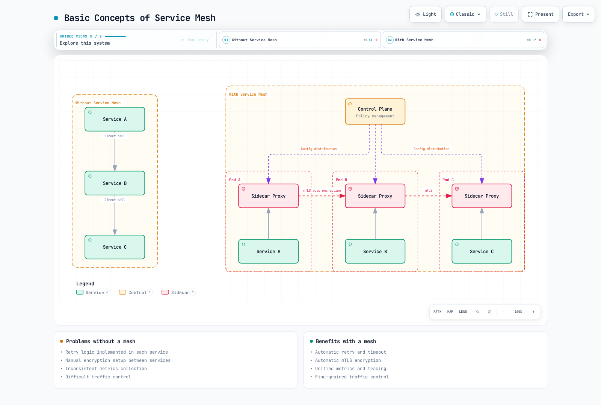

[🔍 View interactive diagram](https://www.atomai.click/kubernetes-docs/archmaps/en-service-mesh-istio-comparison-01-service-mesh-comparison-0.html)

#### Architecture Pattern Comparison

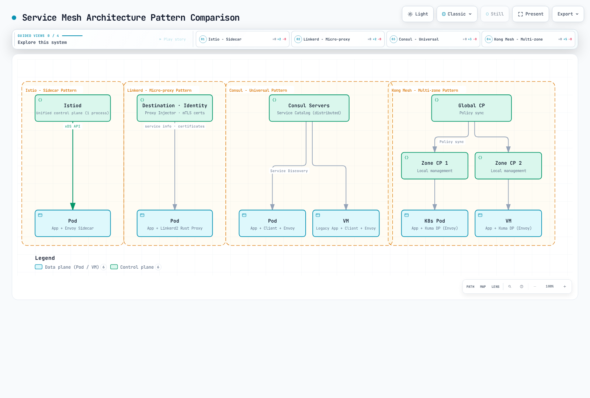

[🔍 View interactive diagram](https://www.atomai.click/kubernetes-docs/archmaps/en-service-mesh-istio-comparison-01-service-mesh-comparison-1.html)

### Detailed Architecture

#### Istio

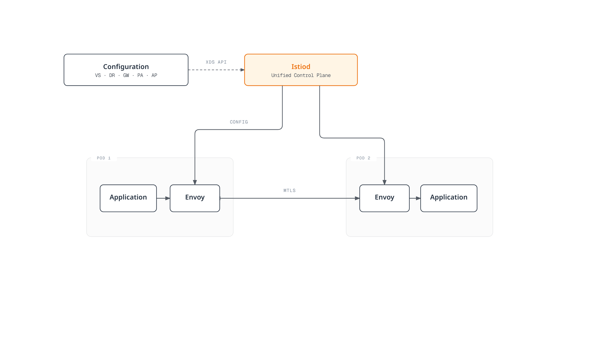

[🔍 View interactive diagram](https://www.atomai.click/kubernetes-docs/archmaps/en-service-mesh-istio-comparison-01-service-mesh-comparison-2.html)

**Features**:

* **Proxy**: Envoy (C++)
* **Architecture**: Unified Control Plane (Istiod)
* **Configuration**: Kubernetes CRD (VirtualService, DestinationRule, etc.)
* **Strengths**: Most feature-rich, large-scale enterprise support
* **Weaknesses**: High learning curve, resource overhead

**Core Components**:

* **Istiod**: Pilot + Citadel + Galley unified
* **Envoy Proxy**: Data Plane
* **Ingress/Egress Gateway**: Cluster boundary traffic control

### Linkerd

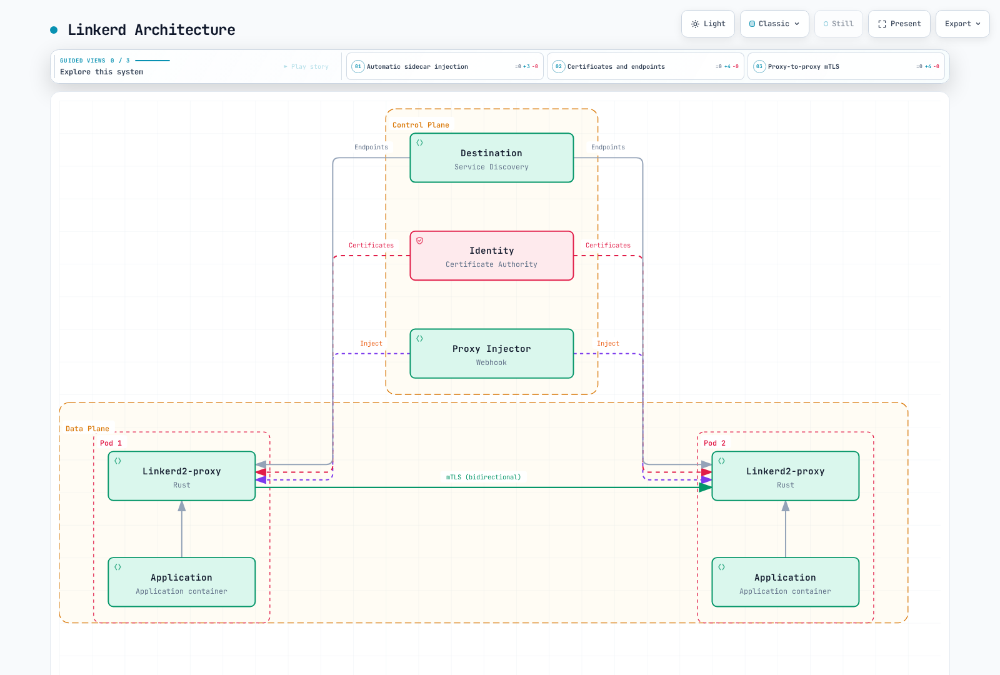

[🔍 View interactive diagram](https://www.atomai.click/kubernetes-docs/archmaps/en-service-mesh-istio-comparison-01-service-mesh-comparison-3.html)

**Features**:

* **Proxy**: Linkerd2-proxy (Rust, custom-built)
* **Architecture**: Microservice Control Plane
* **Configuration**: Kubernetes native resources + simple Annotations
* **Strengths**: Ultra-lightweight, easy installation and operation, fast performance
* **Weaknesses**: Limited features, no VM support

**Core Components**:

* **Destination**: Service Discovery and routing policies
* **Identity**: Automatic mTLS certificate issuance
* **Proxy Injector**: Automatic Sidecar injection

### Kong Mesh

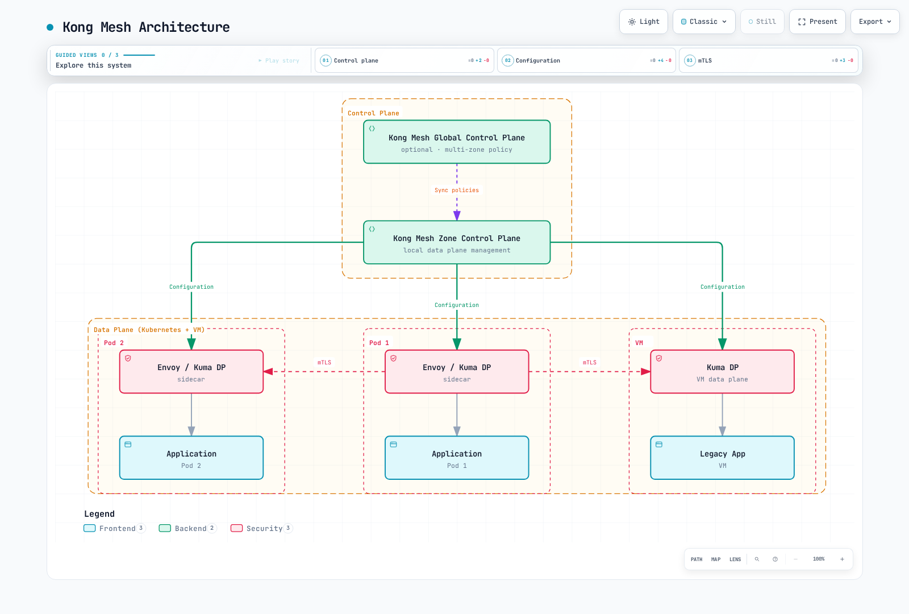

[🔍 View interactive diagram](https://www.atomai.click/kubernetes-docs/archmaps/en-service-mesh-istio-comparison-01-service-mesh-comparison-4.html)

**Features**:

* **Proxy**: Envoy (Kuma Data Plane)
* **Architecture**: Universal Control Plane (K8s + VM)
* **Configuration**: Kuma CRD + Kong Mesh UI
* **Strengths**: Excellent VM support, multi-zone/multi-cloud, enterprise features
* **Weaknesses**: Commercial features are paid, relatively small community

**Core Components**:

* **Global Control Plane**: Multi-zone policy synchronization
* **Zone Control Plane**: Local data plane management
* **Kuma DP**: Data plane for Kubernetes and VMs

#### Kong Mesh Detailed Architecture

Kong Mesh is a Universal Service Mesh based on Kuma that integrates multiple clusters and environments into a single mesh through multi-zone architecture.

**Multi-Zone Deployment Architecture**

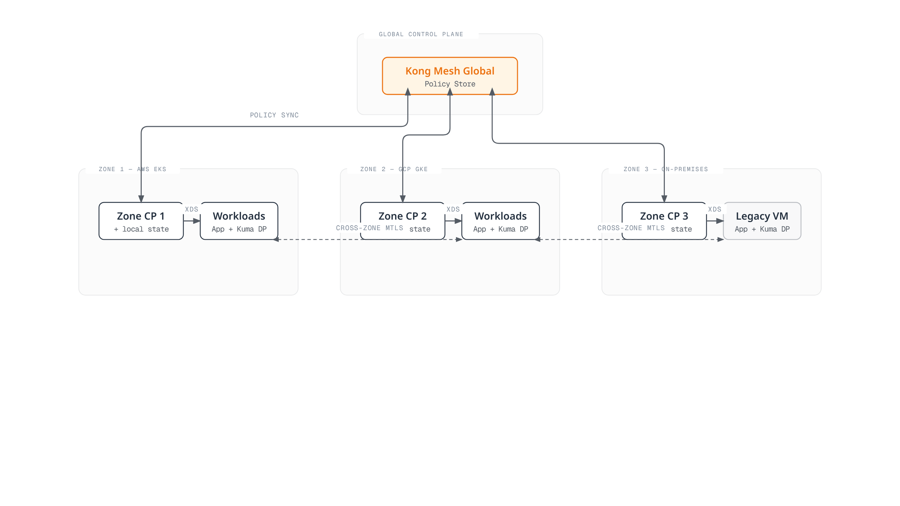

[🔍 View interactive diagram](https://www.atomai.click/kubernetes-docs/archmaps/en-service-mesh-istio-comparison-01-service-mesh-comparison-5.html)

**Key Features**:

* **Global Control Plane**: Centrally manages policies for all zones
* **Zone Control Plane**: Independently manages data plane in each zone
* **Automatic Service Discovery**: Automatic service discovery across zones
* **Unified mTLS**: Cross-zone communication is also automatically encrypted

**Service Connection and Traffic Flow**


[🔍 View interactive diagram](https://www.atomai.click/kubernetes-docs/archmaps/en-service-mesh-istio-comparison-01-service-mesh-comparison-6.html)

**Policy Propagation Mechanism**

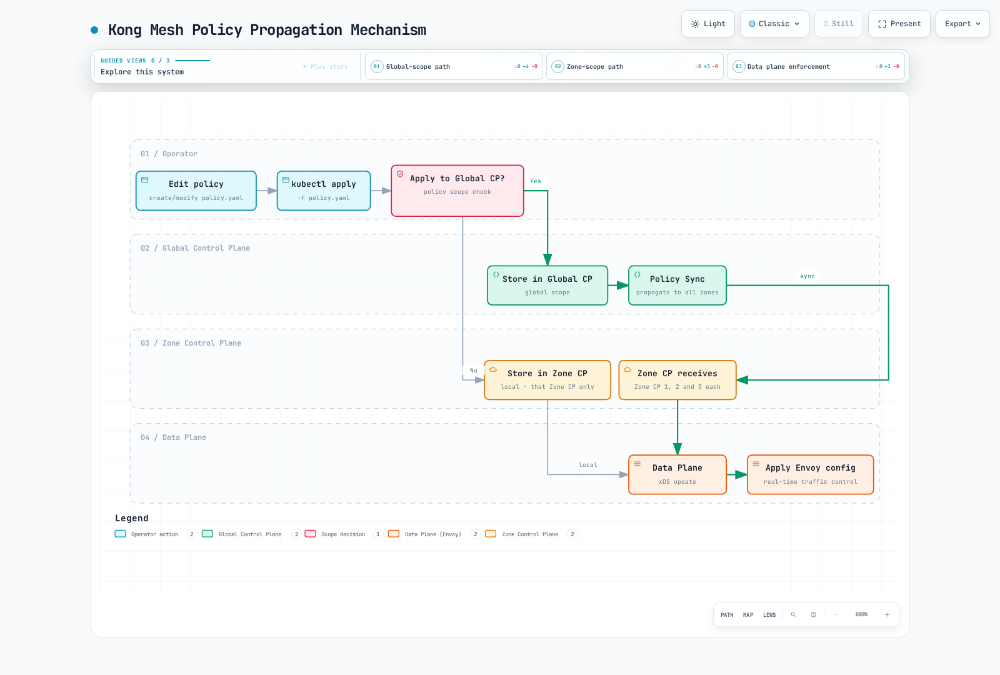

[🔍 View interactive diagram](https://www.atomai.click/kubernetes-docs/archmaps/en-service-mesh-istio-comparison-01-service-mesh-comparison-7.html)

**Policy Propagation Scope by Type**:

| Policy Type           | Scope  | Propagation Method | Use Case                          |
| --------------------- | ------ | ------------------ | --------------------------------- |
| **Mesh**              | Global | All Zones          | Global mTLS settings              |
| **TrafficRoute**      | Global | All Zones          | Global routing rules              |
| **TrafficPermission** | Global | All Zones          | Service-to-service access control |
| **HealthCheck**       | Zone   | Local Zone only    | Zone-specific health checks       |
| **ProxyTemplate**     | Zone   | Local Zone only    | Zone-specific Envoy config        |

**Data Plane Lifecycle**

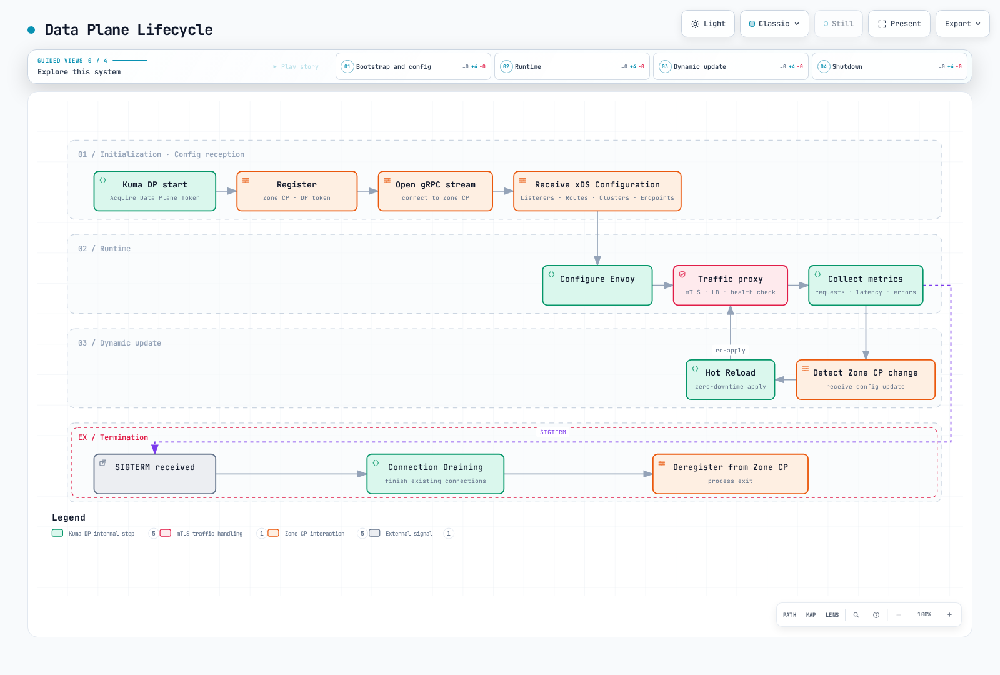

[🔍 View interactive diagram](https://www.atomai.click/kubernetes-docs/archmaps/en-service-mesh-istio-comparison-01-service-mesh-comparison-8.html)

**Cross-Zone Service Discovery**

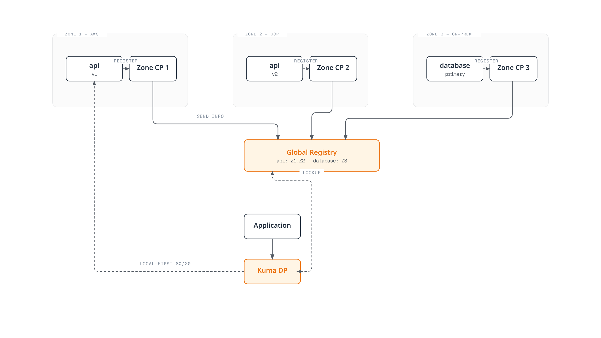

[🔍 View interactive diagram](https://www.atomai.click/kubernetes-docs/archmaps/en-service-mesh-istio-comparison-01-service-mesh-comparison-9.html)

**Service Discovery Features**:

* **Automatic Registration**: Services in each zone are automatically registered with Zone CP
* **Global View**: Global CP integrates services from all zones
* **Local-first**: Routes to services within the same zone first
* **Automatic Failover**: Automatically switches to another zone when local service fails
* **Tag-based Routing**: Fine-grained routing control using service tags

**Kong Mesh Configuration Examples**

**Mesh Resource (Global mTLS Settings)**:

```yaml
apiVersion: kuma.io/v1alpha1
kind: Mesh
metadata:
  name: default
spec:
  # Enable global mTLS
  mtls:
    enabledBackend: ca-1
    backends:
    - name: ca-1
      type: builtin
      dpCert:
        rotation:
          expiration: 24h
      conf:
        caCert:
          RSAbits: 2048
          expiration: 10y
  # Global metrics collection
  metrics:
    enabledBackend: prometheus-1
    backends:
    - name: prometheus-1
      type: prometheus
      conf:
        port: 5670
        path: /metrics
```

**TrafficRoute (Cross-Zone Routing)**:

```yaml
apiVersion: kuma.io/v1alpha1
kind: TrafficRoute
metadata:
  name: api-route
  namespace: kuma-system
spec:
  sources:
  - match:
      kuma.io/service: '*'
  destinations:
  - match:
      kuma.io/service: api
  conf:
    # Local zone priority (80%)
    loadBalancer:
      roundRobin: {}
    split:
    - weight: 80
      destination:
        kuma.io/service: api
        kuma.io/zone: zone-1
    - weight: 20
      destination:
        kuma.io/service: api
        kuma.io/zone: zone-2
```

**TrafficPermission (Service-to-Service Access Control)**:

```yaml
apiVersion: kuma.io/v1alpha1
kind: TrafficPermission
metadata:
  name: api-to-database
  namespace: kuma-system
spec:
  sources:
  - match:
      kuma.io/service: api
      kuma.io/zone: '*'  # api service from all zones
  destinations:
  - match:
      kuma.io/service: database
      kuma.io/zone: zone-3  # database in Zone 3 only
```

**Kong Mesh Architecture Advantages**

**Multi-Zone Architecture**:

* **Global Service Mesh**: Integrates multiple clusters and environments into a single mesh
* **Independent Zone Management**: Each zone operates independently; local traffic works normally even if Global CP fails
* **Automatic Failover**: Automatically switches to another zone on zone failure
* **Policy Consistency**: Same policies automatically applied to all zones

**Universal Support**:

* **Kubernetes + VM**: Equally supports K8s and VMs
* **Multi-cloud**: Integrates AWS, GCP, Azure, On-Premises
* **Legacy Integration**: Gradually add existing VM workloads to the mesh

**Operational Convenience**:

* **GUI Provided**: Visual management with Kong Mesh GUI
* **Policy Templates**: Pre-defined policy templates provided
* **Automatic Service Discovery**: Services discovered automatically without manual configuration

**Enterprise Features** (Paid):

* **RBAC**: Fine-grained role-based access control
* **Multi-tenancy**: Zone-level isolation and management
* **24/7 Support**: Professional support for production environments
* **Advanced Observability**: Detailed metrics and tracing

### Consul Connect

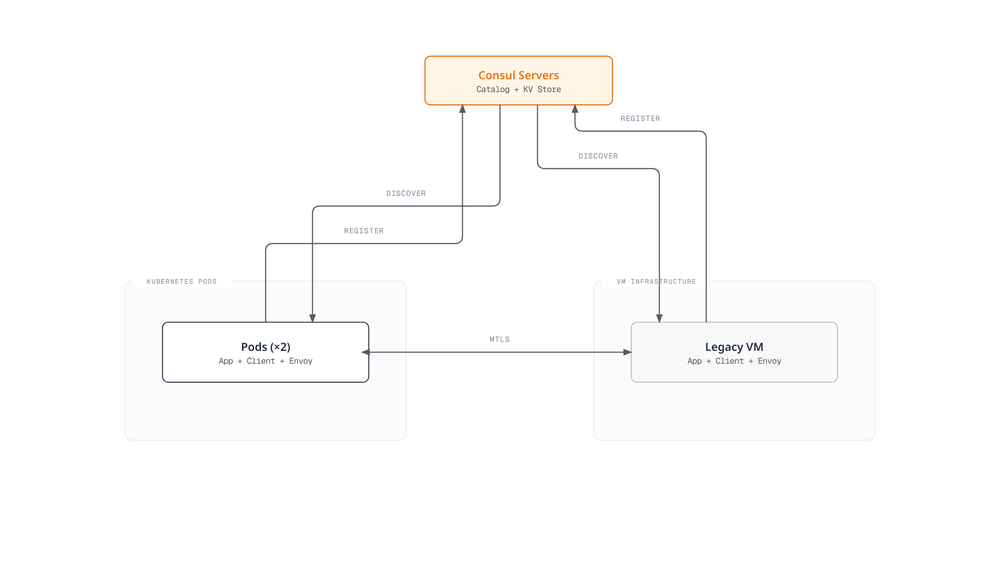

[🔍 View interactive diagram](https://www.atomai.click/kubernetes-docs/archmaps/en-service-mesh-istio-comparison-01-service-mesh-comparison-10.html)

**Features**:

* **Proxy**: Envoy or Built-in Proxy
* **Architecture**: Consul Server Cluster + Consul Clients
* **Configuration**: HCL or Kubernetes CRD
* **Strengths**: Strong Service Discovery, VM-first design, multi-datacenter
* **Weaknesses**: Requires Consul infrastructure management, Kubernetes integration more complex than Istio

**Core Components**:

* **Consul Server**: Service Catalog, KV Store, certificate management
* **Consul Client**: Runs on each node, service registration
* **Envoy Sidecar**: Traffic proxy

## Performance Comparison

### Latency Overhead

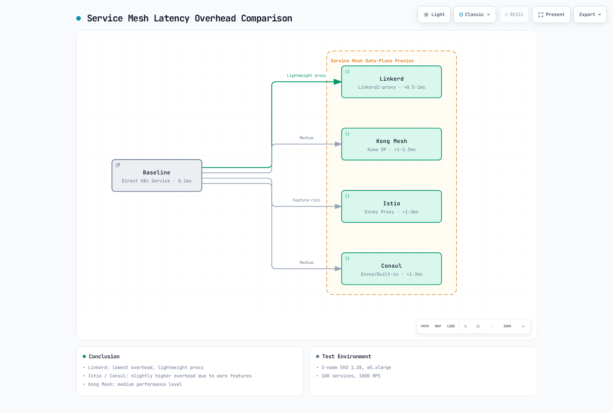

[🔍 View interactive diagram](https://www.atomai.click/kubernetes-docs/archmaps/en-service-mesh-istio-comparison-01-service-mesh-comparison-11.html)

**Benchmark Results** (P99 Latency increase, 1000 RPS):

| Service Mesh       | P50    | P95    | P99    | CPU Usage | Memory Usage |
| ------------------ | ------ | ------ | ------ | --------- | ------------ |
| **Baseline**       | 0.1ms  | 0.2ms  | 0.3ms  | -         | -            |
| **Linkerd**        | +0.5ms | +0.8ms | +1.2ms | +3-8%     | +20-50MB     |
| **Istio**          | +1.0ms | +2.5ms | +3.5ms | +5-15%    | +50-150MB    |
| **Kong Mesh**      | +0.8ms | +2.0ms | +3.0ms | +5-12%    | +40-120MB    |
| **Consul Connect** | +1.0ms | +2.5ms | +3.5ms | +6-14%    | +50-140MB    |

**Test Environment**: 3-node EKS 1.28, m5.xlarge, 100 services, 1000 RPS

### Resource Usage Comparison

#### Control Plane Resources

| Component    | Istio      | Linkerd             | Kong Mesh     | Consul Connect       |
| ------------ | ---------- | ------------------- | ------------- | -------------------- |
| **CPU**      | 500m-1     | 100m-300m           | 200m-500m     | 500m-1               |
| **Memory**   | 1-2GB      | 200-500MB           | 500MB-1GB     | 1-2GB                |
| **Replicas** | 1 (Istiod) | 3-5 (microservices) | 1-2 (Zone CP) | 3-5 (Consul Servers) |

#### Data Plane Resources (per pod)

| Proxy      | Istio Envoy | Linkerd2-proxy | Kuma DP  | Consul Envoy |
| ---------- | ----------- | -------------- | -------- | ------------ |
| **CPU**    | 100-500m    | 20-100m        | 100-400m | 100-500m     |
| **Memory** | 50-150MB    | 20-50MB        | 40-120MB | 50-140MB     |

### Throughput Comparison

**Maximum RPS (Requests Per Second)**:

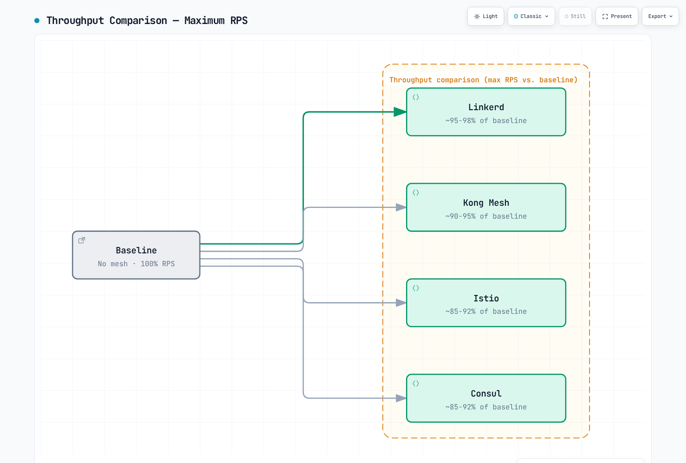

[🔍 View interactive diagram](https://www.atomai.click/kubernetes-docs/archmaps/en-service-mesh-istio-comparison-01-service-mesh-comparison-12.html)

**Conclusion**:

* **Linkerd**: Lowest overhead, lightweight proxy
* **Istio/Consul**: Slightly higher overhead due to more features
* **Kong Mesh**: Medium performance level

## Feature Comparison

### Comprehensive Feature Comparison Table

| Feature Area               | Istio             | Linkerd   | Kong Mesh    | Consul Connect |
| -------------------------- | ----------------- | --------- | ------------ | -------------- |
| **Traffic Management**     |                   |           |              |                |
| Traffic Splitting (Canary) | Fine-grained      | Basic     | Fine-grained | Basic          |
| A/B Testing                | Header-based      | Limited   | Header-based | Limited        |
| Blue-Green                 | Yes               | Yes       | Yes          | Yes            |
| Traffic Mirroring          | Yes               | No        | Yes          | Enterprise     |
| Circuit Breaking           | Yes               | Basic     | Yes          | Yes            |
| Retry                      | Fine-grained      | Basic     | Fine-grained | Basic          |
| Timeout                    | Yes               | Yes       | Yes          | Yes            |
| Fault Injection            | Yes               | Limited   | Yes          | Limited        |
| **Security**               |                   |           |              |                |
| mTLS Automation            | Yes               | Yes       | Yes          | Yes            |
| Authorization Policies     | Very fine-grained | Basic     | Fine-grained | Intentions     |
| External CA Integration    | Yes               | Yes       | Yes          | Yes            |
| JWT Authentication         | Yes               | Limited   | Yes          | Yes            |
| Rate Limiting              | EnvoyFilter       | No        | Yes          | Enterprise     |
| **Observability**          |                   |           |              |                |
| Metrics (Prometheus)       | Rich              | Basic     | Rich         | Basic          |
| Distributed Tracing        | All backends      | Jaeger    | All backends | Jaeger/Zipkin  |
| Access Logs                | Very detailed     | Basic     | Detailed     | Basic          |
| Topology Visualization     | Kiali             | Dashboard | GUI          | UI             |
| OpenTelemetry              | Yes               | Yes       | Yes          | Yes            |
| **Platform Support**       |                   |           |              |                |
| Kubernetes                 | Yes               | Yes       | Yes          | Yes            |
| Virtual Machines           | Limited           | No        | Excellent    | Excellent      |
| Multi-cluster              | Excellent         | Supported | Excellent    | Excellent      |
| Service Discovery          | Yes               | Yes       | Yes          | Very strong    |
| **Operations**             |                   |           |              |                |
| Installation Complexity    | High              | Low       | Medium       | Medium         |
| Upgrade                    | Medium            | Easy      | Medium       | Medium         |
| Troubleshooting            | Difficult         | Easy      | Medium       | Medium         |
| CLI Tool                   | istioctl          | linkerd   | kumactl      | consul         |

**Legend**:

* Yes = Fully supported
* Limited = Limited support or Enterprise feature
* No = Not supported

### Detailed Traffic Management Comparison

#### Canary Deployment Example

**Istio**:

```yaml
apiVersion: networking.istio.io/v1
kind: VirtualService
metadata:
  name: reviews
spec:
  hosts:
  - reviews
  http:
  - match:
    - headers:
        user-agent:
          regex: ".*Mobile.*"
    route:
    - destination:
        host: reviews
        subset: v2
      weight: 100
  - route:
    - destination:
        host: reviews
        subset: v1
      weight: 90
    - destination:
        host: reviews
        subset: v2
      weight: 10
---
apiVersion: networking.istio.io/v1
kind: DestinationRule
metadata:
  name: reviews
spec:
  host: reviews
  subsets:
  - name: v1
    labels:
      version: v1
  - name: v2
    labels:
      version: v2
```

**Linkerd**:

```yaml
apiVersion: split.smi-spec.io/v1alpha2
kind: TrafficSplit
metadata:
  name: reviews-split
spec:
  service: reviews
  backends:
  - service: reviews-v1
    weight: 90
  - service: reviews-v2
    weight: 10
---
# Requires separate Service creation
apiVersion: v1
kind: Service
metadata:
  name: reviews-v1
spec:
  selector:
    app: reviews
    version: v1
---
apiVersion: v1
kind: Service
metadata:
  name: reviews-v2
spec:
  selector:
    app: reviews
    version: v2
```

**Kong Mesh**:

```yaml
apiVersion: kuma.io/v1alpha1
kind: TrafficRoute
metadata:
  name: reviews-route
spec:
  sources:
  - match:
      kuma.io/service: '*'
  destinations:
  - match:
      kuma.io/service: reviews
  conf:
    split:
    - weight: 90
      destination:
        kuma.io/service: reviews
        version: v1
    - weight: 10
      destination:
        kuma.io/service: reviews
        version: v2
```

**Consul Connect**:

```hcl
Kind = "service-splitter"
Name = "reviews"
Splits = [
  {
    Weight        = 90
    ServiceSubset = "v1"
  },
  {
    Weight        = 10
    ServiceSubset = "v2"
  },
]
```

**Comparison**:

* **Istio**: Most fine-grained control (header-based routing, various match conditions)
* **Linkerd**: Simple but requires separate Services
* **Kong Mesh**: Kuma CRD, intuitive
* **Consul**: HCL configuration, integrated with Service Discovery

## Security Features

### mTLS Configuration Comparison

**Istio**:

```yaml
apiVersion: security.istio.io/v1
kind: PeerAuthentication
metadata:
  name: default
  namespace: istio-system
spec:
  mtls:
    mode: STRICT
---
apiVersion: networking.istio.io/v1
kind: DestinationRule
metadata:
  name: default
  namespace: istio-system
spec:
  host: "*.local"
  trafficPolicy:
    tls:
      mode: ISTIO_MUTUAL
```

**Linkerd**:

```bash
# mTLS enabled automatically (no configuration needed)
linkerd install | kubectl apply -f -

# Add annotation to namespace
kubectl annotate namespace default linkerd.io/inject=enabled
```

**Kong Mesh**:

```yaml
apiVersion: kuma.io/v1alpha1
kind: Mesh
metadata:
  name: default
spec:
  mtls:
    enabledBackend: ca-1
    backends:
    - name: ca-1
      type: builtin
      dpCert:
        rotation:
          expiration: 24h
      conf:
        caCert:
          RSAbits: 2048
          expiration: 10y
```

**Consul Connect**:

```hcl
Kind = "mesh"
Meta = {
  "consul.hashicorp.com/gateway-kind" = "mesh-gateway"
}
TLS {
  Incoming {
    TLSMinVersion = "TLSv1_2"
  }
}
```

### Authorization Policy Comparison

**Istio** (Most fine-grained):

```yaml
apiVersion: security.istio.io/v1
kind: AuthorizationPolicy
metadata:
  name: reviews-policy
spec:
  selector:
    matchLabels:
      app: reviews
  action: ALLOW
  rules:
  - from:
    - source:
        principals: ["cluster.local/ns/default/sa/productpage"]
    to:
    - operation:
        methods: ["GET"]
        paths: ["/reviews/*"]
    when:
    - key: request.headers[user-agent]
      values: ["*Mobile*"]
```

**Linkerd**:

```yaml
apiVersion: policy.linkerd.io/v1beta1
kind: Server
metadata:
  name: reviews-server
spec:
  podSelector:
    matchLabels:
      app: reviews
  port: 9080
  proxyProtocol: HTTP/1
---
apiVersion: policy.linkerd.io/v1alpha1
kind: AuthorizationPolicy
metadata:
  name: reviews-policy
spec:
  targetRef:
    kind: Server
    name: reviews-server
  requiredAuthenticationRefs:
  - kind: ServiceAccount
    name: productpage
```

**Kong Mesh**:

```yaml
apiVersion: kuma.io/v1alpha1
kind: TrafficPermission
metadata:
  name: reviews-permission
spec:
  sources:
  - match:
      kuma.io/service: productpage
  destinations:
  - match:
      kuma.io/service: reviews
```

**Consul Connect** (Intentions):

```hcl
Kind = "service-intentions"
Name = "reviews"
Sources = [
  {
    Name   = "productpage"
    Action = "allow"
  }
]
```

**Comparison**:

* **Istio**: Very fine-grained L7 control (Method, Path, Header)
* **Linkerd**: Service Account based, simple
* **Kong Mesh**: Service level permissions
* **Consul**: Intentions based, intuitive

## Observability Features

### Metrics Collection

**Istio**:

* **Metrics Count**: 50+ default metrics
* **Customization**: Unlimited extension with EnvoyFilter
* **Integration**: Prometheus, Grafana, Kiali

**Linkerd**:

* **Metrics Count**: 20+ default metrics (golden signals focused)
* **Customization**: Limited
* **Integration**: Prometheus, Grafana, Linkerd Dashboard

**Kong Mesh**:

* **Metrics Count**: 40+ default metrics
* **Customization**: Datadog, Prometheus
* **Integration**: Kong Mesh GUI, Grafana

**Consul Connect**:

* **Metrics Count**: 30+ default metrics
* **Customization**: Telegraf integration
* **Integration**: Consul UI, Prometheus, Grafana

### Distributed Tracing

**Supported Backends**:

| Service Mesh  | Jaeger | Zipkin | Tempo   | Datadog | AWS X-Ray |
| ------------- | ------ | ------ | ------- | ------- | --------- |
| **Istio**     | Yes    | Yes    | Yes     | Yes     | Yes       |
| **Linkerd**   | Yes    | Yes    | Yes     | Limited | Limited   |
| **Kong Mesh** | Yes    | Yes    | Yes     | Yes     | Yes       |
| **Consul**    | Yes    | Yes    | Limited | Limited | Limited   |

### Visualization Tools

**Istio + Kiali**:

```yaml
apiVersion: kiali.io/v1alpha1
kind: Kiali
metadata:
  name: kiali
spec:
  deployment:
    accessible_namespaces: ["**"]
  external_services:
    prometheus:
      url: http://prometheus:9090
    grafana:
      url: http://grafana:3000
    tracing:
      url: http://jaeger-query:16686
```

**Linkerd Dashboard**:

```bash
linkerd viz install | kubectl apply -f -
linkerd viz dashboard
```

**Kong Mesh GUI**:

```yaml
apiVersion: kuma.io/v1alpha1
kind: Mesh
metadata:
  name: default
spec:
  metrics:
    enabledBackend: prometheus-1
    backends:
    - name: prometheus-1
      type: prometheus
```

**Consul UI**:

```hcl
ui_config {
  enabled = true
  metrics_provider = "prometheus"
  metrics_proxy {
    base_url = "http://prometheus:9090"
  }
}
```

## Multi-Cluster Support

### Architecture Comparison

**Istio Multi-Primary**:

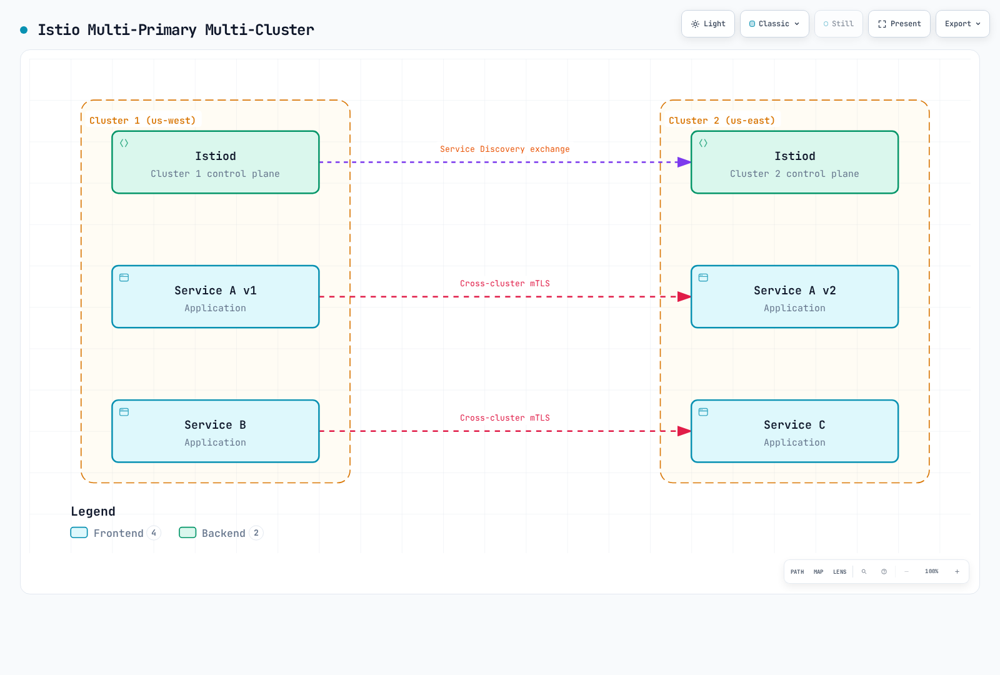

[🔍 View interactive diagram](https://www.atomai.click/kubernetes-docs/archmaps/en-service-mesh-istio-comparison-01-service-mesh-comparison-13.html)

**Linkerd Multi-cluster**:

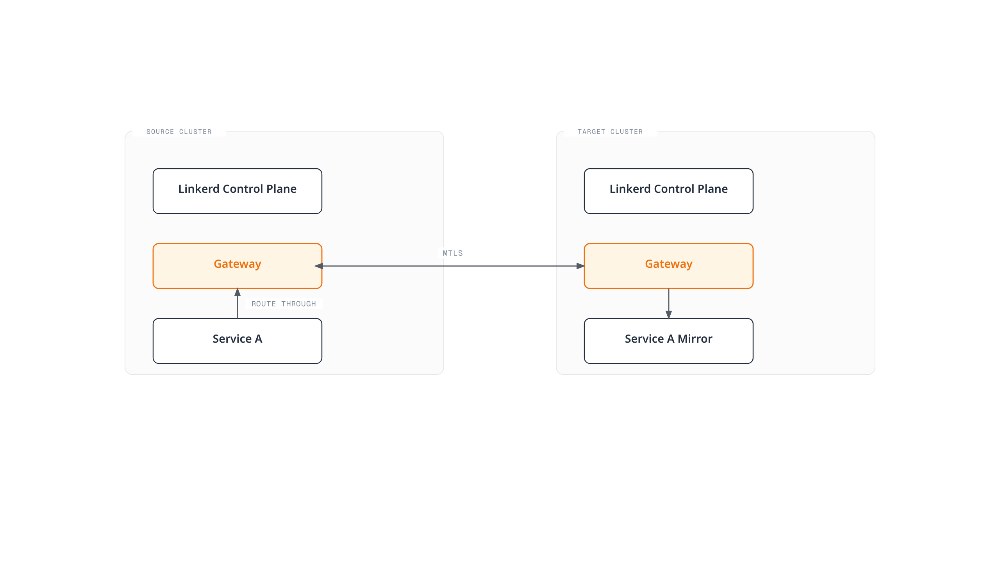

[🔍 View interactive diagram](https://www.atomai.click/kubernetes-docs/archmaps/en-service-mesh-istio-comparison-01-service-mesh-comparison-14.html)

**Kong Mesh Multi-zone**:

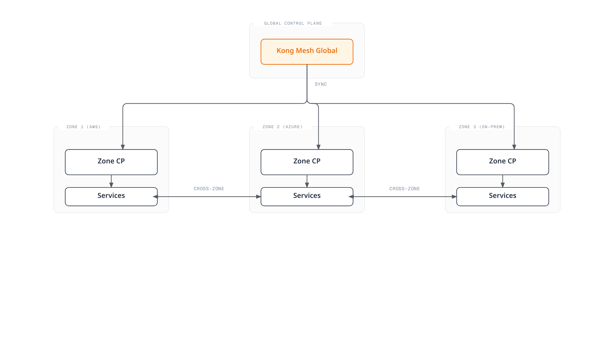

[🔍 View interactive diagram](https://www.atomai.click/kubernetes-docs/archmaps/en-service-mesh-istio-comparison-01-service-mesh-comparison-15.html)

**Consul Multi-datacenter**:

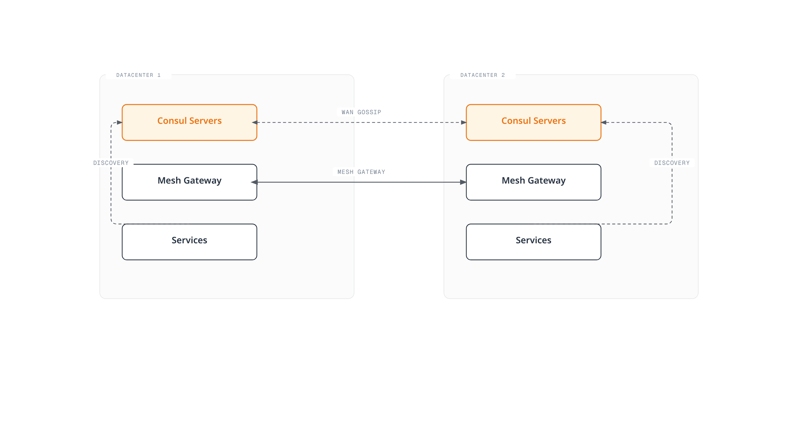

[🔍 View interactive diagram](https://www.atomai.click/kubernetes-docs/archmaps/en-service-mesh-istio-comparison-01-service-mesh-comparison-16.html)

### Multi-Cluster Feature Comparison

| Feature                      | Istio           | Linkerd         | Kong Mesh       | Consul    |
| ---------------------------- | --------------- | --------------- | --------------- | --------- |
| **Configuration Complexity** | Medium          | Low             | Medium          | Medium    |
| **Service Discovery**        | Automatic       | Mirror services | Automatic       | Strong    |
| **Traffic Failover**         | Automatic       | Manual          | Automatic       | Automatic |
| **mTLS**                     | Automatic       | Through Gateway | Automatic       | Automatic |
| **Network Requirements**     | Flat or Gateway | Gateway         | Flat or Gateway | Gateway   |
| **Policy Sync**              | Yes             | Limited         | Global CP       | Yes       |
| **Max Cluster Count**        | Dozens          | \~10            | Dozens          | Dozens    |

## Operational Complexity

### Installation and Upgrade

**Istio**:

```bash
# Install
istioctl install --set profile=default

# Upgrade (Canary)
istioctl install --set profile=default --revision=1-24-0

# Sequential transition per namespace
kubectl label namespace default istio.io/rev=1-24-0 --overwrite
kubectl rollout restart deployment -n default
```

**Linkerd**:

```bash
# Install
linkerd install | kubectl apply -f -

# Upgrade (In-place)
linkerd upgrade | kubectl apply -f -

# Automatic rollout
```

**Kong Mesh**:

```bash
# Helm install
helm install kong-mesh kong-mesh/kong-mesh

# Upgrade
helm upgrade kong-mesh kong-mesh/kong-mesh
```

**Consul**:

```bash
# Helm install
helm install consul hashicorp/consul -f values.yaml

# Upgrade
helm upgrade consul hashicorp/consul -f values.yaml
```

**Comparison**:

* **Linkerd**: Simplest installation and upgrade
* **Istio**: Canary upgrade enables zero-downtime but is complex
* **Kong/Consul**: Helm-based, medium complexity

### Troubleshooting Tools

**Istio**:

```bash
# Check proxy status
istioctl proxy-status

# Validate configuration
istioctl analyze

# Check proxy configuration
istioctl proxy-config cluster <pod> -n <namespace>

# Change log level
istioctl proxy-config log <pod> --level debug
```

**Linkerd**:

```bash
# Check status
linkerd check

# Check statistics
linkerd stat deploy

# Tap (real-time traffic observation)
linkerd tap deploy/webapp

# Check profile
linkerd profile --template deploy/webapp
```

**Kong Mesh**:

```bash
# Check status
kumactl inspect dataplanes

# Check metrics
kumactl inspect meshes

# Check logs
kubectl logs -n kong-mesh-system deployment/kong-mesh-control-plane
```

**Consul**:

```bash
# Check status
consul members

# Check services
consul catalog services

# Check intentions
consul intention list

# Proxy logs
kubectl logs <pod> -c consul-connect-envoy-sidecar
```

### Learning Curve

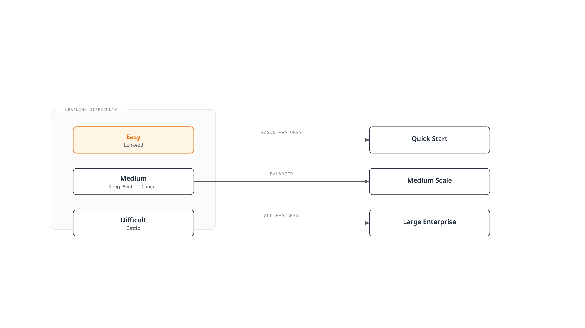

[🔍 View interactive diagram](https://www.atomai.click/kubernetes-docs/archmaps/en-service-mesh-istio-comparison-01-service-mesh-comparison-17.html)

## Cost Analysis

### Infrastructure Cost

**Resource-based Cost Calculation** (100 pod environment, EKS m5.xlarge):

| Service Mesh  | Control Plane CPU | Control Plane Memory | Data Plane CPU (Total) | Data Plane Memory (Total) | Monthly Cost (Est.) |
| ------------- | ----------------- | -------------------- | ---------------------- | ------------------------- | ------------------- |
| **Baseline**  | -                 | -                    | -                      | -                         | $300                |
| **Linkerd**   | 300m              | 500MB                | 2 vCPU                 | 5GB                       | +$50 (\~$350)       |
| **Istio**     | 1 vCPU            | 2GB                  | 10 vCPU                | 15GB                      | +$150 (\~$450)      |
| **Kong Mesh** | 500m              | 1GB                  | 8 vCPU                 | 12GB                      | +$120 (\~$420)      |
| **Consul**    | 1 vCPU            | 2GB                  | 10 vCPU                | 14GB                      | +$145 (\~$445)      |

**Note**: Actual costs can vary significantly based on workload patterns, traffic volume, and configuration.

### Operational Cost

**Engineer Time (Monthly basis)**:

| Task                 | Istio      | Linkerd    | Kong Mesh  | Consul     |
| -------------------- | ---------- | ---------- | ---------- | ---------- |
| **Initial Setup**    | 40h        | 8h         | 20h        | 24h        |
| **Daily Operations** | 20h/month  | 5h/month   | 10h/month  | 12h/month  |
| **Troubleshooting**  | 15h/month  | 3h/month   | 8h/month   | 10h/month  |
| **Upgrades**         | 8h/quarter | 2h/quarter | 4h/quarter | 5h/quarter |

### License Cost

| Product       | Open Source       | Enterprise                              |
| ------------- | ----------------- | --------------------------------------- |
| **Istio**     | Free (Apache 2.0) | Google Cloud Service Mesh (usage-based) |
| **Linkerd**   | Free (Apache 2.0) | Buoyant Enterprise (\$$$)               |
| **Kong Mesh** | Kuma Open Source  | Kong Mesh Enterprise (contact required) |
| **Consul**    | Free (MPL 2.0)    | Consul Enterprise (\$$$)                |

**Enterprise Feature Examples**:

* **Kong Mesh Enterprise**: Multi-zone GUI, RBAC, 24/7 support
* **Consul Enterprise**: Audit logging, Namespaces, Redundancy zones
* **Buoyant Enterprise**: HA control plane, 24/7 support, SLA

## Use Case Recommendations

### 1. Large Enterprise (1000+ services)

**Recommended: Istio**

**Reasons**:

* Most feature-rich feature set
* Fine-grained traffic control (A/B testing, Canary)
* Strong security (L7 Authorization)
* Multi-cluster federation
* Extensive community and tool ecosystem

**Configuration Example**:

```yaml
apiVersion: install.istio.io/v1alpha1
kind: IstioOperator
spec:
  profile: production
  components:
    pilot:
      k8s:
        hpaSpec:
          minReplicas: 3
          maxReplicas: 10
        resources:
          requests:
            cpu: 2000m
            memory: 4Gi
```

### 2. Small to Medium Startup (10-100 services)

**Recommended: Linkerd**

**Reasons**:

* Quick installation (under 5 minutes)
* Low resource overhead
* Simple operations
* Automatic mTLS and metrics

**Configuration Example**:

```bash
linkerd install | kubectl apply -f -
linkerd viz install | kubectl apply -f -

# Enable per namespace
kubectl annotate namespace default linkerd.io/inject=enabled
```

### 3. Hybrid Cloud (K8s + VM)

**Recommended: Consul Connect or Kong Mesh**

**Reasons**:

* VM workload-first support
* Strong Service Discovery
* Multi-platform consistency

**Consul Configuration Example**:

```hcl
# In Kubernetes
service {
  name = "web"
  port = 8080
  connect {
    sidecar_service {}
  }
}

# In VM
service {
  name = "database"
  port = 5432
  connect {
    sidecar_service {
      proxy {
        upstreams = [
          {
            destination_name = "web"
            local_bind_port  = 8080
          }
        ]
      }
    }
  }
}
```

### 4. Multi-Cloud Strategy

**Recommended: Istio or Kong Mesh**

**Reasons**:

* Cloud neutral
* Consistent policies and observability
* Multi-cluster federation

**Istio Multi-cluster**:

```bash
# Cluster 1 (AWS)
istioctl install --set values.global.meshID=mesh1 \
  --set values.global.multiCluster.clusterName=aws-cluster \
  --set values.global.network=aws-network

# Cluster 2 (GCP)
istioctl install --set values.global.meshID=mesh1 \
  --set values.global.multiCluster.clusterName=gcp-cluster \
  --set values.global.network=gcp-network

# Share Service Discovery
istioctl create-remote-secret \
  --context=aws-cluster --name=aws-cluster | \
  kubectl apply -f - --context=gcp-cluster
```

### 5. Legacy Migration

**Recommended: Kong Mesh or Consul**

**Reasons**:

* Simultaneous VM and container support
* Gradual migration
* Existing Service Discovery integration

**Kong Mesh Hybrid**:

```yaml
# Kubernetes Service
apiVersion: v1
kind: Service
metadata:
  name: legacy-db
  annotations:
    kuma.io/mesh: default
spec:
  type: ExternalName
  externalName: legacy-db.vm.local
---
# Run Kuma DP on VM
kuma-dp run \
  --cp-address=https://kong-mesh-cp:5678 \
  --dataplane-token-file=/tmp/token \
  --dataplane-file=/etc/kuma/dataplane.yaml
```

### 6. Strong Observability Requirements

**Recommended: Istio**

**Reasons**:

* 50+ default metrics
* Detailed access logs
* All tracing backends supported
* Kiali integration

**Observability Stack**:

```yaml
# Prometheus + Grafana + Jaeger + Kiali
istioctl install --set profile=demo \
  --set values.prometheus.enabled=true \
  --set values.grafana.enabled=true \
  --set values.tracing.enabled=true \
  --set values.kiali.enabled=true
```

## Final Conclusion and Recommendations

### Decision Tree

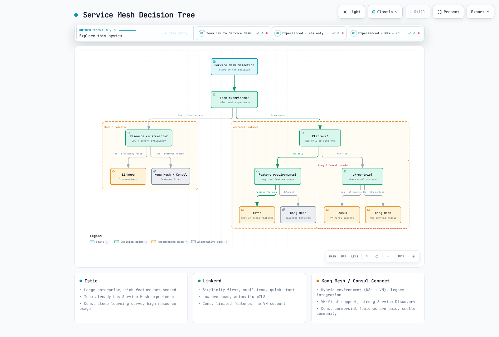

[🔍 View interactive diagram](https://www.atomai.click/kubernetes-docs/archmaps/en-service-mesh-istio-comparison-01-service-mesh-comparison-18.html)

### Quick Recommendation Guide

| Situation                | 1st Choice | 2nd Choice | Avoid                      |
| ------------------------ | ---------- | ---------- | -------------------------- |
| **Getting Started**      | Linkerd    | Kong Mesh  | Istio (complex)            |
| **Large Enterprise**     | Istio      | Kong Mesh  | Linkerd (limited features) |
| **Resource Constraints** | Linkerd    | -          | Istio (overhead)           |
| **VM Workloads**         | Consul     | Kong Mesh  | Linkerd (no support)       |
| **Multi-cloud**          | Istio      | Consul     | Single cloud solutions     |
| **Quick ROI**            | Linkerd    | -          | Istio (learning curve)     |
| **Fine-grained Control** | Istio      | Kong Mesh  | Linkerd (limited)          |

### Final Recommendations

**Istio**:

* **When**: Large enterprise, rich features needed, team has Service Mesh experience
* **Pros**: Best-in-class features, strong community, future-oriented
* **Cons**: Steep learning curve, high resource usage

**Linkerd**:

* **When**: Simplicity first, small team, quick start, resource efficiency
* **Pros**: Simple installation/operation, low overhead, automatic mTLS
* **Cons**: Limited features, no VM support

**Kong Mesh / Consul Connect**:

* **When**: Hybrid environment (K8s + VM), multi-platform, legacy integration
* **Pros**: VM-first support, flexible architecture, strong Service Discovery
* **Cons**: Commercial features are paid, community size

***

**Next Steps**:

1. Test 2-3 solutions in PoC environment
2. Performance benchmark with actual workload patterns
3. Collect team feedback
4. Establish production rollout plan

**Related Documents**:

* [Istio vs VPC Lattice Comparison](02-istio-vs-lattice.md)
* [Istio Architecture](https://github.com/Atom-oh/kubernetes-docs/blob/main/en/service-mesh/istio/istio/architecture/README.md)
