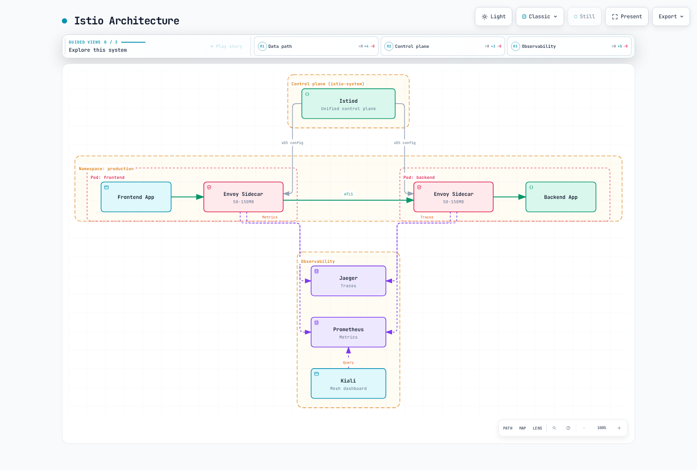
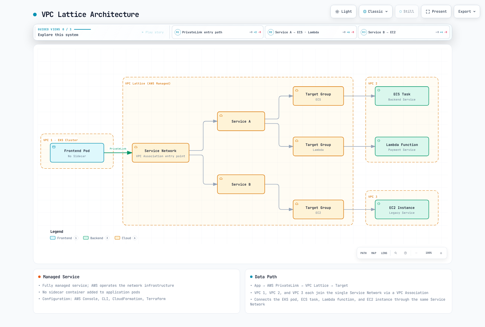
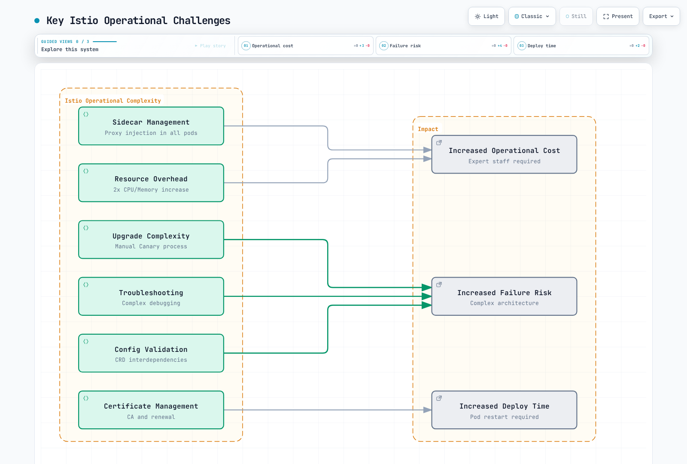
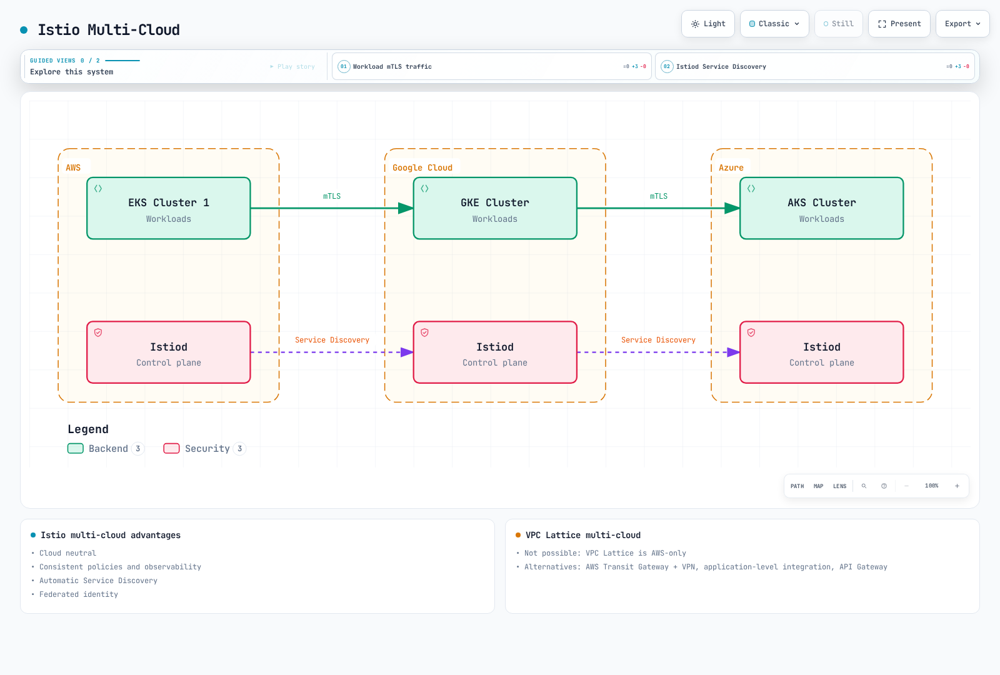
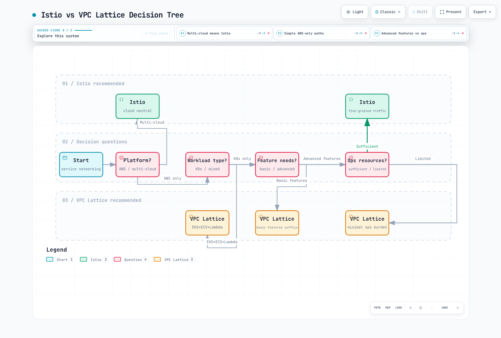

# Istio vs VPC Lattice

> **Last Updated**: February 23, 2026 **Istio Version**: 1.24 **VPC Lattice**: GA (Released 2023)

This document provides a comprehensive comparison between Kubernetes Service Mesh (Istio) and AWS native service networking (VPC Lattice).

## Table of Contents

1. [Overview and Key Differences](02-istio-vs-lattice.md#overview-and-key-differences)
2. [Architecture Comparison](02-istio-vs-lattice.md#architecture-comparison)
3. [Traffic Management Features](02-istio-vs-lattice.md#traffic-management-features)
4. [Security Model](02-istio-vs-lattice.md#security-model)
5. [Observability and Monitoring](02-istio-vs-lattice.md#observability-and-monitoring)
6. [Operational Complexity](02-istio-vs-lattice.md#operational-complexity)
7. [Cost Analysis](02-istio-vs-lattice.md#cost-analysis)
8. [Performance Comparison](02-istio-vs-lattice.md#performance-comparison)
9. [Multi-Cloud Strategy](02-istio-vs-lattice.md#multi-cloud-strategy)
10. [Hybrid Architecture](02-istio-vs-lattice.md#hybrid-architecture)
11. [Selection Guide](02-istio-vs-lattice.md#selection-guide)

## Overview and Key Differences

### Istio Service Mesh

**Definition**: An open-source Service Mesh running in Kubernetes environments that manages, secures, and observes communication between microservices as an infrastructure layer

**Key Features**:

* Self-managed (direct operation)
* Kubernetes native (CRD-based)
* Cloud neutral
* Rich feature set
* Envoy Proxy based

### AWS VPC Lattice

**Definition**: A fully managed application networking service provided by AWS that simplifies service connectivity and security across VPCs, accounts, and compute platforms

**Key Features**:

* Fully managed
* AWS native integration
* Serverless architecture
* EKS, ECS, EC2, Lambda support
* Transparent cross-VPC/account connectivity

### Quick Comparison Table

| Aspect                       | Istio          | VPC Lattice           |
| ---------------------------- | -------------- | --------------------- |
| **Deployment Model**         | Self-managed   | Fully managed         |
| **Platform**                 | Kubernetes     | EKS, ECS, EC2, Lambda |
| **Architecture**             | Sidecar Proxy  | AWS managed           |
| **Configuration Complexity** | High           | Low                   |
| **Feature Richness**         | 5/5            | 3/5                   |
| **Operational Overhead**     | High           | Almost none           |
| **Vendor Lock-in**           | Low            | High (AWS Only)       |
| **Cost Model**               | Resource-based | Usage-based           |
| **Learning Curve**           | Steep          | Gentle                |
| **Multi-cloud**              | Supported      | AWS Only              |

## Architecture Comparison

### Istio Architecture



[🔍 View interactive diagram](https://www.atomai.click/kubernetes-docs/archmaps/en-service-mesh-istio-comparison-02-istio-vs-lattice-0.html)

**Features**:

* **Sidecar Pattern**: Envoy Proxy injected into all pods
* **Resource Overhead**: 50-150MB memory, 100-500m CPU per pod
* **Data Path**: App -> Envoy -> mTLS -> Envoy -> App
* **Configuration**: Kubernetes CRD (VirtualService, DestinationRule, etc.)

### VPC Lattice Architecture



[🔍 View interactive diagram](https://www.atomai.click/kubernetes-docs/archmaps/en-service-mesh-istio-comparison-02-istio-vs-lattice-1.html)

**Features**:

* **Managed Service**: AWS operates the network infrastructure
* **No Sidecar**: No additional containers in application pods
* **Data Path**: App -> AWS PrivateLink -> VPC Lattice -> Target
* **Configuration**: AWS Console, CLI, CloudFormation, Terraform

### Architecture Differences Summary

| Aspect                      | Istio                    | VPC Lattice             |
| --------------------------- | ------------------------ | ----------------------- |
| **Proxy Location**          | Inside Pod (Sidecar)     | AWS Managed (External)  |
| **Memory Overhead**         | 50-150MB per pod         | 0MB (managed)           |
| **CPU Overhead**            | 100-500m per pod         | 0 (managed)             |
| **Control Plane**           | Self-managed (Istiod)    | AWS managed             |
| **Data Plane**              | Envoy Proxy              | AWS PrivateLink         |
| **Configuration Interface** | Kubernetes CRD           | AWS API                 |
| **Upgrades**                | Manual (Canary possible) | Automatic (AWS managed) |

## Traffic Management Features

### Traffic Splitting (Canary Deployment)

#### Istio

```yaml
apiVersion: networking.istio.io/v1
kind: VirtualService
metadata:
  name: frontend
spec:
  hosts:
  - frontend
  http:
  - match:
    - headers:
        user-agent:
          regex: ".*Mobile.*"
    route:
    - destination:
        host: frontend
        subset: v2
      weight: 100
  - route:
    - destination:
        host: frontend
        subset: v1
      weight: 90
    - destination:
        host: frontend
        subset: v2
      weight: 10
---
apiVersion: networking.istio.io/v1
kind: DestinationRule
metadata:
  name: frontend
spec:
  host: frontend
  trafficPolicy:
    loadBalancer:
      simple: LEAST_REQUEST
  subsets:
  - name: v1
    labels:
      version: v1
  - name: v2
    labels:
      version: v2
```

**Features**:

* Header, URL, Source based routing
* Fine-grained weight control (1% granularity)
* Complex conditions (AND, OR, Regex)
* Dynamic load balancing algorithms

#### VPC Lattice

```yaml
# Weight-based routing with AWS CLI
aws vpc-lattice create-rule \
  --listener-identifier $LISTENER_ID \
  --priority 10 \
  --match '{
    "httpMatch": {
      "pathMatch": {"prefix": "/api"}
    }
  }' \
  --action '{
    "forward": {
      "targetGroups": [
        {
          "targetGroupIdentifier": "'$TG_V1'",
          "weight": 90
        },
        {
          "targetGroupIdentifier": "'$TG_V2'",
          "weight": 10
        }
      ]
    }
  }'
```

**Features**:

* Path, Header, Method based routing
* Weight-based splitting
* Basic conditions
* Round robin, least connections load balancing

**Comparison**:

* **Istio**: Very fine-grained control, complex scenarios possible
* **VPC Lattice**: Basic features, simple usage

### Traffic Mirroring

#### Istio

```yaml
apiVersion: networking.istio.io/v1
kind: VirtualService
metadata:
  name: backend
spec:
  hosts:
  - backend
  http:
  - route:
    - destination:
        host: backend
        subset: v1
      weight: 100
    mirror:
      host: backend
      subset: v2
    mirrorPercentage:
      value: 10.0  # Copy 10% traffic to v2
```

**Use Cases**:

* Test new version with production traffic
* Performance comparison
* Bug verification

#### VPC Lattice

**Not Supported**: VPC Lattice does not support traffic mirroring.

**Alternatives**:

* Application Load Balancer + Lambda@Edge
* Separate log stream analysis

### Fault Injection

#### Istio

```yaml
apiVersion: networking.istio.io/v1
kind: VirtualService
metadata:
  name: backend
spec:
  hosts:
  - backend
  http:
  - fault:
      delay:
        percentage:
          value: 10.0
        fixedDelay: 5s
      abort:
        percentage:
          value: 5.0
        httpStatus: 503
    route:
    - destination:
        host: backend
```

**Features**:

* Delay injection
* Abort injection (error injection)
* Percentage-based control
* Chaos Engineering support

#### VPC Lattice

**Not Supported**: No built-in Fault Injection feature

**Alternatives**:

* Implement at application level
* Use AWS FIS (Fault Injection Simulator)

### Circuit Breaking & Outlier Detection

#### Istio

```yaml
apiVersion: networking.istio.io/v1
kind: DestinationRule
metadata:
  name: backend
spec:
  host: backend
  trafficPolicy:
    connectionPool:
      tcp:
        maxConnections: 100
      http:
        http1MaxPendingRequests: 50
        http2MaxRequests: 100
        maxRequestsPerConnection: 2
    outlierDetection:
      consecutiveErrors: 5
      interval: 30s
      baseEjectionTime: 60s
      maxEjectionPercent: 50
      minHealthPercent: 50
```

#### VPC Lattice

**Limited Support**: Only basic health checks provided

```yaml
# Target Group health check
aws vpc-lattice create-target-group \
  --name backend-tg \
  --health-check '{
    "enabled": true,
    "protocol": "HTTP",
    "path": "/health",
    "intervalSeconds": 30,
    "timeoutSeconds": 5,
    "healthyThresholdCount": 2,
    "unhealthyThresholdCount": 3
  }'
```

**Comparison**:

* **Istio**: Fine-grained Circuit Breaking, automatic Outlier Detection
* **VPC Lattice**: Basic health checks, manual removal

### Feature Comparison Table

| Feature               | Istio              | VPC Lattice     | Winner |
| --------------------- | ------------------ | --------------- | ------ |
| **Canary Deployment** | Very fine-grained  | Basic           | Istio  |
| **A/B Testing**       | Header-based       | Path-based only | Istio  |
| **Traffic Mirroring** | Yes                | No              | Istio  |
| **Fault Injection**   | Yes                | No              | Istio  |
| **Circuit Breaking**  | Fine-grained       | Basic           | Istio  |
| **Retry**             | Advanced           | Basic           | Istio  |
| **Timeout**           | Fine-grained       | Basic           | Istio  |
| **Load Balancing**    | Various algorithms | Basic           | Istio  |

**Conclusion**: In traffic management, **Istio has overwhelming advantage**

## Security Model

### mTLS Configuration

#### Istio

```yaml
# Global mTLS STRICT mode
apiVersion: security.istio.io/v1
kind: PeerAuthentication
metadata:
  name: default
  namespace: istio-system
spec:
  mtls:
    mode: STRICT
---
# Namespace-level exception
apiVersion: security.istio.io/v1
kind: PeerAuthentication
metadata:
  name: legacy-permissive
  namespace: legacy
spec:
  mtls:
    mode: PERMISSIVE
---
# Service-level port-level settings
apiVersion: security.istio.io/v1
kind: PeerAuthentication
metadata:
  name: backend
spec:
  selector:
    matchLabels:
      app: backend
  mtls:
    mode: STRICT
  portLevelMtls:
    8080:
      mode: DISABLE  # Metrics port is plaintext
```

**Features**:

* Automatic certificate issuance and renewal
* Per-workload certificates
* Automatic renewal every 15 minutes
* SPIFFE standard compliant
* External CA integration (Cert-manager, Vault)

#### VPC Lattice

```yaml
# Create TLS Listener
aws vpc-lattice create-listener \
  --service-identifier $SERVICE_ID \
  --protocol HTTPS \
  --port 443 \
  --default-action '{
    "forward": {
      "targetGroups": [{"targetGroupIdentifier": "'$TG_ID'"}]
    }
  }'

# Apply Auth Policy
aws vpc-lattice create-auth-policy \
  --resource-identifier $SERVICE_ID \
  --policy '{
    "allowedPrincipals": [
      "arn:aws:iam::123456789012:role/app-role"
    ]
  }'
```

**Features**:

* AWS Certificate Manager (ACM) integration
* IAM-based authentication
* SigV4 signing
* AWS PrivateLink encryption

**Comparison**:

* **Istio**: Automatic mTLS between workloads, fine-grained control
* **VPC Lattice**: Client-service TLS, IAM integration

### Authorization Policies

#### Istio

```yaml
# L7 level fine-grained Authorization
apiVersion: security.istio.io/v1
kind: AuthorizationPolicy
metadata:
  name: backend-policy
spec:
  selector:
    matchLabels:
      app: backend
  action: ALLOW
  rules:
  - from:
    - source:
        principals: ["cluster.local/ns/frontend/sa/frontend"]
        namespaces: ["frontend"]
    to:
    - operation:
        methods: ["GET", "POST"]
        paths: ["/api/v1/*"]
        ports: ["8080"]
    when:
    - key: request.headers[user-role]
      values: ["admin", "poweruser"]
    - key: source.ip
      notValues: ["10.0.0.0/8"]
---
# JWT Authentication
apiVersion: security.istio.io/v1
kind: RequestAuthentication
metadata:
  name: jwt-auth
spec:
  selector:
    matchLabels:
      app: backend
  jwtRules:
  - issuer: "https://auth.example.com"
    jwksUri: "https://auth.example.com/.well-known/jwks.json"
    audiences:
    - "api.example.com"
---
# JWT-based Authorization
apiVersion: security.istio.io/v1
kind: AuthorizationPolicy
metadata:
  name: jwt-policy
spec:
  selector:
    matchLabels:
      app: backend
  action: ALLOW
  rules:
  - when:
    - key: request.auth.claims[role]
      values: ["admin"]
```

#### VPC Lattice

```json
// Auth Policy (IAM-based)
{
  "Version": "2012-10-17",
  "Statement": [
    {
      "Effect": "Allow",
      "Principal": {
        "AWS": "arn:aws:iam::123456789012:role/frontend-role"
      },
      "Action": "vpc-lattice:Invoke",
      "Resource": "arn:aws:vpc-lattice:region:account:service/svc-xxx"
    },
    {
      "Effect": "Deny",
      "Principal": "*",
      "Action": "vpc-lattice:Invoke",
      "Resource": "*",
      "Condition": {
        "IpAddress": {
          "aws:SourceIp": ["10.0.0.0/8"]
        }
      }
    }
  ]
}
```

**Comparison**:

| Feature                       | Istio                     | VPC Lattice             | Winner              |
| ----------------------------- | ------------------------- | ----------------------- | ------------------- |
| **Authentication Mechanism**  | mTLS, JWT, Custom         | IAM, SigV4              | Istio (flexibility) |
| **Authorization Granularity** | L7 (Method, Path, Header) | L4 (Service level)      | Istio               |
| **Workload Identity**         | SPIFFE ID                 | IAM Role                | Equal               |
| **Dynamic Policies**          | Real-time apply           | Propagation time needed | Istio               |
| **Multi-tenancy**             | Namespace isolation       | VPC/Account isolation   | Equal               |

**Conclusion**: In security, **Istio provides more fine-grained control**, VPC Lattice excels in AWS IAM integration

## Observability and Monitoring

### Metrics Collection

#### Istio

```yaml
# Prometheus metrics (50+ provided by default)
# Request metrics
istio_requests_total{
  destination_service="backend",
  response_code="200",
  source_app="frontend"
}

# Latency metrics (histogram)
istio_request_duration_milliseconds_bucket{
  destination_service="backend",
  le="100"
}

# Connection Pool metrics
envoy_cluster_upstream_cx_active{
  cluster_name="outbound|8080||backend"
}

# Circuit Breaker metrics
envoy_cluster_outlier_detection_ejections_active

# Custom Metrics (Telemetry API)
apiVersion: telemetry.istio.io/v1alpha1
kind: Telemetry
metadata:
  name: custom-metrics
spec:
  metrics:
  - providers:
    - name: prometheus
    dimensions:
      request_method:
        value: request.method
      custom_header:
        value: request.headers['x-custom-header'] | ''
```

**Features**:

* 50+ default metrics
* Prometheus format
* OpenTelemetry integration
* Custom metrics addition possible
* Exemplar support (metrics-trace linking)

#### VPC Lattice

```bash
# CloudWatch metrics
aws cloudwatch get-metric-statistics \
  --namespace AWS/VPCLattice \
  --metric-name RequestCount \
  --dimensions Name=ServiceName,Value=backend \
  --start-time 2025-01-01T00:00:00Z \
  --end-time 2025-01-01T23:59:59Z \
  --period 300 \
  --statistics Sum
```

**Default Metrics**:

* `RequestCount`: Request count
* `ActiveConnectionCount`: Active connections
* `HealthyTargetCount`: Healthy targets
* `UnhealthyTargetCount`: Unhealthy targets
* `TargetResponseTime`: Response time
* `HTTPCode_Target_4XX_Count`: 4xx errors
* `HTTPCode_Target_5XX_Count`: 5xx errors

**Features**:

* CloudWatch integration
* Only default metrics provided
* Custom metrics not possible
* 1 or 5 minute granularity

### Distributed Tracing

#### Istio

```yaml
# Tracing setup with Telemetry API
apiVersion: telemetry.istio.io/v1alpha1
kind: Telemetry
metadata:
  name: tracing
  namespace: istio-system
spec:
  tracing:
  - providers:
    - name: jaeger
    randomSamplingPercentage: 10.0
    customTags:
      environment:
        literal:
          value: "production"
      user_id:
        header:
          name: "x-user-id"
```

**Supported Backends**:

* Jaeger
* Zipkin
* Tempo
* AWS X-Ray
* Datadog APM
* OpenTelemetry Collector

**Features**:

* W3C Trace Context standard
* Automatic Span generation
* Custom tag addition
* Sampling control
* Baggage propagation

#### VPC Lattice

```bash
# Access Log to S3
aws vpc-lattice create-access-log-subscription \
  --resource-identifier $SERVICE_ID \
  --destination-arn arn:aws:s3:::lattice-logs

# Access Log to CloudWatch Logs
aws vpc-lattice create-access-log-subscription \
  --resource-identifier $SERVICE_ID \
  --destination-arn arn:aws:logs:region:account:log-group:/aws/vpclattice
```

**Access Log Format** (JSON):

```json
{
  "timestamp": "2025-01-15T12:34:56.789Z",
  "serviceNetworkArn": "arn:aws:vpc-lattice:...",
  "serviceArn": "arn:aws:vpc-lattice:...",
  "requestMethod": "GET",
  "requestPath": "/api/users",
  "requestProtocol": "HTTP/1.1",
  "responseCode": 200,
  "responseCodeDetails": "OK",
  "requestHeaders": {},
  "sourceVpcArn": "arn:aws:ec2:...",
  "targetGroupArn": "arn:aws:vpc-lattice:...",
  "traceparent": "00-4bf92f3577b34da6a3ce929d0e0e4736-00f067aa0ba902b7-01"
}
```

**Features**:

* W3C Trace Context header (`traceparent`) support
* Send to S3 or CloudWatch Logs
* AWS X-Ray integration possible (requires application instrumentation)
* No automatic tracing (manual instrumentation)

**Comparison**:

* **Istio**: Automatic tracing, all backends supported, fine-grained control
* **VPC Lattice**: Access log based, X-Ray requires manual integration

### Observability Comprehensive Comparison

| Feature                   | Istio          | VPC Lattice            | Winner |
| ------------------------- | -------------- | ---------------------- | ------ |
| **Metrics**               | 50+ metrics    | \~10 metrics           | Istio  |
| **Custom Metrics**        | Telemetry API  | No                     | Istio  |
| **Distributed Tracing**   | Automatic      | Manual instrumentation | Istio  |
| **Tracing Backends**      | 6+             | X-Ray only             | Istio  |
| **Access Logs**           | Very detailed  | Basic                  | Istio  |
| **Visualization**         | Kiali, Grafana | CloudWatch             | Istio  |
| **Real-time Observation** | Yes            | Limited                | Istio  |
| **Exemplars**             | Yes            | No                     | Istio  |

**Conclusion**: In observability, **Istio has overwhelming advantage**

## Operational Complexity

### Real Challenges of Istio Operations

Istio provides powerful features, but operating it in production environments presents significant challenges.

#### Key Operational Challenges



[🔍 View interactive diagram](https://www.atomai.click/kubernetes-docs/archmaps/en-service-mesh-istio-comparison-02-istio-vs-lattice-3.html)

### Installation and Initial Setup

#### Istio

```bash
# 1. Install Istioctl
curl -L https://istio.io/downloadIstio | sh -
cd istio-1.24.0
export PATH=$PWD/bin:$PATH

# 2. Install Istio (production profile)
istioctl install --set profile=production

# 3. Enable Sidecar injection for namespace
kubectl label namespace default istio.io/injection=enabled

# 4. Deploy gateway
kubectl apply -f samples/bookinfo/networking/bookinfo-gateway.yaml

# 5. Install observability tools
kubectl apply -f samples/addons/prometheus.yaml
kubectl apply -f samples/addons/grafana.yaml
kubectl apply -f samples/addons/jaeger.yaml
kubectl apply -f samples/addons/kiali.yaml

# 6. Validate configuration
istioctl analyze
```

**Time**: 30-60 minutes (including configuration) **Complexity**: 4/5 (High)

#### VPC Lattice

```bash
# 1. Create Service Network
SERVICE_NETWORK_ID=$(aws vpc-lattice create-service-network \
  --name production-network \
  --auth-type AWS_IAM \
  --query 'id' --output text)

# 2. Associate VPC
aws vpc-lattice create-service-network-vpc-association \
  --service-network-identifier $SERVICE_NETWORK_ID \
  --vpc-identifier vpc-xxx \
  --security-group-ids sg-xxx

# 3. Create Service
SERVICE_ID=$(aws vpc-lattice create-service \
  --name backend-service \
  --auth-type AWS_IAM \
  --query 'id' --output text)

# 4. Associate Service to Network
aws vpc-lattice create-service-network-service-association \
  --service-network-identifier $SERVICE_NETWORK_ID \
  --service-identifier $SERVICE_ID

# 5. Create Target Group
TG_ID=$(aws vpc-lattice create-target-group \
  --name backend-tg \
  --type IP \
  --config '{
    "port": 8080,
    "protocol": "HTTP",
    "vpcIdentifier": "vpc-xxx"
  }' \
  --query 'id' --output text)

# 6. Register Targets
aws vpc-lattice register-targets \
  --target-group-identifier $TG_ID \
  --targets id=10.0.1.10,port=8080

# 7. Create Listener
aws vpc-lattice create-listener \
  --service-identifier $SERVICE_ID \
  --protocol HTTP \
  --port 80 \
  --default-action '{
    "forward": {
      "targetGroups": [{"targetGroupIdentifier": "'$TG_ID'"}]
    }
  }'
```

**Time**: 10-20 minutes **Complexity**: 2/5 (Medium)

### Upgrade: Istio's Biggest Challenge

#### Complexity of Istio Upgrade

Istio upgrades are among the most risky and complex operations in production environments.

**Total Time Required**: **6-10 hours** (increases with number of namespaces)

**Major Challenges**:

* **Pros**: Zero-downtime possible, gradual rollout, rollback possible
* **Cons**:
  * Very complex manual process
  * Expert knowledge required
  * 6-10 hours of work time
  * All pods require restart (workload impact)
  * Two versions of Control Plane running simultaneously (2x resources)

#### VPC Lattice

**Automatic Upgrade**: AWS manages service updates

**User Action**: None

### Operational Complexity Summary

| Task                   | Istio                           | VPC Lattice           | Difference                  |
| ---------------------- | ------------------------------- | --------------------- | --------------------------- |
| **Initial Setup**      | 30-60min, CRD learning required | 10-20min, AWS Console | **Lattice 3x faster**       |
| **Upgrade**            | 6-10 hours, manual Canary       | Automatic, 0 hours    | **Lattice fully automatic** |
| **Daily Operations**   | 15-25h/month                    | 2-5h/month            | **Lattice 5-10x less**      |
| **Sidecar Management** | All pods restart required       | N/A                   | **Lattice no management**   |
| **Resource Overhead**  | CPU/Memory 2x                   | 0                     | **Lattice zero overhead**   |
| **Troubleshooting**    | Complex, expert tools needed    | Simple, CloudWatch    | **Lattice easier**          |
| **Learning Curve**     | Steep, 3-6 months               | Gentle, 1-2 weeks     | **Lattice 10x faster**      |
| **Expert Staff**       | Service Mesh expert             | General AWS engineer  | **Lattice easier to staff** |
| **Failure Risk**       | High, complex architecture      | Low, AWS managed      | **Lattice more stable**     |

**Conclusion**: In operational complexity, **VPC Lattice has overwhelming advantage**

## Cost Analysis

### Istio Cost Model (Detailed)

#### Infrastructure Cost (100 pod environment, EKS)

**Computing Cost**:

| Component                    | Resources       | Node Requirements           | Cost (Monthly) |
| ---------------------------- | --------------- | --------------------------- | -------------- |
| **Applications** (100 pods)  | 10 vCPU, 25GB   | 3 nodes (m5.xlarge)         | $420           |
| **Envoy Sidecar** (100 pods) | 10 vCPU, 12.8GB | +2 nodes (Sidecar overhead) | $280           |
| **Istiod** (Control Plane)   | 1 vCPU, 2GB     | Included                    | -              |
| **Prometheus**               | 2 vCPU, 8GB     | Additional resources        | $80            |
| **Jaeger**                   | 1 vCPU, 4GB     | Additional resources        | $50            |
| **Kiali**                    | 0.5 vCPU, 1GB   | Additional resources        | $20            |
| **Total Computing**          |                 | **5 nodes**                 | **$850/month** |

**Storage Cost**:

* Prometheus metrics: 100GB SSD -> $10/month
* Jaeger traces: 50GB SSD -> $5/month
* Total storage: **$15/month**

**Infrastructure Total**: **$875/month** = **$10,500/year**

#### Operational Cost (Annual)

| Task                             | Time (Annual) | Hourly Cost | Annual Cost      |
| -------------------------------- | ------------- | ----------- | ---------------- |
| **Initial Setup**                | 40h           | $100/h      | $4,000           |
| **Daily Operations** (20h/month) | 240h          | $100/h      | $24,000          |
| **Upgrades** (quarterly)         | 40h (4 times) | $100/h      | $4,000           |
| **Emergency Response** (average) | 20h           | $150/h      | $3,000           |
| **Training**                     | 40h           | $100/h      | $4,000           |
| **Operations Total**             |               |             | **$39,000/year** |

#### Istio Total Cost

**Annual Total Cost**: **$10,500 + $39,000 = $49,500**

### VPC Lattice Cost Model

**Usage-based Cost**:

| Item                | Unit Price  | Expected Usage | Cost (Monthly) |
| ------------------- | ----------- | -------------- | -------------- |
| **Service Network** | $0.025/hour | 1 x 730 hours  | $18            |
| **Service**         | $0.025/hour | 5 x 730 hours  | $91            |
| **Data Processing** | $0.010/GB   | 10TB           | $100           |
| **Total**           |             |                | **$209**       |

**Operational Cost**:

* Initial setup: 10 hours x $100/h = $1,000
* Monthly operations: 3 hours x $100/h = $300

**Annual Total Cost**: $209 x 12 + $300 x 12 + $1,000 = **$7,608**

### Cost Comparison Summary

| Item                        | Istio Sidecar | VPC Lattice | Difference (vs Istio) |
| --------------------------- | ------------- | ----------- | --------------------- |
| **Infrastructure (Annual)** | $10,500       | $2,508      | **76% cheaper**       |
| **Operations (Annual)**     | $39,000       | $5,100      | **87% cheaper**       |
| **Total (Annual)**          | **$49,500**   | **$7,608**  | **85% cheaper**       |
| **5-Year TCO**              | **$297,500**  | **$38,040** | **87% cheaper**       |

**Conclusion**: VPC Lattice is **approximately $42,000 cheaper annually, $260,000 over 5 years**

## Performance Comparison

### Latency Overhead

**Test Environment**: 2-node EKS, m5.xlarge, 1000 RPS

| Scenario | Baseline | Istio          | VPC Lattice    |
| -------- | -------- | -------------- | -------------- |
| **P50**  | 1.0ms    | +1.0ms (2.0ms) | +0.5ms (1.5ms) |
| **P95**  | 2.5ms    | +2.5ms (5.0ms) | +1.2ms (3.7ms) |
| **P99**  | 5.0ms    | +3.5ms (8.5ms) | +2.0ms (7.0ms) |

**Conclusion**: VPC Lattice has **slightly lower latency** (no Sidecar)

### Throughput

| Metric           | Baseline | Istio       | VPC Lattice |
| ---------------- | -------- | ----------- | ----------- |
| **Max RPS**      | 10,000   | 8,500 (85%) | 9,200 (92%) |
| **CPU Usage**    | 100%     | 115%        | 102%        |
| **Memory Usage** | 1GB      | 1.5GB       | 1.05GB      |

**Conclusion**: VPC Lattice has **slightly higher throughput**

### Resource Efficiency

**100 pod environment**:

| Resource              | Baseline | Istio          | VPC Lattice |
| --------------------- | -------- | -------------- | ----------- |
| **Additional CPU**    | -        | +10 vCPU       | 0           |
| **Additional Memory** | -        | +15GB          | 0           |
| **Additional Pods**   | -        | +100 (Sidecar) | 0           |

**Conclusion**: VPC Lattice is **overwhelmingly efficient**

## Multi-Cloud Strategy

### Istio Multi-Cloud



[🔍 View interactive diagram](https://www.atomai.click/kubernetes-docs/archmaps/en-service-mesh-istio-comparison-02-istio-vs-lattice-16.html)

**Advantages**:

* Cloud neutral
* Consistent policies and observability
* Automatic Service Discovery
* Federated identity

### VPC Lattice Multi-Cloud

**Not Possible**: VPC Lattice is AWS-only

**Alternatives**:

* AWS Transit Gateway + VPN
* Application-level integration
* API Gateway

## Hybrid Architecture

### Using Istio + VPC Lattice Together


[🔍 View interactive diagram](https://www.atomai.click/kubernetes-docs/archmaps/en-service-mesh-istio-comparison-02-istio-vs-lattice-17.html)

**Use Cases**:

* **Within Cluster**: Istio (rich features)
* **Between Clusters/External**: VPC Lattice (simple connectivity)

## Selection Guide

### Decision Tree



[🔍 View interactive diagram](https://www.atomai.click/kubernetes-docs/archmaps/en-service-mesh-istio-comparison-02-istio-vs-lattice-18.html)

### Quick Recommendation Table

| Situation                    | Istio       | VPC Lattice | Reason                     |
| ---------------------------- | ----------- | ----------- | -------------------------- |
| **AWS Only**                 | Limited     | Recommended | Management convenience     |
| **Multi-cloud**              | Recommended | No          | Cloud neutrality           |
| **K8s Only**                 | Yes         | Yes         | Both possible              |
| **EKS + Lambda**             | No          | Recommended | Lambda integration         |
| **Advanced Traffic Control** | Recommended | No          | Feature richness           |
| **Simple Operations**        | No          | Recommended | Fully managed              |
| **Rich Observability**       | Recommended | Limited     | Metrics/Tracing            |
| **Low Cost**                 | No          | Recommended | Including operational cost |
| **Quick Start**              | No          | Recommended | Learning curve             |
| **Fine-grained Security**    | Recommended | Limited     | L7 Authorization           |

### Final Recommendations

**Choose VPC Lattice**:

* AWS-centric architecture
* Limited operational resources
* Quick start needed
* Mixed EKS + ECS + Lambda
* Simple multi-VPC/account connectivity

**Choose Istio**:

* Multi-cloud strategy
* Fine-grained traffic control needed
* Strong observability requirements
* Complex deployment strategies (Canary, A/B)
* Team has Service Mesh experience

**Hybrid (Istio + VPC Lattice)**:

* Within cluster: Istio
* Between clusters/external: VPC Lattice
* Best features + simple external connectivity

## Conclusion

### Key Summary

**Istio Strengths**:

* Rich features (5/5)
* Fine-grained control (5/5)
* Strong observability (5/5)
* Multi-cloud (5/5)

**VPC Lattice Strengths**:

* Operational simplicity (5/5)
* Low cost (5/5)
* Quick start (5/5)
* AWS integration (5/5)

### When to Choose What?

**Choose Istio**:

* Multi-cloud environment
* Fine-grained traffic control needed
* Strong observability requirements
* Team has Service Mesh experience
* Avoid cloud vendor lock-in

**Choose VPC Lattice**:

* AWS-centric architecture
* Operational simplicity first
* Mixed EKS + ECS + Lambda
* Fast time-to-market
* Low operational cost

**Use Both** (Hybrid):

* Within cluster: Istio
* Between clusters/external: VPC Lattice
* Optimal balance

***

**Next Steps**:

1. Test both solutions in PoC environment
2. Measure performance with actual workload patterns
3. Evaluate team's learning curve
4. Make selection aligned with long-term strategy

**Related Documents**:

* [Service Mesh Solution Comparison](01-service-mesh-comparison.md)
* [Istio Architecture](../03-architecture.md)
* [Istio Ambient Mode](https://github.com/Atom-oh/kubernetes-docs/blob/main/en/service-mesh/istio/istio/advanced/01-ambient-mode.md)
* [VPC Lattice Detailed Guide](https://github.com/Atom-oh/kubernetes-docs/blob/main/en/service-mesh/networking/02-vpc-lattice.md)
