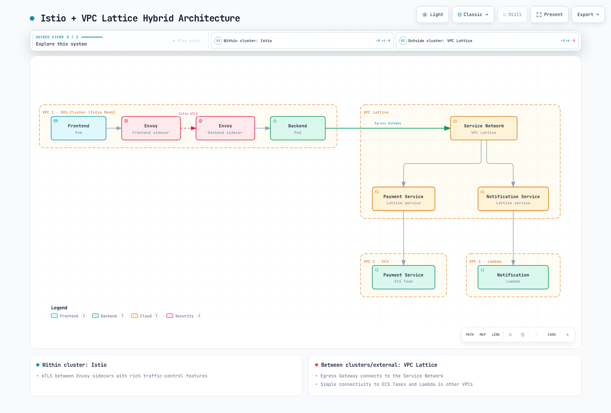

# Istio vs VPC Lattice

> **Last reviewed**: September 11, 2026
> **Istio API baseline**: 1.31.0; Kubernetes compatibility must be checked separately

Compare the communication, identity, protocol and operating requirements of the application. Istio and VPC Lattice have different deployment and security boundaries; a feature-star table or unsupported “zero overhead” claim does not select the correct architecture.

The configuration examples assume existing, authorized resources and real application endpoints. They are alternatives for the appropriate environment, not one combined production deployment. Identifiers, roles, namespaces and identity-provider URLs must be replaced deliberately. The audit validated local configuration/input shapes and calculations, without deploying AWS or cluster resources.

## Contents

1. [Architecture and Platforms](#architecture-and-platforms)
2. [Traffic Management](#traffic-management)
3. [Security and Identity](#security-and-identity)
4. [Observability](#observability)
5. [Installation and Operations](#installation-and-operations)
6. [Cost and Historical Evidence](#cost-and-historical-evidence)
7. [Hybrid and Multicloud Design](#hybrid-and-multicloud-design)
8. [Selection Criteria](#selection-criteria)

## Architecture and Platforms

### Istio

Istio provides a deployable control/data plane with Kubernetes and documented VM integration. Sidecar mode uses an Envoy proxy in enrolled workload Pods; ambient uses per-node ztunnel plus separately enrolled waypoints for supported L7 processing. Adding a sidecar adds a **container**, not another application Pod.


[View interactive diagram](https://www.atomai.click/kubernetes-docs/archmaps/en-service-mesh-istio-comparison-02-istio-vs-lattice-0.html)

The retained diagram describes sidecar mode. Its resource annotations are old illustrative estimates, not measured defaults or a current capacity recommendation. Kiali queries telemetry/backends; it is not itself a trace collector.

Ambient capture uses the documented Linux network-namespace/iptables mechanism, not an eBPF capture layer. Core ambient functionality became GA in 1.24, while individual features and multicluster topologies have separate status. Removing a sidecar, enrolling a workload and requiring waypoint traversal are distinct operations; a namespace label alone does not safely migrate every workload or guarantee 97–98% savings.

### VPC Lattice

VPC Lattice is AWS-managed application networking for **services and resources**. Its service model includes listeners, rules and target groups for supported IP/instance, Lambda and ALB targets; ECS/EKS integration manages applicable targets. Resource configurations/resource gateways provide a different private resource-access model, including TCP connectivity.

A service network is a logical association/access boundary, not a sidecar or a Pod-level identity. A client can use a service-network VPC association or a service-network VPC endpoint. The endpoint path is powered by PrivateLink; it is inaccurate to describe every Lattice data path or the entire data plane simply as “AWS PrivateLink.”

VPC associations and endpoint associations have different addressing/connectivity behavior. Service-network endpoints can accept supported traffic arriving through peering, Transit Gateway, Direct Connect or VPN, including clients outside AWS. The AWS service remains operated in AWS; this is not deployment of Lattice into another cloud.

| Dimension | Istio | VPC Lattice |
|---|---|---|
| Data plane | Sidecars or ambient components, plus chosen gateways | Managed service/resource networking and configured targets/endpoints |
| Identity | Workload mesh identity and configured application/JWT policies | Service IAM/SigV4 authorization where enabled; resource access has separate controls |
| Operations | Control/proxy lifecycle, certificates, capacity, policy and telemetry | AWS operates the service; users still manage IAM, DNS, associations, targets, controllers, quotas and applications |
| Platform | Supported Kubernetes/VM deployments, mode-specific requirements | Supported AWS target types and documented client/network paths |
| Cost | Actual infrastructure, telemetry, support and engineering | Applicable service/resource/traffic charges plus application infrastructure, logs and engineering |

“No required sidecar” is a deployment property, not proof of zero latency, CPU, signing/controller work or total infrastructure cost.

## Traffic Management

### Weighted and Conditional Routing

Istio can match HTTP request properties and route to labeled subsets. The backend Service and matching v1/v2 workloads must already exist in `mesh-demo`:

```yaml
apiVersion: networking.istio.io/v1
kind: VirtualService
metadata:
  name: backend-canary
  namespace: mesh-demo
spec:
  hosts:
  - backend
  http:
  - match:
    - headers:
        x-release:
          exact: canary
    route:
    - destination:
        host: backend
        port:
          number: 8080
        subset: v2
      weight: 100
    retries:
      attempts: 0
  - route:
    - destination:
        host: backend
        port:
          number: 8080
        subset: v1
      weight: 90
    - destination:
        host: backend
        port:
          number: 8080
        subset: v2
      weight: 10
    retries:
      attempts: 0
---
apiVersion: networking.istio.io/v1
kind: DestinationRule
metadata:
  name: backend
  namespace: mesh-demo
spec:
  host: backend
  trafficPolicy:
    loadBalancer:
      simple: LEAST_REQUEST
    connectionPool:
      tcp:
        maxConnections: 100
      http:
        http1MaxPendingRequests: 50
        http2MaxRequests: 100
        maxRequestsPerConnection: 2
    outlierDetection:
      consecutive5xxErrors: 5
      interval: 30s
      baseEjectionTime: 60s
      maxEjectionPercent: 50
      minHealthPercent: 50
  subsets:
  - name: v1
    labels:
      version: v1
  - name: v2
    labels:
      version: v2
```

The routes disable mesh retries explicitly. The resource limits are illustrative; `maxRequestsPerConnection: 2` intentionally limits reuse and is not a general performance recommendation. Outlier detection is evaluated by a proxy for its upstream endpoints. `minHealthPercent` is the panic/fail-open threshold, not a guarantee that at least that percentage remains healthy.

Lattice HTTP/HTTPS listener rules support method, header and path matching. This complete **CreateRule input** replaces the former missing service/name and malformed pathMatch example:

```json
{
  "serviceIdentifier": "svc-0123456789abcdef0",
  "listenerIdentifier": "listener-0123456789abcdef0",
  "name": "api-canary",
  "priority": 10,
  "match": {
    "httpMatch": {
      "method": "GET",
      "pathMatch": {
        "caseSensitive": true,
        "match": {
          "prefix": "/api/v1/"
        }
      }
    }
  },
  "action": {
    "forward": {
      "targetGroups": [
        {
          "targetGroupIdentifier": "tg-0123456789abcdef0",
          "weight": 90
        },
        {
          "targetGroupIdentifier": "tg-0123456789abcdef1",
          "weight": 10
        }
      ]
    }
  }
}
```

Save as `rule.json`, replace the identifiers with an existing service/listener and two eligible target groups, and verify that the rule name and priority are unused before creating it:

```bash
AWS_REGION=us-east-1
aws vpc-lattice create-rule --region "$AWS_REGION" --cli-input-json file://rule.json
```

Lower numeric priority is evaluated first. The nested `pathMatch.match.prefix` shape is required. The shown rule matches GET under `/api/v1/`; it is not a full equivalent of every Istio match or an authentication policy. Weights do not deploy or scale the versions. Do not give an AWS controller and this CLI example competing ownership of the same rule/targets.

Lattice documents round-robin target selection; this is separate from weights between target groups. The API does not expose the old claimed choice of “least connections” for this example.

### Mirroring and Faults

For an isolated read-only mirror experiment, use a separate alternative VirtualService:

```yaml
apiVersion: networking.istio.io/v1
kind: VirtualService
metadata:
  name: backend-mirror
  namespace: mesh-demo
spec:
  hosts:
  - backend
  http:
  - match:
    - method:
        exact: GET
      uri:
        prefix: /api/v1/
    route:
    - destination:
        host: backend
        port:
          number: 8080
        subset: v1
      weight: 100
    mirror:
      host: backend
      port:
        number: 8080
      subset: v2
    mirrorPercentage:
      value: 10
    retries:
      attempts: 0
  - route:
    - destination:
        host: backend
        port:
          number: 8080
        subset: v1
      weight: 100
    retries:
      attempts: 0
```

Only matching GET requests are mirrored; other requests go to v1 without mirroring. Shadow responses are not the primary client response, and duplicate requests can still create side effects if an endpoint is not truly read-only. The destination versions and capacity must exist.

An isolated fault experiment can use a deliberate request marker:

```yaml
apiVersion: networking.istio.io/v1
kind: VirtualService
metadata:
  name: backend-fault-lab
  namespace: mesh-demo
spec:
  hosts:
  - backend
  http:
  - match:
    - method:
        exact: GET
      headers:
        x-fault-lab:
          exact: enabled
    fault:
      delay:
        percentage:
          value: 10
        fixedDelay: 5s
      abort:
        percentage:
          value: 5
        httpStatus: 503
    route:
    - destination:
        host: backend
        port:
          number: 8080
        subset: v1
      weight: 100
  - route:
    - destination:
        host: backend
        port:
          number: 8080
        subset: v1
      weight: 100
    retries:
      attempts: 0
```

The marker is not authorization; scope the test workload and callers. Fault injection and retry/timeout behavior on the same route are not interchangeable tests. Observe which proxy generates the error and measure raw versus retried outcomes separately.

The checked Lattice RuleAction API offers forwarding or a fixed response, not an Istio-equivalent mirror or percentage delay/abort action. A fixed response rule is not the same as percentage fault injection. Application/proxy test mechanisms or supported AWS FIS actions require their own explicit design. “ALB + Lambda@Edge” is not a valid built-in mirror feature: Lambda@Edge runs on CloudFront events.

### Health Checks and Failure Handling

This **CreateTargetGroup input** assumes an existing, non-meshed HTTP backend and a real `/health` endpoint in the specified VPC. It is not the STRICT Istio backend from the security example:

```json
{
  "name": "backend-v1",
  "type": "IP",
  "config": {
    "port": 8080,
    "protocol": "HTTP",
    "protocolVersion": "HTTP1",
    "vpcIdentifier": "vpc-0123456789abcdef0",
    "ipAddressType": "IPV4",
    "healthCheck": {
      "enabled": true,
      "protocol": "HTTP",
      "protocolVersion": "HTTP1",
      "port": 8080,
      "path": "/health",
      "healthCheckIntervalSeconds": 30,
      "healthCheckTimeoutSeconds": 5,
      "healthyThresholdCount": 2,
      "unhealthyThresholdCount": 3,
      "matcher": {
        "httpCode": "200"
      }
    }
  }
}
```

```bash
aws vpc-lattice create-target-group --region "$AWS_REGION"   --cli-input-json file://target-group.json
```

The file must contain the shown complete input with real values. Health checks belong inside config, with healthCheckIntervalSeconds and healthCheckTimeoutSeconds. There is no top-level `--health-check` flag for this operation. Register actual supported targets after creation; EKS Pod IP lifecycle should normally be managed through the appropriate AWS Gateway API Controller rather than a permanent handwritten Pod IP.

Lattice automatically uses healthy targets. If all targets in the group are unhealthy, it **fails open** and routes to them; it does not simply wait for manual removal. Health checks do not repair the application. Lattice health routing is different from Istio's per-proxy connection-pool and outlier controls.

Service idleTimeoutSeconds is configurable from 60 to 600 seconds. It is not the same control as a per-route request timeout or retry budget. Test connection/request limits and failure behavior for the selected HTTP, gRPC or TLS path rather than assigning a generic winner.

## Security and Identity

### Istio: Require the Intended Conditions Together

```yaml
apiVersion: security.istio.io/v1
kind: PeerAuthentication
metadata:
  name: backend-strict
  namespace: mesh-demo
spec:
  selector:
    matchLabels:
      app: backend
  mtls:
    mode: STRICT
---
apiVersion: security.istio.io/v1
kind: RequestAuthentication
metadata:
  name: backend-jwt
  namespace: mesh-demo
spec:
  selector:
    matchLabels:
      app: backend
  jwtRules:
  - issuer: https://issuer.example.com
    jwksUri: https://issuer.example.com/.well-known/jwks.json
    audiences:
    - api.example.com
---
apiVersion: security.istio.io/v1
kind: AuthorizationPolicy
metadata:
  name: backend-access
  namespace: mesh-demo
spec:
  selector:
    matchLabels:
      app: backend
  action: ALLOW
  rules:
  - from:
    - source:
        principals:
        - cluster.local/ns/mesh-demo/sa/frontend
        requestPrincipals:
        - https://issuer.example.com/*
    to:
    - operation:
        methods:
        - GET
        - POST
        paths:
        - /api/v1/*
        ports:
        - '8080'
    when:
    - key: request.auth.claims[role]
      values:
      - admin
```

The issuer/JWKS/audience are explicit identity-provider placeholders, and the caller must have the real frontend ServiceAccount identity. The **same ALLOW rule** requires the mesh principal, JWT principal from that issuer, allowed method/path/port and admin claim. Separate ALLOW policies are ORed and would not require both checks together. RequestAuthentication alone does not require a JWT, and a raw user-role header is not authenticated identity. Review other ALLOW policies targeting the workload, because a separate matching grant can still add access.

Certificate rotation follows the issuer lifetime and proxy/CA configuration; there is no universal 15-minute renewal interval. External CA integration needs its actual supported issuer path. Port-level mTLS settings refer to workload ports and differ by proxy mode; labeling the main application port 8080 as a plaintext “metrics exception” can break this security contract.

### Lattice: TLS Boundary and Service Authorization

This **CreateListener input** creates HTTPS termination for an existing ready service and target group:

```json
{
  "serviceIdentifier": "svc-0123456789abcdef0",
  "name": "https-main",
  "protocol": "HTTPS",
  "port": 443,
  "defaultAction": {
    "forward": {
      "targetGroups": [
        {
          "targetGroupIdentifier": "tg-0123456789abcdef0",
          "weight": 100
        }
      ]
    }
  }
}
```

```bash
aws vpc-lattice create-listener --region "$AWS_REGION" --cli-input-json file://listener.json
```

The generated service DNS name has an AWS-managed certificate; custom domains require the documented certificate/domain setup. Front-end HTTPS does not imply backend HTTPS or Istio SPIFFE mTLS. Target-group protocol is a separate choice. When Lattice establishes HTTPS to targets, the documented behavior does **not validate the target certificates**; do not describe that as application-level peer-certificate authentication.

TLS_PASSTHROUGH can instead carry the application's own TLS/mTLS without terminating it in Lattice. It requires the custom-domain/SNI and TCP-target configuration, allows only the default forwarding rule, limits connections to ten minutes and supports only anonymous auth-policy principals. Lambda targets are not supported on that path. It does not provide HTTP IAM/header policy inspection over the encrypted stream.

### Correct IAM Auth Policies

Use `vpc-lattice-svcs:Invoke`, the service ARN plus path, and an explicitly selected role. A service/network auth policy example is:

```json
{
  "Version": "2012-10-17",
  "Statement": [
    {
      "Effect": "Allow",
      "Principal": {
        "AWS": "arn:aws:iam::123456789012:role/LatticeClient"
      },
      "Action": "vpc-lattice-svcs:Invoke",
      "Resource": "arn:aws:vpc-lattice:us-east-1:123456789012:service/svc-0123456789abcdef0/api/v1/*",
      "Condition": {
        "StringEquals": {
          "vpc-lattice-svcs:RequestMethod": [
            "GET",
            "POST"
          ]
        }
      }
    }
  ]
}
```

Save the auth policy as auth-policy.json after replacing the example ARNs. The caller role separately needs a corresponding identity-based permission:

```json
{
  "Version": "2012-10-17",
  "Statement": [
    {
      "Effect": "Allow",
      "Action": "vpc-lattice-svcs:Invoke",
      "Resource": "arn:aws:vpc-lattice:us-east-1:123456789012:service/svc-0123456789abcdef0/api/v1/*",
      "Condition": {
        "StringEquals": {
          "vpc-lattice-svcs:RequestMethod": [
            "GET",
            "POST"
          ]
        }
      }
    }
  ]
}
```

Replace the example ARNs and ensure every enabled service-network and service auth policy allows the request. An explicit deny anywhere wins. AWS_IAM activates evaluation; a policy attached while authType is NONE is inactive. Wildcard Principal plus only SourceVpc can allow anonymous traffic, so it is not proof of IAM authentication.

The API operation is **PutAuthPolicy**. To preserve a compact policy string inside a complete CLI input without embedded newlines:

```bash
: "${SERVICE_ID:?Set the actual service ID}"
jq -n --arg resource "$SERVICE_ID" --slurpfile policy auth-policy.json   '{resourceIdentifier:$resource, policy:($policy[0] | tojson)}' > put-auth-policy.json
aws vpc-lattice put-auth-policy --region "$AWS_REGION"   --cli-input-json file://put-auth-policy.json
```

This replaces nonexistent create-auth-policy/allowedPrincipals syntax. The management role applying configuration is distinct from the workload role invoking the service. The application or a supported signing component must sign the actual request using the documented SigV4 path and workload credentials; TLS settings alone do not produce the signature. Forwarding changes to signed request components can invalidate it; preserve them or sign after the intended transformations.

Lattice authorization is not limited to L4/service names. Documented conditions include method, path, headers and query strings, in addition to principal/VPC/service context. Their protocol and anonymous-caller availability differ. These service auth policies do not cover resource configurations in a service network.

The current WAF AssociateWebACL resource list does not include a Lattice service/network. A supported WAF component can be part of a separately designed path, but the old diagram's direct “Lattice WAF integration” claim is not justified. IAM, WAF, network isolation and application authorization remain distinct controls.


## Observability

### Istio Metrics and Traces

Use the actual metric family, labels and one reporter. For the example backend, total RPS, a 5xx/zero-status fraction and p95 latency in milliseconds can be queried separately:

```promql
sum(rate(istio_requests_total{reporter="source",destination_service_name="backend",destination_service_namespace="mesh-demo"}[5m]))

(sum(rate(istio_requests_total{reporter="source",destination_service_name="backend",destination_service_namespace="mesh-demo",response_code=~"5..|0"}[5m])) or vector(0))
/
sum(rate(istio_requests_total{reporter="source",destination_service_name="backend",destination_service_namespace="mesh-demo"}[5m]))

histogram_quantile(0.95, sum by (le) (rate(istio_request_duration_milliseconds_bucket{reporter="source",destination_service_name="backend",destination_service_namespace="mesh-demo"}[5m])))
```

The numerator fallback handles an absent 5xx series when real traffic exists; an absent denominator remains absent and idle traffic does not become evidence of health. Confirm metric labels and scrape scope. Proxy connection/outlier gauges and counters are separate Envoy families; do not invent fixed “50 default metrics” counts or a universal cache/retry interpretation.

Current Telemetry configuration uses metric overrides/tagOverrides and a declared tracing provider:

```yaml
apiVersion: install.istio.io/v1alpha1
kind: IstioOperator
spec:
  meshConfig:
    enableTracing: true
    extensionProviders:
    - name: otel-tracing
      opentelemetry:
        service: otel-collector.observability.svc.cluster.local
        port: 4317
---
apiVersion: telemetry.istio.io/v1
kind: Telemetry
metadata:
  name: backend-observability
  namespace: mesh-demo
spec:
  selector:
    matchLabels:
      app: backend
  metrics:
  - providers:
    - name: prometheus
    overrides:
    - match:
        metric: REQUEST_COUNT
      tagOverrides:
        request_method:
          value: request.method
  tracing:
  - providers:
    - name: otel-tracing
    randomSamplingPercentage: 10
    customTags:
      environment:
        literal:
          value: lab
```

The IstioOperator object is **input to istioctl**, to be merged with reviewed existing installation settings. Do not overwrite the live istio ConfigMap or discard other extension providers. The Collector Service must actually accept OTLP gRPC on 4317 and have a working backend/exporter pipeline; it is not installed by these objects. The provider name in Telemetry must match MeshConfig.

Adding a metric dimension is not the same as producing an arbitrary business metric. Bound cardinality, collect application metrics where necessary, and configure compatible exemplar/tracing support. End-to-end traces require application context propagation, sampling and collector/backend delivery; neither “all backends” nor automatic baggage propagation is guaranteed by installing Istio.

### VPC Lattice Metrics

The documented CloudWatch namespace is **AWS/VpcLattice**, with exact case. Service dimensions include Service and AvailabilityZone; target-group dimensions include TargetGroup and AvailabilityZone. Discover the actual emitted metric/dimension combination:

```bash
aws cloudwatch list-metrics --region "$AWS_REGION"   --namespace AWS/VpcLattice --metric-name TotalRequestCount
```

| Documented signal | Interpretation |
|---|---|
| TotalRequestCount | Request count; Sum is useful |
| RequestTime | Milliseconds; Average or a percentile, with the documented service/target-group measurement boundary |
| HTTPCode_2XX_Count through HTTPCode_5XX_Count | Aggregate HTTP responses |
| HTTPCode_VpcLattice_403_Count and other documented granular codes | Lattice-generated responses, useful alongside access-log reasons |
| Target-group connection metrics | Protocol-specific connection counts/errors/bytes; distinct from application request metrics |

These metrics are published once a minute after the resource receives traffic. A five-minute query period is an aggregation choice. Use list-targets and health-check information for target health instead of assuming ALB metric names such as HealthyTargetCount or TargetResponseTime exist in this namespace.

For a current one-hour query, generate UTC timestamps once. This Bash/Python snippet does not call AWS:

```bash
read -r START_TIME END_TIME START_EPOCH END_EPOCH < <(python3 - <<'PYTIME'
from datetime import datetime, timedelta, timezone
end = datetime.now(timezone.utc).replace(microsecond=0)
start = end - timedelta(hours=1)
print(start.strftime('%Y-%m-%dT%H:%M:%SZ'),
      end.strftime('%Y-%m-%dT%H:%M:%SZ'),
      int(start.timestamp()), int(end.timestamp()))
PYTIME
)
```

Choose the Service-only metric from list-metrics and copy its exact Service dimension value. If selecting an AZ-specific metric, include its complete dimension set as returned rather than dropping the AZ:

```bash
: "${SERVICE_DIMENSION:?Copy the exact Service dimension value from list-metrics}"
aws cloudwatch get-metric-statistics --region "$AWS_REGION"   --namespace AWS/VpcLattice --metric-name TotalRequestCount   --dimensions "Name=Service,Value=$SERVICE_DIMENSION"   --start-time "$START_TIME" --end-time "$END_TIME"   --period 60 --statistics Sum
```

Missing metrics are not automatically zero traffic or a healthy service. Lattice's AWS namespace contains its published service metrics; applications can separately publish custom metrics or derive log metrics. “Custom metrics are impossible” is therefore not a useful general claim.

### Access Logs and Request Correlation

Lattice can deliver access logs to CloudWatch Logs, S3 or Data Firehose. Delivery permissions, destination policies, retention and charges must be configured; delivery latency is best effort. This is a documented-fields **illustration**, not a captured production log:

```json
{
  "startTime": "2025-01-15T12:34:56Z",
  "serviceArn": "arn:aws:vpc-lattice:us-east-1:123456789012:service/svc-0123456789abcdef0",
  "requestMethod": "GET",
  "requestPath": "/api/v1/items",
  "protocol": "HTTP/1.1",
  "responseCode": 200,
  "duration": 12,
  "requestId": "example-request-001"
}
```

Additional documented fields include authDeniedReason, failureReason, callerPrincipal/resolvedUser and target/source information. Use the actual log type: resource-access logs describe a different TCP/resource path. Do not assume generic timestamp/requestProtocol/responseCodeDetails/requestHeaders/traceparent fields.

The requestId correlates with x-amzn-requestid, which a client can supply; it is not authenticated identity. A W3C trace header propagated by an application is distinct from a guaranteed native log field or an automatically generated distributed trace. Application instrumentation can use suitable tracing backends and is not restricted to X-Ray.

For a configured log group, use both time bounds and inspect the query status/results:

```bash
: "${LATTICE_LOG_GROUP:?Set the configured CloudWatch log group}"
QUERY_ID=$(aws logs start-query --region "$AWS_REGION"   --log-group-name "$LATTICE_LOG_GROUP"   --start-time "$START_EPOCH" --end-time "$END_EPOCH"   --query-string 'fields @timestamp, requestId, requestMethod, requestPath, responseCode, authDeniedReason, failureReason | filter responseCode >= 500 | sort @timestamp desc | limit 20'   --query queryId --output text)
aws logs get-query-results --region "$AWS_REGION" --query-id "$QUERY_ID"
```

A query may still be Scheduled or Running; an immediate empty result is not proof that no errors occurred. Narrow access and time range to the investigation. Kiali/Grafana or CloudWatch dashboards require their real data sources and access configuration; dashboard names do not prove equivalent visibility.

## Installation and Operations

### Choose and Verify the Platform

Istio 1.31 supports Kubernetes 1.32–1.36; use the intersection with the actual managed platform and required proxy mode. There is no built-in production profile, and the old istio.io/injection label does not enable sidecar injection. Follow the [installation guide](../01-installation.md) for current artifacts, revision labels and prerequisites. Demo addons are not a production monitoring/HA stack.

For Lattice, define the service/resource model, actual client association or endpoint path, target lifecycle, listener protocol and authentication boundaries. A service does not have to be a Lambda function, and a meshed EKS application can call Lambda through a separately supported integration. Lambda cannot itself host an Istio sidecar; that is different from declaring every EKS-plus-Lambda architecture incompatible with Istio.

A complete service setup requires, in order appropriate to the owners:

1. Existing network connectivity, DNS, security groups and authorized management/client roles.
2. The service network and the intended client VPC association or service-network endpoint.
3. The service and network/service association, with the intended authentication mode.
4. Target group, supported target registration and verified health behavior.
5. Listener/rules and domain/certificate configuration.
6. Every required auth policy and caller identity permission, plus a working signer for authenticated requests.
7. Logs/metrics, actual request/denial tests and a resource lifecycle/cleanup plan.

The operation inputs above cover parts of that workflow. They do not create its prerequisites or prove readiness. Check asynchronous resource status and existing ownership before subsequent operations. For Kubernetes, use the appropriate controller instead of maintaining stale Pod-IP registrations. Managed service updates do not remove responsibility for controllers, SDKs, IAM, DNS or application compatibility.

### Istio Upgrades and Ambient Enrollment

Use the supported upgrade path from the installed release and preserve the complete reviewed values, trust and policy configuration. The old 1.23→1.24 diagram is historical, not a current target. Revision handoff does not justify jumping arbitrary minor versions.

Back up authoritative installation/GitOps configuration and relevant custom resources. `kubectl get all` does not include every object and is not a complete recoverable backup. Inspect the actual namespace/revision/Pod overrides, stage a workload cohort, check readiness, traffic, certificates and telemetry, and retain rollback capacity until the transition is accepted.

Do not force-restart every workload, reissue a CA for every certificate error, or manually delete hard-coded shared webhook names as routine cleanup. Use the release's supported retirement procedure only after confirming that all dependent proxies/gateways have moved. Removing a control plane changes recovery options; it is not a universal proof that rollback is forever impossible.

Ambient enrollment can add sidecar-free workloads without application restart, while removing existing sidecars requires workload replacement. The ambient/CNI/ztunnel prerequisites and waypoint enrollment/security controls still apply. Pod Ready counts are not universally 2/2, and native sidecars may be represented under initContainers.

### Diagnose the Actual Failure Boundary

| Layer | Checks relevant to the selected design |
|---|---|
| Application/target | Listening protocol/port, readiness, replicas/endpoints, dependencies and errors |
| Mesh or Lattice routing | Effective routes, subsets/target groups, health/fail-open, timeouts and resource status |
| Identity and policy | Certificate lifetime/trust, JWT or SigV4, every applicable auth policy and IAM denial |
| Network/DNS | Correct association/endpoint, routes, security groups/NetworkPolicy and actual resolver path |
| Control/telemetry | Revision/controller state, API/config propagation, real metrics and delivered logs |

For Istio, proxy-status/config commands and actual workload logs are useful. Do not assume the proxy image contains curl, tcpdump or a shell; use supported debugging methods with the needed permissions. Protect diagnostic archives and restore temporary debug settings. A zero-replica backend is a Deployment/endpoint fact, not a Service.spec.replicas field.

For Lattice, these read operations inspect actual resources:

```bash
: "${SERVICE_NETWORK_ID:?Set the actual service-network ID}"
: "${TG_ID:?Set the actual target-group ID}"
aws vpc-lattice get-service --region "$AWS_REGION" --service-identifier "$SERVICE_ID"
aws vpc-lattice list-service-network-service-associations --region "$AWS_REGION"   --service-network-identifier "$SERVICE_NETWORK_ID"
aws vpc-lattice get-target-group --region "$AWS_REGION" --target-group-identifier "$TG_ID"
aws vpc-lattice list-targets --region "$AWS_REGION" --target-group-identifier "$TG_ID"
```

list-services does not take a service-network filter. Network analysis tools inspect their supported network resources; passing a Lattice service ID as an EC2 network-insights destination is not a complete application/IAM diagnostic. No fixed three-layer process, five-minute repair time or managed “auto healing” guarantee follows from these commands.


## Cost and Historical Evidence

### Compare the Same Cost Boundary

Include the same applications, availability requirements, network traffic, logging/metrics retention and engineering scope on both sides. Lattice does not pay for or remove the application's EC2/EKS/ECS/Lambda compute. A managed networking bill alone cannot be compared with an entire Istio application fleet plus staff.

The former example contained several distinct issues:

- It modeled 24.5 vCPU in total: application 10 + sidecars 10 + Istiod 1 + Prometheus 2 + Jaeger 1 + Kiali 0.5. Five four-vCPU m5.xlarge nodes provide only 20 vCPU before reservations. Even the ideal CPU lower bound is seven nodes, before other constraints.
- The English line items summed to $850 compute + $15 storage = **$865**, while the Korean text added an unsupported $10 “latency/network” charge to reach $875. Latency is not itself an AWS billing unit.
- The original Lattice arithmetic was $209 ×12 + $300 ×12 + $1,000 = **$7,108**, not $7,608. Its setup-plus-operations amount was $4,600, not $5,100.
- Using only those old assumptions, five years of $209/month infrastructure and $300/month operations plus setup once would be **$31,540**, not five copies of an annual number containing setup.
- The Korean Istio five-year number added a $50,000 contingency only on that side, and repeatedly counted initial setup. This is an inconsistent comparison boundary, not evidence of an intrinsic product price difference.

The old $140/node-month, resource quantities and staffing estimates were hypothetical inputs without a substantiated quote or workload measurement. Mi and MB were also mixed: 100 × 128 Mi is 12,800 Mi = 12.5 Gi, not 12.8 decimal GB. A sidecar does not double the Pod count, and released resource headroom does not automatically remove billed nodes.

### Current Dated Service-Pricing Example

The official US East (N. Virginia) service-pricing examples checked on September 11, 2026 use $0.025 per service-hour, $0.025 per GB processed, and request/connection charges after the documented per-service hourly allowance. Service-network VPC associations and service-network endpoints are listed at no additional cost. Resource configurations/resource endpoints have a **different** pricing model; their $0.01/GB tier is not the service data-processing rate. Do not add the old separate service-network-hour charge to this service-pricing model.

For an explicitly hypothetical HTTP/HTTPS service workload:

| Input | Calculation | Monthly networking charge |
|---|---|---:|
| Five services, 730 hours each |5 ×730 ×$0.025|$91.25|
|10,000 billable GB across those services, including requests and responses |10,000 ×$0.025|$250.00|
| Each service remains within 300,000 requests in every hour |No requests above the hourly allowance|$0.00|
| Total for these stated inputs |$91.25 +$250.00|**$341.25**|

Above that allowance, calculate request charges per service and hour using the published $0.10/million rate; do not use a monthly-average RPS to erase burst-hour charges. TLS-passthrough connection billing is a different counter. Include every billable service hop, actual Region, application infrastructure, logs and other relevant charges. These are dated illustrative inputs, not a quote, future price guarantee or a claimed saving against an unmeasured Istio fleet.

Model one-time setup/migration separately from recurring operations. Discounting, purchase commitments, expected growth, uncertainty and equal HA/support requirements matter to a multi-year comparison. No generic $42,000/year or $260,000/five-year saving is established by the former table.

### Preserve Historical Measurements Honestly

The previous performance section claimed a **two-node EKS, m5.xlarge,1,000-RPS** test with an Istio 1.24 context, but supplied no harness, raw samples, exact EKS/patch/proxy versions or matching configuration:

| Original unverified result | Baseline | Istio total | Lattice total |
|---|---:|---:|---:|
| p50 |1.0 ms|2.0 ms|1.5 ms|
| p95 |2.5 ms|5.0 ms|3.7 ms|
| p99 |5.0 ms|8.5 ms|7.0 ms|
| Maximum RPS |10,000|8,500|9,200|
| CPU claim |100%|115%|102%|
| Memory claim |1 GB|1.5 GB|1.05 GB|

These values remain historical, unverified claims rather than new 1.31 measurements. They do not prove that removing a sidecar causes the entire latency/throughput difference. A meaningful test matches protocol, payload, TLS/authorization, placement, load, telemetry and failure behavior, and separates raw failures from retry-masked outcomes.

The original anonymous customer stories and alleged re:Invent satisfaction survey had no traceable publication or methodology. They can suggest questions about migration, staffing and hybrid ownership, but not measured success rates. The identified **CNCF 2024 Annual Survey** asks about container challenges, project usage and service-mesh usage; it does not substantiate the claimed “40% Istio adoption failure” or the listed failure-cause percentages. Use the actual question, sample and meaning when citing a survey.

## Hybrid and Multicloud Design



[View interactive diagram](https://www.atomai.click/kubernetes-docs/archmaps/en-service-mesh-istio-comparison-02-istio-vs-lattice-17.html)

The diagram is a high-level option, not a complete egress configuration. Decide whether traffic uses a direct sidecar path or an explicitly configured egress gateway, and define every TLS/identity boundary. Lattice does not automatically originate Istio SPIFFE mTLS to a STRICT backend. A deliberate ingress boundary can authenticate the intended external path and use mesh mTLS downstream; the backend may then see the gateway identity rather than the original IAM caller.

For an application that signs and initiates HTTPS, discover the **actual** Lattice service DNS name instead of inventing payment.vpclattice.aws:

```bash
aws vpc-lattice get-service --region "$AWS_REGION"   --service-identifier "$SERVICE_ID" > lattice-service.json
LATTICE_HOST=$(jq -er '.dnsEntry.domainName | select(type == "string" and length > 0)' lattice-service.json) || exit 1
jq -n --arg host "$LATTICE_HOST" '{
  apiVersion:"networking.istio.io/v1",kind:"ServiceEntry",
  metadata:{name:"payment-lattice",namespace:"mesh-demo"},
  spec:{hosts:[$host],location:"MESH_EXTERNAL",resolution:"DNS",
        ports:[{number:443,name:"https",protocol:"HTTPS"}]}
}' > lattice-service-entry.json
```

This produces only a registry entry to review/apply through the workload's normal configuration owner. It neither provisions Lattice nor forces egress-gateway traversal, signs a request or bypasses IAM. Application HTTPS is opaque to the sidecar, so an HTTP VirtualService cannot inspect its path as shown in the former incomplete egress example. Do not add another SIMPLE TLS layer around an already encrypted application stream.

Service-network endpoints can provide a supported entry path from on-premises or other connected networks. That requires routing, DNS, security groups and applicable service authorization; “AWS-operated” does not mean outside-AWS clients are categorically impossible. It also does not create a global service network or replicate application data across Regions/clouds.

For a migration, map APIs, identities, certificate trust, routes, telemetry and recovery ownership. Moving a namespace label is not a complete change from Lattice IAM to mesh identity. Refer to the [VPC Lattice guide](../../../networking/02-vpc-lattice.md), [AWS integration](../04-aws-integration.md) and [multicluster guide](../advanced/02-multi-cluster.md) for their specific contracts.

## Selection Criteria

| Requirement | Decision evidence |
|---|---|
| Kubernetes/VM workload mesh | Required sidecar/ambient features, platform support, identity lifecycle and measured operating capacity |
| AWS service/resource connectivity | Supported target/resource types, actual client path, auth/TLS model and owner responsibilities |
| Fine-grained traffic behavior | Exact rule/filter APIs, protocol limits, retries, health and failure behavior rather than a feature-star score |
| Strong security | End-to-end identity/encryption and application authorization across every termination point, including bypass paths |
| Small team or quick delivery | The actual team's repeatable workflow and support plan, without invented minimum staffing or fixed install-time thresholds |
| Cost and performance | Equal-scope bills, reproducible load/failure measurements and explicitly dated assumptions |
| Hybrid/multicloud | Tested network and identity boundaries plus application/data recovery, not product names alone |

Evaluate a bounded proof of concept with real workloads and retain the evidence. Neither “Istio always expensive/complex” nor “Lattice always cheaper/safer” follows from architecture alone.

## Official References

- [Istio supported releases](https://istio.io/latest/docs/releases/supported-releases/), [ambient](https://istio.io/latest/docs/ambient/overview/), [security](https://istio.io/latest/docs/concepts/security/) and [Telemetry API](https://istio.io/latest/docs/reference/config/telemetry/)
- [VPC Lattice components and responsibilities](https://docs.aws.amazon.com/vpc-lattice/latest/ug/what-is-vpc-lattice.html) and [network associations/endpoints](https://docs.aws.amazon.com/vpc-lattice/latest/ug/service-network-associations.html)
- [CreateRule](https://docs.aws.amazon.com/vpc-lattice/latest/APIReference/API_CreateRule.html), [RuleAction](https://docs.aws.amazon.com/vpc-lattice/latest/APIReference/API_RuleAction.html), [CreateListener](https://docs.aws.amazon.com/vpc-lattice/latest/APIReference/API_CreateListener.html) and [CreateTargetGroup](https://docs.aws.amazon.com/vpc-lattice/latest/APIReference/API_CreateTargetGroup.html)
- [Target groups](https://docs.aws.amazon.com/vpc-lattice/latest/ug/target-groups.html) and [health checks](https://docs.aws.amazon.com/vpc-lattice/latest/ug/target-group-health-checks.html)
- [HTTPS listeners](https://docs.aws.amazon.com/vpc-lattice/latest/ug/https-listeners.html) and [TLS passthrough](https://docs.aws.amazon.com/vpc-lattice/latest/ug/tls-listeners.html)
- [Auth policies](https://docs.aws.amazon.com/vpc-lattice/latest/ug/auth-policies.html), [PutAuthPolicy](https://docs.aws.amazon.com/vpc-lattice/latest/APIReference/API_PutAuthPolicy.html) and [SigV4 requests](https://docs.aws.amazon.com/vpc-lattice/latest/ug/sigv4-authenticated-requests.html)
- [Lattice metrics](https://docs.aws.amazon.com/vpc-lattice/latest/ug/monitoring-cloudwatch.html) and [access logs](https://docs.aws.amazon.com/vpc-lattice/latest/ug/monitoring-access-logs.html)
- [Lattice pricing](https://aws.amazon.com/vpc/lattice/pricing/), [WAF association API](https://docs.aws.amazon.com/waf/latest/APIReference/API_AssociateWebACL.html) and [Lambda@Edge](https://docs.aws.amazon.com/AmazonCloudFront/latest/DeveloperGuide/lambda-at-the-edge.html)
- [CNCF 2024 survey](https://www.cncf.io/reports/cncf-annual-survey-2024/) and [original report](https://www.cncf.io/wp-content/uploads/2025/04/cncf_annual_survey24_031225a.pdf), especially questions 22, 32, 47 (pages 12, 16, 22)
- [Service-mesh comparison](01-service-mesh-comparison.md), [Istio architecture](../03-architecture.md) and [ambient guide](../advanced/01-ambient-mode.md)
