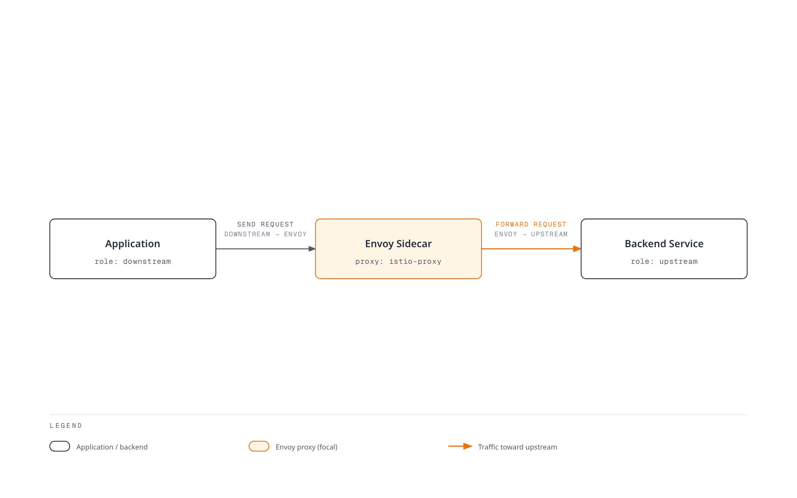
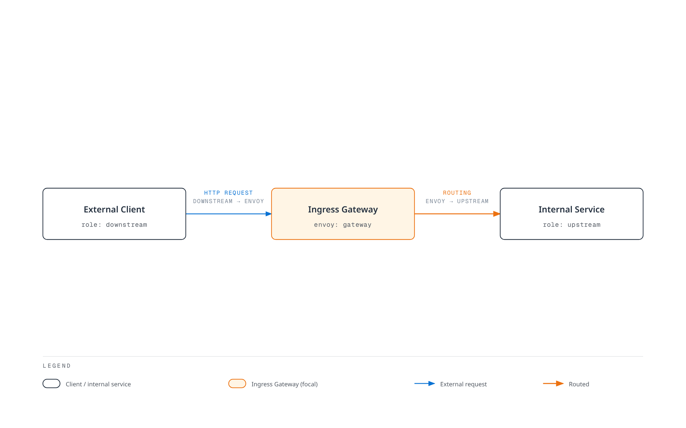
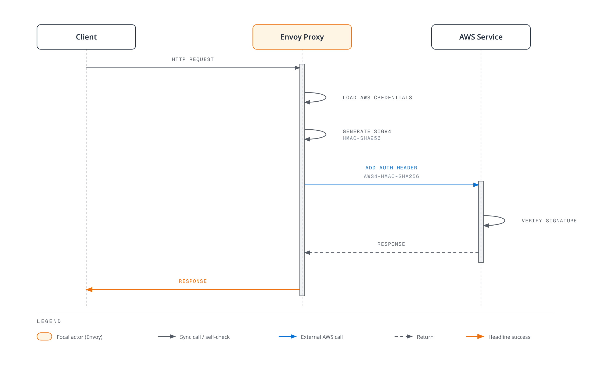

# Istio Glossary

> **Reviewed Version**: Istio 1.31.0
> **Last Updated**: September 11, 2026

This glossary organizes key terms related to Istio and Service Mesh in grouped reference sections.

## Table of Contents

- [A-C](#a-c)
- [D-F](#d-f)
- [G-I](#g-i)
- [J-L](#j-l)
- [M-O](#m-o)
- [P-R](#p-r)
- [S-U](#s-u)
- [V-Z](#v-z)

---

## A-C

### AuthorizationPolicy

An Istio security policy defining ALLOW, DENY, CUSTOM, or AUDIT behavior for selected workloads or target resources. Authentication and authorization are separate; waypoint policies use targetRefs.

### Control Plane

The configuration, discovery, and identity-management layer, implemented by istiod. Application payloads flow through data-plane proxies rather than through istiod.

### Ambient Mode

A data plane mode first shipped as alpha in Istio 1.18 and generally available since Istio 1.24 that provides service mesh functionality without Sidecar Proxies.

**Features**:
- No Sidecar containers required
- Uses ztunnel at the node level
- Improved resource efficiency
- Separation of L4 and L7 functions

**Related Documentation**: [Ambient Mode](advanced/01-ambient-mode.md)

---

### Certificate Authority (CA)

An authority that issues and manages certificates for mTLS communication between services.

**Role in Istio**:
- Istiod's Citadel function performs the CA role
- Issues certificates based on SPIFFE ID
- Automatic certificate renewal (default TTL: 24 hours)

**Related Terms**: [Citadel](#citadel), [SPIFFE](#spiffe-secure-production-identity-framework-for-everyone), [mTLS](#mtls-mutual-tls)

---

### Circuit Breaker

A pattern that blocks requests to failed services to prevent failure propagation throughout the entire system.

**How It Works**:
1. **Closed**: Normal operation
2. **Open**: Blocks requests after consecutive failures
3. **Half-Open**: Allows some requests after a certain time

**Istio Implementation**: Connection-pool circuit breaking and per-endpoint outlier ejection do not expose this literal three-state machine.
```yaml
apiVersion: networking.istio.io/v1
kind: DestinationRule
metadata:
  name: glossary-example-1
spec:
  host: reviews
  trafficPolicy:
    outlierDetection:
      consecutive5xxErrors: 5
      interval: 30s
      baseEjectionTime: 30s
```

**Related Documentation**: [Circuit Breaker](traffic-management/07-circuit-breaker.md)

---

### Citadel

A security component that existed independently through Istio 1.4. It is now integrated into Istiod.

**Main Functions**:
- Certificate Authority (CA) management
- SPIFFE ID issuance and management
- X.509 certificate generation and renewal

**Current Status**: Exists as an internal function within Istiod in Istio 1.5+

**Related Terms**: [Istiod](#istiod), [Certificate Authority](#certificate-authority-ca)

---

### CDS (Cluster Discovery Service)

One of the xDS APIs that allows Envoy to dynamically receive configuration for upstream services (clusters).

**Information Provided**:
- Cluster name and type
- Load balancing policy
- Health check settings
- Circuit breaker settings
- TLS settings

**Related Terms**: [xDS](#xds-discovery-service), [Envoy](#envoy-proxy)

---

## D-F

### Data Plane

The layer that handles actual traffic in a service mesh.

**Istio's Data Plane**:
- Envoy sidecars, or ambient ztunnel plus optional L7 waypoints
- Handles enrolled mesh traffic; exclusions and protocol limits apply
- mTLS encryption/decryption
- Metric collection

**Related Terms**: [Control Plane](#control-plane), [Envoy](#envoy-proxy)

---

### DestinationRule

An Istio CRD that defines policies for traffic routed by VirtualService.

**Main Functions**:
- Subset definition (version, region, etc.)
- Load balancing policy
- Connection Pool settings
- Circuit Breaker settings
- TLS settings

```yaml
apiVersion: networking.istio.io/v1
kind: DestinationRule
metadata:
  name: reviews
spec:
  host: reviews
  subsets:
  - name: v1
    labels:
      version: v1
  - name: v2
    labels:
      version: v2
```

**Related Documentation**: [DestinationRule](traffic-management/03-destination-rule.md)

---

### eBPF (Extended Berkeley Packet Filter)

A technology that allows programs to run safely inside the Linux kernel.

Istio can coexist with an eBPF-based primary CNI such as Cilium. Istio CNI is a separate chained plugin/node agent that configures redirection; ambient does not require eBPF and does not replace the primary CNI.

**Advantages**:
- Low overhead
- Kernel-level processing
- Dynamic programming capability

**Related Terms**: [Ambient Mode](#ambient-mode), [iptables](#iptables)

---

### EDS (Endpoint Discovery Service)

One of the xDS APIs that dynamically provides actual endpoints (pod IPs) within a cluster.

**Information Provided**:
- Endpoint IP addresses and ports
- Health status
- Load balancing weights
- Locality information

**Example**:
```json
{
  "cluster_name": "outbound|9080||reviews",
  "endpoints": [
    {
      "lb_endpoints": [
        {"endpoint": {"address": {"socket_address": {"address": "10.244.1.5", "port_value": 9080}}}},
        {"endpoint": {"address": {"socket_address": {"address": "10.244.2.8", "port_value": 9080}}}}
      ]
    }
  ]
}
```

**Related Terms**: [xDS](#xds-discovery-service), [CDS](#cds-cluster-discovery-service)

---

### Envoy Proxy

A high-performance L7 proxy that forms the Data Plane of Istio.

**History**:
- Developed by Matt Klein at Lyft in 2016
- CNCF Incubating project in 2017
- CNCF Graduated project in 2018

**Key Features**:
- High-performance proxy written in C++
- Dynamic configuration through xDS API
- HTTP/1.1, HTTP/2, gRPC support
- Rich observability

**Components**:
- Listeners: Port listening
- Filters: Request/response processing
- Routers: Routing decisions
- Clusters: Upstream services

**Related Documentation**: [Architecture - Envoy Proxy](03-architecture.md#data-plane-envoy-proxy)

---

## G-I

### Galley

A configuration validation component that existed independently through Istio 1.4. It is now integrated into Istiod.

**Main Functions**:
- Istio configuration validation
- Kubernetes resource processing
- Error checking before configuration deployment

**Current Status**: Exists as an internal function within Istiod in Istio 1.5+

**Related Terms**: [Istiod](#istiod)

---

### Gateway

An Istio CRD that defines entry points for external traffic entering the Service Mesh.

**Types**:
1. **Ingress Gateway**: External to internal traffic
2. **Egress Gateway**: Internal to external traffic

```yaml
apiVersion: networking.istio.io/v1
kind: Gateway
metadata:
  name: my-gateway
spec:
  selector:
    istio: ingressgateway
  servers:
  - port:
      number: 80
      name: http
      protocol: HTTP
    hosts:
    - "example.com"
```

**Related Documentation**: [Gateway and VirtualService](traffic-management/01-gateway-virtualservice.md)

---

### gRPC

A high-performance RPC (Remote Procedure Call) framework developed by Google.

**Relationship with Istio**:
- xDS API is gRPC-based
- Used for Istiod to Envoy communication
- HTTP/2 based (supports multiplexing)

**Advantages**:
- Bidirectional streaming
- Low latency
- Uses Protocol Buffers

**Related Terms**: [xDS](#xds-discovery-service)

---

### Identity

Represents the identity of a workload within the Service Mesh.

**Istio's Identity**:
- Uses SPIFFE ID format
- Based on Kubernetes ServiceAccount
- Proven by X.509 certificates

**Example**:
```
spiffe://cluster.local/ns/default/sa/reviews
```

**Related Terms**: [SPIFFE](#spiffe-secure-production-identity-framework-for-everyone), [mTLS](#mtls-mutual-tls)

---

### iptables

A firewall tool that controls network traffic in Linux.

**Role in Istio**:
- istio-init or the Istio CNI node agent configures traffic redirection
- Redirects all pod traffic to Envoy
- Uses NAT table (PREROUTING, OUTPUT chains)

**Simplified rules (illustration, not an installation script)**:
```bash
# Outbound: All traffic except Envoy -> 15001
iptables -t nat -A OUTPUT -p tcp -m owner ! --uid-owner 1337 -j REDIRECT --to-port 15001

# Inbound: All traffic -> 15006
iptables -t nat -A PREROUTING -p tcp -j REDIRECT --to-port 15006
```

**Setup alternative**: Istio CNI performs privileged network setup at node level.

**Related Documentation**: [Architecture - iptables](03-architecture.md#iptables-and-traffic-interception)

---

### Istiod

The unified Control Plane component in Istio 1.5+.

**Integrated Functions**:
- **Pilot**: Service Discovery, Traffic Management
- **Citadel**: Certificate Authority, Identity
- **Galley**: Configuration Validation

**Execution Method**:
- Single Go binary: `pilot-discovery`
- All functions run within a single process
- Default ports: 15012 (xDS), 15017 (Webhook)

**Advantages**:
- Reduced complexity
- Simplified operations
- Resource efficiency

**Related Documentation**: [Architecture - Istiod](03-architecture.md#control-plane-istiod)

---

## J-L

### LDS (Listener Discovery Service)

One of the xDS APIs that allows Envoy to dynamically receive ports to listen on and filter chains.

**Information Provided**:
- Listener address and port
- Protocol (HTTP, TCP)
- Filter chain configuration
- TLS settings

**Istio's Default Listeners**:
- `0.0.0.0:15001`: Outbound TCP
- `0.0.0.0:15006`: Inbound TCP
- `0.0.0.0:15021`: Health check
- `0.0.0.0:15090`: Prometheus metrics

**Related Terms**: [xDS](#xds-discovery-service), [Envoy](#envoy-proxy)

---

### Locality-aware Load Balancing

A load balancing method that considers locality (Region, Zone) information.

**Priority**:
1. Endpoints in the same Zone
2. Different Zone in the same Region
3. Different Region

**Configuration Example**:
```yaml
apiVersion: networking.istio.io/v1
kind: DestinationRule
metadata:
  name: glossary-example-2
spec:
  host: reviews
  trafficPolicy:
    loadBalancer:
      localityLbSetting:
        enabled: true
        distribute:
        - from: us-west/zone-1a/*
          to:
            "us-west/zone-1a/*": 80
            "us-west/zone-1b/*": 20
```

**Related Documentation**: [Zone Aware Routing](resilience/03-zone-aware-routing.md)

---

## M-O

### Mixer

A policy and telemetry component that existed through Istio 1.4.

**Main Functions**:
- Policy enforcement (Rate Limiting, Access Control)
- Telemetry collection

**Reasons for Removal**:
- Performance overhead (Mixer call for every request)
- Complex architecture

**Current Status**: Deprecated during the 1.5 transition; remaining Mixer functionality removed in 1.8

**Related Terms**: [Istiod](#istiod)

---

### mTLS (Mutual TLS)

A bidirectional TLS communication method where client and server authenticate each other.

**Istio's mTLS**:
- Automatic certificate issuance and renewal
- SPIFFE ID-based authentication
- TLS cipher is negotiated; it is not fixed to AES-256-GCM

**Modes**:
1. **STRICT**: Only mTLS allowed
2. **PERMISSIVE**: mTLS + plaintext allowed (for migration)
3. **DISABLE**: Disable Istio transport mTLS in sidecar mode; unsupported in ambient

```yaml
apiVersion: security.istio.io/v1
kind: PeerAuthentication
metadata:
  name: default
spec:
  mtls:
    mode: STRICT
```

**Related Documentation**: [mTLS](security/01-mtls.md)

---

### Outlier Detection

A feature that automatically excludes endpoints exhibiting abnormal behavior.

**Detection Conditions**:
- Consecutive error count
- Error rate
- Connection failures/timeouts; latency alone is not an outlier-ejection threshold

```yaml
apiVersion: networking.istio.io/v1
kind: DestinationRule
metadata:
  name: glossary-example-3
spec:
  host: reviews
  trafficPolicy:
    outlierDetection:
      consecutive5xxErrors: 5
      interval: 30s
      baseEjectionTime: 30s
      maxEjectionPercent: 50
```

**Related Documentation**: [Outlier Detection](resilience/01-outlier-detection.md)

---

## P-R

### Downstream

From Envoy's perspective, this refers to **the side that sends requests**. That is, the client that initiates a connection to Envoy.

**Envoy's Downstream**:
- Connections coming into Envoy (Inbound)
- Client sending requests
- Connections received by Listener

**Traffic Flow**:
```
Downstream (Client)  ->  Envoy Proxy  ->  Upstream (Backend)
```

**Example Scenarios**:

#### 1. Sidecar Mode - Outbound Request



[🔍 View interactive diagram](https://www.atomai.click/kubernetes-docs/archmaps/en-service-mesh-istio-glossary-0.html)

**Perspective**:
- **From Envoy's view**: Application is Downstream (sending requests)
- **From Envoy's view**: Backend service is Upstream (receiving requests)

#### 2. Ingress Gateway - External Request



[🔍 View interactive diagram](https://www.atomai.click/kubernetes-docs/archmaps/en-service-mesh-istio-glossary-1.html)

**Downstream-related Envoy Configuration**:

```yaml
# Listener - Receive Downstream connections
apiVersion: networking.istio.io/v1alpha3
kind: EnvoyFilter
metadata:
  name: downstream-config
  namespace: default
spec:
  workloadSelector:
    labels:
      app: reviews
  configPatches:
  - applyTo: LISTENER
    match:
      context: SIDECAR_INBOUND
    patch:
      operation: MERGE
      value:
        per_connection_buffer_limit_bytes: 32768  # Downstream buffer
```

**Downstream Metrics**:
```bash
# Downstream connection count
envoy_listener_downstream_cx_active

# Downstream request count
envoy_http_downstream_rq_total

# Downstream response time
envoy_http_downstream_rq_time
```

**Related Terms**: [Upstream](#upstream), [Envoy](#envoy-proxy), [Listener](#lds-listener-discovery-service)

---

### Upstream

From Envoy's perspective, this refers to **the side that receives requests**. That is, the backend service to which Envoy initiates a connection.

**Envoy's Upstream**:
- Connections going out from Envoy (Outbound)
- Backend service processing requests
- Endpoints managed by Cluster

**Traffic Flow**:
```
Downstream (Client)  ->  Envoy Proxy  ->  Upstream (Backend)
```

**Upstream Components**:

#### 1. Cluster (Upstream Group)

```yaml
# Define Upstream Cluster with DestinationRule
apiVersion: networking.istio.io/v1
kind: DestinationRule
metadata:
  name: reviews
spec:
  host: reviews  # Upstream service
  trafficPolicy:
    loadBalancer:
      simple: ROUND_ROBIN
    connectionPool:
      tcp:
        maxConnections: 100      # Upstream connection limit
      http:
        http1MaxPendingRequests: 50
        http2MaxRequests: 100
    outlierDetection:
      consecutive5xxErrors: 5        # Upstream failure detection
      interval: 30s
```

#### 2. Endpoint (Actual Upstream Instance)

```bash
# Check upstream endpoints
istioctl proxy-config endpoints <pod-name> | grep reviews

# Example output:
# ENDPOINT              STATUS      CLUSTER
# 10.244.1.5:9080       HEALTHY     outbound|9080||reviews.default.svc.cluster.local
# 10.244.2.8:9080       HEALTHY     outbound|9080||reviews.default.svc.cluster.local
# 10.244.3.12:9080      UNHEALTHY   outbound|9080||reviews.default.svc.cluster.local
```

**Upstream Traffic Policy**:

```yaml
apiVersion: networking.istio.io/v1
kind: DestinationRule
metadata:
  name: glossary-example-4
spec:
  host: reviews
  trafficPolicy:
    # Upstream load balancing
    loadBalancer:
      consistentHash:
        httpHeaderName: "x-user-id"

    # Upstream connection pool
    connectionPool:
      tcp:
        maxConnections: 100
        connectTimeout: 30s
      http:
        h2UpgradePolicy: UPGRADE

    # Upstream TLS
    tls:
      mode: ISTIO_MUTUAL

    # Upstream Circuit Breaker
    outlierDetection:
      consecutive5xxErrors: 5
      interval: 10s
      baseEjectionTime: 30s
```

**Upstream vs Downstream Comparison**:

| Item | Downstream | Upstream |
|------|-----------|----------|
| **Direction** | Coming into Envoy (Inbound) | Going out from Envoy (Outbound) |
| **Role** | Sending requests (Client) | Receiving requests (Server) |
| **Envoy Configuration** | Listener, Filter Chain | Cluster, Endpoint |
| **Examples** | External users, other services | Backend API, Database |
| **Metrics** | `downstream_cx_*`, `downstream_rq_*` | `upstream_cx_*`, `upstream_rq_*` |

**Real-world Examples**:

#### Scenario 1: Service A -> Service B Call

```
+---------------------------------------------------------+
| Service A Pod                                           |
|                                                         |
|  App --> Envoy Sidecar                                 |
|          |                                              |
|          | Downstream: App                              |
|          | Upstream: Service B                          |
+----------|-------------------------------------------------+
           |
           v
+---------------------------------------------------------+
| Service B Pod                                           |
|                                                         |
|          Envoy Sidecar --> App                          |
|          |                                              |
|          | Downstream: Service A Envoy                  |
|          | Upstream: Local App (Service B)              |
+---------------------------------------------------------+
```

**Service A's Envoy Perspective**:
- Downstream: Service A's application
- Upstream: Service B

**Service B's Envoy Perspective**:
- Downstream: Service A's Envoy
- Upstream: Service B's application (local)

#### Scenario 2: Ingress Gateway

```
External Client (Downstream)
        |
Ingress Gateway (Envoy)
        |
Internal Service (Upstream)
```

**Upstream Metrics**:

```bash
# Upstream connection count
envoy_cluster_upstream_cx_active

# Upstream request counter; derive success/error rates from response-class counters
envoy_cluster_upstream_rq_total

# Upstream response time
envoy_cluster_upstream_rq_time

# Upstream health check
envoy_cluster_health_check_success

# Upstream Circuit Breaker
envoy_cluster_circuit_breakers_default_remaining_rq
```

**Passive Upstream Health Detection**: Active health-check statistics require separate configuration.

```yaml
apiVersion: networking.istio.io/v1
kind: DestinationRule
metadata:
  name: glossary-example-5
spec:
  host: reviews
  trafficPolicy:
    outlierDetection:
      # Upstream health detection
      consecutiveGatewayErrors: 5
      consecutive5xxErrors: 5
      interval: 10s
      baseEjectionTime: 30s
      maxEjectionPercent: 50
```

**Debugging**:

```bash
# 1. Check upstream cluster
istioctl proxy-config clusters <pod-name> --fqdn reviews.default.svc.cluster.local

# 2. Check upstream endpoint status
istioctl proxy-config endpoints <pod-name> --cluster "outbound|9080||reviews.default.svc.cluster.local"

# 3. Check upstream metrics
kubectl exec <pod-name> -c istio-proxy -- \
  curl -s localhost:15000/stats/prometheus | grep upstream

# 4. Check upstream connections
istioctl proxy-config all <pod-name> -o json | \
  jq '.configs[] | select(.["@type"] | contains("ClustersConfigDump"))'
```

**Related Terms**: [Downstream](#downstream), [Envoy](#envoy-proxy), [Cluster](#cds-cluster-discovery-service), [Endpoint](#eds-endpoint-discovery-service)

---

### Pilot

A traffic management component that existed independently through Istio 1.4. It is now integrated into Istiod.

**Main Functions**:
- Service Discovery
- Traffic Management (VirtualService, DestinationRule processing)
- xDS Server

**Current Status**: Exists as an internal function within Istiod in Istio 1.5+

**Related Terms**: [Istiod](#istiod), [xDS](#xds-discovery-service)

---

### RDS (Route Discovery Service)

One of the xDS APIs that dynamically provides HTTP routing rules.

**Information Provided**:
- Route matching rules (path, headers, etc.)
- Weight-based routing
- Redirect and rewrite rules
- Timeout and Retry settings

**Relationship with VirtualService**:
- VirtualService -> Converted by Istiod -> RDS configuration

**Related Terms**: [xDS](#xds-discovery-service), [VirtualService](#virtualservice)

---

### Rate Limiting

A feature that limits the number of requests allowed per unit time.

**Implementation Methods**:
1. **Local Rate Limiting**: Processed locally by Envoy
2. **Global Rate Limiting**: Uses an external Rate Limit service

```yaml
apiVersion: networking.istio.io/v1alpha3
kind: EnvoyFilter
metadata:
  name: filter-local-ratelimit
  namespace: default
spec:
  workloadSelector:
    labels:
      app: reviews
  configPatches:
  - applyTo: HTTP_FILTER
    match:
      context: SIDECAR_INBOUND
      listener:
        filterChain:
          filter:
            name: envoy.filters.network.http_connection_manager
            subFilter:
              name: envoy.filters.http.router
    patch:
      operation: INSERT_BEFORE
      value:
        name: envoy.filters.http.local_ratelimit
        typed_config:
          "@type": type.googleapis.com/envoy.extensions.filters.http.local_ratelimit.v3.LocalRateLimit
          stat_prefix: http_local_rate_limiter
          token_bucket:
            max_tokens: 100
            tokens_per_fill: 100
            fill_interval: 1s
          filter_enabled:
            default_value:
              numerator: 100
              denominator: HUNDRED
          filter_enforced:
            default_value:
              numerator: 100
              denominator: HUNDRED
```

**Related Documentation**: [Rate Limiting](resilience/02-rate-limiting.md)

---

## S-U

### SDS (Secret Discovery Service)

One of the xDS APIs that dynamically provides TLS certificates and keys.

**Information Provided**:
- X.509 certificates
- Private Key
- CA Root Certificate

**Advantages**:
- No file system required
- Automatic certificate renewal
- Zero-downtime renewal

**Related Terms**: [xDS](#xds-discovery-service), [mTLS](#mtls-mutual-tls)

---

### Service Entry

An Istio CRD that registers services external to the Service Mesh into the mesh.

**Use Cases**:
- External API access control
- Apply Istio features to external services (Retry, Timeout, etc.)
- Egress Gateway integration

```yaml
apiVersion: networking.istio.io/v1
kind: ServiceEntry
metadata:
  name: external-api
spec:
  hosts:
  - api.external.com
  ports:
  - number: 443
    name: https
    protocol: HTTPS
  location: MESH_EXTERNAL
  resolution: DNS
```

**Related Documentation**: [ServiceEntry](traffic-management/12-service-entry.md)

---

### Service Mesh

An infrastructure layer that manages communication between microservices.

**Core Features**:
- Traffic management (routing, load balancing)
- Security (mTLS, authentication/authorization)
- Observability (metrics, logs, tracing)
- Resilience (Retry, Circuit Breaker)

**Major Implementations**:
- Istio
- Linkerd
- Consul Connect
- AWS App Mesh ([support ends September 30, 2026](https://docs.aws.amazon.com/app-mesh/latest/userguide/what-is-app-mesh.html))

---

### SigV4 (AWS Signature Version 4)

A signature protocol for authenticating AWS API requests.

**How It Works**:



[🔍 View interactive diagram](https://www.atomai.click/kubernetes-docs/archmaps/en-service-mesh-istio-glossary-2.html)

**Signature Components**:

1. **Canonical Request**: Standardized format of the request
   - HTTP method
   - URI path
   - Query string
   - Headers
   - Payload hash

2. **String to Sign**: String to be signed
   - Algorithm: `AWS4-HMAC-SHA256`
   - Timestamp
   - Credential Scope
   - Canonical Request hash

3. **Signing Key**: Signing key calculation
   ```
   HMAC(HMAC(HMAC(HMAC("AWS4" + SecretKey, Date), Region), Service), "aws4_request")
   ```

4. **Signature**: Final signature
   ```
   HMAC(SigningKey, StringToSign)
   ```

**Integration with Istio**:

AWS SDKs and the AWS CLI sign HTTPS requests using temporary credentials supplied by IRSA or EKS Pod Identity. This keeps signing associated with the workload's AWS permissions. Istio mTLS identity and AWS IAM identity are separate.

Envoy's `aws_request_signing` HTTP filter is an advanced alternative. It needs an Envoy build containing the extension, credentials available to the **proxy container**, the correct AWS service/region, and a filter match restricted to the intended AWS destination. Insert it before the router, after any header/path rewrites that affect the signature. Application-originated HTTPS is opaque to this HTTP filter: Envoy cannot add a signature inside encrypted TLS. A proxy-signing design must present HTTP to the signing proxy and originate verified TLS upstream; avoid double TLS origination or exposing unsigned HTTP beyond the intended local proxy path.

The diagram above describes this explicitly configured signing-proxy path, not a default Istio capability. An IRSA annotation on the application ServiceAccount alone does not prove that a gateway or sidecar has the credential environment and token mount it needs.

**Authentication is not JWT validation**:

SigV4 is an HMAC request signature, not a JWT. `https://sts.amazonaws.com/.well-known/jwks` is not a JWT issuer endpoint for validating AWS API signatures. Istio RequestAuthentication validates JWTs from a real OIDC issuer. A CUSTOM AuthorizationPolicy additionally requires a configured `extensionProviders` service implementing external authorization; it cannot validate SigV4 without that implementation. Prefer IAM-authenticated AWS endpoints or the AWS SDK for AWS API access.

**Read-only verification example** (AWS CLI installed in the workload, with its intended IAM role):

```bash
aws sts get-caller-identity
aws s3api head-object --bucket my-bucket --key object.txt --region us-west-2
```

**Operational considerations**:

- Grant the workload only the required AWS actions and resources. Avoid depending on a shared node instance role.
- Confirm that the selected credential provider supports temporary credentials and refresh. Session duration is configurable, not universally one hour.
- CloudTrail management events and data events have different coverage; S3 object access requires the appropriate data-event configuration.
- Inspect proxy configuration to confirm filter placement. A config dump does not display the Authorization header of each live request, and unsigned curl over HTTPS is not a SigV4 test.
- Measure signing/buffering/credential-fetch overhead for the actual request sizes; no fixed millisecond overhead is guaranteed.

**Related Terms**: [AuthorizationPolicy](#authorizationpolicy), [ServiceEntry](#service-entry), [EnvoyFilter](advanced/03-envoy-filter.md)

**References**:
- [AWS Signature Version 4](https://docs.aws.amazon.com/general/latest/gr/signature-version-4.html)
- [Envoy AWS Request Signing](https://www.envoyproxy.io/docs/envoy/latest/configuration/http/http_filters/aws_request_signing_filter)
- [AWS Integration](04-aws-integration.md)

---

### Sidecar

A helper container pattern deployed alongside an application container.

**Istio's Sidecar**:
- Container name: `istio-proxy`
- Image: `istio/proxyv2`
- Runs Envoy Proxy
- Intercepts configured traffic through init-container or Istio CNI redirection

**Injection Methods**:
1. **Automatic**: Namespace label
2. **Manual**: `istioctl kube-inject`

```yaml
apiVersion: v1
kind: Namespace
metadata:
  name: example-mesh
  labels:
    istio-injection: enabled  # Automatic injection
```

**Related Documentation**: [Sidecar Injection](advanced/07-sidecar-injection.md)

---

### Sidecar Resource

An Istio CRD that limits the service information Envoy receives.

**Purpose**:
- Reduce memory usage
- Shorten configuration push time
- Configuration scoping; not a network security boundary

```yaml
apiVersion: networking.istio.io/v1
kind: Sidecar
metadata:
  name: default
  namespace: default
spec:
  egress:
  - hosts:
    - "./*"  # Same namespace only
    - "istio-system/*"
```

**Effect**:
- Fewer imported services can reduce memory and configuration work; measure actual savings.

**Related Documentation**: [Architecture - Sidecar Resource](03-architecture.md#optimization-with-sidecar-resource)

---

### SPIFFE (Secure Production Identity Framework for Everyone)

A standard for proving workload identity in cloud-native environments.

**SPIFFE ID Format**:
```
spiffe://trust-domain/path
```

**Istio Example**:
```
spiffe://cluster.local/ns/default/sa/reviews
  |         |           |     |      |    |
  |         |           |     |      |    +- ServiceAccount name
  |         |           |     |      +----- "sa" (ServiceAccount)
  |         |           |     +------------ Namespace name
  |         |           +------------------ "ns" (Namespace)
  |         +------------------------------ Trust Domain
  +---------------------------------------- Protocol
```

**Components**:
- **SPIFFE ID**: Workload identifier
- **SVID (SPIFFE Verifiable Identity Document)**: X.509-SVID or JWT-SVID; Istio mTLS uses X.509-SVID

**Related Terms**: [Identity](#identity), [mTLS](#mtls-mutual-tls)

---

### Subset

A logical grouping of services defined in DestinationRule.

**Common Uses**:
- By version: `v1`, `v2`, `v3`
- By deployment stage: `stable`, `canary`, `test`
- By region: `us-west`, `us-east`, `eu-central`

```yaml
apiVersion: networking.istio.io/v1
kind: DestinationRule
metadata:
  name: glossary-example-6
spec:
  host: reviews
  subsets:
  - name: v1
    labels:
      version: v1
  - name: v2
    labels:
      version: v2
```

**Related Documentation**: [DestinationRule - Subset Concept](traffic-management/03-destination-rule.md#subset-concept)

---

## V-Z

### Waypoint Proxy

An optional proxy that provides L7 functionality in Ambient Mode.

**Role**:
- Selected with namespace, Service, or Pod labels; not automatically per ServiceAccount
- Based on Envoy Proxy
- Dedicated to L7 traffic management functions
- Works alongside ztunnel

**Provided Features**:
- L7 routing (Path, Header-based)
- Retry and Timeout
- Circuit Breaker
- Fault Injection
- Header manipulation

**Deployment Example**:
```yaml
apiVersion: gateway.networking.k8s.io/v1
kind: Gateway
metadata:
  name: reviews-waypoint
  namespace: default
spec:
  gatewayClassName: istio-waypoint
  listeners:
  - name: mesh
    port: 15008
    protocol: HBONE
```

**Features**:
- ztunnel handles only L4, waypoint handles L7
- Selective use only for services that need it
- More resource efficient than Sidecar (shared approach)
- Selected with namespace, Service, or Pod labels; not automatically per ServiceAccount

**Related Terms**: [Ambient Mode](#ambient-mode), [ztunnel](#ztunnel-zero-trust-tunnel)

---

After creating the waypoint, enroll the intended service, for example `kubectl label service reviews istio.io/use-waypoint=reviews-waypoint --overwrite`. Deploying a Gateway alone does not route traffic through it.

### VirtualService

An Istio CRD that defines how traffic is routed within the Service Mesh.

**Main Functions**:
- Routing based on URI, headers, query parameters
- Weight-based traffic distribution
- Retry and Timeout settings
- Fault Injection

```yaml
apiVersion: networking.istio.io/v1
kind: VirtualService
metadata:
  name: reviews
spec:
  hosts:
  - reviews
  http:
  - match:
    - uri:
        prefix: "/v2"
    route:
    - destination:
        host: reviews
        subset: v2
  - route:
    - destination:
        host: reviews
        subset: v1
```

**Related Documentation**: [Gateway and VirtualService](traffic-management/01-gateway-virtualservice.md)

---

### WASM (WebAssembly)

A binary instruction format designed to run in web browsers. In Istio, it is used to extend the functionality of the Envoy proxy.

**Usage in Istio**:
- Add custom logic as Envoy Filter
- Dynamically extend functionality without redeployment
- Can be written in various languages (Rust, C++, Go, etc.)
- Runs safely in a sandbox environment

**Major Use Cases**:
1. **Custom Authentication/Authorization**: Implement complex business logic
2. **Request/Response Transformation**: Header manipulation, payload transformation
3. **Advanced Routing**: Custom routing logic
4. **Metric Collection**: Specialized telemetry

The registry URLs, digests, credentials, and pluginConfig fields below are placeholders for your own built plugin; Istio does not supply those example images or interpret plugin-specific options. A file:// module must exist inside the proxy container.

**WASM Plugin Example**:
```yaml
apiVersion: extensions.istio.io/v1alpha1
kind: WasmPlugin
metadata:
  name: custom-auth
  namespace: istio-system
spec:
  selector:
    matchLabels:
      istio: ingressgateway
  url: oci://ghcr.io/my-org/custom-auth:v1.0.0
  phase: AUTHN
  pluginConfig:
    api_key_header: "X-API-Key"
    validate_endpoint: "https://auth.example.com/validate"
```

**Deployment Methods**:

#### 1. Deployment via OCI Registry (Recommended)

```yaml
apiVersion: extensions.istio.io/v1alpha1
kind: WasmPlugin
metadata:
  name: rate-limiter
spec:
  url: oci://ghcr.io/my-org/rate-limit:v1.0.0
  imagePullPolicy: Always
  imagePullSecret: registry-credential
```

#### 2. Deployment via HTTP URL

```yaml
apiVersion: extensions.istio.io/v1alpha1
kind: WasmPlugin
metadata:
  name: custom-filter
spec:
  url: https://example.com/filters/custom-filter.wasm
  # Add sha256: with the actual 64-character module digest before deployment
```

#### 3. Local File Deployment

```yaml
apiVersion: extensions.istio.io/v1alpha1
kind: WasmPlugin
metadata:
  name: local-filter
spec:
  url: file:///etc/istio/filters/custom.wasm
```

**WASM Development Example (Rust)**:

```rust
use proxy_wasm::traits::*;
use proxy_wasm::types::*;

proxy_wasm::main! {{
    proxy_wasm::set_http_context(|_, _| -> Box<dyn HttpContext> {
        Box::new(CustomFilter)
    });
}}

struct CustomFilter;
impl Context for CustomFilter {}

impl HttpContext for CustomFilter {
    fn on_http_request_headers(&mut self, _: usize, _: bool) -> Action {
        // Demonstrate header mutation, not production API-key authentication.
        self.set_http_request_header("x-mesh-demo", Some("wasm"));
        Action::Continue
    }
}
```

**Build and deployment prerequisites**:

Use a Rust `cdylib` crate with a compatible `proxy-wasm` dependency and a locked dependency version. The callback above follows the [official Rust SDK example](https://github.com/proxy-wasm/proxy-wasm-rust-sdk/tree/main/examples/http_headers). Install the `wasm32-unknown-unknown` target, build the module, and package the resulting `.wasm` in a supported OCI Wasm image before referencing it from WasmPlugin. A generic `docker build` with no Dockerfile does not perform that packaging.

```bash
rustup target add wasm32-unknown-unknown
cargo build --target wasm32-unknown-unknown --release
```

Measure startup time, memory, and per-request overhead for the specific plugin. Wasm executes in a runtime sandbox inside the proxy process; it is not a separate process or an unconditional security/performance guarantee.

**Ambient Mode Support**:

```yaml
apiVersion: extensions.istio.io/v1alpha1
kind: WasmPlugin
metadata:
  name: waypoint-filter
spec:
  targetRefs:
  - group: gateway.networking.k8s.io
    kind: Gateway
    name: reviews-waypoint
  url: oci://ghcr.io/filters/custom:latest
  phase: AUTHN
```

**Debugging**:

```bash
# Check WASM plugin status
kubectl get wasmplugin -A

# Check WASM-related logs in Envoy logs
kubectl logs <pod-name> -c istio-proxy | grep wasm

# Check WASM module load
istioctl proxy-config all <pod-name> -o json | jq '.. | objects | select(has("@type")) | select(.["@type"] | test("wasm"; "i"))'
```

**Security Considerations**:
1. **Sandbox Isolation**: Runtime sandbox inside Envoy; review plugin trust and resource use
2. **Resource Limits**: CPU and memory limits can be configured
3. **Integrity Verification**: SHA256 checks content; it does not authenticate the publisher
4. **Least Privilege**: Grant only necessary permissions

**Advantages**:
- High performance (native code level)
- Safe sandbox execution
- Updateable without redeployment
- Multi-language support
- Standard OCI image format

**Limitations**:
- Some system calls restricted
- Limited file I/O
- Network calls only through Envoy API

**Related Terms**: [Envoy](#envoy-proxy), [Waypoint Proxy](#waypoint-proxy), [Ambient Mode](#ambient-mode)

**References**:
- [Istio WASM Plugin](https://istio.io/latest/docs/reference/config/proxy_extensions/wasm-plugin/)
- [Proxy-Wasm SDK](https://github.com/proxy-wasm)
- [WebAssembly Official Site](https://webassembly.org/)
- [Ambient Mode - WASM](https://istio.io/latest/docs/ambient/usage/extend-waypoint-wasm/)

---

### xDS (Discovery Service)

A set of APIs for dynamic configuration of Envoy Proxy.

**Meaning of "xDS"**:
- `x`: Variable representing various types
- `DS`: Discovery Service

**xDS API Types**:

| API | Name | Role |
|-----|------|------|
| **LDS** | Listener Discovery Service | Listening ports and filter chains |
| **RDS** | Route Discovery Service | HTTP routing rules |
| **CDS** | Cluster Discovery Service | Upstream service configuration |
| **EDS** | Endpoint Discovery Service | Actual pod IP list |
| **SDS** | Secret Discovery Service | TLS certificates and keys |

**Communication Method**:
- Protocol: gRPC
- Port: 15012 (Istiod)
- Bidirectional streaming

**Order**:
```
Agent bootstraps identity -> Envoy subscribes to ADS resources
Istiod pushes LDS/CDS/EDS/RDS updates; local agent serves SDS certificates
```

**Related Documentation**: [Architecture - xDS API Communication](03-architecture.md#xds-api-communication)

---

### Zone

Represents a Kubernetes Availability Zone.

**Label Format**:
```yaml
topology.kubernetes.io/zone: us-west-1a
```

**Usage in Istio**:
- Locality-aware Load Balancing
- Zone Aware Routing
- Same Zone priority routing

**Related Terms**: [Locality-aware Load Balancing](#locality-aware-load-balancing)

---

### ztunnel (Zero Trust Tunnel)

A core component of Ambient Mode, a lightweight L4 proxy running at the node level.

**Role**:
- Deployed as DaemonSet on each node
- Handles L4 traffic for all pods
- Provides service mesh functionality without Sidecar
- Integrates with CNI plugin

**Provided Features**:
- **mTLS**: Automatic encryption/decryption
- **L4 Telemetry**: Metric collection
- **Identity**: Service Account-based authentication
- **L4 Load Balancing**: Basic load balancing

**Technical Features**:
- Written in Rust (high performance)
- Istio CNI-managed traffic redirection
- No Init Container required
- Shared L4 proxy resources; size from measured node workload

**Deployment Example**:
```bash
# Use the reviewed istioctl version and the complete ambient installation profile
istioctl install --set profile=ambient
kubectl rollout status daemonset/ztunnel -n istio-system
```

For an existing sidecar workload, remove injection/revision labels and restart pods to remove the sidecars before ambient enrollment; a new sidecar-free workload does not need a restart.

**Namespace Activation**:
```bash
# Enable Ambient Mode
kubectl label namespace default istio-injection- istio.io/rev-
kubectl label namespace default istio.io/dataplane-mode=ambient --overwrite
```

**Advantages**:
- Potential memory savings depend on node/workload and waypoint capacity
- No pod restart required
- Application transparency
- Minimized initial latency

**Limitations**:
- Waypoint Proxy required for L7 features
- Requires a supported Linux Kubernetes platform, primary CNI, and Istio CNI prerequisites

**Related Terms**: [Ambient Mode](#ambient-mode), [Waypoint Proxy](#waypoint-proxy), [eBPF](#ebpf-extended-berkeley-packet-filter)

---

## References

### Official Documentation
- [Istio Glossary](https://istio.io/latest/docs/reference/glossary/)
- [Envoy Terminology](https://www.envoyproxy.io/docs/envoy/latest/intro/arch_overview/intro/terminology)
- [SPIFFE Specification](https://github.com/spiffe/spiffe/tree/main/standards)

### Related Documentation
- [Istio Architecture](03-architecture.md)
- [Traffic Management](traffic-management/README.md)
- [Security](security/README.md)
- [Observability](observability/README.md)

---

**Last Updated**: September 11, 2026

- [Destination Rule](https://istio.io/latest/docs/reference/config/networking/destination-rule/)
- [Install the Istio CNI node agent](https://istio.io/latest/docs/setup/additional-setup/cni/)
- [Ztunnel traffic redirection](https://istio.io/latest/docs/ambient/architecture/traffic-redirection/)
- [Install with istioctl](https://istio.io/latest/docs/ambient/install/istioctl/)
- [Configure waypoint proxies](https://istio.io/latest/docs/ambient/usage/waypoint/)
- [Enabling Rate Limits using Envoy](https://istio.io/latest/docs/tasks/policy-enforcement/rate-limit/)
- [Wasm Plugin](https://istio.io/latest/docs/reference/config/proxy_extensions/wasm-plugin/)
- [Proxy-Wasm Rust SDK HTTP example](https://raw.githubusercontent.com/proxy-wasm/proxy-wasm-rust-sdk/main/examples/http_headers/src/lib.rs)
- [AWS Signature Version 4 for API requests - AWS Identity and Access Management](https://docs.aws.amazon.com/IAM/latest/UserGuide/reference_sigv.html)
- [AWS Request Signing](https://www.envoyproxy.io/docs/envoy/latest/configuration/http/http_filters/aws_request_signing_filter)
- [Statistics](https://www.envoyproxy.io/docs/envoy/latest/configuration/upstream/cluster_manager/cluster_stats)
- [Istio 1.8 Change Notes](https://istio.io/latest/news/releases/1.8.x/announcing-1.8/change-notes/)
- [What Is AWS App Mesh? - AWS App Mesh](https://docs.aws.amazon.com/app-mesh/latest/userguide/what-is-app-mesh.html)

- [CloudTrail data event coverage](https://docs.aws.amazon.com/awscloudtrail/latest/userguide/logging-data-events-with-cloudtrail.html)
