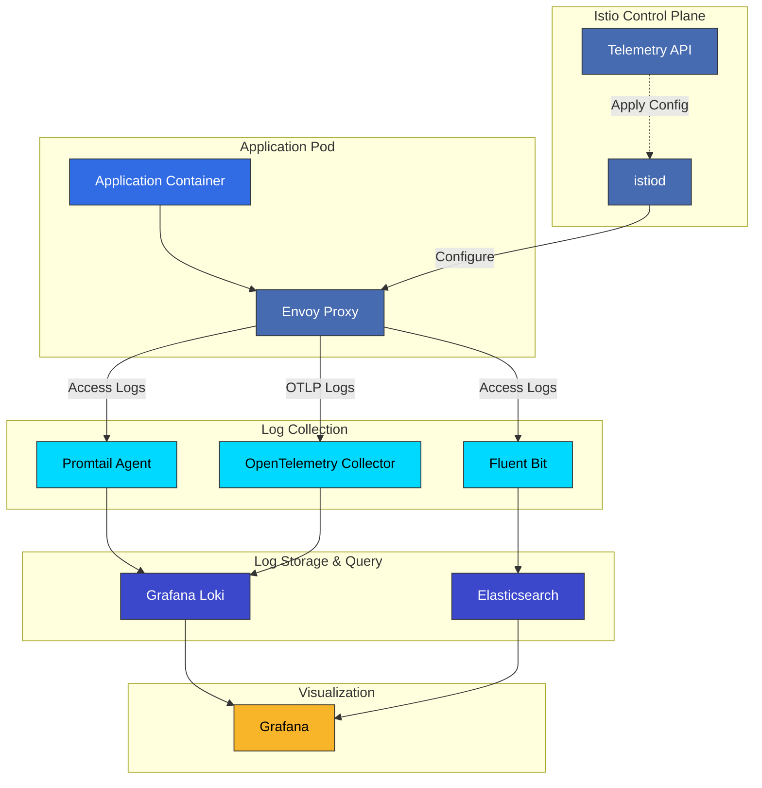

# Istio Logging

> **Supported Versions**: Istio 1.28
> **Last Updated**: February 19, 2026

Istio's logging capabilities allow you to record and analyze all activities in the service mesh. Use Access Logs, Envoy logs, and structured logs for traffic analysis, debugging, and security auditing.

## Table of Contents

1. [Logging Overview](#logging-overview)
2. [Access Log Configuration](#access-log-configuration)
3. [Log Customization with Telemetry API](#log-customization-with-telemetry-api)
4. [Log Filtering and Sampling](#log-filtering-and-sampling)
5. [Envoy Log Level Adjustment](#envoy-log-level-adjustment)
6. [Promtail + Loki Integration](#promtail--loki-integration)
7. [Grafana Log Dashboard](#grafana-log-dashboard)
8. [Log Integration with Metrics/Traces](#log-integration-with-metricstraces)
9. [Performance Optimization](#performance-optimization)
10. [Troubleshooting](#troubleshooting)

## Logging Overview

### Istio Log Layers



### Log Types

1. **Access Log**: Records all HTTP/TCP requests/responses
2. **Envoy Proxy Log**: Internal Envoy operation logs
3. **Istiod Log**: Control plane logs
4. **Application Log**: Application's own logs

## Access Log Configuration

### 1. Enable Global Access Log with MeshConfig

#### Basic Text Format

```yaml
apiVersion: v1
kind: ConfigMap
metadata:
  name: istio
  namespace: istio-system
data:
  mesh: |
    accessLogFile: /dev/stdout
    accessLogFormat: |
      [%START_TIME%] "%REQ(:METHOD)% %REQ(X-ENVOY-ORIGINAL-PATH?:PATH)% %PROTOCOL%"
      %RESPONSE_CODE% %RESPONSE_FLAGS% %BYTES_RECEIVED% %BYTES_SENT% %DURATION%
      "%REQ(X-FORWARDED-FOR)%" "%REQ(USER-AGENT)%" "%REQ(X-REQUEST-ID)%"
      "%REQ(:AUTHORITY)%" "%UPSTREAM_HOST%"
```

**Apply**:
```bash
kubectl rollout restart deployment -n istio-system istiod

# Or restart existing pods
kubectl rollout restart deployment -n <namespace> <deployment-name>
```

#### JSON Format (Structured Logs)

```yaml
apiVersion: v1
kind: ConfigMap
metadata:
  name: istio
  namespace: istio-system
data:
  mesh: |
    accessLogFile: /dev/stdout
    accessLogEncoding: JSON
    accessLogFormat: |
      {
        "start_time": "%START_TIME%",
        "method": "%REQ(:METHOD)%",
        "path": "%REQ(X-ENVOY-ORIGINAL-PATH?:PATH)%",
        "protocol": "%PROTOCOL%",
        "response_code": "%RESPONSE_CODE%",
        "response_flags": "%RESPONSE_FLAGS%",
        "bytes_received": "%BYTES_RECEIVED%",
        "bytes_sent": "%BYTES_SENT%",
        "duration": "%DURATION%",
        "upstream_service_time": "%RESP(X-ENVOY-UPSTREAM-SERVICE-TIME)%",
        "x_forwarded_for": "%REQ(X-FORWARDED-FOR)%",
        "user_agent": "%REQ(USER-AGENT)%",
        "request_id": "%REQ(X-REQUEST-ID)%",
        "authority": "%REQ(:AUTHORITY)%",
        "upstream_host": "%UPSTREAM_HOST%",
        "upstream_cluster": "%UPSTREAM_CLUSTER%",
        "upstream_local_address": "%UPSTREAM_LOCAL_ADDRESS%",
        "downstream_local_address": "%DOWNSTREAM_LOCAL_ADDRESS%",
        "downstream_remote_address": "%DOWNSTREAM_REMOTE_ADDRESS%",
        "requested_server_name": "%REQUESTED_SERVER_NAME%",
        "route_name": "%ROUTE_NAME%"
      }
```

### 2. Fine-grained Control with Telemetry API

The Telemetry API allows you to control logs per namespace or workload.

#### Enable JSON Access Log for Entire Mesh

```yaml
apiVersion: telemetry.istio.io/v1alpha1
kind: Telemetry
metadata:
  name: mesh-logging
  namespace: istio-system
spec:
  accessLogging:
  - providers:
    - name: envoy
    # JSON format with all fields
    filter:
      expression: "true"  # Log all requests
```

#### Per-Namespace Log Configuration

```yaml
apiVersion: telemetry.istio.io/v1alpha1
kind: Telemetry
metadata:
  name: production-logging
  namespace: production
spec:
  accessLogging:
  - providers:
    - name: envoy
    # Log only errors and slow requests
    filter:
      expression: |
        response.code >= 400 ||
        duration > 1000
```

#### Per-Workload Detailed Logging

```yaml
apiVersion: telemetry.istio.io/v1alpha1
kind: Telemetry
metadata:
  name: payment-service-logging
  namespace: production
spec:
  selector:
    matchLabels:
      app: payment-service
  accessLogging:
  - providers:
    - name: envoy
    # Log all requests + additional custom fields
    filter:
      expression: "true"
```

## Log Customization with Telemetry API

### Custom Log Provider

#### 1. Send Logs via OpenTelemetry

```yaml
apiVersion: v1
kind: ConfigMap
metadata:
  name: istio
  namespace: istio-system
data:
  mesh: |
    extensionProviders:
    - name: otel-logging
      envoyOtelAls:
        service: opentelemetry-collector.observability.svc.cluster.local
        port: 4317
        logFormat:
          labels:
            start_time: "%START_TIME%"
            method: "%REQ(:METHOD)%"
            path: "%REQ(X-ENVOY-ORIGINAL-PATH?:PATH)%"
            protocol: "%PROTOCOL%"
            response_code: "%RESPONSE_CODE%"
            response_flags: "%RESPONSE_FLAGS%"
            duration: "%DURATION%"
            upstream_host: "%UPSTREAM_HOST%"
            user_agent: "%REQ(USER-AGENT)%"
            request_id: "%REQ(X-REQUEST-ID)%"
---
apiVersion: telemetry.istio.io/v1alpha1
kind: Telemetry
metadata:
  name: otel-access-logging
  namespace: istio-system
spec:
  accessLogging:
  - providers:
    - name: otel-logging
```

#### 2. Save Logs to File (Sidecar Volume Sharing)

```yaml
apiVersion: telemetry.istio.io/v1alpha1
kind: Telemetry
metadata:
  name: file-logging
  namespace: production
spec:
  accessLogging:
  - providers:
    - name: envoy-file-logger
---
apiVersion: v1
kind: ConfigMap
metadata:
  name: istio
  namespace: istio-system
data:
  mesh: |
    extensionProviders:
    - name: envoy-file-logger
      envoyFileAccessLog:
        path: /var/log/istio/access.log
        logFormat:
          labels:
            timestamp: "%START_TIME%"
            method: "%REQ(:METHOD)%"
            path: "%REQ(:PATH)%"
            status: "%RESPONSE_CODE%"
```

### Log Format Customization

#### Dynamic Fields Using CEL Expressions

```yaml
apiVersion: telemetry.istio.io/v1alpha1
kind: Telemetry
metadata:
  name: custom-log-format
  namespace: production
spec:
  accessLogging:
  - providers:
    - name: envoy
    filter:
      expression: "true"
```

**Available Variables**:

| Variable | Description | Example |
|----------|-------------|---------|
| `request.method` | HTTP method | GET, POST |
| `request.path` | Request path | /api/v1/users |
| `request.url_path` | URL path (excluding query) | /api/v1/users |
| `request.headers` | Request headers | `request.headers['user-agent']` |
| `response.code` | HTTP status code | 200, 404, 500 |
| `response.headers` | Response headers | `response.headers['content-type']` |
| `response.flags` | Envoy response flags | UH, UF, URX |
| `duration` | Request duration (ms) | 123 |
| `connection.mtls` | mTLS usage | true, false |
| `source.principal` | Source service account | spiffe://... |
| `destination.principal` | Destination service account | spiffe://... |

## Log Filtering and Sampling

### 1. Conditional Logging

#### Log Only Errors and Slow Requests

```yaml
apiVersion: telemetry.istio.io/v1alpha1
kind: Telemetry
metadata:
  name: error-slow-logging
  namespace: production
spec:
  accessLogging:
  - providers:
    - name: envoy
    filter:
      expression: |
        response.code >= 400 ||
        response.code == 0 ||
        duration > 1000
```

#### Exclude Specific Paths

```yaml
apiVersion: telemetry.istio.io/v1alpha1
kind: Telemetry
metadata:
  name: filter-health-checks
  namespace: production
spec:
  accessLogging:
  - providers:
    - name: envoy
    filter:
      expression: |
        !(request.url_path.startsWith('/health') ||
          request.url_path.startsWith('/ready') ||
          request.url_path.startsWith('/live') ||
          request.url_path == '/metrics')
```

#### HTTP Method Filtering

```yaml
apiVersion: telemetry.istio.io/v1alpha1
kind: Telemetry
metadata:
  name: critical-methods-only
  namespace: production
spec:
  accessLogging:
  - providers:
    - name: envoy
    filter:
      expression: |
        request.method in ['POST', 'PUT', 'DELETE', 'PATCH']
```

#### Log Only Non-mTLS Traffic (Security Audit)

```yaml
apiVersion: telemetry.istio.io/v1alpha1
kind: Telemetry
metadata:
  name: non-mtls-logging
  namespace: production
spec:
  accessLogging:
  - providers:
    - name: envoy
    filter:
      expression: |
        !connection.mtls
```

### 2. Sampling

#### Probabilistic Sampling (10% Logging)

```yaml
apiVersion: telemetry.istio.io/v1alpha1
kind: Telemetry
metadata:
  name: sampled-logging
  namespace: production
spec:
  accessLogging:
  - providers:
    - name: envoy
    filter:
      expression: |
        random() < 0.1  # 10% sampling
```

#### Conditional + Sampling (100% for Errors, 1% for Normal)

```yaml
apiVersion: telemetry.istio.io/v1alpha1
kind: Telemetry
metadata:
  name: smart-sampling
  namespace: production
spec:
  accessLogging:
  - providers:
    - name: envoy
    filter:
      expression: |
        response.code >= 400 ||
        duration > 2000 ||
        random() < 0.01
```

### 3. Differentiated Logging by Namespace

```yaml
# Production: Log only errors
apiVersion: telemetry.istio.io/v1alpha1
kind: Telemetry
metadata:
  name: production-logging
  namespace: production
spec:
  accessLogging:
  - providers:
    - name: envoy
    filter:
      expression: "response.code >= 400"
---
# Staging: Log all requests
apiVersion: telemetry.istio.io/v1alpha1
kind: Telemetry
metadata:
  name: staging-logging
  namespace: staging
spec:
  accessLogging:
  - providers:
    - name: envoy
    filter:
      expression: "true"
---
# Development: Disable logging
apiVersion: telemetry.istio.io/v1alpha1
kind: Telemetry
metadata:
  name: dev-logging
  namespace: development
spec:
  accessLogging:
  - disabled: true
```

## Envoy Log Level Adjustment

### Dynamically Change Log Level

#### Overall Envoy Log Level

```bash
# Change to Debug level
istioctl proxy-config log <pod-name> -n <namespace> --level debug

# Restore to Info level
istioctl proxy-config log <pod-name> -n <namespace> --level info

# Change to Warning level
istioctl proxy-config log <pod-name> -n <namespace> --level warning
```

#### Per-Component Log Level

```bash
# Debug HTTP connections only
istioctl proxy-config log <pod-name> -n <namespace> --level http:debug

# Debug Router and Connection components only
istioctl proxy-config log <pod-name> -n <namespace> --level router:debug,connection:debug

# Multiple component combinations
istioctl proxy-config log <pod-name> -n <namespace> \
  --level http:debug,router:info,upstream:debug,connection:trace
```

### Key Envoy Log Components

| Component | Description | Use Case |
|-----------|-------------|----------|
| `admin` | Admin interface | Admin API debugging |
| `aws` | AWS integration | AWS service issues |
| `connection` | TCP connections | Connection problem debugging |
| `filter` | HTTP filters | Filter chain analysis |
| `forward_proxy` | Forward proxy | Proxy behavior tracking |
| `grpc` | gRPC | gRPC communication issues |
| `hc` | Health check | Health check failures |
| `http` | HTTP | HTTP request/response tracking |
| `http2` | HTTP/2 | HTTP/2 protocol issues |
| `jwt` | JWT authentication | JWT token verification |
| `lua` | Lua scripts | Lua filter debugging |
| `main` | Main logic | General Envoy operation |
| `router` | Routing | Routing decision tracking |
| `runtime` | Runtime configuration | Dynamic configuration changes |
| `upstream` | Upstream clusters | Backend connection issues |
| `client` | HTTP client | Outbound requests |
| `pool` | Connection pool | Connection pool management |
| `rbac` | RBAC filter | Permission issue debugging |

### Persistent Log Level Configuration

```yaml
apiVersion: install.istio.io/v1alpha1
kind: IstioOperator
spec:
  meshConfig:
    defaultConfig:
      proxyLogLevel: "info"  # Default level
      componentLogLevel: "http:debug,router:info,upstream:debug"
```

### Apply Debug Logs to Specific Workload Only

```yaml
apiVersion: v1
kind: Pod
metadata:
  name: my-app
  annotations:
    sidecar.istio.io/componentLogLevel: "http:debug,router:debug"
    sidecar.istio.io/logLevel: "debug"
spec:
  containers:
  - name: app
    image: my-app:latest
```

## Promtail + Loki Integration

### 1. Install Grafana Loki

#### Loki Deployment (Simple Scalable Mode)

```yaml
apiVersion: v1
kind: ConfigMap
metadata:
  name: loki-config
  namespace: observability
data:
  loki.yaml: |
    auth_enabled: false

    server:
      http_listen_port: 3100
      grpc_listen_port: 9096

    common:
      path_prefix: /loki
      storage:
        filesystem:
          chunks_directory: /loki/chunks
          rules_directory: /loki/rules
      replication_factor: 1
      ring:
        kvstore:
          store: inmemory

    schema_config:
      configs:
      - from: 2024-01-01
        store: tsdb
        object_store: filesystem
        schema: v13
        index:
          prefix: index_
          period: 24h

    limits_config:
      retention_period: 168h  # 7 days
      ingestion_rate_mb: 16
      ingestion_burst_size_mb: 32
      max_query_length: 721h
      max_query_lookback: 721h
      max_streams_per_user: 10000
      max_global_streams_per_user: 0
      reject_old_samples: true
      reject_old_samples_max_age: 168h

    compactor:
      working_directory: /loki/compactor
      compaction_interval: 10m
      retention_enabled: true
      retention_delete_delay: 2h
      retention_delete_worker_count: 150

    querier:
      max_concurrent: 4
---
apiVersion: apps/v1
kind: StatefulSet
metadata:
  name: loki
  namespace: observability
spec:
  serviceName: loki
  replicas: 1
  selector:
    matchLabels:
      app: loki
  template:
    metadata:
      labels:
        app: loki
    spec:
      containers:
      - name: loki
        image: grafana/loki:2.9.4
        args:
        - -config.file=/etc/loki/loki.yaml
        ports:
        - containerPort: 3100
          name: http
        - containerPort: 9096
          name: grpc
        volumeMounts:
        - name: config
          mountPath: /etc/loki
        - name: storage
          mountPath: /loki
        resources:
          requests:
            cpu: 500m
            memory: 1Gi
          limits:
            cpu: 2000m
            memory: 4Gi
      volumes:
      - name: config
        configMap:
          name: loki-config
  volumeClaimTemplates:
  - metadata:
      name: storage
    spec:
      accessModes:
      - ReadWriteOnce
      resources:
        requests:
          storage: 100Gi
      storageClassName: gp3
---
apiVersion: v1
kind: Service
metadata:
  name: loki
  namespace: observability
spec:
  selector:
    app: loki
  ports:
  - name: http
    port: 3100
    targetPort: 3100
  - name: grpc
    port: 9096
    targetPort: 9096
  type: ClusterIP
```

### 2. Install Promtail (Istio Access Log Collection)

```yaml
apiVersion: v1
kind: ConfigMap
metadata:
  name: promtail-config
  namespace: observability
data:
  promtail.yaml: |
    server:
      http_listen_port: 3101

    clients:
    - url: http://loki:3100/loki/api/v1/push
      backoff_config:
        min_period: 1s
        max_period: 5m
        max_retries: 10

    positions:
      filename: /tmp/positions.yaml

    scrape_configs:
    # Istio Envoy Access Logs
    - job_name: istio-accesslog
      pipeline_stages:
      # JSON parsing
      - json:
          expressions:
            start_time: start_time
            method: method
            path: path
            protocol: protocol
            response_code: response_code
            response_flags: response_flags
            duration: duration
            bytes_received: bytes_received
            bytes_sent: bytes_sent
            upstream_host: upstream_host
            user_agent: user_agent
            request_id: request_id

      # Timestamp parsing
      - timestamp:
          source: start_time
          format: "2006-01-02T15:04:05.000Z"

      # Add labels
      - labels:
          method:
          path:
          response_code:
          response_flags:

      # Convert duration to number
      - metrics:
          request_duration_ms:
            type: Histogram
            description: "HTTP request duration"
            source: duration
            config:
              buckets: [10, 50, 100, 500, 1000, 5000]

      kubernetes_sd_configs:
      - role: pod

      relabel_configs:
      # Select only Istio proxy containers
      - source_labels: [__meta_kubernetes_pod_container_name]
        action: keep
        regex: istio-proxy

      # Namespace label
      - source_labels: [__meta_kubernetes_namespace]
        target_label: namespace

      # Pod name label
      - source_labels: [__meta_kubernetes_pod_name]
        target_label: pod

      # Service label
      - source_labels: [__meta_kubernetes_pod_label_app]
        target_label: app

      # Version label
      - source_labels: [__meta_kubernetes_pod_label_version]
        target_label: version

    # Istio Pilot/Istiod Logs
    - job_name: istio-control-plane
      kubernetes_sd_configs:
      - role: pod
        namespaces:
          names:
          - istio-system

      relabel_configs:
      - source_labels: [__meta_kubernetes_pod_label_app]
        action: keep
        regex: istiod

      - source_labels: [__meta_kubernetes_namespace]
        target_label: namespace

      - source_labels: [__meta_kubernetes_pod_name]
        target_label: pod

      - source_labels: [__meta_kubernetes_pod_container_name]
        target_label: container

    # Application Logs
    - job_name: kubernetes-pods
      pipeline_stages:
      # Try parsing JSON logs
      - json:
          expressions:
            level: level
            timestamp: timestamp
            logger: logger
            message: message

      - labels:
          level:
          logger:

      kubernetes_sd_configs:
      - role: pod

      relabel_configs:
      # Exclude Istio proxy
      - source_labels: [__meta_kubernetes_pod_container_name]
        action: drop
        regex: istio-proxy

      # Exclude Istio init
      - source_labels: [__meta_kubernetes_pod_container_name]
        action: drop
        regex: istio-init

      - source_labels: [__meta_kubernetes_namespace]
        target_label: namespace

      - source_labels: [__meta_kubernetes_pod_name]
        target_label: pod

      - source_labels: [__meta_kubernetes_pod_container_name]
        target_label: container
---
apiVersion: apps/v1
kind: DaemonSet
metadata:
  name: promtail
  namespace: observability
spec:
  selector:
    matchLabels:
      app: promtail
  template:
    metadata:
      labels:
        app: promtail
    spec:
      serviceAccountName: promtail
      containers:
      - name: promtail
        image: grafana/promtail:2.9.4
        args:
        - -config.file=/etc/promtail/promtail.yaml
        volumeMounts:
        - name: config
          mountPath: /etc/promtail
        - name: varlog
          mountPath: /var/log
        - name: varlibdockercontainers
          mountPath: /var/lib/docker/containers
          readOnly: true
        ports:
        - containerPort: 3101
          name: http-metrics
        resources:
          requests:
            cpu: 100m
            memory: 128Mi
          limits:
            cpu: 500m
            memory: 512Mi
      volumes:
      - name: config
        configMap:
          name: promtail-config
      - name: varlog
        hostPath:
          path: /var/log
      - name: varlibdockercontainers
        hostPath:
          path: /var/lib/docker/containers
---
apiVersion: v1
kind: ServiceAccount
metadata:
  name: promtail
  namespace: observability
---
apiVersion: rbac.authorization.k8s.io/v1
kind: ClusterRole
metadata:
  name: promtail
rules:
- apiGroups: [""]
  resources:
  - nodes
  - nodes/proxy
  - services
  - endpoints
  - pods
  verbs: ["get", "watch", "list"]
---
apiVersion: rbac.authorization.k8s.io/v1
kind: ClusterRoleBinding
metadata:
  name: promtail
roleRef:
  apiGroup: rbac.authorization.k8s.io
  kind: ClusterRole
  name: promtail
subjects:
- kind: ServiceAccount
  name: promtail
  namespace: observability
```

### 3. LogQL Query Examples

#### Basic Queries

```logql
# All logs from a specific namespace
{namespace="production"}

# Logs from a specific app
{app="payment-service"}

# Only Istio access logs
{container="istio-proxy"}

# Only error logs
{namespace="production"} |= "error" or "ERROR"

# Only 5xx responses
{namespace="production"} | json | response_code >= "500"
```

#### Advanced Filtering

```logql
# Only HTTP POST requests
{container="istio-proxy"}
| json
| method="POST"

# Slow requests (> 1 second)
{container="istio-proxy"}
| json
| duration > 1000

# Detect circuit breaker activation
{container="istio-proxy"}
| json
| response_flags =~ ".*UO.*|.*URX.*"

# Traffic not using mTLS
{container="istio-proxy"}
| json
| connection_security_policy="none"

# Specific path pattern
{container="istio-proxy"}
| json
| path =~ "/api/v1/.*"
```

#### Aggregation and Statistics

```logql
# Request rate by service (RPS)
sum(rate({container="istio-proxy"} | json [1m])) by (app)

# Response code distribution
sum(count_over_time({container="istio-proxy"} | json [5m])) by (response_code)

# P95 latency
quantile_over_time(0.95, {container="istio-proxy"} | json | unwrap duration [5m])

# Error rate
sum(rate({container="istio-proxy"} | json | response_code >= "500" [5m]))
/
sum(rate({container="istio-proxy"} | json [5m]))

# Average response time
avg_over_time({container="istio-proxy"} | json | unwrap duration [5m])
```

## Grafana Log Dashboard

### 1. Add Loki Datasource

```yaml
apiVersion: v1
kind: ConfigMap
metadata:
  name: grafana-datasources
  namespace: observability
data:
  loki.yaml: |
    apiVersion: 1
    datasources:
    - name: Loki
      type: loki
      access: proxy
      url: http://loki:3100
      jsonData:
        maxLines: 1000
        derivedFields:
        # Extract Trace ID
        - datasourceUid: tempo
          matcherRegex: "request_id\":\"([^\"]+)"
          name: TraceID
          url: '$${__value.raw}'
        # Metric integration
        - datasourceUid: prometheus
          matcherRegex: "app\":\"([^\"]+)"
          name: Metrics
          url: '/d/istio-service?var-service=$${__value.raw}'
```

### 2. Istio Access Log Dashboard

#### Dashboard JSON

```json
{
  "dashboard": {
    "title": "Istio Access Logs",
    "tags": ["istio", "logs"],
    "timezone": "browser",
    "panels": [
      {
        "title": "Request Rate by Service",
        "type": "timeseries",
        "targets": [
          {
            "expr": "sum(rate({container=\"istio-proxy\"} | json [1m])) by (app)",
            "refId": "A"
          }
        ],
        "gridPos": {"h": 8, "w": 12, "x": 0, "y": 0}
      },
      {
        "title": "Response Code Distribution",
        "type": "piechart",
        "targets": [
          {
            "expr": "sum(count_over_time({container=\"istio-proxy\"} | json [5m])) by (response_code)",
            "refId": "A"
          }
        ],
        "gridPos": {"h": 8, "w": 12, "x": 12, "y": 0}
      },
      {
        "title": "P50/P95/P99 Latency",
        "type": "timeseries",
        "targets": [
          {
            "expr": "quantile_over_time(0.50, {container=\"istio-proxy\", app=\"$service\"} | json | unwrap duration [1m])",
            "legendFormat": "P50",
            "refId": "A"
          },
          {
            "expr": "quantile_over_time(0.95, {container=\"istio-proxy\", app=\"$service\"} | json | unwrap duration [1m])",
            "legendFormat": "P95",
            "refId": "B"
          },
          {
            "expr": "quantile_over_time(0.99, {container=\"istio-proxy\", app=\"$service\"} | json | unwrap duration [1m])",
            "legendFormat": "P99",
            "refId": "C"
          }
        ],
        "gridPos": {"h": 8, "w": 24, "x": 0, "y": 8}
      },
      {
        "title": "Error Rate",
        "type": "stat",
        "targets": [
          {
            "expr": "sum(rate({container=\"istio-proxy\"} | json | response_code >= \"500\" [5m])) / sum(rate({container=\"istio-proxy\"} | json [5m]))",
            "refId": "A"
          }
        ],
        "gridPos": {"h": 4, "w": 6, "x": 0, "y": 16}
      },
      {
        "title": "Top 10 Slowest Requests",
        "type": "table",
        "targets": [
          {
            "expr": "topk(10, avg_over_time({container=\"istio-proxy\", app=\"$service\"} | json | unwrap duration [5m])) by (path, method)",
            "refId": "A"
          }
        ],
        "gridPos": {"h": 8, "w": 12, "x": 0, "y": 20}
      },
      {
        "title": "Error Logs",
        "type": "logs",
        "targets": [
          {
            "expr": "{container=\"istio-proxy\", app=\"$service\"} | json | response_code >= \"400\"",
            "refId": "A"
          }
        ],
        "gridPos": {"h": 8, "w": 12, "x": 12, "y": 20}
      },
      {
        "title": "Circuit Breaker Events",
        "type": "logs",
        "targets": [
          {
            "expr": "{container=\"istio-proxy\"} | json | response_flags =~ \".*UO.*|.*URX.*\"",
            "refId": "A"
          }
        ],
        "gridPos": {"h": 8, "w": 24, "x": 0, "y": 28}
      },
      {
        "title": "Request Duration Heatmap",
        "type": "heatmap",
        "targets": [
          {
            "expr": "sum(rate({container=\"istio-proxy\", app=\"$service\"} | json | unwrap duration [1m])) by (le)",
            "format": "heatmap",
            "refId": "A"
          }
        ],
        "gridPos": {"h": 8, "w": 24, "x": 0, "y": 36}
      }
    ],
    "templating": {
      "list": [
        {
          "name": "namespace",
          "type": "query",
          "query": "label_values({container=\"istio-proxy\"}, namespace)",
          "datasource": "Loki"
        },
        {
          "name": "service",
          "type": "query",
          "query": "label_values({container=\"istio-proxy\", namespace=\"$namespace\"}, app)",
          "datasource": "Loki"
        }
      ]
    }
  }
}
```

### 3. Grafana Alert Configuration

```yaml
apiVersion: v1
kind: ConfigMap
metadata:
  name: grafana-alerting
  namespace: observability
data:
  alerting.yaml: |
    groups:
    - name: istio-logging-alerts
      interval: 1m
      rules:
      # High error rate
      - alert: HighErrorRate
        expr: |
          sum(rate({container="istio-proxy"} | json | response_code >= "500" [5m]))
          /
          sum(rate({container="istio-proxy"} | json [5m]))
          > 0.05
        for: 2m
        labels:
          severity: critical
        annotations:
          summary: "High error rate detected"
          description: "Error rate is {{ $value | humanizePercentage }}"

      # Circuit Breaker triggered
      - alert: CircuitBreakerTriggered
        expr: |
          count_over_time({container="istio-proxy"}
            | json
            | response_flags =~ ".*UO.*|.*URX.*" [1m])
          > 10
        for: 1m
        labels:
          severity: warning
        annotations:
          summary: "Circuit breaker triggered"
          description: "Circuit breaker has been triggered {{ $value }} times"

      # Slow requests
      - alert: SlowRequests
        expr: |
          quantile_over_time(0.95,
            {container="istio-proxy"}
            | json
            | unwrap duration [5m])
          > 2000
        for: 5m
        labels:
          severity: warning
        annotations:
          summary: "P95 latency too high"
          description: "P95 latency is {{ $value }}ms"

      # Non-mTLS traffic
      - alert: NonMTLSTraffic
        expr: |
          count_over_time({container="istio-proxy"}
            | json
            | connection_security_policy="none" [5m])
          > 0
        for: 1m
        labels:
          severity: warning
        annotations:
          summary: "Non-mTLS traffic detected"
          description: "{{ $value }} requests without mTLS in the last 5 minutes"
```

## Log Integration with Metrics/Traces

### 1. Jump from Logs to Traces

In Grafana, you can jump directly from Loki logs to view traces for specific requests.

```yaml
# Loki datasource configuration
apiVersion: v1
kind: ConfigMap
metadata:
  name: grafana-datasources
  namespace: observability
data:
  loki.yaml: |
    apiVersion: 1
    datasources:
    - name: Loki
      type: loki
      jsonData:
        derivedFields:
        - datasourceUid: tempo
          matcherRegex: '"request_id":"([^"]+)"'
          name: TraceID
          url: '$${__value.raw}'
          urlDisplayLabel: 'View Trace'
```

**How to use**:
1. View Loki logs in Grafana Explore
2. Click the "View Trace" link in a log entry
3. Automatically navigate to Tempo to view the corresponding trace

### 2. Drill Down from Metrics to Logs

```yaml
# Prometheus datasource configuration
apiVersion: v1
kind: ConfigMap
metadata:
  name: grafana-datasources
  namespace: observability
data:
  prometheus.yaml: |
    apiVersion: 1
    datasources:
    - name: Prometheus
      type: prometheus
      jsonData:
        exemplarTraceIdDestinations:
        - datasourceUid: tempo
          name: TraceID
```

### 3. Integrated Dashboard Example

```json
{
  "panels": [
    {
      "title": "Request Rate (Metric)",
      "type": "timeseries",
      "datasource": "Prometheus",
      "targets": [
        {
          "expr": "rate(istio_requests_total{app=\"$service\"}[1m])"
        }
      ],
      "links": [
        {
          "title": "View Logs",
          "url": "/explore?left={\"datasource\":\"Loki\",\"queries\":[{\"expr\":\"{app=\\\"${service}\\\"}\"}]}"
        }
      ]
    },
    {
      "title": "Recent Logs",
      "type": "logs",
      "datasource": "Loki",
      "targets": [
        {
          "expr": "{container=\"istio-proxy\", app=\"$service\"} | json"
        }
      ]
    }
  ]
}
```

## Performance Optimization

### 1. Reduce Log Volume

#### 50-90% Reduction with Conditional Logging

```yaml
apiVersion: telemetry.istio.io/v1alpha1
kind: Telemetry
metadata:
  name: optimized-logging
  namespace: production
spec:
  accessLogging:
  - providers:
    - name: envoy
    filter:
      expression: |
        response.code >= 400 ||
        duration > 1000 ||
        random() < 0.01  # Sample only 1% of normal requests
```

#### 30-50% Reduction by Excluding Health Checks

```yaml
filter:
  expression: |
    !(request.url_path.startsWith('/health') ||
      request.url_path.startsWith('/ready') ||
      request.url_path.startsWith('/live') ||
      request.url_path == '/metrics' ||
      request.url_path == '/favicon.ico')
```

### 2. Loki Performance Tuning

```yaml
limits_config:
  # Chunk size optimization
  ingestion_rate_strategy: global
  ingestion_rate_mb: 32  # Default: 4
  ingestion_burst_size_mb: 64  # Default: 6

  # Query performance
  max_query_parallelism: 32
  max_query_series: 10000
  max_query_lookback: 720h

  # Stream limits
  max_streams_per_user: 10000
  max_global_streams_per_user: 0

  # Label cardinality limits
  max_label_names_per_series: 30
  max_label_value_length: 2048
```

### 3. Promtail Optimization

```yaml
# Batching configuration
clients:
- url: http://loki:3100/loki/api/v1/push
  batchwait: 1s
  batchsize: 1048576  # 1MB

  # Retry configuration
  backoff_config:
    min_period: 500ms
    max_period: 5m
    max_retries: 10

  # Timeout
  timeout: 10s
```

## Troubleshooting

### Access Logs Not Visible

```bash
# 1. Check MeshConfig
kubectl get configmap istio -n istio-system -o yaml | grep -A 5 accessLog

# 2. Check Telemetry resources
kubectl get telemetry -A

# 3. Verify log generation in Envoy
kubectl logs -n <namespace> <pod-name> -c istio-proxy | head -20

# 4. Check Envoy configuration
istioctl proxy-config bootstrap <pod-name> -n <namespace> -o json | \
  jq '.bootstrap.staticResources.listeners[].accessLog'
```

### JSON Parsing Failure

```bash
# 1. Check log format
kubectl logs -n <namespace> <pod-name> -c istio-proxy | head -1

# 2. Check accessLogEncoding
kubectl get configmap istio -n istio-system -o yaml | grep accessLogEncoding

# 3. Manually test JSON parsing
kubectl logs -n <namespace> <pod-name> -c istio-proxy | head -1 | jq .
```

### Promtail Not Collecting Logs

```bash
# 1. Check Promtail logs
kubectl logs -n observability daemonset/promtail

# 2. Check Promtail metrics
kubectl port-forward -n observability daemonset/promtail 3101:3101
curl http://localhost:3101/metrics | grep promtail_

# 3. Verify data is reaching Loki
kubectl port-forward -n observability svc/loki 3100:3100
curl -G -s "http://localhost:3100/loki/api/v1/query" --data-urlencode 'query={job="istio-accesslog"}' | jq .
```

### Log Volume Too Large

```bash
# 1. Check log volume by namespace
kubectl top pods -n <namespace> --containers | grep istio-proxy

# 2. Check number of log streams
curl -G -s "http://localhost:3100/loki/api/v1/labels" | jq '.data | length'

# 3. Find services generating the most logs
# LogQL:
topk(10, sum(count_over_time({container="istio-proxy"} [1h])) by (app))
```

## References

- [Istio Access Logging](https://istio.io/latest/docs/tasks/observability/logs/access-log/)
- [Telemetry API](https://istio.io/latest/docs/reference/config/telemetry/)
- [Envoy Access Logging](https://www.envoyproxy.io/docs/envoy/latest/configuration/observability/access_log/usage)
- [Grafana Loki Documentation](https://grafana.com/docs/loki/latest/)
- [Promtail Configuration](https://grafana.com/docs/loki/latest/send-data/promtail/)
- [LogQL Query Language](https://grafana.com/docs/loki/latest/query/)
- [CEL Expression Language](https://github.com/google/cel-spec)
