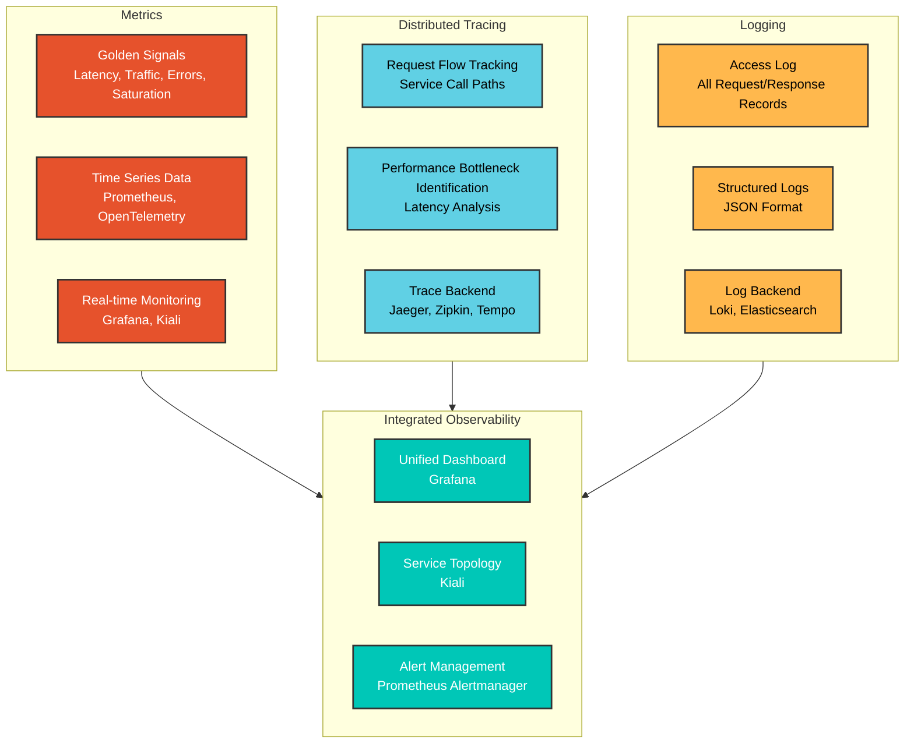
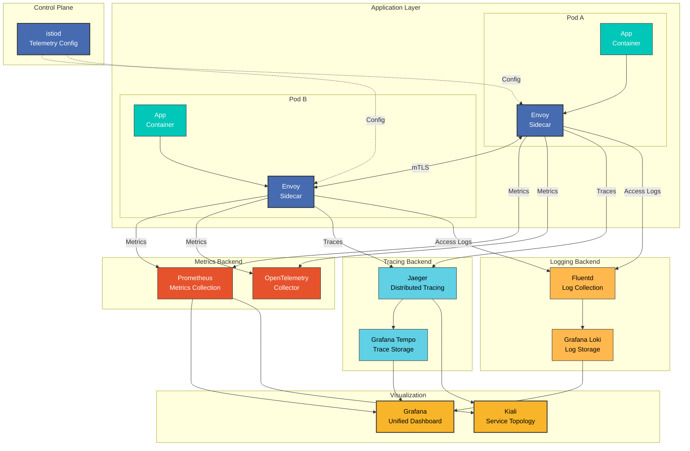

# Observability

> **Supported Versions**: Istio 1.28
> **Last Updated**: February 19, 2026

Istio provides comprehensive observability within the service mesh. It automatically collects metrics, logs, and traces for all service-to-service communication without requiring any changes to application code.

## Table of Contents

1. [Observability Overview](#observability-overview)
2. [Three Pillars of Observability](#three-pillars-of-observability)
3. [Observability Architecture](#observability-architecture)
4. [Golden Signals](#golden-signals)
5. [Detailed Documentation](#detailed-documentation)
6. [Observability Best Practices](#observability-best-practices)
7. [Next Steps](#next-steps)

## Observability Overview

<p align="center">
  
</p>

Istio's observability features follow the **Zero Instrumentation** principle:
- No application code changes required
- Automatic metric collection and transmission
- Automatic distributed trace generation
- Standardized log formats

## Three Pillars of Observability

### The Three Elements of Observability



### 1. Metrics

**What is measured?**
- Request count, response time, error rate
- Resource utilization (CPU, memory)
- Network traffic (Bytes, Packets)

**When to use?**
- System health monitoring
- SLO/SLI tracking
- Capacity planning

**Key Tools**: Prometheus, Grafana, VictoriaMetrics

### 2. Distributed Tracing

**What is tracked?**
- Complete path of a single request
- Processing time for each service
- Service dependencies

**When to use?**
- Performance bottleneck identification
- Root cause analysis of failures
- Microservices debugging

**Key Tools**: Jaeger, Zipkin, Grafana Tempo

### 3. Logging

**What is recorded?**
- All HTTP requests/responses
- Errors and exceptions
- Security events

**When to use?**
- Detailed debugging
- Security audits
- Compliance requirements

**Key Tools**: Grafana Loki, Elasticsearch, Fluentd

## Observability Architecture

### Overall Architecture



### Data Flow

**1. Metrics Collection Flow**:
```
App → Envoy (metric generation)
    → Prometheus (Scrape /stats/prometheus)
    → Grafana (visualization)
```

**2. Distributed Tracing Flow**:
```
App → Envoy (Span generation)
    → Jaeger/Zipkin (trace collection)
    → Tempo (long-term storage)
    → Grafana (trace visualization)
```

**3. Logging Flow**:
```
App → Envoy (Access Log generation)
    → Fluentd/Fluent Bit (log collection)
    → Loki (log storage)
    → Grafana (log query and visualization)
```

## Golden Signals

Core metrics following Google SRE principles:

### 1. Latency

```promql
# P50 latency
histogram_quantile(0.50,
  sum(rate(istio_request_duration_milliseconds_bucket[5m])) by (le)
)

# P95 latency
histogram_quantile(0.95,
  sum(rate(istio_request_duration_milliseconds_bucket[5m])) by (le)
)

# P99 latency
histogram_quantile(0.99,
  sum(rate(istio_request_duration_milliseconds_bucket[5m])) by (le)
)
```

### 2. Traffic

```promql
# Requests per second (RPS)
sum(rate(istio_requests_total[5m]))

# Traffic by service
sum(rate(istio_requests_total[5m])) by (destination_service)
```

### 3. Errors

```promql
# Error rate (%)
sum(rate(istio_requests_total{response_code=~"5.."}[5m]))
/
sum(rate(istio_requests_total[5m]))
* 100

# 4xx vs 5xx errors
sum(rate(istio_requests_total{response_code=~"4.."}[5m])) by (response_code)
sum(rate(istio_requests_total{response_code=~"5.."}[5m])) by (response_code)
```

### 4. Saturation

```promql
# CPU utilization
rate(container_cpu_usage_seconds_total{pod=~".*"}[5m])

# Memory utilization
container_memory_working_set_bytes{pod=~".*"}
/
container_spec_memory_limit_bytes{pod=~".*"}
* 100
```

## Observability Best Practices

### 1. Use Standard Metrics

**Recommended**:
- Prioritize using Istio standard metrics
- Add custom metrics only when necessary
- Minimize labels considering cardinality

**Avoid**:
- Excessive custom metrics
- High cardinality labels (user_id, request_id, etc.)

### 2. Trace Sampling

Set appropriate sampling rates for production environments:

```yaml
apiVersion: install.istio.io/v1alpha1
kind: IstioOperator
spec:
  meshConfig:
    defaultConfig:
      tracing:
        sampling: 1.0  # Dev: 100%, Prod: 1-10%
```

**Recommended Sampling Rates**:
- Development: 100%
- Staging: 10-50%
- Production: 1-10%

### 3. Access Log Optimization

Selectively record only necessary fields:

```yaml
apiVersion: telemetry.istio.io/v1alpha1
kind: Telemetry
metadata:
  name: mesh-default
  namespace: istio-system
spec:
  accessLogging:
  - providers:
    - name: envoy
    filter:
      expression: response.code >= 400  # Record only errors
```

### 4. Metrics Retention Policy

Set data retention periods:
- **Real-time metrics**: 1-7 days (high resolution)
- **Long-term metrics**: 30-90 days (downsampled)
- **Traces**: 7-30 days
- **Logs**: As per regulations (30-365 days)

### 5. Alert Configuration

**Critical Alerts** (immediate response):
- Error rate > 5%
- P99 latency > threshold
- Service down

**Warning Alerts** (monitoring):
- Error rate > 1%
- P95 latency increase
- Resource utilization > 80%

## Detailed Documentation

Detailed guides for each area of observability:

### 1. Metrics

Learn the following in the **[Metrics Guide](01-metrics.md)**:
- Istio standard metrics
- Prometheus integration
- OpenTelemetry integration
- Adding custom metrics
- Metrics optimization

**Key Topics**:
- `istio_requests_total`: Total request count
- `istio_request_duration_milliseconds`: Request latency
- `istio_request_bytes`: Request/response size
- Circuit Breaker metrics
- Telemetry API customization

### 2. Distributed Tracing

Learn the following in the **[Distributed Tracing Guide](02-tracing.md)**:
- Jaeger integration
- Zipkin integration
- Trace sampling
- Context propagation
- Performance analysis

**Key Topics**:
- Trace Context propagation (W3C Trace Context)
- Span creation and management
- Backend selection (Jaeger, Zipkin, Tempo)
- Sampling strategies
- Trace analysis

### 3. Logging

Learn the following in the **[Logging Guide](03-logging.md)**:
- Access Log configuration
- Log format customization
- Grafana Loki integration
- Log filtering
- Log aggregation

**Key Topics**:
- Envoy Access Log format
- JSON structured logs
- Log level configuration
- Log collection (Fluentd, Fluent Bit)
- Log queries (LogQL)

### 4. Dashboards

Learn the following in the **[Dashboards Guide](04-dashboards.md)**:
- Grafana dashboards
- Kiali service graph
- Custom dashboard creation
- Alert rule configuration

**Key Topics**:
- Istio standard dashboards
- Service Mesh dashboard
- Workload dashboard
- Kiali traffic visualization
- SLO dashboards

## Next Steps

1. **[Metrics](01-metrics.md)**: Prometheus metric collection and queries
2. **[Distributed Tracing](02-tracing.md)**: Jaeger/Zipkin trace analysis
3. **[Logging](03-logging.md)**: Access Log and Loki integration
4. **[Dashboards](04-dashboards.md)**: Grafana and Kiali dashboards

## References

### Official Documentation
- [Istio Observability](https://istio.io/latest/docs/tasks/observability/)
- [Metrics](https://istio.io/latest/docs/tasks/observability/metrics/)
- [Distributed Tracing](https://istio.io/latest/docs/tasks/observability/distributed-tracing/)
- [Logs](https://istio.io/latest/docs/tasks/observability/logs/)

### Related Projects
- [Prometheus](https://prometheus.io/)
- [Grafana](https://grafana.com/)
- [Jaeger](https://www.jaegertracing.io/)
- [Grafana Loki](https://grafana.com/oss/loki/)
- [Kiali](https://kiali.io/)

### Standards and Specifications
- [OpenTelemetry](https://opentelemetry.io/)
- [W3C Trace Context](https://www.w3.org/TR/trace-context/)
- [Google SRE - Golden Signals](https://sre.google/sre-book/monitoring-distributed-systems/)

## Quiz

To test your knowledge from this chapter, try the [Istio Observability Quiz](../../../quizzes/service-mesh/istio/observability.md).
