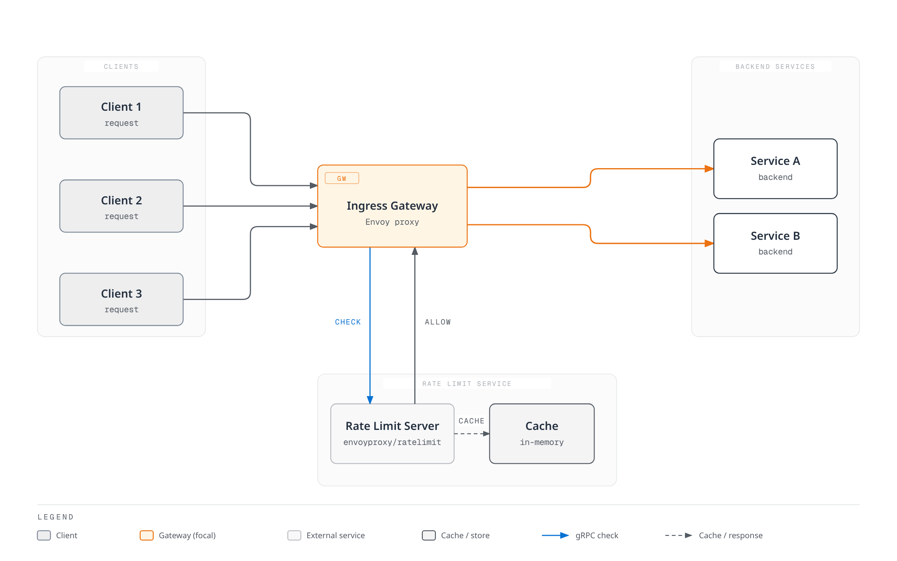

# Rate Limiting

> **Reviewed**: September 11, 2026 · Istio 1.31. Independent examples; select one local policy per workload/listener. Sidecar applications use HTTP 8080 in `default`; gateway examples select a dedicated gateway with `istio: ingressgateway` in `istio-system`. Verify actual labels/listeners before applying. These configurations have not been deployed or load-tested.

Rate Limiting is a feature that limits request rates to protect services from overload, ensure fair resource usage, and control costs.

## Table of Contents

1. [Overview](#overview)
2. [Rate Limiting Types](#rate-limiting-types)
3. [Local Rate Limiting](#local-rate-limiting)
4. [Global Rate Limiting](#global-rate-limiting)
5. [Practical Examples](#practical-examples)
6. [Monitoring](#monitoring)
7. [Troubleshooting](#troubleshooting)

## Overview

Rate Limiting is needed in the following situations:


[🔍 View interactive diagram](https://www.atomai.click/kubernetes-docs/archmaps/en-service-mesh-istio-resilience-02-rate-limiting-0.html)

### Purpose of Rate Limiting

1. **Service Protection**: Prevent overload
2. **Fairness**: Requires a deliberate descriptor/identity model; a shared bucket alone is not per-client fairness.
3. **Cost Control**: Manage external API call costs
4. **Abuse reduction**: Limits selected HTTP requests; it does not replace edge/DDoS protection or prevent connection/TLS exhaustion.

## Rate Limiting Types

### 1. Local Rate Limiting

**Characteristics**:
- Each Envoy proxy limits independently
- Fast response (no additional network calls)
- In distributed environments, total limit applies per instance

```yaml
# 100 req/s limit per pod
# Three independently configured buckets can sustain roughly 300 req/s in aggregate,
# subject to traffic distribution; each bucket also has its own burst allowance.
```

### 2. Global Rate Limiting

**Characteristics**:
- Uses centralized Rate Limit server
- Shared counters for a defined domain/descriptor and window; backend/failure behavior matters
- Slight latency (external service call)

```yaml
# Shared descriptor quota:100 per backend second-window
# Replicas must use the same counter; test window boundaries and backend failures.
```

### Comparison

| Characteristic | Local Rate Limiting | Global Rate Limiting |
|----------------|---------------------|----------------------|
| **Quota scope** | Per configured local bucket | Shared domain/descriptor |
| **Performance** | Very fast | Slightly slower |
| **Complexity** | Low | High (external service required) |
| **Use Case** | General protection | When precise limiting needed |

## Local Rate Limiting

### Token Bucket Algorithm


[🔍 View interactive diagram](https://www.atomai.click/kubernetes-docs/archmaps/en-service-mesh-istio-resilience-02-rate-limiting-1.html)

### Basic Configuration

```yaml
apiVersion: networking.istio.io/v1alpha3
kind: EnvoyFilter
metadata:
  name: local-ratelimit
  namespace: default
spec:
  workloadSelector:
    labels:
      app: myapp
  configPatches:
  - applyTo: HTTP_FILTER
    match:
      context: SIDECAR_INBOUND
      listener:
        filterChain:
          filter:
            name: envoy.filters.network.http_connection_manager
            subFilter:
              name: envoy.filters.http.router
        portNumber: 8080
    patch:
      operation: INSERT_BEFORE
      value:
        name: envoy.filters.http.local_ratelimit
        typed_config:
          '@type': type.googleapis.com/envoy.extensions.filters.http.local_ratelimit.v3.LocalRateLimit
          stat_prefix: http_local_rate_limiter
          token_bucket:
            max_tokens: 100
            tokens_per_fill: 10
            fill_interval: 1s
          filter_enabled:
            default_value:
              numerator: 100
              denominator: HUNDRED
          filter_enforced:
            default_value:
              numerator: 100
              denominator: HUNDRED
          response_headers_to_add:
          - header:
              key: x-local-rate-limit
              value: 'true'
            append_action: OVERWRITE_IF_EXISTS_OR_ADD
```

**Key Parameters**:
- `max_tokens`: Maximum tokens the bucket can hold (allows bursts)
- `tokens_per_fill`: Tokens to add per fill_interval
- `fill_interval`: Token addition interval

**Example**:
```yaml
# 10 requests per second, 100 burst allowed
token_bucket:
  max_tokens: 100
  tokens_per_fill: 10
  fill_interval: 1s

# Result:
# - Average: 10 req/s
# - Burst: up to100 immediately available tokens, not a second sustained rate
```

### Path-Based Rate Limiting

```yaml
apiVersion: networking.istio.io/v1alpha3
kind: EnvoyFilter
metadata:
  name: path-based-ratelimit
  namespace: default
spec:
  workloadSelector:
    labels:
      app: api-service
  configPatches:
  - applyTo: HTTP_FILTER
    match:
      context: SIDECAR_INBOUND
      listener:
        filterChain:
          filter:
            name: envoy.filters.network.http_connection_manager
            subFilter:
              name: envoy.filters.http.router
        portNumber: 8080
    patch:
      operation: INSERT_BEFORE
      value:
        name: envoy.filters.http.local_ratelimit
        typed_config:
          '@type': type.googleapis.com/envoy.extensions.filters.http.local_ratelimit.v3.LocalRateLimit
          stat_prefix: http_local_rate_limiter
          descriptors:
          - entries:
            - key: header_match
              value: /api/v1/users
            token_bucket:
              max_tokens: 1000
              tokens_per_fill: 100
              fill_interval: 1s
          - entries:
            - key: header_match
              value: /api/v1/admin
            token_bucket:
              max_tokens: 100
              tokens_per_fill: 10
              fill_interval: 1s
          filter_enabled:
            default_value:
              numerator: 100
              denominator: HUNDRED
          filter_enforced:
            default_value:
              numerator: 100
              denominator: HUNDRED
          token_bucket:
            max_tokens: 100
            tokens_per_fill: 10
            fill_interval: 1s
          always_consume_default_token_bucket: false
          rate_limits:
          - actions:
            - header_value_match:
                descriptor_value: /api/v1/users
                headers:
                - name: :path
                  string_match:
                    prefix: /api/v1/users
          - actions:
            - header_value_match:
                descriptor_value: /api/v1/admin
                headers:
                - name: :path
                  string_match:
                    prefix: /api/v1/admin
```

`rate_limits` generates `header_match` entries, and `descriptors` selects matching token buckets. This field is present in the Envoy API pinned by Istio 1.31; when set here it replaces local filter lookup of route/vhost rate-limit actions. Path values are literal descriptor keys; actual prefix matching is in `headers`. Prefixes also match longer paths beginning with that text. The fallback bucket limits unmatched requests; `always_consume_default_token_bucket: false` avoids additionally capping matched100 req/s users at the10 req/s fallback.

### Header-Based Rate Limiting

```yaml
apiVersion: networking.istio.io/v1alpha3
kind: EnvoyFilter
metadata:
  name: user-based-ratelimit
  namespace: default
spec:
  workloadSelector:
    labels:
      app: api-service
  configPatches:
  - applyTo: HTTP_FILTER
    match:
      context: SIDECAR_INBOUND
      listener:
        filterChain:
          filter:
            name: envoy.filters.network.http_connection_manager
            subFilter:
              name: envoy.filters.http.router
        portNumber: 8080
    patch:
      operation: INSERT_BEFORE
      value:
        name: envoy.filters.http.local_ratelimit
        typed_config:
          '@type': type.googleapis.com/envoy.extensions.filters.http.local_ratelimit.v3.LocalRateLimit
          stat_prefix: http_local_rate_limiter
          descriptors:
          - entries:
            - key: header_match
              value: x-user-tier:premium
            token_bucket:
              max_tokens: 1000
              tokens_per_fill: 100
              fill_interval: 1s
          - entries:
            - key: header_match
              value: x-user-tier:free
            token_bucket:
              max_tokens: 100
              tokens_per_fill: 10
              fill_interval: 1s
          filter_enabled:
            default_value:
              numerator: 100
              denominator: HUNDRED
          filter_enforced:
            default_value:
              numerator: 100
              denominator: HUNDRED
          token_bucket:
            max_tokens: 100
            tokens_per_fill: 10
            fill_interval: 1s
          always_consume_default_token_bucket: false
          rate_limits:
          - actions:
            - header_value_match:
                descriptor_value: x-user-tier:premium
                headers:
                - name: x-user-tier
                  string_match:
                    exact: premium
          - actions:
            - header_value_match:
                descriptor_value: x-user-tier:free
                headers:
                - name: x-user-tier
                  string_match:
                    exact: free
```

Tier descriptors are shared buckets for each tier in a local proxy, not one bucket per user. An authenticated upstream must strip caller-supplied tier headers and insert a trusted tier, and the service must prevent bypass of that path. Missing/unknown tiers use the bounded fallback. A premium header alone does not authenticate anyone.

## Global Rate Limiting

Global rate limiting asks a shared decision service about a domain/descriptor. Its scope can span gateway replicas, but it is not automatically every request in a cluster. Counter storage, window boundaries, failover and failure-mode policy affect the actual guarantee.

### Architecture



[🔍 View interactive diagram](https://www.atomai.click/kubernetes-docs/archmaps/en-service-mesh-istio-resilience-02-rate-limiting-2.html)

### Configuration Method

Global Rate Limiting requires deploying an external Rate Limit service and integrating with EnvoyFilter.

The diagram’s cache must be backed by a shared counter store such as Redis; independent in-process caches do not create a global quota. The following Deployment assumes an **already available Redis TCP service** at `redis-ratelimit.istio-system.svc.cluster.local:6379` in an isolated lab. Provisioning, authentication/TLS, persistence/HA and failover of that backend are separate requirements; it is not created below. Configure the pinned service’s REDIS_AUTH/REDIS_TLS/certificate settings for protected backends using appropriate Secrets/mounts.

The image is the published commit 8fe6ea42 (August 24, 2026), pinned by its manifest digest and available for linux/amd64 and linux/arm64. Upstream uses commit tags rather than post-v1.4.0 semantic releases; this is not a claim of a certified stable/production release. Review and test upgrades. The Deployment explicitly requests sidecar injection: verify the injector matches it and that the gateway can reach its gRPC Service under the actual mesh/network policies.

#### 1. Deploy Rate Limit Service

**Note**: Istio uses [envoyproxy/ratelimit](https://github.com/envoyproxy/ratelimit) service as an external dependency.

```yaml
apiVersion: v1
kind: ConfigMap
metadata:
  name: ratelimit-config
  namespace: istio-system
data:
  config.yaml: "domain: production-ratelimit\ndescriptors:\n  # Global limit: 100 per second\n  - key: generic_key\n    value: \"global\"\n    rate_limit:\n      unit: second\n      requests_per_unit: 100\n\n  # Per-path limit\n  - key: header_match\n    value: \"/api/v1/*\"\n    rate_limit:\n      unit: second\n      requests_per_unit: 50\n\n  # Per-user limit (per minute)\n  - key: remote_address\n    rate_limit:\n      unit: minute\n      requests_per_unit: 1000\n"
---
apiVersion: apps/v1
kind: Deployment
metadata:
  name: ratelimit
  namespace: istio-system
spec:
  replicas: 1
  selector:
    matchLabels:
      app: ratelimit
  template:
    metadata:
      labels:
        app: ratelimit
      annotations:
        sidecar.istio.io/inject: 'true'
    spec:
      containers:
      - name: ratelimit
        image: docker.io/envoyproxy/ratelimit:8fe6ea42@sha256:a61547259607d40aff153050c2a87873ca1676d1d9f5f06937d412000dcc2df1
        ports:
        - containerPort: 8080
          name: http
        - containerPort: 8081
          name: grpc
        env:
        - name: LOG_LEVEL
          value: info
        - name: CONFIG_TYPE
          value: FILE
        - name: RUNTIME_ROOT
          value: /data
        - name: RUNTIME_SUBDIRECTORY
          value: ratelimit
        - name: RUNTIME_APPDIRECTORY
          value: config
        - name: RUNTIME_WATCH_ROOT
          value: 'false'
        - name: RUNTIME_IGNOREDOTFILES
          value: 'true'
        - name: USE_STATSD
          value: 'false'
        - name: REDIS_SOCKET_TYPE
          value: tcp
        - name: REDIS_URL
          value: redis-ratelimit.istio-system.svc.cluster.local:6379
        - name: HOST
          value: '::'
        - name: GRPC_HOST
          value: '::'
        - name: HEALTHY_WITH_AT_LEAST_ONE_CONFIG_LOADED
          value: 'true'
        volumeMounts:
        - name: config-volume
          mountPath: /data/ratelimit/config
          readOnly: true
        command:
        - /bin/ratelimit
        resources:
          requests:
            memory: 128Mi
            cpu: 100m
          limits:
            memory: 512Mi
            cpu: 500m
        readinessProbe:
          httpGet:
            path: /healthcheck
            port: 8080
          initialDelaySeconds: 5
          periodSeconds: 5
      volumes:
      - name: config-volume
        configMap:
          name: ratelimit-config
---
apiVersion: v1
kind: Service
metadata:
  name: ratelimit
  namespace: istio-system
spec:
  ports:
  - port: 8080
    name: http
    targetPort: 8080
  - port: 8081
    name: grpc
    targetPort: 8081
  selector:
    app: ratelimit
```

#### 2. Configure Global Rate Limiting with EnvoyFilter

```yaml
apiVersion: networking.istio.io/v1alpha3
kind: EnvoyFilter
metadata:
  name: filter-ratelimit
  namespace: istio-system
spec:
  workloadSelector:
    labels:
      istio: ingressgateway
  configPatches:
  - applyTo: HTTP_FILTER
    match:
      context: GATEWAY
      listener:
        filterChain:
          filter:
            name: envoy.filters.network.http_connection_manager
            subFilter:
              name: envoy.filters.http.router
    patch:
      operation: INSERT_BEFORE
      value:
        name: envoy.filters.http.ratelimit
        typed_config:
          '@type': type.googleapis.com/envoy.extensions.filters.http.ratelimit.v3.RateLimit
          domain: production-ratelimit
          failure_mode_deny: true
          timeout: 0.1s
          rate_limit_service:
            grpc_service:
              envoy_grpc:
                cluster_name: outbound|8081||ratelimit.istio-system.svc.cluster.local
                authority: ratelimit.istio-system.svc.cluster.local
            transport_api_version: V3
```

#### 3. Add Gateway VirtualHost Rate Limit Actions

Apply this action set once to the same dedicated gateway as the filter. It deliberately covers all its HTTP virtual hosts; narrow the match to a verified generated vhost for a shared gateway. It generates global, path-prefix and client-IP descriptors corresponding to the ConfigMap. `remote_address` is a trusted downstream IP, not user identity; configure the real proxy/XFF trust chain and account for NAT before using it for quotas.


```yaml
apiVersion: networking.istio.io/v1alpha3
kind: EnvoyFilter
metadata:
  name: filter-ratelimit-actions
  namespace: istio-system
spec:
  workloadSelector:
    labels:
      istio: ingressgateway
  configPatches:
  - applyTo: VIRTUAL_HOST
    match:
      context: GATEWAY
    patch:
      operation: MERGE
      value:
        rate_limits:
        - actions:
          - generic_key:
              descriptor_value: global
        - actions:
          - header_value_match:
              descriptor_value: /api/v1/*
              headers:
              - name: :path
                string_match:
                  prefix: /api/v1/
        - actions:
          - remote_address: {}
```

The filter uses Istio’s generated gRPC cluster, so normal service discovery and mesh TLS policy apply. No hand-built plaintext cluster is added. `failure_mode_deny: true` normally returns HTTP 500 on a decision-service error and HTTP 429 on an over-limit response; false can fail open. The 100ms budget is illustrative: align Redis timeouts, latency and caller deadlines. Verify counter behavior across window boundaries, Redis restart/failover and service replica changes. Confirm configuration reload or restart after a ConfigMap change; do not infer a loaded policy from a Pod merely running.

### Key Parameter Descriptions

| Parameter | Description |
|-----------|-------------|
| `domain` | Rate Limit Service configuration domain (must match ConfigMap) |
| `failure_mode_deny` | Whether to reject requests when Rate Limit Service fails |
| `timeout` | Rate Limit Service response wait time |
| `rate_limit_service` | External Rate Limit Service gRPC endpoint |

### Global vs Local Rate Limiting Selection Criteria

**Use Local Rate Limiting**:
- Simple configuration
- Fast response speed
- No external dependencies
- Per-bucket scope; replica count/traffic distribution affect aggregate throughput

**Use Global Rate Limiting**:
- Shared limits for the selected descriptors
- Complex rules (per-user, per-IP, per-path)
- Centralized management
- External service required (increased complexity)
- Slight latency (gRPC call)

**Recommendations**:
- **Production API Gateway**: Global Rate Limiting (precise control needed)
- **Microservice Protection**: Local Rate Limiting (fast response)
- **Hybrid**: Global at Gateway, Local for internal services

## Practical Examples

### Example 1: API Gateway Rate Limiting

```yaml
apiVersion: networking.istio.io/v1alpha3
kind: EnvoyFilter
metadata:
  name: api-gateway-ratelimit
  namespace: istio-system
spec:
  workloadSelector:
    labels:
      istio: ingressgateway
  configPatches:
  - applyTo: HTTP_FILTER
    match:
      context: GATEWAY
      listener:
        filterChain:
          filter:
            name: envoy.filters.network.http_connection_manager
            subFilter:
              name: envoy.filters.http.router
    patch:
      operation: INSERT_BEFORE
      value:
        name: envoy.filters.http.local_ratelimit
        typed_config:
          '@type': type.googleapis.com/envoy.extensions.filters.http.local_ratelimit.v3.LocalRateLimit
          stat_prefix: http_local_rate_limiter
          descriptors:
          - entries:
            - key: header_match
              value: /api/v1/public/*
            token_bucket:
              max_tokens: 100
              tokens_per_fill: 10
              fill_interval: 1s
          - entries:
            - key: header_match
              value: /api/v1/protected/*
            token_bucket:
              max_tokens: 1000
              tokens_per_fill: 100
              fill_interval: 1s
          - entries:
            - key: header_match
              value: /graphql
            token_bucket:
              max_tokens: 500
              tokens_per_fill: 50
              fill_interval: 1s
          filter_enabled:
            default_value:
              numerator: 100
              denominator: HUNDRED
          filter_enforced:
            default_value:
              numerator: 100
              denominator: HUNDRED
          token_bucket:
            max_tokens: 100
            tokens_per_fill: 10
            fill_interval: 1s
          always_consume_default_token_bucket: false
          rate_limits:
          - actions:
            - header_value_match:
                descriptor_value: /api/v1/public/*
                headers:
                - name: :path
                  string_match:
                    prefix: /api/v1/public/
          - actions:
            - header_value_match:
                descriptor_value: /api/v1/protected/*
                headers:
                - name: :path
                  string_match:
                    prefix: /api/v1/protected/
          - actions:
            - header_value_match:
                descriptor_value: /graphql
                headers:
                - name: :path
                  string_match:
                    prefix: /graphql
```

This local gateway example classifies path prefixes; `/protected` does not itself enforce authentication. Every gateway replica has independent buckets. Unknown paths use the fallback bucket. The local filter’s own `rate_limits` avoids relying on a guessed generated route name.

### Example 2: Tiered Rate Limiting by User

```yaml
apiVersion: networking.istio.io/v1alpha3
kind: EnvoyFilter
metadata:
  name: tiered-ratelimit
  namespace: default
spec:
  workloadSelector:
    labels:
      app: api-service
  configPatches:
  - applyTo: HTTP_FILTER
    match:
      context: SIDECAR_INBOUND
      listener:
        filterChain:
          filter:
            name: envoy.filters.network.http_connection_manager
            subFilter:
              name: envoy.filters.http.router
        portNumber: 8080
    patch:
      operation: INSERT_BEFORE
      value:
        name: envoy.filters.http.local_ratelimit
        typed_config:
          '@type': type.googleapis.com/envoy.extensions.filters.http.local_ratelimit.v3.LocalRateLimit
          stat_prefix: http_local_rate_limiter
          descriptors:
          - entries:
            - key: header_match
              value: x-api-tier:enterprise
            token_bucket:
              max_tokens: 10000
              tokens_per_fill: 1000
              fill_interval: 1s
          - entries:
            - key: header_match
              value: x-api-tier:premium
            token_bucket:
              max_tokens: 1000
              tokens_per_fill: 100
              fill_interval: 1s
          - entries:
            - key: header_match
              value: x-api-tier:free
            token_bucket:
              max_tokens: 100
              tokens_per_fill: 10
              fill_interval: 1s
          filter_enabled:
            default_value:
              numerator: 100
              denominator: HUNDRED
          filter_enforced:
            default_value:
              numerator: 100
              denominator: HUNDRED
          token_bucket:
            max_tokens: 100
            tokens_per_fill: 10
            fill_interval: 1s
          always_consume_default_token_bucket: false
          rate_limits:
          - actions:
            - header_value_match:
                descriptor_value: x-api-tier:enterprise
                headers:
                - name: x-api-tier
                  string_match:
                    exact: enterprise
          - actions:
            - header_value_match:
                descriptor_value: x-api-tier:premium
                headers:
                - name: x-api-tier
                  string_match:
                    exact: premium
          - actions:
            - header_value_match:
                descriptor_value: x-api-tier:free
                headers:
                - name: x-api-tier
                  string_match:
                    exact: free
```

Enterprise/premium/free quotas below are shared per tier per configured proxy bucket. They require the same trusted-header and bypass-prevention controls as the earlier header example. Do not interpret1000 req/s as each enterprise user’s separate allocation.

### Example 3: External API Protection

```yaml
apiVersion: networking.istio.io/v1alpha3
kind: EnvoyFilter
metadata:
  name: external-api-ratelimit
  namespace: default
spec:
  workloadSelector:
    labels:
      app: myapp
  configPatches:
  - applyTo: HTTP_FILTER
    match:
      context: SIDECAR_OUTBOUND
      listener:
        filterChain:
          filter:
            name: envoy.filters.network.http_connection_manager
            subFilter:
              name: envoy.filters.http.router
    patch:
      operation: INSERT_BEFORE
      value:
        name: envoy.filters.http.local_ratelimit
        typed_config:
          '@type': type.googleapis.com/envoy.extensions.filters.http.local_ratelimit.v3.LocalRateLimit
          stat_prefix: egress_rate_limiter
  - applyTo: VIRTUAL_HOST
    match:
      context: SIDECAR_OUTBOUND
      routeConfiguration:
        vhost:
          name: api.external.com:80
    patch:
      operation: MERGE
      value:
        typed_per_filter_config:
          envoy.filters.http.local_ratelimit:
            '@type': type.googleapis.com/envoy.extensions.filters.http.local_ratelimit.v3.LocalRateLimit
            stat_prefix: egress_rate_limiter
            token_bucket:
              max_tokens: 1000
              tokens_per_fill: 10
              fill_interval: 1s
            response_headers_to_add:
            - header:
                key: x-rate-limit-exceeded
                value: 'true'
              append_action: OVERWRITE_IF_EXISTS_OR_ADD
            filter_enabled:
              default_value:
                numerator: 100
                denominator: HUNDRED
            filter_enforced:
              default_value:
                numerator: 100
                denominator: HUNDRED
```

This egress example assumes the `api.external.com` HTTP 80→TLS 443 ServiceEntry/DestinationRule from [external outlier protection](01-outlier-detection.md#protecting-external-services-serviceentry). Verify the generated vhost is `api.external.com:80`. The listener installs an inactive filter; only that vhost receives an enabled bucket. Other outbound HTTP hosts remain unthrottled by this example. Opaque application HTTPS cannot be classified by an HTTP filter. Each caller has its own bucket, so this is not a shared vendor/account quota. The response header marks rejected responses; it does not configure logging.

## Monitoring

### Prometheus Metrics

Merge the annotation into the relevant application/gateway Pod template, then roll out new proxies. Use the collection setup in [metrics](../observability/01-metrics.md); the queries assume `namespace`/`pod` scrape labels and one intended scrape per proxy. Discover actual metric names because the local prefix depends on `stat_prefix`.

```yaml
spec:
  template:
    metadata:
      annotations:
        proxy.istio.io/config: |
          proxyStatsMatcher:
            inclusionRegexps:
            - ".*http_local_rate_limit.*"
            - ".*ratelimit.*"
```

In order: local enforced rejections/s, under-limit decisions/s, enforced fraction of consulted requests, then global over-limit/OK/error/fail-open outcomes per second. `rate_limited` counts missing-token decisions even when enforcement is off, whereas `enforced` counts applied rejection. `over_limit` is not the total number of global calls. Global filter counters belong to the routed destination cluster, not necessarily the rate-limit-service cluster.

```promql
sum by (namespace, pod) (rate({__name__=~"envoy_.*http_local_rate_limit_enforced",namespace="default"}[5m]))

sum by (namespace, pod) (rate({__name__=~"envoy_.*http_local_rate_limit_ok",namespace="default"}[5m]))

100 * sum by (namespace, pod) (rate({__name__=~"envoy_.*http_local_rate_limit_enforced",namespace="default"}[5m])) / sum by (namespace, pod) (rate({__name__=~"envoy_.*http_local_rate_limit_enabled",namespace="default"}[5m]))

rate(envoy_cluster_ratelimit_over_limit{namespace="istio-system"}[5m])

rate(envoy_cluster_ratelimit_ok{namespace="istio-system"}[5m])

rate(envoy_cluster_ratelimit_error{namespace="istio-system"}[5m])

rate(envoy_cluster_ratelimit_failure_mode_allowed{namespace="istio-system"}[5m])
```

For gateway-local policies use `namespace="istio-system"`; narrow Pod/cluster/prefix labels for the chosen policy. A zero denominator, missing stat or failed scrape needs explicit no-data handling. The application can return429 independently, so an HTTP 429 alone does not prove this filter enforced a quota.

### Grafana Dashboard

This dashboard object requires datasource UID `prometheus` and the labels above. Use the [dashboard file provisioning](../observability/04-dashboards.md) procedure; a ConfigMap label alone is not a dashboard loader.

```json
{
  "uid": "istio-rate-limiting",
  "title": "Istio Rate Limiting",
  "panels": [
    {
      "id": 1,
      "title": "Local Enforced Rejections per Second",
      "type": "timeseries",
      "datasource": {
        "type": "prometheus",
        "uid": "prometheus"
      },
      "targets": [
        {
          "expr": "sum by (namespace, pod) (rate({__name__=~\"envoy_.*http_local_rate_limit_enforced\",namespace=\"default\"}[5m]))",
          "legendFormat": "{{namespace}} / {{pod}}",
          "refId": "A"
        }
      ],
      "gridPos": {
        "x": 0,
        "y": 0,
        "w": 24,
        "h": 8
      },
      "fieldConfig": {
        "defaults": {
          "unit": "short"
        }
      }
    },
    {
      "id": 2,
      "title": "Local Enforced Fraction",
      "type": "timeseries",
      "datasource": {
        "type": "prometheus",
        "uid": "prometheus"
      },
      "targets": [
        {
          "expr": "100 * sum by (namespace, pod) (rate({__name__=~\"envoy_.*http_local_rate_limit_enforced\",namespace=\"default\"}[5m])) / sum by (namespace, pod) (rate({__name__=~\"envoy_.*http_local_rate_limit_enabled\",namespace=\"default\"}[5m]))",
          "legendFormat": "{{namespace}} / {{pod}}",
          "refId": "A"
        }
      ],
      "gridPos": {
        "x": 0,
        "y": 8,
        "w": 24,
        "h": 8
      },
      "fieldConfig": {
        "defaults": {
          "unit": "percent"
        }
      }
    }
  ],
  "time": {
    "from": "now-1h",
    "to": "now"
  },
  "refresh": "30s"
}
```

## Troubleshooting

### Rate Limiting Not Working

```bash
# 1. Check EnvoyFilter
kubectl get envoyfilter -A

# 2. Check Envoy configuration
istioctl proxy-config listeners <pod-name> -n <namespace> -o json | \
  jq '.. | objects | select(.name? == "envoy.filters.http.local_ratelimit" or .name? == "envoy.filters.http.ratelimit")'

# 3. Check route/vhost overrides and actual optional counters
istioctl proxy-config routes <pod-name> -n <namespace> -o json
istioctl x envoy-stats <pod-name> -n <namespace> --output prom | grep -E "rate_limit|ratelimit"
```

### Global Rate Limiting Connection Failure

```bash
# Check Rate Limit Service
kubectl get pods -n istio-system -l app=ratelimit
kubectl logs -n istio-system -l app=ratelimit

# Check Redis connection
kubectl exec <redis-client-pod> -n istio-system -c <client-container> -- \
  redis-cli -h redis-ratelimit.istio-system.svc.cluster.local -p 6379 PING

# Check the gateway-to-service cluster and ready backend endpoints
istioctl proxy-config clusters <gateway-pod> -n istio-system --fqdn ratelimit.istio-system.svc.cluster.local
kubectl get endpointslice -n istio-system -l kubernetes.io/service-name=ratelimit
```

The Redis command requires an existing authorized client container with redis-cli and the backend’s TLS/authentication settings. The pinned rate-limit image is distroless and does not provide a shell or redis-cli. Inspect service logs and `/healthcheck`, loaded config, namespace selectors, mesh policy and descriptor equality. A green Pod or empty default proxy log is not proof of enforcement.

## References

- [Istio Rate Limiting](https://istio.io/latest/docs/tasks/policy-enforcement/rate-limit/)
- [Envoy Rate Limiting](https://www.envoyproxy.io/docs/envoy/latest/configuration/http/http_filters/local_rate_limit_filter)
- [Envoy Global Rate Limiting](https://github.com/envoyproxy/ratelimit)
