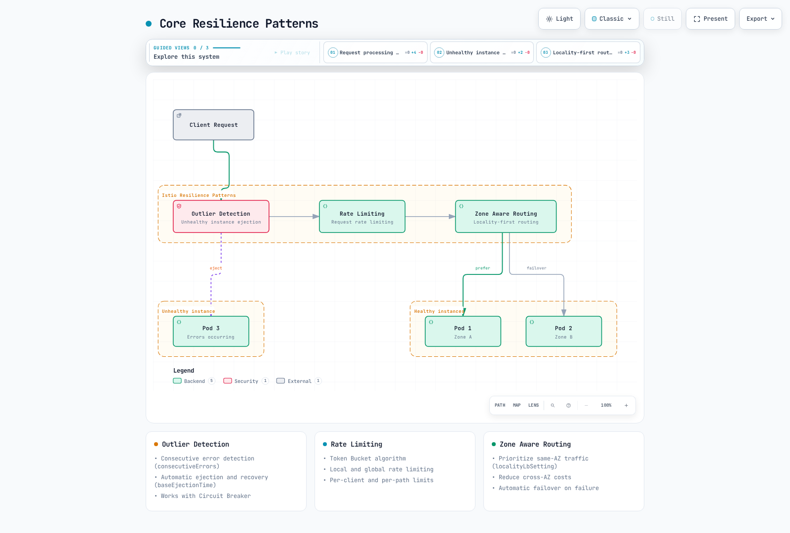
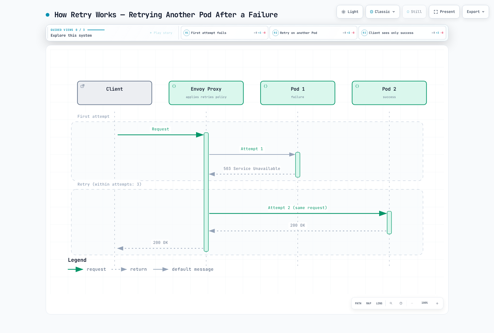

# Resilience

> **Reviewed**: September 11, 2026 · Istio 1.31. These are independent sidecar examples in `default` with HTTP `myapp` on port 8080. Do not apply every same-host example together. Validate actual proxy configuration and capacity; these examples have not been deployed or load-tested. Ambient L7 behavior requires a waypoint and a supported policy attachment.

Istio's resilience features help contain failures when configured for the application's semantics and capacity.

## Table of Contents

1. [Outlier Detection](01-outlier-detection.md)
2. [Rate Limiting](02-rate-limiting.md)
3. [Zone Aware Routing](03-zone-aware-routing.md)

### Additional Resilience Patterns

This documentation also covers the following patterns:

- **Circuit Breaker**: Circuit breaking through Connection Pool
- **Retry**: Retry policies
- **Timeout**: Request time limits
- **Fault Injection**: Fault injection testing

## Overview

Resilience is a critical characteristic in distributed systems. Istio can automatically implement various resilience patterns.

### Core Resilience Patterns



[🔍 View interactive diagram](https://www.atomai.click/kubernetes-docs/archmaps/en-service-mesh-istio-resilience-readme-0.html)

The figures summarize concepts, not a fixed sequence of network services. Outlier detection and locality selection are proxy load-balancing decisions; configured HTTP rate-limit filters run at the selected listener/route.

### 1. Outlier Detection

Automatically detects service instances exhibiting abnormal behavior and excludes them from the traffic pool.

```yaml
apiVersion: networking.istio.io/v1
kind: DestinationRule
metadata:
  name: myapp
  namespace: default
spec:
  host: myapp
  trafficPolicy:
    outlierDetection:
      consecutive5xxErrors: 5
      interval: 30s
      baseEjectionTime: 30s
      maxEjectionPercent: 50
```

**Key Features**:
- Consecutive error detection
- Temporary ejection and eligibility for later traffic
- Works with Circuit Breaker

Ejection is local to each observing proxy, not deletion of a Pod or a mesh-wide health verdict. Consecutive failures can trigger detection immediately; `interval` is the sweep period. Ejection expires and can recur; it does not prove recovery.

### 2. Rate Limiting

Limits request rate to protect services from overload.

```yaml
apiVersion: networking.istio.io/v1
kind: EnvoyFilter
metadata:
  name: ratelimit
  namespace: default
spec:
  configPatches:
  - applyTo: HTTP_FILTER
    match:
      context: SIDECAR_INBOUND
      listener:
        portNumber: 8080
        filterChain:
          filter:
            name: envoy.filters.network.http_connection_manager
            subFilter:
              name: envoy.filters.http.router
    patch:
      operation: INSERT_BEFORE
      value:
        name: envoy.filters.http.local_ratelimit
        typed_config:
          '@type': type.googleapis.com/envoy.extensions.filters.http.local_ratelimit.v3.LocalRateLimit
          stat_prefix: http_local_rate_limiter
          token_bucket:
            max_tokens: 100
            tokens_per_fill: 10
            fill_interval: 1s
          filter_enabled:
            default_value:
              numerator: 100
              denominator: HUNDRED
          filter_enforced:
            default_value:
              numerator: 100
              denominator: HUNDRED
  workloadSelector:
    labels:
      app: myapp
```

**Key Features**:
- Token Bucket algorithm
- Local and global rate limiting
- Per-client and per-path limits

The example enforces a local token bucket per Envoy process for the matched HTTP listener: initially 100 tokens, then 10 per second. It is not a service-wide quota; replica count and traffic distribution affect aggregate throughput. A global quota needs a rate-limit service and matching descriptors. Client/path limits need additional trusted classification; a caller-supplied header is not authenticated identity.

### 3. Zone Aware Routing

Optimizes traffic between Availability Zones to reduce latency and save costs.

```yaml
apiVersion: networking.istio.io/v1
kind: DestinationRule
metadata:
  name: myapp
  namespace: default
spec:
  host: myapp
  trafficPolicy:
    loadBalancer:
      localityLbSetting:
        enabled: true
        distribute:
        - from: us-east-1/us-east-1a/*
          to:
            us-east-1/us-east-1a/*: 80
            us-east-1/us-east-1b/*: 20
    outlierDetection:
      consecutive5xxErrors: 5
      interval: 10s
      baseEjectionTime: 30s
      maxEjectionPercent: 50
      minHealthPercent: 0
```

**Key Features**:
- Prioritize same-AZ traffic
- Reduce cross-AZ costs
- Configure a separate locality failover policy when required

Locality paths are `region/zone/subzone`. This example intentionally distributes 80/20 while both zones are healthy; the 20% is ordinary cross-zone traffic, not standby failover. Use the separate locality-failover pattern for same-zone preference with spillover, and do not combine `distribute` with `failover`/`failoverPriority`. Outlier detection, ready endpoints and spare destination capacity are prerequisites; cost savings depend on actual billed traffic.

### 4. Circuit Breaker

Limits connection and request counts to prevent service overload.

```yaml
apiVersion: networking.istio.io/v1
kind: DestinationRule
metadata:
  name: circuit-breaker
  namespace: default
spec:
  host: myapp
  trafficPolicy:
    connectionPool:
      tcp:
        maxConnections: 100
      http:
        http1MaxPendingRequests: 10
        http2MaxRequests: 100
        maxRequestsPerConnection: 2
    outlierDetection:
      consecutive5xxErrors: 5
      interval: 30s
      baseEjectionTime: 30s
```

**How It Works**:


[🔍 View interactive diagram](https://www.atomai.click/kubernetes-docs/archmaps/en-service-mesh-istio-resilience-readme-1.html)

**Key Features**:
- TCP connection limits
- HTTP request limits
- Pending request limits
- Fail Fast on overflow

Connection/request breakers are local to each proxy’s upstream cluster and priority, not a global per-server-Pod capacity limit. `http2MaxRequests` also applies to HTTP/1.1. A connection-limit hit may queue a request until pending/request limits are exceeded; the diagram illustrates HTTP overflow returning 503/UO, not every connection reaching its threshold. TCP overflow has no HTTP status.

### 5. Retry

Automatically retries requests on transient failures.

```yaml
apiVersion: networking.istio.io/v1
kind: VirtualService
metadata:
  name: myapp
  namespace: default
spec:
  hosts:
  - myapp
  http:
  - name: writes-no-retry
    match:
    - method:
        regex: ^(POST|PUT|PATCH|DELETE)$
    route:
    - destination:
        host: myapp
    timeout: 10s
    retries:
      attempts: 0
  - route:
    - destination:
        host: myapp
    retries:
      attempts: 3
      perTryTimeout: 2s
      retryOn: gateway-error,connect-failure,refused-stream
    timeout: 10s
    name: idempotent-reads
    match:
    - method:
        regex: ^(GET|HEAD|OPTIONS)$
  - name: other-methods-no-retry
    route:
    - destination:
        host: myapp
    timeout: 10s
    retries:
      attempts: 0
```

**Retry Conditions** (`retryOn`):
- `5xx`: Server errors (500, 502, 503, 504)
- `reset`: TCP connection reset
- `connect-failure`: Connection failure
- `refused-stream`: HTTP/2 stream refused
- `retriable-4xx`: HTTP 409 only under this Envoy policy
- `gateway-error`: Gateway errors (502, 503, 504)

**Backoff and locality (fragment for the matched read route above)**:
```yaml
retries:
  attempts: 5
  perTryTimeout: 2s
  retryOn: gateway-error,connect-failure,refused-stream
  backoff: 25ms
  retryRemoteLocalities: true
```

**How It Works**:


[🔍 View interactive diagram](https://www.atomai.click/kubernetes-docs/archmaps/en-service-mesh-istio-resilience-readme-2.html)

`attempts: 3` allows up to three retries after the initial attempt. The route timeout may stop earlier. Read-method matching assumes application idempotency; PUT/DELETE semantics and application idempotency keys still require verification before enabling their retries. Omission can inherit mesh retries, so write/fallback routes explicitly use `attempts: 0`. A retry can revisit a host and does not guarantee success. Backoff is exponential with jitter; allowing remote localities does not set the backoff.

### 6. Timeout

Sets time limits to prevent requests from waiting indefinitely.

```yaml
apiVersion: networking.istio.io/v1
kind: VirtualService
metadata:
  name: myapp
  namespace: default
spec:
  hosts:
  - myapp
  http:
  - name: writes-no-retry
    match:
    - method:
        regex: ^(POST|PUT|PATCH|DELETE)$
    route:
    - destination:
        host: myapp
    timeout: 5s
    retries:
      attempts: 0
  - route:
    - destination:
        host: myapp
    timeout: 5s
    retries:
      attempts: 3
      perTryTimeout: 2s
      retryOn: gateway-error,connect-failure,refused-stream
    name: idempotent-reads
    match:
    - method:
        regex: ^(GET|HEAD|OPTIONS)$
  - name: other-methods-no-retry
    route:
    - destination:
        host: myapp
    timeout: 5s
    retries:
      attempts: 0
```

**Timeout Hierarchy** (requires a separately configured `my-gateway` in `default`):
```yaml
apiVersion: networking.istio.io/v1
kind: VirtualService
metadata:
  name: gateway-timeout
  namespace: default
spec:
  gateways:
  - my-gateway
  hosts:
  - example.com
  http:
  - route:
    - destination:
        host: frontend
    timeout: 30s
    retries:
      attempts: 0
---
apiVersion: networking.istio.io/v1
kind: VirtualService
metadata:
  name: service-timeout
  namespace: default
spec:
  hosts:
  - backend
  http:
  - route:
    - destination:
        host: backend
    timeout: 5s
    retries:
      attempts: 0
```

**Illustrative budget ranges (derive actual values from SLOs and dependencies)**:
- Gateway -> Frontend: 30-60 seconds (user-facing)
- Service -> Service: 5-10 seconds (internal communication)
- Database queries: 2-5 seconds
- External APIs: 10-30 seconds

HTTP route timeouts do not configure database client/query timeouts or guarantee cancellation of downstream work. Propagate application deadlines; a smaller total timeout intentionally permits fewer retries.

### 7. Fault Injection

Intentionally injects faults for chaos engineering.

```yaml
apiVersion: networking.istio.io/v1
kind: VirtualService
metadata:
  name: fault-injection
  namespace: default
spec:
  hosts:
  - myapp
  http:
  - fault:
      delay:
        percentage:
          value: 10.0
        fixedDelay: 5s
      abort:
        percentage:
          value: 5.0
        httpStatus: 503
    route:
    - destination:
        host: myapp
```

**Use Case Scenarios**:

1. **Network Latency Simulation**:
```yaml
fault:
  delay:
    percentage:
      value: 100.0
    fixedDelay: 7s
```

2. **Intermittent Failure Testing**:
```yaml
fault:
  abort:
    percentage:
      value: 20.0
    httpStatus: 500
```

3. **Inject Faults for Specific Users Only**:
```yaml
apiVersion: networking.istio.io/v1
kind: VirtualService
metadata:
  name: fault-injection-user
  namespace: default
spec:
  hosts:
  - myapp
  http:
  - match:
    - headers:
        end-user:
          exact: test-user
    fault:
      abort:
        percentage:
          value: 100.0
        httpStatus: 503
    route:
    - destination:
        host: myapp
  - name: ordinary-traffic
    route:
    - destination:
        host: myapp
    retries:
      attempts: 0
```

Fault injection is a controlled lab operation. On a client-side route with `fault`, Istio does not enable that route’s retries/timeouts. Test retry behavior using faults at a separate downstream hop. A test-user header only scopes traffic; enforce who may supply it. The ordinary-traffic fallback prevents other requests from becoming unmatched.

## Resilience Pattern Combinations

### Outlier Detection + Circuit Breaker

```yaml
apiVersion: networking.istio.io/v1
kind: DestinationRule
metadata:
  name: myapp-resilient
  namespace: default
spec:
  host: myapp
  trafficPolicy:
    connectionPool:
      tcp:
        maxConnections: 100
      http:
        http1MaxPendingRequests: 50
        maxRequestsPerConnection: 2
    outlierDetection:
      consecutive5xxErrors: 5
      interval: 30s
      baseEjectionTime: 30s
      maxEjectionPercent: 50
      minHealthPercent: 0
```

### Rate Limiting + Retry

```yaml
apiVersion: networking.istio.io/v1
kind: VirtualService
metadata:
  name: myapp
  namespace: default
spec:
  hosts:
  - myapp
  http:
  - name: writes-no-retry
    match:
    - method:
        regex: ^(POST|PUT|PATCH|DELETE)$
    route:
    - destination:
        host: myapp
    timeout: 10s
    retries:
      attempts: 0
  - route:
    - destination:
        host: myapp
    retries:
      attempts: 3
      perTryTimeout: 2s
      retryOn: gateway-error,connect-failure,refused-stream
    timeout: 10s
    name: idempotent-reads
    match:
    - method:
        regex: ^(GET|HEAD|OPTIONS)$
  - name: other-methods-no-retry
    route:
    - destination:
        host: myapp
    timeout: 10s
    retries:
      attempts: 0
---
apiVersion: networking.istio.io/v1
kind: EnvoyFilter
metadata:
  name: ratelimit
  namespace: default
spec:
  workloadSelector:
    labels:
      app: myapp
  configPatches:
  - applyTo: HTTP_FILTER
    match:
      context: SIDECAR_INBOUND
      listener:
        portNumber: 8080
        filterChain:
          filter:
            name: envoy.filters.network.http_connection_manager
            subFilter:
              name: envoy.filters.http.router
    patch:
      operation: INSERT_BEFORE
      value:
        name: envoy.filters.http.local_ratelimit
        typed_config:
          '@type': type.googleapis.com/envoy.extensions.filters.http.local_ratelimit.v3.LocalRateLimit
          stat_prefix: http_local_rate_limiter
          token_bucket:
            max_tokens: 1000
            tokens_per_fill: 100
            fill_interval: 1s
          filter_enabled:
            default_value:
              numerator: 100
              denominator: HUNDRED
          filter_enforced:
            default_value:
              numerator: 100
              denominator: HUNDRED
```

## Resilience Architecture


[🔍 View interactive diagram](https://www.atomai.click/kubernetes-docs/archmaps/en-service-mesh-istio-resilience-readme-3.html)

## Resilience Metrics

Scrape one intended proxy endpoint per Pod as described in [metrics](../observability/01-metrics.md). Envoy does not export every optional stat by default. Merge this annotation into the relevant Pod template and roll out new proxies before checking the actual names/labels:

```yaml
spec:
  template:
    metadata:
      annotations:
        proxy.istio.io/config: |
          proxyStatsMatcher:
            inclusionRegexps:
            - ".*outlier_detection.*"
            - ".*circuit_breakers.*"
            - ".*upstream_rq_retry.*"
            - ".*upstream_rq_timeout.*"
            - ".*upstream_rq_.*overflow.*"
            - ".*http_local_rate_limit.*"
            - ".*fault.*"
```

### Prometheus Queries

Rates are per second; `_open` is a 0/1 capacity-state gauge, and `ejections_active` is a current host count. These single-cluster examples assume scrape labels `namespace`/`pod`; narrow the destination cluster for a specific dependency. The local-rate-limit prefix depends on `stat_prefix` and the emitted stat name. `rate_limited` counts token shortages even without enforcement; `enforced` counts applied limits. Active-request overflow counters differ by Envoy version: inspect `upstream_rq_active_overflow` if exposed rather than assuming every overflow increments the pending counter.

```promql
# Active ejections per observed cluster
 envoy_cluster_outlier_detection_ejections_active{namespace="default"}

# Locally rate-limited requests per second, retaining Pod identity
sum by (namespace, pod) (rate({__name__=~"envoy_.*http_local_rate_limit_enforced",namespace="default"}[5m]))

# Request circuit breaker currently at capacity (not a cumulative count)
envoy_cluster_circuit_breakers_default_rq_open{namespace="default"}

# Pending-queue circuit-breaker overflows per second
sum(rate(envoy_cluster_upstream_rq_pending_overflow{namespace="default"}[5m]))

# Retry attempts and retry-success events per second (different event counters)
sum(rate(envoy_cluster_upstream_rq_retry{namespace="default"}[5m]))
sum(rate(envoy_cluster_upstream_rq_retry_success{namespace="default"}[5m]))

# Upstream request timeouts per second
sum(rate(envoy_cluster_upstream_rq_timeout{namespace="default"}[5m]))

# Observed destination HTTP 2xx/3xx fraction; define your own SLI for 4xx/gRPC
sum(rate(istio_requests_total{reporter="destination",destination_service_namespace="default",response_code=~"[23].."}[5m])) /
sum(rate(istio_requests_total{reporter="destination",destination_service_namespace="default"}[5m]))
```

`source_zone` and `destination_zone` are not standard Istio labels. An AZ report needs validated topology enrichment or another source of zonal flow data; cluster IDs are not AZ IDs. Destination metrics exclude requests that never reach the service, so inspect source-side failure signals too.

### Grafana Dashboard Panels

Display active connections, open/closed state and overflow rate separately. There is no standard `envoy_cluster_circuit_breakers_default_cx_max` capacity gauge or `...rq_overflow` breaker gauge. Use effective cluster thresholds when calculating capacity, and never divide by a 0/1 open flag.

```promql
envoy_cluster_upstream_cx_active{namespace="default"}
envoy_cluster_circuit_breakers_default_cx_open{namespace="default"}

# Source-side observed final HTTP 5xx fraction, not hypothetical no-retry errors
sum(rate(istio_requests_total{reporter="source",destination_service_namespace="default",response_code=~"5.."}[5m])) /
sum(rate(istio_requests_total{reporter="source",destination_service_namespace="default"}[5m]))
```

Retry counters cannot reconstruct a counterfactual “error rate without retries.” Correlate attempts, final outcomes, latency and load using scoped measurements; no-traffic/missing series require separate handling.

## Best Practices

### 1. Outlier Detection Threshold Tuning

```yaml
# Adjust according to service characteristics
outlierDetection:
  consecutive5xxErrors: 5          # 5 consecutive failures
  interval: 30s                 # Evaluate every 30 seconds
  baseEjectionTime: 30s         # 30 second ejection
  maxEjectionPercent: 50        # Maximum 50% ejected
  minHealthPercent: 0           # Disable unhealthy-pool fail-open threshold
```

`minHealthPercent` is not a guarantee of healthy capacity: below a nonzero threshold, outlier detection is disabled and the proxy can use healthy and unhealthy hosts. `0` disables that threshold. Repeated ejections can last longer than `baseEjectionTime`; monitor actual ejected hosts and remaining capacity.

### 2. Staged Rate Limiting

```yaml
# Apply limits at Gateway -> Service stages
# Gateway: Overall traffic limit
# Service: Individual service limit
```

### 3. Zone Aware Routing Priority

For same-zone preference with failover, use locality priorities rather than an 80/20 distribution. Confirm node region/zone labels and available endpoints. The [zone-aware chapter](03-zone-aware-routing.md) covers distribution and failover as separate modes.

### 4. Circuit Breaker Configuration

Size each caller proxy's destination-cluster limits against measured concurrency and destination capacity. The number of callers, HTTP multiplexing, load distribution and rollout surges all matter; Pod count multiplied by an arbitrary factor is not a global admission limit. Large queues can hide overload.

```yaml
# DestinationRule trafficPolicy fragment; example values require load tests
connectionPool:
  tcp:
    maxConnections: 100
  http:
    http1MaxPendingRequests: 10
    http2MaxRequests: 100
    maxRequestsPerConnection: 0
    maxRetries: 10
```

`maxRequestsPerConnection: 0` permits reuse without this request-count cap; `1` disables keep-alive. Values 1–5 are not a general optimization. `maxRetries` bounds concurrent outstanding retries per upstream cluster, not retries per request.

### 5. Retry Policy

Use the explicit write guard and read-method match in the complete example above. A YAML comment saying “GET only” does not limit matching. Retry only operations whose application semantics are safe to repeat, with bounded attempts/backoff and a total deadline. Do not automatically retry 429 or overload responses: retries can defeat rate limiting and worsen a failure. The combined example uses a larger local bucket (1000 initial tokens, refill 100/s), not a global quota.

### 6. Timeout Configuration

Budget the entire call graph, including the first attempt, retries, backoff and application processing. If all attempts are intended to fit:

```text
route budget >= (1 + attempts) × perTryTimeout + backoff + other overhead
```

With `attempts: 3` and `perTryTimeout: 2s`, four full attempts use 8 seconds before backoff/other overhead. `timeout: 10s` is an example budget, not a guarantee; `timeout: 5s` intentionally cannot fit four full two-second attempts. Application deadlines must also cover request upload/streaming semantics and propagate cancellation appropriately.

### 7. Fault Injection Testing

Use the complete header-matched route and ordinary-traffic fallback above. Separate the fault-producing hop from a retry/timeout policy being tested. Start in a disposable test environment, then use a bounded cohort and abort criteria in staging. Any production experiment needs workload-specific authorization, observability and rollback thresholds; a fixed 1%→5%→10% schedule is not universally safe.

## Troubleshooting

### Outlier Detection Not Working

```bash
# 1. Check DestinationRule
kubectl get destinationrule -A

# 2. Check Envoy cluster status
istioctl proxy-config clusters <pod-name> -n <namespace>

# 3. Check Outlier Detection metrics
istioctl x envoy-stats <pod-name> -n <namespace> --output prom | grep outlier
```

### Rate Limiting Not Applied

```bash
# 1. Check EnvoyFilter
kubectl get envoyfilter -A

# 2. Check Envoy configuration
istioctl proxy-config listener <pod-name> -n <namespace> -o json

# 3. Check Rate Limit metrics
istioctl x envoy-stats <pod-name> -n <namespace> --output prom | grep rate_limit
```

### Zone Aware Routing Not Working

```bash
# 1. Check DestinationRule
kubectl get destinationrule -A

# 2. Map Pods to node topology; Pod zone labels are not added automatically
kubectl get pods -n <namespace> -o wide
kubectl get nodes -L topology.kubernetes.io/region,topology.kubernetes.io/zone

# 3. Check Locality information
istioctl proxy-config endpoints <pod-name> -n <namespace>
```

### Circuit Breaker Not Opening

```bash
# 1. Check DestinationRule connectionPool settings
kubectl get destinationrule <name> -o yaml

# 2. Check Circuit Breaker metrics
istioctl x envoy-stats <pod-name> -n <namespace> --output prom | grep circuit_breakers

# 3. Check for overflow
istioctl x envoy-stats <pod-name> -n <namespace> --output prom | grep overflow

# 4. Check active connection count
istioctl x envoy-stats <pod-name> -n <namespace> --output prom | grep upstream_cx_active
```

### Retry Not Working

```bash
# 1. Check VirtualService
kubectl get virtualservice <name> -o yaml

# 2. Check Retry metrics
istioctl x envoy-stats <pod-name> -n <namespace> --output prom | grep retry

# 3. Inspect enabled access/debug logs; default logs need not contain each retry
kubectl logs -n <namespace> <pod-name> -c istio-proxy | grep retry

# 4. Check retry conditions
istioctl proxy-config routes <pod-name> -n <namespace> -o json | \
  jq '.[] | .virtualHosts[]? | {name, domains, routes: [.routes[]? | {name, match, retryPolicy: .route.retryPolicy}]}'
```

### Timeout Not Applied

```bash
# 1. Check VirtualService timeout
kubectl get virtualservice <name> -o yaml | grep timeout

# 2. Check Timeout metrics
istioctl x envoy-stats <pod-name> -n <namespace> --output prom | grep timeout

# 3. Check request duration
istioctl x envoy-stats <pod-name> -n <namespace> --output prom | grep request_duration

# 4. Check Envoy route configuration
istioctl proxy-config routes <pod-name> -n <namespace> -o json | \
  jq '.[] | .virtualHosts[].routes[].route.timeout'
```

### Fault Injection Not Working

```bash
# 1. Check VirtualService fault configuration
kubectl get virtualservice <name> -o yaml | grep -A 10 fault

# 2. Check request headers (if match conditions exist)
curl -H "end-user: test-user" http://your-service/api

# 3. Check Envoy filters
istioctl proxy-config routes <pod-name> -n <namespace> -o json | \
  jq '.[] | .virtualHosts[]?.routes[]? | select(.typedPerFilterConfig["envoy.filters.http.fault"] != null) | {name, fault: .typedPerFilterConfig["envoy.filters.http.fault"]}'

# 4. Check Fault metrics
istioctl x envoy-stats <pod-name> -n <namespace> --output prom | grep fault
```

## Next Steps

1. **[Outlier Detection](01-outlier-detection.md)**: Automatic unhealthy instance detection
2. **[Rate Limiting](02-rate-limiting.md)**: Request rate control
3. **[Zone Aware Routing](03-zone-aware-routing.md)**: Locality-aware routing

## References

### Official Documentation
- [Istio Resilience](https://istio.io/latest/docs/concepts/traffic-management/#network-resilience-and-testing)
- [Outlier Detection](https://istio.io/latest/docs/reference/config/networking/destination-rule/#OutlierDetection)
- [Circuit Breaking](https://istio.io/latest/docs/tasks/traffic-management/circuit-breaking/)
- [Request Timeouts](https://istio.io/latest/docs/tasks/traffic-management/request-timeouts/)
- [Retries](https://istio.io/latest/docs/concepts/traffic-management/#retries)
- [Rate Limiting](https://istio.io/latest/docs/tasks/policy-enforcement/rate-limit/)
- [Fault Injection](https://istio.io/latest/docs/tasks/traffic-management/fault-injection/)
- [Locality Load Balancing](https://istio.io/latest/docs/tasks/traffic-management/locality-load-balancing/)

### AWS Related Resources
- [Enhancing Network Resilience with Istio on Amazon EKS](https://aws.amazon.com/blogs/opensource/enhancing-network-resilience-with-istio-on-amazon-eks/)
- [Amazon EKS Best Practices - Reliability](https://docs.aws.amazon.com/eks/latest/best-practices/reliability.html)

### Patterns and Architecture
- [Microservices Patterns - Circuit Breaker](https://microservices.io/patterns/reliability/circuit-breaker.html)
- [Release It! - Stability Patterns](https://pragprog.com/titles/mnee2/release-it-second-edition/)
- [Chaos Engineering Principles](https://principlesofchaos.org/)

## Quiz

To test your knowledge from this chapter, try the [Istio Resilience Quiz](../../../quizzes/service-mesh/istio/resilience.md).
