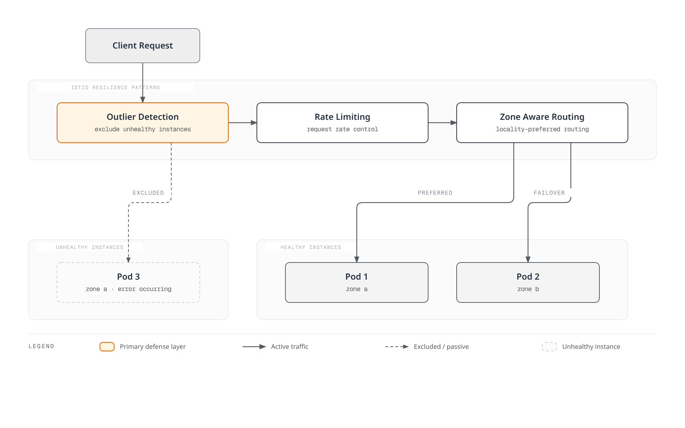
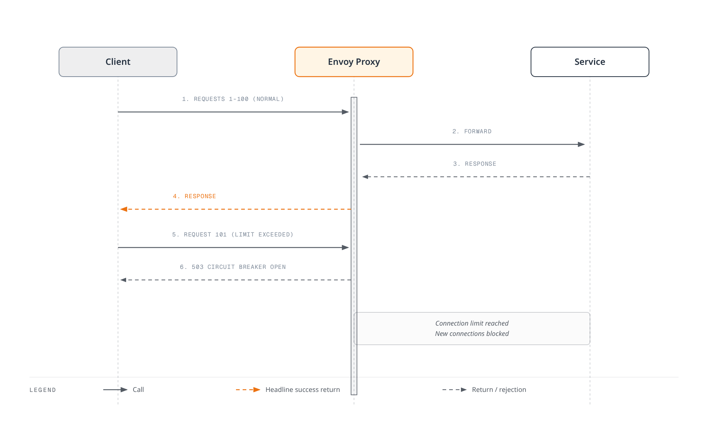
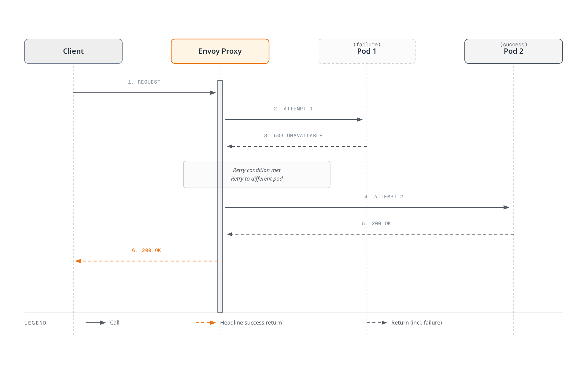

# Resilience

Istio's resilience features ensure that the service mesh operates reliably even in failure scenarios.

## Table of Contents

1. [Outlier Detection](01-outlier-detection.md)
2. [Rate Limiting](02-rate-limiting.md)
3. [Zone Aware Routing](03-zone-aware-routing.md)

### Additional Resilience Patterns

This documentation also covers the following patterns:
- **Circuit Breaker**: Circuit breaking through Connection Pool
- **Retry**: Retry policies
- **Timeout**: Request time limits
- **Fault Injection**: Fault injection testing

## Overview

Resilience is a critical characteristic in distributed systems. Istio can automatically implement various resilience patterns.

### Core Resilience Patterns



### 1. Outlier Detection

Automatically detects service instances exhibiting abnormal behavior and excludes them from the traffic pool.

```yaml
apiVersion: networking.istio.io/v1
kind: DestinationRule
metadata:
  name: myapp
spec:
  host: myapp
  trafficPolicy:
    outlierDetection:
      consecutiveErrors: 5
      interval: 30s
      baseEjectionTime: 30s
      maxEjectionPercent: 50
```

**Key Features**:
- Consecutive error detection
- Automatic exclusion and recovery
- Works with Circuit Breaker

### 2. Rate Limiting

Limits request rate to protect services from overload.

```yaml
apiVersion: networking.istio.io/v1
kind: EnvoyFilter
metadata:
  name: ratelimit
spec:
  configPatches:
  - applyTo: HTTP_FILTER
    match:
      context: SIDECAR_INBOUND
    patch:
      operation: INSERT_BEFORE
      value:
        name: envoy.filters.http.local_ratelimit
        typed_config:
          "@type": type.googleapis.com/envoy.extensions.filters.http.local_ratelimit.v3.LocalRateLimit
          stat_prefix: http_local_rate_limiter
          token_bucket:
            max_tokens: 100
            tokens_per_fill: 10
            fill_interval: 1s
```

**Key Features**:
- Token Bucket algorithm
- Local and global rate limiting
- Per-client and per-path limits

### 3. Zone Aware Routing

Optimizes traffic between Availability Zones to reduce latency and save costs.

```yaml
apiVersion: networking.istio.io/v1
kind: DestinationRule
metadata:
  name: myapp
spec:
  host: myapp
  trafficPolicy:
    loadBalancer:
      localityLbSetting:
        enabled: true
        distribute:
        - from: us-east-1a/*
          to:
            "us-east-1a/*": 80
            "us-east-1b/*": 20
```

**Key Features**:
- Prioritize same-AZ traffic
- Reduce cross-AZ costs
- Automatic failover on failure

### 4. Circuit Breaker

Limits connection and request counts to prevent service overload.

```yaml
apiVersion: networking.istio.io/v1
kind: DestinationRule
metadata:
  name: circuit-breaker
spec:
  host: myapp
  trafficPolicy:
    connectionPool:
      tcp:
        maxConnections: 100              # Maximum TCP connections
      http:
        http1MaxPendingRequests: 10      # Maximum pending requests
        http2MaxRequests: 100            # Maximum HTTP/2 requests
        maxRequestsPerConnection: 2       # Maximum requests per connection
    outlierDetection:
      consecutiveErrors: 5
      interval: 30s
      baseEjectionTime: 30s
```

**How It Works**:


**Key Features**:
- TCP connection limits
- HTTP request limits
- Pending request limits
- Fail Fast on overflow

### 5. Retry

Automatically retries requests on transient failures.

```yaml
apiVersion: networking.istio.io/v1
kind: VirtualService
metadata:
  name: myapp
spec:
  hosts:
  - myapp
  http:
  - route:
    - destination:
        host: myapp
    retries:
      attempts: 3                        # Maximum 3 retries
      perTryTimeout: 2s                  # Timeout per attempt
      retryOn: 5xx,reset,connect-failure,refused-stream  # Retry conditions
    timeout: 10s                         # Total request timeout
```

**Retry Conditions** (`retryOn`):
- `5xx`: Server errors (500, 502, 503, 504)
- `reset`: TCP connection reset
- `connect-failure`: Connection failure
- `refused-stream`: HTTP/2 stream refused
- `retriable-4xx`: Retriable 4xx (e.g., 409)
- `gateway-error`: Gateway errors (502, 503, 504)

**Exponential Backoff**:
```yaml
retries:
  attempts: 5
  perTryTimeout: 2s
  retryOn: 5xx
  retryRemoteLocalities: true            # Retry to other localities
```

**How It Works**:


### 6. Timeout

Sets time limits to prevent requests from waiting indefinitely.

```yaml
apiVersion: networking.istio.io/v1
kind: VirtualService
metadata:
  name: myapp
spec:
  hosts:
  - myapp
  http:
  - route:
    - destination:
        host: myapp
    timeout: 5s                          # Request timeout
    retries:
      attempts: 3
      perTryTimeout: 2s                  # Per-retry timeout
```

**Timeout Hierarchy**:
```yaml
# Gateway level timeout
apiVersion: networking.istio.io/v1
kind: VirtualService
metadata:
  name: gateway-timeout
spec:
  gateways:
  - my-gateway
  hosts:
  - example.com
  http:
  - route:
    - destination:
        host: frontend
    timeout: 30s                         # Gateway -> Frontend: 30 seconds

---
# Service level timeout
apiVersion: networking.istio.io/v1
kind: VirtualService
metadata:
  name: service-timeout
spec:
  hosts:
  - backend
  http:
  - route:
    - destination:
        host: backend
    timeout: 5s                          # Frontend -> Backend: 5 seconds
```

**Recommended Settings**:
- Gateway -> Frontend: 30-60 seconds (user-facing)
- Service -> Service: 5-10 seconds (internal communication)
- Database queries: 2-5 seconds
- External APIs: 10-30 seconds

### 7. Fault Injection

Intentionally injects faults for chaos engineering.

```yaml
apiVersion: networking.istio.io/v1
kind: VirtualService
metadata:
  name: fault-injection
spec:
  hosts:
  - myapp
  http:
  - fault:
      # Delay injection
      delay:
        percentage:
          value: 10.0                    # 10% of requests delayed
        fixedDelay: 5s                   # 5 second delay

      # Error injection
      abort:
        percentage:
          value: 5.0                     # 5% of requests fail
        httpStatus: 503                  # Return 503 error

    route:
    - destination:
        host: myapp
```

**Use Case Scenarios**:

1. **Network Latency Simulation**:
```yaml
fault:
  delay:
    percentage:
      value: 100.0
    fixedDelay: 7s
```

2. **Intermittent Failure Testing**:
```yaml
fault:
  abort:
    percentage:
      value: 20.0                        # 20% failure rate
    httpStatus: 500
```

3. **Inject Faults for Specific Users Only**:
```yaml
apiVersion: networking.istio.io/v1
kind: VirtualService
metadata:
  name: fault-injection-user
spec:
  hosts:
  - myapp
  http:
  - match:
    - headers:
        end-user:
          exact: test-user               # Apply only to test-user
    fault:
      abort:
        percentage:
          value: 100.0
        httpStatus: 503
    route:
    - destination:
        host: myapp
```

## Resilience Pattern Combinations

### Outlier Detection + Circuit Breaker

```yaml
apiVersion: networking.istio.io/v1
kind: DestinationRule
metadata:
  name: myapp-resilient
spec:
  host: myapp
  trafficPolicy:
    # Connection Pool (Circuit Breaker)
    connectionPool:
      tcp:
        maxConnections: 100
      http:
        http1MaxPendingRequests: 50
        maxRequestsPerConnection: 2

    # Outlier Detection
    outlierDetection:
      consecutiveErrors: 5
      interval: 30s
      baseEjectionTime: 30s
      maxEjectionPercent: 50
      minHealthPercent: 50
```

### Rate Limiting + Retry

```yaml
apiVersion: networking.istio.io/v1
kind: VirtualService
metadata:
  name: myapp
spec:
  hosts:
  - myapp
  http:
  - route:
    - destination:
        host: myapp
    retries:
      attempts: 3
      perTryTimeout: 2s
      retryOn: 5xx,reset,connect-failure
    timeout: 10s
---
apiVersion: networking.istio.io/v1
kind: EnvoyFilter
metadata:
  name: ratelimit
spec:
  workloadSelector:
    labels:
      app: myapp
  configPatches:
  - applyTo: HTTP_FILTER
    match:
      context: SIDECAR_INBOUND
    patch:
      operation: INSERT_BEFORE
      value:
        name: envoy.filters.http.local_ratelimit
        typed_config:
          "@type": type.googleapis.com/envoy.extensions.filters.http.local_ratelimit.v3.LocalRateLimit
          stat_prefix: http_local_rate_limiter
          token_bucket:
            max_tokens: 1000
            tokens_per_fill: 100
            fill_interval: 1s
```

## Resilience Architecture


## Resilience Metrics

### Prometheus Queries

```promql
# 1. Outlier Detection: Ejected instance count
envoy_cluster_outlier_detection_ejections_active

# 2. Rate Limiting: Rate-limited request count
rate(envoy_http_local_rate_limit_rate_limited[5m])

# 3. Zone Aware: Traffic ratio between zones
sum(rate(istio_requests_total[5m])) by (source_zone, destination_zone)

# 4. Circuit Breaker: Open circuit count
envoy_cluster_circuit_breakers_default_rq_open

# 5. Circuit Breaker: Requests rejected due to overflow
envoy_cluster_circuit_breakers_default_rq_overflow

# 6. Retry: Retried request count
sum(rate(envoy_cluster_upstream_rq_retry[5m]))

# 7. Retry: Retry success rate
sum(rate(envoy_cluster_upstream_rq_retry_success[5m])) /
sum(rate(envoy_cluster_upstream_rq_retry[5m])) * 100

# 8. Timeout: Timeout occurrence count
sum(rate(envoy_cluster_upstream_rq_timeout[5m]))

# 9. Overall request success rate
sum(rate(istio_requests_total{response_code!~"5.."}[5m])) /
sum(rate(istio_requests_total[5m])) * 100
```

### Grafana Dashboard Panels

**Circuit Breaker Status**:
```promql
# Active connections vs max connections
envoy_cluster_upstream_cx_active /
envoy_cluster_circuit_breakers_default_cx_max * 100
```

**Retry Effectiveness**:
```promql
# Error rate without retries
sum(rate(envoy_cluster_upstream_rq_xx{envoy_response_code_class="5"}[5m])) /
sum(rate(envoy_cluster_upstream_rq_xx[5m])) * 100

# Actual error rate after retries
sum(rate(istio_requests_total{response_code=~"5.."}[5m])) /
sum(rate(istio_requests_total[5m])) * 100
```

## Best Practices

### 1. Outlier Detection Threshold Tuning

```yaml
# Adjust according to service characteristics
outlierDetection:
  consecutiveErrors: 5          # 5 consecutive failures
  interval: 30s                 # Evaluate every 30 seconds
  baseEjectionTime: 30s         # 30 second ejection
  maxEjectionPercent: 50        # Maximum 50% ejected
  minHealthPercent: 50          # Maintain at least 50%
```

### 2. Staged Rate Limiting

```yaml
# Apply limits at Gateway -> Service stages
# Gateway: Overall traffic limit
# Service: Individual service limit
```

### 3. Zone Aware Routing Priority

```yaml
# Prioritize same AZ, use other AZs for failover
distribute:
- from: us-east-1a/*
  to:
    "us-east-1a/*": 80    # Same AZ 80%
    "us-east-1b/*": 20    # Other AZ 20% (failover)
```

### 4. Circuit Breaker Configuration

```yaml
# Configure according to service capacity
connectionPool:
  tcp:
    maxConnections: 100              # Maximum connections per pod
  http:
    http1MaxPendingRequests: 10      # Queue size (keep small)
    http2MaxRequests: 100
    maxRequestsPerConnection: 2       # Keep-alive limit

# Avoid overly large values
connectionPool:
  tcp:
    maxConnections: 10000            # Excessively large
  http:
    http1MaxPendingRequests: 1000    # Queue too long
```

**Recommended Values**:
- `maxConnections`: Pod count x expected concurrent connections x 1.5
- `http1MaxPendingRequests`: 10-50 (fast failure is important)
- `maxRequestsPerConnection`: 1-5 (limit connection reuse)

### 5. Retry Policy

```yaml
# Retry only idempotent requests
retries:
  attempts: 3
  perTryTimeout: 2s
  retryOn: 5xx,reset,connect-failure    # GET requests

# Avoid indiscriminate retries on POST/PUT requests
retries:
  attempts: 5
  retryOn: 5xx                           # Risk of duplicate data creation
```

**Retry Guidelines**:
- **GET, HEAD, OPTIONS**: Safe to retry
- **POST, PUT, PATCH**: Retry only if idempotency is guaranteed
- **DELETE**: Safe to retry (idempotent)

### 6. Timeout Configuration

```yaml
# Hierarchical timeouts (parent > child)
# Gateway
timeout: 30s
retries:
  perTryTimeout: 10s

# Service A -> Service B
timeout: 10s
retries:
  perTryTimeout: 3s

# Avoid child timeout larger than parent
timeout: 5s
retries:
  perTryTimeout: 10s                     # perTryTimeout > timeout
```

**Timeout Formula**:
```
total timeout >= (perTryTimeout x attempts) + overhead
```

Example: `timeout: 10s`, `perTryTimeout: 2s`, `attempts: 3`
- Minimum required: 2s x 3 = 6s
- Recommended: 10s (with margin)

### 7. Fault Injection Testing

```yaml
# In production, limit to specific users/headers
- match:
  - headers:
      x-chaos-test:
        exact: "true"
  fault:
    delay:
      percentage:
        value: 100.0
      fixedDelay: 5s

# Avoid indiscriminate fault injection in production
fault:
  abort:
    percentage:
      value: 50.0                        # 50% failure!
    httpStatus: 500
```

**Testing Stages**:
1. **Development**: Test thoroughly with 100% fault injection
2. **Staging**: Apply to specific user groups only
3. **Production**: Gradual canary approach (1% -> 5% -> 10%)

## Troubleshooting

### Outlier Detection Not Working

```bash
# 1. Check DestinationRule
kubectl get destinationrule -A

# 2. Check Envoy cluster status
istioctl proxy-config clusters <pod-name> -n <namespace>

# 3. Check Outlier Detection metrics
kubectl exec -n <namespace> <pod-name> -c istio-proxy -- \
  curl localhost:15000/stats/prometheus | grep outlier
```

### Rate Limiting Not Applied

```bash
# 1. Check EnvoyFilter
kubectl get envoyfilter -A

# 2. Check Envoy configuration
istioctl proxy-config listener <pod-name> -n <namespace> -o json

# 3. Check Rate Limit metrics
kubectl exec -n <namespace> <pod-name> -c istio-proxy -- \
  curl localhost:15000/stats/prometheus | grep rate_limit
```

### Zone Aware Routing Not Working

```bash
# 1. Check DestinationRule
kubectl get destinationrule -A

# 2. Check Pod Zone labels
kubectl get pods -n <namespace> -o wide \
  -L topology.kubernetes.io/zone

# 3. Check Locality information
istioctl proxy-config endpoints <pod-name> -n <namespace>
```

### Circuit Breaker Not Opening

```bash
# 1. Check DestinationRule connectionPool settings
kubectl get destinationrule <name> -o yaml

# 2. Check Circuit Breaker metrics
kubectl exec -n <namespace> <pod-name> -c istio-proxy -- \
  curl localhost:15000/stats/prometheus | grep circuit_breakers

# 3. Check for overflow
kubectl exec -n <namespace> <pod-name> -c istio-proxy -- \
  curl localhost:15000/stats/prometheus | grep overflow

# 4. Check active connection count
kubectl exec -n <namespace> <pod-name> -c istio-proxy -- \
  curl localhost:15000/stats/prometheus | grep upstream_cx_active
```

### Retry Not Working

```bash
# 1. Check VirtualService
kubectl get virtualservice <name> -o yaml

# 2. Check Retry metrics
kubectl exec -n <namespace> <pod-name> -c istio-proxy -- \
  curl localhost:15000/stats/prometheus | grep retry

# 3. Check Envoy logs for retries
kubectl logs -n <namespace> <pod-name> -c istio-proxy | grep retry

# 4. Check retry conditions
istioctl proxy-config routes <pod-name> -n <namespace> -o json | \
  jq '.[] | select(.name | contains("your-service")) | .virtualHosts[].routes[].route.retryPolicy'
```

### Timeout Not Applied

```bash
# 1. Check VirtualService timeout
kubectl get virtualservice <name> -o yaml | grep timeout

# 2. Check Timeout metrics
kubectl exec -n <namespace> <pod-name> -c istio-proxy -- \
  curl localhost:15000/stats/prometheus | grep timeout

# 3. Check request duration
kubectl exec -n <namespace> <pod-name> -c istio-proxy -- \
  curl localhost:15000/stats/prometheus | grep request_duration

# 4. Check Envoy route configuration
istioctl proxy-config routes <pod-name> -n <namespace> -o json | \
  jq '.[] | .virtualHosts[].routes[].route.timeout'
```

### Fault Injection Not Working

```bash
# 1. Check VirtualService fault configuration
kubectl get virtualservice <name> -o yaml | grep -A 10 fault

# 2. Check request headers (if match conditions exist)
curl -H "end-user: test-user" http://your-service/api

# 3. Check Envoy filters
istioctl proxy-config routes <pod-name> -n <namespace> -o json | \
  jq '.[] | .virtualHosts[].routes[].route.rateLimits'

# 4. Check Fault metrics
kubectl exec -n <namespace> <pod-name> -c istio-proxy -- \
  curl localhost:15000/stats/prometheus | grep fault
```

## Next Steps

1. **[Outlier Detection](01-outlier-detection.md)**: Automatic unhealthy instance detection
2. **[Rate Limiting](02-rate-limiting.md)**: Request rate control
3. **[Zone Aware Routing](03-zone-aware-routing.md)**: Locality-aware routing

## References

### Official Documentation
- [Istio Resilience](https://istio.io/latest/docs/concepts/traffic-management/#network-resilience-and-testing)
- [Outlier Detection](https://istio.io/latest/docs/reference/config/networking/destination-rule/#OutlierDetection)
- [Circuit Breaking](https://istio.io/latest/docs/tasks/traffic-management/circuit-breaking/)
- [Request Timeouts](https://istio.io/latest/docs/tasks/traffic-management/request-timeouts/)
- [Retries](https://istio.io/latest/docs/concepts/traffic-management/#retries)
- [Rate Limiting](https://istio.io/latest/docs/tasks/policy-enforcement/rate-limit/)
- [Fault Injection](https://istio.io/latest/docs/tasks/traffic-management/fault-injection/)
- [Locality Load Balancing](https://istio.io/latest/docs/tasks/traffic-management/locality-load-balancing/)

### AWS Related Resources
- [Enhancing Network Resilience with Istio on Amazon EKS](https://aws.amazon.com/blogs/opensource/enhancing-network-resilience-with-istio-on-amazon-eks/)
- [Amazon EKS Best Practices - Service Mesh](https://aws.github.io/aws-eks-best-practices/reliability/docs/networkmanagement/#service-mesh)

### Patterns and Architecture
- [Microservices Patterns - Circuit Breaker](https://microservices.io/patterns/reliability/circuit-breaker.html)
- [Release It! - Stability Patterns](https://pragprog.com/titles/mnee2/release-it-second-edition/)
- [Chaos Engineering Principles](https://principlesofchaos.org/)

## Quiz

To test your knowledge from this chapter, try the [Istio Resilience Quiz](../../../quizzes/service-mesh/istio/resilience.md).
