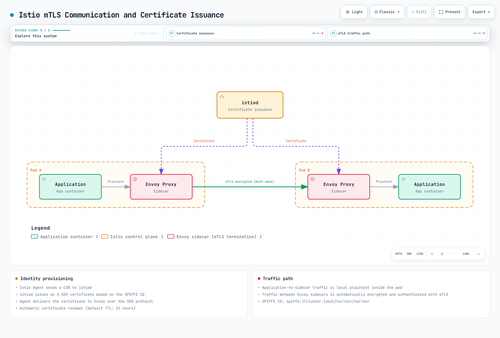
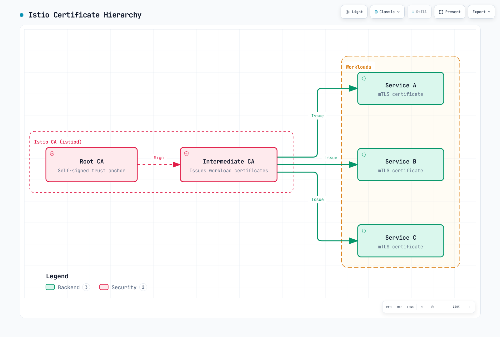
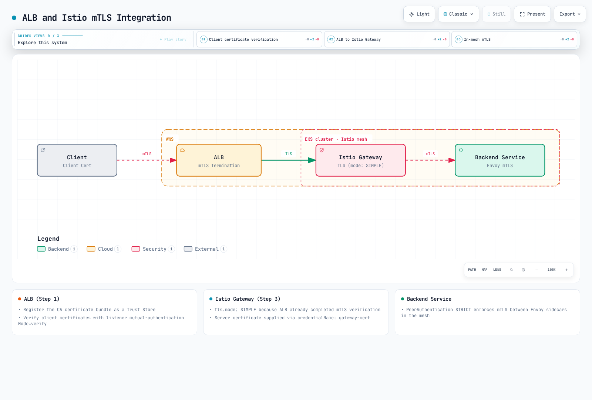
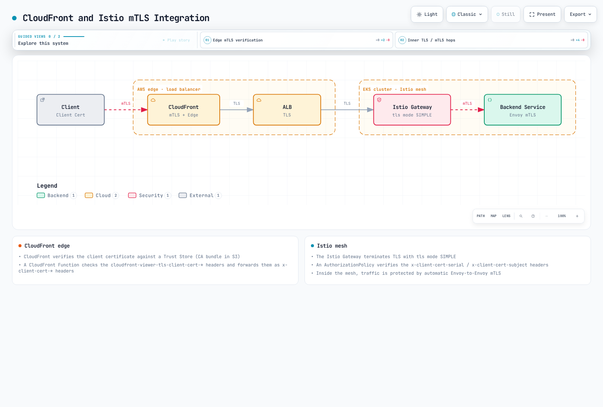
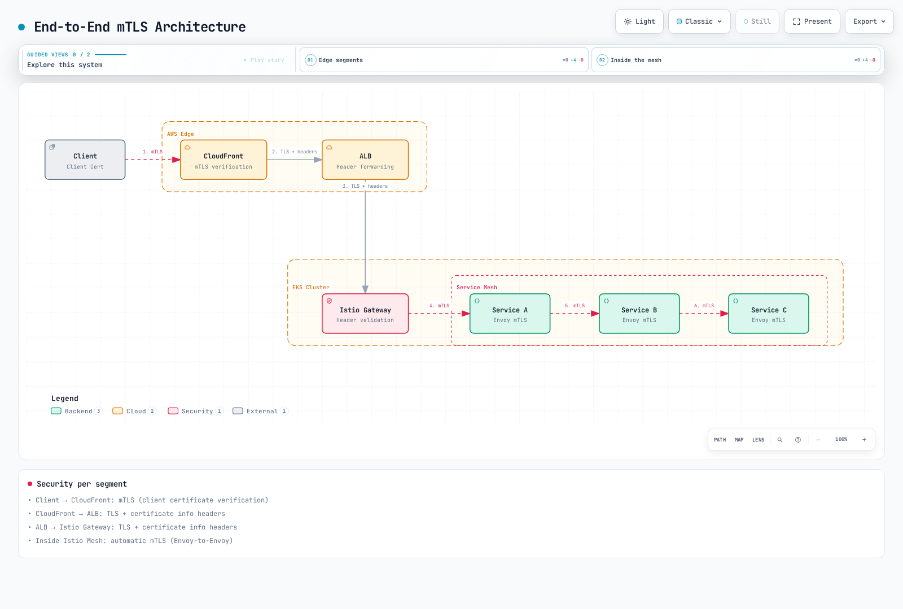

# mTLS

Mutual TLS (mTLS) is a core security feature of Istio that automatically encrypts and authenticates service-to-service communication.

## Table of Contents

1. [mTLS Overview](#mtls-overview)
2. [mTLS Modes](#mtls-modes)
3. [Certificate Management](#certificate-management)
4. [PeerAuthentication Configuration](#peerauthentication-configuration)
5. [mTLS Integration with AWS Services](#mtls-integration-with-aws-services)
6. [mTLS with External Services](#mtls-with-external-services)
7. [Migration Strategy](#migration-strategy)
8. [Common Issues and Solutions](#common-issues-and-solutions)
9. [Performance and Monitoring](#performance-and-monitoring)

## mTLS Overview

<p align="center">
  
</p>

Istio automatically applies mTLS to service-to-service communication, implementing a Zero Trust network.

### Identity-Based Security

Istio uses the **SPIFFE (Secure Production Identity Framework for Everyone)** standard to assign strong identities to each workload:

```
spiffe://cluster.local/ns/default/sa/productpage
  |         |           |     |      |    |
  |         |           |     |      |    +- ServiceAccount name
  |         |           |     |      +----- "sa" (ServiceAccount)
  |         |           |     +------------ Namespace name
  |         |           +------------------ "ns" (Namespace)
  |         +------------------------------ Trust Domain
  +---------------------------------------- Protocol
```

**Identity Provisioning Process**:
1. Kubernetes creates a pod and assigns a ServiceAccount
2. Istio Agent starts within the pod
3. Agent sends CSR (Certificate Signing Request) to Istiod
4. Istiod issues X.509 certificate based on SPIFFE ID
5. Agent delivers certificate to Envoy (SDS protocol)
6. Automatic certificate renewal (default TTL: 24 hours)



[🔍 View interactive diagram](https://www.atomai.click/kubernetes-docs/archmaps/en-service-mesh-istio-security-01-mtls-0.html)

## mTLS Modes

### STRICT Mode (Recommended)

```yaml
apiVersion: security.istio.io/v1
kind: PeerAuthentication
metadata:
  name: default
  namespace: istio-system
spec:
  mtls:
    mode: STRICT  # Only mTLS allowed
```

### PERMISSIVE Mode (For Migration)

```yaml
apiVersion: security.istio.io/v1
kind: PeerAuthentication
metadata:
  name: default
  namespace: default
spec:
  mtls:
    mode: PERMISSIVE  # Both mTLS and plaintext allowed
```

### DISABLE Mode

```yaml
apiVersion: security.istio.io/v1
kind: PeerAuthentication
metadata:
  name: disable-mtls
  namespace: default
spec:
  mtls:
    mode: DISABLE  # mTLS disabled
```

## Certificate Management

<p align="center">
  
</p>

### Istio Default CA Certificate

Istio automatically generates a self-signed root CA during installation. The diagram above shows Istio's certificate hierarchy:

- **Root CA**: Top-level trust anchor
- **Intermediate CA**: Intermediate CA for issuing workload certificates
- **Workload Certificates**: mTLS certificates for each service (auto-renewed)



[🔍 View interactive diagram](https://www.atomai.click/kubernetes-docs/archmaps/en-service-mesh-istio-security-01-mtls-1.html)

**Default Certificate Properties**:
- Validity period: **90 days** (auto-renewal: 24 hours before expiration)
- Key size: 2048-bit RSA
- Signature algorithm: SHA-256

### Certificate Verification

```bash
# 1. Check CA certificate
kubectl get secret istio-ca-secret -n istio-system -o yaml

# 2. Check workload certificate
istioctl proxy-config secret <pod-name> -n <namespace>

# 3. Certificate details
istioctl proxy-config secret <pod-name> -n <namespace> -o json | \
  jq -r '.dynamicActiveSecrets[0].secret.tlsCertificate.certificateChain.inlineBytes' | \
  base64 -d | openssl x509 -text -noout

# 4. Check certificate expiration date
istioctl proxy-config secret <pod-name> -n <namespace> -o json | \
  jq -r '.dynamicActiveSecrets[0].secret.tlsCertificate.certificateChain.inlineBytes' | \
  base64 -d | openssl x509 -noout -dates
```

### Using Custom CA Certificates

In production environments, it's recommended to use enterprise internal CAs or public CAs.

#### Step 1: Generate CA Certificate and Key

```bash
# 1. Generate Root CA
openssl genrsa -out root-key.pem 4096

openssl req -new -x509 -days 3650 -key root-key.pem \
  -out root-cert.pem \
  -subj "/C=US/ST=California/L=San Francisco/O=MyOrg/OU=IT/CN=Root CA"

# 2. Generate Intermediate CA
openssl genrsa -out ca-key.pem 4096

openssl req -new -key ca-key.pem -out ca-cert.csr \
  -subj "/C=US/ST=California/L=San Francisco/O=MyOrg/OU=IT/CN=Intermediate CA"

# 3. Sign Intermediate CA with Root CA
cat > ca-extensions.txt <<EOF
basicConstraints=CA:TRUE
keyUsage=keyCertSign,cRLSign
EOF

openssl x509 -req -days 1825 -in ca-cert.csr \
  -CA root-cert.pem -CAkey root-key.pem -CAcreateserial \
  -out ca-cert.pem -extfile ca-extensions.txt

# 4. Create Certificate Chain
cat ca-cert.pem root-cert.pem > cert-chain.pem
```

#### Step 2: Create Kubernetes Secret

```bash
kubectl create secret generic cacerts -n istio-system \
  --from-file=ca-cert.pem=ca-cert.pem \
  --from-file=ca-key.pem=ca-key.pem \
  --from-file=root-cert.pem=root-cert.pem \
  --from-file=cert-chain.pem=cert-chain.pem
```

#### Step 3: Restart Istio

```bash
# Restart istiod to load new CA certificate
kubectl rollout restart deployment/istiod -n istio-system

# Restart all workloads to issue new certificates
kubectl rollout restart deployment -n <namespace>
```

#### Step 4: Verification

```bash
# Verify CA certificate is loaded correctly
kubectl logs -l app=istiod -n istio-system | grep "Use plugged-in cert"

# Verify workload certificates are issued by new CA
istioctl proxy-config secret <pod-name> -n <namespace> -o json | \
  jq -r '.dynamicActiveSecrets[0].secret.tlsCertificate.certificateChain.inlineBytes' | \
  base64 -d | openssl x509 -noout -issuer
```

### AWS Certificate Manager (ACM) Integration

You can use ACM Private CA to manage Istio certificates.

#### Step 1: Create ACM Private CA

```bash
# Create ACM Private CA
aws acm-pca create-certificate-authority \
  --certificate-authority-configuration \
    "KeyAlgorithm=RSA_4096,SigningAlgorithm=SHA256WITHRSA,Subject={CommonName=Istio CA}" \
  --certificate-authority-type ROOT \
  --tags Key=Name,Value=istio-root-ca

# Save CA ARN
CA_ARN=$(aws acm-pca list-certificate-authorities \
  --query 'CertificateAuthorities[0].Arn' --output text)

# Generate Root CA certificate
aws acm-pca get-certificate-authority-csr \
  --certificate-authority-arn $CA_ARN \
  --output text > ca.csr

aws acm-pca issue-certificate \
  --certificate-authority-arn $CA_ARN \
  --csr fileb://ca.csr \
  --signing-algorithm SHA256WITHRSA \
  --template-arn arn:aws:acm-pca:::template/RootCACertificate/V1 \
  --validity Value=10,Type=YEARS

# Install certificate
CERT_ARN=$(aws acm-pca list-certificates \
  --certificate-authority-arn $CA_ARN \
  --query 'Certificates[0].Arn' --output text)

aws acm-pca get-certificate \
  --certificate-authority-arn $CA_ARN \
  --certificate-arn $CERT_ARN \
  --output text > root-cert.pem

aws acm-pca import-certificate-authority-certificate \
  --certificate-authority-arn $CA_ARN \
  --certificate fileb://root-cert.pem
```

#### Step 2: Install Cert-Manager + AWS PCA Issuer

```bash
# Install Cert-Manager
kubectl apply -f https://github.com/cert-manager/cert-manager/releases/download/v1.13.0/cert-manager.yaml

# Install AWS PCA Issuer
helm repo add awspca https://cert-manager.github.io/aws-privateca-issuer
helm install aws-pca-issuer awspca/aws-privateca-issuer -n cert-manager
```

#### Step 3: Create AWSPCAIssuer

```yaml
apiVersion: awspca.cert-manager.io/v1beta1
kind: AWSPCAClusterIssuer
metadata:
  name: istio-ca
spec:
  arn: ${CA_ARN}
  region: us-west-2
```

#### Step 4: Use in Istio

```yaml
apiVersion: cert-manager.io/v1
kind: Certificate
metadata:
  name: istio-ca-cert
  namespace: istio-system
spec:
  secretName: cacerts
  commonName: "Istio CA"
  isCA: true
  duration: 87600h  # 10 years
  renewBefore: 720h  # 30 days
  issuerRef:
    kind: AWSPCAClusterIssuer
    name: istio-ca
```

### Certificate Renewal Policy

```yaml
# Configure certificate policy with Istio Operator
apiVersion: install.istio.io/v1alpha1
kind: IstioOperator
metadata:
  name: istio-control-plane
  namespace: istio-system
spec:
  meshConfig:
    certificates:
      - secretName: dns.istio-system-service-account
        dnsNames:
          - istiod.istio-system.svc
          - istiod.istio-system
    caCertificates:
      - secretName: cacerts
        certProvider: cert-manager
  values:
    pilot:
      env:
        # Workload certificate TTL (default: 24 hours)
        CITADEL_CERT_TTL: "24h"
        # Certificate renewal grace period (default: 15 minutes)
        CITADEL_GRACE_PERIOD: "15m"
```

### Certificate Rotation

```bash
# 1. Generate new CA certificate (repeat steps above)

# 2. Update existing Secret
kubectl create secret generic cacerts -n istio-system \
  --from-file=ca-cert.pem=new-ca-cert.pem \
  --from-file=ca-key.pem=new-ca-key.pem \
  --from-file=root-cert.pem=new-root-cert.pem \
  --from-file=cert-chain.pem=new-cert-chain.pem \
  --dry-run=client -o yaml | kubectl apply -f -

# 3. Restart istiod (zero-downtime rolling update)
kubectl rollout restart deployment/istiod -n istio-system

# 4. Gradual workload certificate renewal
# Method 1: Wait for automatic renewal (within 24 hours)
# Method 2: Manual rolling restart
for ns in $(kubectl get ns -o jsonpath='{.items[*].metadata.name}'); do
  echo "Restarting deployments in namespace: $ns"
  kubectl rollout restart deployment -n $ns
done
```

## PeerAuthentication Configuration

### Global Configuration

```yaml
apiVersion: security.istio.io/v1
kind: PeerAuthentication
metadata:
  name: default
  namespace: istio-system
spec:
  mtls:
    mode: STRICT
```

### Namespace-level Configuration

```yaml
apiVersion: security.istio.io/v1
kind: PeerAuthentication
metadata:
  name: namespace-policy
  namespace: production
spec:
  mtls:
    mode: STRICT
```

### Workload-level Configuration

```yaml
apiVersion: security.istio.io/v1
kind: PeerAuthentication
metadata:
  name: workload-policy
  namespace: default
spec:
  selector:
    matchLabels:
      app: reviews
      version: v1
  mtls:
    mode: STRICT
```

### Port-level Configuration

```yaml
apiVersion: security.istio.io/v1
kind: PeerAuthentication
metadata:
  name: port-policy
  namespace: default
spec:
  selector:
    matchLabels:
      app: myapp
  mtls:
    mode: STRICT
  portLevelMtls:
    8080:
      mode: DISABLE  # mTLS disabled for port 8080
```

## mTLS Integration with AWS Services

### AWS Application Load Balancer (ALB) and mTLS

ALB supports client certificate-based mTLS.



[🔍 View interactive diagram](https://www.atomai.click/kubernetes-docs/archmaps/en-service-mesh-istio-security-01-mtls-2.html)

#### Step 1: Configure mTLS on ALB

```bash
# 1. Create Trust Store (upload CA certificate)
aws elbv2 create-trust-store \
  --name istio-client-trust-store \
  --ca-certificates-bundle-s3-bucket my-bucket \
  --ca-certificates-bundle-s3-key ca-bundle.pem

# 2. Configure mTLS on ALB listener
aws elbv2 modify-listener \
  --listener-arn arn:aws:elasticloadbalancing:region:account:listener/app/my-alb/xxx \
  --mutual-authentication Mode=verify,TrustStoreArn=arn:aws:elasticloadbalancing:region:account:truststore/istio-client-trust-store/xxx
```

#### Step 2: AWS Load Balancer Controller Configuration

```yaml
apiVersion: v1
kind: Service
metadata:
  name: istio-gateway
  namespace: istio-system
  annotations:
    service.beta.kubernetes.io/aws-load-balancer-type: "external"
    service.beta.kubernetes.io/aws-load-balancer-nlb-target-type: "ip"
    service.beta.kubernetes.io/aws-load-balancer-scheme: "internet-facing"
    # mTLS configuration
    service.beta.kubernetes.io/aws-load-balancer-ssl-cert: "arn:aws:acm:region:account:certificate/xxx"
    service.beta.kubernetes.io/aws-load-balancer-ssl-negotiation-policy: "ELBSecurityPolicy-TLS13-1-2-2021-06"
    service.beta.kubernetes.io/aws-load-balancer-mutual-authentication: '[{"port": 443, "mode": "verify", "trustStore": "arn:aws:elasticloadbalancing:region:account:truststore/istio-client-trust-store/xxx"}]'
spec:
  type: LoadBalancer
  selector:
    istio: ingressgateway
  ports:
  - name: https
    port: 443
    targetPort: 8443
```

#### Step 3: Verify Client Certificate at Istio Gateway

```yaml
apiVersion: networking.istio.io/v1
kind: Gateway
metadata:
  name: public-gateway
  namespace: istio-system
spec:
  selector:
    istio: ingressgateway
  servers:
  - port:
      number: 8443
      name: https
      protocol: HTTPS
    tls:
      mode: SIMPLE  # ALB already completed mTLS verification
      credentialName: gateway-cert
    hosts:
    - "*.example.com"
---
apiVersion: v1
kind: ConfigMap
metadata:
  name: istio-envoy-custom
  namespace: istio-system
data:
  custom-bootstrap.yaml: |
    static_resources:
      listeners:
      - name: http_listener
        address:
          socket_address:
            address: 0.0.0.0
            port_value: 8443
        filter_chains:
        - filters:
          - name: envoy.filters.network.http_connection_manager
            typed_config:
              "@type": type.googleapis.com/envoy.extensions.filters.network.http_connection_manager.v3.HttpConnectionManager
              # Verify client certificate headers forwarded from ALB
              forward_client_cert_details: APPEND_FORWARD
              set_current_client_cert_details:
                subject: true
                cert: true
                chain: true
                dns: true
                uri: true
```

#### Step 4: Forward Client Certificate Information

ALB forwards client certificate information as HTTP headers:

```yaml
apiVersion: security.istio.io/v1beta1
kind: AuthorizationPolicy
metadata:
  name: verify-client-cert
  namespace: default
spec:
  action: ALLOW
  rules:
  - when:
    - key: request.headers[x-amzn-mtls-clientcert-serial-number]
      values: ["*"]
    - key: request.headers[x-amzn-mtls-clientcert-subject]
      values: ["CN=trusted-client,O=MyOrg*"]
```

**Headers forwarded by ALB**:
- `X-Amzn-Mtls-Clientcert-Serial-Number`: Certificate serial number
- `X-Amzn-Mtls-Clientcert-Subject`: Certificate Subject DN
- `X-Amzn-Mtls-Clientcert-Issuer`: Certificate Issuer DN
- `X-Amzn-Mtls-Clientcert-Validity`: Validity period
- `X-Amzn-Mtls-Clientcert-Leaf`: Client certificate (PEM)

### Amazon CloudFront and mTLS

CloudFront supports client certificate verification.



[🔍 View interactive diagram](https://www.atomai.click/kubernetes-docs/archmaps/en-service-mesh-istio-security-01-mtls-3.html)

#### Step 1: Create CloudFront Distribution

```bash
# 1. Upload Trust Store (CA certificate) to S3
aws s3 cp ca-bundle.pem s3://my-bucket/ca-bundle.pem

# 2. Create CloudFront distribution
cat > cloudfront-config.json <<EOF
{
  "CallerReference": "istio-mtls-$(date +%s)",
  "Origins": {
    "Quantity": 1,
    "Items": [
      {
        "Id": "istio-gateway",
        "DomainName": "k8s-istiosystem-istiogateway-xxx.elb.us-west-2.amazonaws.com",
        "CustomOriginConfig": {
          "HTTPPort": 80,
          "HTTPSPort": 443,
          "OriginProtocolPolicy": "https-only",
          "OriginSslProtocols": {
            "Quantity": 1,
            "Items": ["TLSv1.2"]
          }
        }
      }
    ]
  },
  "DefaultCacheBehavior": {
    "TargetOriginId": "istio-gateway",
    "ViewerProtocolPolicy": "https-only",
    "TrustedSigners": {
      "Enabled": false,
      "Quantity": 0
    },
    "ForwardedValues": {
      "QueryString": true,
      "Headers": {
        "Quantity": 1,
        "Items": ["*"]
      }
    },
    "MinTTL": 0
  },
  "ViewerCertificate": {
    "CloudFrontDefaultCertificate": false,
    "ACMCertificateArn": "arn:aws:acm:us-east-1:account:certificate/xxx",
    "SSLSupportMethod": "sni-only",
    "MinimumProtocolVersion": "TLSv1.2_2021"
  }
}
EOF

aws cloudfront create-distribution --distribution-config file://cloudfront-config.json

# 3. Configure mTLS on CloudFront
DIST_ID=$(aws cloudfront list-distributions --query 'DistributionList.Items[0].Id' --output text)

aws cloudfront update-distribution \
  --id $DIST_ID \
  --distribution-config '{
    "ViewerCertificate": {
      "ACMCertificateArn": "arn:aws:acm:us-east-1:account:certificate/xxx",
      "SSLSupportMethod": "sni-only",
      "MinimumProtocolVersion": "TLSv1.2_2021",
      "CertificateSource": "acm"
    },
    "CustomOriginConfig": {
      "OriginSslProtocols": {
        "Quantity": 1,
        "Items": ["TLSv1.2"]
      }
    }
  }'
```

#### Step 2: Verify Certificate with CloudFront Function

```javascript
function handler(event) {
    var request = event.request;
    var headers = request.headers;

    // Headers forwarded by CloudFront after client certificate verification
    var clientCertSerial = headers['cloudfront-viewer-tls-client-cert-serial-number'];
    var clientCertSubject = headers['cloudfront-viewer-tls-client-cert-subject'];

    if (!clientCertSerial || !clientCertSubject) {
        return {
            statusCode: 403,
            statusDescription: 'Forbidden',
            body: 'Client certificate required'
        };
    }

    // Check allowed certificate serial numbers
    var allowedSerials = ['1234567890ABCDEF', 'FEDCBA0987654321'];
    if (!allowedSerials.includes(clientCertSerial.value)) {
        return {
            statusCode: 403,
            statusDescription: 'Forbidden',
            body: 'Invalid client certificate'
        };
    }

    // Forward certificate information to Istio
    headers['x-client-cert-serial'] = clientCertSerial;
    headers['x-client-cert-subject'] = clientCertSubject;

    return request;
}
```

#### Step 3: Verify CloudFront Headers in Istio

```yaml
apiVersion: security.istio.io/v1beta1
kind: AuthorizationPolicy
metadata:
  name: verify-cloudfront-client-cert
  namespace: default
spec:
  action: ALLOW
  rules:
  - when:
    - key: request.headers[x-client-cert-serial]
      values:
      - "1234567890ABCDEF"
      - "FEDCBA0987654321"
    - key: request.headers[x-client-cert-subject]
      values: ["CN=trusted-client,O=MyOrg*"]
```

### End-to-End mTLS Architecture

mTLS across the entire path from client to backend:



[🔍 View interactive diagram](https://www.atomai.click/kubernetes-docs/archmaps/en-service-mesh-istio-security-01-mtls-4.html)

**Security per segment**:
1. **Client -> CloudFront**: mTLS (client certificate verification)
2. **CloudFront -> ALB**: TLS + certificate info headers
3. **ALB -> Istio Gateway**: TLS + certificate info headers
4. **Inside Istio Mesh**: Automatic mTLS (Envoy-to-Envoy)

## mTLS with External Services

### Legacy System Integration

```yaml
# When legacy system doesn't support mTLS
apiVersion: networking.istio.io/v1beta1
kind: DestinationRule
metadata:
  name: legacy-system
  namespace: default
spec:
  host: legacy.external.com
  trafficPolicy:
    tls:
      mode: SIMPLE  # Use one-way TLS only
---
apiVersion: networking.istio.io/v1beta1
kind: ServiceEntry
metadata:
  name: legacy-system
  namespace: default
spec:
  hosts:
  - legacy.external.com
  ports:
  - number: 443
    name: https
    protocol: HTTPS
  location: MESH_EXTERNAL
  resolution: DNS
```

### External API mTLS Client Authentication

When Istio needs to present a client certificate to an external API:

```yaml
# 1. Create client certificate Secret
apiVersion: v1
kind: Secret
metadata:
  name: client-mtls-credential
  namespace: istio-system
type: kubernetes.io/tls
data:
  tls.crt: <base64-encoded-cert>
  tls.key: <base64-encoded-key>
  ca.crt: <base64-encoded-ca>
---
# 2. Configure client certificate in DestinationRule
apiVersion: networking.istio.io/v1beta1
kind: DestinationRule
metadata:
  name: external-api-mtls
  namespace: default
spec:
  host: api.external.com
  trafficPolicy:
    tls:
      mode: MUTUAL  # Use mTLS
      clientCertificate: /etc/certs/tls.crt
      privateKey: /etc/certs/tls.key
      caCertificates: /etc/certs/ca.crt
---
# 3. Register external API with ServiceEntry
apiVersion: networking.istio.io/v1beta1
kind: ServiceEntry
metadata:
  name: external-api
  namespace: default
spec:
  hosts:
  - api.external.com
  ports:
  - number: 443
    name: https
    protocol: HTTPS
  location: MESH_EXTERNAL
  resolution: DNS
```

### External mTLS via Egress Gateway

```yaml
# 1. Deploy Egress Gateway
apiVersion: install.istio.io/v1alpha1
kind: IstioOperator
spec:
  components:
    egressGateways:
    - name: istio-egressgateway
      enabled: true
      k8s:
        serviceAnnotations:
          networking.istio.io/exportTo: "*"
---
# 2. Gateway resource
apiVersion: networking.istio.io/v1
kind: Gateway
metadata:
  name: egress-gateway
  namespace: istio-system
spec:
  selector:
    istio: egressgateway
  servers:
  - port:
      number: 443
      name: tls
      protocol: TLS
    hosts:
    - api.external.com
    tls:
      mode: ISTIO_MUTUAL  # mTLS inside mesh
---
# 3. Route traffic with VirtualService
apiVersion: networking.istio.io/v1
kind: VirtualService
metadata:
  name: external-api-through-egress
  namespace: default
spec:
  hosts:
  - api.external.com
  gateways:
  - mesh  # From inside mesh
  - istio-system/egress-gateway  # To Egress Gateway
  http:
  - match:
    - gateways:
      - mesh
      port: 443
    route:
    - destination:
        host: istio-egressgateway.istio-system.svc.cluster.local
        port:
          number: 443
  - match:
    - gateways:
      - istio-system/egress-gateway
      port: 443
    route:
    - destination:
        host: api.external.com
        port:
          number: 443
---
# 4. DestinationRule (from Egress Gateway to external)
apiVersion: networking.istio.io/v1beta1
kind: DestinationRule
metadata:
  name: external-api-mtls
  namespace: istio-system
spec:
  host: api.external.com
  trafficPolicy:
    tls:
      mode: MUTUAL
      clientCertificate: /etc/istio/egress-certs/tls.crt
      privateKey: /etc/istio/egress-certs/tls.key
      caCertificates: /etc/istio/egress-certs/ca.crt
```

## Migration Strategy

### Step 1: Check Current State

```bash
# Check current mTLS configuration
kubectl get peerauthentication -A

# Check mTLS status by service
istioctl authn tls-check <pod-name> -n <namespace>
```

### Step 2: Switch to PERMISSIVE Mode

```yaml
apiVersion: security.istio.io/v1
kind: PeerAuthentication
metadata:
  name: default
  namespace: istio-system
spec:
  mtls:
    mode: PERMISSIVE  # Allow both mTLS and plaintext
```

### Step 3: Monitoring

```bash
# Verify mTLS connections
kubectl exec -it <pod-name> -c istio-proxy -- \
  curl -s localhost:15000/stats/prometheus | grep ssl

# Verify plaintext connections
kubectl exec -it <pod-name> -c istio-proxy -- \
  curl -s localhost:15000/stats/prometheus | grep plaintext
```

### Step 4: Switch to STRICT Mode

```yaml
apiVersion: security.istio.io/v1
kind: PeerAuthentication
metadata:
  name: default
  namespace: istio-system
spec:
  mtls:
    mode: STRICT  # Only mTLS allowed
```

## Common Issues and Solutions

### 1. mTLS Connection Failure

**Symptoms**:
```
upstream connect error or disconnect/reset before headers. reset reason: connection failure
```

**Root Cause Analysis**:

```bash
# 1. Check PeerAuthentication
kubectl get peerauthentication -A

# 2. Check DestinationRule mTLS mode
kubectl get destinationrule -A -o yaml | grep -A 5 "trafficPolicy"

# 3. Check certificates
istioctl proxy-config secret <pod-name> -n <namespace>

# 4. Verify TLS connection
istioctl authn tls-check <source-pod> <dest-service> -n <namespace>

# 5. Check Envoy logs in detail
kubectl logs <pod-name> -c istio-proxy -n <namespace> | grep -E "(TLS|SSL|certificate)"
```

**Solutions**:

1. **PeerAuthentication and DestinationRule mismatch**:
```yaml
# Problem: PeerAuthentication is STRICT, DestinationRule is DISABLE
# Solution: Change DestinationRule to ISTIO_MUTUAL
apiVersion: networking.istio.io/v1beta1
kind: DestinationRule
metadata:
  name: fix-mtls
spec:
  host: myservice.default.svc.cluster.local
  trafficPolicy:
    tls:
      mode: ISTIO_MUTUAL  # Match STRICT mode
```

2. **Pod without sidecar injection**:
```bash
# Add istio-injection label to namespace
kubectl label namespace default istio-injection=enabled

# Restart pod
kubectl rollout restart deployment/<deployment-name> -n default
```

### 2. Certificate Expiration Issue

**Symptoms**:
```
TLS error: Secret is not supplied by SDS
x509: certificate has expired
```

**Check Certificate Expiration**:

```bash
# Check workload certificate expiration date
istioctl proxy-config secret <pod-name> -n <namespace> -o json | \
  jq -r '.dynamicActiveSecrets[0].secret.tlsCertificate.certificateChain.inlineBytes' | \
  base64 -d | openssl x509 -noout -dates

# Check CA certificate expiration
kubectl get secret istio-ca-secret -n istio-system -o json | \
  jq -r '.data."ca-cert.pem"' | base64 -d | openssl x509 -noout -dates

# Check certificate expiration for all workloads
for pod in $(kubectl get pods -n default -o jsonpath='{.items[*].metadata.name}'); do
  echo "Pod: $pod"
  istioctl proxy-config secret $pod -n default -o json 2>/dev/null | \
    jq -r '.dynamicActiveSecrets[0].secret.tlsCertificate.certificateChain.inlineBytes' | \
    base64 -d 2>/dev/null | openssl x509 -noout -dates 2>/dev/null || echo "No cert found"
done
```

**Solutions**:

```bash
# 1. Restart istiod (trigger new certificate issuance)
kubectl rollout restart deployment/istiod -n istio-system

# 2. Restart specific workload (renew certificate)
kubectl delete pod <pod-name> -n <namespace>

# 3. Renew CA certificate (see "Certificate Rotation" section above)
```

### 3. Clock Skew (Time Synchronization Issue)

**Symptoms**:
```
certificate is not valid yet
certificate verify failed
```

**Cause**: Certificate verification failure due to time difference between pods/nodes

**Verification**:

```bash
# Check node time
kubectl get nodes -o wide
for node in $(kubectl get nodes -o jsonpath='{.items[*].metadata.name}'); do
  echo "Node: $node"
  kubectl debug node/$node -it --image=busybox -- date
done

# Check pod time
kubectl exec -it <pod-name> -c istio-proxy -n <namespace> -- date

# Check time difference (acceptable range: +/- 5 minutes)
```

**Solutions**:

```bash
# 1. NTP configuration (node level)
sudo systemctl restart chrony
sudo chronyc tracking

# 2. NTP sync is default on EKS
# Verify Amazon Time Sync Service usage
curl http://169.254.169.123/latest/meta-data/system

# 3. Add grace period to certificate start time
# Istio Operator configuration
apiVersion: install.istio.io/v1alpha1
kind: IstioOperator
spec:
  values:
    pilot:
      env:
        CERT_NOTBEFORE_GRACE_DURATION: "10m"  # Start time grace period
```

### 4. Circular Dependency

**Symptoms**:
```
upstream connect error or disconnect/reset before headers
```

**Cause**: mTLS handshake timeout during Service A -> Service B -> Service A calls

**Verification**:

```bash
# Check service call chain
istioctl analyze -n <namespace>

# Check Envoy clusters
istioctl proxy-config cluster <pod-name> -n <namespace>
```

**Solution**:

```yaml
# Set appropriate timeout in DestinationRule
apiVersion: networking.istio.io/v1beta1
kind: DestinationRule
metadata:
  name: service-with-timeout
spec:
  host: myservice.default.svc.cluster.local
  trafficPolicy:
    connectionPool:
      tcp:
        connectTimeout: 30s  # Increase connection timeout
    tls:
      mode: ISTIO_MUTUAL
```

### 5. Mixed Protocol (mTLS + Plaintext)

**Symptoms**:
```
SSL routines:OPENSSL_internal:WRONG_VERSION_NUMBER
```

**Cause**: Some services use mTLS while others use plaintext

**Verification**:

```bash
# Check mTLS status for all services
for svc in $(kubectl get svc -n default -o jsonpath='{.items[*].metadata.name}'); do
  echo "Service: $svc"
  istioctl authn tls-check $(kubectl get pod -n default -l app=test -o jsonpath='{.items[0].metadata.name}') $svc.default.svc.cluster.local -n default
done
```

**Solution**:

```yaml
# Gradual migration with PERMISSIVE mode
apiVersion: security.istio.io/v1
kind: PeerAuthentication
metadata:
  name: migration-policy
  namespace: default
spec:
  mtls:
    mode: PERMISSIVE  # Allow both mTLS and plaintext
```

### 6. Headless Service mTLS

**Symptoms**: mTLS connection failure on headless services

**Solution**:

```yaml
apiVersion: networking.istio.io/v1beta1
kind: DestinationRule
metadata:
  name: headless-service-mtls
spec:
  host: headless-service.default.svc.cluster.local
  trafficPolicy:
    tls:
      mode: ISTIO_MUTUAL
    portLevelSettings:
    - port:
        number: 3306
      tls:
        mode: ISTIO_MUTUAL
```

### 7. mTLS and NetworkPolicy Conflict

**Symptoms**: mTLS connection failure after applying NetworkPolicy

**Solution**:

```yaml
apiVersion: networking.k8s.io/v1
kind: NetworkPolicy
metadata:
  name: allow-istio-mtls
  namespace: default
spec:
  podSelector: {}
  policyTypes:
  - Ingress
  - Egress
  ingress:
  - from:
    - namespaceSelector:
        matchLabels:
          name: istio-system  # Allow istiod
    - podSelector: {}  # Allow pods in same namespace
    ports:
    - protocol: TCP
      port: 15008  # Envoy mTLS port
    - protocol: TCP
      port: 15012  # Pilot discovery
  egress:
  - to:
    - namespaceSelector:
        matchLabels:
          name: istio-system
    ports:
    - protocol: TCP
      port: 15012
  - to:
    - podSelector: {}
    ports:
    - protocol: TCP
      port: 15008
```

## Performance and Monitoring

### mTLS Performance Impact — Measured on EKS

The performance cost of mTLS depends entirely on which data plane does the encryption. The numbers below were measured by this guidebook on a dedicated EKS cluster (Graviton m7g.xlarge, fortio at 200 qps for 60s over 16 connections, Code 200 100% in every case):

| Case (mTLS STRICT) | P50 | P90 | P99 | P50 overhead vs no-mesh |
|--------------------|-----|-----|-----|-------------------------|
| no-mesh (plaintext baseline) | 0.82ms | 1.73ms | 1.97ms | — |
| sidecar | 2.11ms | 2.89ms | 3.91ms | **+1.29ms** |
| ambient L4 (ztunnel only) | 0.86ms | 1.74ms | 1.98ms | **+0.04ms (negligible)** |
| ambient L7 (waypoint) | 2.68ms | 3.63ms | 3.98ms | **+1.86ms** |

The takeaway: there is no single "mTLS costs +20%" coefficient. Ambient L4 via ztunnel delivered mTLS with effectively zero overhead — the cost comes from traversing an **L7 proxy (Envoy)**, not from mTLS itself. See the [measured sidecar vs ambient comparison](../comparison/03-sidecar-vs-ambient.md) for methodology, 503 rates during rollouts, and reproduction steps. Different workloads require your own re-measurement.

**Optimization Methods**:

1. **Hardware Acceleration (AES-NI)**:
```bash
# Check AES-NI support on CPU
grep -m1 -o aes /proc/cpuinfo

# Recommended EC2 instance types:
# - c5.*, c6i.*, c7g.*: AES-NI supported
# - m5.*, m6i.*, r5.*: General purpose
```

2. **Use TLS 1.3** (faster handshake):
```yaml
apiVersion: install.istio.io/v1alpha1
kind: IstioOperator
spec:
  meshConfig:
    defaultConfig:
      proxyMetadata:
        TLS_MIN_PROTOCOL_VERSION: TLSv1_3
```

3. **Connection Pooling**:
```yaml
apiVersion: networking.istio.io/v1beta1
kind: DestinationRule
metadata:
  name: connection-pool
spec:
  host: myservice.default.svc.cluster.local
  trafficPolicy:
    connectionPool:
      tcp:
        maxConnections: 100
        connectTimeout: 30ms
      http:
        http1MaxPendingRequests: 1024
        http2MaxRequests: 1024
        maxRequestsPerConnection: 10
        idleTimeout: 900s
```

### Prometheus Metrics

**mTLS Connection Metrics**:

```promql
# mTLS connection success rate
sum(rate(istio_tcp_connections_opened_total{connection_security_policy="mutual_tls"}[5m])) by (destination_service_name)
/
sum(rate(istio_tcp_connections_opened_total[5m])) by (destination_service_name)

# mTLS handshake time (p99)
histogram_quantile(0.99,
  sum(rate(envoy_listener_ssl_connection_handshake_duration_bucket[5m])) by (le)
)

# Days until first certificate expires
envoy_server_days_until_first_cert_expiring

# mTLS error rate
sum(rate(istio_requests_total{response_code=~"5.*",connection_security_policy="mutual_tls"}[5m]))
/
sum(rate(istio_requests_total{connection_security_policy="mutual_tls"}[5m]))
```

### Grafana Dashboard

```yaml
apiVersion: v1
kind: ConfigMap
metadata:
  name: istio-mtls-dashboard
  namespace: istio-system
data:
  dashboard.json: |
    {
      "dashboard": {
        "title": "Istio mTLS Monitoring",
        "panels": [
          {
            "title": "mTLS Connection Success Rate",
            "targets": [{
              "expr": "sum(rate(istio_tcp_connections_opened_total{connection_security_policy=\"mutual_tls\"}[5m])) / sum(rate(istio_tcp_connections_opened_total[5m]))"
            }]
          },
          {
            "title": "Certificate Expiration",
            "targets": [{
              "expr": "envoy_server_days_until_first_cert_expiring"
            }]
          },
          {
            "title": "mTLS Handshake Duration (p99)",
            "targets": [{
              "expr": "histogram_quantile(0.99, sum(rate(envoy_listener_ssl_connection_handshake_duration_bucket[5m])) by (le))"
            }]
          }
        ]
      }
    }
```

### Certificate Expiration Alerts

```yaml
apiVersion: monitoring.coreos.com/v1
kind: PrometheusRule
metadata:
  name: istio-cert-expiration-alert
  namespace: istio-system
spec:
  groups:
  - name: istio-certificates
    interval: 30s
    rules:
    - alert: IstioCertificateExpiringSoon
      expr: envoy_server_days_until_first_cert_expiring < 7
      for: 1h
      labels:
        severity: warning
      annotations:
        summary: "Istio certificate expiring in {{ $value }} days"
        description: "Certificate for {{ $labels.pod }} will expire in {{ $value }} days"

    - alert: IstioCertificateExpired
      expr: envoy_server_days_until_first_cert_expiring < 0
      for: 5m
      labels:
        severity: critical
      annotations:
        summary: "Istio certificate has expired"
        description: "Certificate for {{ $labels.pod }} has expired"

    - alert: IstioMTLSConnectionFailure
      expr: |
        sum(rate(istio_requests_total{response_code=~"5.*",connection_security_policy="mutual_tls"}[5m]))
        /
        sum(rate(istio_requests_total{connection_security_policy="mutual_tls"}[5m])) > 0.05
      for: 5m
      labels:
        severity: warning
      annotations:
        summary: "High mTLS connection failure rate"
        description: "mTLS error rate is {{ $value | humanizePercentage }} for {{ $labels.destination_service_name }}"
```

### Logging and Debugging

```bash
# 1. Change Envoy log level dynamically
istioctl proxy-config log <pod-name> -n <namespace> --level connection:debug,tls:debug

# 2. Filter mTLS-related logs
kubectl logs <pod-name> -c istio-proxy -n <namespace> | grep -E "(TLS|SSL|certificate|handshake)"

# 3. Check certificates from Envoy Admin Interface
kubectl exec -it <pod-name> -c istio-proxy -n <namespace> -- \
  curl -s localhost:15000/certs | jq '.'

# 4. TLS connection statistics
kubectl exec -it <pod-name> -c istio-proxy -n <namespace> -- \
  curl -s localhost:15000/stats | grep ssl

# 5. Real-time mTLS traffic verification
istioctl dashboard envoy <pod-name>.<namespace>
# Check ssl metrics at http://localhost:15000/stats/prometheus
```

### Best Practices

1. **Production Environment**:
   - Use STRICT mode
   - Use custom CA certificates
   - Configure automatic certificate renewal
   - Set up expiration alerts

2. **Performance Optimization**:
   - Use TLS 1.3
   - Enable connection pooling
   - Use AES-NI supported instances

3. **Monitoring**:
   - Track certificate expiration
   - Monitor mTLS connection success rate
   - Track handshake latency

4. **Security**:
   - Regular CA rotation
   - Principle of least privilege
   - Use together with NetworkPolicy

## References

- [Istio mTLS](https://istio.io/latest/docs/concepts/security/#mutual-tls-authentication)
- [PeerAuthentication Reference](https://istio.io/latest/docs/reference/config/security/peer_authentication/)
- [DestinationRule TLS](https://istio.io/latest/docs/reference/config/networking/destination-rule/#ClientTLSSettings)
- [Cert-Manager](https://cert-manager.io/docs/)
- [AWS Certificate Manager](https://docs.aws.amazon.com/acm/)
- [AWS ALB mTLS](https://docs.aws.amazon.com/elasticloadbalancing/latest/application/mutual-authentication.html)
