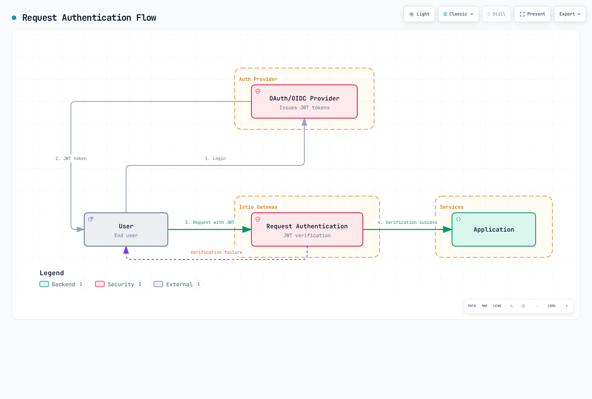

# Authentication

Istio supports service-to-service authentication (Peer Authentication) and end-user authentication (Request Authentication).

## Table of Contents

1. [Authentication Overview](#authentication-overview)
2. [Request Authentication (JWT)](#request-authentication-jwt)
3. [OAuth/OIDC Integration](#oauthoidc-integration)
4. [Practical Examples](#practical-examples)
5. [Troubleshooting](#troubleshooting)

## Authentication Overview

<p align="center">
  
</p>

Istio provides two types of authentication:

1. **Peer Authentication (Service-to-Service Authentication)**
   - Service-to-service authentication using mTLS
   - Identity verification based on SPIFFE ID
   - Configured with PeerAuthentication CRD

2. **Request Authentication (End-User Authentication)**
   - User authentication based on JWT tokens
   - Integration with OAuth/OIDC providers
   - Configured with RequestAuthentication CRD



[🔍 View interactive diagram](https://www.atomai.click/kubernetes-docs/archmaps/en-service-mesh-istio-security-02-authentication-0.html)

## Request Authentication (JWT)

### Basic JWT Verification

```yaml
apiVersion: security.istio.io/v1
kind: RequestAuthentication
metadata:
  name: jwt-auth
  namespace: default
spec:
  selector:
    matchLabels:
      app: myapp
  jwtRules:
  - issuer: "https://accounts.google.com"
    jwksUri: "https://www.googleapis.com/oauth2/v3/certs"
```

### Multiple Issuer Support

```yaml
apiVersion: security.istio.io/v1
kind: RequestAuthentication
metadata:
  name: multi-issuer-jwt
  namespace: default
spec:
  jwtRules:
  - issuer: "https://accounts.google.com"
    jwksUri: "https://www.googleapis.com/oauth2/v3/certs"
  - issuer: "https://login.microsoftonline.com/tenant-id/v2.0"
    jwksUri: "https://login.microsoftonline.com/tenant-id/discovery/v2.0/keys"
```

### Custom Header

```yaml
apiVersion: security.istio.io/v1
kind: RequestAuthentication
metadata:
  name: jwt-custom-header
  namespace: default
spec:
  jwtRules:
  - issuer: "https://auth.example.com"
    jwksUri: "https://auth.example.com/.well-known/jwks.json"
    fromHeaders:
    - name: "X-Auth-Token"
      prefix: "Bearer "
```

## OAuth/OIDC Integration

### AWS Cognito

```yaml
apiVersion: security.istio.io/v1
kind: RequestAuthentication
metadata:
  name: cognito-jwt
  namespace: default
spec:
  jwtRules:
  - issuer: "https://cognito-idp.{region}.amazonaws.com/{userPoolId}"
    jwksUri: "https://cognito-idp.{region}.amazonaws.com/{userPoolId}/.well-known/jwks.json"
```

### Keycloak

```yaml
apiVersion: security.istio.io/v1
kind: RequestAuthentication
metadata:
  name: keycloak-jwt
  namespace: default
spec:
  jwtRules:
  - issuer: "https://keycloak.example.com/auth/realms/myrealm"
    jwksUri: "https://keycloak.example.com/auth/realms/myrealm/protocol/openid-connect/certs"
```

### Auth0

```yaml
apiVersion: security.istio.io/v1
kind: RequestAuthentication
metadata:
  name: auth0-jwt
  namespace: default
spec:
  jwtRules:
  - issuer: "https://your-tenant.auth0.com/"
    jwksUri: "https://your-tenant.auth0.com/.well-known/jwks.json"
    audiences:
    - "https://your-api.example.com"
```

## Practical Examples

### JWT Verification + Authorization

```yaml
# JWT Verification
apiVersion: security.istio.io/v1
kind: RequestAuthentication
metadata:
  name: jwt-auth
  namespace: default
spec:
  selector:
    matchLabels:
      app: myapp
  jwtRules:
  - issuer: "https://auth.example.com"
    jwksUri: "https://auth.example.com/.well-known/jwks.json"
---
# Deny requests without JWT
apiVersion: security.istio.io/v1
kind: AuthorizationPolicy
metadata:
  name: require-jwt
  namespace: default
spec:
  selector:
    matchLabels:
      app: myapp
  action: DENY
  rules:
  - from:
    - source:
        notRequestPrincipals: ["*"]
```

## Troubleshooting

### JWT Verification Failure

```bash
# 1. Check RequestAuthentication
kubectl get requestauthentication -A
kubectl describe requestauthentication <name> -n <namespace>

# 2. Decode JWT token
echo "<jwt-token>" | cut -d'.' -f2 | base64 -d | jq

# 3. Verify JWKS endpoint
curl https://auth.example.com/.well-known/jwks.json

# 4. Check Envoy logs
kubectl logs <pod-name> -c istio-proxy -n <namespace> | grep JWT
```

## References

- [Istio Request Authentication](https://istio.io/latest/docs/reference/config/security/request_authentication/)
- [JWT Authentication](https://istio.io/latest/docs/tasks/security/authentication/authn-policy/)
