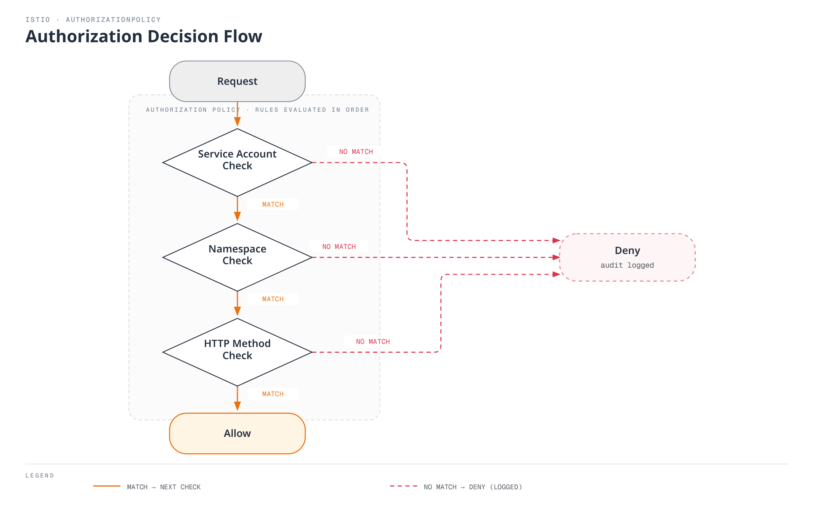

# Authorization

AuthorizationPolicy allows you to finely control service access permissions.

## Table of Contents

1. [Authorization Overview](#authorization-overview)
2. [Basic Policies](#basic-policies)
3. [Advanced Policies](#advanced-policies)
4. [Practical Examples](#practical-examples)
5. [Best Practices](#best-practices)

## Authorization Overview

<p align="center">
  
</p>

Istio AuthorizationPolicy provides fine-grained access control for services. The diagram above shows how Authorization Policy works:

1. **Request Reception**: Envoy receives inbound request
2. **Policy Evaluation**: AuthorizationPolicy rules are evaluated in order
3. **Access Decision**: ALLOW, DENY, or CUSTOM action is applied
4. **Audit Logging**: All decisions are recorded

**Supported Conditions**:
- **Source**: Request origin (ServiceAccount, Namespace, IP)
- **Operation**: HTTP method, path, port
- **Conditions**: Custom conditions (headers, JWT claims, etc.)



## Basic Policies

### Default Deny (Deny All)

```yaml
apiVersion: security.istio.io/v1
kind: AuthorizationPolicy
metadata:
  name: deny-all
  namespace: default
spec:
  action: DENY
  rules:
  - {}  # Deny all requests
```

### Default Allow (Allow All)

```yaml
apiVersion: security.istio.io/v1
kind: AuthorizationPolicy
metadata:
  name: allow-all
  namespace: default
spec:
  action: ALLOW
  rules:
  - {}  # Allow all requests
```

### HTTP Method Based

```yaml
apiVersion: security.istio.io/v1
kind: AuthorizationPolicy
metadata:
  name: httpbin-get-only
  namespace: default
spec:
  selector:
    matchLabels:
      app: httpbin
  action: ALLOW
  rules:
  - to:
    - operation:
        methods: ["GET"]  # Allow only GET
```

## Advanced Policies

### Service Account Based

```yaml
apiVersion: security.istio.io/v1
kind: AuthorizationPolicy
metadata:
  name: ratings-sa-policy
  namespace: default
spec:
  selector:
    matchLabels:
      app: ratings
  action: ALLOW
  rules:
  - from:
    - source:
        principals: ["cluster.local/ns/default/sa/reviews"]  # Allow only reviews SA
```

### Namespace Based

```yaml
apiVersion: security.istio.io/v1
kind: AuthorizationPolicy
metadata:
  name: db-namespace-policy
  namespace: database
spec:
  selector:
    matchLabels:
      app: postgresql
  action: ALLOW
  rules:
  - from:
    - source:
        namespaces: ["production", "staging"]  # Specific namespaces only
```

### Path Based

```yaml
apiVersion: security.istio.io/v1
kind: AuthorizationPolicy
metadata:
  name: path-based-policy
  namespace: default
spec:
  selector:
    matchLabels:
      app: api
  action: ALLOW
  rules:
  - to:
    - operation:
        paths: ["/api/public/*"]  # Allow only public API
  - from:
    - source:
        principals: ["cluster.local/ns/default/sa/admin"]
    to:
    - operation:
        paths: ["/api/admin/*"]  # admin SA can access admin API
```

### JWT Claims Based

```yaml
apiVersion: security.istio.io/v1
kind: AuthorizationPolicy
metadata:
  name: jwt-claims-policy
  namespace: default
spec:
  selector:
    matchLabels:
      app: myapp
  action: ALLOW
  rules:
  - when:
    - key: request.auth.claims[role]
      values: ["admin", "superuser"]  # role claim is admin or superuser
```

## References

- [Istio Authorization Policy](https://istio.io/latest/docs/reference/config/security/authorization-policy/)
- [Authorization Examples](https://istio.io/latest/docs/tasks/security/authorization/)
