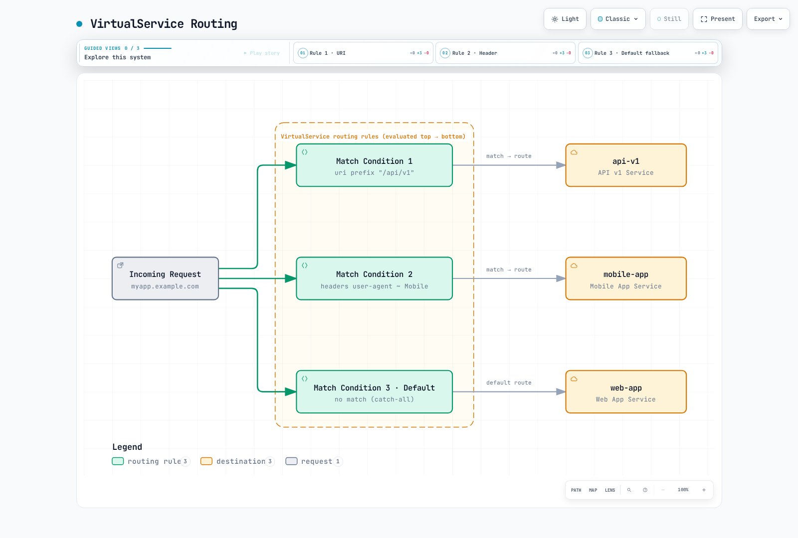

# Routing

Istio's advanced routing features allow fine-grained control over traffic based on various request attributes.

## Table of Contents

1. [Routing Overview](#routing-overview)
2. [Match Conditions](#match-conditions)
3. [URI-based Routing](#uri-based-routing)
4. [Header-based Routing](#header-based-routing)
5. [Query Parameter-based Routing](#query-parameter-based-routing)
6. [HTTP Method-based Routing](#http-method-based-routing)
7. [Source-based Routing](#source-based-routing)
8. [Priority and Fallback](#priority-and-fallback)
9. [Practical Examples](#practical-examples)
10. [Troubleshooting](#troubleshooting)

## Routing Overview

These are independent sidecar routing examples. Create the named Services and subsets, and apply only one overlapping VirtualService per host. Without `gateways`, routes apply to mesh sidecars; external-host ingress examples also need an existing Gateway binding and matching hostname. Headers, query parameters, and source workload labels are routing inputs, not proof of user identity. Enforce tenant/user permissions with authentication and AuthorizationPolicy.

VirtualService routing rules consist of **Match conditions** and **Route destinations**.



[🔍 View interactive diagram](https://www.atomai.click/kubernetes-docs/archmaps/en-service-mesh-istio-traffic-management-02-routing-0.html)

### Basic Structure

```yaml
apiVersion: networking.istio.io/v1
kind: VirtualService
metadata:
  name: routing-example
spec:
  hosts:
  - myapp.example.com
  http:
  - match:
    - uri:
        prefix: "/api/v1"
    route:
    - destination:
        host: api-v1
  - match:
    - headers:
        user-agent:
          regex: ".*Mobile.*"
    route:
    - destination:
        host: mobile-app
  - route:  # Default route (no match)
    - destination:
        host: web-app
```

## Match Conditions

### Match Condition Types

| Condition | Description | Match Type |
|-----------|-------------|------------|
| **uri** | Request path | `exact`, `prefix`, `regex` |
| **scheme** | HTTP/HTTPS | `exact`, `prefix`, `regex` |
| **method** | HTTP method | `exact`, `prefix`, `regex` |
| **authority** | Host header | `exact`, `prefix`, `regex` |
| **headers** | HTTP headers | `exact`, `prefix`, `regex` |
| **queryParams** | Query parameters | `exact`, `prefix`, `regex` |
| **sourceLabels** | Source workload labels | Label selector |
| **gateways** | Gateway name | List |

### Match Types

```yaml
# exact: Exact match
match:
- uri:
    exact: "/login"
```

```yaml
# prefix: Prefix match
match:
- uri:
    prefix: "/api/"
```

```yaml
# regex: Regular expression match
match:
- uri:
    regex: "^/api/v[0-9]+/.*"
```

### Combining Multiple Conditions

```yaml
# AND condition: All conditions must match
http:
- match:
  - uri:
      prefix: "/api"
    headers:
      x-api-version:
        exact: "v2"
    queryParams:
      debug:
        exact: "true"
  route:
  - destination:
      host: api-debug
```

```yaml
# OR condition: Use multiple match blocks
http:
- match:
  - uri:
      prefix: "/api/v1"
  - uri:
      prefix: "/api/v2"
  route:
  - destination:
      host: api-service
```

## URI-based Routing

### Prefix Matching

```yaml
apiVersion: networking.istio.io/v1
kind: VirtualService
metadata:
  name: uri-prefix-routing
spec:
  hosts:
  - myapp.example.com
  http:
  # API traffic
  - match:
    - uri:
        prefix: "/api/"
    route:
    - destination:
        host: api-service
        port:
          number: 8080

  # Admin traffic
  - match:
    - uri:
        prefix: "/admin/"
    route:
    - destination:
        host: admin-service
        port:
          number: 9000

  # Static files
  - match:
    - uri:
        prefix: "/static/"
    route:
    - destination:
        host: static-service
        port:
          number: 8000

  # Default traffic
  - route:
    - destination:
        host: frontend-service
        port:
          number: 3000
```

### Exact Matching

```yaml
apiVersion: networking.istio.io/v1
kind: VirtualService
metadata:
  name: uri-exact-routing
spec:
  hosts:
  - myapp.example.com
  http:
  # Login page
  - match:
    - uri:
        exact: "/login"
    route:
    - destination:
        host: auth-service

  # Logout
  - match:
    - uri:
        exact: "/logout"
    route:
    - destination:
        host: auth-service

  # Health check
  - match:
    - uri:
        exact: "/health"
    route:
    - destination:
        host: health-service
```

### Regex Matching

```yaml
apiVersion: networking.istio.io/v1
kind: VirtualService
metadata:
  name: uri-regex-routing
spec:
  hosts:
  - myapp.example.com
  http:
  # API version routing: /api/v1/, /api/v2/, etc.
  - match:
    - uri:
        regex: "^/api/v[0-9]+/.*"
    route:
    - destination:
        host: api-service

  # Numeric resource ID: /users/123
  - match:
    - uri:
        regex: "^/users/[0-9]+$"
    route:
    - destination:
        host: user-service

  # File extension: .jpg, .png, .gif
  - match:
    - uri:
        regex: ".*\\.(jpg|png|gif)$"
    route:
    - destination:
        host: image-service
```

## Header-based Routing

### User-Agent-based Routing

```yaml
apiVersion: networking.istio.io/v1
kind: VirtualService
metadata:
  name: header-user-agent-routing
spec:
  hosts:
  - reviews
  http:
  # Tablet devices
  - match:
    - headers:
        user-agent:
          regex: ".*(iPad|Tablet).*"
    route:
    - destination:
        host: reviews
        subset: tablet

  # Mobile devices
  - match:
    - headers:
        user-agent:
          regex: ".*Mobile.*"
    route:
    - destination:
        host: reviews
        subset: mobile

  # Desktop (default)
  - route:
    - destination:
        host: reviews
        subset: desktop
```

### Custom Header-based Routing

```yaml
apiVersion: networking.istio.io/v1
kind: VirtualService
metadata:
  name: header-custom-routing
spec:
  hosts:
  - myapp
  http:
  # Developer/Tester routing
  - match:
    - headers:
        x-dev-user:
          exact: "true"
    route:
    - destination:
        host: myapp
        subset: dev

  # Beta testers
  - match:
    - headers:
        x-beta-tester:
          exact: "true"
    route:
    - destination:
        host: myapp
        subset: beta

  # VIP users
  - match:
    - headers:
        x-user-tier:
          exact: "vip"
    route:
    - destination:
        host: myapp
        subset: vip

  # Regular users
  - route:
    - destination:
        host: myapp
        subset: stable
```

### API Version-based Routing

```yaml
apiVersion: networking.istio.io/v1
kind: VirtualService
metadata:
  name: header-api-version-routing
spec:
  hosts:
  - api.example.com
  http:
  # API v3
  - match:
    - headers:
        x-api-version:
          exact: "v3"
    route:
    - destination:
        host: api-service
        subset: v3

  # API v2
  - match:
    - headers:
        x-api-version:
          exact: "v2"
    route:
    - destination:
        host: api-service
        subset: v2

  # API v1 (default)
  - route:
    - destination:
        host: api-service
        subset: v1
```

## Query Parameter-based Routing

### Basic Query Parameter Matching

```yaml
apiVersion: networking.istio.io/v1
kind: VirtualService
metadata:
  name: query-param-routing
spec:
  hosts:
  - search.example.com
  http:
  # Debug mode: ?debug=true
  - match:
    - queryParams:
        debug:
          exact: "true"
    route:
    - destination:
        host: search-service
        subset: debug

  # Premium search: ?premium=1
  - match:
    - queryParams:
        premium:
          exact: "1"
    route:
    - destination:
        host: search-service
        subset: premium

  # A/B testing: ?variant=b
  - match:
    - queryParams:
        variant:
          exact: "b"
    route:
    - destination:
        host: search-service
        subset: variant-b

  # Default search
  - route:
    - destination:
        host: search-service
        subset: standard
```

### Combining Multiple Query Parameters

```yaml
apiVersion: networking.istio.io/v1
kind: VirtualService
metadata:
  name: query-param-combined-routing
spec:
  hosts:
  - api.example.com
  http:
  # Debug mode + verbose logging
  - match:
    - queryParams:
        debug:
          exact: "true"
        verbose:
          exact: "true"
    route:
    - destination:
        host: api-service
        subset: debug-verbose

  # Debug mode only
  - match:
    - queryParams:
        debug:
          exact: "true"
    route:
    - destination:
        host: api-service
        subset: debug

  # Normal mode
  - route:
    - destination:
        host: api-service
        subset: production
```

## HTTP Method-based Routing

```yaml
apiVersion: networking.istio.io/v1
kind: VirtualService
metadata:
  name: method-based-routing
spec:
  hosts:
  - api.example.com
  http:
  # POST requests → Write-only service
  - match:
    - method:
        exact: "POST"
      uri:
        prefix: "/api/"
    route:
    - destination:
        host: api-write-service

  # PUT/PATCH requests → Update service
  - match:
    - method:
        regex: "PUT|PATCH"
      uri:
        prefix: "/api/"
    route:
    - destination:
        host: api-update-service

  # DELETE requests → Delete service
  - match:
    - method:
        exact: "DELETE"
      uri:
        prefix: "/api/"
    route:
    - destination:
        host: api-delete-service

  # GET requests → Read-only service
  - match:
    - method:
        exact: "GET"
      uri:
        prefix: "/api/"
    route:
    - destination:
        host: api-read-service
```

## Source-based Routing

`sourceLabels` and `sourceNamespace` select which source sidecars receive configuration; they are not per-request authenticated matches at an ingress gateway. An explicit top-level gateway list must include `mesh` for these selectors to apply. The database example assumes an HTTP-facing service, not an opaque SQL protocol.

### Namespace-based Routing

```yaml
apiVersion: networking.istio.io/v1
kind: VirtualService
metadata:
  name: source-namespace-routing
  namespace: production
spec:
  hosts:
  - database.production.svc.cluster.local
  http:
  # Requests from production namespace
  - match:
    - sourceNamespace: production
    route:
    - destination:
        host: database
        subset: production

  # Requests from staging namespace
  - match:
    - sourceNamespace: staging
    route:
    - destination:
        host: database
        subset: staging

  # Illustrative HTTP rejection; enforce identity policy at the destination
  - directResponse:
      status: 403
```

### Source Workload Label-based Routing

```yaml
apiVersion: networking.istio.io/v1
kind: VirtualService
metadata:
  name: source-sa-routing
spec:
  hosts:
  - payment-service
  http:
  # Select configuration for matching source workload labels
  - match:
    - sourceLabels:
        app: frontend
        version: v2
    route:
    - destination:
        host: payment-service
        subset: v2

  # Legacy service
  - match:
    - sourceLabels:
        app: frontend
        version: v1
    route:
    - destination:
        host: payment-service
        subset: v1
```

## Priority and Fallback

### Match Rule Priority

Istio evaluates VirtualService HTTP routing rules **from top to bottom**.

```yaml
apiVersion: networking.istio.io/v1
kind: VirtualService
metadata:
  name: priority-example
spec:
  hosts:
  - myapp.example.com
  http:
  # Priority 1: Most specific condition
  - match:
    - uri:
        exact: "/api/v2/users/admin"
      headers:
        x-admin:
          exact: "true"
    route:
    - destination:
        host: admin-api-v2

  # Priority 2: Medium specificity
  - match:
    - uri:
        prefix: "/api/v2/"
    route:
    - destination:
        host: api-v2

  # Priority 3: Less specific
  - match:
    - uri:
        prefix: "/api/"
    route:
    - destination:
        host: api-v1

  # Priority 4 (last): Default fallback
  - route:
    - destination:
        host: frontend
```

### Fallback Strategy

Fallback here means the final unmatched-request route. Once a route matches, an upstream failure does not restart rule evaluation at the next route. Configure retries/outlier detection or a rollout controller separately for failure recovery.

```yaml
apiVersion: networking.istio.io/v1
kind: VirtualService
metadata:
  name: fallback-strategy
spec:
  hosts:
  - myapp
  http:
  # Requests matching specific conditions
  - match:
    - headers:
        x-canary:
          exact: "true"
    route:
    - destination:
        host: myapp
        subset: canary
    # No fallback on canary failure - return error

  # Default route for requests that did not match the canary condition
  - route:
    - destination:
        host: myapp
        subset: stable
      weight: 100
```

## Practical Examples

### Example 1: Multi-tenant Routing

```yaml
apiVersion: networking.istio.io/v1
kind: VirtualService
metadata:
  name: multi-tenant-routing
spec:
  hosts:
  - api.example.com
  - tenant-b.api.example.com
  http:
  # Tenant A (identified by header)
  - match:
    - headers:
        x-tenant-id:
          exact: "tenant-a"
    route:
    - destination:
        host: api-service
        subset: tenant-a

  # Tenant B (identified by subdomain)
  - match:
    - authority:
        exact: "tenant-b.api.example.com"
    route:
    - destination:
        host: api-service
        subset: tenant-b

  # Tenant C (identified by path)
  - match:
    - uri:
        prefix: "/tenant-c/"
    rewrite:
      uri: "/"
    route:
    - destination:
        host: api-service
        subset: tenant-c
```

### Example 2: Feature Flag-based Routing

```yaml
apiVersion: networking.istio.io/v1
kind: VirtualService
metadata:
  name: feature-flag-routing
spec:
  hosts:
  - myapp
  http:
  # Users with new feature enabled
  - match:
    - headers:
        x-feature-new-ui:
          exact: "enabled"
    route:
    - destination:
        host: myapp
        subset: new-ui

  # Beta feature testers
  - match:
    - headers:
        x-feature-beta:
          exact: "enabled"
    route:
    - destination:
        host: myapp
        subset: beta

  # Workloads labeled role=employee with the feature header
  - match:
    - headers:
        x-feature-experimental:
          exact: "enabled"
      sourceLabels:
        role: employee
    route:
    - destination:
        host: myapp
        subset: experimental

  # Default (stable version)
  - route:
    - destination:
        host: myapp
        subset: stable
```

### Example 3: Geographic Routing

```yaml
apiVersion: networking.istio.io/v1
kind: VirtualService
metadata:
  name: geo-routing
spec:
  hosts:
  - content.example.com
  http:
  # Korean users
  - match:
    - headers:
        x-country-code:
          exact: "KR"
    route:
    - destination:
        host: content-service
        subset: korea

  # Japanese users
  - match:
    - headers:
        x-country-code:
          exact: "JP"
    route:
    - destination:
        host: content-service
        subset: japan

  # US users
  - match:
    - headers:
        x-country-code:
          exact: "US"
    route:
    - destination:
        host: content-service
        subset: us

  # European users
  - match:
    - headers:
        x-country-code:
          regex: "DE|FR|GB|IT|ES"
    route:
    - destination:
        host: content-service
        subset: europe

  # Other regions (global)
  - route:
    - destination:
        host: content-service
        subset: global
```

### Example 4: API Gateway Pattern

Bind `api-gateway` to the real gateway and apply [JWT authentication plus authorization](../security/02-authentication.md) to protected paths before exposure. Matching the text `Bearer ...` does not validate a token. A protected path must not fall through to a public/general route when its credential is missing. Geo/tenant headers must come from a trusted, authenticated source if they influence access decisions.

```yaml
apiVersion: networking.istio.io/v1
kind: VirtualService
metadata:
  name: api-gateway-routing
spec:
  hosts:
  - api.example.com
  gateways:
  - api-gateway
  http:
  # Route protected paths; JWT/authorization must be enforced separately
  - match:
    - uri:
        prefix: "/api/v1/protected/"
    route:
    - destination:
        host: protected-api-service

  # Public APIs
  - match:
    - uri:
        prefix: "/api/v1/public/"
    route:
    - destination:
        host: public-api-service

  # GraphQL endpoint
  - match:
    - uri:
        exact: "/graphql"
      method:
        exact: "POST"
    route:
    - destination:
        host: graphql-service

  # REST API
  - match:
    - uri:
        prefix: "/api/v1/"
    route:
    - destination:
        host: rest-api-service

  # Health check
  - match:
    - uri:
        exact: "/health"
    route:
    - destination:
        host: health-service

  # 404 response for unmatched paths
  - directResponse:
      status: 404
```

## Troubleshooting

### Routing Not Working

```bash
# 1. Check VirtualService status
kubectl get virtualservice -A
kubectl describe virtualservice <name> -n <namespace>

# 2. Check routing rules
istioctl proxy-config routes <pod-name> -n <namespace>

# 3. Check routing to specific service
istioctl proxy-config routes <pod-name> -n <namespace> --name <route-name> -o json

# 4. Validate configuration
istioctl analyze -n <namespace>
```

### Debugging Match Conditions

```bash
# Increase Envoy log level
istioctl proxy-config log <pod-name> -n <namespace> --level debug

# Trace requests
kubectl logs -n <namespace> <pod-name> -c istio-proxy -f

# Debug Pilot
kubectl logs -n istio-system -l app=istiod --tail=100
```

### Common Issues

#### 1. Match Order Issues

```yaml
# ❌ Wrong order - default route first ignores other rules
http:
- route:  # All traffic goes here
  - destination:
      host: myapp
- match:  # Never executed
  - uri:
      prefix: "/api"
  route:
  - destination:
      host: api-service
```

```yaml
# ✅ Correct order
http:
- match:  # Specific rules first
  - uri:
      prefix: "/api"
  route:
  - destination:
      host: api-service
- route:  # Default route last
  - destination:
      host: myapp
```

#### 2. Regex Matching Scope

RE2 matches the complete string. `/api/v[1-3]` is valid syntax and matches `/api/v1`, but not `/api/v1/users`; `/` does not need escaping. For both the version root and descendant paths:

```yaml
match:
- uri:
    regex: "^/api/v[1-3](/.*)?$"
```

#### 3. Header Names

HTTP header names are case-insensitive on the wire, but Istio match-map keys must be lowercase. Header values remain case-sensitive unless the expression says otherwise.

```yaml
match:
- headers:
    x-custom-header:
      exact: "value"
```

## Best Practices

### 1. Place Specific Rules First

```yaml
# ✅ Good example
http:
- match:
  - uri:
      exact: "/api/v2/admin"  # Most specific
  route:
  - destination:
      host: admin-v2
- match:
  - uri:
      prefix: "/api/v2/"  # Medium
  route:
  - destination:
      host: api-v2
- match:
  - uri:
      prefix: "/api/"  # General
  route:
  - destination:
      host: api-v1
- route:  # Default
  - destination:
      host: frontend
```

### 2. Minimize Regular Expressions

```yaml
# ❌ Avoid - complex regex degrades performance
match:
- uri:
    regex: "^/(api|admin|public)/v[0-9]+/(users|products|orders)/[a-zA-Z0-9_-]+$"
```

```yaml
# ✅ Recommended - use prefix or exact
match:
- uri:
    prefix: "/api/v1/"
```

### 3. Clear Naming

```yaml
# ✅ Use clear names
apiVersion: networking.istio.io/v1
kind: VirtualService
metadata:
  name: product-api-routing  # Clear name
  labels:
    app: product-service
    purpose: routing
spec:
  hosts:
  - product-api.example.com
  http:
  - route:
    - destination:
        host: product-api-service
```

### 4. Documentation

```yaml
apiVersion: networking.istio.io/v1
kind: VirtualService
metadata:
  name: myapp-routing
  annotations:
    description: "Routes traffic based on API version and user type"
    owner: "platform-team"
spec:
  hosts:
  - myapp.example.com
  http:
  # Route VIP users to dedicated instance
  - match:
    - headers:
        x-user-tier:
          exact: "vip"
    route:
    - destination:
        host: myapp
        subset: vip
```

### 5. Testing Strategy

Set GATEWAY_URL to the installed ingress address/port and adapt Host and headers to the single example currently deployed. The mesh-only examples must first be bound to that gateway for these external curl tests. Restore any temporary proxy debug log level after investigation.

```bash
# Routing rule test script
#!/bin/bash

# API v1 test
curl -H "Host: api.example.com" http://$GATEWAY_URL/api/v1/users

# API v2 test
curl -H "Host: api.example.com" http://$GATEWAY_URL/api/v2/users

# Mobile user test
curl -H "Host: myapp.example.com" -H "User-Agent: Mobile" "http://$GATEWAY_URL/"

# Header-based test
curl -H "Host: myapp.example.com" -H "x-canary: true" "http://$GATEWAY_URL/"
```

## References

- [Istio Traffic Management](https://istio.io/latest/docs/concepts/traffic-management/)
- [VirtualService Reference](https://istio.io/latest/docs/reference/config/networking/virtual-service/)
- [HTTP Route Matching](https://istio.io/latest/docs/reference/config/networking/virtual-service/#HTTPMatchRequest)
- [Traffic Routing](https://istio.io/latest/docs/tasks/traffic-management/request-routing/)
