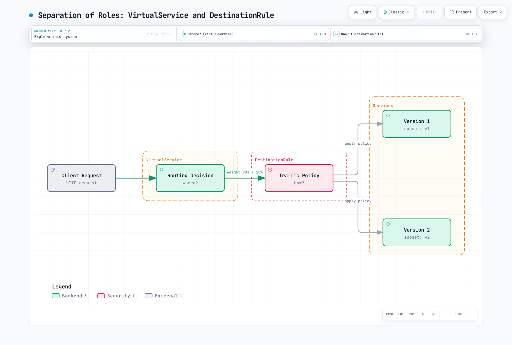
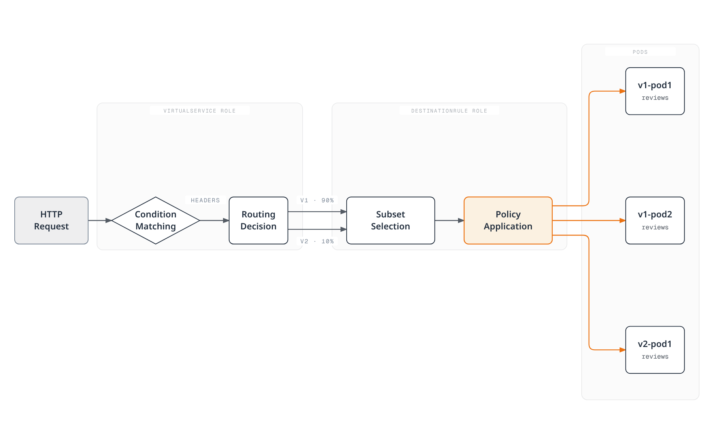
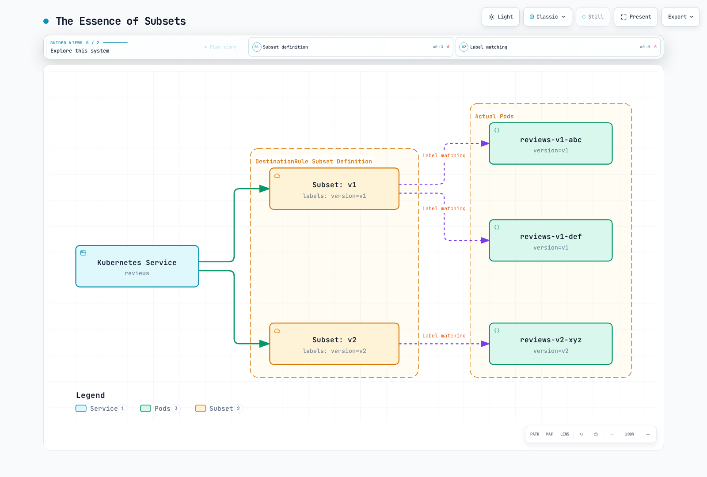
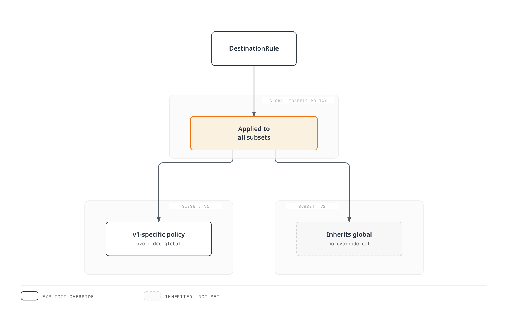

# DestinationRule

> **Reviewed Version**: Istio 1.31.0
> **API Version**: `networking.istio.io/v1`
> **Last Updated**: September 11, 2026

DestinationRule is a core Istio resource that defines how to handle traffic after VirtualService routes it to the destination.

## Table of Contents

1. [What is DestinationRule?](#what-is-destinationrule)
2. [VirtualService vs DestinationRule](#virtualservice-vs-destinationrule)
3. [Subset Concept](#subset-concept)
4. [Basic Structure](#basic-structure)
5. [Defining Subsets](#defining-subsets)
6. [Traffic Policy Overview](#traffic-policy-overview)
7. [Using with VirtualService](#using-with-virtualservice)
8. [Practical Examples](#practical-examples)
9. [Best Practices](#best-practices)
10. [Troubleshooting](#troubleshooting)

## What is DestinationRule?

The examples are independent sidecar configuration patterns. DestinationRule and VirtualService are configuration inputs compiled by istiod, not separate traffic-processing hops. DestinationRule also applies when no VirtualService exists. Subsets only select endpoints already discovered for the Service; they do not create workloads, isolate environments, or assign traffic percentages. Use matching pod-template labels and explicit routes to subsets.

DestinationRule defines **traffic policies after routing**. If VirtualService determines "where" to send traffic, DestinationRule determines "how" to handle it.



[🔍 View interactive diagram](https://www.atomai.click/kubernetes-docs/archmaps/en-service-mesh-istio-traffic-management-03-destination-rule-0.html)

### Key Roles of DestinationRule

| Role | Description | Example |
|------|-------------|---------|
| **Subset Definition** | Group service versions | v1, v2, canary, stable |
| **Load Balancing** | Load distribution algorithm | ROUND_ROBIN, LEAST_REQUEST |
| **Connection Pool** | Connection pool settings | Max connections, Timeout |
| **Circuit Breaker** | Failure isolation | Outlier Detection |
| **TLS Settings** | Encryption policy | mTLS, SIMPLE TLS |

## VirtualService vs DestinationRule

These two resources work together to provide complete traffic management.

### Role Comparison



[🔍 View interactive diagram](https://www.atomai.click/kubernetes-docs/archmaps/en-service-mesh-istio-traffic-management-03-destination-rule-1.html)

### Separation of Responsibilities

**VirtualService (Where?)**:
```yaml
apiVersion: networking.istio.io/v1
kind: VirtualService
metadata:
  name: reviews
spec:
  hosts:
  - reviews
  http:
  - match:
    - headers:
        end-user:
          exact: jason
    route:
    - destination:
        host: reviews
        subset: v2  # ← References subset from DestinationRule
  - route:
    - destination:
        host: reviews
        subset: v1  # ← References subset from DestinationRule
```

**DestinationRule (How?)**:
```yaml
apiVersion: networking.istio.io/v1
kind: DestinationRule
metadata:
  name: reviews
spec:
  host: reviews
  trafficPolicy:  # ← Default policy applied to all subsets
    loadBalancer:
      simple: LEAST_REQUEST
  subsets:  # ← Subset definitions referenced by VirtualService
  - name: v1
    labels:
      version: v1
  - name: v2
    labels:
      version: v2
    trafficPolicy:  # ← Policy applied only to v2
      loadBalancer:
        simple: ROUND_ROBIN
```

## Subset Concept

A Subset defines a **logical group** of a service. It's typically distinguished by version, deployment stage, region, etc.

### The Essence of Subsets



[🔍 View interactive diagram](https://www.atomai.click/kubernetes-docs/archmaps/en-service-mesh-istio-traffic-management-03-destination-rule-2.html)

### Subset Use Cases

#### 1. Version-based Routing

```yaml
apiVersion: networking.istio.io/v1
kind: DestinationRule
metadata:
  name: reviews-versions
spec:
  host: reviews
  subsets:
  - name: v1
    labels:
      version: v1
  - name: v2
    labels:
      version: v2
  - name: v3
    labels:
      version: v3
```

```yaml
# Pod-template label excerpt
metadata:
  labels:
    app: reviews
    version: v1  # ← Matches Subset
```

#### 2. Deployment Stage Separation

```yaml
apiVersion: networking.istio.io/v1
kind: DestinationRule
metadata:
  name: reviews-deployment-stages
spec:
  host: reviews
  subsets:
  - name: stable
    labels:
      stage: stable
  - name: canary
    labels:
      stage: canary
  - name: test
    labels:
      stage: test
```

#### 3. Regional Separation

```yaml
apiVersion: networking.istio.io/v1
kind: DestinationRule
metadata:
  name: api-regions
spec:
  host: api-service
  subsets:
  - name: us-west
    labels:
      region: us-west
  - name: us-east
    labels:
      region: us-east
  - name: eu-central
    labels:
      region: eu-central
```

#### 4. Environment Separation

```yaml
apiVersion: networking.istio.io/v1
kind: DestinationRule
metadata:
  name: payment-environments
spec:
  host: payment-service
  subsets:
  - name: production
    labels:
      env: production
  - name: staging
    labels:
      env: staging
```

## Basic Structure

### Required Fields

```yaml
apiVersion: networking.istio.io/v1
kind: DestinationRule
metadata:
  name: my-destination-rule
  namespace: default
spec:
  host: my-service  # Required: Target service
  subsets:          # Optional: Subset definitions
  - name: v1
    labels:
      version: v1
  trafficPolicy:    # Optional: Traffic policy
    loadBalancer:
      simple: ROUND_ROBIN
```

### Host Specification Methods

**1. Service Name (Same Namespace)**
```yaml
spec:
  host: reviews
```

**2. FQDN (Different Namespace)**
```yaml
spec:
  host: reviews.production.svc.cluster.local
```

**3. Wildcard**
```yaml
spec:
  host: "*.example.com"
```

**4. External Service (with ServiceEntry)**
```yaml
spec:
  host: api.external.com
```

## Defining Subsets

### Simple Subset

```yaml
apiVersion: networking.istio.io/v1
kind: DestinationRule
metadata:
  name: reviews-simple
spec:
  host: reviews
  subsets:
  - name: v1
    labels:
      version: v1
  - name: v2
    labels:
      version: v2
```

### Subset-specific Policies

```yaml
apiVersion: networking.istio.io/v1
kind: DestinationRule
metadata:
  name: reviews-subset-policies
spec:
  host: reviews
  trafficPolicy:  # Default policy (all subsets)
    loadBalancer:
      simple: LEAST_REQUEST
  subsets:
  - name: v1
    labels:
      version: v1
    # v1 uses default policy

  - name: v2
    labels:
      version: v2
    trafficPolicy:  # v2-only policy (overrides default)
      loadBalancer:
        simple: ROUND_ROBIN
      connectionPool:
        http:
          http1MaxPendingRequests: 10
```

### Complex Label Matching

```yaml
apiVersion: networking.istio.io/v1
kind: DestinationRule
metadata:
  name: api-complex
spec:
  host: api-service
  subsets:
  - name: us-west-v2
    labels:
      version: v2
      region: us-west
      tier: premium
  - name: us-east-v1
    labels:
      version: v1
      region: us-east
      tier: standard
```

## Traffic Policy Overview

The `trafficPolicy` in DestinationRule provides various traffic control features.

### Traffic Policy Hierarchy



[🔍 View interactive diagram](https://www.atomai.click/kubernetes-docs/archmaps/en-service-mesh-istio-traffic-management-03-destination-rule-3.html)

### Traffic Policy Components

#### 1. Load Balancer

```yaml
trafficPolicy:
  loadBalancer:
    simple: ROUND_ROBIN  # LEAST_REQUEST, RANDOM, PASSTHROUGH
```

See [Load Balancing](06-load-balancing.md) for details

#### 2. Connection Pool

```yaml
trafficPolicy:
  connectionPool:
    tcp:
      maxConnections: 100
    http:
      http1MaxPendingRequests: 50
      http2MaxRequests: 100
      maxRequestsPerConnection: 2
```

See [Circuit Breaker](07-circuit-breaker.md) for details

#### 3. Outlier Detection

```yaml
trafficPolicy:
  outlierDetection:
    consecutive5xxErrors: 5
    interval: 30s
    baseEjectionTime: 30s
    maxEjectionPercent: 50
```

See [Circuit Breaker](07-circuit-breaker.md) for details

#### 4. TLS Settings

```yaml
trafficPolicy:
  tls:
    mode: ISTIO_MUTUAL  # DISABLE, SIMPLE, MUTUAL
```

See [Security](../security/01-mtls.md) for details

#### 5. Port Level Settings

```yaml
trafficPolicy:
  portLevelSettings:
  - port:
      number: 80
    loadBalancer:
      simple: ROUND_ROBIN
  - port:
      number: 443
    tls:
      mode: SIMPLE
```

## Using with VirtualService

VirtualService and DestinationRule work together to provide complete traffic control.

### Basic Pattern: Canary Deployment

For a live rollout, apply the DestinationRule first, confirm its new subset appears in proxy cluster configuration, then update the VirtualService. A single multi-document apply does not guarantee propagation order. Remove route references before deleting a subset.

```yaml
# DestinationRule: Subset definition
apiVersion: networking.istio.io/v1
kind: DestinationRule
metadata:
  name: reviews
spec:
  host: reviews
  subsets:
  - name: v1
    labels:
      version: v1
  - name: v2
    labels:
      version: v2
---
# VirtualService: Traffic distribution
apiVersion: networking.istio.io/v1
kind: VirtualService
metadata:
  name: reviews
spec:
  hosts:
  - reviews
  http:
  - route:
    - destination:
        host: reviews
        subset: v1  # ← References DestinationRule subset
      weight: 90
    - destination:
        host: reviews
        subset: v2  # ← References DestinationRule subset
      weight: 10
```

### Header-based Routing

```yaml
# DestinationRule
apiVersion: networking.istio.io/v1
kind: DestinationRule
metadata:
  name: reviews
spec:
  host: reviews
  subsets:
  - name: v1
    labels:
      version: v1
  - name: v2
    labels:
      version: v2
---
# VirtualService
apiVersion: networking.istio.io/v1
kind: VirtualService
metadata:
  name: reviews
spec:
  hosts:
  - reviews
  http:
  # Developers use v2
  - match:
    - headers:
        x-dev-user:
          exact: "true"
    route:
    - destination:
        host: reviews
        subset: v2
  # Regular users use v1
  - route:
    - destination:
        host: reviews
        subset: v1
```

### URI-based Routing + Subset-specific Policies

```yaml
# DestinationRule: Different policies per subset
apiVersion: networking.istio.io/v1
kind: DestinationRule
metadata:
  name: api-service
spec:
  host: api-service
  subsets:
  - name: v1
    labels:
      version: v1
    trafficPolicy:
      loadBalancer:
        simple: ROUND_ROBIN
  - name: v2
    labels:
      version: v2
    trafficPolicy:
      loadBalancer:
        simple: LEAST_REQUEST
      connectionPool:
        http:
          http1MaxPendingRequests: 10
---
# VirtualService: URI-based routing
apiVersion: networking.istio.io/v1
kind: VirtualService
metadata:
  name: api-service
spec:
  hosts:
  - api-service
  http:
  - match:
    - uri:
        prefix: "/api/v2"
    route:
    - destination:
        host: api-service
        subset: v2
  - route:
    - destination:
        host: api-service
        subset: v1
```

## Practical Examples

### Example 1: Microservice Version Management

```yaml
apiVersion: networking.istio.io/v1
kind: DestinationRule
metadata:
  name: reviews-versions
  namespace: production
spec:
  host: reviews
  trafficPolicy:
    loadBalancer:
      simple: LEAST_REQUEST
    connectionPool:
      tcp:
        maxConnections: 100
      http:
        http1MaxPendingRequests: 50
        maxRequestsPerConnection: 2
  subsets:
  - name: v1
    labels:
      version: v1
  - name: v2
    labels:
      version: v2
  - name: v3
    labels:
      version: v3
```

**Use Cases**:
- v1: Stable version (most traffic)
- v2: Canary version (10% traffic)
- v3: Test version (developers only)

### Example 2: Multi-Region Deployment

This assumes the mesh can already discover and reach endpoints in each region. Custom `region` pod labels select subsets; node topology labels supply Envoy locality separately. Region subsets need explicit routing, and locality failover requires outlier detection plus healthy reachable capacity.

```yaml
apiVersion: networking.istio.io/v1
kind: DestinationRule
metadata:
  name: api-multi-region
spec:
  host: api-service
  trafficPolicy:
    loadBalancer:
      simple: LEAST_REQUEST
      localityLbSetting:
        enabled: true
  subsets:
  - name: us-west
    labels:
      region: us-west
    trafficPolicy:
      connectionPool:
        tcp:
          maxConnections: 1000
  - name: us-east
    labels:
      region: us-east
    trafficPolicy:
      connectionPool:
        tcp:
          maxConnections: 1000
  - name: eu-central
    labels:
      region: eu-central
    trafficPolicy:
      connectionPool:
        tcp:
          maxConnections: 500
```

### Example 3: Deployment Stage Policies

```yaml
apiVersion: networking.istio.io/v1
kind: DestinationRule
metadata:
  name: payment-service-stages
spec:
  host: payment-service
  subsets:
  # Production: Strict policy
  - name: production
    labels:
      stage: production
    trafficPolicy:
      connectionPool:
        tcp:
          maxConnections: 100
        http:
          http1MaxPendingRequests: 10
          maxRequestsPerConnection: 1
      outlierDetection:
        consecutive5xxErrors: 3
        interval: 10s
        baseEjectionTime: 60s

  # Canary: Moderate policy
  - name: canary
    labels:
      stage: canary
    trafficPolicy:
      connectionPool:
        tcp:
          maxConnections: 50
        http:
          http1MaxPendingRequests: 20
      outlierDetection:
        consecutive5xxErrors: 5
        interval: 30s
        baseEjectionTime: 30s

  # Staging: Lenient policy
  - name: staging
    labels:
      stage: staging
    trafficPolicy:
      connectionPool:
        tcp:
          maxConnections: 200
        http:
          http1MaxPendingRequests: 100
      outlierDetection:
        consecutive5xxErrors: 10
        interval: 60s
        baseEjectionTime: 30s
```

### Example 4: External Service Integration

```yaml
# ServiceEntry: Register external API
apiVersion: networking.istio.io/v1
kind: ServiceEntry
metadata:
  name: external-payment-api
spec:
  hosts:
  - api.payment-gateway.com
  ports:
  - number: 80
    name: http
    protocol: HTTP
    targetPort: 443
  location: MESH_EXTERNAL
  resolution: DNS
---
# DestinationRule: External API policy
apiVersion: networking.istio.io/v1
kind: DestinationRule
metadata:
  name: external-payment-api
spec:
  host: api.payment-gateway.com
  trafficPolicy:
    connectionPool:
      tcp:
        maxConnections: 10
      http:
        http1MaxPendingRequests: 5
        maxRequestsPerConnection: 1
    outlierDetection:
      consecutive5xxErrors: 3
      interval: 30s
      baseEjectionTime: 120s
    tls:
      mode: SIMPLE
      sni: api.payment-gateway.com
      subjectAltNames:
      - api.payment-gateway.com
```

This variant expects the application to send HTTP to the registered port 80; the sidecar originates verified TLS to port 443. Replace the example host with your endpoint. If the application already sends HTTPS, omit TLS origination and HTTP-only policy settings for that opaque TLS path to avoid double encryption.

### Example 5: Database Connection Pool

```yaml
apiVersion: networking.istio.io/v1
kind: DestinationRule
metadata:
  name: postgres-connection-pool
spec:
  host: postgres-primary
  trafficPolicy:
    connectionPool:
      tcp:
        maxConnections: 50  # DB connection limit
        connectTimeout: 5s
        tcpKeepalive:
          time: 7200s
          interval: 75s
    outlierDetection:
      consecutive5xxErrors: 3
      interval: 60s
      baseEjectionTime: 120s
  subsets:
  - name: primary
    labels:
      role: primary
  - name: replica
    labels:
      role: replica
    trafficPolicy:
      connectionPool:
        tcp:
          maxConnections: 100  # More for replicas
```

TCP connection limits above are applied by each proxy; they are not a global database connection budget. PostgreSQL does not use HTTP connection settings. Primary/replica subsets must both be present in the selected Service endpoints, and the application must choose read/write destinations correctly.

## Best Practices

### 1. Subset Naming Conventions

```yaml
# ✅ Good example: Meaningful names
subsets:
- name: v1
- name: v2
- name: stable
- name: canary
- name: us-west
- name: production
```

```yaml
# ❌ Bad example: Vague names
subsets:
- name: subset1
- name: test
- name: new
```

### 2. Default Policy + Override Pattern

```yaml
# ✅ Good example: Define default policy and override when needed
apiVersion: networking.istio.io/v1
kind: DestinationRule
metadata:
  name: reviews
spec:
  host: reviews
  trafficPolicy:  # Default policy
    loadBalancer:
      simple: LEAST_REQUEST
  subsets:
  - name: v1
    labels:
      version: v1
    # v1 uses default policy
  - name: v2
    labels:
      version: v2
    trafficPolicy:  # Override only for v2
      loadBalancer:
        simple: ROUND_ROBIN
```

### 3. Tune Failure Isolation

```yaml
# Tune outlierDetection for the service and failure model
apiVersion: networking.istio.io/v1
kind: DestinationRule
metadata:
  name: api-service
spec:
  host: api-service
  trafficPolicy:
    loadBalancer:
      simple: LEAST_REQUEST
    outlierDetection:  # Optional policy
      consecutive5xxErrors: 5
      interval: 30s
      baseEjectionTime: 30s
```

### 4. Connection Pool Settings

```yaml
# ✅ Connection Pool appropriate for service characteristics
apiVersion: networking.istio.io/v1
kind: DestinationRule
metadata:
  name: high-traffic-service
spec:
  host: api-gateway
  trafficPolicy:
    connectionPool:
      tcp:
        maxConnections: 1000
      http:
        http2MaxRequests: 1000
        maxRequestsPerConnection: 100
```

### 5. Gradual Rollout

```yaml
# ✅ Gradually increase canary ratio
# Step 1: 5%
apiVersion: networking.istio.io/v1
kind: VirtualService
metadata:
  name: reviews-canary-step1
spec:
  hosts:
  - reviews
  http:
  - route:
    - destination:
        host: reviews
        subset: v1
      weight: 95
    - destination:
        host: reviews
        subset: v2
      weight: 5

# Step 2: After monitoring, increase to 10%
# Step 3: 25% → 50% → 100%
```

### 6. Documentation

```yaml
apiVersion: networking.istio.io/v1
kind: DestinationRule
metadata:
  name: payment-service
  annotations:
    description: "Payment service traffic management"
    owner: "payments-team"
    subset-purpose: |
      - production: Main production traffic
      - canary: New version testing (10%)
      - staging: Pre-production testing
spec:
  host: payment-service
  # ...
```

## Troubleshooting

### Subset Not Working

**Symptom**:
```bash
# VirtualService exists but traffic isn't routed
kubectl get virtualservice reviews -o yaml
```

**Cause and Solution**:

```bash
# 1. Check DestinationRule
kubectl get destinationrule reviews -o yaml

# 2. Verify subset names match
# VirtualService: subset: v2
# DestinationRule: name: v2

# 3. Check pod labels
kubectl get pods --show-labels | grep reviews

# 4. Verify pods have version=v2 label
kubectl get deployment reviews-v2 -o jsonpath='{.spec.template.metadata.labels}'
```

### Traffic Policy Not Applied

```bash
# Check Envoy configuration
istioctl proxy-config clusters <pod-name> --fqdn reviews.default.svc.cluster.local -o json

# Check Circuit Breaker settings
istioctl proxy-config clusters <pod-name> -o json | jq '.[] | select(.name=="outbound|9080||reviews.default.svc.cluster.local") | .circuitBreakers'
```

### Subset Conflicts

Istio can merge applicable DestinationRule fragments for one host. The two distinct subsets below do not inherently conflict. Duplicate subset names use the first definition without merging, and multiple top-level trafficPolicy blocks also keep only the first processed one. Namespace lookup/visibility still matters; a single owner-managed rule is easier to reason about.

**Problem**:
```yaml
# Same-host DestinationRule fragments can merge with restrictions
apiVersion: networking.istio.io/v1
kind: DestinationRule
metadata:
  name: reviews-1
spec:
  host: reviews
  subsets:
  - name: v1
    labels:
      version: v1
---
# Unique subset names can merge; duplicate names/policies are the problem
apiVersion: networking.istio.io/v1
kind: DestinationRule
metadata:
  name: reviews-2
spec:
  host: reviews
  subsets:
  - name: v2
    labels:
      version: v2
```

**Solution**:
```yaml
# ✅ Define all subsets in one DestinationRule
apiVersion: networking.istio.io/v1
kind: DestinationRule
metadata:
  name: reviews
spec:
  host: reviews
  subsets:
  - name: v1
    labels:
      version: v1
  - name: v2
    labels:
      version: v2
```

### istioctl Analysis

```bash
# Validate DestinationRule
istioctl analyze

# Specific namespace
istioctl analyze -n production

# Example output
# Inspect actual analyzer messages and confirm subset clusters in proxy-config output
```

## Next Steps

After understanding DestinationRule, move on to these topics:

1. **[Traffic Splitting](04-traffic-splitting.md)**: Canary, Blue/Green deployments
2. **[Load Balancing](06-load-balancing.md)**: Various algorithms and policies
3. **[Circuit Breaker](07-circuit-breaker.md)**: Failure isolation and resilience
4. **[Retry and Timeout](05-retry-timeout.md)**: Retry and timeout settings

## References

- [Istio DestinationRule Reference](https://istio.io/latest/docs/reference/config/networking/destination-rule/)
- [Istio Traffic Management](https://istio.io/latest/docs/concepts/traffic-management/)
- [Envoy Cluster Configuration](https://www.envoyproxy.io/docs/envoy/latest/intro/arch_overview/upstream/upstream)

- [DestinationRule merging and safe subset rollout](https://istio.io/latest/docs/ops/best-practices/traffic-management/)
- [TLS origination](https://istio.io/latest/docs/tasks/traffic-management/egress/egress-tls-origination/)
