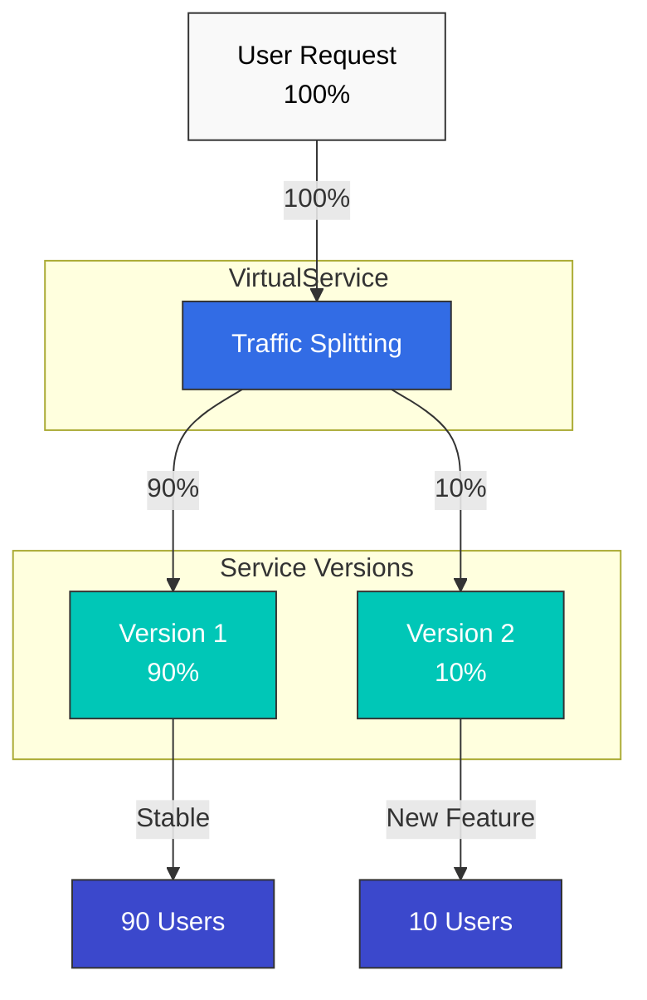
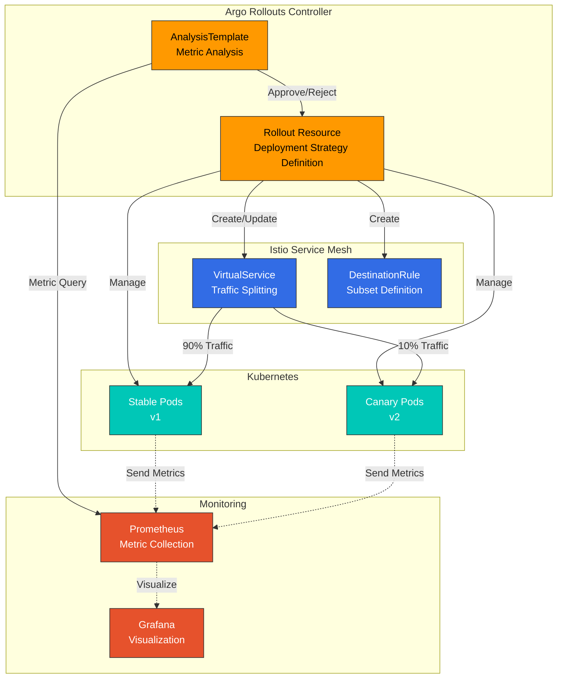
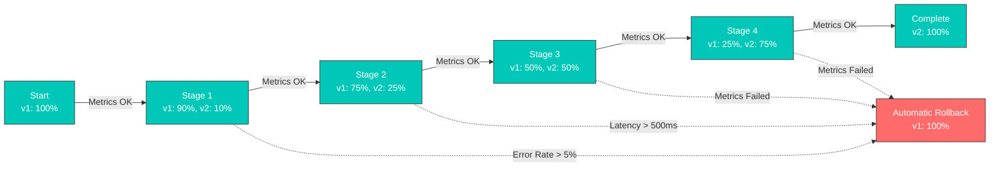
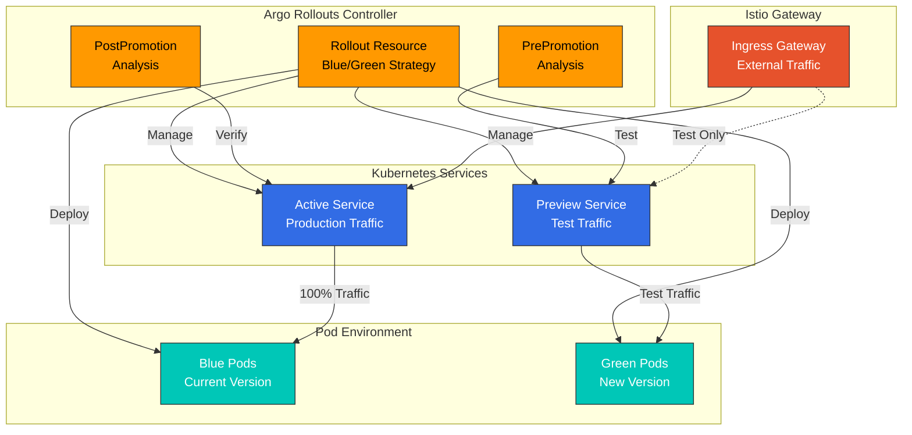
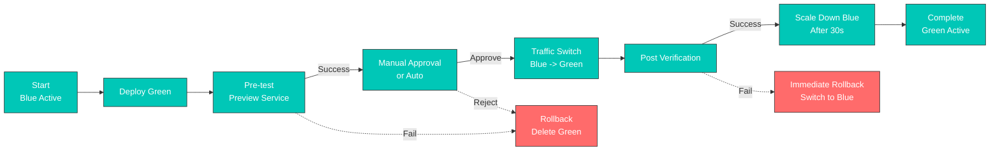
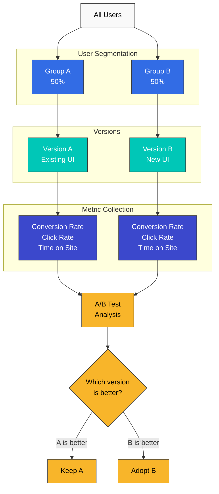

# Traffic Splitting

Traffic Splitting is one of Istio's most powerful features, enabling Canary deployments, A/B testing, and Blue/Green deployments without code changes.

## Table of Contents

1. [Traffic Splitting Overview](#traffic-splitting-overview)
2. [Canary Deployment](#canary-deployment)
3. [Blue/Green Deployment](#bluegreen-deployment)
4. [A/B Testing](#ab-testing)
5. [Progressive Rollout](#progressive-rollout)
6. [Using with Traffic Mirroring](#using-with-traffic-mirroring)
7. [Practical Examples](#practical-examples)
8. [Monitoring and Rollback](#monitoring-and-rollback)
9. [Troubleshooting](#troubleshooting)

## Traffic Splitting Overview

Traffic Splitting uses the `weight` field in VirtualService to distribute traffic between multiple service versions by ratio.



### Basic Structure

```yaml
apiVersion: networking.istio.io/v1
kind: VirtualService
metadata:
  name: reviews
spec:
  hosts:
  - reviews
  http:
  - route:
    - destination:
        host: reviews
        subset: v1
      weight: 90  # 90% of traffic
    - destination:
        host: reviews
        subset: v2
      weight: 10  # 10% of traffic
```

## Canary Deployment

Canary deployment is a strategy that safely validates a new version by deploying it to only a small subset of users first. Using Argo Rollouts with Istio enables automated progressive deployment and metric-based automatic rollback.

### Argo Rollouts + Istio Architecture



### Canary Deployment Flow



### Step 1: Install Argo Rollouts

```bash
# Install Argo Rollouts
kubectl create namespace argo-rollouts
kubectl apply -n argo-rollouts -f https://github.com/argoproj/argo-rollouts/releases/latest/download/install.yaml

# Install Argo Rollouts CLI (optional)
curl -LO https://github.com/argoproj/argo-rollouts/releases/latest/download/kubectl-argo-rollouts-linux-amd64
chmod +x kubectl-argo-rollouts-linux-amd64
sudo mv kubectl-argo-rollouts-linux-amd64 /usr/local/bin/kubectl-argo-rollouts

# Run Argo Rollouts Dashboard
kubectl argo rollouts dashboard
```

### Step 2: Define Rollout Resource

```yaml
apiVersion: argoproj.io/v1alpha1
kind: Rollout
metadata:
  name: reviews
  namespace: default
spec:
  replicas: 5
  revisionHistoryLimit: 2
  selector:
    matchLabels:
      app: reviews
  template:
    metadata:
      labels:
        app: reviews
        istio-injection: enabled
    spec:
      containers:
      - name: reviews
        image: docker.io/istio/examples-bookinfo-reviews-v2:1.17.0
        ports:
        - containerPort: 9080
        resources:
          requests:
            memory: "64Mi"
            cpu: "100m"
          limits:
            memory: "128Mi"
            cpu: "200m"

  # Canary Deployment Strategy
  strategy:
    canary:
      # Traffic Control via Istio VirtualService
      trafficRouting:
        istio:
          virtualService:
            name: reviews-vsvc
            routes:
            - primary
          destinationRule:
            name: reviews-destrule
            canarySubsetName: canary
            stableSubsetName: stable

      # Canary Steps Definition
      steps:
      - setWeight: 10    # 10% traffic to Canary
      - pause:
          duration: 2m   # Wait 2 minutes

      - setWeight: 25    # 25% traffic to Canary
      - pause:
          duration: 2m

      - setWeight: 50    # 50% traffic to Canary
      - pause:
          duration: 2m

      - setWeight: 75    # 75% traffic to Canary
      - pause:
          duration: 2m

      # Automatic Metric Analysis
      analysis:
        templates:
        - templateName: success-rate
        - templateName: latency
        startingStep: 1  # Start analysis from first step
        args:
        - name: service-name
          value: reviews
```

### Step 3: Create Service

First, create the Kubernetes Service:

```yaml
apiVersion: v1
kind: Service
metadata:
  name: reviews
  namespace: default
spec:
  ports:
  - port: 9080
    name: http
  selector:
    app: reviews  # Select all Pods from Rollout
```

### Step 4: Define VirtualService

**Important**: Argo Rollouts does **NOT** automatically modify VirtualService. The VirtualService must be pre-created, and the Rollout references it to only update weights.

```yaml
apiVersion: networking.istio.io/v1
kind: VirtualService
metadata:
  name: reviews-vsvc
  namespace: default
spec:
  hosts:
  - reviews
  http:
  - name: primary  # Route name referenced by Rollout (required)
    route:
    - destination:
        host: reviews
        subset: stable  # Stable version
      weight: 100
    - destination:
        host: reviews
        subset: canary  # Canary version
      weight: 0
```

**Key Points**:
- The `http[].name` field is required (matches the Rollout's `routes` field)
- Rollout only automatically updates the `weight` values of this VirtualService
- Two destinations are required: stable and canary

### Step 5: Define DestinationRule

**Important**: Argo Rollouts does **NOT** automatically create DestinationRule. It must be pre-created.

```yaml
apiVersion: networking.istio.io/v1
kind: DestinationRule
metadata:
  name: reviews-destrule
  namespace: default
spec:
  host: reviews
  subsets:
  - name: stable
    labels:
      # Label automatically added by Rollout
      # rollouts-pod-template-hash: <stable-hash>
  - name: canary
    labels:
      # Label automatically added by Rollout
      # rollouts-pod-template-hash: <canary-hash>
```

**Key Points**:
- Subset names (`stable`, `canary`) must match the Rollout's `stableSubsetName` and `canarySubsetName`
- Rollout automatically adds the `rollouts-pod-template-hash` label to Pods
- DestinationRule subsets select Pods based on this label
- **Leave label selectors empty** - Rollout manages them at runtime

### Step 6: Define AnalysisTemplate

#### Success Rate Analysis

```yaml
apiVersion: argoproj.io/v1alpha1
kind: AnalysisTemplate
metadata:
  name: success-rate
  namespace: default
spec:
  args:
  - name: service-name

  metrics:
  - name: success-rate
    interval: 30s
    count: 4  # 4 measurements (total 2 minutes)
    successCondition: result >= 0.95  # 95% or higher success rate
    failureLimit: 2  # Rollback after 2 failures
    provider:
      prometheus:
        address: http://prometheus.istio-system:9090
        query: |
          sum(rate(
            istio_requests_total{
              destination_service_name="{{args.service-name}}",
              destination_workload_namespace="default",
              response_code!~"5.*"
            }[2m]
          ))
          /
          sum(rate(
            istio_requests_total{
              destination_service_name="{{args.service-name}}",
              destination_workload_namespace="default"
            }[2m]
          ))
```

#### Latency Analysis

```yaml
apiVersion: argoproj.io/v1alpha1
kind: AnalysisTemplate
metadata:
  name: latency
  namespace: default
spec:
  args:
  - name: service-name

  metrics:
  - name: latency-p95
    interval: 30s
    count: 4
    successCondition: result <= 500  # P95 latency 500ms or less
    failureLimit: 2
    provider:
      prometheus:
        address: http://prometheus.istio-system:9090
        query: |
          histogram_quantile(0.95,
            sum(rate(
              istio_request_duration_milliseconds_bucket{
                destination_service_name="{{args.service-name}}",
                destination_workload_namespace="default"
              }[2m]
            )) by (le)
          )
```

### Deployment Execution and Monitoring

#### Deploy New Version

```bash
# Start Canary deployment with image update
kubectl argo rollouts set image reviews \
  reviews=docker.io/istio/examples-bookinfo-reviews-v3:1.17.0

# Check Rollout status
kubectl argo rollouts get rollout reviews --watch

# Real-time dashboard
kubectl argo rollouts dashboard
```

#### Manual Approval/Rejection

```bash
# Manual approval to proceed to next step
kubectl argo rollouts promote reviews

# Abort and rollback Canary deployment
kubectl argo rollouts abort reviews

# Rollback to specific revision
kubectl argo rollouts undo reviews
```

#### Monitor Deployment Progress

```bash
# Check Rollout status
kubectl argo rollouts status reviews

# Check analysis results
kubectl get analysisrun -w

# Check Canary vs Stable traffic distribution
kubectl get virtualservice reviews-vsvc -o yaml

# Check actual Pod status
kubectl get pods -l app=reviews --show-labels
```

### Advanced Configuration: Metric-based Automatic Progression

```yaml
apiVersion: argoproj.io/v1alpha1
kind: Rollout
metadata:
  name: reviews-auto
spec:
  replicas: 5
  strategy:
    canary:
      trafficRouting:
        istio:
          virtualService:
            name: reviews-vsvc
            routes:
            - primary
          destinationRule:
            name: reviews-destrule
            canarySubsetName: canary
            stableSubsetName: stable

      steps:
      - setWeight: 10
      - pause:
          duration: 1m

      # Automatic Analysis - Automatically proceed to next step on success
      - analysis:
          templates:
          - templateName: success-rate
          - templateName: latency
          args:
          - name: service-name
            value: reviews

      - setWeight: 25
      - pause:
          duration: 1m

      - analysis:
          templates:
          - templateName: success-rate
          - templateName: latency
          args:
          - name: service-name
            value: reviews

      - setWeight: 50
      - pause:
          duration: 1m

      - analysis:
          templates:
          - templateName: success-rate
          - templateName: latency
          args:
          - name: service-name
            value: reviews

      - setWeight: 75
      - pause:
          duration: 1m

      - analysis:
          templates:
          - templateName: success-rate
          - templateName: latency
          args:
          - name: service-name
            value: reviews
```

### Key Considerations

#### 1. VirtualService and DestinationRule Must Be Pre-created

Argo Rollouts does not create these resources. They must be created before deploying the Rollout:

```bash
# Order is important
kubectl apply -f service.yaml
kubectl apply -f destination-rule.yaml
kubectl apply -f virtual-service.yaml
kubectl apply -f rollout.yaml
```

#### 2. Labels Managed by Rollout

Argo Rollouts automatically adds/manages the following labels:

```yaml
# Labels automatically added by Rollout
rollouts-pod-template-hash: <hash>  # For ReplicaSet identification
```

These labels are used for subset selection in DestinationRule.

#### 3. HTTP Route Name Required

Each HTTP route in VirtualService must have a `name` field:

```yaml
# Wrong example
http:
- route:  # No name!
  - destination:
      host: reviews

# Correct example
http:
- name: primary  # Required!
  route:
  - destination:
      host: reviews
```

#### 4. Enable Istio Injection

Istio sidecar must be injected into Rollout Pods:

```yaml
# Method 1: Namespace level
kubectl label namespace default istio-injection=enabled

# Method 2: Pod level
template:
  metadata:
    labels:
      sidecar.istio.io/inject: "true"
```

### Using with VirtualService Match

Argo Rollouts can be used with VirtualService match conditions. This allows routing only traffic that meets specific conditions to Canary.

#### Example 1: Header-based Canary (for Internal Testers)

```yaml
apiVersion: networking.istio.io/v1
kind: VirtualService
metadata:
  name: reviews-vsvc
spec:
  hosts:
  - reviews
  http:
  # Priority 1: Internal testers always go to Canary
  - match:
    - headers:
        x-canary-tester:
          exact: "true"
    route:
    - destination:
        host: reviews
        subset: canary

  # Priority 2: Normal traffic - Rollout manages this route's weight
  - name: primary
    route:
    - destination:
        host: reviews
        subset: stable
      weight: 100
    - destination:
        host: reviews
        subset: canary
      weight: 0
```

**Usage Scenario**:
```bash
# Internal testers always access Canary version
curl -H "x-canary-tester: true" http://reviews:9080/

# Regular users are routed based on Rollout's weight
curl http://reviews:9080/
```

#### Example 2: Region-based Staged Deployment

```yaml
apiVersion: networking.istio.io/v1
kind: VirtualService
metadata:
  name: reviews-vsvc
spec:
  hosts:
  - reviews
  http:
  # Priority 1: Dev environment always gets latest version
  - match:
    - headers:
        x-env:
          exact: "dev"
    route:
    - destination:
        host: reviews
        subset: canary

  # Priority 2: Only specific region for Canary test (e.g., Seoul)
  - match:
    - headers:
        x-region:
          exact: "ap-northeast-2"
    name: seoul-traffic
    route:
    - destination:
        host: reviews
        subset: stable
      weight: 100
    - destination:
        host: reviews
        subset: canary
      weight: 0

  # Priority 3: Other regions stay on stable version
  - name: other-regions
    route:
    - destination:
        host: reviews
        subset: stable
```

**Rollout Configuration**:
```yaml
apiVersion: argoproj.io/v1alpha1
kind: Rollout
metadata:
  name: reviews
spec:
  # ... (same as before)
  strategy:
    canary:
      trafficRouting:
        istio:
          virtualService:
            name: reviews-vsvc
            routes:
            - seoul-traffic  # Only apply Canary to Seoul traffic
          destinationRule:
            name: reviews-destrule
            canarySubsetName: canary
            stableSubsetName: stable
      steps:
      - setWeight: 10
      - pause: {duration: 2m}
      - setWeight: 50
      - pause: {duration: 2m}
```

#### Example 3: User Tier-based Deployment

```yaml
apiVersion: networking.istio.io/v1
kind: VirtualService
metadata:
  name: reviews-vsvc
spec:
  hosts:
  - reviews
  http:
  # Priority 1: Beta program participants
  - match:
    - headers:
        x-user-tier:
          exact: "beta"
    route:
    - destination:
        host: reviews
        subset: canary

  # Priority 2: Only premium users for Canary test
  - match:
    - headers:
        x-user-tier:
          exact: "premium"
    name: premium-users
    route:
    - destination:
        host: reviews
        subset: stable
      weight: 100
    - destination:
        host: reviews
        subset: canary
      weight: 0

  # Priority 3: Free users get stable version
  - name: free-users
    route:
    - destination:
        host: reviews
        subset: stable
```

#### Example 4: Mobile App Version-based Deployment

```yaml
apiVersion: networking.istio.io/v1
kind: VirtualService
metadata:
  name: reviews-vsvc
spec:
  hosts:
  - reviews
  http:
  # Priority 1: Only latest app version users get Canary
  - match:
    - headers:
        x-app-version:
          regex: "^3\\.(1[0-9]|[2-9][0-9])\\."  # 3.10.x or higher
    name: latest-app-version
    route:
    - destination:
        host: reviews
        subset: stable
      weight: 100
    - destination:
        host: reviews
        subset: canary
      weight: 0

  # Priority 2: Legacy app only gets stable version
  - name: legacy-app-version
    route:
    - destination:
        host: reviews
        subset: stable
```

### Complete Deployment Example

A basic example deploying all resources at once:

```yaml
---
# Service
apiVersion: v1
kind: Service
metadata:
  name: reviews
spec:
  ports:
  - port: 9080
    name: http
  selector:
    app: reviews

---
# DestinationRule
apiVersion: networking.istio.io/v1
kind: DestinationRule
metadata:
  name: reviews-destrule
spec:
  host: reviews
  subsets:
  - name: stable
    labels: {}  # Managed by Rollout
  - name: canary
    labels: {}  # Managed by Rollout

---
# VirtualService
apiVersion: networking.istio.io/v1
kind: VirtualService
metadata:
  name: reviews-vsvc
spec:
  hosts:
  - reviews
  http:
  - name: primary
    route:
    - destination:
        host: reviews
        subset: stable
      weight: 100
    - destination:
        host: reviews
        subset: canary
      weight: 0

---
# Rollout
apiVersion: argoproj.io/v1alpha1
kind: Rollout
metadata:
  name: reviews
spec:
  replicas: 3
  selector:
    matchLabels:
      app: reviews
  template:
    metadata:
      labels:
        app: reviews
    spec:
      containers:
      - name: reviews
        image: istio/examples-bookinfo-reviews-v1:1.17.0
        ports:
        - containerPort: 9080

  strategy:
    canary:
      trafficRouting:
        istio:
          virtualService:
            name: reviews-vsvc
            routes:
            - primary
          destinationRule:
            name: reviews-destrule
            canarySubsetName: canary
            stableSubsetName: stable

      steps:
      - setWeight: 20
      - pause: {duration: 1m}
      - setWeight: 40
      - pause: {duration: 1m}
      - setWeight: 60
      - pause: {duration: 1m}
      - setWeight: 80
      - pause: {duration: 1m}
```

### Considerations When Using with Match

#### 1. Route Order Matters

HTTP routes in VirtualService are **evaluated in order**. Routes with match should be placed before routes managed by Rollout:

```yaml
# Correct example
http:
- match:
    - headers:
        x-tester: {exact: "true"}
  route:
    - destination: {host: reviews, subset: canary}

- name: primary  # Managed by Rollout
  route:
    - destination: {host: reviews, subset: stable}
      weight: 100
    - destination: {host: reviews, subset: canary}
      weight: 0

# Wrong example - match is ignored if primary comes first
http:
- name: primary
  route: [...]

- match: [...]  # Never reached!
  route: [...]
```

#### 2. Rollout Only Manages Specified Routes

Rollout only modifies weights for routes specified in the `routes` field:

```yaml
strategy:
  canary:
    trafficRouting:
      istio:
        virtualService:
          name: reviews-vsvc
          routes:
          - primary  # Only modifies this route's weight
          # Other routes with match are not modified
```

#### 3. Managing Multiple Routes Simultaneously

Multiple routes can be managed simultaneously if needed:

```yaml
apiVersion: networking.istio.io/v1
kind: VirtualService
metadata:
  name: reviews-vsvc
spec:
  hosts:
  - reviews
  http:
  # Premium users route
  - match:
    - headers:
        x-user-tier: {exact: "premium"}
    name: premium-route
    route:
    - destination: {host: reviews, subset: stable}
      weight: 100
    - destination: {host: reviews, subset: canary}
      weight: 0

  # Standard users route
  - name: standard-route
    route:
    - destination: {host: reviews, subset: stable}
      weight: 100
    - destination: {host: reviews, subset: canary}
      weight: 0

---
apiVersion: argoproj.io/v1alpha1
kind: Rollout
metadata:
  name: reviews
spec:
  strategy:
    canary:
      trafficRouting:
        istio:
          virtualService:
            name: reviews-vsvc
            routes:
            - premium-route    # Manage both routes
            - standard-route
          destinationRule:
            name: reviews-destrule
            canarySubsetName: canary
            stableSubsetName: stable
      steps:
      - setWeight: 10
      - pause: {duration: 2m}
```

### Troubleshooting

#### Rollout Stuck in Progressing State

```bash
# Check Rollout status
kubectl argo rollouts get rollout reviews

# Check Events
kubectl describe rollout reviews

# Common causes:
# 1. VirtualService/DestinationRule doesn't exist
kubectl get virtualservice reviews-vsvc
kubectl get destinationrule reviews-destrule

# 2. HTTP route name is wrong
kubectl get virtualservice reviews-vsvc -o yaml | grep "name:"

# 3. Istio sidecar not injected
kubectl get pods -l app=reviews -o jsonpath='{.items[*].spec.containers[*].name}'
```

#### Traffic Not Going to Canary

```bash
# Check VirtualService weight
kubectl get virtualservice reviews-vsvc -o yaml

# Check DestinationRule subsets
kubectl get destinationrule reviews-destrule -o yaml

# Check Pod labels
kubectl get pods -l app=reviews --show-labels

# Check Envoy configuration
istioctl proxy-config routes <pod-name>
```

#### Rollout Rollback

```bash
# Rollback to previous revision
kubectl argo rollouts undo reviews

# Rollback to specific revision
kubectl argo rollouts undo reviews --to-revision=2

# Abort and rollback immediately
kubectl argo rollouts abort reviews
```

### Blue/Green Deployment with Argo Rollouts

Argo Rollouts also supports Blue/Green strategy:

```yaml
apiVersion: argoproj.io/v1alpha1
kind: Rollout
metadata:
  name: reviews-bluegreen
spec:
  replicas: 5
  selector:
    matchLabels:
      app: reviews
  template:
    metadata:
      labels:
        app: reviews
    spec:
      containers:
      - name: reviews
        image: docker.io/istio/examples-bookinfo-reviews-v2:1.17.0
        ports:
        - containerPort: 9080

  strategy:
    blueGreen:
      activeService: reviews-active
      previewService: reviews-preview
      autoPromotionEnabled: false  # Manual approval
      scaleDownDelaySeconds: 30
      prePromotionAnalysis:
        templates:
        - templateName: smoke-tests
        args:
        - name: service-name
          value: reviews-preview
```

## Blue/Green Deployment

Blue/Green deployment maintains two identical production environments and switches traffic instantly. Using Argo Rollouts with Istio enables safe switching and automatic rollback.

### Argo Rollouts Blue/Green Architecture



### Blue/Green Deployment Flow



### Step 1: Define Services

Blue/Green deployment requires two Services:

```yaml
---
# Active Service - Production traffic
apiVersion: v1
kind: Service
metadata:
  name: reviews-active
spec:
  ports:
  - port: 9080
    name: http
  selector:
    app: reviews
    # Rollout automatically updates selector

---
# Preview Service - Test traffic
apiVersion: v1
kind: Service
metadata:
  name: reviews-preview
spec:
  ports:
  - port: 9080
    name: http
  selector:
    app: reviews
    # Rollout automatically updates selector
```

### Step 2: Istio Gateway and VirtualService

```yaml
---
# Gateway
apiVersion: networking.istio.io/v1
kind: Gateway
metadata:
  name: reviews-gateway
spec:
  selector:
    istio: ingressgateway
  servers:
  - port:
      number: 80
      name: http
      protocol: HTTP
    hosts:
    - reviews.example.com

---
# VirtualService - Active Service
apiVersion: networking.istio.io/v1
kind: VirtualService
metadata:
  name: reviews-vsvc
spec:
  hosts:
  - reviews.example.com
  gateways:
  - reviews-gateway
  http:
  - route:
    - destination:
        host: reviews-active  # Route to Active Service
        port:
          number: 9080

---
# VirtualService - Preview Service (for testing)
apiVersion: networking.istio.io/v1
kind: VirtualService
metadata:
  name: reviews-preview-vsvc
spec:
  hosts:
  - reviews-preview.example.com
  gateways:
  - reviews-gateway
  http:
  - route:
    - destination:
        host: reviews-preview  # Route to Preview Service
        port:
          number: 9080
```

### Step 3: Define Rollout Resource

```yaml
apiVersion: argoproj.io/v1alpha1
kind: Rollout
metadata:
  name: reviews
spec:
  replicas: 3
  revisionHistoryLimit: 2
  selector:
    matchLabels:
      app: reviews
  template:
    metadata:
      labels:
        app: reviews
    spec:
      containers:
      - name: reviews
        image: istio/examples-bookinfo-reviews-v1:1.17.0
        ports:
        - containerPort: 9080

  strategy:
    blueGreen:
      # Specify Active/Preview Services
      activeService: reviews-active
      previewService: reviews-preview

      # Auto-promotion settings
      autoPromotionEnabled: false  # false: manual approval, true: auto-approve
      autoPromotionSeconds: 30     # Wait time for auto-promotion

      # Blue environment retention time
      scaleDownDelaySeconds: 30    # Delete Blue 30 seconds after switch
      scaleDownDelayRevisionLimit: 2  # Keep up to 2 previous versions

      # Pre-test (validate Preview before deployment)
      prePromotionAnalysis:
        templates:
        - templateName: smoke-tests
        args:
        - name: service-name
          value: reviews-preview

      # Post-verification (validate Active after switch)
      postPromotionAnalysis:
        templates:
        - templateName: post-promotion-tests
        args:
        - name: service-name
          value: reviews-active

      # Anti-affinity (deploy Blue/Green on different nodes)
      antiAffinity:
        requiredDuringSchedulingIgnoredDuringExecution: {}
```

### Step 4: Define AnalysisTemplate

#### Pre-test (Smoke Tests)

```yaml
apiVersion: argoproj.io/v1alpha1
kind: AnalysisTemplate
metadata:
  name: smoke-tests
spec:
  args:
  - name: service-name

  metrics:
  # 1. HTTP status code check
  - name: http-status
    interval: 10s
    count: 5
    successCondition: result == 200
    provider:
      job:
        spec:
          template:
            spec:
              containers:
              - name: curl
                image: curlimages/curl:7.88.1
                command:
                - sh
                - -c
                - |
                  curl -s -o /dev/null -w "%{http_code}" http://{{args.service-name}}:9080/health
              restartPolicy: Never
          backoffLimit: 1

  # 2. Basic functional test
  - name: functional-test
    interval: 10s
    count: 3
    successCondition: result == true
    provider:
      job:
        spec:
          template:
            spec:
              containers:
              - name: test
                image: appropriate/curl:latest
                command:
                - sh
                - -c
                - |
                  # API endpoint test
                  curl -f http://{{args.service-name}}:9080/api/v1/health
              restartPolicy: Never
          backoffLimit: 1
```

#### Post-verification Tests

```yaml
apiVersion: argoproj.io/v1alpha1
kind: AnalysisTemplate
metadata:
  name: post-promotion-tests
spec:
  args:
  - name: service-name

  metrics:
  # Prometheus metric-based verification
  - name: error-rate
    interval: 30s
    count: 10
    successCondition: result < 0.05  # Less than 5% error rate
    provider:
      prometheus:
        address: http://prometheus.istio-system:9090
        query: |
          sum(rate(
            istio_requests_total{
              destination_service_name="{{args.service-name}}",
              response_code=~"5.."
            }[1m]
          ))
          /
          sum(rate(
            istio_requests_total{
              destination_service_name="{{args.service-name}}"
            }[1m]
          ))

  - name: response-time
    interval: 30s
    count: 10
    successCondition: result < 500  # Less than 500ms
    provider:
      prometheus:
        address: http://prometheus.istio-system:9090
        query: |
          histogram_quantile(0.95,
            sum(rate(
              istio_request_duration_milliseconds_bucket{
                destination_service_name="{{args.service-name}}"
              }[1m]
            )) by (le)
          )
```

### Deployment Execution and Management

#### Deploy New Version

```bash
# Start Blue/Green deployment with image update
kubectl argo rollouts set image reviews \
  reviews=istio/examples-bookinfo-reviews-v2:1.17.0

# Check Rollout status
kubectl argo rollouts get rollout reviews --watch

# Test Preview environment
curl http://reviews-preview.example.com/
```

#### Manual Approval (Promotion)

```bash
# Manually approve after pre-tests succeed
kubectl argo rollouts promote reviews

# Or approve from dashboard
kubectl argo rollouts dashboard
```

#### Check Status

```bash
# Rollout status
kubectl argo rollouts status reviews

# Check Active/Preview Services
kubectl get svc reviews-active reviews-preview

# Check Pod status
kubectl get pods -l app=reviews --show-labels

# Check Analysis results
kubectl get analysisrun
```

#### Rollback

```bash
# Immediate rollback (switch to Blue)
kubectl argo rollouts abort reviews

# Rollback to previous version
kubectl argo rollouts undo reviews

# Rollback to specific revision
kubectl argo rollouts undo reviews --to-revision=3
```

## A/B Testing

A/B testing runs two versions simultaneously and classifies users based on specific criteria to measure effectiveness.



### Cookie-based A/B Testing

```yaml
apiVersion: networking.istio.io/v1
kind: VirtualService
metadata:
  name: myapp-ab-test
spec:
  hosts:
  - myapp.example.com
  http:
  # Group A (cookie value "a")
  - match:
    - headers:
        cookie:
          regex: ".*ab_test=a.*"
    route:
    - destination:
        host: myapp
        subset: version-a

  # Group B (cookie value "b")
  - match:
    - headers:
        cookie:
          regex: ".*ab_test=b.*"
    route:
    - destination:
        host: myapp
        subset: version-b

  # New users (no cookie) - 50/50 split
  - route:
    - destination:
        host: myapp
        subset: version-a
      weight: 50
    - destination:
        host: myapp
        subset: version-b
      weight: 50
    headers:
      response:
        add:
          Set-Cookie: "ab_test=a; Max-Age=2592000; Path=/"
```

### Header-based A/B Testing

```yaml
apiVersion: networking.istio.io/v1
kind: VirtualService
metadata:
  name: myapp-ab-header
spec:
  hosts:
  - myapp
  http:
  # Mobile users -> Version B (new mobile UI)
  - match:
    - headers:
        user-agent:
          regex: ".*Mobile.*"
    route:
    - destination:
        host: myapp
        subset: version-b

  # Premium users -> Version B (new features)
  - match:
    - headers:
        x-user-tier:
          exact: "premium"
    route:
    - destination:
        host: myapp
        subset: version-b

  # Regular users -> Version A
  - route:
    - destination:
        host: myapp
        subset: version-a
```

### Geo-based A/B Testing

```yaml
apiVersion: networking.istio.io/v1
kind: VirtualService
metadata:
  name: myapp-ab-geo
spec:
  hosts:
  - myapp
  http:
  # Test new version only in specific regions
  - match:
    - headers:
        x-country-code:
          regex: "US|CA"  # USA, Canada
    route:
    - destination:
        host: myapp
        subset: version-b
      weight: 50
    - destination:
        host: myapp
        subset: version-a
      weight: 50

  # Other regions get existing version
  - route:
    - destination:
        host: myapp
        subset: version-a
```

## Progressive Rollout

Progressive rollout automatically increases traffic ratio over time. Using Argo Rollouts' Canary strategy enables automated progressive deployment.

### Manual Progressive Rollout

```bash
#!/bin/bash
# progressive-rollout.sh

SERVICE="myapp"
NAMESPACE="default"
INTERVAL=300  # 5 minutes

# Traffic ratio array
WEIGHTS=(0 10 25 50 75 100)

for i in "${!WEIGHTS[@]}"; do
  weight=${WEIGHTS[$i]}
  prev_weight=$((100 - weight))

  echo "[$i/${#WEIGHTS[@]}] Shifting traffic: v1=$prev_weight%, v2=$weight%"

  kubectl apply -f - <<EOF
apiVersion: networking.istio.io/v1
kind: VirtualService
metadata:
  name: ${SERVICE}
  namespace: ${NAMESPACE}
spec:
  hosts:
  - ${SERVICE}
  http:
  - route:
    - destination:
        host: ${SERVICE}
        subset: v1
      weight: ${prev_weight}
    - destination:
        host: ${SERVICE}
        subset: v2
      weight: ${weight}
EOF

  if [ $weight -lt 100 ]; then
    echo "Waiting ${INTERVAL} seconds before next step..."
    sleep $INTERVAL

    # Check metrics
    echo "Checking metrics..."
    ERROR_RATE=$(kubectl exec -n ${NAMESPACE} -c istio-proxy \
      $(kubectl get pod -n ${NAMESPACE} -l app=${SERVICE},version=v2 -o jsonpath='{.items[0].metadata.name}') -- \
      curl -s localhost:15000/stats/prometheus | \
      grep 'istio_requests_total{response_code="500"}' | \
      awk '{print $2}')

    if [ "$ERROR_RATE" != "" ] && [ "$ERROR_RATE" -gt 5 ]; then
      echo "ERROR: High error rate detected ($ERROR_RATE errors). Rolling back!"
      kubectl apply -f - <<EOF
apiVersion: networking.istio.io/v1
kind: VirtualService
metadata:
  name: ${SERVICE}
  namespace: ${NAMESPACE}
spec:
  hosts:
  - ${SERVICE}
  http:
  - route:
    - destination:
        host: ${SERVICE}
        subset: v1
      weight: 100
EOF
      exit 1
    fi
  fi
done

echo "Progressive rollout completed successfully!"
```

## Using with Traffic Mirroring

Combining traffic splitting with mirroring enables safer deployments.

```yaml
apiVersion: networking.istio.io/v1
kind: VirtualService
metadata:
  name: myapp-canary-with-mirror
spec:
  hosts:
  - myapp
  http:
  - route:
    # Main traffic: 90% v1, 10% v2
    - destination:
        host: myapp
        subset: v1
      weight: 90
    - destination:
        host: myapp
        subset: v2
      weight: 10
    # Mirroring: duplicate all traffic to v3 (ignore response)
    mirror:
      host: myapp
      subset: v3
    mirrorPercentage:
      value: 100
```

## Practical Examples

### Example 1: User Segment-based Deployment

```yaml
apiVersion: networking.istio.io/v1
kind: VirtualService
metadata:
  name: myapp-segmented-rollout
spec:
  hosts:
  - myapp.example.com
  http:
  # Internal employees - use new version first
  - match:
    - headers:
        x-employee:
          exact: "true"
    route:
    - destination:
        host: myapp
        subset: v2

  # Beta testers - next to use new version
  - match:
    - headers:
        x-beta-tester:
          exact: "true"
    route:
    - destination:
        host: myapp
        subset: v2

  # VIP customers - Canary 50%
  - match:
    - headers:
        x-user-tier:
          exact: "vip"
    route:
    - destination:
        host: myapp
        subset: v1
      weight: 50
    - destination:
        host: myapp
        subset: v2
      weight: 50

  # Regular customers - Canary 10%
  - route:
    - destination:
        host: myapp
        subset: v1
      weight: 90
    - destination:
        host: myapp
        subset: v2
      weight: 10
```

### Example 2: Time-based Deployment

```yaml
apiVersion: networking.istio.io/v1
kind: VirtualService
metadata:
  name: myapp-time-based
spec:
  hosts:
  - myapp
  http:
  # Korea daytime (KST 09:00-18:00) - stable version
  - match:
    - headers:
        x-country-code:
          exact: "KR"
        x-hour:
          regex: "0[9]|1[0-7]"  # 09-17 hours
    route:
    - destination:
        host: myapp
        subset: v1

  # Korea nighttime - Canary test
  - match:
    - headers:
        x-country-code:
          exact: "KR"
    route:
    - destination:
        host: myapp
        subset: v1
      weight: 80
    - destination:
        host: myapp
        subset: v2
      weight: 20

  # Other regions
  - route:
    - destination:
        host: myapp
        subset: v1
```

### Example 3: Microservice Chain Canary

```yaml
# Frontend Canary
apiVersion: networking.istio.io/v1
kind: VirtualService
metadata:
  name: frontend-canary
spec:
  hosts:
  - frontend
  http:
  - route:
    - destination:
        host: frontend
        subset: v1
      weight: 90
    - destination:
        host: frontend
        subset: v2
      weight: 10
---
# Backend Canary (only used by Frontend v2)
apiVersion: networking.istio.io/v1
kind: VirtualService
metadata:
  name: backend-canary
spec:
  hosts:
  - backend
  http:
  # Only requests from Frontend v2 go to Backend v2
  - match:
    - sourceLabels:
        app: frontend
        version: v2
    route:
    - destination:
        host: backend
        subset: v2

  # Rest go to Backend v1
  - route:
    - destination:
        host: backend
        subset: v1
```

## Monitoring and Rollback

### Prometheus Queries

```promql
# Requests per version
sum(rate(istio_requests_total{destination_service="myapp.default.svc.cluster.local"}[5m])) by (destination_version)

# Error rate per version
sum(rate(istio_requests_total{destination_service="myapp.default.svc.cluster.local",response_code=~"5.."}[5m])) by (destination_version)
/
sum(rate(istio_requests_total{destination_service="myapp.default.svc.cluster.local"}[5m])) by (destination_version)

# Latency per version (P95)
histogram_quantile(0.95, sum(rate(istio_request_duration_milliseconds_bucket{destination_service="myapp.default.svc.cluster.local"}[5m])) by (destination_version, le))

# Traffic split ratio
sum(rate(istio_requests_total{destination_service="myapp.default.svc.cluster.local"}[5m])) by (destination_version)
/
sum(rate(istio_requests_total{destination_service="myapp.default.svc.cluster.local"}[5m]))
```

### Automatic Rollback Script

```bash
#!/bin/bash
# auto-rollback.sh

SERVICE="myapp"
NAMESPACE="default"
ERROR_THRESHOLD=5  # 5% error rate threshold
LATENCY_THRESHOLD=1000  # 1 second latency threshold

# Collect Canary version metrics
POD=$(kubectl get pod -n ${NAMESPACE} -l app=${SERVICE},version=v2 -o jsonpath='{.items[0].metadata.name}')

# Check error rate
ERROR_RATE=$(kubectl exec -n ${NAMESPACE} -c istio-proxy ${POD} -- \
  curl -s localhost:15000/stats/prometheus | \
  grep 'istio_requests_total{response_code="500"}' | \
  awk '{sum+=$2} END {print sum}')

TOTAL_REQUESTS=$(kubectl exec -n ${NAMESPACE} -c istio-proxy ${POD} -- \
  curl -s localhost:15000/stats/prometheus | \
  grep 'istio_requests_total' | \
  grep -v 'response_code' | \
  awk '{sum+=$2} END {print sum}')

if [ "$TOTAL_REQUESTS" -gt 0 ]; then
  ERROR_PERCENTAGE=$(echo "scale=2; ($ERROR_RATE / $TOTAL_REQUESTS) * 100" | bc)

  if (( $(echo "$ERROR_PERCENTAGE > $ERROR_THRESHOLD" | bc -l) )); then
    echo "ERROR: Error rate ${ERROR_PERCENTAGE}% exceeds threshold ${ERROR_THRESHOLD}%"
    echo "Rolling back to v1..."

    kubectl apply -f - <<EOF
apiVersion: networking.istio.io/v1
kind: VirtualService
metadata:
  name: ${SERVICE}
  namespace: ${NAMESPACE}
spec:
  hosts:
  - ${SERVICE}
  http:
  - route:
    - destination:
        host: ${SERVICE}
        subset: v1
      weight: 100
EOF

    # Send notification
    curl -X POST https://hooks.slack.com/services/YOUR/SLACK/WEBHOOK \
      -H 'Content-Type: application/json' \
      -d "{\"text\":\"Warning: ${SERVICE} Canary rollback triggered! Error rate: ${ERROR_PERCENTAGE}%\"}"

    exit 1
  fi
fi

echo "Canary metrics within acceptable range"
```

## Troubleshooting

### Traffic Splitting Not Working

```bash
# 1. Check DestinationRule
kubectl get destinationrule -A
kubectl describe destinationrule <name> -n <namespace>

# 2. Check subset labels
kubectl get pods -n <namespace> --show-labels

# 3. Check VirtualService configuration
istioctl proxy-config routes <pod-name> -n <namespace> -o json

# 4. Check actual traffic distribution
kubectl exec -n <namespace> <pod-name> -c istio-proxy -- \
  curl -s localhost:15000/clusters | grep <service-name>
```

### Weight Not Behaving as Expected

```bash
# Check Envoy cluster weights
istioctl proxy-config clusters <pod-name> -n <namespace> --fqdn <service-fqdn> -o json

# Check endpoint status
kubectl get endpoints -n <namespace> <service-name> -o yaml

# Check Pod ready status
kubectl get pods -n <namespace> -l version=v2
```

## Best Practices

### 1. Staged Rollout

```yaml
# Good example: Gradual increase
# 5% -> 10% -> 25% -> 50% -> 100%

# Bad example: Sudden increase
# 5% -> 100%
```

### 2. Prepare Rollback Plan

```bash
# Prepare rollback YAML file in advance
cat > rollback-v1.yaml <<EOF
apiVersion: networking.istio.io/v1
kind: VirtualService
metadata:
  name: myapp
spec:
  hosts:
  - myapp
  http:
  - route:
    - destination:
        host: myapp
        subset: v1
      weight: 100
EOF

# Rollback command
kubectl apply -f rollback-v1.yaml
```

### 3. Monitoring is Essential

- **Golden Signals** monitoring: Latency, Traffic, Errors, Saturation
- **SLO-based decisions**: Automatic rollback if target SLO is not met
- **Real-time alerts**: Set up notifications via Slack, PagerDuty, etc.

### 4. Test Automation

Use Argo Rollouts' AnalysisTemplate to implement automated testing and verification:

```yaml
# AnalysisTemplate for automated testing and verification
apiVersion: argoproj.io/v1alpha1
kind: AnalysisTemplate
metadata:
  name: success-rate
spec:
  args:
  - name: service-name
  metrics:
  - name: success-rate
    interval: 1m
    count: 10
    successCondition: result >= 0.95
    failureLimit: 3
    provider:
      prometheus:
        address: http://prometheus.istio-system:9090
        query: |
          sum(rate(
            istio_requests_total{
              destination_service_name="{{args.service-name}}",
              response_code!~"5.*"
            }[1m]
          ))
          /
          sum(rate(
            istio_requests_total{
              destination_service_name="{{args.service-name}}"
            }[1m]
          ))
---
# Using AnalysisTemplate in Rollout
apiVersion: argoproj.io/v1alpha1
kind: Rollout
metadata:
  name: myapp
spec:
  strategy:
    canary:
      steps:
      - setWeight: 10
      - pause: {duration: 1m}
      - analysis:
          templates:
          - templateName: success-rate
          args:
          - name: service-name
            value: myapp
```

### 5. Documentation

```yaml
apiVersion: networking.istio.io/v1
kind: VirtualService
metadata:
  name: myapp-canary
  annotations:
    description: "Canary deployment for myapp v2"
    owner: "platform-team"
    rollout-date: "2025-11-24"
    rollout-plan: "5% -> 10% -> 25% -> 50% -> 100%"
    monitoring-dashboard: "https://grafana.example.com/d/canary"
spec:
  # ...
```

## References

### Istio Related
- [Istio Traffic Shifting](https://istio.io/latest/docs/tasks/traffic-management/traffic-shifting/)
- [Canary Deployments](https://istio.io/latest/blog/2017/0.1-canary/)

### Argo Rollouts Related
- [Argo Rollouts Official Documentation](https://argo-rollouts.readthedocs.io/)
- [Istio Integration Guide](https://argo-rollouts.readthedocs.io/en/stable/features/traffic-management/istio/)
- [Argo Rollouts GitHub](https://github.com/argoproj/argo-rollouts)
- [Argo Rollouts Examples](https://github.com/argoproj/argo-rollouts/tree/master/examples)

### Progressive Delivery
- [Progressive Delivery](https://www.weave.works/blog/what-is-progressive-delivery-all-about)
- [CNCF Progressive Delivery](https://github.com/cncf/tag-app-delivery/blob/main/progressive-delivery/README.md)
