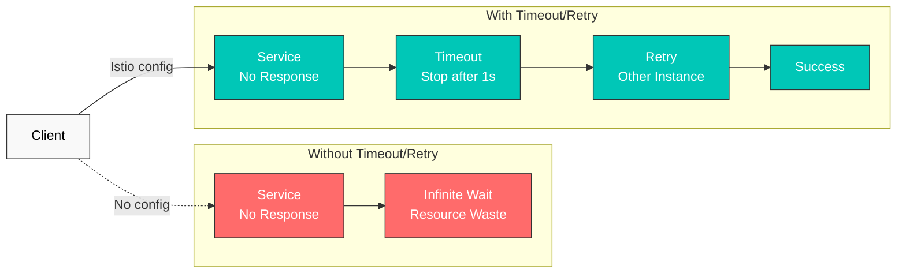
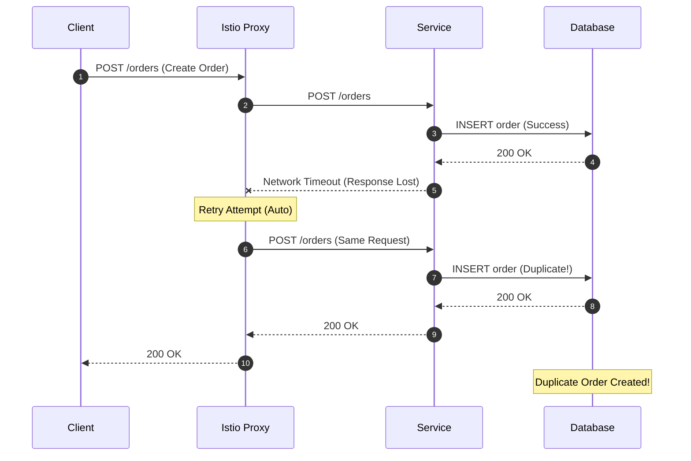

# Retry and Timeout

Retry and Timeout are core mechanisms for improving microservice resilience. With Istio, you can configure these policies without changing application code.

## Table of Contents

1. [Overview](#overview)
2. [Timeout Configuration](#timeout-configuration)
3. [Retry Configuration](#retry-configuration)
4. [Combining Retry and Timeout](#combining-retry-and-timeout)
5. [Practical Examples](#practical-examples)
6. [Important Warnings](#important-warnings)
7. [Best Practices](#best-practices)
8. [Troubleshooting](#troubleshooting)

## Overview

### Why Timeout and Retry?



## Timeout Configuration

### Basic Timeout

```yaml
apiVersion: networking.istio.io/v1
kind: VirtualService
metadata:
  name: reviews-timeout
spec:
  hosts:
  - reviews
  http:
  - route:
    - destination:
        host: reviews
    timeout: 10s  # Timeout after 10 seconds
```

### Path-specific Timeout

```yaml
apiVersion: networking.istio.io/v1
kind: VirtualService
metadata:
  name: api-timeouts
spec:
  hosts:
  - api.example.com
  http:
  # Fast response API - short timeout
  - match:
    - uri:
        prefix: "/api/quick"
    route:
    - destination:
        host: api-service
    timeout: 1s

  # Standard API
  - match:
    - uri:
        prefix: "/api/standard"
    route:
    - destination:
        host: api-service
    timeout: 5s

  # Heavy operations - long timeout
  - match:
    - uri:
        prefix: "/api/batch"
    route:
    - destination:
        host: api-service
    timeout: 30s
```

## Retry Configuration

> **Important:** Omitting `retries` does not necessarily mean retry is off. Istio's cluster-wide default is `attempts: 2` with `retryOn: connect-failure,refused-stream,unavailable,cancelled`. `attempts` counts **additional retries after the original request**, so this can result in three total deliveries. Set `attempts: 0` on the route to disable proxy retries explicitly.

### Basic Retry

```yaml
apiVersion: networking.istio.io/v1
kind: VirtualService
metadata:
  name: reviews-retry
spec:
  hosts:
  - reviews
  http:
  - route:
    - destination:
        host: reviews
    retries:
      attempts: 3  # Maximum 3 retries
      perTryTimeout: 2s  # 2s timeout per attempt
      retryOn: 5xx,reset,connect-failure,refused-stream  # Retry conditions
```

### Retry Conditions

| Condition | Description |
|-----------|-------------|
| `5xx` | HTTP 5xx errors |
| `gateway-error` | 502, 503, 504 errors |
| `reset` | Connection reset |
| `connect-failure` | Connection failure |
| `refused-stream` | HTTP/2 REFUSED_STREAM |
| `retriable-4xx` | 409 Conflict |
| `retriable-status-codes` | Custom status codes |

### Advanced Retry Configuration

`payment-service` accepts non-idempotent writes (charge submission), so a single
retry policy applied to every method would let the mesh replay a POST on `reset`
or `5xx` — exactly the ambiguous-replay risk this page warns against. Split the
route by method instead: retry read-only status checks generously, and disable
mesh retry entirely for the write path.

```yaml
apiVersion: networking.istio.io/v1
kind: VirtualService
metadata:
  name: advanced-retry
spec:
  hosts:
  - payment-service
  http:
  - name: reads-retryable
    match:
    - method:
        regex: "^(GET|HEAD)$"
    route:
    - destination:
        host: payment-service
    retries:
      attempts: 3
      perTryTimeout: 2s
      retryOn: connect-failure,refused-stream
      retryRemoteLocalities: true  # Retry to other regions
  - name: writes-no-mesh-retry
    match:
    - method:
        regex: "^(POST|PUT|PATCH|DELETE)$"
    route:
    - destination:
        host: payment-service
    retries:
      attempts: 0
```

## Combining Retry and Timeout

### Layered Timeouts

```yaml
apiVersion: networking.istio.io/v1
kind: VirtualService
metadata:
  name: layered-timeouts
spec:
  hosts:
  - frontend
  http:
  - route:
    - destination:
        host: frontend
    timeout: 10s  # Total timeout
    retries:
      attempts: 3
      perTryTimeout: 3s  # Timeout for each delivery, including the original
```

**Calculation**: the theoretical delivery-time bound is `(1 + attempts) × perTryTimeout = 4 × 3s = 12s`, but the route-level `timeout: 10s` applies first. Backoff and the remaining route timeout can reduce the number of retries actually attempted.

### Split Retry Policy by HTTP Method

```yaml
apiVersion: networking.istio.io/v1
kind: VirtualService
metadata:
  name: order-service
spec:
  hosts:
  - order-service
  http:
  # POST/PATCH: do not replay an ambiguous write in the mesh
  - name: writes-no-mesh-retry
    match:
    - method:
        regex: "^(POST|PATCH)$"
    route:
    - destination:
        host: order-service
    timeout: 10s
    retries:
      attempts: 0

  # GET/HEAD: retry only connection establishment and REFUSED_STREAM failures
  - name: reads-limited-retry
    match:
    - method:
        regex: "^(GET|HEAD)$"
    route:
    - destination:
        host: order-service
    timeout: 5s
    retries:
      attempts: 2
      perTryTimeout: 2s
      retryOn: connect-failure,refused-stream
```

Disable mesh retries by default for POST/PATCH and any operation the domain defines as a write. Do not infer that PUT or DELETE is safe merely from the HTTP method: retry them only when the application's actual contract makes repeated execution safe.

## Practical Examples

### Example 1: Microservice Chain

```yaml
# Frontend → Backend → Database
apiVersion: networking.istio.io/v1
kind: VirtualService
metadata:
  name: frontend
spec:
  hosts:
  - frontend
  http:
  - route:
    - destination:
        host: frontend
    timeout: 15s  # Consider entire chain
    retries:
      attempts: 2
      perTryTimeout: 7s
---
apiVersion: networking.istio.io/v1
kind: VirtualService
metadata:
  name: backend
spec:
  hosts:
  - backend
  http:
  - route:
    - destination:
        host: backend
    timeout: 10s  # Consider database call
    retries:
      attempts: 3
      perTryTimeout: 3s
      retryOn: 5xx,reset
---
apiVersion: networking.istio.io/v1
kind: VirtualService
metadata:
  name: database
spec:
  hosts:
  - database
  http:
  - route:
    - destination:
        host: database
    timeout: 5s
    retries:
      attempts: 2
      perTryTimeout: 2s
      retryOn: connect-failure,refused-stream
```

### Example 2: External API Call

```yaml
apiVersion: networking.istio.io/v1
kind: VirtualService
metadata:
  name: external-api
spec:
  hosts:
  - api.external.com
  http:
  - route:
    - destination:
        host: api.external.com
    timeout: 30s  # External APIs can be slow
    retries:
      attempts: 5  # External APIs have frequent transient failures
      perTryTimeout: 5s
      retryOn: 5xx,reset,connect-failure,gateway-error
---
apiVersion: networking.istio.io/v1
kind: ServiceEntry
metadata:
  name: external-api
spec:
  hosts:
  - api.external.com
  ports:
  - number: 443
    name: https
    protocol: HTTPS
  location: MESH_EXTERNAL
  resolution: DNS
```

### Example 3: Combined with Circuit Breaker

`payment` processes non-idempotent writes, so this example splits routes by
method the same way as the earlier `payment-service` example: reads retry
generously, writes disable mesh retry, and the circuit breaker below applies
to both.

```yaml
apiVersion: networking.istio.io/v1
kind: VirtualService
metadata:
  name: resilient-service
spec:
  hosts:
  - payment
  http:
  - name: reads-retryable
    match:
    - method:
        regex: "^(GET|HEAD)$"
    route:
    - destination:
        host: payment
    timeout: 10s
    retries:
      attempts: 3
      perTryTimeout: 3s
      retryOn: connect-failure,refused-stream
  - name: writes-no-mesh-retry
    match:
    - method:
        regex: "^(POST|PUT|PATCH|DELETE)$"
    route:
    - destination:
        host: payment
    timeout: 10s
    retries:
      attempts: 0
---
apiVersion: networking.istio.io/v1
kind: DestinationRule
metadata:
  name: payment-circuit-breaker
spec:
  host: payment
  trafficPolicy:
    connectionPool:
      tcp:
        maxConnections: 100
      http:
        http1MaxPendingRequests: 50
        maxRequestsPerConnection: 2
    outlierDetection:
      consecutiveErrors: 5
      interval: 30s
      baseEjectionTime: 30s
      maxEjectionPercent: 50
```

## Important Warnings

### Retry Risks for Non-Idempotent Requests

**Core Principle**: Automatic Istio Proxy retries for POST/PATCH and domain-defined non-idempotent writes can cause **data consistency issues**. Treat PUT/DELETE as exceptions only when the application's real contract guarantees idempotency.

#### Problem Scenario



#### Why Is This Dangerous?

1. **Duplicate Creation**: POST request actually succeeded but response was lost due to network issues, Proxy retries creating **duplicate records**.
2. **Incorrect State Changes**: Business-critical operations like **payments, inventory deductions** can execute multiple times.
3. **Unverifiable**: Istio Proxy has no way to confirm if the request succeeded.

#### Safe Retry Strategy

**Recommended: disable mesh retry and enforce application-level deduplication**

```yaml
# Istio: explicitly do not retry a non-idempotent write
apiVersion: networking.istio.io/v1
kind: VirtualService
metadata:
  name: order-service
spec:
  hosts:
  - order-service
  http:
  - match:
    - method:
        exact: POST
    route:
    - destination:
        host: order-service
    timeout: 10s
    retries:
      attempts: 0  # No delivery after the original request
```

`reset`, `503`, and timeout do not prove that the server rejected the request. The server can commit the database transaction and then lose only the response, so a proxy cannot determine whether replay is safe. After an ambiguous outcome, the application should query the operation status instead of blindly resending it.

```python
# Application: Use Idempotency Key
import uuid
import requests
from requests.adapters import HTTPAdapter
from requests.packages.urllib3.util.retry import Retry

def create_order_with_idempotency(order_data):
    # Generate unique Idempotency Key
    idempotency_key = str(uuid.uuid4())

    session = requests.Session()
    retry_strategy = Retry(
        total=3,
        status_forcelist=[500, 502, 503, 504],
        allowed_methods=["POST"],  # Allow POST retry
        backoff_factor=1
    )
    adapter = HTTPAdapter(max_retries=retry_strategy)
    session.mount("http://", adapter)

    headers = {
        "X-Idempotency-Key": idempotency_key  # Prevent duplicates
    }

    response = session.post(
        "http://order-service/orders",
        json=order_data,
        headers=headers
    )
    return response

# Server side: Validate Idempotency Key
@app.route('/orders', methods=['POST'])
def create_order():
    idempotency_key = request.headers.get('X-Idempotency-Key')

    # Check if already processed in Redis/DB
    if redis.exists(f"order:idempotency:{idempotency_key}"):
        # Already processed - return cached result
        cached_result = redis.get(f"order:result:{idempotency_key}")
        return jsonify(json.loads(cached_result)), 200

    # Create new order
    order = create_order_in_db(request.json)

    # Cache Idempotency Key and result (24h TTL)
    redis.setex(f"order:idempotency:{idempotency_key}", 86400, "1")
    redis.setex(f"order:result:{idempotency_key}", 86400, json.dumps(order))

    return jsonify(order), 201
```

Combine these safeguards for production write APIs:

- an `Idempotency-Key` backed by a database unique constraint in the same transaction
- `ETag`/`If-Match` or a version-field compare-and-swap for updates
- transaction-ID or command-ID status lookup after a timeout/reset
- a transactional outbox for irreversible downstream effects such as payments or event publication

#### HTTP Method Retry Safety

| Method | Idempotent | Istio Retry Safety | Recommended Setting |
|--------|------------|-------------------|---------------------|
| **GET** | Yes | Safe | `attempts: 3, retryOn: 5xx,reset` |
| **HEAD** | Yes | Safe | `attempts: 3, retryOn: 5xx,reset` |
| **OPTIONS** | Yes | Safe | `attempts: 3, retryOn: 5xx,reset` |
| **PUT** | Contract-dependent | Caution | Real idempotency contract + conditional update |
| **DELETE** | Contract-dependent | Caution | Real idempotency contract + result lookup |
| **POST** | Usually no | Dangerous | `attempts: 0`, Idempotency Key |
| **PATCH** | Usually no | Dangerous | `attempts: 0`, version/ETag |

#### Safe Retry Cases

```yaml
# Read-only requests - safe
apiVersion: networking.istio.io/v1
kind: VirtualService
metadata:
  name: api-service-reads
spec:
  hosts:
  - api-service
  http:
  - match:
    - method:
        regex: "GET|HEAD|OPTIONS"
    route:
    - destination:
        host: api-service
    retries:
      attempts: 3
      perTryTimeout: 2s
      retryOn: 5xx,reset,connect-failure
```

```yaml
# Write requests with idempotency guaranteed
apiVersion: networking.istio.io/v1
kind: VirtualService
metadata:
  name: idempotent-writes
spec:
  hosts:
  - api-service
  http:
  - match:
    - method:
        exact: PUT
    - headers:
        x-idempotency-key:
          regex: ".+"  # Only when Idempotency Key present
    route:
    - destination:
        host: api-service
    retries:
      attempts: 3
      perTryTimeout: 2s
      retryOn: 5xx,reset
```

#### Caution When Using with Circuit Breaker

Circuit Breaker is effective for **failure isolation**, but it **cannot prevent duplicate execution** of non-idempotent requests.

```yaml
# Bad example: POST + Circuit Breaker + Retry
apiVersion: networking.istio.io/v1
kind: VirtualService
metadata:
  name: payment-service
spec:
  hosts:
  - payment-service
  http:
  - route:
    - destination:
        host: payment-service
    retries:
      attempts: 3  # 3 retries for POST is dangerous
      retryOn: 5xx
---
apiVersion: networking.istio.io/v1
kind: DestinationRule
metadata:
  name: payment-circuit-breaker
spec:
  host: payment-service
  trafficPolicy:
    outlierDetection:
      consecutiveErrors: 5
      baseEjectionTime: 30s

# Result: Before the Circuit Breaker opens,
# duplicate payments can occur 3 times!
```

```yaml
# Good example: Use Circuit Breaker only, retry at application level
apiVersion: networking.istio.io/v1
kind: VirtualService
metadata:
  name: payment-service
spec:
  hosts:
  - payment-service
  http:
  - route:
    - destination:
        host: payment-service
    timeout: 10s
    retries:
      attempts: 0  # Completely disable retry
---
apiVersion: networking.istio.io/v1
kind: DestinationRule
metadata:
  name: payment-circuit-breaker
spec:
  host: payment-service
  trafficPolicy:
    outlierDetection:
      consecutiveErrors: 5
      baseEjectionTime: 30s
```

#### Practical Guidelines

1. **GET/HEAD/OPTIONS**: Can use Istio Proxy Retry
2. **POST/PATCH**: Disable Istio Retry, use Application-level Retry + Idempotency Key
3. **PUT/DELETE**: Use Istio Retry only when idempotency guaranteed
4. **Critical operations (payment/inventory/points)**: Must have Application-level validation + Idempotency Key

## Best Practices

### 1. Timeout Configuration Guide

```yaml
# Good example: Appropriate timeout per layer
# Frontend: 15s
# API Gateway: 10s
# Backend Service: 5s
# Database: 3s

apiVersion: networking.istio.io/v1
kind: VirtualService
metadata:
  name: api-gateway
spec:
  hosts:
  - api-gateway
  http:
  - route:
    - destination:
        host: api-gateway
    timeout: 10s
    retries:
      attempts: 2
      perTryTimeout: 4s
```

```yaml
# Bad example: Timeout too long
apiVersion: networking.istio.io/v1
kind: VirtualService
metadata:
  name: api-gateway
spec:
  hosts:
  - api-gateway
  http:
  - route:
    - destination:
        host: api-gateway
    timeout: 300s  # 5 minutes is too long
```

### 2. Retry Strategy

```yaml
# Good example: Consider idempotency
apiVersion: networking.istio.io/v1
kind: VirtualService
metadata:
  name: api-service
spec:
  hosts:
  - api-service
  http:
  # GET - safe to retry
  - match:
    - method:
        exact: GET
    route:
    - destination:
        host: api-service
    retries:
      attempts: 3
      perTryTimeout: 2s
      retryOn: 5xx,reset,connect-failure

  # POST/PATCH - explicitly disable mesh retry
  - match:
    - method:
        regex: "^(POST|PATCH)$"
    route:
    - destination:
        host: api-service
    retries:
      attempts: 0
```

### 3. Exponential Backoff

Istio retries with a default interval of 25ms, but here is how to configure a custom backoff. This applies to the read path only — `payment` still disables mesh retry for writes, as shown earlier in this page:

```yaml
apiVersion: networking.istio.io/v1
kind: VirtualService
metadata:
  name: backoff-retry
spec:
  hosts:
  - payment
  http:
  - match:
    - method:
        regex: "^(GET|HEAD)$"
    route:
    - destination:
        host: payment
    retries:
      attempts: 5
      perTryTimeout: 2s
      retryOn: connect-failure,refused-stream
      # Istio automatically increases retry interval
      # 25ms, 50ms, 100ms, 200ms, 400ms
```

### 4. Total System Timeout Calculation

```yaml
# Frontend → API Gateway → Backend → Database
# Frontend: 20s
# API Gateway: 15s (must be less than Frontend)
# Backend: 10s (must be less than API Gateway)
# Database: 5s (must be less than Backend)

# Each layer should consider downstream timeout + overhead
```

## Troubleshooting

### Timeout Not Working

```bash
# 1. Check VirtualService
kubectl get virtualservice -n <namespace>
kubectl describe virtualservice <name> -n <namespace>

# 2. Check Envoy configuration
istioctl proxy-config routes <pod-name> -n <namespace> -o json | grep timeout

# 3. Test actual timeout
kubectl exec -it <pod-name> -n <namespace> -c istio-proxy -- \
  curl -v --max-time 5 http://backend-service
```

### Too Many Retries

```bash
# Check retry metrics
kubectl exec -n <namespace> <pod-name> -c istio-proxy -- \
  curl -s localhost:15000/stats/prometheus | grep retry

# Check retries for specific service
istio_requests_total{destination_service="backend.default.svc.cluster.local",response_flags="UR"}
```

### Preventing Retry Storm

```yaml
# Use with Circuit Breaker
apiVersion: networking.istio.io/v1
kind: DestinationRule
metadata:
  name: prevent-retry-storm
spec:
  host: backend
  trafficPolicy:
    connectionPool:
      tcp:
        maxConnections: 100
      http:
        http1MaxPendingRequests: 10  # Limit pending requests
        http2MaxRequests: 100
        maxRequestsPerConnection: 1
    outlierDetection:
      consecutiveErrors: 3  # Fast circuit break
      interval: 10s
      baseEjectionTime: 30s
```

## References

- [Istio Timeout](https://istio.io/latest/docs/reference/config/networking/virtual-service/#HTTPRoute)
- [Istio Retry](https://istio.io/latest/docs/reference/config/networking/virtual-service/#HTTPRetry)
- [Envoy Retry Policy](https://www.envoyproxy.io/docs/envoy/latest/configuration/http/http_filters/router_filter#config-http-filters-router-x-envoy-retry-on)
- [RFC 9110: Idempotent Methods](https://www.rfc-editor.org/rfc/rfc9110.html#name-idempotent-methods)
