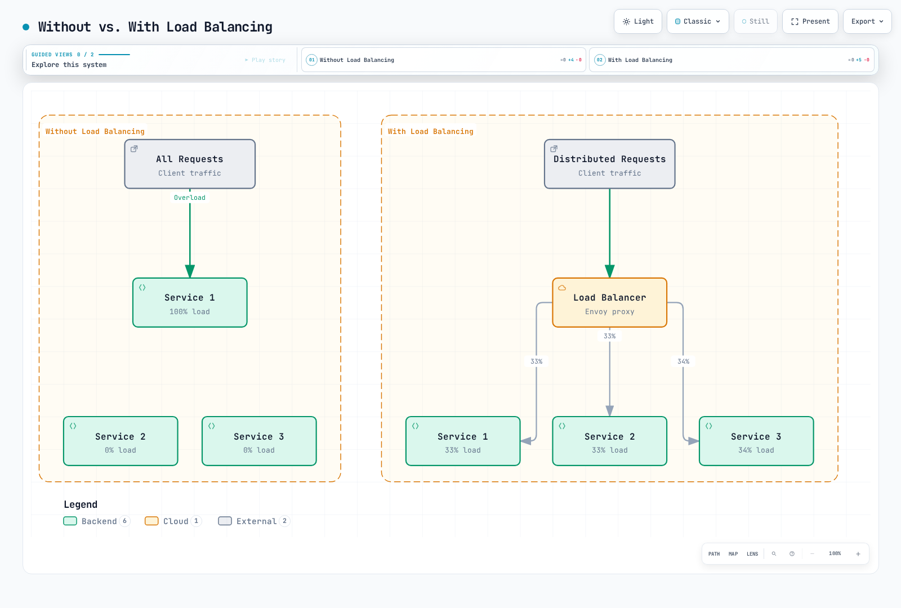
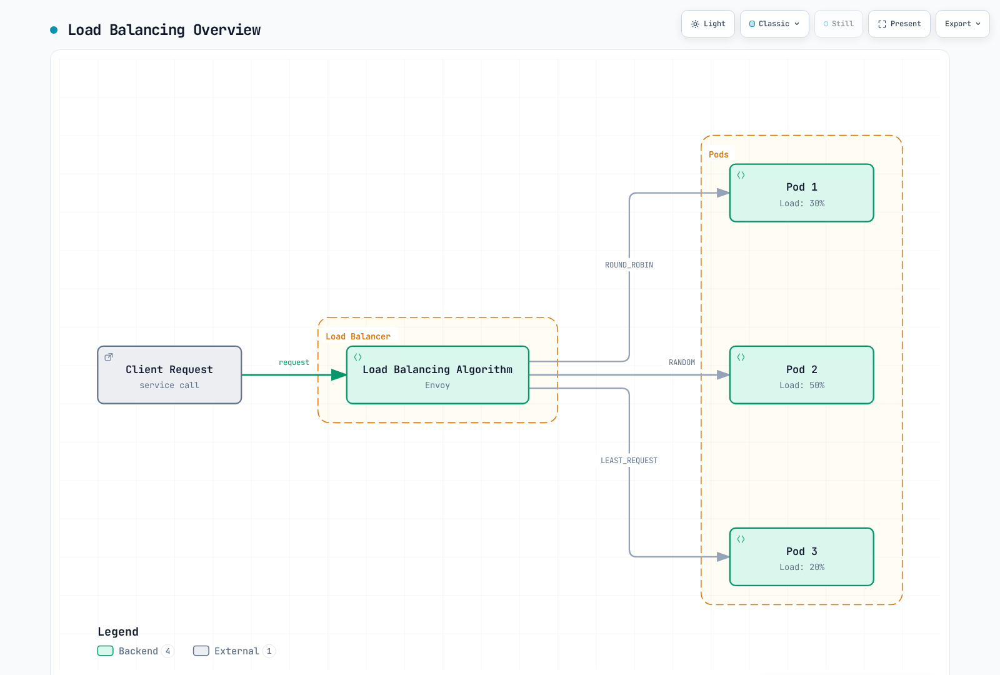
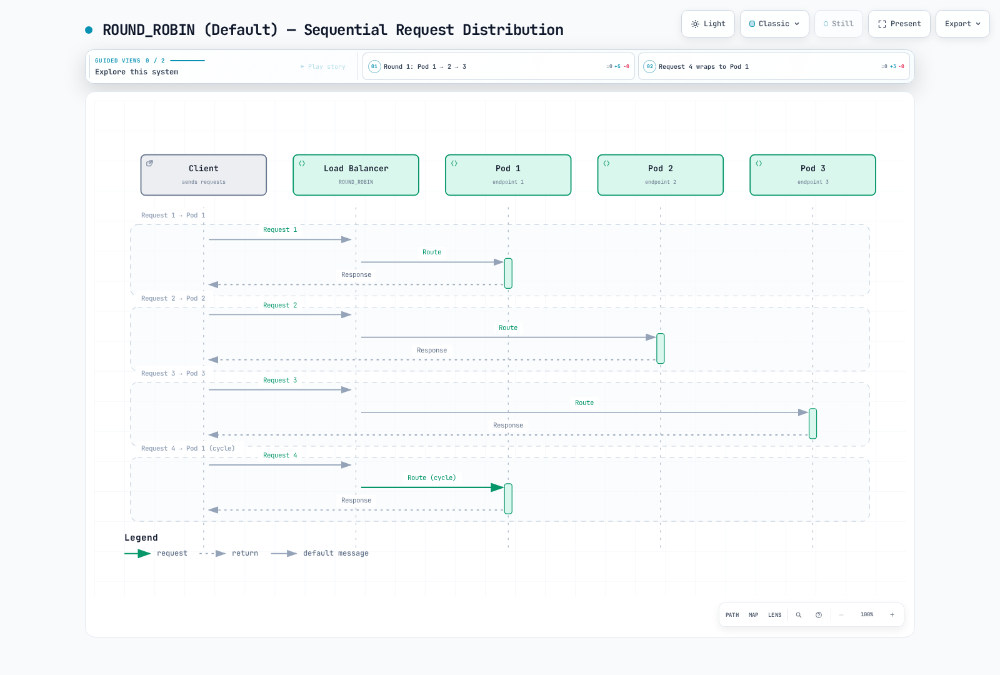
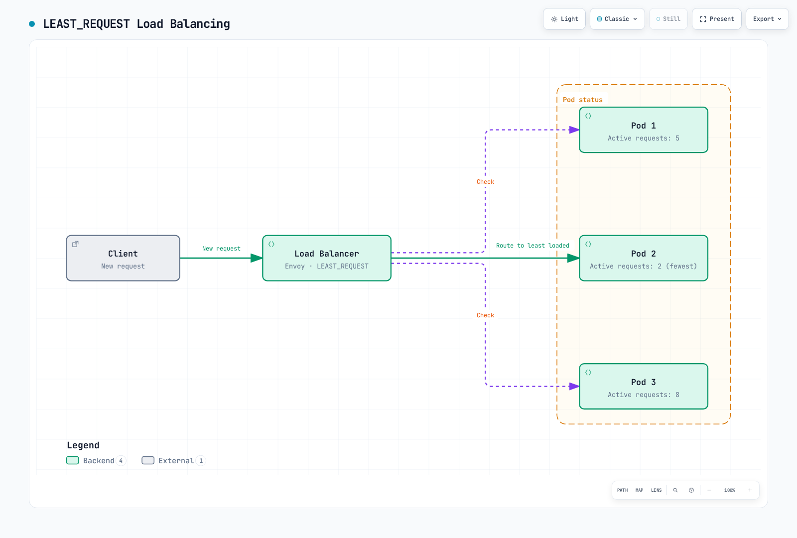
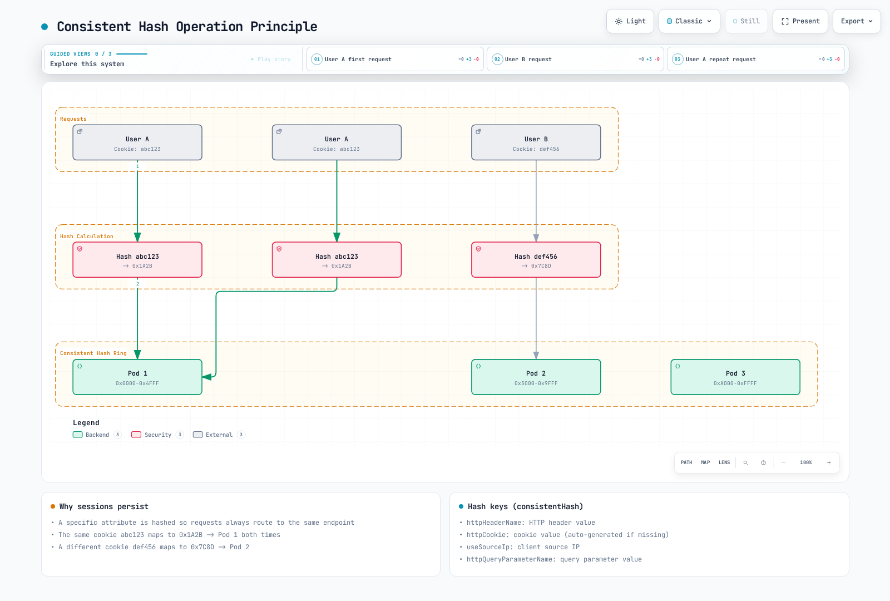
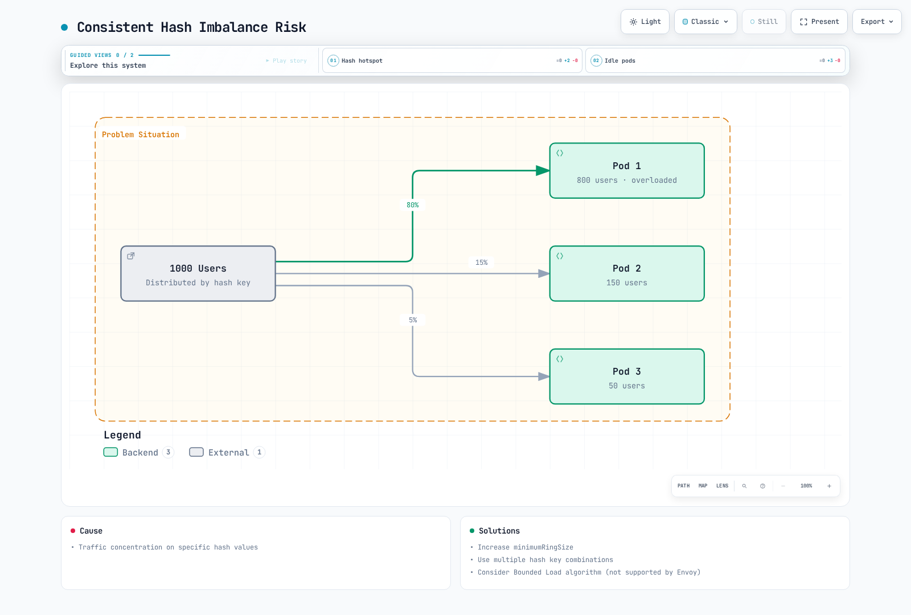
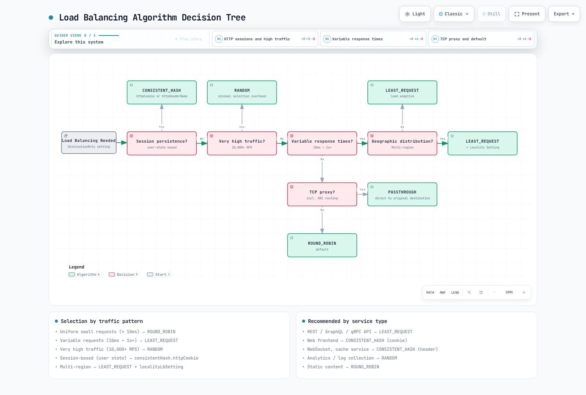

# Load Balancing

Istio provides various load balancing algorithms through Envoy to efficiently distribute traffic.

## Table of Contents

1. [Why Load Balancing?](#why-load-balancing)
2. [Load Balancing Overview](#load-balancing-overview)
3. [Load Balancing Algorithms](#load-balancing-algorithms)
4. [Consistent Hash Details](#consistent-hash-details)
5. [Locality-based Load Balancing](#locality-based-load-balancing)
6. [Connection Pool Settings](#connection-pool-settings)
7. [Practical Examples](#practical-examples)
8. [Algorithm Selection Guide](#algorithm-selection-guide)
9. [Best Practices](#best-practices)
10. [Troubleshooting](#troubleshooting)

## Why Load Balancing?

### Efficient Resource Utilization

Load balancing distributes traffic across multiple instances to improve overall system throughput and stability.



[🔍 View interactive diagram](https://www.atomai.click/kubernetes-docs/archmaps/en-service-mesh-istio-traffic-management-06-load-balancing-0.html)

### Key Benefits

| Problem | Without Load Balancing | With Load Balancing |
|---------|------------------------|---------------------|
| **Availability** | Single Point of Failure (SPOF) | Automatic failover on failure |
| **Performance** | Specific instance overload | Even load distribution |
| **Scalability** | Difficult horizontal scaling | Easy scale-out |
| **Response Time** | Inconsistent (0-1000ms+) | Consistent response time |
| **Resource Utilization** | Inefficient (partial use) | Efficient resource usage |

## Load Balancing Overview



[🔍 View interactive diagram](https://www.atomai.click/kubernetes-docs/archmaps/en-service-mesh-istio-traffic-management-06-load-balancing-1.html)

## Load Balancing Algorithms

Istio provides the following load balancing algorithms.

### Algorithm Comparison

| Algorithm | Description | Use Cases | Pros | Cons |
|-----------|-------------|-----------|------|------|
| **ROUND_ROBIN** | Sequential distribution (default) | Stateless services | Simple, fair | Possible load imbalance |
| **LEAST_REQUEST** | Minimum active requests | High-performance APIs, DB connections | Load equalization | Slight overhead |
| **RANDOM** | Random distribution | High traffic volume | Simple, fast | Short-term imbalance possible |
| **PASSTHROUGH** | Original destination | TCP proxy, SNI routing | Flexibility | Limited control |
| **CONSISTENT_HASH** | Hash-based sticky | Session persistence, cache | Sticky sessions | Possible imbalance |

### 1. ROUND_ROBIN (Default)

Distributes requests sequentially to each endpoint.



[🔍 View interactive diagram](https://www.atomai.click/kubernetes-docs/archmaps/en-service-mesh-istio-traffic-management-06-load-balancing-2.html)

**Configuration Example:**

```yaml
apiVersion: networking.istio.io/v1
kind: DestinationRule
metadata:
  name: reviews-round-robin
spec:
  host: reviews
  trafficPolicy:
    loadBalancer:
      simple: ROUND_ROBIN
```

**Use Cases:**
- Stateless REST APIs
- Pods with identical performance
- When default settings are sufficient

**Pros:**
- Simple and predictable implementation
- Fair distribution

**Cons:**
- Does not consider per-pod load differences
- Long requests can cause imbalance

### 2. LEAST_REQUEST

Routes to the endpoint with the fewest active requests.



[🔍 View interactive diagram](https://www.atomai.click/kubernetes-docs/archmaps/en-service-mesh-istio-traffic-management-06-load-balancing-3.html)

**Configuration Example:**

```yaml
apiVersion: networking.istio.io/v1
kind: DestinationRule
metadata:
  name: api-least-request
spec:
  host: api-service
  trafficPolicy:
    loadBalancer:
      simple: LEAST_REQUEST
      warmupDurationSecs: 60  # 60 second warmup (optional)
```

**Advanced Configuration:**

```yaml
apiVersion: networking.istio.io/v1
kind: DestinationRule
metadata:
  name: api-least-request-advanced
spec:
  host: api-service
  trafficPolicy:
    loadBalancer:
      simple: LEAST_REQUEST
      warmupDurationSecs: 120  # New pod warmup
    connectionPool:
      http:
        http2MaxRequests: 100
        maxRequestsPerConnection: 10
```

**Use Cases:**
- APIs with variable response times
- Database connection pools
- Services with heavy processing
- When real-time load balancing is important

**Pros:**
- Adapts to real-time load
- Improves response time consistency
- Absorbs per-pod performance differences

**Cons:**
- Slight overhead (tracking active requests)

### 3. RANDOM

Randomly selects an endpoint.

```yaml
apiVersion: networking.istio.io/v1
kind: DestinationRule
metadata:
  name: reviews-random
spec:
  host: reviews
  trafficPolicy:
    loadBalancer:
      simple: RANDOM
```

**Use Cases:**
- High volume traffic (statistically even)
- When simple and fast selection is needed
- When pod performance is identical

**Pros:**
- Very fast selection
- Simple implementation
- Statistically even at scale

**Cons:**
- Short-term imbalance possible
- Unpredictable

### 4. PASSTHROUGH

Directly connects to the original destination specified by the client.

```yaml
apiVersion: networking.istio.io/v1
kind: DestinationRule
metadata:
  name: tcp-passthrough
spec:
  host: "*.external-service.com"
  trafficPolicy:
    loadBalancer:
      simple: PASSTHROUGH
```

**Use Cases:**
- TCP proxy
- SNI-based routing
- Direct external service connections
- TLS PASSTHROUGH mode

**Pros:**
- Preserves original destination address
- Flexible routing

**Cons:**
- Limited load balancing control

### 5. LEAST_CONN (Deprecated -> LEAST_REQUEST)

**Note**: `LEAST_CONN` is **deprecated** and replaced by `LEAST_REQUEST`.

**Migration:**
```yaml
# Old version (deprecated)
trafficPolicy:
  loadBalancer:
    simple: LEAST_CONN

# New version
trafficPolicy:
  loadBalancer:
    simple: LEAST_REQUEST
```

## Consistent Hash Details

Consistent Hash routes to the same endpoint based on specific attributes to ensure session persistence.

### Consistent Hash Operation Principle



[🔍 View interactive diagram](https://www.atomai.click/kubernetes-docs/archmaps/en-service-mesh-istio-traffic-management-06-load-balancing-4.html)

### 1. HTTP Header-based

Calculates hash from a specific HTTP header value.

```yaml
apiVersion: networking.istio.io/v1
kind: DestinationRule
metadata:
  name: user-hash
spec:
  host: api-service
  trafficPolicy:
    loadBalancer:
      consistentHash:
        httpHeaderName: "x-user-id"
```

**Use Cases:**
- Per-user session persistence
- API key-based routing
- Per-tenant isolation

### 2. HTTP Cookie-based

Calculates hash from cookie value and auto-generates cookie if missing.

```yaml
apiVersion: networking.istio.io/v1
kind: DestinationRule
metadata:
  name: cookie-hash
spec:
  host: web-service
  trafficPolicy:
    loadBalancer:
      consistentHash:
        httpCookie:
          name: "user-session"
          ttl: 3600s  # 1 hour TTL
```

**Use Cases:**
- Web application session persistence
- Shopping cart persistence
- User experience consistency

### 3. Source IP-based

Calculates hash from client's source IP address.

```yaml
apiVersion: networking.istio.io/v1
kind: DestinationRule
metadata:
  name: source-ip-hash
spec:
  host: api-service
  trafficPolicy:
    loadBalancer:
      consistentHash:
        useSourceIp: true
```

**Use Cases:**
- IP-based session persistence
- Rate limiting (per IP)
- Regional caching

**Cautions:**
- Clients behind NAT may be routed to the same pod
- When using proxies, verify actual client IP

### 4. HTTP Query Parameter-based

Calculates hash from query parameter value.

```yaml
apiVersion: networking.istio.io/v1
kind: DestinationRule
metadata:
  name: query-param-hash
spec:
  host: api-service
  trafficPolicy:
    loadBalancer:
      consistentHash:
        httpQueryParameterName: "user_id"
```

**Use Cases:**
- Resource ID-based routing in RESTful APIs
- Cache-friendly routing
- Sharding strategies

### 5. Minimum Ring Size Setting

Set minimum Consistent Hash Ring size to minimize redistribution.

```yaml
apiVersion: networking.istio.io/v1
kind: DestinationRule
metadata:
  name: hash-with-ring-size
spec:
  host: cache-service
  trafficPolicy:
    loadBalancer:
      consistentHash:
        httpHeaderName: "x-cache-key"
        minimumRingSize: 1024  # Default: 1024
```

**Explanation:**
- Larger ring size provides more even distribution
- Reduces proportion of keys redistributed on pod add/remove
- Slightly increased memory usage

**Recommended Values:**
- Small scale (< 10 pods): 1024 (default)
- Medium scale (10-50 pods): 2048
- Large scale (50+ pods): 4096

### Consistent Hash Combination Example

```yaml
apiVersion: networking.istio.io/v1
kind: DestinationRule
metadata:
  name: advanced-consistent-hash
spec:
  host: api-service
  trafficPolicy:
    loadBalancer:
      consistentHash:
        httpCookie:
          name: "session-id"
          path: "/api"
          ttl: 7200s  # 2 hours
        minimumRingSize: 2048
    connectionPool:
      http:
        maxRequestsPerConnection: 100
        idleTimeout: 300s
```

### Consistent Hash Cautions

#### 1. Imbalance Risk



[🔍 View interactive diagram](https://www.atomai.click/kubernetes-docs/archmaps/en-service-mesh-istio-traffic-management-06-load-balancing-5.html)

**Cause**: Traffic concentration on specific hash values

**Solutions:**
- Increase `minimumRingSize`
- Use multiple hash key combinations
- Consider Bounded Load algorithm (not supported by Envoy)

#### 2. Redistribution on Pod Add/Remove

```yaml
# On pod scale out
# - Before: Pod 1, Pod 2, Pod 3
# - After: Pod 1, Pod 2, Pod 3, Pod 4
# - Result: ~25% of sessions redistributed to different pods
```

**Mitigation Strategies:**
- Use graceful shutdown
- Use external session storage (Redis, Memcached)
- Scale gradually

## Locality-based Load Balancing

Locality-based Load Balancing prioritizes geographically closer endpoints.

### Basic Locality Configuration

```yaml
apiVersion: networking.istio.io/v1
kind: DestinationRule
metadata:
  name: locality-lb
spec:
  host: reviews
  trafficPolicy:
    loadBalancer:
      localityLbSetting:
        enabled: true
```

### Locality Distribution Ratio

```yaml
apiVersion: networking.istio.io/v1
kind: DestinationRule
metadata:
  name: locality-distribute
spec:
  host: reviews
  trafficPolicy:
    loadBalancer:
      localityLbSetting:
        enabled: true
        distribute:
        - from: us-west/zone-1/*
          to:
            "us-west/zone-1/*": 80  # 80% to same zone
            "us-west/zone-2/*": 20  # 20% to other zone
```

### Locality Failover

Automatically switches to another region when one fails.

```yaml
apiVersion: networking.istio.io/v1
kind: DestinationRule
metadata:
  name: locality-failover
spec:
  host: api-service
  trafficPolicy:
    loadBalancer:
      localityLbSetting:
        enabled: true
        failover:
        - from: us-west
          to: us-east
```

### Multi-Region Example

```yaml
apiVersion: networking.istio.io/v1
kind: DestinationRule
metadata:
  name: global-service-locality
spec:
  host: global-api
  trafficPolicy:
    loadBalancer:
      simple: LEAST_REQUEST
      localityLbSetting:
        enabled: true
        distribute:
        # US West clients
        - from: us-west/*
          to:
            "us-west/*": 90      # 90% local
            "us-east/*": 10      # 10% remote (DR)
        # US East clients
        - from: us-east/*
          to:
            "us-east/*": 90
            "us-west/*": 10
        failover:
        - from: us-west
          to: us-east
        - from: us-east
          to: us-west
    outlierDetection:
      consecutiveErrors: 5
      interval: 30s
      baseEjectionTime: 30s
```

**Use Cases:**
- Multi-region deployments
- Latency minimization
- Inter-region disaster recovery
- Cost optimization (same AZ communication)

## Connection Pool Settings

Configure Connection Pool alongside load balancing to optimize performance.

### HTTP/1.1 Connection Pool

```yaml
apiVersion: networking.istio.io/v1
kind: DestinationRule
metadata:
  name: http1-connection-pool
spec:
  host: api-service
  trafficPolicy:
    loadBalancer:
      simple: LEAST_REQUEST
    connectionPool:
      tcp:
        maxConnections: 100        # Maximum connections
        connectTimeout: 3s         # Connection timeout
      http:
        http1MaxPendingRequests: 50  # Pending request count
        maxRequestsPerConnection: 100 # Max requests per connection
        idleTimeout: 300s             # Idle connection timeout
```

### HTTP/2 Connection Pool

```yaml
apiVersion: networking.istio.io/v1
kind: DestinationRule
metadata:
  name: http2-connection-pool
spec:
  host: grpc-service
  trafficPolicy:
    loadBalancer:
      simple: LEAST_REQUEST
    connectionPool:
      tcp:
        maxConnections: 50
      http:
        http2MaxRequests: 1000     # HTTP/2 concurrent requests
        maxRequestsPerConnection: 0 # Unlimited (HTTP/2 multiplexing)
        h2UpgradePolicy: UPGRADE    # Allow HTTP/2 upgrade
```

## Practical Examples

### Example 1: High-Performance API Service

```yaml
apiVersion: networking.istio.io/v1
kind: DestinationRule
metadata:
  name: api-high-performance
  namespace: production
spec:
  host: api-service
  trafficPolicy:
    loadBalancer:
      simple: LEAST_REQUEST
      warmupDurationSecs: 60  # New pod warmup
    connectionPool:
      tcp:
        maxConnections: 200
        connectTimeout: 5s
      http:
        http2MaxRequests: 500
        maxRequestsPerConnection: 100
        idleTimeout: 300s
    outlierDetection:
      consecutiveErrors: 5
      interval: 30s
      baseEjectionTime: 30s
      maxEjectionPercent: 50
```

**Use Scenarios:**
- High-performance REST APIs
- Requests with variable response times
- Environments with per-pod performance differences

### Example 2: User Session-based Routing

```yaml
apiVersion: networking.istio.io/v1
kind: DestinationRule
metadata:
  name: web-session-affinity
spec:
  host: web-frontend
  trafficPolicy:
    loadBalancer:
      consistentHash:
        httpCookie:
          name: "session-id"
          ttl: 7200s  # 2 hours
        minimumRingSize: 2048
    connectionPool:
      tcp:
        maxConnections: 500
      http:
        http1MaxPendingRequests: 100
        maxRequestsPerConnection: 50
```

**Use Scenarios:**
- Web application session persistence
- Shopping cart consistency
- Per-user cache utilization

### Example 3: Multi-Region Global Service

```yaml
apiVersion: networking.istio.io/v1
kind: DestinationRule
metadata:
  name: global-api-multi-region
spec:
  host: global-api
  trafficPolicy:
    loadBalancer:
      simple: LEAST_REQUEST
      localityLbSetting:
        enabled: true
        distribute:
        # US West
        - from: us-west-1/*
          to:
            "us-west-1/*": 80
            "us-west-2/*": 15
            "us-east-1/*": 5
        # US East
        - from: us-east-1/*
          to:
            "us-east-1/*": 80
            "us-east-2/*": 15
            "us-west-1/*": 5
        # EU
        - from: eu-central-1/*
          to:
            "eu-central-1/*": 90
            "eu-west-1/*": 10
        failover:
        - from: us-west-1
          to: us-west-2
        - from: us-east-1
          to: us-east-2
    connectionPool:
      tcp:
        maxConnections: 1000
      http:
        http2MaxRequests: 2000
    outlierDetection:
      consecutiveErrors: 5
      interval: 30s
      baseEjectionTime: 60s
```

**Use Scenarios:**
- Global SaaS services
- Latency minimization
- Per-region disaster recovery
- Cross-AZ traffic cost reduction

### Example 4: Cache Service Optimization

```yaml
apiVersion: networking.istio.io/v1
kind: DestinationRule
metadata:
  name: cache-service-optimized
spec:
  host: redis-cache
  trafficPolicy:
    loadBalancer:
      consistentHash:
        httpHeaderName: "x-cache-key"
        minimumRingSize: 4096  # Large ring size to minimize redistribution
    connectionPool:
      tcp:
        maxConnections: 100
        connectTimeout: 1s
      http:
        http1MaxPendingRequests: 20
        maxRequestsPerConnection: 1000
        idleTimeout: 600s
    outlierDetection:
      consecutiveErrors: 3
      interval: 10s
      baseEjectionTime: 30s
```

**Use Scenarios:**
- Maximize cache hit rate
- Consistent cache key routing
- Sharding strategies

### Example 5: Database Connection Pool

```yaml
apiVersion: networking.istio.io/v1
kind: DestinationRule
metadata:
  name: database-connection-pool
spec:
  host: postgres-primary
  trafficPolicy:
    loadBalancer:
      simple: LEAST_REQUEST
    connectionPool:
      tcp:
        maxConnections: 50  # DB connection limit
        connectTimeout: 5s
      http:
        http1MaxPendingRequests: 10
        maxRequestsPerConnection: 100
    outlierDetection:
      consecutiveErrors: 3
      interval: 60s
      baseEjectionTime: 120s
```

**Use Scenarios:**
- Database connection pool management
- Slow query distribution
- Connection limit enforcement

### Example 6: High Traffic Processing

```yaml
apiVersion: networking.istio.io/v1
kind: DestinationRule
metadata:
  name: high-traffic-service
spec:
  host: analytics-ingestion
  trafficPolicy:
    loadBalancer:
      simple: RANDOM  # Fast selection to minimize overhead
    connectionPool:
      tcp:
        maxConnections: 5000
        connectTimeout: 1s
      http:
        http2MaxRequests: 10000
        maxRequestsPerConnection: 1000
        idleTimeout: 60s
    outlierDetection:
      consecutiveErrors: 10
      interval: 30s
      baseEjectionTime: 30s
      maxEjectionPercent: 20  # Limited ejection at scale
```

**Use Scenarios:**
- Event collection (Analytics)
- Log collection
- Large-scale data processing

## Algorithm Selection Guide

### Decision Tree



[🔍 View interactive diagram](https://www.atomai.click/kubernetes-docs/archmaps/en-service-mesh-istio-traffic-management-06-load-balancing-6.html)

### Recommended Algorithms by Service Type

| Service Type | Recommended Algorithm | Reason |
|-------------|----------------------|--------|
| **REST API** | LEAST_REQUEST | Response time consistency |
| **GraphQL API** | LEAST_REQUEST | Complex query distribution |
| **gRPC** | LEAST_REQUEST | Streaming load balance |
| **Web Frontend** | CONSISTENT_HASH (cookie) | Session persistence |
| **WebSocket** | CONSISTENT_HASH (header) | Connection persistence |
| **Cache Service** | CONSISTENT_HASH (header) | Cache hit rate |
| **Analytics/Log Collection** | RANDOM | Large-scale processing |
| **Database** | LEAST_REQUEST | Connection pool management |
| **Static Content** | ROUND_ROBIN | Simple and sufficient |
| **Message Queue** | LEAST_REQUEST | Queue load balance |
| **Batch Processing** | LEAST_REQUEST | Job distribution |

### Selection by Traffic Pattern

```yaml
# 1. Uniform small requests (< 10ms)
trafficPolicy:
  loadBalancer:
    simple: ROUND_ROBIN  # Simple and efficient

# 2. Variable requests (10ms ~ 1s+)
trafficPolicy:
  loadBalancer:
    simple: LEAST_REQUEST  # Load adaptive

# 3. Very high traffic (10,000+ RPS)
trafficPolicy:
  loadBalancer:
    simple: RANDOM  # Minimize overhead

# 4. Session-based (user state)
trafficPolicy:
  loadBalancer:
    consistentHash:
      httpCookie:
        name: "session-id"
        ttl: 3600s

# 5. Multi-region
trafficPolicy:
  loadBalancer:
    simple: LEAST_REQUEST
    localityLbSetting:
      enabled: true
```

## Best Practices

### 1. Algorithm Selection Principles

**Good Example:**
```yaml
# API with variable response times
apiVersion: networking.istio.io/v1
kind: DestinationRule
metadata:
  name: api-service-best-practice
spec:
  host: api-service
  trafficPolicy:
    loadBalancer:
      simple: LEAST_REQUEST  # Load adaptive
      warmupDurationSecs: 60  # New pod warmup
```

**Bad Example:**
```yaml
# Using ROUND_ROBIN with variable response times
apiVersion: networking.istio.io/v1
kind: DestinationRule
metadata:
  name: api-service-bad-practice
spec:
  host: api-service
  trafficPolicy:
    loadBalancer:
      simple: ROUND_ROBIN  # Causes load imbalance
```

### 2. Connection Pool Required Settings

Always configure Connection Pool with load balancing:

```yaml
apiVersion: networking.istio.io/v1
kind: DestinationRule
metadata:
  name: complete-lb-config
spec:
  host: api-service
  trafficPolicy:
    loadBalancer:
      simple: LEAST_REQUEST
    connectionPool:  # Required
      tcp:
        maxConnections: 100
      http:
        http1MaxPendingRequests: 50
        maxRequestsPerConnection: 100
```

### 3. Outlier Detection Combination

Use with Circuit Breaker to remove failing pods:

```yaml
apiVersion: networking.istio.io/v1
kind: DestinationRule
metadata:
  name: lb-with-outlier
spec:
  host: api-service
  trafficPolicy:
    loadBalancer:
      simple: LEAST_REQUEST
    outlierDetection:  # Required
      consecutiveErrors: 5
      interval: 30s
      baseEjectionTime: 30s
```

### 4. Cautions When Using Consistent Hash

```yaml
# Good example: Using session storage
apiVersion: networking.istio.io/v1
kind: DestinationRule
metadata:
  name: web-with-redis-session
  annotations:
    description: "Uses Redis for session storage"
spec:
  host: web-frontend
  trafficPolicy:
    loadBalancer:
      consistentHash:
        httpCookie:
          name: "session-id"
          ttl: 3600s
    # Using Redis session storage maintains
    # sessions even on pod restart
```

```yaml
# Caution: Local session only
apiVersion: networking.istio.io/v1
kind: DestinationRule
metadata:
  name: web-local-session-only
  annotations:
    warning: "No external session storage - sessions lost on pod restart"
spec:
  host: web-frontend
  trafficPolicy:
    loadBalancer:
      consistentHash:
        httpCookie:
          name: "session-id"
          ttl: 3600s
    # Warning: Sessions lost on pod restart
```

### 5. Multi-Region Deployment

```yaml
# Good example: Locality + Failover
apiVersion: networking.istio.io/v1
kind: DestinationRule
metadata:
  name: multi-region-best-practice
spec:
  host: global-service
  trafficPolicy:
    loadBalancer:
      simple: LEAST_REQUEST
      localityLbSetting:
        enabled: true
        distribute:
        - from: us-west/*
          to:
            "us-west/*": 80
            "us-east/*": 20
        failover:  # Required
        - from: us-west
          to: us-east
```

### 6. Monitoring and Metrics

Monitor load balancing effectiveness:

```yaml
# Prometheus queries
# Request distribution per pod
sum by (destination_workload) (rate(istio_requests_total[5m]))

# Response time per pod
histogram_quantile(0.95,
  sum by (destination_workload, le) (
    rate(istio_request_duration_milliseconds_bucket[5m])
  )
)

# Active connection count
sum by (destination_workload) (envoy_cluster_upstream_cx_active)
```

### 7. Gradual Application

```yaml
# Step 1: Default ROUND_ROBIN
simple: ROUND_ROBIN

# Step 2: LEAST_REQUEST after monitoring
simple: LEAST_REQUEST

# Step 3: Add Connection Pool
simple: LEAST_REQUEST
connectionPool: ...

# Step 4: Add Outlier Detection
simple: LEAST_REQUEST
connectionPool: ...
outlierDetection: ...
```

### 8. Documentation

```yaml
apiVersion: networking.istio.io/v1
kind: DestinationRule
metadata:
  name: api-service-lb
  annotations:
    # Configuration rationale
    purpose: "Distribute load based on active requests"

    # Algorithm selection basis
    algorithm-rationale: |
      - LEAST_REQUEST: Response times vary 10ms-500ms
      - warmupDurationSecs: New pods need 60s to warm up cache

    # Test results
    test-results: |
      - Load test: 1000 RPS evenly distributed
      - P95 latency: 150ms (improved from 300ms with ROUND_ROBIN)
      - No pod overload observed

    # Monitoring
    monitoring: |
      - Dashboard: grafana.example.com/d/istio-workload
      - Alert: High P95 latency > 500ms
```

## Troubleshooting

### Unbalanced Load Distribution

**Symptoms:**
```bash
# Check CPU usage per pod
kubectl top pods -n production

# Output:
# NAME                CPU    MEMORY
# api-pod-1           80%    2Gi
# api-pod-2           20%    1Gi
# api-pod-3           15%    1Gi
```

**Causes and Solutions:**

```yaml
# 1. Change ROUND_ROBIN -> LEAST_REQUEST
apiVersion: networking.istio.io/v1
kind: DestinationRule
metadata:
  name: api-service-fix
spec:
  host: api-service
  trafficPolicy:
    loadBalancer:
      simple: LEAST_REQUEST  # Changed

# 2. Add Warmup
      warmupDurationSecs: 60

# 3. Add Outlier Detection
    outlierDetection:
      consecutiveErrors: 5
      interval: 30s
      baseEjectionTime: 30s
```

### Consistent Hash Imbalance

**Symptoms:**
```bash
# Check Envoy metrics
kubectl exec -it pod-name -c istio-proxy -- \
  curl localhost:15000/stats/prometheus | grep upstream_rq_total

# Requests concentrated on specific pod
```

**Solution:**

```yaml
apiVersion: networking.istio.io/v1
kind: DestinationRule
metadata:
  name: hash-fix
spec:
  host: api-service
  trafficPolicy:
    loadBalancer:
      consistentHash:
        httpHeaderName: "x-user-id"
        minimumRingSize: 4096  # Increase 2048 -> 4096
```

### Locality-based Routing Not Working

**Verification Steps:**

```bash
# 1. Check pod locality labels
kubectl get pods -o jsonpath='{range .items[*]}{.metadata.name}{"\t"}{.metadata.labels.topology\.kubernetes\.io/region}{"\t"}{.metadata.labels.topology\.kubernetes\.io/zone}{"\n"}{end}'

# 2. Check Istio Proxy configuration
istioctl proxy-config endpoints pod-name | grep locality

# 3. Check DestinationRule application
istioctl proxy-config clusters pod-name --fqdn api-service.default.svc.cluster.local -o json | jq '.[] | .localityLbEndpoints'
```

**Fix:**

```yaml
# Check and add node labels
apiVersion: v1
kind: Node
metadata:
  labels:
    topology.kubernetes.io/region: us-west
    topology.kubernetes.io/zone: us-west-1
```

## References

- [Istio Load Balancing](https://istio.io/latest/docs/reference/config/networking/destination-rule/#LoadBalancerSettings)
- [Envoy Load Balancing](https://www.envoyproxy.io/docs/envoy/latest/intro/arch_overview/upstream/load_balancing/load_balancing)
- [Consistent Hashing](https://www.toptal.com/big-data/consistent-hashing)
- [Locality Load Balancing](https://istio.io/latest/docs/tasks/traffic-management/locality-load-balancing/)
