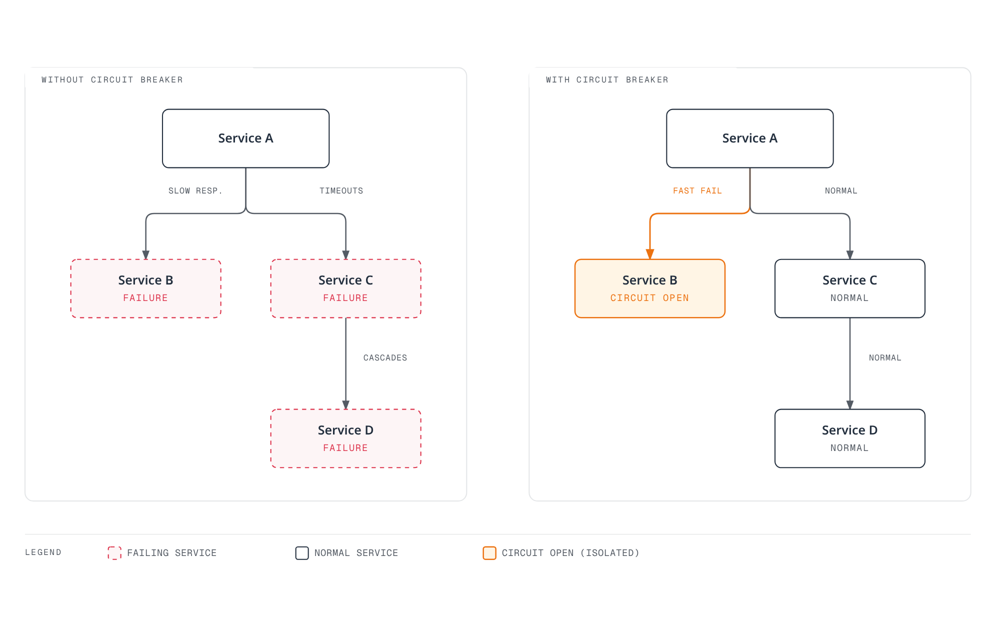
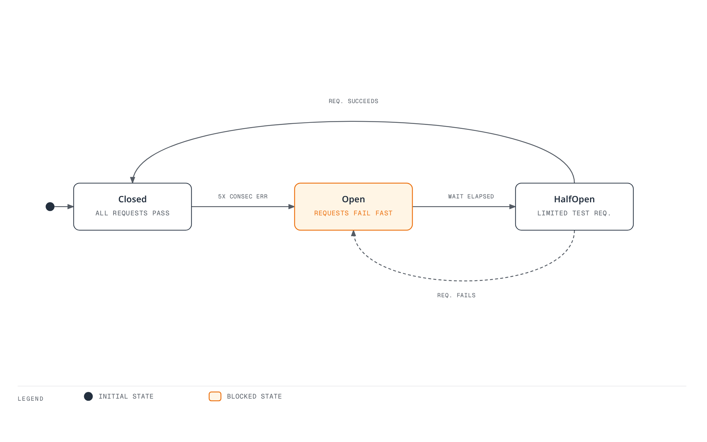
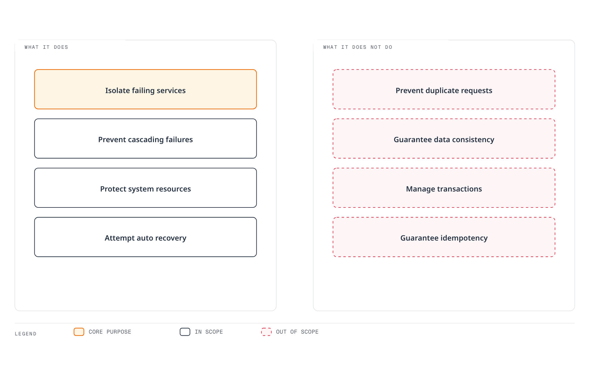
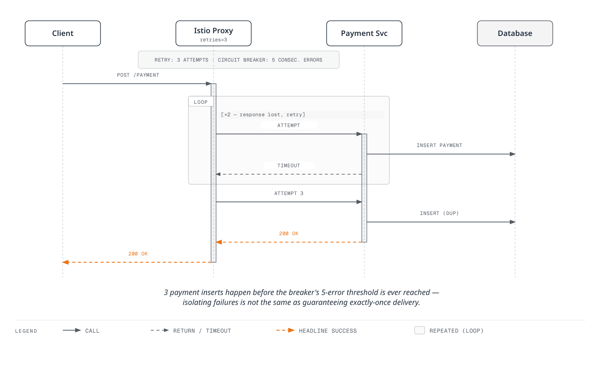

# Circuit Breaker

Circuit Breaker automatically isolates failing services to prevent cascading failures.

## Table of Contents

1. [Why Circuit Breaker?](#why-circuit-breaker)
2. [Circuit Breaker Overview](#circuit-breaker-overview)
3. [Connection Pool Settings](#connection-pool-settings)
4. [Outlier Detection](#outlier-detection)
5. [Combination with Retry Policy](#combination-with-retry-policy)
6. [Practical Examples](#practical-examples)
7. [External Service Circuit Breaker](#external-service-circuit-breaker)
8. [Monitoring and Debugging](#monitoring-and-debugging)
9. [Important Considerations](#important-considerations)
10. [Best Practices](#best-practices)

## Why Circuit Breaker?

### Preventing Cascading Failures

In microservice architecture, it prevents failures from one service from propagating to other services.



[🔍 View interactive diagram](https://www.atomai.click/kubernetes-docs/archmaps/en-service-mesh-istio-traffic-management-07-circuit-breaker-0.html)

### Key Benefits

| Problem | Without Circuit Breaker | With Circuit Breaker |
|---------|------------------------|----------------------|
| **Response Time** | Wait until timeout (30s+) | Fast rejection after configured limits are reached |
| **Resource Usage** | Thread/connection exhaustion | Resource protection |
| **Failure Propagation** | Cascading failures occur | Failure isolation |
| **Recovery Time** | Manual intervention required | Automatic recovery attempts |

## Circuit Breaker Overview

The diagram illustrates the generic Closed/Open/Half-Open library pattern. Istio implements resource-based connection-pool circuit breakers and passive per-endpoint outlier ejection; it does not expose a single mesh-wide three-state breaker. Limits/health observations are local to each proxy and upstream cluster/priority, with possible concurrency overshoot. Outlier ejection removes an endpoint from selection temporarily; it does not delete a Pod. Examples below are alternatives.



[🔍 View interactive diagram](https://www.atomai.click/kubernetes-docs/archmaps/en-service-mesh-istio-traffic-management-07-circuit-breaker-1.html)

## Connection Pool Settings

```yaml
apiVersion: networking.istio.io/v1
kind: DestinationRule
metadata:
  name: reviews-circuit-breaker
spec:
  host: reviews
  trafficPolicy:
    connectionPool:
      tcp:
        maxConnections: 100
      http:
        http1MaxPendingRequests: 50
        http2MaxRequests: 100
        maxRequestsPerConnection: 2
```

## Outlier Detection

Outlier Detection temporarily excludes unhealthy endpoints from load balancing, subject to ejection limits and panic behavior.

```yaml
apiVersion: networking.istio.io/v1
kind: DestinationRule
metadata:
  name: reviews-outlier
spec:
  host: reviews
  trafficPolicy:
    outlierDetection:
      consecutive5xxErrors: 5        # 5 consecutive errors
      interval: 30s               # Check every 30 seconds
      baseEjectionTime: 30s       # Minimum; repeated ejection can last longer
      maxEjectionPercent: 50      # Remove up to 50%
      minHealthPercent: 40        # Below this, disable outlier isolation and use all hosts
```

### Advanced Outlier Detection Settings

Consecutive-error detection can eject inline; `interval` controls periodic sweeps, not a mandatory wait before every ejection. `minHealthPercent` is a fail-open threshold, not a reserved healthy capacity floor. `maxEjectionTime` is an Envoy field not exposed by this Istio DestinationRule API; do not put it in these manifests.

```yaml
apiVersion: networking.istio.io/v1
kind: DestinationRule
metadata:
  name: advanced-outlier
spec:
  host: api-service
  trafficPolicy:
    outlierDetection:
      # Consecutive error based
      consecutiveGatewayErrors: 3    # HTTP 502/503/504
      consecutive5xxErrors: 5        # All HTTP 5xx

      # Time intervals
      interval: 10s                  # Check every 10 seconds
      baseEjectionTime: 30s          # First ejection time

      # Rate limits
      maxEjectionPercent: 50         # Remove up to 50%
      minHealthPercent: 30           # Fail-open/panic threshold, not a health guarantee

      # Separate local connection errors from upstream response errors
      splitExternalLocalOriginErrors: true
```

## Combination with Retry Policy

Use Circuit Breaker together with Retry to increase resilience.

### Basic Combination

```yaml
apiVersion: networking.istio.io/v1
kind: VirtualService
metadata:
  name: reviews-retry
spec:
  hosts:
  - reviews
  http:
  - route:
    - destination:
        host: reviews
    retries:
      attempts: 3                    # 3 retries
      perTryTimeout: 2s              # 2 second timeout per attempt
      retryOn: 5xx,reset,connect-failure
---
apiVersion: networking.istio.io/v1
kind: DestinationRule
metadata:
  name: reviews-circuit-breaker
spec:
  host: reviews
  trafficPolicy:
    connectionPool:
      http:
        http1MaxPendingRequests: 10
        maxRequestsPerConnection: 2
    outlierDetection:
      consecutive5xxErrors: 5
      interval: 10s
      baseEjectionTime: 30s
```

### Retry Budget Pattern

This budget limits concurrent retries relative to active/pending requests at each proxy cluster; it is not a requests-per-second limit. Retry-safe reads use the retry policy, while other methods explicitly disable it.

```yaml
apiVersion: networking.istio.io/v1
kind: VirtualService
metadata:
  name: payment-retry-budget
spec:
  hosts:
  - payment-service
  http:
  - match:
    - method:
        regex: "^(GET|HEAD)$"
    route:
    - destination:
        host: payment-service
    retries:
      attempts: 2                    # Minimize retries
      perTryTimeout: 1s              # Fast fail
      retryOn: connect-failure,refused-stream
  - route:
    - destination:
        host: payment-service
    retries:
      attempts: 0
---
apiVersion: networking.istio.io/v1
kind: DestinationRule
metadata:
  name: payment-circuit-breaker
spec:
  host: payment-service
  trafficPolicy:
    retryBudget:
      percent: 20
      minRetryConcurrency: 3
    connectionPool:
      http:
        http1MaxPendingRequests: 5   # Low queue
        maxRequestsPerConnection: 1  # 1 request per connection
    outlierDetection:
      consecutive5xxErrors: 3           # Fast blocking
      interval: 5s
      baseEjectionTime: 60s          # Long recovery time
```

## Practical Examples

### 1. Circuit Breaker for Services Inside the Mesh

#### Scenario: Database Service Protection

```yaml
apiVersion: networking.istio.io/v1
kind: DestinationRule
metadata:
  name: database-service-circuit-breaker
  namespace: production
spec:
  host: database-service
  trafficPolicy:
    connectionPool:
      tcp:
        maxConnections: 100          # Maximum 100 connections
    outlierDetection:
      consecutive5xxErrors: 5
      interval: 30s
      baseEjectionTime: 30s
      maxEjectionPercent: 50
  subsets:
  - name: v1
    labels:
      version: v1
  - name: v2
    labels:
      version: v2
```

**Use Cases**:
- Prevent database connection pool exhaustion
- Block cascading failures from slow queries
- Automatically remove unhealthy instances

Native database protocols only use TCP limits/failure observations here. The per-proxy connection limit is not the database’s global pool size and does not inspect slow SQL queries.

### 2. maxConnections: 1 Pattern (Single Connection)

#### Scenario: Legacy System or Resource-Constrained Service

```yaml
apiVersion: networking.istio.io/v1
kind: DestinationRule
metadata:
  name: legacy-system-protection
spec:
  host: legacy-api-service
  trafficPolicy:
    connectionPool:
      tcp:
        maxConnections: 1            # Limit to 1 connection
      http:
        http1MaxPendingRequests: 1   # 1 pending request
        maxRequestsPerConnection: 1  # 1 request per connection
        h2UpgradePolicy: DO_NOT_UPGRADE  # Prevent HTTP/2 upgrade
    outlierDetection:
      consecutive5xxErrors: 1           # Block immediately on 1 error
      interval: 10s
      baseEjectionTime: 60s
```

**Use Cases**:
- When legacy systems cannot handle concurrent connections
- When external API rate limits are very strict
- When sequential processing with a single connection is required

`maxConnections: 1` does not serialize the whole mesh or enforce an external API quota. Multiple proxies each have limits, HTTP/2 can multiplex requests, and `maxRequestsPerConnection: 1` disables reuse rather than guaranteeing single execution. Use an application queue/rate limiter for global coordination.

### 3. Per-Subset Circuit Breaker

#### Scenario: Different Circuit Breaker Settings per Version

```yaml
apiVersion: networking.istio.io/v1
kind: DestinationRule
metadata:
  name: reviews-subset-circuit-breaker
spec:
  host: reviews
  trafficPolicy:
    # Default policy (all subsets)
    connectionPool:
      http:
        http1MaxPendingRequests: 50
        maxRequestsPerConnection: 2
    outlierDetection:
      consecutive5xxErrors: 5
      interval: 30s
      baseEjectionTime: 30s
  subsets:
  - name: v1
    labels:
      version: v1
    # v1 uses default policy

  - name: v2
    labels:
      version: v2
    trafficPolicy:
      # v2 has stricter policy (new version testing)
      connectionPool:
        http:
          http1MaxPendingRequests: 10
          maxRequestsPerConnection: 1
      outlierDetection:
        consecutive5xxErrors: 3
        interval: 10s
        baseEjectionTime: 60s

  - name: v3-canary
    labels:
      version: v3
    trafficPolicy:
      # v3 Canary is very strict (initial deployment)
      connectionPool:
        http:
          http1MaxPendingRequests: 5
          maxRequestsPerConnection: 1
      outlierDetection:
        consecutive5xxErrors: 1
        interval: 5s
        baseEjectionTime: 120s
```

### 4. Advanced Connection Pool Pattern

#### Scenario: High-Performance Service

```yaml
apiVersion: networking.istio.io/v1
kind: DestinationRule
metadata:
  name: high-performance-service
spec:
  host: api-gateway
  trafficPolicy:
    connectionPool:
      tcp:
        maxConnections: 1000         # High concurrent connections
        connectTimeout: 3s
        tcpKeepalive:
          time: 7200s
          interval: 75s
          probes: 9
      http:
        http1MaxPendingRequests: 500
        http2MaxRequests: 1000
        maxRequestsPerConnection: 100  # Connection reuse
        idleTimeout: 300s
        h2UpgradePolicy: UPGRADE       # Use HTTP/2
    outlierDetection:
      consecutive5xxErrors: 10          # Lenient setting
      interval: 60s
      baseEjectionTime: 30s
      maxEjectionPercent: 20         # Remove up to 20% only
```

### 5. Health Check Based Circuit Breaker

```yaml
apiVersion: networking.istio.io/v1
kind: DestinationRule
metadata:
  name: health-check-circuit-breaker
spec:
  host: payment-service
  trafficPolicy:
    outlierDetection:
      # HTTP status code based
      consecutiveGatewayErrors: 5    # 502, 503, 504
      consecutive5xxErrors: 3        # 500~599

      # Performance based
      interval: 10s
      baseEjectionTime: 30s

      # Dynamic adjustment
      splitExternalLocalOriginErrors: true
      consecutiveLocalOriginFailures: 5
```

## External Service Circuit Breaker

HTTP examples below expect plaintext HTTP from the app to its sidecar, which originates verified TLS to the real external host on 443. If the app already uses TLS, avoid double TLS and use only policies visible at that layer. Native MongoDB application TLS/authentication remains a separate client/server requirement.

Use with ServiceEntry to protect external services.

### 1. External API Circuit Breaker

```yaml
# ServiceEntry: Register external API
apiVersion: networking.istio.io/v1
kind: ServiceEntry
metadata:
  name: external-payment-api
spec:
  hosts:
  - api.payment-provider.com
  ports:
  - number: 80
    name: http
    protocol: HTTP
    targetPort: 443
  location: MESH_EXTERNAL
  resolution: DNS
---
# DestinationRule: Apply Circuit Breaker
apiVersion: networking.istio.io/v1
kind: DestinationRule
metadata:
  name: external-payment-api-circuit-breaker
spec:
  host: api.payment-provider.com
  trafficPolicy:
    connectionPool:
      tcp:
        maxConnections: 10           # External API is limited
      http:
        http1MaxPendingRequests: 5
        maxRequestsPerConnection: 1  # Minimize connection reuse
    outlierDetection:
      consecutive5xxErrors: 3           # Fast blocking
      interval: 30s
      baseEjectionTime: 120s         # Long recovery time
      maxEjectionPercent: 100        # Can completely block
    tls:
      mode: SIMPLE
      sni: api.payment-provider.com
      subjectAltNames:
      - api.payment-provider.com
```

### 2. External Database Circuit Breaker

```yaml
apiVersion: networking.istio.io/v1
kind: ServiceEntry
metadata:
  name: external-mongodb
spec:
  hosts:
  - mongodb.external-cluster.com
  ports:
  - number: 27017
    name: tcp
    protocol: TCP
  location: MESH_EXTERNAL
  resolution: DNS
---
apiVersion: networking.istio.io/v1
kind: DestinationRule
metadata:
  name: external-mongodb-circuit-breaker
spec:
  host: mongodb.external-cluster.com
  trafficPolicy:
    connectionPool:
      tcp:
        maxConnections: 50
        connectTimeout: 5s
    outlierDetection:
      consecutive5xxErrors: 5
      interval: 60s
      baseEjectionTime: 60s
```

### 3. Rate Limited External Service

```yaml
apiVersion: networking.istio.io/v1
kind: ServiceEntry
metadata:
  name: rate-limited-api
spec:
  hosts:
  - api.rate-limited-service.com
  ports:
  - number: 80
    name: http
    protocol: HTTP
    targetPort: 443
  location: MESH_EXTERNAL
  resolution: DNS
---
apiVersion: networking.istio.io/v1
kind: DestinationRule
metadata:
  name: rate-limited-api-protection
spec:
  host: api.rate-limited-service.com
  trafficPolicy:
    connectionPool:
      http:
        http1MaxPendingRequests: 1   # Minimize queue
        maxRequestsPerConnection: 0  # Reuse connections; not a quota limiter
        idleTimeout: 1s              # Fast connection release
    outlierDetection:
      consecutive5xxErrors: 3           # Default HTTP 5xx detection; not 429
      interval: 60s
      baseEjectionTime: 30s          # Independent of provider Retry-After
    tls:
      mode: SIMPLE
      sni: api.rate-limited-service.com
      subjectAltNames:
      - api.rate-limited-service.com
---
# VirtualService: Retry settings
apiVersion: networking.istio.io/v1
kind: VirtualService
metadata:
  name: rate-limited-api-retry
spec:
  hosts:
  - api.rate-limited-service.com
  http:
  - route:
    - destination:
        host: api.rate-limited-service.com
    retries:
      attempts: 0                    # Disable retry (rate limit)
    timeout: 10s
```

HTTP 429 requires provider-aware throttling and Retry-After handling. Default 5xx outlier detection and connection churn do not enforce an API quota or infer its reset time.

## Monitoring and Debugging

### Check Envoy Metrics

```bash
# Check Circuit Breaker status
kubectl exec -it <pod-name> -c istio-proxy -- \
  curl localhost:15000/stats/prometheus | grep circuit_breakers

# Outlier Detection status
kubectl exec -it <pod-name> -c istio-proxy -- \
  curl localhost:15000/stats/prometheus | grep outlier_detection

# Connection Pool status
kubectl exec -it <pod-name> -c istio-proxy -- \
  curl localhost:15000/stats/prometheus | grep upstream_rq
```

### Key Metrics

```promql
# Prometheus queries
# Requests circuit-open gauge (0/1)
envoy_cluster_circuit_breakers_default_rq_open

# Pending-request circuit-open gauge (0/1)
envoy_cluster_circuit_breakers_default_rq_pending_open

# Outlier Detection Ejection
envoy_cluster_outlier_detection_ejections_active

# Connection pool overflow
envoy_cluster_upstream_rq_pending_overflow

# Retry count
envoy_cluster_upstream_rq_retry
```

### Grafana Dashboard

```yaml
# Circuit Breaker Dashboard
- expr: envoy_cluster_circuit_breakers_default_rq_open
  legend: "Circuit Breaker Open State"

- expr: envoy_cluster_outlier_detection_ejections_active
  legend: "Ejected Instances"

- expr: rate(envoy_cluster_upstream_rq_pending_overflow[5m])
  legend: "Connection Pool Overflow"
```

### istioctl Commands

```bash
# Check Proxy configuration
istioctl proxy-config clusters <pod-name> --fqdn reviews.default.svc.cluster.local

# Check Circuit Breaker settings
istioctl proxy-config clusters <pod-name> -o json | \
  jq '.[] | select(.name=="outbound|9080||reviews.default.svc.cluster.local") | .circuitBreakers'

# Check Outlier Detection settings
istioctl proxy-config clusters <pod-name> -o json | \
  jq '.[] | select(.name=="outbound|9080||reviews.default.svc.cluster.local") | .outlierDetection'
```

## Important Considerations

### Circuit Breaker Does Not Guarantee Data Consistency

**Core Principle**: Circuit Breaker is a tool for **failure isolation**, not for **duplicate request prevention** or **data consistency guarantee**.

#### Circuit Breaker's Role and Limitations



[🔍 View interactive diagram](https://www.atomai.click/kubernetes-docs/archmaps/en-service-mesh-istio-traffic-management-07-circuit-breaker-2.html)

#### Problem Scenario: Retry + Circuit Breaker



[🔍 View interactive diagram](https://www.atomai.click/kubernetes-docs/archmaps/en-service-mesh-istio-traffic-management-07-circuit-breaker-3.html)

**Problem**: Before Circuit Breaker activates (after 5 consecutive errors), **3 duplicate payments** have already occurred.

#### Incorrect Usage Example

```yaml
# Dangerous: POST request + Retry + Circuit Breaker
apiVersion: networking.istio.io/v1
kind: VirtualService
metadata:
  name: payment-dangerous
spec:
  hosts:
  - payment-service
  http:
  - route:
    - destination:
        host: payment-service
    retries:
      attempts: 3  # 3 retries on POST
      perTryTimeout: 2s
      retryOn: 5xx,reset
---
apiVersion: networking.istio.io/v1
kind: DestinationRule
metadata:
  name: payment-circuit-breaker
spec:
  host: payment-service
  trafficPolicy:
    outlierDetection:
      consecutive5xxErrors: 5
      interval: 30s
      baseEjectionTime: 30s

# Result:
# - attempts: 3 allows up to 4 deliveries per original request; the ejection threshold is not a multiplier
# - Critical operations like payment, inventory deduction get duplicated
# - Data consistency destroyed
```

#### Correct Usage Patterns

**Pattern 1: Retry-Safe Reads; No Mesh Retry for Writes**

```yaml
# Safe: Read-only + Circuit Breaker
apiVersion: networking.istio.io/v1
kind: VirtualService
metadata:
  name: product-catalog-safe
spec:
  hosts:
  - product-catalog
  http:
  - match:
    - method:
        regex: "GET|HEAD|OPTIONS"  # Read-only only
    route:
    - destination:
        host: product-catalog
    retries:
      attempts: 3  # GET is safe
      perTryTimeout: 2s
      retryOn: 5xx,reset,connect-failure
---
apiVersion: networking.istio.io/v1
kind: DestinationRule
metadata:
  name: product-catalog-circuit-breaker
spec:
  host: product-catalog
  trafficPolicy:
    outlierDetection:
      consecutive5xxErrors: 5
      interval: 30s
      baseEjectionTime: 30s
```

```yaml
# Safe: Disable Retry for POST
apiVersion: networking.istio.io/v1
kind: VirtualService
metadata:
  name: payment-safe
spec:
  hosts:
  - payment-service
  http:
  - match:
    - method:
        exact: POST
    route:
    - destination:
        host: payment-service
    timeout: 10s
    retries:
      attempts: 0  # Disable Retry for POST
---
apiVersion: networking.istio.io/v1
kind: DestinationRule
metadata:
  name: payment-circuit-breaker
spec:
  host: payment-service
  trafficPolicy:
    outlierDetection:
      consecutive5xxErrors: 5
      interval: 30s
      baseEjectionTime: 30s
```

**Pattern 2: Application-Level Idempotency + Circuit Breaker**

An idempotency key must be bound to the authenticated caller and request payload and recorded atomically with the business mutation/result. A Redis exists check followed by payment and separate cache writes is racy and is not a safe implementation. Use the [atomic idempotency workflow](05-retry-timeout.md) and a downstream idempotency contract/outbox where necessary. Only then use the retry policy below; header presence alone is insufficient.


```yaml
# Istio: Retry is safe when Idempotency is guaranteed
apiVersion: networking.istio.io/v1
kind: VirtualService
metadata:
  name: payment-with-idempotency
spec:
  hosts:
  - payment-service
  http:
  - match:
    - headers:
        x-idempotency-key:
          regex: ".+"  # Idempotency Key required
    route:
    - destination:
        host: payment-service
    retries:
      attempts: 3  # Safe with Idempotency
      perTryTimeout: 2s
      retryOn: 5xx,reset
  - route:  # Disable Retry without Idempotency Key
    - destination:
        host: payment-service
    retries:
      attempts: 0
```

#### Safety Strategy by Service Type

| Service Type | Retry | Circuit Breaker | Idempotency Required |
|-------------|-------|----------------|---------------------|
| **Product Catalog** | 3 times | Required | Not required |
| **Shopping Cart** | Reads only by default | Tune as needed | Required for retryable mutations |
| **Order Creation** | 0 times | Required | Required |
| **Payment** | 0 times | Required | Required |
| **Inventory Deduction** | 0 times | Required | Required |
| **Points Accumulation** | 0 times | Required | Required |
| **Notification Sending** | Only with delivery deduplication | Tune as needed | Delivery/message idempotency required |

#### Connection Pool and Data Consistency

Connection Pool settings also **do not guarantee data consistency**. They only limit the number of concurrent connections.

```yaml
# Misconception: Does maxConnections=1 prevent duplicates?
apiVersion: networking.istio.io/v1
kind: DestinationRule
metadata:
  name: payment-single-connection
spec:
  host: payment-service
  trafficPolicy:
    connectionPool:
      tcp:
        maxConnections: 1  # Does NOT prevent duplicates
      http:
        http1MaxPendingRequests: 1

# maxConnections=1:
# - Only limits concurrent connections
# - Cannot prevent duplicate requests from Retry
# - Retries after network timeout are separate connections
```

#### Practical Checklist

**Pre-deployment verification**:

- [ ] Check Retry settings for POST/PUT/DELETE/PATCH requests
- [ ] Set `attempts: 0` for non-idempotent writes unless a verified application contract permits retries
- [ ] Review duplicate possibility when combining Circuit Breaker and Retry
- [ ] Implement Idempotency Key for critical operations (payment, inventory)
- [ ] Confirm application-level validation logic exists
- [ ] Perform failure simulation in test environment

**Monitoring**:

```bash
# Check Retry occurrence count
kubectl exec -n <namespace> <pod> -c istio-proxy -- \
  curl -s localhost:15000/stats/prometheus | grep upstream_rq_retry

# Check Circuit Breaker activation
kubectl exec -n <namespace> <pod> -c istio-proxy -- \
  curl -s localhost:15000/stats/prometheus | grep circuit_breakers

# Check logs for suspected duplicate requests
kubectl logs -n <namespace> <pod> | grep -i "duplicate\|idempotency"
```

## Best Practices

### 1. Gradual Configuration

```yaml
# Stage 1: Start with lenient settings
apiVersion: networking.istio.io/v1
kind: DestinationRule
metadata:
  name: service-circuit-breaker-stage1
spec:
  host: my-service
  trafficPolicy:
    connectionPool:
      http:
        http1MaxPendingRequests: 100
        maxRequestsPerConnection: 10
    outlierDetection:
      consecutive5xxErrors: 10        # Lenient
      interval: 60s
      baseEjectionTime: 30s
```

```yaml
# Stage 2: Adjust after monitoring
apiVersion: networking.istio.io/v1
kind: DestinationRule
metadata:
  name: service-circuit-breaker-stage2
spec:
  host: my-service
  trafficPolicy:
    connectionPool:
      http:
        http1MaxPendingRequests: 50
        maxRequestsPerConnection: 5
    outlierDetection:
      consecutive5xxErrors: 5         # Moderate
      interval: 30s
      baseEjectionTime: 30s
```

### 2. Service Type-Specific Configuration

```yaml
# Frontend service: Lenient
connectionPool:
  http:
    http1MaxPendingRequests: 100
    maxRequestsPerConnection: 10
outlierDetection:
  consecutive5xxErrors: 10
```

```yaml
# Backend service: Moderate
connectionPool:
  http:
    http1MaxPendingRequests: 50
    maxRequestsPerConnection: 5
outlierDetection:
  consecutive5xxErrors: 5
```

```yaml
# Native database/cache TCP example
connectionPool:
  tcp:
    maxConnections: 10
outlierDetection:
  consecutive5xxErrors: 3
```

```yaml
# External API: Very strict
connectionPool:
  http:
    http1MaxPendingRequests: 5
    maxRequestsPerConnection: 1
outlierDetection:
  consecutive5xxErrors: 1
```

### 3. Alert Configuration

```yaml
# Prometheus Alert Rules
groups:
- name: circuit-breaker
  rules:
  - alert: CircuitBreakerOpen
    expr: envoy_cluster_circuit_breakers_default_rq_open > 0
    for: 1m
    annotations:
      summary: "Circuit breaker is open"

  - alert: HighConnectionPoolOverflow
    expr: rate(envoy_cluster_upstream_rq_pending_overflow[5m]) > 10
    for: 2m
    annotations:
      summary: "Connection pool overflow rate is high"

  - alert: HighOutlierEjectionRate
    expr: rate(envoy_cluster_outlier_detection_ejections_enforced_total[5m]) > 5
    for: 3m
    annotations:
      summary: "High outlier ejection rate"
```

### 4. Test Scenarios

Run load tests only against a prepared test service. Observe the live metrics separately: proxy-config shows configured thresholds, not whether the circuit is currently open. A 30-second wait does not guarantee endpoint recovery after repeated ejections.

```bash
#!/bin/bash
# Circuit Breaker test

# 1. Normal traffic
echo "=== Normal Traffic ==="
for i in {1..10}; do
  curl -s http://service/api | jq .status
  sleep 0.1
done

# 2. Increased load
echo "=== Increased Load ==="
for i in {1..100}; do
  curl -s http://service/api &
done
wait

# 3. Check Circuit Breaker status
echo "=== Circuit Breaker Status ==="
istioctl proxy-config clusters <pod> -o json | jq '.[] | .circuitBreakers'

# 4. Wait for recovery
echo "=== Waiting for Recovery ==="
sleep 30

# 5. Verify recovery
echo "=== Recovery Check ==="
curl -s http://service/api | jq .status
```

### 5. Documentation Template

Replace these illustrative load/recovery figures with measurements; they are not fixed Istio guarantees. Enable the required Envoy statistics and use a local admin port-forward or `istioctl dashboard envoy` when the proxy image lacks curl.

```yaml
apiVersion: networking.istio.io/v1
kind: DestinationRule
metadata:
  name: my-service-circuit-breaker
  annotations:
    # Configuration purpose
    purpose: "Protect database connection pool"

    # Threshold rationale
    threshold-rationale: |
      - maxConnections: 100 (DB connection pool size)
      - consecutive5xxErrors: 5 (observed error pattern)
      - baseEjectionTime: 30s (average recovery time)

    # Test results
    test-results: |
      - Load test: 1000 RPS without overflow
      - Failure test: Circuit opens after 5 errors
      - Recovery test: Auto-recovery after 30s

    # Operations guide
    operations: |
      - Monitor: envoy_cluster_circuit_breakers_*
      - Alert: Circuit open > 1min
      - Rollback: restore the reviewed previous DestinationRule configuration
spec:
  host: my-service
```

## References

- [Istio Circuit Breaker](https://istio.io/latest/docs/tasks/traffic-management/circuit-breaking/)
- [Envoy Circuit Breaking](https://www.envoyproxy.io/docs/envoy/latest/intro/arch_overview/upstream/circuit_breaking)
- [Envoy Outlier Detection](https://www.envoyproxy.io/docs/envoy/latest/intro/arch_overview/upstream/outlier)
- [Netflix Hystrix](https://github.com/Netflix/Hystrix/wiki/How-it-Works)

- [Primary reference 1](https://istio.io/latest/docs/reference/config/networking/destination-rule/)
- [Primary reference 2](https://www.envoyproxy.io/docs/envoy/latest/intro/arch_overview/upstream/circuit_breaking)
- [Primary reference 3](https://www.envoyproxy.io/docs/envoy/latest/intro/arch_overview/upstream/outlier)
- [Primary reference 4](https://www.envoyproxy.io/docs/envoy/latest/configuration/upstream/cluster_manager/cluster_stats)
- [Primary reference 5](https://aws.amazon.com/builders-library/making-retries-safe-with-idempotent-APIs/)
- [Primary reference 6](https://istio.io/latest/docs/tasks/traffic-management/egress/egress-tls-origination/)
