# Fault Injection

Fault Injection is a technique that intentionally injects failures to test system resilience.

## Table of Contents

1. [Why Fault Injection?](#why-fault-injection)
2. [When to Use Fault Injection](#when-to-use-fault-injection)
3. [Fault Injection Overview](#fault-injection-overview)
4. [Delay Injection](#delay-injection)
5. [Abort Injection](#abort-injection)
6. [Practical Examples](#practical-examples)
7. [Real-World Scenarios](#real-world-scenarios)
8. [Testing Strategies](#testing-strategies)
9. [Best Practices](#best-practices)

## Why Fault Injection?

### Testing Resilience in Production Environments

In microservice architecture, numerous services depend on each other, and **a single service failure can affect the entire system**. Fault Injection is essential for the following reasons:

#### 1. **Core Principle of Chaos Engineering**

Chaos Engineering, which originated from Netflix's Chaos Monkey, aims to **experience failures proactively in production environments** and discover system weaknesses.



#### 2. **Reproducing Real Production Scenarios**

In production environments, the following problems can occur:

| Scenario | Cause | Fault Injection Test |
|----------|-------|---------------------|
| **Network Latency** | Inter-region network latency | Delay Injection |
| **Service Timeout** | Slow database queries | Delay Injection |
| **Temporary Failure** | Service restart, scale down | Abort Injection |
| **Partial Failure** | Only some pods fail | Percentage-based Injection |
| **Cascading Failure** | One service failure propagates to others | Combined Fault Injection |

#### 3. **Verifying Circuit Breaker and Timeout Settings**

Without Fault Injection, it's **difficult to confirm whether Circuit Breaker and Timeout settings actually work**.



#### 4. **Validating Safe Deployments**

When deploying new versions, you can verify **whether they're safe even when dependent services fail**:

- Does the new version handle timeouts correctly?
- Does it perform graceful degradation when dependent services fail?
- Does the error handling logic work properly?

## When to Use Fault Injection

Fault Injection should be used in the following situations:

### 1. **Development and Test Environments**

#### Scenario: Developing a New Microservice

```yaml
# Inject faults into service under development
apiVersion: networking.istio.io/v1
kind: VirtualService
metadata:
  name: payment-service-dev
  namespace: dev
spec:
  hosts:
  - payment-service
  http:
  - match:
    - headers:
        x-testing:
          exact: "true"  # Apply only to test traffic
    fault:
      delay:
        percentage:
          value: 50.0
        fixedDelay: 3s
      abort:
        percentage:
          value: 20.0
        httpStatus: 503
    route:
    - destination:
        host: payment-service
        subset: v2
```

**Use Case**:
- Test how the order service reacts when the payment service slows down or fails
- Verify appropriate error messages are shown to users

### 2. **Integration Testing in Staging Environment**

#### Scenario: Final Verification Before Production Deployment

```yaml
# Inject random faults into all dependent services
apiVersion: networking.istio.io/v1
kind: VirtualService
metadata:
  name: database-service-staging
spec:
  hosts:
  - database-service
  http:
  - fault:
      delay:
        percentage:
          value: 10.0  # 10% of requests delayed
        fixedDelay: 5s
      abort:
        percentage:
          value: 5.0   # 5% of requests fail
        httpStatus: 500
    route:
    - destination:
        host: database-service
```

**Use Case**:
- Verify entire system resilience before production deployment
- Confirm monitoring alerts work properly

### 3. **Chaos Testing in Production Environment**

#### Scenario: Regular Production Resilience Testing

```yaml
# Inject faults at very low rate in production
apiVersion: networking.istio.io/v1
kind: VirtualService
metadata:
  name: recommendation-service-prod
spec:
  hosts:
  - recommendation-service
  http:
  - match:
    - headers:
        x-canary:
          exact: "true"  # Apply only to canary users
    fault:
      abort:
        percentage:
          value: 1.0  # Only 1% of requests fail
        httpStatus: 503
    route:
    - destination:
        host: recommendation-service
```

**Use Case**:
- Netflix-style Chaos Engineering
- Verify actual failure response capability in production
- **Note**: Start with very low rates (1-5%) and monitor impact

### 4. **Adjusting Timeout and Retry Policies**

#### Scenario: Finding Optimal Timeout Values

```yaml
# Test with various delay times
apiVersion: networking.istio.io/v1
kind: VirtualService
metadata:
  name: search-service-timeout-test
spec:
  hosts:
  - search-service
  http:
  - match:
    - headers:
        x-test-scenario:
          exact: "slow-response"
    fault:
      delay:
        percentage:
          value: 100.0
        fixedDelay: 10s  # 10 second delay
    timeout: 5s  # 5 second timeout setting
    route:
    - destination:
        host: search-service
```

**Use Case**:
- Test if current timeout setting (5 seconds) is appropriate
- Verify timeout works when there's a 10 second delay
- Find optimal value that doesn't harm user experience

### 5. **Verifying Circuit Breaker Operation**

#### Scenario: Confirm Circuit Breaker Works Properly

```yaml
# DestinationRule: Circuit Breaker configuration
apiVersion: networking.istio.io/v1
kind: DestinationRule
metadata:
  name: reviews-circuit-breaker
spec:
  host: reviews
  trafficPolicy:
    outlierDetection:
      consecutiveErrors: 5
      interval: 30s
      baseEjectionTime: 30s
---
# VirtualService: Fault injection
apiVersion: networking.istio.io/v1
kind: VirtualService
metadata:
  name: reviews-fault
spec:
  hosts:
  - reviews
  http:
  - fault:
      abort:
        percentage:
          value: 60.0  # 60% failure rate
        httpStatus: 503
    route:
    - destination:
        host: reviews
```

**Use Case**:
- Verify Circuit Breaker activates after 5 consecutive errors at 60% failure rate
- Validate automatic recovery after 30 seconds

### 6. **Testing for Specific User Groups**

#### Scenario: Inject Faults Only for Beta Testers

```yaml
# Inject faults only for specific users
apiVersion: networking.istio.io/v1
kind: VirtualService
metadata:
  name: api-service-beta
spec:
  hosts:
  - api-service
  http:
  - match:
    - headers:
        end-user:
          exact: "beta-tester"  # Beta testers only
    fault:
      delay:
        percentage:
          value: 20.0
        fixedDelay: 2s
    route:
    - destination:
        host: api-service
  - route:  # Normal routing for regular users
    - destination:
        host: api-service
```

**Use Case**:
- Test safely without affecting actual users
- Improve based on beta tester feedback

## Fault Injection Overview



## Delay Injection

```yaml
apiVersion: networking.istio.io/v1
kind: VirtualService
metadata:
  name: reviews-delay
spec:
  hosts:
  - reviews
  http:
  - fault:
      delay:
        percentage:
          value: 10.0  # Inject delay in 10% of requests
        fixedDelay: 5s  # 5 second delay
    route:
    - destination:
        host: reviews
```

## Abort Injection

```yaml
apiVersion: networking.istio.io/v1
kind: VirtualService
metadata:
  name: reviews-abort
spec:
  hosts:
  - reviews
  http:
  - fault:
      abort:
        percentage:
          value: 10.0  # Abort 10% of requests
        httpStatus: 503  # Return HTTP 503 error
    route:
    - destination:
        host: reviews
```

## Practical Examples

### 1. Combining Delay and Abort

In real production environments, delays and failures can occur simultaneously:

```yaml
apiVersion: networking.istio.io/v1
kind: VirtualService
metadata:
  name: ratings-combined-fault
spec:
  hosts:
  - ratings
  http:
  - fault:
      delay:
        percentage:
          value: 20.0  # 20% of requests delayed
        fixedDelay: 3s
      abort:
        percentage:
          value: 10.0  # 10% of requests fail
        httpStatus: 503
    route:
    - destination:
        host: ratings
```

**Result**:
- 20% of requests get 3 second delay
- 10% of requests get immediate 503 error
- Remaining 70% processed normally

### 2. Conditional Fault Injection

Inject faults only under specific conditions:

```yaml
apiVersion: networking.istio.io/v1
kind: VirtualService
metadata:
  name: reviews-conditional-fault
spec:
  hosts:
  - reviews
  http:
  # Inject faults only for mobile users
  - match:
    - headers:
        user-agent:
          regex: ".*Mobile.*"
    fault:
      delay:
        percentage:
          value: 30.0
        fixedDelay: 2s
    route:
    - destination:
        host: reviews
        subset: v2
  # Normal routing for regular users
  - route:
    - destination:
        host: reviews
        subset: v1
```

### 3. Progressive Fault Injection

Test by gradually increasing fault rate:

```yaml
# Stage 1: 5% faults
apiVersion: networking.istio.io/v1
kind: VirtualService
metadata:
  name: api-fault-stage1
spec:
  hosts:
  - api-service
  http:
  - fault:
      abort:
        percentage:
          value: 5.0
        httpStatus: 500
    route:
    - destination:
        host: api-service
---
# Stage 2: 10% faults (apply after monitoring)
apiVersion: networking.istio.io/v1
kind: VirtualService
metadata:
  name: api-fault-stage2
spec:
  hosts:
  - api-service
  http:
  - fault:
      abort:
        percentage:
          value: 10.0
        httpStatus: 500
    route:
    - destination:
        host: api-service
---
# Stage 3: 20% faults (apply after sufficient validation)
apiVersion: networking.istio.io/v1
kind: VirtualService
metadata:
  name: api-fault-stage3
spec:
  hosts:
  - api-service
  http:
  - fault:
      abort:
        percentage:
          value: 20.0
        httpStatus: 500
    route:
    - destination:
        host: api-service
```

### 4. Testing by HTTP Status Code

Test with various HTTP error codes:

```yaml
apiVersion: networking.istio.io/v1
kind: VirtualService
metadata:
  name: payment-error-scenarios
spec:
  hosts:
  - payment-service
  http:
  # Scenario 1: Service overload (503)
  - match:
    - headers:
        x-test-scenario:
          exact: "overload"
    fault:
      abort:
        percentage:
          value: 50.0
        httpStatus: 503
    route:
    - destination:
        host: payment-service
  # Scenario 2: Internal server error (500)
  - match:
    - headers:
        x-test-scenario:
          exact: "server-error"
    fault:
      abort:
        percentage:
          value: 30.0
        httpStatus: 500
    route:
    - destination:
        host: payment-service
  # Scenario 3: Gateway timeout (504)
  - match:
    - headers:
        x-test-scenario:
          exact: "timeout"
    fault:
      abort:
        percentage:
          value: 20.0
        httpStatus: 504
    route:
    - destination:
        host: payment-service
  # Default routing
  - route:
    - destination:
        host: payment-service
```

## Real-World Scenarios

### Scenario 1: Simulating Slow Database Queries

**Situation**: Database queries intermittently become slow

```yaml
apiVersion: networking.istio.io/v1
kind: VirtualService
metadata:
  name: database-slow-query
  namespace: production
spec:
  hosts:
  - database-service
  http:
  - fault:
      delay:
        percentage:
          value: 15.0  # 15% of queries are slow
        fixedDelay: 8s   # 8 second delay
    route:
    - destination:
        host: database-service
```

**Test Objectives**:
1. Are application timeout settings appropriate?
2. Does connection pool get exhausted?
3. Are appropriate error messages displayed to users?

**Expected Results**:
- Appropriate timeout enables fast failure (fail-fast)
- Connection pool management normal
- Entire system response delay -> Circuit Breaker needed

### Scenario 2: Testing Microservice Cascade Failure

**Situation**: Verify if one service failure propagates to other services



```yaml
# Inject faults into payment service
apiVersion: networking.istio.io/v1
kind: VirtualService
metadata:
  name: payment-cascade-test
spec:
  hosts:
  - payment-service
  http:
  - fault:
      abort:
        percentage:
          value: 30.0  # 30% failure
        httpStatus: 503
    route:
    - destination:
        host: payment-service
---
# Configure Circuit Breaker for order service
apiVersion: networking.istio.io/v1
kind: DestinationRule
metadata:
  name: order-circuit-breaker
spec:
  host: order-service
  trafficPolicy:
    outlierDetection:
      consecutiveErrors: 5
      interval: 30s
      baseEjectionTime: 30s
```

**Test Objectives**:
1. Does order service handle payment failure gracefully?
2. Does Circuit Breaker activate so inventory service operates normally?
3. Are appropriate user messages displayed on frontend?

### Scenario 3: Testing API Rate Limit Situation

**Situation**: Simulate external API reaching rate limit

```yaml
apiVersion: networking.istio.io/v1
kind: VirtualService
metadata:
  name: external-api-rate-limit
spec:
  hosts:
  - external-api-service
  http:
  - match:
    - headers:
        x-api-key:
          exact: "test-key"
    fault:
      abort:
        percentage:
          value: 40.0  # 40% of requests rate limited
        httpStatus: 429  # Too Many Requests
    route:
    - destination:
        host: external-api-service
```

**Test Objectives**:
1. Are 429 errors handled appropriately?
2. Does retry logic use Exponential Backoff?
3. Is caching utilized to reduce API calls?

### Scenario 4: Simulating Inter-Region Network Latency

**Situation**: Latency when calling services in different regions

```yaml
apiVersion: networking.istio.io/v1
kind: VirtualService
metadata:
  name: cross-region-latency
spec:
  hosts:
  - us-east-service
  http:
  - match:
    - sourceLabels:
        region: "eu-west"  # Calling from EU to US
    fault:
      delay:
        percentage:
          value: 100.0
        fixedDelay: 150ms  # 150ms delay (transatlantic)
    route:
    - destination:
        host: us-east-service
```

**Test Objectives**:
1. Confirm inter-region latency impact in global services
2. Determine if optimization through caching or CDN is possible
3. Is SLA target met (e.g., 95% of requests within 500ms)?

### Scenario 5: Simulating Temporary Failure During Deployment

**Situation**: Some pods temporarily unavailable during Rolling Update

```yaml
apiVersion: networking.istio.io/v1
kind: VirtualService
metadata:
  name: deployment-transient-failure
spec:
  hosts:
  - app-service
  http:
  - match:
    - headers:
        x-deployment-test:
          exact: "true"
    fault:
      abort:
        percentage:
          value: 25.0  # 25% pods fail (1 out of 4)
        httpStatus: 503
      delay:
        percentage:
          value: 10.0
        fixedDelay: 5s   # Some start slowly
    route:
    - destination:
        host: app-service
        subset: v2
```

**Test Objectives**:
1. Maintain availability during deployment (minimum 75%)
2. Does Readiness Probe work properly?
3. Does Load Balancer route traffic only to healthy pods?

## Testing Strategies

### 1. Progressive Chaos Engineering

Gradually increase fault rate to find system limits:


**Step-by-step execution**:

```bash
# Stage 1: 1% fault injection
kubectl apply -f fault-injection-1percent.yaml
# Monitor for 15 minutes
kubectl logs -f deployment/monitoring

# If no issues, proceed to stage 2
kubectl apply -f fault-injection-5percent.yaml
# Monitor for 15 minutes

# Continue...
```

### 2. Time-Based Testing

Inject faults only during specific time periods:

```yaml
# Automate with CronJob
apiVersion: batch/v1
kind: CronJob
metadata:
  name: fault-injection-scheduler
spec:
  schedule: "0 2 * * *"  # Every day at 2 AM
  jobTemplate:
    spec:
      template:
        spec:
          containers:
          - name: apply-fault
            image: bitnami/kubectl
            command:
            - /bin/sh
            - -c
            - |
              kubectl apply -f /config/fault-injection.yaml
              sleep 3600  # Maintain for 1 hour
              kubectl delete -f /config/fault-injection.yaml
```

### 3. Automated Testing Pipeline

Integrate into CI/CD pipeline:

```yaml
# GitLab CI example
stages:
  - deploy
  - fault-injection-test
  - verify
  - cleanup

fault_injection_test:
  stage: fault-injection-test
  script:
    # Apply Fault Injection
    - kubectl apply -f tests/fault-injection.yaml

    # Run load test
    - k6 run --vus 100 --duration 5m tests/load-test.js

    # Validate metrics
    - |
      ERROR_RATE=$(curl -s "http://prometheus:9090/api/v1/query?query=rate(istio_requests_total{response_code=\"500\"}[5m])" | jq '.data.result[0].value[1]')
      if [ $(echo "$ERROR_RATE > 0.05" | bc) -eq 1 ]; then
        echo "Error rate too high: $ERROR_RATE"
        exit 1
      fi
  after_script:
    # Remove Fault Injection
    - kubectl delete -f tests/fault-injection.yaml
```

### 4. Monitoring and Alerting

Monitor key metrics during fault injection:

```yaml
# Prometheus alert rules
apiVersion: v1
kind: ConfigMap
metadata:
  name: prometheus-alerts
data:
  fault-injection-alerts.yaml: |
    groups:
    - name: fault-injection
      rules:
      # Error rate increase
      - alert: HighErrorRate
        expr: rate(istio_requests_total{response_code=~"5.."}[5m]) > 0.1
        for: 2m
        annotations:
          summary: "High error rate during fault injection"

      # Circuit Breaker activation
      - alert: CircuitBreakerOpen
        expr: envoy_cluster_circuit_breakers_default_rq_open > 0
        for: 1m
        annotations:
          summary: "Circuit breaker opened"

      # Response time increase
      - alert: HighLatency
        expr: histogram_quantile(0.95, rate(istio_request_duration_milliseconds_bucket[5m])) > 3000
        for: 5m
        annotations:
          summary: "95th percentile latency > 3s"
```

### 5. Blue-Green Fault Injection

Inject faults into Blue environment and compare with Green environment:

```yaml
# Blue environment: Fault Injection
apiVersion: networking.istio.io/v1
kind: VirtualService
metadata:
  name: app-blue-fault
spec:
  hosts:
  - app-service
  http:
  - match:
    - headers:
        x-version:
          exact: "blue"
    fault:
      delay:
        percentage:
          value: 20.0
        fixedDelay: 3s
    route:
    - destination:
        host: app-service
        subset: blue
---
# Green environment: Normal
apiVersion: networking.istio.io/v1
kind: VirtualService
metadata:
  name: app-green-normal
spec:
  hosts:
  - app-service
  http:
  - match:
    - headers:
        x-version:
          exact: "green"
    route:
    - destination:
        host: app-service
        subset: green
```

**Comparison metrics**:
- Error rate
- Response time (P50, P95, P99)
- User experience indicators

## Best Practices

### 1. Start Small

- **Start with 1-5%** low rates initially
- Test thoroughly in development/staging environments
- Execute in production during times with low business impact

### 2. Monitoring is Essential

Prepare monitoring dashboard before applying Fault Injection:

```yaml
# Grafana dashboard metrics
- istio_requests_total (Error rate)
- istio_request_duration_milliseconds (Latency)
- envoy_cluster_upstream_rq_retry (Retry count)
- envoy_cluster_circuit_breakers_* (Circuit Breaker status)
```

### 3. Use Clear Labels

```yaml
apiVersion: networking.istio.io/v1
kind: VirtualService
metadata:
  name: payment-fault
  labels:
    fault-injection: "true"
    test-type: "chaos-engineering"
    test-date: "2025-01-15"
  annotations:
    description: "Testing payment service resilience"
    owner: "platform-team"
```

### 4. Automatic Rollback Mechanism

```bash
#!/bin/bash
# Apply Fault Injection
kubectl apply -f fault-injection.yaml

# Monitor for 5 minutes
sleep 300

# Check error rate
ERROR_RATE=$(kubectl exec -it prometheus-pod -- \
  promtool query instant \
  'rate(istio_requests_total{response_code="500"}[5m])' | \
  jq '.data.result[0].value[1]')

# Rollback if threshold exceeded
if [ $(echo "$ERROR_RATE > 0.1" | bc) -eq 1 ]; then
  echo "Error rate too high, rolling back..."
  kubectl delete -f fault-injection.yaml
  exit 1
fi
```

### 5. Documentation

Document all Fault Injection tests:

```yaml
apiVersion: networking.istio.io/v1
kind: VirtualService
metadata:
  name: api-fault-test
  annotations:
    # Test purpose
    test-purpose: "Verify Circuit Breaker activation"

    # Expected behavior
    expected-behavior: |
      - Circuit Breaker opens after 5 consecutive errors
      - Requests fail fast with 503 error
      - System recovers after 30 seconds

    # Success criteria
    success-criteria: |
      - Error rate < 5%
      - P95 latency < 500ms
      - No cascading failures

    # Rollback plan
    rollback-plan: "kubectl delete vs api-fault-test"
```

### 6. Production Environment Precautions

- **Business Impact Assessment**: Analyze the impact of fault injection on actual users
- **Gradual Expansion**: Slowly increase from 1% -> 5% -> 10%
- **Alert Setup**: Immediate alerts when thresholds are exceeded
- **Rollback Preparation**: Be ready to rollback immediately at any time
- **Avoid Business Hours**: Choose times with low traffic

### 7. Regular Testing

```yaml
# Weekly automated Chaos Test
apiVersion: batch/v1
kind: CronJob
metadata:
  name: weekly-chaos-test
spec:
  schedule: "0 3 * * 0"  # Every Sunday at 3 AM
  jobTemplate:
    spec:
      template:
        spec:
          serviceAccountName: chaos-tester
          containers:
          - name: chaos-test
            image: chaos-tester:latest
            env:
            - name: FAULT_PERCENTAGE
              value: "5"
            - name: DURATION
              value: "1h"
```

## References

- [Istio Fault Injection](https://istio.io/latest/docs/tasks/traffic-management/fault-injection/)
- [Principles of Chaos Engineering](https://principlesofchaos.org/)
- [Netflix Chaos Engineering](https://netflix.github.io/chaosmonkey/)
- [Google SRE - Testing for Reliability](https://sre.google/sre-book/testing-reliability/)
