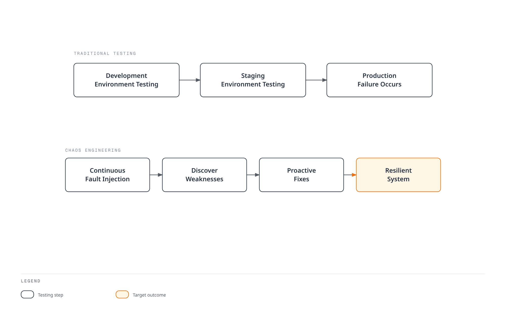
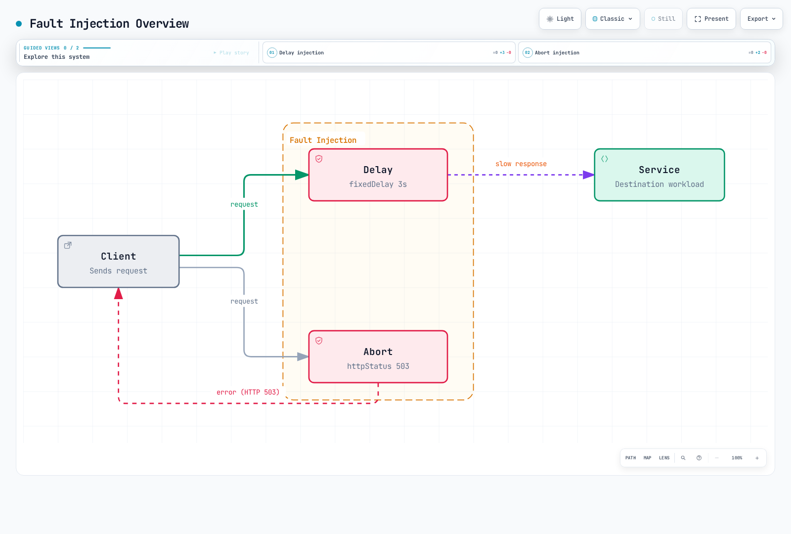
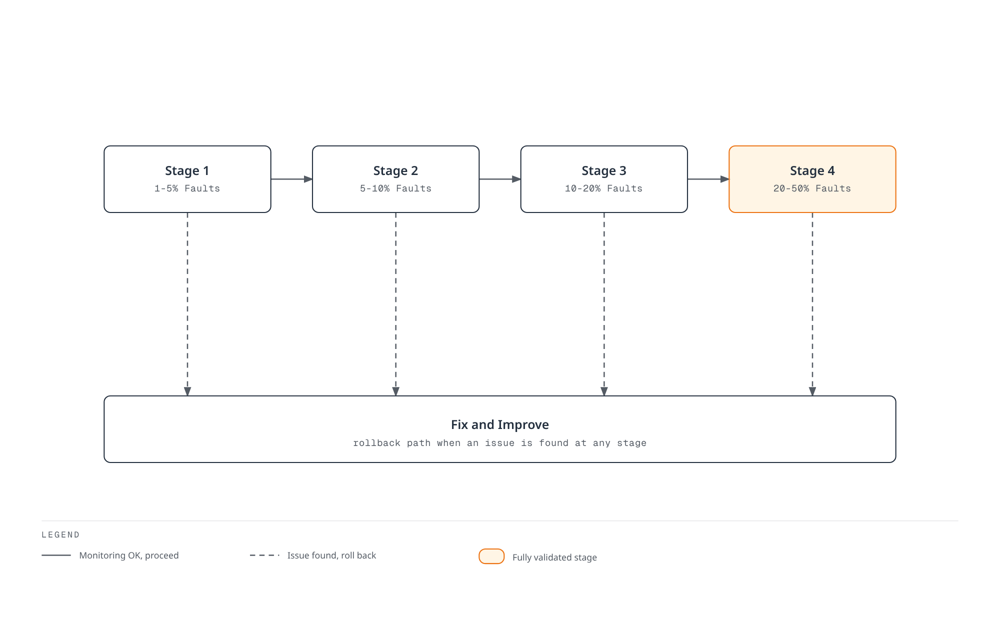

# Fault Injection

Fault Injection is a technique that intentionally injects failures to test system resilience.

## Table of Contents

1. [Why Fault Injection?](#why-fault-injection)
2. [When to Use Fault Injection](#when-to-use-fault-injection)
3. [Fault Injection Overview](#fault-injection-overview)
4. [Delay Injection](#delay-injection)
5. [Abort Injection](#abort-injection)
6. [Practical Examples](#practical-examples)
7. [Real-World Scenarios](#real-world-scenarios)
8. [Testing Strategies](#testing-strategies)
9. [Best Practices](#best-practices)

These are alternative HTTP-layer experiments. Start in an isolated namespace, preserve the full no-fault routing configuration, and define an independent cleanup path before scheduling a test. A percentage applies to matching requests, not a percentage of Pods. Tester headers are not authentication and must be propagated to the targeted downstream call. Native SQL/TCP, packet loss, Pod readiness and node failures require different tests.

## Why Fault Injection?

### Testing Resilience in Production Environments

In microservice architecture, numerous services depend on each other, and **a single service failure can affect the entire system**. Fault Injection is essential for the following reasons:

#### 1. **Core Principle of Chaos Engineering**

Chaos Engineering, popularized by practices such as Netflix's Chaos Monkey, aims to **experience failures proactively in production environments** and discover system weaknesses.



[🔍 View interactive diagram](https://www.atomai.click/kubernetes-docs/archmaps/en-service-mesh-istio-traffic-management-08-fault-injection-0.html)

#### 2. **Reproducing Real Production Scenarios**

In production environments, the following problems can occur:

| Scenario | Cause | Fault Injection Test |
|----------|-------|---------------------|
| **Network Latency** | Inter-region network latency | Delay Injection |
| **Service Timeout** | Slow database queries | Delay Injection |
| **Temporary Failure** | Service restart, scale down | Abort Injection |
| **Partial Failure** | Only some pods fail | Percentage-based Injection |
| **Cascading Failure** | One service failure propagates to others | Combined Fault Injection |

#### 3. **Verifying Circuit Breaker and Timeout Settings**

Fault injection tests how callers handle delays/errors. For proxy retries/timeouts or endpoint ejection, the failure must be produced at a layer that those mechanisms observe.

Verify the caller’s behavior independently from proxy ejection: a locally injected abort is not an upstream endpoint failure. The order service’s actual responses determine what its callers observe.

#### 4. **Validating Safe Deployments**

When deploying new versions, you can verify **whether they're safe even when dependent services fail**:

- Does the new version handle timeouts correctly?
- Does it perform graceful degradation when dependent services fail?
- Does the error handling logic work properly?

## When to Use Fault Injection

Fault Injection should be used in the following situations:

### 1. **Development and Test Environments**

#### Scenario: Developing a New Microservice

```yaml
# Inject faults into service under development
apiVersion: networking.istio.io/v1
kind: VirtualService
metadata:
  name: payment-service-dev
  namespace: dev
spec:
  hosts:
  - payment-service
  http:
  - match:
    - headers:
        x-testing:
          exact: "true"  # Apply only to test traffic
    fault:
      delay:
        percentage:
          value: 50.0
        fixedDelay: 3s
      abort:
        percentage:
          value: 20.0
        httpStatus: 503
    route:
    - destination:
        host: payment-service
        subset: v2
  - route:
    - destination:
        host: payment-service
```

**Use Case**:
- Test how the order service reacts when the payment service slows down or fails
- Verify appropriate error messages are shown to users

### 2. **Integration Testing in Staging Environment**

#### Scenario: Final Verification Before Production Deployment

```yaml
# Inject random faults into all dependent services
apiVersion: networking.istio.io/v1
kind: VirtualService
metadata:
  name: database-service-staging
spec:
  hosts:
  - database-service
  http:
  - fault:
      delay:
        percentage:
          value: 10.0  # 10% of requests delayed
        fixedDelay: 5s
      abort:
        percentage:
          value: 5.0   # 5% of requests fail
        httpStatus: 500
    route:
    - destination:
        host: database-service
```

**Use Case**:
- Verify entire system resilience before production deployment
- Confirm monitoring alerts work properly

### 3. **Chaos Testing in Production Environment**

#### Scenario: Regular Production Resilience Testing

```yaml
# Inject faults at very low rate in production
apiVersion: networking.istio.io/v1
kind: VirtualService
metadata:
  name: recommendation-service-prod
spec:
  hosts:
  - recommendation-service
  http:
  - match:
    - headers:
        x-canary:
          exact: "true"  # Apply only to canary users
    fault:
      abort:
        percentage:
          value: 1.0  # Only 1% of requests fail
        httpStatus: 503
    route:
    - destination:
        host: recommendation-service
  - route:
    - destination:
        host: recommendation-service
```

**Use Case**:
- Netflix-style Chaos Engineering
- Verify actual failure response capability in production
- **Note**: Start with very low rates (1-5%) and monitor impact

### 4. **Adjusting Timeout and Retry Policies**

Istio does not enable timeout/retry handling on the same client-side route when faults are enabled. Removing the route timeout below is intentional; the caller must enforce the deadline for this test.

#### Scenario: Finding Optimal Timeout Values

```yaml
# Test with various delay times
apiVersion: networking.istio.io/v1
kind: VirtualService
metadata:
  name: search-service-timeout-test
spec:
  hosts:
  - search-service
  http:
  - match:
    - headers:
        x-test-scenario:
          exact: "slow-response"
    fault:
      delay:
        percentage:
          value: 100.0
        fixedDelay: 10s  # 10 second delay
    route:
    - destination:
        host: search-service
  - route:
    - destination:
        host: search-service
```

**Use Case**:
- Test a 5-second application/client deadline while the proxy injects a 10-second delay
- For an Istio route timeout, use a genuinely slow upstream or inject at a different hop
- Find optimal value that doesn't harm user experience

### 5. **Verifying Outlier Detection**

A local fault abort is returned before an upstream request is sent, so it does not exercise that proxy’s per-endpoint consecutive-error detector. Use a controlled HTTP backend that really returns 503, then observe its ejection. For example, after deploying the Istio httpbin sample in the test namespace:

```yaml
apiVersion: networking.istio.io/v1
kind: DestinationRule
metadata:
  name: httpbin-outlier-test
spec:
  host: httpbin
  trafficPolicy:
    outlierDetection:
      consecutive5xxErrors: 5
      interval: 5s
      baseEjectionTime: 30s
      maxEjectionPercent: 100
      minHealthPercent: 0
```

Send requests from a mesh application client to `http://httpbin:8000/status/503`. This deliberately allows all test endpoints to be ejected; recovery depends on ejection history and subsequent health, not a guaranteed fixed 30 seconds. Keep this configuration out of unrelated workloads.

### 6. **Testing for Specific User Groups**

#### Scenario: Inject Faults Only for Beta Testers

```yaml
# Inject faults only for specific users
apiVersion: networking.istio.io/v1
kind: VirtualService
metadata:
  name: api-service-beta
spec:
  hosts:
  - api-service
  http:
  - match:
    - headers:
        end-user:
          exact: "beta-tester"  # Beta testers only
    fault:
      delay:
        percentage:
          value: 20.0
        fixedDelay: 2s
    route:
    - destination:
        host: api-service
  - route:  # Normal routing for regular users
    - destination:
        host: api-service
```

**Use Case**:
- Test safely without affecting actual users
- Improve based on beta tester feedback

## Fault Injection Overview



[🔍 View interactive diagram](https://www.atomai.click/kubernetes-docs/archmaps/en-service-mesh-istio-traffic-management-08-fault-injection-2.html)

## Delay Injection

```yaml
apiVersion: networking.istio.io/v1
kind: VirtualService
metadata:
  name: reviews-delay
spec:
  hosts:
  - reviews
  http:
  - fault:
      delay:
        percentage:
          value: 10.0  # Inject delay in 10% of requests
        fixedDelay: 5s  # 5 second delay
    route:
    - destination:
        host: reviews
```

## Abort Injection

```yaml
apiVersion: networking.istio.io/v1
kind: VirtualService
metadata:
  name: reviews-abort
spec:
  hosts:
  - reviews
  http:
  - fault:
      abort:
        percentage:
          value: 10.0  # Abort 10% of requests
        httpStatus: 503  # Return HTTP 503 error
    route:
    - destination:
        host: reviews
```

## Practical Examples

### 1. Combining Delay and Abort

In real production environments, delays and failures can occur simultaneously:

```yaml
apiVersion: networking.istio.io/v1
kind: VirtualService
metadata:
  name: ratings-combined-fault
spec:
  hosts:
  - ratings
  http:
  - fault:
      delay:
        percentage:
          value: 20.0  # 20% of requests delayed
        fixedDelay: 3s
      abort:
        percentage:
          value: 10.0  # 10% of requests fail
        httpStatus: 503
    route:
    - destination:
        host: ratings
```

**Result**:
- 20% of requests get 3 second delay
- Abort can overlap with delay, so some aborted requests are delayed first
- Do not add the two percentages as disjoint populations; measure their overlap

### 2. Conditional Fault Injection

Inject faults only under specific conditions:

```yaml
apiVersion: networking.istio.io/v1
kind: VirtualService
metadata:
  name: reviews-conditional-fault
spec:
  hosts:
  - reviews
  http:
  # Inject faults only for mobile users
  - match:
    - headers:
        user-agent:
          regex: ".*Mobile.*"
    fault:
      delay:
        percentage:
          value: 30.0
        fixedDelay: 2s
    route:
    - destination:
        host: reviews
        subset: v2
  # Normal routing for regular users
  - route:
    - destination:
        host: reviews
        subset: v1
```

### 3. Progressive Fault Injection

Test by gradually increasing fault rate:

```yaml
# Stage 1: 5% faults
apiVersion: networking.istio.io/v1
kind: VirtualService
metadata:
  name: api-fault
spec:
  hosts:
  - api-service
  http:
  - fault:
      abort:
        percentage:
          value: 5.0
        httpStatus: 500
    route:
    - destination:
        host: api-service
```

```yaml
# Stage 2: 10% faults (apply after monitoring)
apiVersion: networking.istio.io/v1
kind: VirtualService
metadata:
  name: api-fault
spec:
  hosts:
  - api-service
  http:
  - fault:
      abort:
        percentage:
          value: 10.0
        httpStatus: 500
    route:
    - destination:
        host: api-service
```

```yaml
# Stage 3: 20% faults (apply after sufficient validation)
apiVersion: networking.istio.io/v1
kind: VirtualService
metadata:
  name: api-fault
spec:
  hosts:
  - api-service
  http:
  - fault:
      abort:
        percentage:
          value: 20.0
        httpStatus: 500
    route:
    - destination:
        host: api-service
```

### 4. Testing by HTTP Status Code

Test with various HTTP error codes:

```yaml
apiVersion: networking.istio.io/v1
kind: VirtualService
metadata:
  name: payment-error-scenarios
spec:
  hosts:
  - payment-service
  http:
  # Scenario 1: Service overload (503)
  - match:
    - headers:
        x-test-scenario:
          exact: "overload"
    fault:
      abort:
        percentage:
          value: 50.0
        httpStatus: 503
    route:
    - destination:
        host: payment-service
  # Scenario 2: Internal server error (500)
  - match:
    - headers:
        x-test-scenario:
          exact: "server-error"
    fault:
      abort:
        percentage:
          value: 30.0
        httpStatus: 500
    route:
    - destination:
        host: payment-service
  # Scenario 3: Gateway timeout (504)
  - match:
    - headers:
        x-test-scenario:
          exact: "timeout"
    fault:
      abort:
        percentage:
          value: 20.0
        httpStatus: 504
    route:
    - destination:
        host: payment-service
  # Default routing
  - route:
    - destination:
        host: payment-service
```

## Real-World Scenarios

### Scenario 1: Simulating a Slow HTTP Database Facade

**Situation**: Database queries intermittently become slow

```yaml
apiVersion: networking.istio.io/v1
kind: VirtualService
metadata:
  name: database-slow-query
  namespace: chaos-tests
spec:
  hosts:
  - database-service
  http:
  - fault:
      delay:
        percentage:
          value: 15.0  # 15% of HTTP requests are delayed
        fixedDelay: 8s   # 8 second delay
    route:
    - destination:
        host: database-service
```

**Test Objectives**:
1. Are application timeout settings appropriate?
2. Does connection pool get exhausted?
3. Are appropriate error messages displayed to users?

**Expected Results**:
- Appropriate timeout enables fast failure (fail-fast)
- Connection pool management normal
- Entire system response delay -> Circuit Breaker needed

### Scenario 2: Testing Microservice Cascade Failure

**Situation**: Verify if one service failure propagates to other services

Verify the caller’s behavior independently from proxy ejection: a locally injected abort is not an upstream endpoint failure. The order service’s actual responses determine what its callers observe.

```yaml
# Inject faults into payment service
apiVersion: networking.istio.io/v1
kind: VirtualService
metadata:
  name: payment-cascade-test
spec:
  hosts:
  - payment-service
  http:
  - fault:
      abort:
        percentage:
          value: 30.0  # 30% failure
        httpStatus: 503
    route:
    - destination:
        host: payment-service
---
# Configure Circuit Breaker for order service
apiVersion: networking.istio.io/v1
kind: DestinationRule
metadata:
  name: order-circuit-breaker
spec:
  host: order-service
  trafficPolicy:
    outlierDetection:
      consecutive5xxErrors: 5
      interval: 30s
      baseEjectionTime: 30s
```

**Test Objectives**:
1. Does order service handle payment failure gracefully?
2. Does the order service preserve its caller-facing behavior? Ejection depends on actual errors returned by order-service.
3. Are appropriate user messages displayed on frontend?

### Scenario 3: Testing API Rate Limit Situation

**Situation**: Simulate external API reaching rate limit

```yaml
apiVersion: networking.istio.io/v1
kind: VirtualService
metadata:
  name: external-api-rate-limit
spec:
  hosts:
  - external-api-service
  http:
  - match:
    - headers:
        x-api-key:
          exact: "test-key"
    fault:
      abort:
        percentage:
          value: 40.0  # 40% of requests rate limited
        httpStatus: 429  # Too Many Requests
    route:
    - destination:
        host: external-api-service
  - route:
    - destination:
        host: external-api-service
```

**Test Objectives**:
1. Are 429 errors handled appropriately?
2. Does retry logic use Exponential Backoff?
3. Is caching utilized to reduce API calls?

### Scenario 4: Simulating Inter-Region Network Latency

**Situation**: Latency when calling services in different regions

```yaml
apiVersion: networking.istio.io/v1
kind: VirtualService
metadata:
  name: cross-region-latency
spec:
  hosts:
  - us-east-service
  http:
  - match:
    - sourceLabels:
        region: "eu-west"  # Calling from EU to US
    fault:
      delay:
        percentage:
          value: 100.0
        fixedDelay: 150ms  # 150ms delay (transatlantic)
    route:
    - destination:
        host: us-east-service
  - route:
    - destination:
        host: us-east-service
```

**Test Objectives**:
1. Confirm inter-region latency impact in global services
2. Determine if optimization through caching or CDN is possible
3. Is SLA target met (e.g., 95% of requests within 500ms)?

### Scenario 5: Simulating Temporary Failure During Deployment

**Situation**: Some pods temporarily unavailable during Rolling Update

```yaml
apiVersion: networking.istio.io/v1
kind: VirtualService
metadata:
  name: deployment-transient-failure
spec:
  hosts:
  - app-service
  http:
  - match:
    - headers:
        x-deployment-test:
          exact: "true"
    fault:
      abort:
        percentage:
          value: 25.0  # 25% of matching requests fail; Pods remain running
        httpStatus: 503
      delay:
        percentage:
          value: 10.0
        fixedDelay: 5s   # Some start slowly
    route:
    - destination:
        host: app-service
        subset: v2
  - route:
    - destination:
        host: app-service
```

**Test Objectives**:
1. Measure caller behavior under injected request errors
2. Test readiness separately using a controlled workload state change
3. Verify healthy-endpoint routing separately; HTTP abort does not mark a Pod unready

## Testing Strategies

### 1. Progressive Chaos Engineering

Gradually increase fault rate to find system limits:



[🔍 View interactive diagram](https://www.atomai.click/kubernetes-docs/archmaps/en-service-mesh-istio-traffic-management-08-fault-injection-4.html)

**Step-by-step execution**:

```bash
# Stage 1: 1% fault injection
kubectl apply -f fault-injection-1percent.yaml
# Monitor for 15 minutes
kubectl logs -f deployment/monitoring

# If no issues, proceed to stage 2
kubectl apply -f fault-injection-5percent.yaml
# Monitor for 15 minutes

# Continue...
```

### 2. Time-Based Testing

This is a scheduling template, suspended until its prerequisites are prepared: a test namespace, a built/pinned organization-owned runner image containing shell and a compatible kubectl, an existing `chaos-tester` ServiceAccount with only the needed access to the pre-created test VirtualService, and a `chaos-fixtures` ConfigMap containing full fault/no-fault manifests for that same resource. The example registry image is a placeholder. Traps cannot run after SIGKILL/node loss; provide an independent cleanup check.

Inject faults only during specific time periods:

```yaml
apiVersion: batch/v1
kind: CronJob
metadata:
  name: fault-injection-scheduler
  namespace: chaos-tests
spec:
  schedule: "0 2 * * *"
  timeZone: "Etc/UTC"
  suspend: true
  concurrencyPolicy: Forbid
  startingDeadlineSeconds: 300
  jobTemplate:
    spec:
      activeDeadlineSeconds: 420
      backoffLimit: 0
      template:
        metadata:
          labels:
            sidecar.istio.io/inject: "false"
        spec:
          serviceAccountName: chaos-tester
          restartPolicy: Never
          containers:
          - name: apply-fault
            image: registry.example.com/ops/chaos-runner:1.0.0
            command: ["/bin/sh", "-ec"]
            args:
            - |
              cleanup() { kubectl apply -n chaos-tests -f /config/no-fault.yaml; }
              trap cleanup EXIT
              trap 'exit 130' INT
              trap 'exit 143' TERM
              kubectl apply -n chaos-tests -f /config/fault-injection.yaml
              sleep 300
            volumeMounts:
            - name: fixtures
              mountPath: /config
              readOnly: true
          volumes:
          - name: fixtures
            configMap:
              name: chaos-fixtures
```

### 3. Automated Testing Pipeline

Integrate into CI/CD pipeline:

```yaml
stages: [fault-injection-test]

fault_injection_test:
  stage: fault-injection-test
  script:
    - kubectl apply -n chaos-tests -f tests/fault-injection.yaml
    - k6 run --vus 100 --duration 5m tests/load-test.js
    - ./tests/check-fault-metrics.sh
  after_script:
    - kubectl apply -n chaos-tests -f tests/no-fault.yaml
```

Save the following as `tests/check-fault-metrics.sh` in the test project. The runner needs kubectl, k6, curl, and jq plus the reviewed manifests/load test. Choose the measured service and threshold from the test hypothesis: errors intentionally injected into a dependency are not automatically failures of the user-facing SLO. An absent/NaN response fails the check. GitLab after_script is not guaranteed after runner loss and has its own timeout; verify baseline restoration independently.

```bash
#!/usr/bin/env bash
set -euo pipefail
: "${PROMETHEUS_URL:?Set the Prometheus base URL}"
: "${TEST_DESTINATION:?Set the exact destination_service label}"
: "${ERROR_THRESHOLD:?Set the error-fraction limit for the hypothesis}"
QUERY="sum(rate(istio_requests_total{reporter=\"source\",destination_service=\"${TEST_DESTINATION}\",response_code=~\"5..\"}[5m])) / sum(rate(istio_requests_total{reporter=\"source\",destination_service=\"${TEST_DESTINATION}\"}[5m]))"
curl -fsSG "$PROMETHEUS_URL/api/v1/query" --data-urlencode "query=$QUERY" |
  jq -e --argjson limit "$ERROR_THRESHOLD" '
    .status == "success" and
    (.data.result | length) == 1 and
    (.data.result[0].value[1] as $v |
      $v != "NaN" and $v != "+Inf" and $v != "-Inf" and
      (($v | tonumber) <= $limit))'
```

### 4. Monitoring and Alerting

Mount/load this rule file in Prometheus or use the installed operator’s PrometheusRule resource. A ConfigMap by itself does not activate alerts. Scope rules to the test services and enable the referenced Envoy stats.

Monitor key metrics during fault injection:

```yaml
# Prometheus alert rules
apiVersion: v1
kind: ConfigMap
metadata:
  name: prometheus-alerts
data:
  fault-injection-alerts.yaml: |
    groups:
    - name: fault-injection
      rules:
      # Error rate increase
      - alert: HighErrorRate
        expr: sum by (destination_service) (rate(istio_requests_total{reporter="source",response_code=~"5.."}[5m])) / sum by (destination_service) (rate(istio_requests_total{reporter="source"}[5m])) > 0.1
        for: 2m
        annotations:
          summary: "High error rate during fault injection"

      # Circuit Breaker activation
      - alert: CircuitBreakerOpen
        expr: envoy_cluster_circuit_breakers_default_rq_open > 0
        for: 1m
        annotations:
          summary: "Circuit breaker opened"

      # Response time increase
      - alert: HighLatency
        expr: histogram_quantile(0.95, sum by (destination_service, le) (rate(istio_request_duration_milliseconds_bucket{reporter="source"}[5m]))) > 3000
        for: 5m
        annotations:
          summary: "95th percentile latency > 3s"
```

### 5. Blue-Green Fault Injection

Inject faults into Blue environment and compare with Green environment:

```yaml
apiVersion: networking.istio.io/v1
kind: VirtualService
metadata:
  name: app-blue-green-test
spec:
  hosts:
  - app-service
  http:
  - match:
    - headers:
        x-version:
          exact: "blue"
    fault:
      delay:
        percentage:
          value: 20.0
        fixedDelay: 3s
    route:
    - destination:
        host: app-service
        subset: blue
  - route:
    - destination:
        host: app-service
        subset: green
```

**Comparison metrics**:
- Error rate
- Response time (P50, P95, P99)
- User experience indicators

## Best Practices

### 1. Start Small

- **Start with 1-5%** low rates initially
- Test thoroughly in development/staging environments
- Execute in production during times with low business impact

### 2. Monitoring is Essential

Prepare monitoring dashboard before applying Fault Injection:

```yaml
# Grafana dashboard metrics
- istio_requests_total (Error rate)
- istio_request_duration_milliseconds (Latency)
- envoy_cluster_upstream_rq_retry (Retry count)
- envoy_cluster_circuit_breakers_* (Circuit Breaker status)
```

### 3. Use Clear Labels

```yaml
# Metadata excerpt for the existing reviewed fault VirtualService
metadata:
  name: payment-fault
  labels:
    fault-injection: "true"
    test-type: "chaos-engineering"
    test-date: "2025-01-15"
  annotations:
    description: "Testing payment service resilience"
    owner: "platform-team"
```

### 4. Automatic Rollback Mechanism

```bash
#!/usr/bin/env bash
set -euo pipefail
cleanup() { kubectl apply -n chaos-tests -f tests/no-fault.yaml; }
trap cleanup EXIT
trap 'exit 130' INT
trap 'exit 143' TERM
kubectl apply -n chaos-tests -f tests/fault-injection.yaml
sleep 300
./tests/check-fault-metrics.sh
# EXIT restores the full baseline on success or normal failure.
```

### 5. Documentation

Document all Fault Injection tests:

```yaml
# Metadata excerpt for the existing reviewed fault VirtualService
metadata:
  name: api-fault-test
  annotations:
    # Test purpose
    test-purpose: "Verify caller error handling; test upstream ejection separately"

    # Expected behavior
    expected-behavior: |
      - Caller handles the injected error according to the test hypothesis
      - Requests fail fast with 503 error
      - Restore baseline and verify recovery

    # Success criteria
    success-criteria: |
      - Error rate < 5%
      - P95 latency < 500ms
      - No cascading failures

    # Rollback plan
    rollback-plan: "Restore the reviewed complete no-fault VirtualService"
```

### 6. Production Environment Precautions

- **Business Impact Assessment**: Analyze the impact of fault injection on actual users
- **Gradual Expansion**: Slowly increase from 1% -> 5% -> 10%
- **Alert Setup**: Immediate alerts when thresholds are exceeded
- **Rollback Preparation**: Be ready to rollback immediately at any time
- **Avoid Business Hours**: Choose times with low traffic

### 7. Regular Testing

```bash
# Change the prepared scheduler to weekly; suspension/prerequisites still apply
kubectl patch cronjob fault-injection-scheduler -n chaos-tests --type=merge \
  -p '{"spec":{"schedule":"0 3 * * 0","timeZone":"Etc/UTC"}}'
```

## References

- [Istio Fault Injection](https://istio.io/latest/docs/tasks/traffic-management/fault-injection/)
- [Principles of Chaos Engineering](https://principlesofchaos.org/)
- [Netflix Chaos Engineering](https://netflix.github.io/chaosmonkey/)
- [Google SRE - Testing for Reliability](https://sre.google/sre-book/testing-reliability/)

- [Primary reference 1](https://istio.io/latest/docs/reference/config/networking/virtual-service/)
- [Primary reference 2](https://istio.io/latest/docs/tasks/traffic-management/fault-injection/)
- [Primary reference 3](https://www.envoyproxy.io/docs/envoy/latest/configuration/http/http_filters/fault_filter)
- [Primary reference 4](https://www.envoyproxy.io/docs/envoy/latest/intro/arch_overview/upstream/outlier)
- [Primary reference 5](https://kubernetes.io/docs/concepts/workloads/controllers/cron-jobs/)
- [Primary reference 6](https://docs.gitlab.com/ci/yaml/)
- [Primary reference 7](https://raw.githubusercontent.com/prometheus/prometheus/v3.14.0/docs/configuration/configuration.md)
