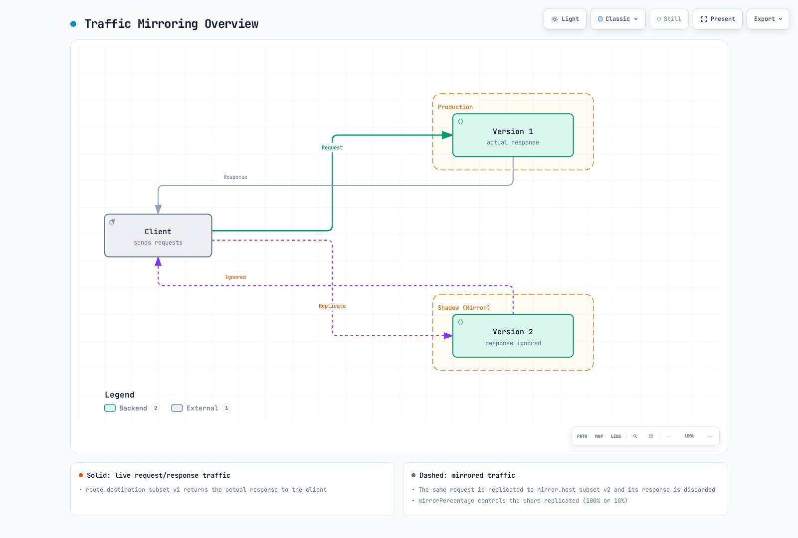

# Traffic Mirroring

Traffic Mirroring (or Shadow Traffic) is a technique that replicates production traffic in real-time to test new versions.

## Table of Contents

1. [Traffic Mirroring Overview](#traffic-mirroring-overview)
2. [Basic Configuration](#basic-configuration)
3. [Partial Mirroring](#partial-mirroring)
4. [Best Practices](#best-practices)

## Traffic Mirroring Overview



[🔍 View interactive diagram](https://www.atomai.click/kubernetes-docs/archmaps/en-service-mesh-istio-traffic-management-09-traffic-mirror-0.html)

## Basic Configuration

These sidecar examples require a `reviews` Service and DestinationRule subsets `v1`/`v2` matching pod labels. Apply one alternative VirtualService for this host at a time. The mirror does not receive a share of the primary route weight: it receives an additional copy.

```yaml
apiVersion: networking.istio.io/v1
kind: VirtualService
metadata:
  name: reviews-mirror
spec:
  hosts:
  - reviews
  http:
  - route:
    - destination:
        host: reviews
        subset: v1
      weight: 100
    mirror:
      host: reviews
      subset: v2
    mirrorPercentage:
      value: 100  # 100% mirroring
```

## Partial Mirroring

```yaml
apiVersion: networking.istio.io/v1
kind: VirtualService
metadata:
  name: reviews-partial-mirror
spec:
  hosts:
  - reviews
  http:
  - route:
    - destination:
        host: reviews
        subset: v1
    mirror:
      host: reviews
      subset: v2
    mirrorPercentage:
      value: 10  # Mirror only 10%
```

## Best Practices

- Mirrored responses are discarded; this is not failover or automatic response comparison.
- Writes still execute at the shadow destination. Isolate its databases, queues, and external side effects before mirroring production requests.
- Start with a small percentage and monitor both primary latency and shadow capacity. Mirroring adds traffic and processing cost.
- By default, the mirrored Host/Authority gets a `-shadow` suffix; configure the shadow service to accept it. Evaluate the selected release’s routing API for ambient waypoints.

## References

- [Istio Traffic Mirroring](https://istio.io/latest/docs/tasks/traffic-management/mirroring/)
