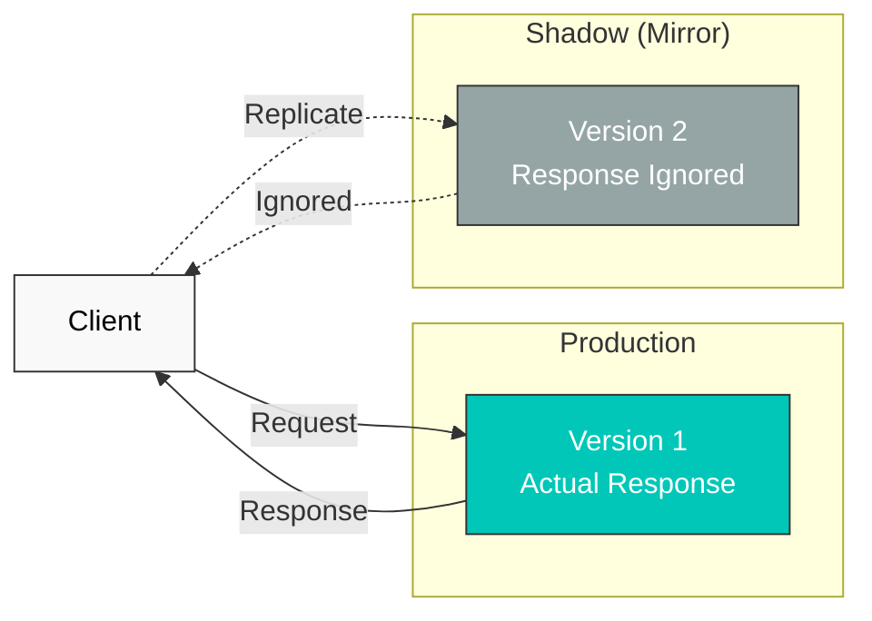

# Traffic Mirroring

Traffic Mirroring (or Shadow Traffic) is a technique that replicates production traffic in real-time to test new versions.

## Table of Contents

1. [Traffic Mirroring Overview](#traffic-mirroring-overview)
2. [Basic Configuration](#basic-configuration)
3. [Partial Mirroring](#partial-mirroring)
4. [Practical Examples](#practical-examples)
5. [Best Practices](#best-practices)

## Traffic Mirroring Overview



## Basic Configuration

```yaml
apiVersion: networking.istio.io/v1
kind: VirtualService
metadata:
  name: reviews-mirror
spec:
  hosts:
  - reviews
  http:
  - route:
    - destination:
        host: reviews
        subset: v1
      weight: 100
    mirror:
      host: reviews
      subset: v2
    mirrorPercentage:
      value: 100  # 100% mirroring
```

## Partial Mirroring

```yaml
apiVersion: networking.istio.io/v1
kind: VirtualService
metadata:
  name: reviews-partial-mirror
spec:
  hosts:
  - reviews
  http:
  - route:
    - destination:
        host: reviews
        subset: v1
    mirror:
      host: reviews
      subset: v2
    mirrorPercentage:
      value: 10  # Mirror only 10%
```

## References

- [Istio Traffic Mirroring](https://istio.io/latest/docs/tasks/traffic-management/mirroring/)
