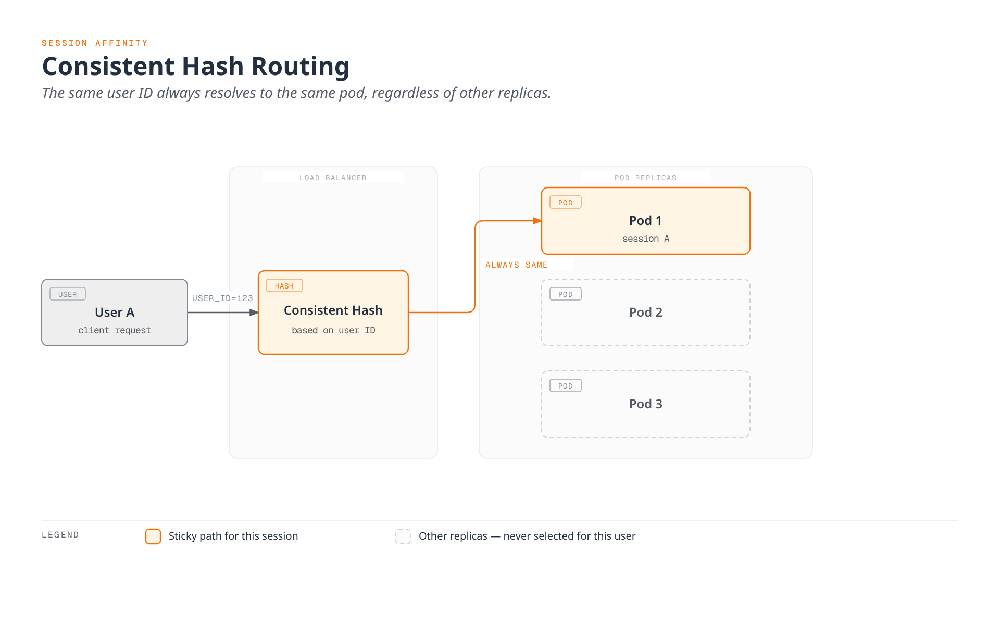

# Session Affinity

Session Affinity (or Sticky Session) is a technique that provides soft affinity for requests sharing the same hash key; it does not guarantee a permanent pod assignment.

## Table of Contents

1. [Session Affinity Overview](#session-affinity-overview)
2. [Consistent Hash Based](#consistent-hash-based)
3. [Cookie Based](#cookie-based)
4. [HTTP Header Based](#http-header-based)
5. [Source IP Based](#source-ip-based)
6. [Operational Considerations](#operational-considerations)

## Session Affinity Overview



[🔍 View interactive diagram](https://www.atomai.click/kubernetes-docs/archmaps/en-service-mesh-istio-traffic-management-10-session-affinity-0.html)

## Consistent Hash Based

### HTTP Header Based

```yaml
apiVersion: networking.istio.io/v1
kind: DestinationRule
metadata:
  name: reviews-session-affinity
spec:
  host: reviews
  trafficPolicy:
    loadBalancer:
      consistentHash:
        httpHeaderName: "x-user-id"
```

### Cookie Based

```yaml
apiVersion: networking.istio.io/v1
kind: DestinationRule
metadata:
  name: reviews-cookie-affinity
spec:
  host: reviews
  trafficPolicy:
    loadBalancer:
      consistentHash:
        httpCookie:
          name: "session-id"
          ttl: 0s  # Cookie expiration time (0s = session cookie)
```

### Source IP Based

```yaml
apiVersion: networking.istio.io/v1
kind: DestinationRule
metadata:
  name: reviews-ip-affinity
spec:
  host: reviews
  trafficPolicy:
    loadBalancer:
      consistentHash:
        useSourceIp: true
```

## Operational Considerations

The diagram assumes an unchanged endpoint set and identical endpoint views at each proxy. Adding/removing pods or locality-based endpoint differences can remap requests. Store session state so that a remap or pod failure remains safe.

Choose one of these DestinationRules for the same host. HTTP header/cookie hashing requires HTTP processing; a missing header cannot identify a user. `ttl: 0s` creates a session cookie when it is absent, but the browser must return it. Cookie attributes and lifetime should match the application’s requirements.

Source-IP hashing uses the source address visible to the proxy. NAT and intervening load balancers can collapse multiple clients onto one address; check trusted proxy/client-IP handling before relying on it. These DestinationRule examples describe sidecar behavior; verify waypoint feature support separately.

## References

- [Istio Session Affinity](https://istio.io/latest/docs/reference/config/networking/destination-rule/#LoadBalancerSettings-ConsistentHashLB)
