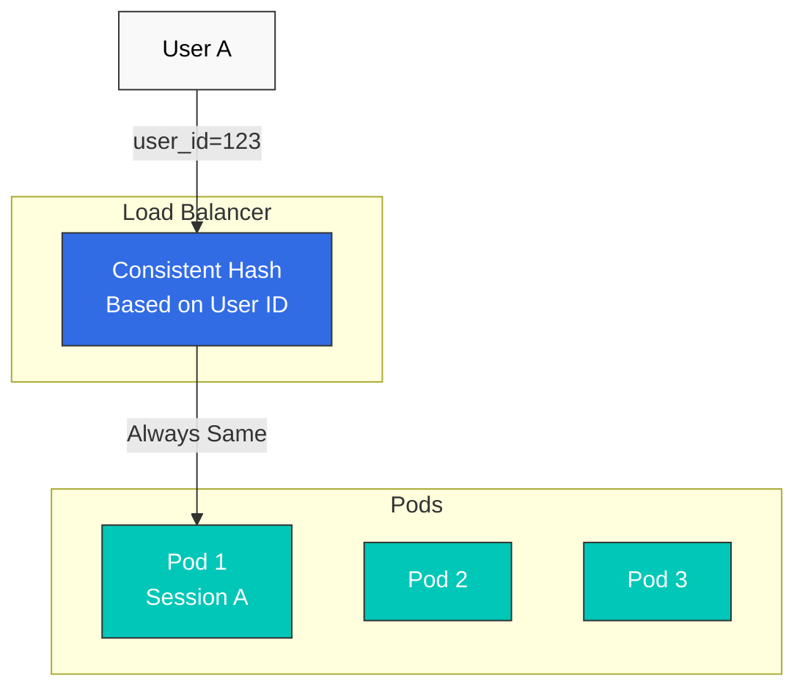

# Session Affinity

Session Affinity (or Sticky Session) is a technique that routes requests from the same user to the same pod.

## Table of Contents

1. [Session Affinity Overview](#session-affinity-overview)
2. [Consistent Hash Based](#consistent-hash-based)
3. [Cookie Based](#cookie-based)
4. [Header Based](#header-based)
5. [Practical Examples](#practical-examples)

## Session Affinity Overview



## Consistent Hash Based

### HTTP Header Based

```yaml
apiVersion: networking.istio.io/v1
kind: DestinationRule
metadata:
  name: reviews-session-affinity
spec:
  host: reviews
  trafficPolicy:
    loadBalancer:
      consistentHash:
        httpHeaderName: "x-user-id"
```

### Cookie Based

```yaml
apiVersion: networking.istio.io/v1
kind: DestinationRule
metadata:
  name: reviews-cookie-affinity
spec:
  host: reviews
  trafficPolicy:
    loadBalancer:
      consistentHash:
        httpCookie:
          name: "session-id"
          ttl: 0s  # Cookie expiration time (0s = session cookie)
```

### Source IP Based

```yaml
apiVersion: networking.istio.io/v1
kind: DestinationRule
metadata:
  name: reviews-ip-affinity
spec:
  host: reviews
  trafficPolicy:
    loadBalancer:
      consistentHash:
        useSourceIp: true
```

## References

- [Istio Session Affinity](https://istio.io/latest/docs/reference/config/networking/destination-rule/#LoadBalancerSettings-ConsistentHashLB)
