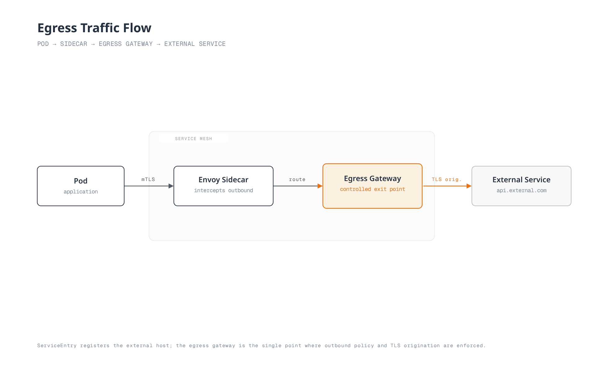

# Egress Control

Egress control is a feature that manages outbound traffic from the mesh and enhances security.

## Table of Contents

1. [Egress Overview](#egress-overview)
2. [ServiceEntry Configuration](#serviceentry-configuration)
3. [Egress Gateway](#egress-gateway)
4. [TLS Origination](#tls-origination)
5. [Practical Examples](#practical-examples)

## Egress Overview



## ServiceEntry Configuration

### Registering External Services

```yaml
apiVersion: networking.istio.io/v1
kind: ServiceEntry
metadata:
  name: external-api
spec:
  hosts:
  - api.external.com
  ports:
  - number: 443
    name: https
    protocol: HTTPS
  location: MESH_EXTERNAL
  resolution: DNS
```

### HTTP External Service

```yaml
apiVersion: networking.istio.io/v1
kind: ServiceEntry
metadata:
  name: httpbin
spec:
  hosts:
  - httpbin.org
  ports:
  - number: 80
    name: http
    protocol: HTTP
  location: MESH_EXTERNAL
  resolution: DNS
```

## Egress Gateway

### Installing Egress Gateway

```bash
helm install istio-egressgateway istio/gateway \
  -n istio-system \
  --set labels.app=istio-egressgateway \
  --set labels.istio=egressgateway
```

### Configuring Egress Gateway

```yaml
apiVersion: networking.istio.io/v1
kind: Gateway
metadata:
  name: istio-egressgateway
spec:
  selector:
    istio: egressgateway
  servers:
  - port:
      number: 443
      name: https
      protocol: HTTPS
    hosts:
    - api.external.com
    tls:
      mode: PASSTHROUGH
---
apiVersion: networking.istio.io/v1
kind: VirtualService
metadata:
  name: direct-external-through-egress-gateway
spec:
  hosts:
  - api.external.com
  gateways:
  - mesh
  - istio-egressgateway
  http:
  - match:
    - gateways:
      - mesh
      port: 80
    route:
    - destination:
        host: istio-egressgateway.istio-system.svc.cluster.local
        port:
          number: 443
  - match:
    - gateways:
      - istio-egressgateway
      port: 443
    route:
    - destination:
        host: api.external.com
        port:
          number: 443
```

## References

- [Istio Egress Traffic](https://istio.io/latest/docs/tasks/traffic-management/egress/)
- [Egress Gateway](https://istio.io/latest/docs/tasks/traffic-management/egress/egress-gateway/)
