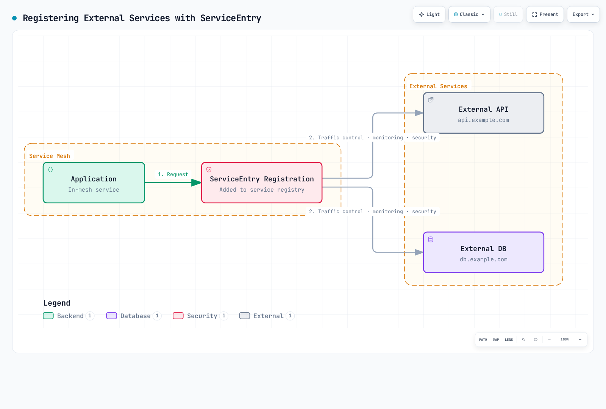

# ServiceEntry

ServiceEntry registers external services in the Istio service mesh, allowing them to be managed like internal services.

## Table of Contents

1. [Why ServiceEntry?](#why-serviceentry)
2. [ServiceEntry Overview](#serviceentry-overview)
3. [Resolution Modes](#resolution-modes)
4. [Location Settings](#location-settings)
5. [Practical Examples](#practical-examples)
6. [Combining with Egress Gateway](#combining-with-egress-gateway)
7. [Security and TLS](#security-and-tls)
8. [Monitoring and Control](#monitoring-and-control)
9. [Best Practices](#best-practices)

## Why ServiceEntry?

### The Need for External Service Management

With ALLOW_ANY, unknown external destinations can pass through with reduced policy/telemetry. A ServiceEntry registers a destination so compatible proxy policies can be configured; it is not an access-control rule.

Registration enables destination-specific configuration; actual monitoring, TLS, and traffic control still depend on the protocol and applied policies.

### Key Benefits

| Feature | Without ServiceEntry | With ServiceEntry |
|---------|---------------------|-------------------|
| **Monitoring** | Limited passthrough telemetry | Protocol-dependent telemetry; HTTP requires L7 visibility |
| **Traffic Control** | Impossible | Timeout, Retry, Circuit Breaker |
| **Security** | Application TLS can still apply | Configure TLS/mTLS separately; no automatic external certificate issuance |
| **Egress Control** | Depends on outbound/network policy | Registry and routing configuration; network enforcement is separate |
| **Service Discovery** | Manual management | Automatic DNS lookup |

## ServiceEntry Overview

These examples are alternative sidecar configurations. ServiceEntry is consumed by istiod/proxies, not a network hop. `addresses` classifies service/VIP traffic, while `endpoints` identifies upstream backends. Resolution controls the proxy’s lookup, not application DNS; configure DNS records or DNS capture for synthetic hosts. A ServiceEntry does not enroll a VM proxy or issue its identity credentials.

ServiceEntry adds external services to the Istio service registry.



[🔍 View interactive diagram](https://www.atomai.click/kubernetes-docs/archmaps/en-service-mesh-istio-traffic-management-12-service-entry-1.html)

### Basic Structure

```yaml
apiVersion: networking.istio.io/v1
kind: ServiceEntry
metadata:
  name: external-api
spec:
  hosts:                  # External service hostname
  - api.example.com
  ports:                  # Port and protocol
  - number: 443
    name: https
    protocol: HTTPS
  location: MESH_EXTERNAL # External/internal location
  resolution: DNS         # Address resolution method
```

## Resolution Modes

The Istio 1.31 API defines five resolution modes.

### 1. DNS Resolution

The most common mode, dynamically resolving IP addresses through DNS.

```yaml
apiVersion: networking.istio.io/v1
kind: ServiceEntry
metadata:
  name: external-api-dns
spec:
  hosts:
  - api.example.com
  ports:
  - number: 443
    name: https
    protocol: HTTPS
  location: MESH_EXTERNAL
  resolution: DNS  # DNS lookup
```

**Use Cases**:
- Public APIs (AWS S3, Google Cloud Storage)
- SaaS services (Stripe, SendGrid)
- Cloud managed services

### 2. STATIC Resolution

Explicitly specify fixed IP addresses.

```yaml
apiVersion: networking.istio.io/v1
kind: ServiceEntry
metadata:
  name: external-api-static
spec:
  hosts:
  - legacy-api.company.internal
  addresses:
  - 10.10.10.10
  - 10.10.10.11
  ports:
  - number: 8080
    name: http
    protocol: HTTP
  location: MESH_EXTERNAL
  resolution: STATIC  # Fixed IP
  endpoints:
  - address: 10.10.10.10
  - address: 10.10.10.11
```

**Use Cases**:
- Legacy systems (no DNS)
- Compliance requiring fixed IPs
- Internal datacenter services

### 3. NONE Resolution

Does not perform address resolution, uses the address provided by the client as-is.

```yaml
apiVersion: networking.istio.io/v1
kind: ServiceEntry
metadata:
  name: wildcard-api
spec:
  hosts:
  - "*.api.example.com"  # Wildcard
  ports:
  - number: 443
    name: https
    protocol: HTTPS
  location: MESH_EXTERNAL
  resolution: NONE  # No address resolution
```

**Use Cases**:
- Wildcard domains
- Client-side load balancing
- TCP/TLS proxy

### 4. DNS_ROUND_ROBIN Resolution

This is supported, not deprecated. Unlike DNS mode’s complete endpoint set, it uses the first DNS address when opening a new connection and retains existing connections across DNS record changes. It is useful for DNS-fronted services where frequent endpoint changes should not constantly drain connection pools.

### 5. DYNAMIC_DNS Resolution

This mode resolves a wildcard destination from HTTP Host/SNI at request time. Its eligibility depends on the release, data plane and waypoint setup; it is not applicable to opaque TCP traffic that lacks a recoverable hostname. Check the mode-specific requirements before using it. The concrete wildcard example below uses sidecar NONE mode.

## Location Settings

### MESH_EXTERNAL (External Service)

Register services outside the mesh.

```yaml
apiVersion: networking.istio.io/v1
kind: ServiceEntry
metadata:
  name: external-service
spec:
  hosts:
  - external-api.com
  ports:
  - number: 443
    name: https
    protocol: HTTPS
  location: MESH_EXTERNAL  # External service
  resolution: DNS
```

**Characteristics**:
- External TLS/mTLS is possible with an appropriate DestinationRule and server trust configuration
- Can exit through Egress Gateway
- Classified as external traffic

### MESH_INTERNAL (Internal Service)

Treat as mesh internal service (rarely used).

```yaml
apiVersion: networking.istio.io/v1
kind: ServiceEntry
metadata:
  name: internal-vm-service
spec:
  hosts:
  - vm-service.internal
  ports:
  - number: 8080
    name: http
    protocol: HTTP
  location: MESH_INTERNAL  # Treat as internal service
  resolution: STATIC
  endpoints:
  - address: 10.0.0.5
    labels:
      app: vm-service
```

**Use Cases**:
- Include VM workloads in mesh
- Multi-cluster environments
- Hybrid cloud configurations

## Practical Examples

### 1. Registering External REST API

#### Scenario: Payment Gateway API

```yaml
apiVersion: networking.istio.io/v1
kind: ServiceEntry
metadata:
  name: payment-gateway-api
  namespace: production
spec:
  hosts:
  - api.payment-gateway.com
  ports:
  - number: 80
    name: http
    protocol: HTTP
    targetPort: 443
  location: MESH_EXTERNAL
  resolution: DNS
---
# VirtualService: Timeout and Retry settings
apiVersion: networking.istio.io/v1
kind: VirtualService
metadata:
  name: payment-gateway-routing
  namespace: production
spec:
  hosts:
  - api.payment-gateway.com
  http:
  - match:
    - method:
        regex: "^(GET|HEAD)$"
    route:
    - destination:
        host: api.payment-gateway.com
    timeout: 10s
    retries:
      attempts: 3
      perTryTimeout: 3s
      retryOn: connect-failure,refused-stream
  - route:
    - destination:
        host: api.payment-gateway.com
    timeout: 10s
    retries:
      attempts: 0
---
# DestinationRule: Circuit Breaker
apiVersion: networking.istio.io/v1
kind: DestinationRule
metadata:
  name: payment-gateway-circuit-breaker
  namespace: production
spec:
  host: api.payment-gateway.com
  trafficPolicy:
    connectionPool:
      http:
        http1MaxPendingRequests: 10
        maxRequestsPerConnection: 1
    outlierDetection:
      consecutive5xxErrors: 3
      interval: 30s
      baseEjectionTime: 120s
    tls:
      mode: SIMPLE
      sni: api.payment-gateway.com
      subjectAltNames: [api.payment-gateway.com]
```

The app sends HTTP to the local sidecar in this origination design; the proxy sends verified HTTPS upstream. Do not combine this with application-originated HTTPS. Payment writes require an application idempotency contract before retries are enabled.

### 2. Registering External Database

#### Scenario: AWS RDS MySQL

```yaml
apiVersion: networking.istio.io/v1
kind: ServiceEntry
metadata:
  name: aws-rds-mysql
spec:
  hosts:
  - mydb.abc123.us-west-2.rds.amazonaws.com
  ports:
  - number: 3306
    name: tcp
    protocol: TCP
  location: MESH_EXTERNAL
  resolution: DNS
---
apiVersion: networking.istio.io/v1
kind: DestinationRule
metadata:
  name: aws-rds-mysql-circuit-breaker
spec:
  host: mydb.abc123.us-west-2.rds.amazonaws.com
  trafficPolicy:
    connectionPool:
      tcp:
        maxConnections: 100
        connectTimeout: 5s
    outlierDetection:
      consecutive5xxErrors: 5
      interval: 60s
      baseEjectionTime: 60s
```

### 3. Registering Wildcard Domain

Configure RDS TLS and certificate verification in the database driver using the current RDS CA bundle. TCP registration does not configure database authentication or SSL negotiation. For several external databases on the same port, use DNS capture/unique service VIPs to avoid port-only ambiguity.

#### Scenario: AWS S3 Bucket Access

```yaml
apiVersion: networking.istio.io/v1
kind: ServiceEntry
metadata:
  name: aws-s3-buckets
spec:
  hosts:
  - "*.s3.amazonaws.com"
  - "*.s3.us-west-2.amazonaws.com"
  - "s3.us-west-2.amazonaws.com"
  ports:
  - number: 443
    name: https
    protocol: HTTPS
  location: MESH_EXTERNAL
  resolution: NONE  # Use NONE for wildcards
```

Only a leading wildcard prefix is valid; enumerate real regional endpoint suffixes instead of placing `*` inside the name. This is a sidecar example and does not cover all S3 endpoint families or grant IAM access.

### 4. External Service with Multiple Endpoints

#### Scenario: Multi-Region API

```yaml
apiVersion: networking.istio.io/v1
kind: ServiceEntry
metadata:
  name: multi-region-api
spec:
  hosts:
  - api.global-service.com
  ports:
  - number: 80
    name: http
    protocol: HTTP
    targetPort: 443
  location: MESH_EXTERNAL
  resolution: DNS
  endpoints:
  - address: us-west.api.global-service.com
    labels:
      region: us-west
  - address: eu-central.api.global-service.com
    labels:
      region: eu-central
---
apiVersion: networking.istio.io/v1
kind: DestinationRule
metadata:
  name: multi-region-api
spec:
  host: api.global-service.com
  trafficPolicy:
    tls:
      mode: SIMPLE
      sni: api.global-service.com
      subjectAltNames: [api.global-service.com]
  subsets:
  - name: us-west
    labels:
      region: us-west
  - name: eu-central
    labels:
      region: eu-central
---
apiVersion: networking.istio.io/v1
kind: VirtualService
metadata:
  name: multi-region-routing
spec:
  hosts:
  - api.global-service.com
  http:
  - match:
    - headers:
        x-region:
          exact: us-west
    route:
    - destination:
        host: api.global-service.com
        subset: us-west
  - match:
    - headers:
        x-region:
          exact: eu-central
    route:
    - destination:
        host: api.global-service.com
        subset: eu-central
  - route:
    - destination:
        host: api.global-service.com
```

Both regional endpoints must serve the same canonical API hostname/certificate. Changing an HTTP Host header alone does not change the DNS endpoint selected by the proxy. The app uses HTTP locally; TLS is originated upstream as shown.

### 5. Registering TCP Service

#### Scenario: External Redis Cluster

```yaml
apiVersion: networking.istio.io/v1
kind: ServiceEntry
metadata:
  name: external-redis
spec:
  hosts:
  - redis-primary.external-cluster.com
  addresses:
  - 203.0.113.10
  ports:
  - number: 6379
    name: tcp
    protocol: TCP
  location: MESH_EXTERNAL
  resolution: STATIC
  endpoints:
  - address: 203.0.113.10
    labels:
      instance: primary
---
apiVersion: networking.istio.io/v1
kind: DestinationRule
metadata:
  name: external-redis-lb
spec:
  host: redis-primary.external-cluster.com
  trafficPolicy:
    loadBalancer:
      simple: ROUND_ROBIN
    connectionPool:
      tcp:
        maxConnections: 50
        connectTimeout: 3s
```

This example selects the writable primary only. Register replicas separately for read-only traffic or use a Redis-aware cluster client; generic round robin cannot preserve Redis primary/replica or sharding semantics. Example IPs must be replaced with reachable endpoints.

## Combining with Egress Gateway

Control external traffic centrally through Egress Gateway.

### Basic Egress Gateway Configuration

```yaml
# ServiceEntry: Register external service
apiVersion: networking.istio.io/v1
kind: ServiceEntry
metadata:
  name: external-api
spec:
  hosts:
  - api.example.com
  ports:
  - number: 443
    name: https
    protocol: HTTPS
  location: MESH_EXTERNAL
  resolution: DNS
---
# Gateway: Egress Gateway configuration
apiVersion: networking.istio.io/v1
kind: Gateway
metadata:
  name: egress-gateway
  namespace: istio-system
spec:
  selector:
    istio: egressgateway
  servers:
  - port:
      number: 443
      name: tls
      protocol: TLS
    hosts:
    - api.example.com
    tls:
      mode: PASSTHROUGH
---
# VirtualService: Mesh internal -> Egress Gateway
apiVersion: networking.istio.io/v1
kind: VirtualService
metadata:
  name: direct-api-through-egress
spec:
  hosts:
  - api.example.com
  gateways:
  - mesh
  - istio-system/egress-gateway
  tls:
  - match:
    - gateways:
      - mesh
      port: 443
      sniHosts:
      - api.example.com
    route:
    - destination:
        host: istio-egressgateway.istio-system.svc.cluster.local
        port:
          number: 443
  - match:
    - gateways:
      - istio-system/egress-gateway
      port: 443
      sniHosts:
      - api.example.com
    route:
    - destination:
        host: api.example.com
        port:
          number: 443
```

### TLS Origination (HTTP Internal, HTTPS External)

```yaml
apiVersion: networking.istio.io/v1
kind: ServiceEntry
metadata:
  name: external-http-to-https
spec:
  hosts:
  - api.secure-service.com
  ports:
  - number: 80
    name: http
    protocol: HTTP
    targetPort: 443
  - number: 443
    name: https
    protocol: HTTPS
  location: MESH_EXTERNAL
  resolution: DNS
---
apiVersion: networking.istio.io/v1
kind: DestinationRule
metadata:
  name: originate-tls
spec:
  host: api.secure-service.com
  trafficPolicy:
    portLevelSettings:
    - port:
        number: 80
      tls:
        mode: SIMPLE  # HTTP -> HTTPS conversion
```

## Security and TLS

### mTLS to External Service

```yaml
apiVersion: networking.istio.io/v1
kind: ServiceEntry
metadata:
  name: mtls-external-service
spec:
  hosts:
  - mtls-api.example.com
  ports:
  - number: 80
    name: http
    protocol: HTTP
    targetPort: 443
  location: MESH_EXTERNAL
  resolution: DNS
---
apiVersion: networking.istio.io/v1
kind: DestinationRule
metadata:
  name: mtls-external-tls
spec:
  host: mtls-api.example.com
  trafficPolicy:
    tls:
      mode: MUTUAL
      sni: mtls-api.example.com
      subjectAltNames: [mtls-api.example.com]
      clientCertificate: /etc/certs/client-cert.pem
      privateKey: /etc/certs/client-key.pem
      caCertificates: /etc/certs/ca-cert.pem
```

Mount these certificate/key files into the proxy container and rotate them through your certificate-management workflow. The external server must trust the client CA; ServiceEntry does not issue these credentials. This is proxy-originated mTLS from local HTTP, not a second layer over application TLS.

### SNI Routing

```yaml
apiVersion: networking.istio.io/v1
kind: Gateway
metadata:
  name: egress-sni-gateway
  namespace: istio-system
spec:
  selector:
    istio: egressgateway
  servers:
  - port:
      number: 443
      name: tls
      protocol: TLS
    hosts:
    - api.example.com
    - api2.example.com
    tls:
      mode: PASSTHROUGH
---
apiVersion: networking.istio.io/v1
kind: VirtualService
metadata:
  name: sni-routing
spec:
  hosts:
  - api.example.com
  - api2.example.com
  gateways:
  - mesh
  - istio-system/egress-sni-gateway
  tls:
  - match:
    - gateways:
      - mesh
      port: 443
      sniHosts:
      - api.example.com
    route:
    - destination:
        host: istio-egressgateway.istio-system.svc.cluster.local
        port:
          number: 443
  - match:
    - gateways:
      - istio-system/egress-sni-gateway
      port: 443
      sniHosts:
      - api.example.com
    route:
    - destination:
        host: api.example.com
        port:
          number: 443
  - match:
    - gateways:
      - mesh
      port: 443
      sniHosts:
      - api2.example.com
    route:
    - destination:
        host: istio-egressgateway.istio-system.svc.cluster.local
        port:
          number: 443
  - match:
    - gateways:
      - istio-system/egress-sni-gateway
      port: 443
      sniHosts:
      - api2.example.com
    route:
    - destination:
        host: api2.example.com
        port:
          number: 443
```

Install the egress gateway workload/ClusterIP Service as shown in [Egress Control](11-egress-control.md), and register both external hosts with ServiceEntries. SNI routes configure forwarding but do not enforce that all traffic must traverse the gateway; use network enforcement for that boundary.

## Monitoring and Control

### Metrics Collection

```bash
# Check ServiceEntry traffic
kubectl exec -it <pod-name> -c istio-proxy -- \
  curl localhost:15000/stats/prometheus | grep "api.example.com"

# Egress traffic metrics
istio_requests_total{reporter="source",destination_service_name="api.example.com"}
```

### Prometheus Queries

Inspect actual metric labels before querying. HTTP request/error/latency metrics require L7 visibility (for example TLS origination); opaque HTTPS/TCP exposes connection/byte metrics instead. Do not assume an external ServiceEntry has an empty namespace label.

```promql
# External service request count
sum(rate(istio_requests_total{reporter="source",destination_service_name="api.example.com"}[5m]))

# External service error rate
sum(rate(istio_requests_total{reporter="source",destination_service_name="api.example.com",response_code=~"5.."}[5m])) /
sum(rate(istio_requests_total{reporter="source",destination_service_name="api.example.com"}[5m]))

# External service response time
histogram_quantile(0.95,
  sum(rate(istio_request_duration_milliseconds_bucket{reporter="source",destination_service_name="api.example.com"}[5m])) by (le)
)
```

### Detecting Unregistered Destinations

```yaml
# Registry/configuration control, not a firewall
apiVersion: networking.istio.io/v1
kind: Sidecar
metadata:
  name: default
  namespace: default
spec:
  egress:
  - hosts:
    - "./*"  # Allow only same namespace
    - "istio-system/*"  # Allow istio-system
  outboundTrafficPolicy:
    mode: REGISTRY_ONLY  # Known Kubernetes and ServiceEntry destinations
```

Sidecar import scope and REGISTRY_ONLY are not security boundaries. Use network policies/firewalls for mandatory egress control and AuthorizationPolicy where applicable.

## Best Practices

### 1. Explicit ServiceEntry Registration

```yaml
# Good example: Explicit registration
apiVersion: networking.istio.io/v1
kind: ServiceEntry
metadata:
  name: payment-api
  namespace: production
  annotations:
    description: "Payment gateway API"
    owner: "payments-team"
    sla: "99.9%"
spec:
  hosts:
  - api.payment.com
  ports:
  - number: 443
    name: https
    protocol: HTTPS
  location: MESH_EXTERNAL
  resolution: DNS
```

### 2. Tune Resilience for the Protocol

```yaml
# Always apply Circuit Breaker for external services
apiVersion: networking.istio.io/v1
kind: DestinationRule
metadata:
  name: external-api-protection
spec:
  host: api.example.com
  trafficPolicy:
    connectionPool:
      http:
        http1MaxPendingRequests: 10
        maxRequestsPerConnection: 1
    outlierDetection:
      consecutive5xxErrors: 3
      interval: 30s
      baseEjectionTime: 120s
```

### 3. Timeout Settings

```yaml
# Set explicit Timeout for external services
apiVersion: networking.istio.io/v1
kind: VirtualService
metadata:
  name: external-api-timeout
spec:
  hosts:
  - api.example.com
  http:
  - route:
    - destination:
        host: api.example.com
    timeout: 10s  # Explicit Timeout
    retries:
      attempts: 2
      perTryTimeout: 5s
```

### 4. Use Egress Gateway (Production)

```yaml
# Control external traffic through Egress Gateway in production
# - Centralized monitoring
# - Easy IP whitelist management
# - Consistent security policies
```

### 5. Namespace Configuration Visibility

```yaml
# Isolate ServiceEntry by namespace
apiVersion: networking.istio.io/v1
kind: Sidecar
metadata:
  name: default
  namespace: team-a
spec:
  egress:
  - hosts:
    - "team-a/*"  # Only own namespace
    - "istio-system/*"
    - "external/*"  # Shared external services
  outboundTrafficPolicy:
    mode: REGISTRY_ONLY
```

### 6. Documentation Template

```yaml
# Metadata excerpt; replace illustrative SLA/cost values with the actual service contract
metadata:
  name: external-service
  annotations:
    # Service information
    service-description: "Third-party payment API"
    service-owner: "payments-team@company.com"
    service-documentation: "https://wiki.company.com/payment-api"

    # SLA information
    sla-availability: "99.9%"
    sla-latency-p95: "500ms"
    rate-limit: "1000 req/min"

    # Cost information
    cost-per-request: "$0.01"
    monthly-budget: "$10000"

    # Incident response
    oncall: "payments-oncall"
    escalation: "CTO"
    fallback-strategy: "Use cached data"
```

## References

- [Istio ServiceEntry](https://istio.io/latest/docs/reference/config/networking/service-entry/)
- [Istio Egress Traffic](https://istio.io/latest/docs/tasks/traffic-management/egress/)
- [Istio TLS Origination](https://istio.io/latest/docs/tasks/traffic-management/egress/egress-tls-origination/)
- [Envoy External Services](https://www.envoyproxy.io/docs/envoy/latest/intro/arch_overview/upstream/service_discovery)

- [Primary reference 1](https://istio.io/latest/docs/reference/config/networking/service-entry/)
- [Primary reference 2](https://istio.io/latest/docs/ops/configuration/traffic-management/dns-proxy/)
- [Primary reference 3](https://istio.io/latest/docs/reference/config/networking/sidecar/)
- [Primary reference 4](https://istio.io/latest/docs/reference/config/networking/destination-rule/)
- [Primary reference 5](https://istio.io/latest/docs/tasks/traffic-management/egress/egress-gateway/)
- [Primary reference 6](https://istio.io/latest/docs/tasks/traffic-management/egress/egress-tls-origination/)
- [Primary reference 7](https://docs.aws.amazon.com/AmazonS3/latest/userguide/VirtualHosting.html)
- [Primary reference 8](https://docs.aws.amazon.com/AmazonRDS/latest/UserGuide/UsingWithRDS.SSL.html)
