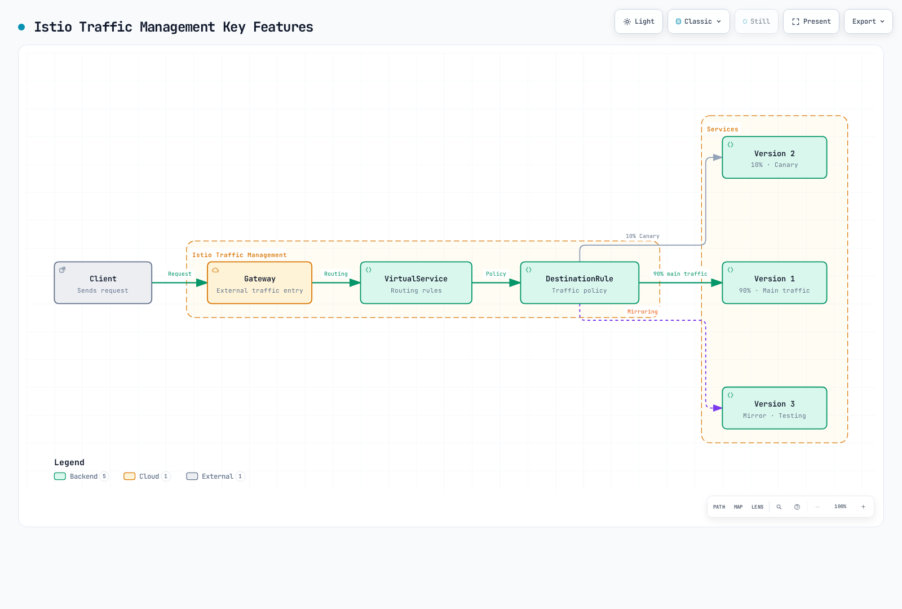

# Traffic Management

Istio's traffic management capabilities allow fine-grained control over traffic flow within the service mesh.

## Table of Contents

1. [Gateway and VirtualService](01-gateway-virtualservice.md)
2. [Routing](02-routing.md)
3. [DestinationRule](03-destination-rule.md) ⭐ Essential Concept
4. [Traffic Splitting](04-traffic-splitting.md)
5. [Retry and Timeout](05-retry-timeout.md)
6. [Load Balancing](06-load-balancing.md)
7. [Circuit Breaker](07-circuit-breaker.md)
8. [Fault Injection](08-fault-injection.md)
9. [Traffic Mirroring](09-traffic-mirror.md)
10. [Session Affinity](10-session-affinity.md)
11. [Egress Control](11-egress-control.md)
12. [ServiceEntry (External Service Management)](12-service-entry.md)

## Overview

Traffic management is one of Istio's core features, enabling the following operations without code changes:

### Key Features



[🔍 View interactive diagram](https://www.atomai.click/kubernetes-docs/archmaps/en-service-mesh-istio-traffic-management-readme-0.html)

### 1. Intelligent Routing

- **Path-based**: `/api/v1` → Service A, `/api/v2` → Service B
- **Header-based**: `User-Agent: Mobile` → Mobile Version
- **Cookie-based**: Route specific users to specific versions
- **Weight-based**: Distribute traffic by ratio

### 2. Deployment Strategies

**Canary Deployment**:
```yaml
# Only 10% to new version
route:
- destination:
    host: reviews
    subset: v1
  weight: 90
- destination:
    host: reviews
    subset: v2
  weight: 10
```

**Blue/Green Deployment**:
```yaml
# Instant switch
route:
- destination:
    host: reviews
    subset: v2  # Switch to Green
  weight: 100
```

### 3. Resilience Patterns

- **Circuit Breaker**: Isolate failing services
- **Retry**: Automatic retries
- **Timeout**: Response time limits
- **Rate Limiting**: Request rate control

### 4. Testing and Debugging

- **Traffic Mirroring**: Replicate production traffic for testing
- **Fault Injection**: Intentional fault injection
- **A/B Testing**: Provide different versions to different user groups

## Core Resources

### Gateway

Defines the entry point for external traffic into the mesh.

```yaml
apiVersion: networking.istio.io/v1
kind: Gateway
metadata:
  name: my-gateway
spec:
  selector:
    istio: ingressgateway
  servers:
  - port:
      number: 80
      name: http
      protocol: HTTP
    hosts:
    - "myapp.example.com"
```

### VirtualService

Defines how to route requests.

```yaml
apiVersion: networking.istio.io/v1
kind: VirtualService
metadata:
  name: reviews
spec:
  hosts:
  - reviews
  http:
  - match:
    - uri:
        prefix: "/v2"
    route:
    - destination:
        host: reviews
        subset: v2
  - route:
    - destination:
        host: reviews
        subset: v1
```

### DestinationRule

Defines policies for the destination service.

```yaml
apiVersion: networking.istio.io/v1
kind: DestinationRule
metadata:
  name: reviews
spec:
  host: reviews
  trafficPolicy:
    loadBalancer:
      simple: LEAST_REQUEST
  subsets:
  - name: v1
    labels:
      version: v1
  - name: v2
    labels:
      version: v2
```

## Practical Examples

### Safe Canary Deployment

```yaml
# Step 1: Start with 5% traffic
apiVersion: networking.istio.io/v1
kind: VirtualService
metadata:
  name: reviews-canary
spec:
  hosts:
  - reviews
  http:
  - route:
    - destination:
        host: reviews
        subset: v1
      weight: 95
    - destination:
        host: reviews
        subset: v2
      weight: 5
```

After monitoring, gradually increase if no issues:
- 5% → 10% → 25% → 50% → 100%

### Header-based Routing (Developer Testing)

```yaml
apiVersion: networking.istio.io/v1
kind: VirtualService
metadata:
  name: reviews-dev
spec:
  hosts:
  - reviews
  http:
  # Developers use new version
  - match:
    - headers:
        x-dev-user:
          exact: "true"
    route:
    - destination:
        host: reviews
        subset: v2
  # Regular users use stable version
  - route:
    - destination:
        host: reviews
        subset: v1
```

### Circuit Breaker + Retry

```yaml
apiVersion: networking.istio.io/v1
kind: DestinationRule
metadata:
  name: reviews-resilient
spec:
  host: reviews
  trafficPolicy:
    # Connection Pool settings
    connectionPool:
      tcp:
        maxConnections: 100
      http:
        http1MaxPendingRequests: 50
        maxRequestsPerConnection: 2
    # Circuit Breaker
    outlierDetection:
      consecutiveErrors: 5
      interval: 30s
      baseEjectionTime: 30s
---
apiVersion: networking.istio.io/v1
kind: VirtualService
metadata:
  name: reviews-retry
spec:
  hosts:
  - reviews
  http:
  - route:
    - destination:
        host: reviews
    retries:
      attempts: 3
      perTryTimeout: 2s
      retryOn: 5xx,reset,connect-failure
    timeout: 10s
```

## Traffic Flow


[🔍 View interactive diagram](https://www.atomai.click/kubernetes-docs/archmaps/en-service-mesh-istio-traffic-management-readme-1.html)

## Learning Path

For effective traffic management learning, the following order is recommended:

1. **[Gateway and VirtualService](01-gateway-virtualservice.md)** ⭐ Starting Point
   - Understanding basic concepts
   - External traffic handling

2. **[Routing](02-routing.md)**
   - Advanced routing patterns
   - Conditional routing

3. **[DestinationRule](03-destination-rule.md)** ⭐ Essential Concept
   - Understanding Subset concept
   - Traffic Policy basics
   - Integration with VirtualService

4. **[Traffic Splitting](04-traffic-splitting.md)**
   - Canary deployment
   - A/B testing

5. **[Retry and Timeout](05-retry-timeout.md)**
   - Failure recovery
   - Response time control

6. **[Load Balancing](06-load-balancing.md)**
   - Various algorithms
   - Performance optimization

7. **[Circuit Breaker](07-circuit-breaker.md)**
   - Failure isolation
   - Cascading Failure prevention

8. **[Fault Injection](08-fault-injection.md)**
   - Failure testing
   - Chaos Engineering

9. **[Traffic Mirroring](09-traffic-mirror.md)**
   - Production testing
   - New version validation

10. **[Session Affinity](10-session-affinity.md)**
    - Sticky Session
    - State preservation

11. **[Egress Control](11-egress-control.md)**
    - External service access
    - Security hardening

12. **[ServiceEntry](12-service-entry.md)**
    - External service registration
    - Egress Gateway integration

## Best Practices

### 1. Gradual Rollout

```yaml
# ❌ Bad example: 100% at once
weight: 100

# ✅ Good example: Gradual increase
# 5% → Monitor → 10% → Monitor → ...
```

### 2. Always Set Timeout

```yaml
# ✅ Always set timeout
http:
- route:
  - destination:
      host: reviews
  timeout: 10s
```

### 3. Use Retry Carefully

```yaml
# ✅ Only when idempotency is guaranteed
retries:
  attempts: 3
  perTryTimeout: 2s
  retryOn: 5xx,reset,connect-failure
```

### 4. Adjust Circuit Breaker Thresholds

```yaml
# ✅ Adjust according to service characteristics
outlierDetection:
  consecutiveErrors: 5      # Adjust per service
  interval: 30s
  baseEjectionTime: 30s
  maxEjectionPercent: 50    # Maximum 50% ejection
```

### 5. Monitor Metrics

Always monitor when changing traffic management:
- **Request Rate**: Change in request count
- **Error Rate**: Error ratio
- **Latency**: P50, P95, P99 latency
- **Success Rate**: Success ratio

## Troubleshooting

### Traffic Not Being Routed

```bash
# 1. Check VirtualService
kubectl get virtualservice -n <namespace>
kubectl describe virtualservice <name> -n <namespace>

# 2. Check DestinationRule
kubectl get destinationrule -n <namespace>

# 3. Check pod labels
kubectl get pods --show-labels -n <namespace>

# 4. Analyze Istio configuration
istioctl analyze -n <namespace>
```

### Weight Not Being Applied

```bash
# Check Envoy configuration
istioctl proxy-config routes <pod-name> -n <namespace>

# Check cluster information
istioctl proxy-config clusters <pod-name> -n <namespace>
```

## Next Steps

1. **[Security](../security/README.md)**: mTLS and authentication/authorization
2. **[Observability](../observability/README.md)**: Metrics, logs, traces
3. **[Resilience](../resilience/README.md)**: Rate Limiting, Zone Aware Routing

## References

- [Istio Traffic Management](https://istio.io/latest/docs/concepts/traffic-management/)
- [VirtualService Reference](https://istio.io/latest/docs/reference/config/networking/virtual-service/)
- [DestinationRule Reference](https://istio.io/latest/docs/reference/config/networking/destination-rule/)
- [Gateway Reference](https://istio.io/latest/docs/reference/config/networking/gateway/)

## Quiz

To test what you learned in this chapter, try the [Istio Traffic Management Quiz](../../../quizzes/service-mesh/istio/traffic-management.md).
