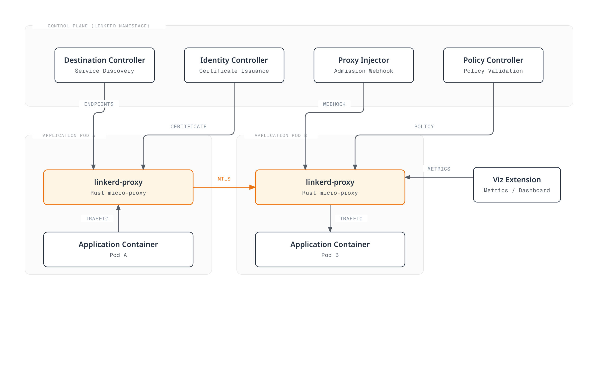
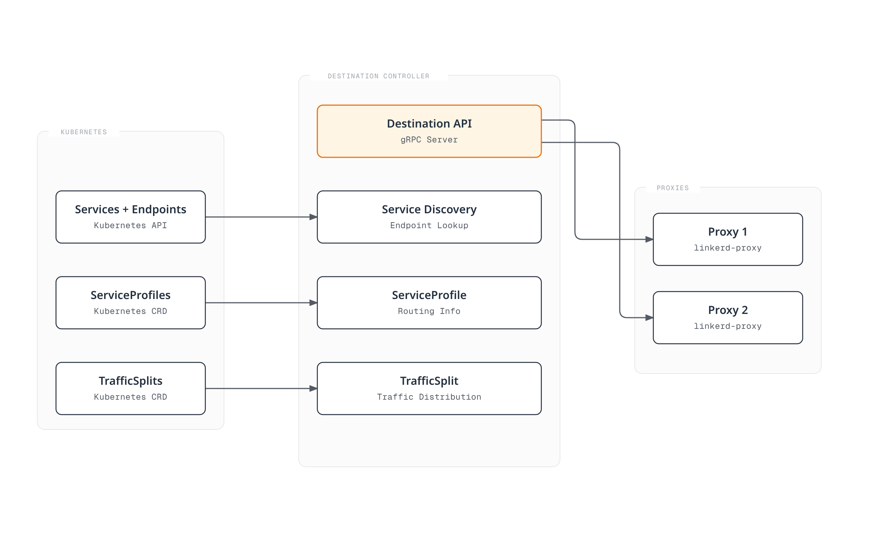
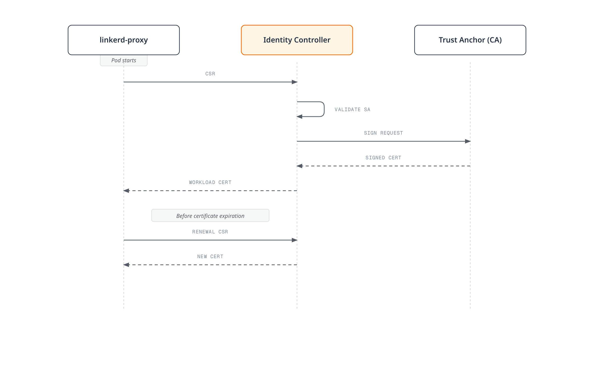
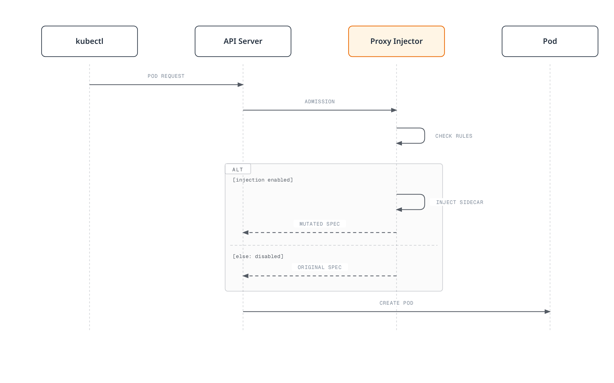
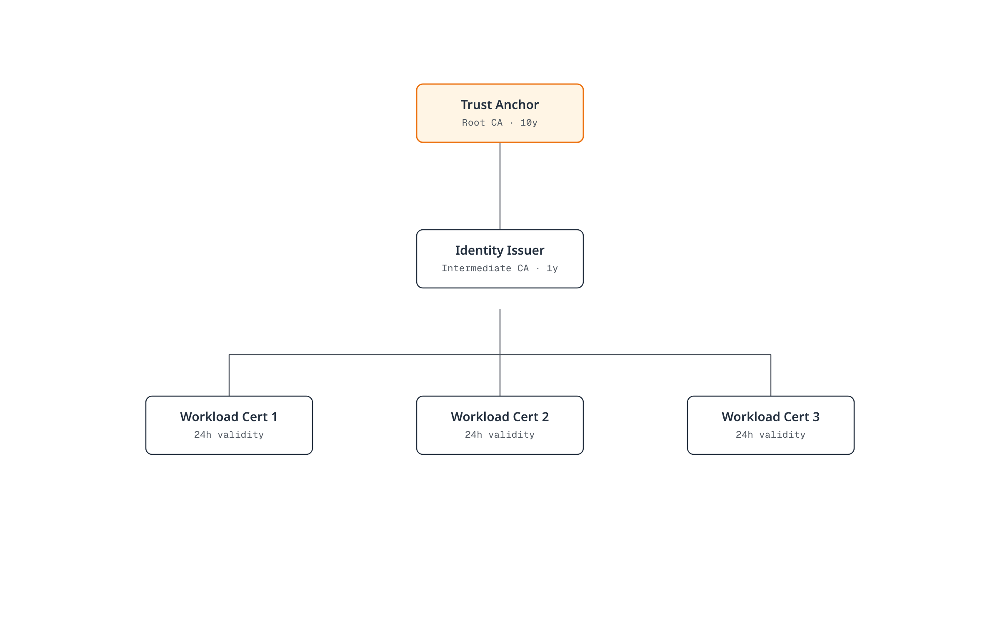
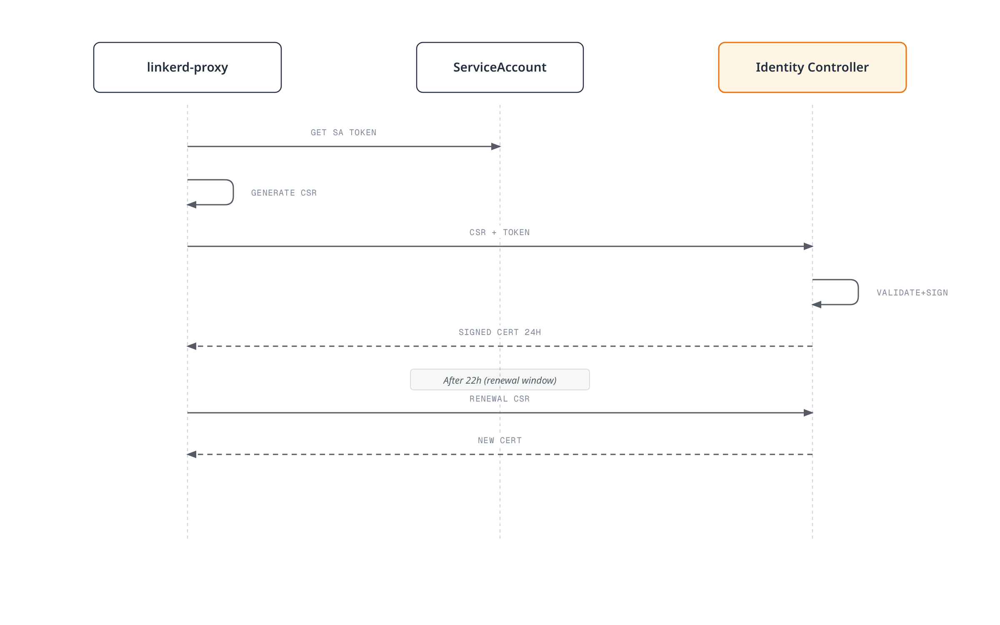
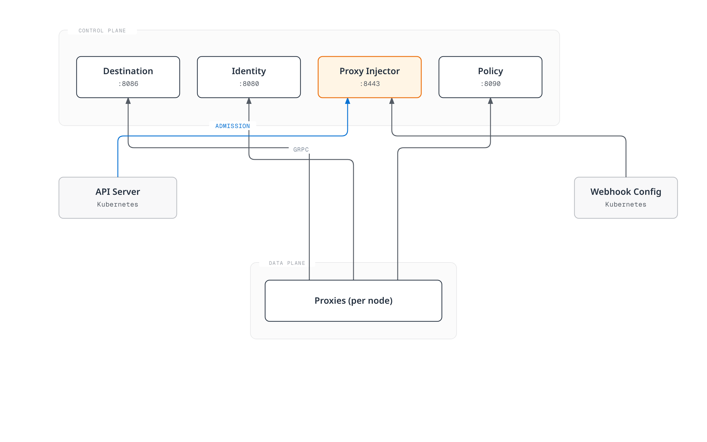
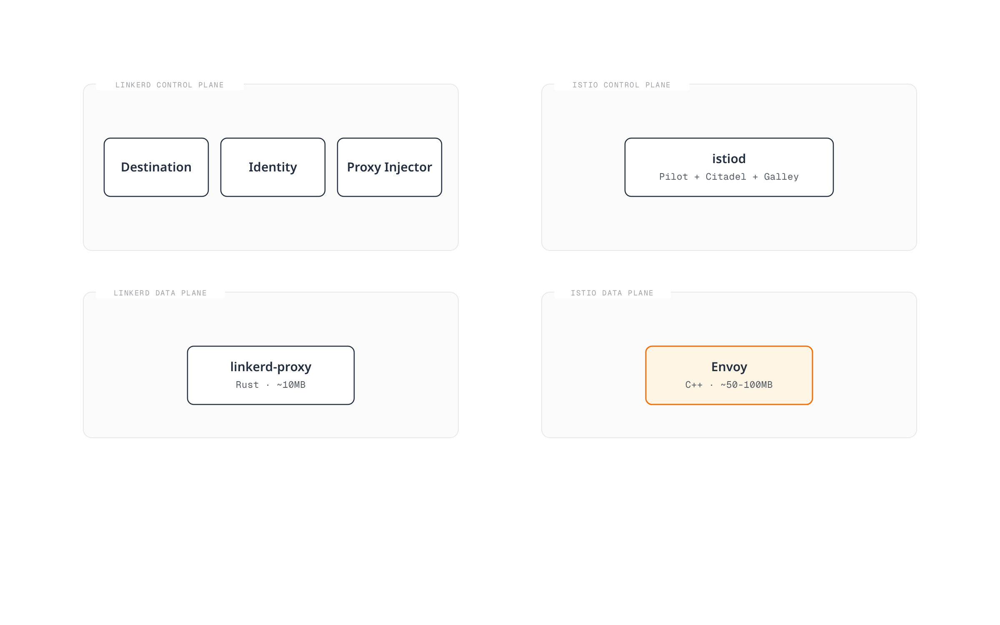

# Linkerd Architecture

> **Supported Versions**: Linkerd 2.16+
> **Last Updated**: February 22, 2026

## Overview

Linkerd follows a service mesh architecture consisting of a control plane and data plane. This document provides detailed explanations of each component's role, their interactions, the certificate hierarchy, and the proxy lifecycle.

## Overall Architecture



## Control Plane

The control plane is deployed in the `linkerd` namespace and consists of components that configure and manage the data plane proxies.

### Destination Controller

The Destination controller is the core component responsible for service discovery and policy distribution.



**Key Functions:**

| Function | Description |
|----------|-------------|
| Service Discovery | Monitors Kubernetes services and endpoints, provides real-time updates to proxies |
| Policy Distribution | Delivers policies like ServiceProfile and TrafficSplit to proxies |
| Load Balancing Info | Endpoint weight information for EWMA-based load balancing |
| Service Profiles | Per-route retries, timeouts, and metrics configuration |

**Destination API Operation:**

```go
// Destination API sends updates to proxies via gRPC streaming
// Proxy requests information about target service
service Destination {
    // Get returns update stream for a specific destination
    rpc Get(GetDestination) returns (stream Update);

    // GetProfile returns service profile update stream
    rpc GetProfile(GetDestination) returns (stream DestinationProfile);
}
```

### Identity Controller

The Identity controller handles certificate issuance and management for mTLS.



**Certificate Issuance Process:**

1. Proxy generates CSR (Certificate Signing Request) at startup
2. Identity controller validates Pod's ServiceAccount
3. Signs certificate with Trust Anchor (Root CA)
4. Delivers workload certificate to proxy
5. Default 24-hour validity, automatic renewal

**Identity Configuration:**

```yaml
# Identity settings in linkerd-config ConfigMap
apiVersion: v1
kind: ConfigMap
metadata:
  name: linkerd-config
  namespace: linkerd
data:
  values: |
    identity:
      issuer:
        # Certificate issuance lifetime (default 24 hours)
        issuanceLifetime: 24h0m0s
        # Clock skew allowance
        clockSkewAllowance: 20s
        # Issuer scheme (kubernetes.io/tls)
        scheme: kubernetes.io/tls
```

### Proxy Injector

The Proxy Injector operates as a Kubernetes Admission Webhook to automatically inject sidecars into Pods.



**Injection Conditions:**

```yaml
# Namespace-level injection enablement
apiVersion: v1
kind: Namespace
metadata:
  name: my-app
  annotations:
    linkerd.io/inject: enabled

---
# Pod-level injection control
apiVersion: v1
kind: Pod
metadata:
  name: my-pod
  annotations:
    # Enable injection
    linkerd.io/inject: enabled
    # Or disable
    # linkerd.io/inject: disabled
```

**Injected Components:**

| Component | Role |
|-----------|------|
| `linkerd-init` | Init container, sets up iptables rules |
| `linkerd-proxy` | Sidecar container, traffic proxy |
| Volumes | Identity tokens, configuration |
| Environment Variables | Proxy settings, destination addresses |

### Policy Controller

The Policy Controller manages Linkerd's authorization policies.

```yaml
# Server resource - defines inbound traffic
apiVersion: policy.linkerd.io/v1beta2
kind: Server
metadata:
  name: web-http
  namespace: my-app
spec:
  podSelector:
    matchLabels:
      app: web
  port: http
  proxyProtocol: HTTP/1

---
# ServerAuthorization - defines access permissions
apiVersion: policy.linkerd.io/v1beta2
kind: ServerAuthorization
metadata:
  name: web-authz
  namespace: my-app
spec:
  server:
    name: web-http
  client:
    meshTLS:
      serviceAccounts:
        - name: api-gateway
          namespace: my-app
```

## Data Plane

The data plane consists of `linkerd-proxy` sidecars injected into application Pods.

### linkerd2-proxy

Linkerd's data plane proxy is an ultra-lightweight micro-proxy written in Rust.


**Proxy Characteristics:**

| Characteristic | Value |
|----------------|-------|
| Language | Rust |
| Memory Usage | ~10MB |
| CPU Overhead | Minimal |
| Latency Overhead | <1ms p99 |
| Protocols | HTTP/1.1, HTTP/2, gRPC, TCP |
| TLS | TLS 1.3 (rustls) |

**Comparison with Istio Envoy:**

| Characteristic | linkerd2-proxy | Envoy (Istio) |
|----------------|---------------|---------------|
| Language | Rust | C++ |
| Memory | ~10MB | ~50-100MB |
| Binary Size | ~10MB | ~60MB |
| Latency | <1ms p99 | 2-5ms p99 |
| Config Complexity | Low (automatic) | High (xDS) |
| Extensibility | Limited | Wasm, Lua |
| Protocol Support | HTTP, gRPC, TCP | Very extensive |

### Proxy Traffic Flow


### linkerd-init (Init Container)

`linkerd-init` sets up iptables rules to redirect traffic to the proxy.

```bash
# Example iptables rules set by linkerd-init
# Redirect outbound traffic (to port 4140)
iptables -t nat -A OUTPUT -p tcp -j REDIRECT --to-port 4140

# Redirect inbound traffic (to port 4143)
iptables -t nat -A PREROUTING -p tcp -j REDIRECT --to-port 4143

# Exclude proxy's own traffic
iptables -t nat -A OUTPUT -m owner --uid-owner 2102 -j RETURN
```

**Injected Pod Structure:**

```yaml
apiVersion: v1
kind: Pod
metadata:
  name: my-app
  annotations:
    linkerd.io/inject: enabled
spec:
  initContainers:
  - name: linkerd-init
    image: cr.l5d.io/linkerd/proxy-init:v2.3.0
    args:
    - --incoming-proxy-port=4143
    - --outgoing-proxy-port=4140
    - --proxy-uid=2102
    securityContext:
      capabilities:
        add:
        - NET_ADMIN
        - NET_RAW

  containers:
  - name: my-app
    image: my-app:latest

  - name: linkerd-proxy
    image: cr.l5d.io/linkerd/proxy:stable-2.16.0
    ports:
    - containerPort: 4143  # Inbound
      name: linkerd-proxy
    - containerPort: 4191  # Admin/Metrics
      name: linkerd-admin
    env:
    - name: LINKERD2_PROXY_LOG
      value: warn,linkerd=info
    - name: LINKERD2_PROXY_DESTINATION_SVC_ADDR
      value: linkerd-dst.linkerd.svc.cluster.local:8086
    - name: LINKERD2_PROXY_IDENTITY_SVC_ADDR
      value: linkerd-identity.linkerd.svc.cluster.local:8080
    resources:
      requests:
        cpu: 100m
        memory: 64Mi
      limits:
        cpu: 1000m
        memory: 250Mi
    readinessProbe:
      httpGet:
        path: /ready
        port: 4191
    livenessProbe:
      httpGet:
        path: /live
        port: 4191
```

## Certificate Hierarchy

Linkerd uses a hierarchical PKI (Public Key Infrastructure) to implement mTLS.

### Certificate Hierarchy Structure



### Trust Anchor (Root CA)

The Trust Anchor is the root of the PKI and the foundation of trust for all certificate chains.

```bash
# Create Trust Anchor (using step CLI)
step certificate create root.linkerd.cluster.local ca.crt ca.key \
  --profile root-ca \
  --no-password \
  --insecure \
  --not-after=87600h  # 10 years

# Verify Trust Anchor
openssl x509 -in ca.crt -text -noout

# Example output:
# Certificate:
#     Data:
#         Version: 3 (0x2)
#         Serial Number: ...
#         Signature Algorithm: ecdsa-with-SHA256
#         Issuer: CN = root.linkerd.cluster.local
#         Validity
#             Not Before: Feb 21 00:00:00 2026 GMT
#             Not After : Feb 21 00:00:00 2036 GMT
#         Subject: CN = root.linkerd.cluster.local
#         ...
#         X509v3 extensions:
#             X509v3 Key Usage: critical
#                 Certificate Sign, CRL Sign
#             X509v3 Basic Constraints: critical
#                 CA:TRUE
```

**Trust Anchor Storage:**

```yaml
# Stored as Kubernetes Secret
apiVersion: v1
kind: Secret
metadata:
  name: linkerd-identity-trust-roots
  namespace: linkerd
type: Opaque
data:
  ca-bundle.crt: <base64-encoded-ca.crt>
```

### Identity Issuer (Intermediate CA)

The Identity Issuer is the intermediate CA that issues workload certificates.

```bash
# Create Identity Issuer certificate
step certificate create identity.linkerd.cluster.local issuer.crt issuer.key \
  --profile intermediate-ca \
  --ca ca.crt \
  --ca-key ca.key \
  --no-password \
  --insecure \
  --not-after=8760h  # 1 year

# Verify Issuer certificate
openssl x509 -in issuer.crt -text -noout
```

**Identity Issuer Secret:**

```yaml
apiVersion: v1
kind: Secret
metadata:
  name: linkerd-identity-issuer
  namespace: linkerd
type: kubernetes.io/tls
data:
  tls.crt: <base64-encoded-issuer.crt>
  tls.key: <base64-encoded-issuer.key>
  ca.crt: <base64-encoded-ca.crt>
```

### Workload Certificates

Each proxy receives a unique workload certificate.



**SPIFFE ID Format:**

```
spiffe://root.linkerd.cluster.local/ns/<namespace>/sa/<service-account>

# Example:
spiffe://root.linkerd.cluster.local/ns/my-app/sa/web-service
```

### Certificate Rotation

```yaml
# Certificate lifetime configuration
identity:
  issuer:
    # Workload certificate lifetime (default 24 hours)
    issuanceLifetime: 24h0m0s
    # Clock skew allowance (default 20 seconds)
    clockSkewAllowance: 20s

# Proxy automatically renews certificates before expiration
# By default, renewal starts at 70% of certificate lifetime
```

**Trust Anchor Rotation:**

```bash
# Create new Trust Anchor
step certificate create root.linkerd.cluster.local ca-new.crt ca-new.key \
  --profile root-ca \
  --no-password \
  --insecure \
  --not-after=87600h

# Create bundle (existing + new)
cat ca.crt ca-new.crt > ca-bundle.crt

# Update ConfigMap
kubectl create configmap linkerd-identity-trust-roots \
  --from-file=ca-bundle.crt=ca-bundle.crt \
  -n linkerd \
  --dry-run=client -o yaml | kubectl apply -f -

# Then restart all proxies to apply new bundle
kubectl rollout restart deploy -n my-app
```

## Sidecar Injection Details

### Injection Workflow


### Injection Annotations

```yaml
# Namespace level
metadata:
  annotations:
    linkerd.io/inject: enabled  # Inject into all Pods

# Pod/Deployment level
metadata:
  annotations:
    # Enable/disable injection
    linkerd.io/inject: enabled|disabled

    # Proxy configuration overrides
    config.linkerd.io/proxy-cpu-request: "100m"
    config.linkerd.io/proxy-memory-request: "64Mi"
    config.linkerd.io/proxy-cpu-limit: "1"
    config.linkerd.io/proxy-memory-limit: "250Mi"

    # Proxy log level
    config.linkerd.io/proxy-log-level: "warn,linkerd=info"

    # Skip ports (bypass proxy)
    config.linkerd.io/skip-inbound-ports: "25,587"
    config.linkerd.io/skip-outbound-ports: "25,587"

    # Opaque ports (bypass protocol detection)
    config.linkerd.io/opaque-ports: "3306,5432"
```

### Proxy Readiness/Liveness

```yaml
# Proxy health check endpoints
livenessProbe:
  httpGet:
    path: /live
    port: 4191
  initialDelaySeconds: 10
  periodSeconds: 10

readinessProbe:
  httpGet:
    path: /ready
    port: 4191
  initialDelaySeconds: 2
  periodSeconds: 10
```

## Inter-Component Communication



**Port Summary:**

| Component | Port | Protocol | Purpose |
|-----------|------|----------|---------|
| Destination | 8086 | gRPC | Service discovery API |
| Identity | 8080 | gRPC | Certificate issuance API |
| Policy | 8090 | gRPC | Policy API |
| Proxy Injector | 8443 | HTTPS | Admission Webhook |
| Proxy (Inbound) | 4143 | HTTP/gRPC | Inbound traffic |
| Proxy (Outbound) | 4140 | HTTP/gRPC | Outbound traffic |
| Proxy (Admin) | 4191 | HTTP | Metrics, health checks |

## Comparison with Istio Architecture

### Control Plane Comparison



| Characteristic | Linkerd | Istio |
|----------------|---------|-------|
| Control Plane | Distributed (3 components) | Unified (istiod) |
| Proxy | linkerd2-proxy (Rust) | Envoy (C++) |
| Config Protocol | Custom gRPC | xDS (complex) |
| Number of CRDs | ~10 | ~50+ |
| Learning Curve | Gentle | Steep |
| Resource Usage | Low | High |
| Extensibility | Limited | Wasm, Lua |

### Proxy Comparison

```yaml
# Linkerd Proxy Resources (typical)
resources:
  requests:
    cpu: 100m
    memory: 64Mi
  limits:
    cpu: 1000m
    memory: 250Mi

# Envoy Proxy Resources (typical)
resources:
  requests:
    cpu: 100m
    memory: 128Mi
  limits:
    cpu: 2000m
    memory: 1Gi
```

## Next Steps

- [Traffic Management](./03-traffic-management.md): ServiceProfile and traffic splitting
- [Security](./04-security.md): mTLS and authorization policies
- [Observability](./05-observability.md): Metrics and dashboards

## References

- [Linkerd Architecture](https://linkerd.io/2/reference/architecture/)
- [linkerd2-proxy GitHub](https://github.com/linkerd/linkerd2-proxy)
- [Linkerd Identity](https://linkerd.io/2/features/automatic-mtls/)
- [Proxy Injection](https://linkerd.io/2/features/proxy-injection/)
