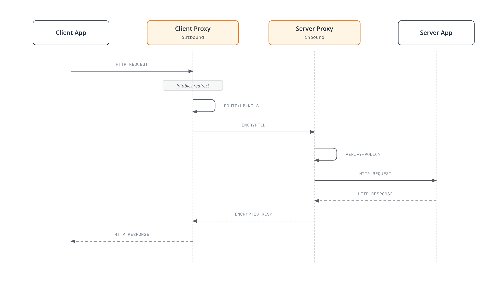

# Linkerd Architecture

> **Reviewed**: September 11, 2026 · Linkerd edge-26.9.1 / proxy release/v2.368.0

This chapter explains the current component roles, identity hierarchy, traffic capture and injection lifecycle. Use the [installation guide](01-installation.md) for the supported release/cluster combination and pinned artifacts. The examples below are configuration illustrations; no live deployment or CA rotation was performed in this audit.

## Overall Architecture


[View interactive diagram](https://www.atomai.click/kubernetes-docs/archmaps/en-service-mesh-linkerd-02-architecture-0.html)

The default control-plane namespace is linkerd. The pinned chart has three core Deployments: linkerd-destination, linkerd-identity and linkerd-proxy-injector. Destination also contains the policy and ServiceProfile-validator containers; logical controller roles are not the same as separate Deployments. Optional Viz and multicluster components have their own lifecycles.

The data plane uses Rust proxies alongside enrolled applications. Native sidecars are the default for this release. The Identity Deployment deliberately uses a regular proxy with startup waiting disabled, so inspection must consider both containers and initContainers.

## Control Plane

### Destination Controller

Destination watches discovery state and provides endpoint addresses, expected identities and profile information through streaming APIs. Current defaults use EndpointSlices. ServiceProfiles remain an earlier configuration mechanism; Gateway API routing and authorization also involve the policy controller. Do not describe current Linkerd routing as only SMI TrafficSplit or assume Destination directly watches that legacy extension's resources.

| Responsibility | Meaning |
|---|---|
| Discovery | Endpoint additions/removals and metadata for the requested Service |
| Expected identity | Information used by the outbound proxy to authenticate the selected peer |
| Profiles | Supported route/profile configuration for metrics, retries and timeouts |
| Load-balancing inputs | Endpoint and configured weight information; runtime latency observations and request/connection selection occur in the proxy |

This is a **Protocol Buffers service excerpt**, not Go source. Message definitions and imports are in the pinned proxy API:

```protobuf
// Excerpt: message definitions/imports are in the linked API source.
service Destination {
  rpc Get(GetDestination) returns (stream Update) {}
  rpc GetProfile(GetDestination) returns (stream DestinationProfile) {}
}
```

Get streams destination updates; GetProfile streams profile updates. Neither a stream nor a local cache makes configuration changes instantaneous or eliminates the need to handle unavailable endpoints.

### Identity Controller

The default Kubernetes identity flow is:

1. Proxy startup establishes local private-key/CSR material.
2. The identity client submits the CSR, requested identity and ServiceAccount token.
3. Identity validates the token using Kubernetes TokenReview and derives the DNS-form identity.
4. The configured **issuer signing credential**, normally the intermediate issuer, signs the workload certificate.
5. The client loads the returned certificate/chain and renews it before expiry.

The trust anchor is the basis for chain validation. Its private key is not required by the Linkerd identity controller; the root does not act as an online signer for every workload CSR.

The following is a **Helm values fragment** for the installation owner:

```yaml
identity:
  issuer:
    issuanceLifetime: 24h0m0s
    clockSkewAllowance: 20s
    scheme: linkerd.io/tls
```

linkerd.io/tls is the default issuer scheme. A kubernetes.io/tls integration uses the corresponding externally managed Secret format. Do not change the scheme without matching the credential owner and keys, and do not overwrite linkerd-config's entire values entry with a partial identity ConfigMap.

### Proxy Injector


[View interactive diagram](https://www.atomai.click/kubernetes-docs/archmaps/en-service-mesh-linkerd-02-architecture-3.html)

The injector is a mutating admission webhook. Its response describes mutations that the API server applies; the diagram is conceptual, not a wire-format example. Actual webhook selection, Pod overrides and platform eligibility still apply.

Enable a selected namespace:

```yaml
apiVersion: v1
kind: Namespace
metadata:
  name: my-app
  annotations:
    linkerd.io/inject: enabled
```

For a Deployment, put overrides in its **Pod template**. This fragment belongs inside the existing workload definition:

```yaml
spec:
  template:
    metadata:
      annotations:
        linkerd.io/inject: enabled
        config.linkerd.io/proxy-cpu-request: 100m
        config.linkerd.io/proxy-memory-request: 64Mi
        config.linkerd.io/proxy-cpu-limit: '1'
        config.linkerd.io/proxy-memory-limit: 250Mi
        config.linkerd.io/proxy-log-level: warn,linkerd=info
```

Use one literal value, enabled or disabled, not enabled|disabled. Adding an annotation does not modify existing Pods. The installed webhook excludes designated system namespaces, and explicit Pod overrides can disable otherwise enabled injection.

| Injected/configured item | Role |
|---|---|
| linkerd-init | Pod-network capture setup when Linkerd CNI is not used |
| linkerd-proxy | Data-plane proxy, normally a restartable init container in this release |
| Projected identity token and local identity storage | Bootstrap and workload certificate use; the proxy key is not distributed as a shared workload Secret |
| Environment/probes/resources | Version-specific runtime configuration generated by injection |

### Policy Controller

Policy controls inbound authorization and supported outbound/request-routing behavior. This example selects Pods labeled app:web with a declared port named http, and authorizes the meshed api-gateway ServiceAccount in my-app:

```yaml
apiVersion: policy.linkerd.io/v1beta3
kind: Server
metadata:
  name: web-http
  namespace: my-app
spec:
  podSelector:
    matchLabels:
      app: web
  port: http
  proxyProtocol: HTTP/1
  accessPolicy: deny
---
apiVersion: policy.linkerd.io/v1alpha1
kind: AuthorizationPolicy
metadata:
  name: web-api-gateway
  namespace: my-app
spec:
  targetRef:
    group: policy.linkerd.io
    kind: Server
    name: web-http
  requiredAuthenticationRefs:
  - kind: ServiceAccount
    name: api-gateway
```

A Server selects existing Pod/port pairs; it does not create an application, Service or listener. The named port must exist. Selected traffic defaults to deny unless permitted by applicable policy or an explicitly selected alternative access policy. Stage and test the policy scope before enforcing it.

AuthorizationPolicy can target a Server or supported route. ServiceAccount references are a convenient authentication requirement; MeshTLSAuthentication and NetworkAuthentication express additional identity/network sets. All required authentication references within one policy must match; review other policies that can also authorize traffic.

For an existing ServerAuthorization workflow, this is a supported **alternative**, not an extra requirement to apply with the preceding authorization:

```yaml
apiVersion: policy.linkerd.io/v1beta1
kind: ServerAuthorization
metadata:
  name: web-authz-legacy
  namespace: my-app
spec:
  server:
    name: web-http
  client:
    meshTLS:
      serviceAccounts:
      - name: api-gateway
        namespace: my-app
```

The released CRDs serve ServerAuthorization v1beta1, not the original example's v1beta2. Server v1beta2 remains served; the example uses its current storage version v1beta3. AuthorizationPolicy is the more flexible preferred interface. Do not conflate these Linkerd resources with Istio's similarly named resources in another API group.

## Data Plane

### Proxy behavior and protocol scope

linkerd2-proxy is written in Rust and is purpose-built for the mesh. It supports HTTP/1.1, HTTP/2, gRPC and TCP. HTTP-level routing/metrics require visible HTTP; application-originated TLS is opaque, and UDP/QUIC or skipped traffic is not covered by the TCP proxy path.

For eligible meshed TCP peers, Linkerd provides transport mTLS. The documented mesh transport uses TLS 1.3; application-originated TLS passthrough is a separate layer. Unmeshed peers and explicit capture bypasses need separate consideration. The default inbound policy accepts unmeshed plaintext; automatic mTLS is not equivalent to enforcing authenticated access from every source.

The proxy uses latency-aware balancing for HTTP requests and connection-level balancing for opaque TCP. Endpoint weights and routing rules are distinct from runtime latency estimates. Do not interpret EWMA as a guarantee that every request goes to one deterministically fastest endpoint.

There is no universal 10MB memory, <1ms p99 or fixed binary-size guarantee. Measurements depend on version/build, architecture, connection count, policy/configuration, workload and instrumentation.

### Proxy Traffic Flow



[View interactive diagram](https://www.atomai.click/kubernetes-docs/archmaps/en-service-mesh-linkerd-02-architecture-5.html)

Outbound discovery, routing/balancing, retries and timeouts differ from inbound authorization. A new connection can perform discovery and mTLS setup; existing connections and cached configuration may be reused. Safe request retry behavior remains an application/protocol decision, especially for writes.

### Traffic capture: linkerd-init or CNI

Use the generated proxy-init or Linkerd CNI configuration. The following is a conceptual order, **not host iptables commands to execute**:

```text
Inside the Pod network namespace:
  outbound TCP -> evaluate proxy-UID and configured bypass rules first
               -> redirect intercepted traffic to the outbound proxy (default 4140)
  inbound TCP  -> evaluate configured bypass rules
               -> redirect intercepted traffic to the inbound proxy (default 4143)

Linkerd CNI: installs the Linkerd-specific capture setup through the CNI chain.
linkerd-init: performs the setup at Pod startup when Linkerd CNI is not used.
```

The former example appended the proxy-UID bypass after an all-TCP REDIRECT, where it would not protect the proxy's own outbound traffic. Applying such rules in the host namespace is also not the Pod-specific Linkerd setup. The real implementation includes additional exclusions/chains and supports configured iptables modes.

Opaque ports skip protocol detection while retaining proxy transport handling. Skip ports bypass the proxy and its mesh features. For server-first traffic, do not use skip merely as a substitute for correct opaque/protocol configuration.

### Inspect the generated Pod instead of hand-building a proxy

The old manually assembled Pod omitted identity/bootstrap material and used an unavailable upstream stable-2.16.0 image assumption. Generate or inspect configuration with the selected CLI and installed control-plane configuration:

```bash
# The input is a complete, reviewed application manifest.
# Default mode adds the injection annotation for server-side admission.
linkerd inject web.yaml > web-annotated.yaml

# Manual mode materializes the proxy spec using the selected cluster configuration.
# Review/remove conflicting input config annotations before selecting CLI flags.
linkerd inject --manual --native-sidecar \
  --proxy-cpu-request 100m --proxy-memory-request 64Mi \
  --proxy-cpu-limit 1 --proxy-memory-limit 250Mi \
  web.yaml > web-manually-injected.yaml
```

Default inject mode is an annotation transform. In edge-26.9.1, manual generation also consumes existing input configuration annotations: an observed CPU-request annotation of 700m took precedence over a 100m CLI flag, and an input log-level annotation was applied. Update/remove conflicting inputs and inspect the resulting proxy fields. A manually materialized proxy is not automatically regenerated by later annotation edits; update the generated workload through its owner rather than copying a shortened container as a complete installation.

```bash
: "${APP_POD:?Set an application Pod name in my-app}"
kubectl -n my-app get pod "$APP_POD" -o json |
  jq '{pod: .metadata.name, proxies: ([.spec.containers[]?, .spec.initContainers[]?] | map(select(.name == "linkerd-proxy") | {image, restartPolicy, resources, startupProbe, readinessProbe, livenessProbe}))}'
```

Native sidecars appear in initContainers with restartPolicy: Always. A linkerd-init container is omitted with the configured CNI path. Proxy health endpoints are /live and /ready on the configured admin port (default 4191); native startup/readiness behavior and application readiness are separate.

## Certificate Hierarchy

| Material | Default role/storage |
|---|---|
| Trust anchor certificate/bundle | Public trust basis; linkerd-identity-trust-roots ConfigMap, ca-bundle.crt |
| Root CA private key | PKI-owner material; Linkerd does not need it to run |
| Issuer certificate/private key | linkerd-identity-issuer Secret; default format uses crt.pem/key.pem |
| Kubernetes TLS issuer integration | A deliberately configured alternative using tls.crt/tls.key and matching scheme |
| Workload key/certificate | Proxy-local credential material; nominal certificate validity 24h, automatically renewed |

Issuer and trust-anchor validity depend on their configured PKI. Default CLI-generated roots/issuers have one-year validity; a custom ten-year example is not a default or a universal recommendation. Inspect actual certificate dates instead of copying a fixed example timestamp.

### Kubernetes workload identity

For the default Kubernetes identity mechanism, the identity is DNS-form:

```text
<service-account>.<namespace>.serviceaccount.identity.<linkerd-namespace>.<identity-trust-domain>

web-service.my-app.serviceaccount.identity.linkerd.cluster.local
```

Multiple Pods using the same ServiceAccount share this identity while holding their own local credentials. The identity trust domain is a configurable concept, not necessarily identical to a changed Kubernetes DNS suffix.

The original spiffe://root.linkerd.cluster.local/ns/.../sa/... string was not the default Kubernetes identity format. SPIFFE/SPIRE-based identities are supported for a distinct [external-workload mesh-expansion path](https://linkerd.io/docs/tasks/adding-non-kubernetes-workloads/); do not substitute its identity/bootstrap model for Kubernetes TokenReview.

### Renewal and rotation

In proxy release/v2.368.0, the identity client normally schedules the next certificate attempt at 70% of the **remaining** validity, clamped by configured minimum/maximum refresh intervals. Error/expiry paths can use the minimum delay. This is not a fixed wall-clock guarantee for every certificate.

That client reuses its loaded key/CSR documents when requesting renewed certificates. Certificate renewal is not the same as private-key rotation, issuer rotation or trust-anchor rotation.

```bash
set -euo pipefail
kubectl -n linkerd get configmap linkerd-identity-trust-roots \
  -o jsonpath='{.data.ca-bundle\.crt}' > trust-bundle.pem
openssl crl2pkcs7 -nocrl -certfile trust-bundle.pem |
  openssl pkcs7 -print_certs -text -noout
kubectl -n linkerd get secret linkerd-identity-issuer -o json |
  jq -er '.data["crt.pem"] // .data["tls.crt"]' |
  base64 -d | openssl x509 -noout -dates
```

A complete trust-anchor transition has multiple phases:

1. Inventory the current valid roots, issuer, all consumers and the installation/PKI owners.
2. Add the new root alongside the old root through the owner's configuration. Ensure affected proxies/control-plane components and multicluster peers actually load the overlap bundle.
3. Rotate the issuer to a credential signed by the new root and confirm the identity service loaded it.
4. Renew/recreate consumers as required by their configuration source; verify actual new credentials and mTLS traffic across the affected paths.
5. Remove the old root only when no required peer depends on it, propagate the final bundle and re-verify.

The former ConfigMap update plus one namespace restart stopped before issuer transition and old-root removal; it was not a complete rotation procedure. Avoid direct mutations that fight Helm/cert-manager/trust-manager ownership. An already expired root needs a recovery procedure rather than a normal valid-root rollover.

```bash
linkerd check
linkerd check --proxy
kubectl -n linkerd get events --field-selector reason=IssuerUpdated
# Inspect each affected namespace/workload and its actual proxy version/identity.
kubectl -n my-app get pods -o wide
```

An IssuerUpdated event is one observation, not proof that every proxy or remote cluster has transitioned. cert-manager can automate issuer renewal and trust-manager can distribute bundles, but root cutover still needs coordinated verification. Follow the [manual](https://linkerd.io/docs/tasks/manually-rotating-control-plane-tls-credentials/) or [managed credential workflow](https://linkerd.io/docs/tasks/automatically-rotating-control-plane-tls-credentials/) for the actual PKI design; this chapter did not execute a rotation.

## Sidecar Injection Details


[View interactive diagram](https://www.atomai.click/kubernetes-docs/archmaps/en-service-mesh-linkerd-02-architecture-8.html)

For controller workloads, use Pod-template annotations and inspect the resulting Pods. Duplicate metadata keys in one YAML mapping overwrite/conflict; keep namespace and workload examples as separate resources/fragments.

The resource/log annotations shown earlier set intended proxy requests/limits and log configuration. They are not measurements of actual consumption. Opaque-port overrides replace the default port list rather than simply adding two database ports; retain all required ports. Skip-port overrides intentionally remove traffic from mesh handling.

## Inter-Component Communication


[View interactive diagram](https://www.atomai.click/kubernetes-docs/archmaps/en-service-mesh-linkerd-02-architecture-9.html)

| Component/path | Default port | Protocol/purpose |
|---|---|---|
| Destination Service | 8086 | Streaming discovery/profile gRPC |
| Identity Service | 8080 | Certificate API gRPC |
| Policy Service | 8090 | Policy gRPC |
| Proxy Injector | Service 443 → Pod 8443 | HTTPS admission webhook |
| Proxy inbound | 4143 | Intercepted TCP, including HTTP/gRPC or opaque traffic |
| Proxy outbound | 4140 | Intercepted outbound TCP |
| Proxy admin | 4191 | HTTP metrics and health endpoints |

These ports can be configured and are not a blanket network-access rule. The admin endpoint is not an Envoy-style routing configuration interface; policy/configuration is delivered through the control-plane APIs.

## Comparison with Istio Architecture

| Aspect | Linkerd | Istio |
|---|---|---|
| Control-plane packaging | Three core Deployments in this release, with several logical controllers | Unified Istiod for major control functions, plus mode-specific components |
| Data plane | Purpose-built Rust proxies | Envoy sidecars or ambient ztunnel with selected waypoints |
| Configuration | Linkerd streaming gRPC APIs and its supported resources | xDS for Envoy and supported Istio/Gateway API configuration |
| Extensions | Check the supported Linkerd feature/API surface | Check mode/version-specific Envoy/Wasm/Lua support and attachment |
| Resource/performance comparison | Measure matched workloads and actual configuration | Measure matched workloads and actual configuration |

xDS also commonly uses gRPC; protocol naming is not an intrinsic complexity ranking. CRD counts vary with versions and extensions and do not measure runtime overhead. Requests/limits are configured reservations/caps, not observed memory or latency. Compare the same workload, traffic, protocol, policy and failure budget before making a choice; see the [maintained comparison](../istio/comparison/README.md).

## Next Steps and Sources

- [Traffic Management](03-traffic-management.md), [Security](04-security.md), [Observability](05-observability.md)
- [Architecture Quiz](../../quizzes/service-mesh/linkerd/architecture.md)
- [Official architecture](https://linkerd.io/docs/reference/architecture/), [injection](https://linkerd.io/docs/features/proxy-injection/) and [policy reference](https://linkerd.io/docs/reference/authorization-policy/)
- [Automatic mTLS](https://linkerd.io/docs/features/automatic-mtls/), [protocol handling](https://linkerd.io/docs/features/protocol-detection/) and [load balancing](https://linkerd.io/docs/features/load-balancing/)
- [Pinned Destination API](https://github.com/linkerd/linkerd2-proxy-api/blob/v0.20.0/proto/destination.proto)
- [Kubernetes token validation](https://github.com/linkerd/linkerd2/blob/edge-26.9.1/controller/identity/validator.go) and [identity formatting](https://github.com/linkerd/linkerd2/blob/edge-26.9.1/controller/identity/domain.go)
- [Pinned certificate refresh implementation](https://github.com/linkerd/linkerd2-proxy/blob/a66af8117769df060adda6233302a2d1c4142229/linkerd/proxy/identity-client/src/certify.rs)
