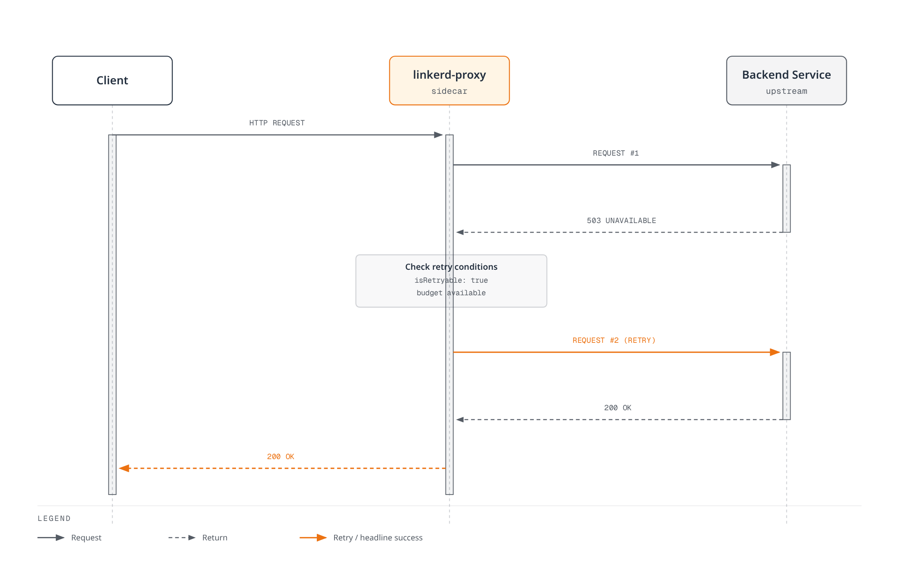
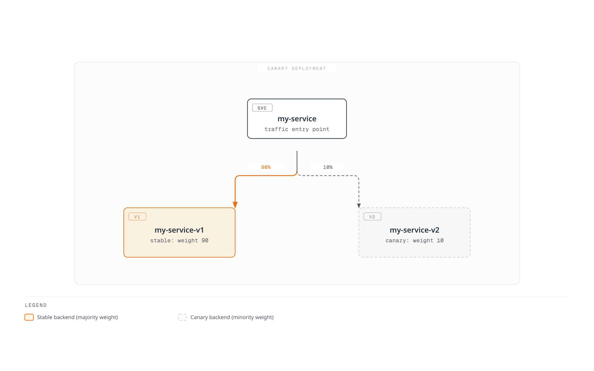

# Linkerd Traffic Management

> **Reviewed**: September 11, 2026 · Linkerd edge-26.9.1 · Gateway API 1.5.1 · Flagger 1.45.0

Current Linkerd routing uses Gateway API resources and supported annotations. ServiceProfiles remain a compatibility interface, while TrafficSplit/linkerd-smi is deprecated. These paths are not interchangeable: an existing ServiceProfile takes precedence over outbound HTTPRoutes for the same Service and prevents the newer retry/timeout/failure-accrual configuration from taking effect.

The examples below are separate exercises for existing, tested application workloads. They assume the [installation prerequisites](01-installation.md), appropriate namespace enrollment, declared Service/container ports and ready endpoints. No cluster installation, traffic shift or production-load test was executed in this review.

## Traffic Management Architecture

| Policy path | Intended role | Important boundary |
|---|---|---|
| Service-parent HTTPRoute | Outbound routing/reliability from meshed callers | The client must be meshed and able to inspect HTTP |
| Server-parent HTTPRoute | Inbound authorization matching | Different attachment and policy role |
| ServiceProfile | Earlier route metrics/retries/timeouts | Overrides the newer policy path for the same Service |
| TrafficSplit | Legacy SMI weighted routing | Requires its deprecated extension/CRDs |

Service-based policy relies on Service discovery. Direct Pod-IP/headless paths, unmeshed callers and application-originated opaque TLS do not automatically receive the same L7 behavior. Treat identity, authorization and routing as separate controls.

## Current HTTPRoute Routing

### Services and weighted routing

For this exercise, prepare stable and canary Deployments labeled app:web and version:stable/canary, listening on 8080 with workload-appropriate readiness. The namespace below enrolls newly created eligible Pods; it does not deploy those applications:

```yaml
apiVersion: v1
kind: Namespace
metadata:
  name: route-demo
  annotations:
    linkerd.io/inject: enabled
---
apiVersion: v1
kind: Service
metadata:
  name: web
  namespace: route-demo
spec:
  selector:
    app: web
    version: stable
  ports:
  - name: http
    port: 80
    targetPort: 8080
    appProtocol: http
---
apiVersion: v1
kind: Service
metadata:
  name: web-stable
  namespace: route-demo
spec:
  selector:
    app: web
    version: stable
  ports:
  - name: http
    port: 80
    targetPort: 8080
    appProtocol: http
---
apiVersion: v1
kind: Service
metadata:
  name: web-canary
  namespace: route-demo
spec:
  selector:
    app: web
    version: canary
  ports:
  - name: http
    port: 80
    targetPort: 8080
    appProtocol: http
```

The apex Service selects **stable** Pods for Kubernetes/default routing. Its selector is not unused: non-meshed or otherwise non-policy traffic still needs a deliberate backend. The HTTPRoute directs eligible meshed client traffic to the backend Services:

```yaml
apiVersion: gateway.networking.k8s.io/v1
kind: HTTPRoute
metadata:
  name: web-route
  namespace: route-demo
spec:
  parentRefs:
  - group: ''
    kind: Service
    name: web
    port: 80
  rules:
  - backendRefs:
    - name: web-stable
      port: 80
      weight: 90
    - name: web-canary
      port: 80
      weight: 10
```

group:"" is the canonical core API group for Service references. Linkerd retains a legacy core alias in some paths, but portable Gateway API resources should use the empty group. The referenced 80 is the Service port, not the container's 8080.

Weights are relative, nonnegative values with a usable positive total. 90/10 and 9/1 express the same proportion; the sum need not be 100. They are a routing configuration, not a guarantee of exact short-run request counts, equal connections or corresponding replica counts.

```bash
kubectl -n route-demo get httproute web-route -o yaml
kubectl -n route-demo get endpointslices.discovery.k8s.io \
  -l kubernetes.io/service-name=web-stable -o yaml
linkerd diagnostics policy -n route-demo svc/web 80 -o json
linkerd viz stat deploy/client -n route-demo --to svc/web
linkerd viz stat pods -n route-demo
```

Inspect route Accepted/ResolvedRefs conditions, actual controller policy and real client traffic. A controller policy view is not proof that every proxy has already applied it.

### Headers and paths

The following is an **alternative replacement** for web-route, adding a canary cohort header before the weighted default rule:

```yaml
apiVersion: gateway.networking.k8s.io/v1
kind: HTTPRoute
metadata:
  name: web-route
  namespace: route-demo
spec:
  parentRefs:
  - group: ''
    kind: Service
    name: web
    port: 80
  rules:
  - matches:
    - headers:
      - name: x-release-track
        type: Exact
        value: canary
    backendRefs:
    - name: web-canary
      port: 80
  - backendRefs:
    - name: web-stable
      port: 80
      weight: 90
    - name: web-canary
      port: 80
      weight: 10
```

Header values are not authenticated identities. An untrusted client can set x-release-track or x-debug; use separate authorization for privileged/debug backends. Exact matching on Cookie:beta=true only matches that entire header value, not any occurrence of a cookie among other cookie pairs. Normalize an authorized cohort signal or implement deliberate cookie parsing instead of claiming general cookie semantics from an exact header match.

A path-routing example for separately prepared Services:

```yaml
apiVersion: gateway.networking.k8s.io/v1
kind: HTTPRoute
metadata:
  name: frontend-paths
  namespace: route-demo
spec:
  parentRefs:
  - group: ''
    kind: Service
    name: frontend
    port: 80
  rules:
  - matches:
    - path:
        type: PathPrefix
        value: /api
    backendRefs:
    - name: api-service
      port: 80
  - matches:
    - path:
        type: PathPrefix
        value: /static
    backendRefs:
    - name: static-service
      port: 80
  - backendRefs:
    - name: web-stable
      port: 80
```

Matches within one entry combine with AND; alternative entries/rules and competing routes follow Gateway API precedence. Do not assume file order alone resolves conflicts between different HTTPRoute objects.


## Retries and Timeouts

Retries are opt-in outbound behavior, not an automatic guarantee that failed requests recover. Use them only when replay is safe for the actual operation. A reset/error/timeout can leave a write's server-side outcome unknown; application idempotency and client retries require separate control.

For an existing Service api in retry-demo, this pair configures retries only for GET /api/read and its descendants, with a forwarding fallback for other requests:

```yaml
apiVersion: gateway.networking.k8s.io/v1
kind: HTTPRoute
metadata:
  name: api-read
  namespace: retry-demo
  annotations:
    retry.linkerd.io/http: gateway-error
    retry.linkerd.io/limit: '2'
    retry.linkerd.io/timeout: 400ms
    timeout.linkerd.io/request: 2s
spec:
  parentRefs:
  - group: ''
    kind: Service
    name: api
    port: 80
  rules:
  - matches:
    - method: GET
      path:
        type: PathPrefix
        value: /api/read
    backendRefs:
    - name: api
      port: 80
---
apiVersion: gateway.networking.k8s.io/v1
kind: HTTPRoute
metadata:
  name: api-default
  namespace: retry-demo
spec:
  parentRefs:
  - group: ''
    kind: Service
    name: api
    port: 80
  rules:
  - matches:
    - path:
        type: PathPrefix
        value: /
    backendRefs:
    - name: api
      port: 80
```

This example requires **no retry annotations on the parent Service**, no conflicting ServiceProfile, and no enabled untrusted per-request policy overrides. Otherwise the fallback can inherit a retry policy. Inspect the effective policy and measure write requests separately; forwarding a write is not evidence that every layer has disabled retries.

The annotations configure at most two retries (up to three attempts), a 400ms retry timeout and a 2s whole-request timeout. The request deadline includes the attempt budget and can terminate the operation before all retries occur. In the current reference, requests with bodies larger than 64KiB are not retried.

**Do not use retry.linkerd.io/limit:"0" as a disable switch in edge-26.9.1.** See the [released parser](https://github.com/linkerd/linkerd2/blob/edge-26.9.1/policy-controller/k8s/index/src/outbound/index/http.rs). The released parser filters zero into an unspecified value; with retry conditions present it falls back to one retry. An empty HTTP retry-condition string is also not a supported no-retry policy. Keep mixed-method Service defaults free of retry configuration and attach opt-in policy only to the intended read routes.

Route retry annotations override the Service retry configuration as a group, and route timeout annotations similarly override Service timeout annotations. ServiceProfiles supersede these annotations. Linkerd can optionally honor l5d-* per-request headers when explicitly enabled; do not accept policy overrides from untrusted clients or treat those headers as authentication.

### Deadline scope

| Configuration | Scope |
|---|---|
| timeout.linkerd.io/request | Whole request/response stream |
| timeout.linkerd.io/response | Backend response in-flight duration |
| timeout.linkerd.io/idle | Stream inactivity |
| retry.linkerd.io/timeout | A retryable attempt timeout, subject to retry policy/limit |
| ServiceProfile route timeout | The legacy route's overall wait, including retries |

Ordinary request/response/idle timeouts are not the retry timeout. A timeout does not prove cancellation of business work. Once response headers/body have already started, failure may terminate/reset a stream instead of generating a fresh HTTP error response.


[View interactive diagram](https://www.atomai.click/kubernetes-docs/archmaps/en-service-mesh-linkerd-03-traffic-management-2.html)

Do not prescribe 5/60/600-second values solely from labels such as “sync,” “async” or “file upload.” Start with the application's end-to-end deadline, expected processing/streaming behavior and client/server cancellation semantics. Omitting one policy timeout does not remove other application, transport, proxy or load-balancer limits.

## ServiceProfiles: Supported Compatibility Configuration

ServiceProfiles remain supported but have been superseded for new feature development by Gateway API configuration. This **separate profile-demo exercise** illustrates valid legacy route matching and explicit write non-retryability:

```yaml
apiVersion: linkerd.io/v1alpha2
kind: ServiceProfile
metadata:
  name: api.profile-demo.svc.cluster.local
  namespace: profile-demo
spec:
  routes:
  - name: read-users
    condition:
      all:
      - method: GET
      - pathRegex: ^/api/users(/.*)?$
    isRetryable: true
    timeout: 5s
  - name: write-api
    condition:
      all:
      - any:
        - method: POST
        - method: PUT
        - method: PATCH
        - method: DELETE
      - pathRegex: ^/api/.*$
    isRetryable: false
    timeout: 10s
  - name: health
    condition:
      all:
      - method: GET
      - pathRegex: ^/(health|ready|live)$
    isRetryable: false
    timeout: 1s
  - name: stream
    condition:
      all:
      - method: GET
      - pathRegex: ^/stream$
    isRetryable: false
  retryBudget:
    retryRatio: 0.2
    minRetriesPerSecond: 10
    ttl: 10s
```

method is an exact HTTP method, not a regex. POST|PUT|DELETE is not a union of methods. Use explicit any/all conditions or separate routes, including PATCH where appropriate. Route selection and response classification must match the application; a configured retryable flag is a safety assertion by the operator, not automatic proof of idempotency.

isRetryable:false disables this ServiceProfile mechanism for the matched route. It does not stop an SDK, client or another intermediary from retrying. The stream route omits a profile timeout; that means no timeout from this field, not an unlimited end-to-end operation.

### Retry budget

retryRatio:0.2 contributes proportional retry allowance. minRetriesPerSecond:10 adds allowance independently, so this is **not a hard 20% cap** at low traffic. ttl is the lookback/retention window for calculating the budget, not a periodic reset timer. Actual retries also depend on route eligibility, response classification, buffering, deadlines and available endpoints.



[View interactive diagram](https://www.atomai.click/kubernetes-docs/archmaps/en-service-mesh-linkerd-03-traffic-management-1.html)

Observe raw failed attempts, additional upstream deliveries and final outcomes separately. The picture is one successful retry example, not a promise to hide every failure.

### Profile generation and observation

```bash
# SERVICE is the short Service name; the CLI adds the namespace/domain.
linkerd profile -n profile-demo --open-api swagger.yaml api > api-openapi-profile.yaml
linkerd profile -n profile-demo --proto service.proto api > api-proto-profile.yaml
# Requires actual Viz tap traffic; the final Service argument is mandatory.
linkerd viz profile -n profile-demo api --tap deploy/api --tap-duration 60s \
  > api-observed-profile.yaml
# For offline generation with default assumptions, use --ignore-cluster.
```

The native CLI requires a short Service name; the original fully qualified argument is rejected. The tap command also requires its final Service argument. OpenAPI/protobuf/tap output needs review: observed traffic is not a complete route inventory, and generated paths can create high-cardinality metrics. Generation does not prove every operation is safe to retry.

```bash
linkerd viz routes service/api -n profile-demo -o wide
linkerd viz routes deploy/client -n profile-demo --to svc/api -o wide
linkerd viz stat deploy/client -n profile-demo --to svc/api
```

viz routes is the ServiceProfile-oriented route view. Use the actual version's wide/JSON output and documented metrics; the old invented [RETRIES] row and a guessed top-level .success_rate field are not a reliable automation interface.


## Load Balancing and Failure Accrual

Linkerd uses latency-aware EWMA behavior for HTTP requests; TCP is balanced at connection granularity. This favors healthy/fast candidates but is not an assertion that every request deterministically selects the globally lowest displayed score. Pod-level and source-to-Service statistics measure different aggregations.

### Opt-in circuit breaking

Current HTTP failure accrual is **disabled unless configured on the Service**. It is incompatible with a ServiceProfile for that Service. For prepared api workloads in a separate circuit-demo namespace:

```yaml
apiVersion: v1
kind: Service
metadata:
  name: api
  namespace: circuit-demo
  annotations:
    balancer.linkerd.io/failure-accrual: consecutive
    balancer.linkerd.io/failure-accrual-consecutive-max-failures: '7'
    balancer.linkerd.io/failure-accrual-consecutive-min-penalty: 1s
    balancer.linkerd.io/failure-accrual-consecutive-max-penalty: 1m
spec:
  selector:
    app: api
  ports:
  - name: http
    port: 80
    targetPort: 8080
    appProtocol: http
```

The consecutive policy's default threshold is 7, not an automatic five connection failures. It tracks supported HTTP/gRPC response failures; it is not a generic statement about every TCP connection error. The selected release also documents a unified policy with success-rate/rate-limit handling; review its separate parameters before using it.

| State | Meaning |
|---|---|
| Available | Endpoint can be selected by the load balancer |
| Unavailable | Ordinary requests are directed elsewhere when possible |
| Probation | A real application request is allowed to test recovery after backoff |

Probation does not periodically manufacture Kubernetes health probes. Without eligible application traffic, a successful /ready check alone does not restore the endpoint. Backoff includes configured timing and jitter. If all usable endpoints fail, requests can still fail or another configured backend may be selected.

```bash
linkerd diagnostics policy -n circuit-demo svc/api 80 -o json
linkerd viz stat pods -n circuit-demo
linkerd viz stat deploy/client -n circuit-demo --to svc/api
```

Inspect actual policy and outcomes, not only Pod readiness or aggregate success. The outbound_http_balancer_endpoints metric distinguishes ready/pending endpoint counts; pending is not exclusively a failure-accrual diagnosis.

## Legacy TrafficSplit and SMI

TrafficSplit and linkerd-smi are deprecated and require their separate extension/CRDs. An ordinary current Linkerd installation does not provide that workflow just because a TrafficSplit YAML is applied. Prefer supported Gateway API routing for new work and plan migration for an existing SMI installation.



[View interactive diagram](https://www.atomai.click/kubernetes-docs/archmaps/en-service-mesh-linkerd-03-traffic-management-4.html)

The legacy resource's service field names an apex Service, and backends carry relative weights. This is useful when recognizing existing configuration, but the active examples above use HTTPRoute. Service selectors still matter for unmeshed/fallback traffic; an apex selector must not accidentally expose canary Pods to callers outside the traffic policy.

For progressive manual changes, review one configured stage at a time—such as 99/1, 90/10 and 50/50—against real traffic/error/latency evidence. Do not apply several same-name resources in one file and assume they execute a timed rollout; the final applied state wins.

### Explicit manual rollback

For the **manually owned route-demo example only**, save the following as web-stable-only.yaml to define the stable-only state:

```yaml
apiVersion: gateway.networking.k8s.io/v1
kind: HTTPRoute
metadata:
  name: web-route
  namespace: route-demo
spec:
  parentRefs:
  - group: ''
    kind: Service
    name: web
    port: 80
  rules:
  - backendRefs:
    - name: web-stable
      port: 80
      weight: 100
    - name: web-canary
      port: 80
      weight: 0
```

```bash
# Review the target context and this manually owned route before applying.
kubectl apply -f web-stable-only.yaml
kubectl -n route-demo get httproute web-route -o yaml
```

Verify controller acceptance, ready stable endpoints and actual client outcomes after the change. The old shell loop printed “Rolling back” and then only broke out of the loop; it never restored the weights. It also lacked reliable no-data/error handling. Use a real delivery controller for automation, and do not manually overwrite a Flagger-owned route behind that controller.

## Flagger Progressive Delivery

### Versioned controller and ownership

This blueprint uses Flagger/chart 1.45.0, the selected Linkerd/Gateway API installation, and an existing Linkerd Viz Prometheus. The released factory still maps meshProvider:linkerd to the SMI router. Use **gatewayapi:v1** for the current HTTPRoute router; a bare or unrelated provider string is not equivalent.

Save as flagger-values.yaml:

```yaml
image:
  tag: 1.45.0
meshProvider: gatewayapi:v1
metricsServer: http://prometheus.linkerd-viz.svc.cluster.local:9090
crd:
  create: true
prometheus:
  install: false
podAnnotations:
  linkerd.io/inject: enabled
linkerdAuthPolicy:
  create: true
  namespace: linkerd-viz
```

```bash
helm repo add flagger https://flagger.app
helm repo update flagger
helm template flagger flagger/flagger --version 1.45.0 \
  -n flagger-system -f flagger-values.yaml > flagger-rendered.yaml
# Review existing CRD ownership, RBAC, injection and Prometheus access first.
helm upgrade --install flagger flagger/flagger --version 1.45.0 \
  -n flagger-system --create-namespace -f flagger-values.yaml \
  --wait --timeout 10m
```

The chart creates Flagger CRDs only when requested. Review existing ownership before enabling crd.create. The controller Pod is meshed, and the Linkerd authorization targets the existing Viz prometheus-admin Server with the controller ServiceAccount. External Prometheus deployments need their own scrape, identity/authentication and authorization design.

### Application and analysis blueprint

Prepare an existing Deployment web in progressive-demo, with a declared 8080 HTTP port, working readiness, tested images and sufficient capacity. Applying a Canary delegates deployment/service lifecycle to Flagger: it creates a primary Deployment and apex/primary/canary Services, and can scale the original target to zero between analyses. This is distinct from the manually managed stable/canary Deployments earlier.

The caller must be meshed to exercise a Service-parent HTTPRoute. Use controlled traffic to the apex for routing validation. Direct canary-Service load is useful for testing that version but bypasses the weighted apex decision.

```yaml
apiVersion: v1
kind: Namespace
metadata:
  name: progressive-demo
  annotations:
    linkerd.io/inject: enabled
---
apiVersion: flagger.app/v1beta1
kind: Canary
metadata:
  name: web
  namespace: progressive-demo
spec:
  provider: gatewayapi:v1
  targetRef:
    apiVersion: apps/v1
    kind: Deployment
    name: web
  progressDeadlineSeconds: 600
  service:
    port: 80
    targetPort: 8080
    gatewayRefs:
    - group: ''
      kind: Service
      name: web
      namespace: progressive-demo
      port: 80
  analysis:
    interval: 30s
    threshold: 5
    maxWeight: 50
    stepWeight: 10
    metrics:
    - name: linkerd-completed-responses
      templateRef:
        name: completed-responses
        namespace: progressive-demo
      thresholdRange:
        min: 20
      interval: 1m
    - name: linkerd-http-availability
      templateRef:
        name: http-availability
        namespace: progressive-demo
      thresholdRange:
        min: 99
        max: 100
      interval: 1m
    - name: linkerd-ttfb-p99-ms
      templateRef:
        name: ttfb-p99-ms
        namespace: progressive-demo
      thresholdRange:
        min: 0
        max: 500
      interval: 1m
```

gatewayRefs deliberately points to a Service, and the controller's v1 router preserves that parent reference. No ServiceProfile may supersede these generated routes. Do not give another controller or manual loop ownership of the same HTTPRoute.

threshold:5 is the failed-check cutoff, maxWeight:50 is the canary traffic ceiling during analysis, and stepWeight:10 is the increment in percentage points. They do not mean five required successful checks or 50 allowed failures. Rollback occurs through reconciliation after the recorded failure cutoff or another failure condition; it is not an instantaneous guarantee.


### Explicit Linkerd metric templates

Create these MetricTemplates before enabling the Canary analysis. Their custom metric names avoid the built-in provider-specific request-success-rate/request-duration observers, which are not interchangeable with this Gateway API router configuration.

```yaml
apiVersion: flagger.app/v1beta1
kind: MetricTemplate
metadata:
  name: completed-responses
  namespace: progressive-demo
spec:
  provider:
    type: prometheus
    address: http://prometheus.linkerd-viz.svc.cluster.local:9090
  query: sum(increase(response_total{namespace="{{ namespace }}",deployment="{{ target }}",direction="inbound"}[{{
    interval }}]))
---
apiVersion: flagger.app/v1beta1
kind: MetricTemplate
metadata:
  name: http-availability
  namespace: progressive-demo
spec:
  provider:
    type: prometheus
    address: http://prometheus.linkerd-viz.svc.cluster.local:9090
  query: |-
    (100 * (sum(rate(response_total{namespace="{{ namespace }}",deployment="{{ target }}",direction="inbound",classification="success"}[{{ interval }}])) or vector(0)) / sum(rate(response_total{namespace="{{ namespace }}",deployment="{{ target }}",direction="inbound"}[{{ interval }}])))
    and on() (sum(rate(response_total{namespace="{{ namespace }}",deployment="{{ target }}",direction="inbound"}[{{ interval }}])) > 0)
---
apiVersion: flagger.app/v1beta1
kind: MetricTemplate
metadata:
  name: ttfb-p99-ms
  namespace: progressive-demo
spec:
  provider:
    type: prometheus
    address: http://prometheus.linkerd-viz.svc.cluster.local:9090
  query: |-
    histogram_quantile(0.99,
      sum by (le) (rate(response_latency_ms_bucket{namespace="{{ namespace }}",deployment="{{ target }}",direction="inbound"}[{{ interval }}]))
    )
```

The queries assume the Viz scrape configuration supplies namespace/deployment labels, and deliberately select inbound completed responses for the target Deployment. Confirm those labels and series in the actual Prometheus. A shared/federated backend needs the appropriate cluster scope and deduplication; otherwise similarly named workloads can be combined.

The checks serve different purposes:

- completed-responses requires at least 20 completed responses in the lookback window. increase is an extrapolated counter estimate, not an exact audit-log count. The counter includes finalized/error observations; it is not a count of successful business operations or unique user requests.
- http-availability returns 0 for an all-failure window even if no success series exists. It requires a positive total, so missing/idle traffic does not pass as 100% healthy.
- ttfb-p99-ms uses response_latency_ms, Linkerd's time-to-first-byte histogram, in **milliseconds**. It is not complete response duration. The released proxy records latency at the first available response-body frame, with a fallback when the body is dropped; it does not generally wait for the whole stream to finish. Final response classification/counting is separate, so histogram and response-counter samples need not appear together.

Each query aggregates to one result. The released Prometheus provider rejects empty and NaN results; the explicit lower/upper bounds on availability and latency also prevent infinite values from passing those checks. These examples do not promise that every kind of missing or stale telemetry can be identified from one query: verify freshness, scrape health, target labels and the sample window separately.

### Traffic, hooks and observation

Sustained, representative traffic is a prerequisite for meaningful analysis. The example does not install a load generator or application. Optional pre-rollout acceptance and rollout load-test webhooks require a separately deployed, compatible private endpoint, defined authentication/network policy, bounded execution and test semantics. Do not paste a webhook URL for a Service that has never been created.

```bash
kubectl -n progressive-demo get canary web
kubectl -n progressive-demo describe canary web
kubectl -n progressive-demo get httproute web -o yaml
kubectl -n progressive-demo get deployments,services
kubectl -n flagger-system logs deployment/flagger --tail=200
kubectl -n progressive-demo get events \
  --field-selector involvedObject.kind=Canary
```

Check the generated web-primary/web-canary Services, the apex HTTPRoute, live endpoints, controller events and the actual metric values. A healthy direct-canary test does not establish that apex traffic follows the intended split.

Rollback changes subsequent routing and deployment state; it cannot reverse already committed writes or prove that in-flight requests stopped. Define recovery procedures for application data and side effects separately.

## Operational Checklist

- Keep routing ownership explicit: manual HTTPRoute, Flagger, or a legacy SMI controller.
- Check ServiceProfile precedence before diagnosing apparently ignored HTTPRoute annotations.
- Keep retries opt-in for verified replay-safe operations, with deadlines and evidence of extra attempts.
- Verify both the policy accepted by the controller and outcomes observed from meshed callers.
- Monitor endpoint readiness, latency, raw failures, final outcomes and telemetry availability together.
- Treat capacity, load generation, application images and rollback behavior as environment-specific prerequisites, not production-tested guarantees from this document.

## References

- [Linkerd HTTPRoute reference](https://linkerd.io/docs/reference/httproute/)
- [Retries](https://linkerd.io/docs/reference/retries/) and [timeouts](https://linkerd.io/docs/reference/timeouts/)
- [ServiceProfiles](https://linkerd.io/docs/reference/service-profiles/)
- [Circuit breaking](https://linkerd.io/docs/reference/circuit-breaking/)
- [Load balancing](https://linkerd.io/docs/features/load-balancing/)
- [Traffic splitting and SMI deprecation](https://linkerd.io/docs/features/traffic-split/)
- [Proxy metrics](https://linkerd.io/docs/reference/proxy-metrics/)
- [Released response metric timing implementation](https://github.com/linkerd/linkerd2-proxy/blob/a66af8117769df060adda6233302a2d1c4142229/linkerd/http/metrics/src/requests/service.rs)
- [Flagger 1.45.0 Gateway API router](https://github.com/fluxcd/flagger/blob/v1.45.0/pkg/router/gateway_api.go)
- [Flagger 1.45.0 provider selection](https://github.com/fluxcd/flagger/blob/v1.45.0/pkg/router/factory.go)
- [Flagger 1.45.0 metric evaluation](https://github.com/fluxcd/flagger/blob/v1.45.0/pkg/controller/scheduler_metrics.go)
- [Traffic management quiz](../../quizzes/service-mesh/linkerd/traffic-management.md)
