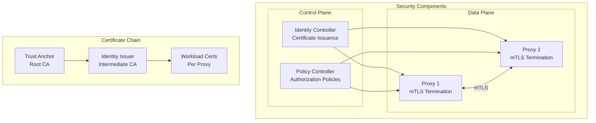
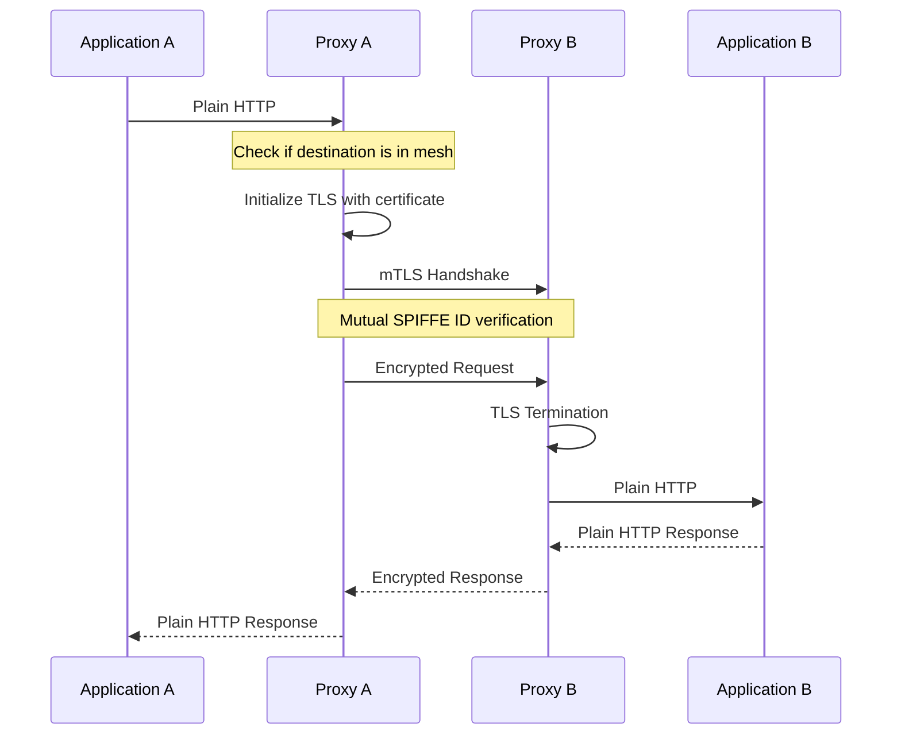
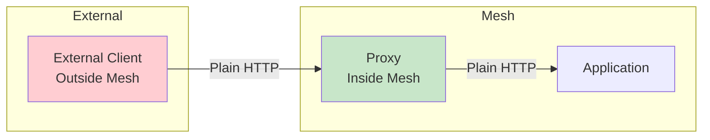
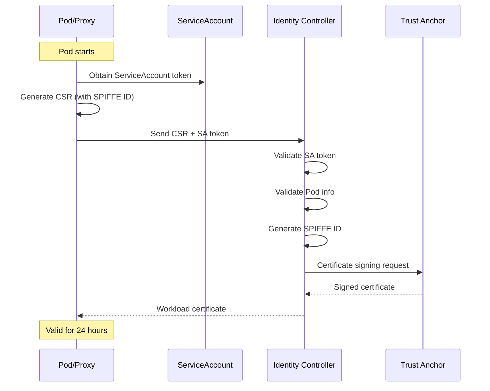
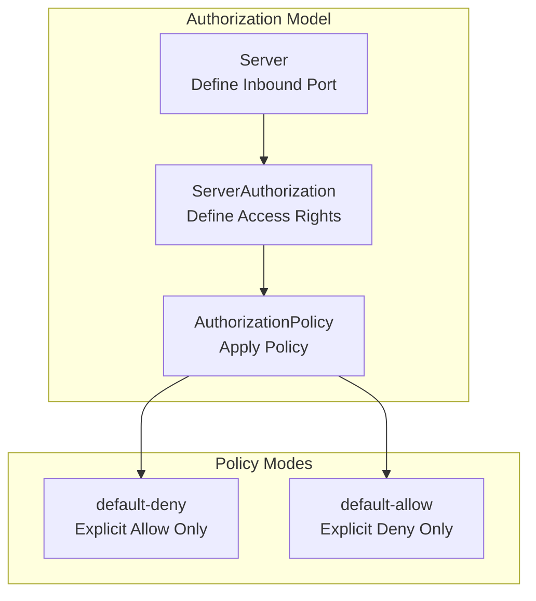
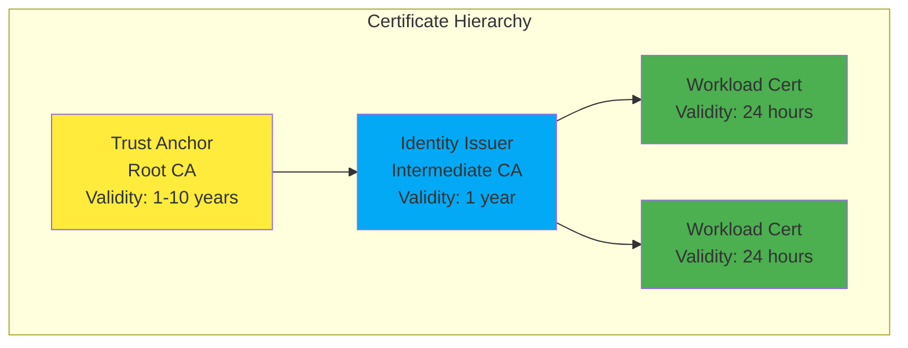
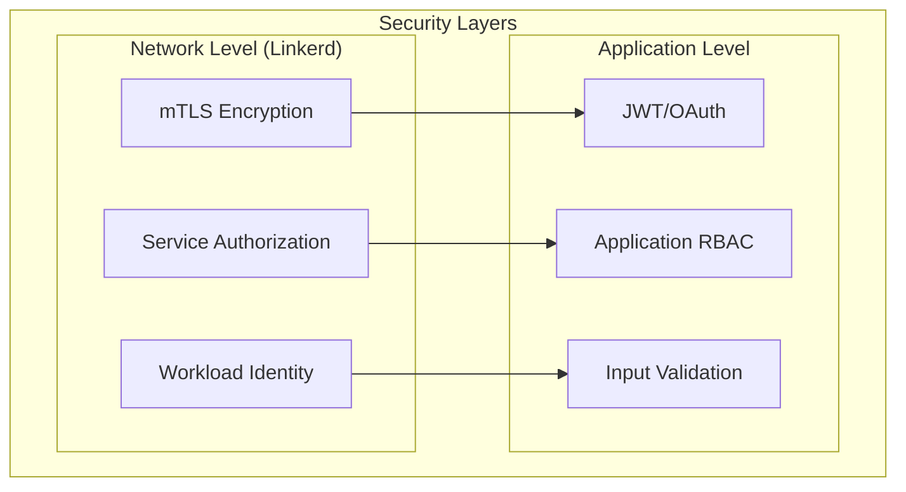

# Linkerd Security

> **Supported Versions**: Linkerd 2.16+
> **Last Updated**: February 22, 2026

## Overview

Linkerd treats security as a core value, automatically applying mTLS without any configuration. This document provides detailed explanations of automatic mTLS, workload identity system, authorization policies, certificate management, and external CA integration.

## Security Architecture



## Automatic mTLS

Linkerd's most powerful security feature is automatically encrypting all mesh traffic without any configuration.

### How mTLS Works



### mTLS Characteristics

| Characteristic | Description |
|----------------|-------------|
| Zero Configuration | Automatically enabled without any setup |
| Transparent Encryption | No application code changes required |
| Mutual Authentication | Both client and server are authenticated |
| Auto-renewal | Automatic certificate renewal before expiration |
| TLS 1.3 | Uses latest TLS protocol |

### Checking mTLS Status

```bash
# Check mesh traffic encryption status
linkerd viz edges deploy -n my-app

# Expected output:
# SRC          DST          SRC_NS    DST_NS    SECURED
# web          api          my-app    my-app    √
# api          database     my-app    my-app    √
# ingress      web          ingress   my-app    √

# Check individual connection status
linkerd viz tap deploy/web -n my-app

# TLS status is displayed:
# req id=0:0 proxy=out src=10.0.0.1:54321 dst=10.0.0.2:80 tls=true :method=GET :path=/api
```

### Non-Mesh Traffic Handling



Traffic from outside the mesh is automatically detected and processed as plaintext:

```bash
# Check non-mesh traffic
linkerd viz tap deploy/web -n my-app --method GET

# tls=false indicates traffic from outside mesh
# req id=0:0 proxy=in src=10.0.1.100:54321 dst=10.0.0.2:80 tls=false
```

## Workload Identity System

Linkerd uses a SPIFFE-compatible identity system to assign unique identities to each workload.

### SPIFFE ID Format

```
spiffe://<trust-domain>/ns/<namespace>/sa/<service-account>

# Examples:
spiffe://root.linkerd.cluster.local/ns/production/sa/web-server
spiffe://root.linkerd.cluster.local/ns/production/sa/api-gateway
spiffe://root.linkerd.cluster.local/ns/database/sa/postgres
```

### Identity Issuance Process



### Verifying Identity

```bash
# Check Pod's SPIFFE ID
kubectl exec -n my-app deploy/web -c linkerd-proxy -- \
  cat /var/run/linkerd/identity/end-entity.crt | \
  openssl x509 -noout -text | grep URI

# Example output:
# URI:spiffe://root.linkerd.cluster.local/ns/my-app/sa/web

# Check issuance in Identity Controller logs
kubectl logs -n linkerd deploy/linkerd-identity | grep "issued"
```

## Authorization Policy

Linkerd provides fine-grained access control through Server, ServerAuthorization, and AuthorizationPolicy.

### Policy Model



### Server Resource

Server defines inbound traffic for specific Pods.

```yaml
apiVersion: policy.linkerd.io/v1beta2
kind: Server
metadata:
  name: web-http
  namespace: production
spec:
  # Target Pod selection
  podSelector:
    matchLabels:
      app: web

  # Port specification
  port: 8080
  # Or specify by name
  # port: http

  # Protocol (HTTP/1, HTTP/2, gRPC, opaque)
  proxyProtocol: HTTP/1

---
# gRPC server
apiVersion: policy.linkerd.io/v1beta2
kind: Server
metadata:
  name: api-grpc
  namespace: production
spec:
  podSelector:
    matchLabels:
      app: api
  port: 9090
  proxyProtocol: gRPC

---
# TCP (opaque) server
apiVersion: policy.linkerd.io/v1beta2
kind: Server
metadata:
  name: database-tcp
  namespace: database
spec:
  podSelector:
    matchLabels:
      app: postgres
  port: 5432
  proxyProtocol: opaque
```

### ServerAuthorization Resource

ServerAuthorization defines access rights to a Server.

```yaml
apiVersion: policy.linkerd.io/v1beta2
kind: ServerAuthorization
metadata:
  name: web-authz
  namespace: production
spec:
  # Target Server
  server:
    name: web-http

  # Allowed clients
  client:
    # Mesh internal mTLS clients
    meshTLS:
      # Allow specific ServiceAccounts only
      serviceAccounts:
        - name: api-gateway
          namespace: production
        - name: monitoring
          namespace: monitoring

---
# Allow access from multiple namespaces
apiVersion: policy.linkerd.io/v1beta2
kind: ServerAuthorization
metadata:
  name: api-authz
  namespace: production
spec:
  server:
    name: api-grpc
  client:
    meshTLS:
      serviceAccounts:
        - name: web
          namespace: production
        - name: mobile-backend
          namespace: mobile
        - name: admin-service
          namespace: admin

---
# Allow all mesh clients
apiVersion: policy.linkerd.io/v1beta2
kind: ServerAuthorization
metadata:
  name: public-api-authz
  namespace: production
spec:
  server:
    name: public-api
  client:
    meshTLS:
      identities:
        - "*"  # Allow all mesh IDs

---
# Allow unauthenticated clients (health checks, etc.)
apiVersion: policy.linkerd.io/v1beta2
kind: ServerAuthorization
metadata:
  name: health-authz
  namespace: production
spec:
  server:
    name: health-server
  client:
    unauthenticated: true
```

### AuthorizationPolicy (Gateway API)

Linkerd 2.14+ also supports Gateway API's AuthorizationPolicy.

```yaml
apiVersion: policy.linkerd.io/v1alpha1
kind: AuthorizationPolicy
metadata:
  name: web-policy
  namespace: production
spec:
  # Target workload
  targetRef:
    group: core
    kind: Namespace
    name: production

  # Required authentication
  requiredAuthenticationRefs:
    - name: mesh-tls
      kind: MeshTLSAuthentication
      group: policy.linkerd.io

---
apiVersion: policy.linkerd.io/v1alpha1
kind: MeshTLSAuthentication
metadata:
  name: mesh-tls
  namespace: production
spec:
  # Allowed identities
  identities:
    - "spiffe://root.linkerd.cluster.local/ns/production/*"
    - "spiffe://root.linkerd.cluster.local/ns/monitoring/*"
```

### Policy Mode Configuration

#### Default-Deny (Recommended)

Deny all traffic by default and only allow explicitly permitted traffic:

```yaml
# Apply default-deny to namespace
apiVersion: v1
kind: Namespace
metadata:
  name: production
  annotations:
    config.linkerd.io/default-inbound-policy: deny
```

```bash
# Or global configuration
linkerd install --set policyController.defaultPolicy=deny | kubectl apply -f -

# Configure with Helm
helm install linkerd-control-plane linkerd/linkerd-control-plane \
  --set policyController.defaultPolicy=deny
```

#### Default-Allow

Allow all traffic by default (compatible with existing behavior):

```yaml
apiVersion: v1
kind: Namespace
metadata:
  name: legacy-app
  annotations:
    config.linkerd.io/default-inbound-policy: all-unauthenticated
```

#### Policy Mode Options

| Mode | Description |
|------|-------------|
| `deny` | Deny all traffic (default-deny) |
| `all-unauthenticated` | Allow all traffic |
| `all-authenticated` | Allow only mesh mTLS traffic |
| `cluster-unauthenticated` | Allow cluster internal traffic |
| `cluster-authenticated` | Allow only cluster internal mTLS traffic |

### Practical Example: Microservices Policy

```yaml
# 1. Frontend - accessible only from ingress
apiVersion: policy.linkerd.io/v1beta2
kind: Server
metadata:
  name: frontend-http
  namespace: production
spec:
  podSelector:
    matchLabels:
      app: frontend
  port: 8080
  proxyProtocol: HTTP/1

---
apiVersion: policy.linkerd.io/v1beta2
kind: ServerAuthorization
metadata:
  name: frontend-authz
  namespace: production
spec:
  server:
    name: frontend-http
  client:
    meshTLS:
      serviceAccounts:
        - name: ingress-nginx
          namespace: ingress-nginx

---
# 2. API Server - accessible only from frontend
apiVersion: policy.linkerd.io/v1beta2
kind: Server
metadata:
  name: api-http
  namespace: production
spec:
  podSelector:
    matchLabels:
      app: api
  port: 8080
  proxyProtocol: HTTP/1

---
apiVersion: policy.linkerd.io/v1beta2
kind: ServerAuthorization
metadata:
  name: api-authz
  namespace: production
spec:
  server:
    name: api-http
  client:
    meshTLS:
      serviceAccounts:
        - name: frontend
          namespace: production

---
# 3. Database - accessible only from API server
apiVersion: policy.linkerd.io/v1beta2
kind: Server
metadata:
  name: database-tcp
  namespace: production
spec:
  podSelector:
    matchLabels:
      app: postgres
  port: 5432
  proxyProtocol: opaque

---
apiVersion: policy.linkerd.io/v1beta2
kind: ServerAuthorization
metadata:
  name: database-authz
  namespace: production
spec:
  server:
    name: database-tcp
  client:
    meshTLS:
      serviceAccounts:
        - name: api
          namespace: production

---
# 4. Monitoring - Prometheus collects metrics from all services
apiVersion: policy.linkerd.io/v1beta2
kind: Server
metadata:
  name: metrics-server
  namespace: production
spec:
  podSelector:
    matchLabels:
      linkerd.io/control-plane-ns: linkerd
  port: 4191
  proxyProtocol: HTTP/1

---
apiVersion: policy.linkerd.io/v1beta2
kind: ServerAuthorization
metadata:
  name: metrics-authz
  namespace: production
spec:
  server:
    name: metrics-server
  client:
    meshTLS:
      serviceAccounts:
        - name: prometheus
          namespace: monitoring
```

## Certificate Management

### Certificate Hierarchy



### Trust Anchor Management

```bash
# Create Trust Anchor (step CLI)
step certificate create root.linkerd.cluster.local ca.crt ca.key \
  --profile root-ca \
  --no-password \
  --insecure \
  --not-after=87600h  # 10 years

# Check current Trust Anchor expiration
kubectl get secret linkerd-identity-trust-roots -n linkerd -o json | \
  jq -r '.data["ca-bundle.crt"]' | base64 -d | \
  openssl x509 -noout -enddate

# Store Trust Anchor as Secret
kubectl create secret generic linkerd-identity-trust-roots \
  --from-file=ca-bundle.crt=ca.crt \
  -n linkerd \
  --dry-run=client -o yaml | kubectl apply -f -
```

### Identity Issuer Management

```bash
# Create Issuer certificate
step certificate create identity.linkerd.cluster.local issuer.crt issuer.key \
  --profile intermediate-ca \
  --ca ca.crt \
  --ca-key ca.key \
  --no-password \
  --insecure \
  --not-after=8760h  # 1 year

# Check Issuer certificate expiration
kubectl get secret linkerd-identity-issuer -n linkerd -o json | \
  jq -r '.data["tls.crt"]' | base64 -d | \
  openssl x509 -noout -enddate

# Update Issuer Secret
kubectl create secret tls linkerd-identity-issuer \
  --cert=issuer.crt \
  --key=issuer.key \
  -n linkerd \
  --dry-run=client -o yaml | kubectl apply -f -
```

### Certificate Rotation

#### Trust Anchor Rotation (Zero Downtime)

```bash
# 1. Create new Trust Anchor
step certificate create root.linkerd.cluster.local ca-new.crt ca-new.key \
  --profile root-ca \
  --no-password \
  --insecure \
  --not-after=87600h

# 2. Create bundle (existing + new)
cat ca.crt ca-new.crt > ca-bundle.crt

# 3. Update Trust Anchor Secret
kubectl create secret generic linkerd-identity-trust-roots \
  --from-file=ca-bundle.crt=ca-bundle.crt \
  -n linkerd \
  --dry-run=client -o yaml | kubectl apply -f -

# 4. Reissue Issuer with new Trust Anchor
step certificate create identity.linkerd.cluster.local issuer-new.crt issuer-new.key \
  --profile intermediate-ca \
  --ca ca-new.crt \
  --ca-key ca-new.key \
  --no-password \
  --insecure \
  --not-after=8760h

# 5. Update Issuer Secret
kubectl create secret tls linkerd-identity-issuer \
  --cert=issuer-new.crt \
  --key=issuer-new.key \
  -n linkerd \
  --dry-run=client -o yaml | kubectl apply -f -

# 6. Restart Identity Controller
kubectl rollout restart deploy/linkerd-identity -n linkerd

# 7. Restart all proxies (progressively)
for ns in $(kubectl get ns -o name | cut -d/ -f2); do
  kubectl rollout restart deploy -n $ns
  sleep 30
done

# 8. Remove old Trust Anchor (after all proxies renewed)
cp ca-new.crt ca-bundle.crt
kubectl create secret generic linkerd-identity-trust-roots \
  --from-file=ca-bundle.crt=ca-bundle.crt \
  -n linkerd \
  --dry-run=client -o yaml | kubectl apply -f -
```

#### Automatic Rotation Monitoring

```bash
# Certificate expiration alert script
#!/bin/bash

DAYS_WARNING=30

# Check Trust Anchor
TRUST_ANCHOR_EXPIRY=$(kubectl get secret linkerd-identity-trust-roots -n linkerd -o json | \
  jq -r '.data["ca-bundle.crt"]' | base64 -d | \
  openssl x509 -noout -enddate | cut -d= -f2)

TRUST_ANCHOR_EPOCH=$(date -d "$TRUST_ANCHOR_EXPIRY" +%s)
NOW_EPOCH=$(date +%s)
DAYS_LEFT=$(( (TRUST_ANCHOR_EPOCH - NOW_EPOCH) / 86400 ))

if [ $DAYS_LEFT -lt $DAYS_WARNING ]; then
  echo "WARNING: Trust Anchor expires in $DAYS_LEFT days"
fi

# Check Issuer
ISSUER_EXPIRY=$(kubectl get secret linkerd-identity-issuer -n linkerd -o json | \
  jq -r '.data["tls.crt"]' | base64 -d | \
  openssl x509 -noout -enddate | cut -d= -f2)

ISSUER_EPOCH=$(date -d "$ISSUER_EXPIRY" +%s)
ISSUER_DAYS_LEFT=$(( (ISSUER_EPOCH - NOW_EPOCH) / 86400 ))

if [ $ISSUER_DAYS_LEFT -lt $DAYS_WARNING ]; then
  echo "WARNING: Identity Issuer expires in $ISSUER_DAYS_LEFT days"
fi
```

## External CA Integration

### cert-manager Integration

```yaml
# cert-manager Issuer configuration
apiVersion: cert-manager.io/v1
kind: Issuer
metadata:
  name: linkerd-trust-anchor
  namespace: linkerd
spec:
  ca:
    secretName: linkerd-trust-anchor

---
# Automatic Identity Issuer certificate issuance
apiVersion: cert-manager.io/v1
kind: Certificate
metadata:
  name: linkerd-identity-issuer
  namespace: linkerd
spec:
  secretName: linkerd-identity-issuer
  duration: 8760h  # 1 year
  renewBefore: 720h  # Renew 30 days before
  issuerRef:
    name: linkerd-trust-anchor
    kind: Issuer
  commonName: identity.linkerd.cluster.local
  isCA: true
  privateKey:
    algorithm: ECDSA
    size: 256
  usages:
    - cert sign
    - crl sign
    - server auth
    - client auth
```

### Vault Integration

```yaml
# Vault PKI configuration
apiVersion: cert-manager.io/v1
kind: Issuer
metadata:
  name: vault-issuer
  namespace: linkerd
spec:
  vault:
    path: pki_int/sign/linkerd-identity
    server: https://vault.example.com
    auth:
      kubernetes:
        role: linkerd-issuer
        mountPath: /v1/auth/kubernetes
        secretRef:
          name: vault-token
          key: token

---
# Issue Identity Issuer certificate from Vault
apiVersion: cert-manager.io/v1
kind: Certificate
metadata:
  name: linkerd-identity-issuer
  namespace: linkerd
spec:
  secretName: linkerd-identity-issuer
  duration: 8760h
  renewBefore: 720h
  issuerRef:
    name: vault-issuer
    kind: Issuer
  commonName: identity.linkerd.cluster.local
  isCA: true
```

### External CA Helm Configuration

```yaml
# values.yaml
identity:
  externalCA: true
  issuer:
    scheme: kubernetes.io/tls
```

```bash
# Install with external CA mode
helm install linkerd-control-plane linkerd/linkerd-control-plane \
  -n linkerd \
  --set identity.externalCA=true \
  --set-file identityTrustAnchorsPEM=ca.crt
```

## Network vs Application Security

### Security Layers



| Layer | Linkerd Role | Application Role |
|-------|--------------|------------------|
| Transport Encryption | mTLS (automatic) | HTTPS (optional) |
| Service Authentication | SPIFFE ID | API keys, JWT |
| Service Authorization | ServerAuthorization | RBAC, permission checks |
| Data Validation | - | Input validation, sanitization |

### Defense in Depth Example

```yaml
# Linkerd: Service-level authorization
apiVersion: policy.linkerd.io/v1beta2
kind: ServerAuthorization
metadata:
  name: api-authz
  namespace: production
spec:
  server:
    name: api-server
  client:
    meshTLS:
      serviceAccounts:
        - name: web
          namespace: production

---
# Application: JWT-based user authorization (pseudocode)
# @app.route('/api/admin')
# @require_role('admin')  # Application-level RBAC
# def admin_endpoint():
#     # Linkerd handles service authentication
#     # Application handles user authorization only
#     return handle_admin_request()
```

## Security Monitoring

### Policy Violation Detection

```bash
# Check denied requests
linkerd viz tap deploy/api -n production | grep "forbidden"

# Check policy events
kubectl get events -n production --field-selector reason=Forbidden

# Check authorization failures in proxy logs
kubectl logs deploy/api -n production -c linkerd-proxy | grep "authorization"
```

### Certificate Status Monitoring

```bash
# Check certificate status with linkerd check
linkerd check --proxy

# Expected output:
# linkerd-identity
# ----------------
# √ certificate config is valid
# √ trust anchors are using supported crypto algorithm
# √ trust anchors are within their validity period
# √ trust anchors are valid for at least 60 days
# √ issuer cert is using supported crypto algorithm
# √ issuer cert is within its validity period
# √ issuer cert is valid for at least 60 days
# √ issuer cert is issued by the trust anchor

# Monitor with Prometheus metrics
# identity_cert_expiration_timestamp_seconds
```

### Prometheus Alert Rules

```yaml
apiVersion: monitoring.coreos.com/v1
kind: PrometheusRule
metadata:
  name: linkerd-security-alerts
  namespace: monitoring
spec:
  groups:
  - name: linkerd-security
    rules:
    - alert: LinkerdIdentityCertExpiringSoon
      expr: |
        identity_cert_expiration_timestamp_seconds - time() < 86400 * 7
      for: 1h
      labels:
        severity: warning
      annotations:
        summary: "Linkerd identity certificate expiring soon"
        description: "Certificate will expire in less than 7 days"

    - alert: LinkerdMTLSDisabled
      expr: |
        sum(response_total{tls="false", direction="inbound"})
        / sum(response_total{direction="inbound"}) > 0.1
      for: 5m
      labels:
        severity: critical
      annotations:
        summary: "High percentage of non-mTLS traffic"
        description: "More than 10% of inbound traffic is not encrypted"
```

## Next Steps

- [Observability](./05-observability.md): Metrics and dashboards
- [Multi-cluster](./06-multi-cluster.md): Cross-cluster security
- [Best Practices](./07-best-practices.md): Production security configuration

## References

- [Linkerd Security](https://linkerd.io/2/features/automatic-mtls/)
- [Authorization Policy](https://linkerd.io/2/features/server-policy/)
- [Certificate Management](https://linkerd.io/2/tasks/automatically-rotating-control-plane-tls-credentials/)
- [SPIFFE](https://spiffe.io/)
